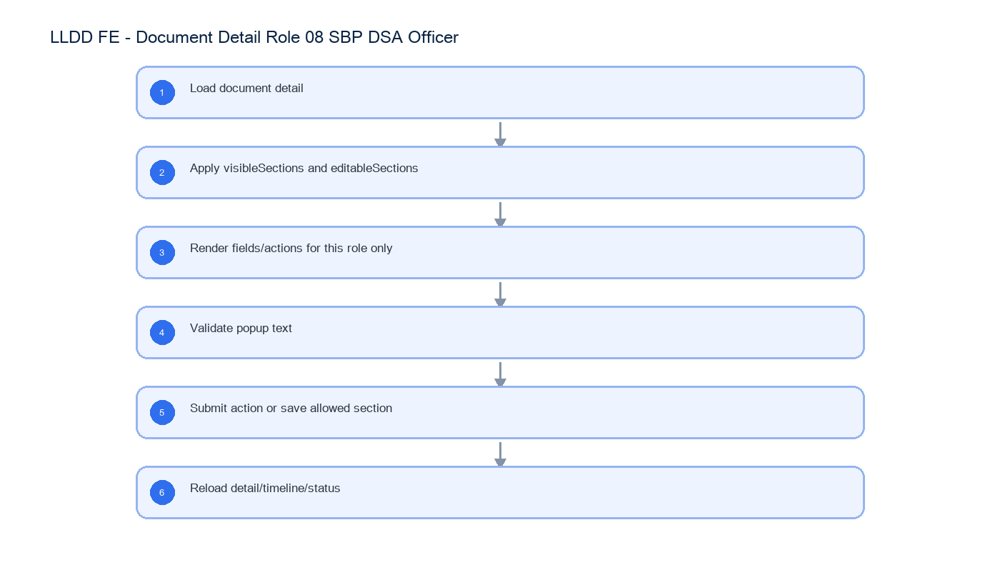

# LLDD FE - Document Detail Role 08 SBP DSA Officer

SBP Mall - ระบบประกันรายได้ | Low Level Design Document

## 1. Overview

| รายการ | รายละเอียด |
| --- | --- |
| Track | FE |
| Estimate | **13 ชั่วโมง** = implementation 10 + unit test 3 (25%) |
| Owner | Kittisak <New> Kaeowika |
| Target repository | `SBP/srm-sps-spsap-web-frontend` (sbp-portal · Next.js · `NEXT_PUBLIC_APP_TARGET=sbpm`) — เรียก API ผ่าน `SBP/srm-sps-spsap-sbp-bff` เท่านั้น ห้ามยิง store-backend ตรง |
| Objective | อธิบายหน้าจอ Document Detail สำหรับ role 08 - เจ้าหน้าที่ SBP DSA |

Common contract reference: ทุกหัวข้อ API/FE ต้องยึด LLDD-BE-API-Common-Contracts และ LLDD-FE-Integration-Contracts สำหรับ error/auth/format/pagination/action/RBAC ก่อนลงรายละเอียดเฉพาะหน้าหรือเฉพาะ endpoint

## 2. Screen / Functional Scope

- Role profile P-08 - เจ้าหน้าที่ SBP DSA
- Visible/read-only/hidden section behavior
- Editable field and validation behavior
- Attachment upload behavior
- Action panel options and API response sample

## 3. Screenshot Reference

ไม่มีภาพหน้าจอสำหรับหัวข้อนี้ — เป็นเอกสารฝั่ง Backend/Batch ที่ไม่มี UI (ภาพหน้าจอทั้งหมดอยู่ในเอกสารชุด FE)

## 4. Implementation Flow Diagram (Reference)



_รูปที่ 1: Implementation flow reference: LLDD FE - Document Detail Role 08 SBP DSA Officer_

## 5. Field, Format, and Validation

| Field / UI | Format | Validation | Behavior |
| --- | --- | --- | --- |
| roleProfileCode | P-08 | must match API response | ใช้เลือก view profile เฉพาะบทบาทนี้; แยก namespace จาก workflow section code |
| statusCode | 08 | from API | workflow status/section code ปัจจุบัน ไม่ใช่ role profile |
| visibleSections | string[] | from API | FE แสดงเฉพาะ section ใน array |
| editableSections | string[] | from API | FE เปิด input/button เฉพาะ section ใน array |
| actionOptions | array | from API | FE render radio จาก array โดยไม่ hardcode |

### 5.1 Role View Summary

| Item | Value |
| --- | --- |
| Role profile | P-08 - เจ้าหน้าที่ SBP DSA |
| Workflow section/status code | 08 |
| Document status shown | รอเจ้าหน้าที่ SBP DSA ดำเนินการ |
| Purpose on this page | ตรวจ/ยืนยันผลคำนวณเงินชดเชยและส่งผลพิจารณา |
| Editable sections | - |
| Hidden sections | - |
| Attachment upload | Allowed |

### 5.2 What This Role Sees

- เห็น section คำนวณเงินชดเชยเพิ่มเติมจากบทบาทอื่น
- section คำนวณเป็น display-only ไม่ใช่ editor
- เพิ่มเอกสารแนบและส่ง action ได้

### 5.3 Section-by-section Behavior

| Section key | UI section | State for this role | Control behavior |
| --- | --- | --- | --- |
| doc-header | ข้อมูลร้านถูกกระทบ | Read-only | แสดงข้อมูลและปิด input/editor |
| sec-sales | แนวโน้มยอดขายรายวัน | Read-only | แสดงข้อมูลและปิด input/editor |
| sec-map | แผนที่ AllMap | Read-only | แสดงข้อมูลและปิด input/editor |
| sec-newstore | ร้านเปิดใหม่ | Read-only | แสดงข้อมูลและปิด input/editor |
| sec-competitor | ร้านคู่แข่งเปิดกระทบ | Read-only | แสดงข้อมูลและปิด input/editor |
| sec-factor | ปัจจัยอื่นๆ | Read-only | แสดงข้อมูลและปิด input/editor |
| sec-attach | เอกสารแนบทั้งหมด | Read-only + Upload | ดูรายการไฟล์และเพิ่มไฟล์แนบได้ |
| sec-calc | คำนวณเงินชดเชย | Read-only | แสดงข้อมูลและปิด input/editor |
| sec-comp-history | ประวัติการชดเชย | Read-only | แสดงข้อมูลและปิด input/editor |
| sec-decision-history | ผลการพิจารณา (ประวัติ) | Read-only | แสดงข้อมูลและปิด input/editor |
| sec-action | พิจารณา / ส่งดำเนินการ | Action | แสดง radio result, textarea comment, ปุ่มส่งดำเนินการ |

### 5.4 Editable Form Fields

| Area | Fields | Validation / Behavior |
| --- | --- | --- |
| คำนวณเงินชดเชย | baseCompensationAmount, totalCompensatePercent, totalCompensationAmount, approvalLimitIndicator | read-only; แสดงเกณฑ์วงเงินอนุมัติจาก API (< 100,000 จบที่ GM · ≥ 100,000 ส่ง AVP · มติ 2026-08-18) |
| เอกสารแนบ | file, fileName, attachmentType, remark | เพิ่มไฟล์ได้; ขนาด <= 5 MB; extension ต้องอยู่ใน allowlist |
| แผงพิจารณา | result, comment | result required; comment ตาม actionOptions.requireComment |

### 5.5 Action Panel

FE ต้อง render ตัวเลือกจาก `actionOptions` ที่ API ส่งมาเท่านั้น และส่ง payload `{result,comment}` โดยไม่คำนวณปลายทาง action เอง

| Radio option | Comment rule |
| --- | --- |
| คำนวณเงินชดเชยเรียบร้อย | comment optional |
| ส่งกลับฝ่าย SBP DSA | comment ตาม actionOptions.requireComment |

### 5.6 API Response Example

#### GET /api/v1/documents/{docNo} response

```json
{
  "docNo": "2026/00123",
  "statusCode": "08",
  "viewerRbacRoleCode": "R-XX",
  "roleProfileCode": "P-08",
  "visibleSections": [
    "doc-header",
    "sec-sales",
    "sec-map",
    "sec-newstore",
    "sec-competitor",
    "sec-factor",
    "sec-attach",
    "sec-comp-history",
    "sec-decision-history",
    "sec-action",
    "sec-calc"
  ],
  "editableSections": [],
  "canUploadAttachment": true,
  "canAction": true,
  "actionOptions": [
    {
      "value": "คำนวณเงินชดเชยเรียบร้อย",
      "label": "คำนวณเงินชดเชยเรียบร้อย",
      "requireComment": false
    },
    {
      "value": "ส่งกลับฝ่าย SBP DSA",
      "label": "ส่งกลับฝ่าย SBP DSA",
      "requireComment": false
    }
  ]
}
```

### 5.7 Validation Popup Text

| Condition | Popup message |
| --- | --- |
| กดส่งดำเนินการโดยไม่เลือกผลการพิจารณา | ท่านยังไม่เลือกผลการพิจารณา กรุณาเลือกข้อมูลก่อนกดส่งดำเนินการ |
| result ที่ requireComment=true แต่ comment ว่าง | กรุณากรอกความคิดเห็นเพิ่มเติม (บังคับกรอกสำหรับผลการพิจารณานี้) ก่อนส่งดำเนินการ |
| ผลรวม %ชดเชยร้านเปิดใหม่ไม่เท่ากับ 100 | โปรดตรวจสอบ %ชดเชย ของท่าน รวมกันแล้วไม่เท่ากับ 100% |

### 5.8 Role-specific Test Checklist

| No | Test |
| --- | --- |
| 1 | เปิดด้วย roleProfileCode=P-08 แล้ว sec-calc ต้องแสดง |
| 2 | sec-calc ต้องไม่มี input/button บันทึก |
| 3 | section ร้านเปิดใหม่/คู่แข่ง/ปัจจัยต้อง read-only |
| 4 | action radio แสดงเฉพาะ 2 รายการของ role 08 |
| 5 | หลัง submit ต้อง reload detail/timeline/status |

### 5.9 Input / Progress / Output Contract

| Stage | Contract for implementation |
| --- | --- |
| Input | GET /api/v1/documents/{docNo}; POST /api/v1/documents/{docNo}/actions |
| Progress | Load document detail; Apply visibleSections and editableSections; Render fields/actions for this role only; Validate popup text |
| Output | Rendered UI state or normalized API response with status/message and audit-ready trace reference. |

### 5.90 Document Detail Role 08 SBP DSA Officer Implementation Steps

| Step | Implementation detail | Check |
| --- | --- | --- |
| Load exact profile | เรียก GET /api/v1/documents/{docNo} และยืนยัน roleProfileCode=P-08, statusCode=08 ก่อน render action state | profile mismatch ต้อง fail closed; ไม่ใช้ role switcher เพื่อจำลอง P-08 |
| Render profile sections | render เฉพาะ visibleSections ของ P-08: doc-header, sec-sales, sec-map, sec-newstore, sec-competitor, sec-factor, sec-attach, sec-comp-history, sec-decision-history, sec-action, sec-calc; ซ่อน: ไม่มี section ที่ซ่อนเพิ่มจาก profile | section ที่ซ่อนต้องไม่อยู่ใน DOM และ section key ที่ไม่รู้จักต้อง log/ignore แบบ fail closed |
| Apply edit boundary | เปิด mutation control เฉพาะ editableSections ของ P-08: ไม่มี; business section ทั้งหมด read-only | read-only section ไม่มี focusable input/save/add/delete และ payload ต้องไม่มี field นอก editableSections |
| Attachment control | canUploadAttachment=true สำหรับ SBP DSA Officer; ใช้ allowlist, 5 MB และ scan-status contract | ปุ่ม upload ตรง flag, FILE_TOO_LARGE/FILE_SCAN_BLOCKED แสดงที่ attachment section |
| Render exact action set | แสดง actionOptions ของ P-08 เท่านั้น: คำนวณเงินชดเชยเรียบร้อย; ส่งกลับฝ่าย SBP DSA; comment rules: คำนวณเงินชดเชยเรียบร้อย: comment optional; ส่งกลับฝ่าย SBP DSA: comment ตาม actionOptions.requireComment | radio label/requireComment มาจาก API และ FE ไม่คำนวณ nextSection |
| Submit and reload | ส่ง result/comment สำหรับ P-08 แล้ว invalidate detail, timeline, task/list cache | หลัง submit ต้องโหลด status/actionOptions ใหม่และไม่คง action set ของ P-08 เมื่อ workflow เปลี่ยนขั้น |

## 6. Button / User Action Mapping

| Action | Trigger | API / Service | Expected Result |
| --- | --- | --- | --- |
| Load detail | เปิดเอกสาร | GET /api/v1/documents/{docNo} | render role profile |
| Save editable section | ปุ่มบันทึก | PUT /api/v1/documents/{docNo} | ใช้เฉพาะ role ที่มี editableSections |
| Upload attachment | เลือกไฟล์ | POST /api/v1/documents/{docNo}/attachments | append attachment when allowed |
| Submit action | ปุ่มส่งดำเนินการ | POST /api/v1/documents/{docNo}/actions | submit selected result |

## 7. API Contract

### GET /api/v1/documents/{docNo}

โหลด role profile P-08 สำหรับหน้า detail

#### Query Params

```json
{
  "docNo": "2026/00123"
}
```

#### Request Field Schema

| Field | Type | Required | Constraint / Meaning |
| --- | --- | --- | --- |
| docNo | string | No | ค.ศ. YYYY/xxxxx |

#### Response

```json
{
  "docNo": "2026/00123",
  "statusCode": "08",
  "viewerRbacRoleCode": "R-XX",
  "roleProfileCode": "P-08",
  "visibleSections": [
    "doc-header",
    "sec-sales",
    "sec-map",
    "sec-newstore",
    "sec-competitor",
    "sec-factor",
    "sec-attach",
    "sec-comp-history",
    "sec-decision-history",
    "sec-action",
    "sec-calc"
  ],
  "editableSections": [],
  "actionOptions": [
    {
      "value": "คำนวณเงินชดเชยเรียบร้อย",
      "label": "คำนวณเงินชดเชยเรียบร้อย",
      "requireComment": false
    },
    {
      "value": "ส่งกลับฝ่าย SBP DSA",
      "label": "ส่งกลับฝ่าย SBP DSA",
      "requireComment": false
    }
  ]
}
```

#### Response Field Schema

| Field | Type | Required | Constraint / Meaning |
| --- | --- | --- | --- |
| docNo | string | Yes | ค.ศ. YYYY/xxxxx |
| statusCode | string | Yes | canonical code; do not replace with display label |
| viewerRbacRoleCode | string | Yes | UTF-8; use value domain described by endpoint purpose |
| roleProfileCode | string | Yes | UTF-8; use value domain described by endpoint purpose |
| visibleSections | array<string> | Yes | JSON array; element type shown in Type column |
| editableSections | array<object> | Yes | JSON array; element type shown in Type column |
| actionOptions | array<object> | Yes | JSON array; element type shown in Type column |
| actionOptions[].value | string | Yes | UTF-8; use value domain described by endpoint purpose |
| actionOptions[].label | string | Yes | UTF-8; use value domain described by endpoint purpose |
| actionOptions[].requireComment | boolean | Yes | UTF-8; use value domain described by endpoint purpose |

### POST /api/v1/documents/{docNo}/actions

ตัวอย่าง positive-path จาก section 08; Section 02 ส่งต่อ AVP (03) เมื่อยอดรวม ≥ 100,000 บาท และจบที่ GM เมื่อ < 100,000 บาท (มติ 2026-08-18)

#### Request

```json
{
  "result": "คำนวณเงินชดเชยเรียบร้อย",
  "comment": "ส่งดำเนินการตามลำดับ"
}
```

#### Request Field Schema

| Field | Type | Required | Constraint / Meaning |
| --- | --- | --- | --- |
| result | string | Yes | UTF-8; use value domain described by endpoint purpose |
| comment | string | Yes | trimmed UTF-8 Thai text; required by operation/business rule |

#### Response

```json
{
  "statusCode": "01",
  "nextSection": "01",
  "message": "submitted"
}
```

#### Response Field Schema

| Field | Type | Required | Constraint / Meaning |
| --- | --- | --- | --- |
| statusCode | string | Yes | canonical code; do not replace with display label |
| nextSection | string | Yes | canonical code; do not replace with display label |
| message | string | Yes | UTF-8; use value domain described by endpoint purpose |

## 8. Skeleton Code (โครงโค้ดตั้งต้นของหน้าจอนี้)

โค้ดชุดนี้อิง convention ของ portal เดิม `srm-sps-spsap-web-frontend` (build target `sbpm`): Next.js App Router + `'use client'`, PrimeReact ที่ห่อไว้แล้วใน `@/components/Form` และ `@/components/Table`, react-hook-form + yup, Zustand `permissionStore`, axios instance กลาง `@/lib/apiClient` และ react-query 5 — **โปรเจกต์ไม่มี chart library** จึงไม่มีโค้ดกราฟในเอกสารนี้ คัดลอกไปตั้งต้นได้ทันที แล้วเติมจุดที่กำกับ `TODO:`

#### 8.1 ผังไฟล์ที่ต้องสร้าง

โครงไฟล์อิง portal เดิม (`srm-sps-spsap-web-frontend`, target `sbpm`) — โมดูล SBPGI อยู่ใต้ `src/app/(main)/sbpgi/*` และ import ผ่าน alias `@/*` ทุกจุด

| Path ไฟล์ | หน้าที่ |
| --- | --- |
| src/app/(main)/sbpgi/documents/[docNo]/page.tsx | route page — ใช้ร่วมกับหน้า detail — view ของ workflow section 08 |
| src/components/sbpgi/document-detail/RoleView08.tsx | component — view เฉพาะ workflow section 08 (อ่าน visibleSections/editableSections จาก API) |
| src/components/sbpgi/document-detail/ActionForm08.tsx | component — ฟอร์มผลการพิจารณา (result + comment) ของ section นี้ |
| src/components/sbpgi/document-detail/DocumentSection.tsx | component ร่วม — render 1 section ตาม sectionKey (ประกาศครั้งเดียวที่ LLDD-FE-Document-Detail) |
| src/components/sbpgi/document-detail/ActionPanel.tsx | component ร่วม — กล่อง action ของหน้า detail (ประกาศครั้งเดียวที่ LLDD-FE-Document-Detail) |
| src/services/sbpgi/document.service.ts | service — เรียก BFF ผ่าน apiClient (GET, POST) |
| src/hooks/sbpgi/document.query.ts | hook — query key factory + useQuery/useMutation + invalidate |
| src/types/sbpgi/document.ts | types — request/response ตาม API contract ของเอกสารนี้ |

#### 8.2 RoleView component — view เฉพาะบทบาทของหน้า Document Detail

```tsx
'use client';
// RoleView08 — view ของหน้า Document Detail สำหรับ workflow section 08
// editableSections ตาม contract: (อ่านอย่างเดียว)
// actionOptions ที่ API ส่งให้ role นี้ (ยัง render จาก doc.actionOptions ห้าม hardcode ใน component):
//   - คำนวณเงินชดเชยเรียบร้อย (ไม่บังคับความคิดเห็น)
//   - ส่งกลับฝ่าย SBP DSA (ไม่บังคับความคิดเห็น)

import DocumentSection from '@/components/sbpgi/document-detail/DocumentSection';
import ActionPanel from '@/components/sbpgi/document-detail/ActionPanel';
import type { DocumentsDetailResponse } from '@/types/sbpgi/document';

interface Props {
  doc: DocumentsDetailResponse;
  onSubmitAction: (payload: { result: string; comment: string }) => void;
  submitting?: boolean;
}

export default function RoleView08({ doc, onSubmitAction, submitting }: Props) {
  const show = (key: string) => doc.visibleSections.includes(key);
  const editable = (key: string) => doc.editableSections.includes(key);

  return (
    <div className="flex flex-col gap-4">
      {show('doc-header') && <DocumentSection sectionKey="doc-header" doc={doc} editable={editable('doc-header')} />}
      {show('sec-sales') && <DocumentSection sectionKey="sec-sales" doc={doc} editable={editable('sec-sales')} />}
      {show('sec-map') && <DocumentSection sectionKey="sec-map" doc={doc} editable={editable('sec-map')} />}
      {show('sec-newstore') && <DocumentSection sectionKey="sec-newstore" doc={doc} editable={editable('sec-newstore')} />}
      {show('sec-competitor') && <DocumentSection sectionKey="sec-competitor" doc={doc} editable={editable('sec-competitor')} />}
      {show('sec-factor') && <DocumentSection sectionKey="sec-factor" doc={doc} editable={editable('sec-factor')} />}
      {show('sec-attach') && <DocumentSection sectionKey="sec-attach" doc={doc} editable={editable('sec-attach')} />}
      {show('sec-comp-history') && <DocumentSection sectionKey="sec-comp-history" doc={doc} editable={editable('sec-comp-history')} />}
      {doc.canAction && (
        <ActionPanel
          options={doc.actionOptions}
          onSubmit={onSubmitAction}   // TODO: บังคับกรอก comment เมื่อ option.requireComment = true
          disabled={submitting}
        />
      )}
    </div>
  );
}
```

#### 8.3 service — `src/services/sbpgi/document.service.ts`

⚠️ `src/services/sbpgi/document.service.ts` เป็น **ไฟล์ร่วมของโมดูล SBPGI** (เอกสาร FE หลายฉบับที่ใช้ domain `document` ประกาศไฟล์นี้เหมือนกัน) — เวลา implement ให้ **merge เพิ่ม** เข้าไฟล์เดิม ห้ามเขียนทับทั้งไฟล์ มิฉะนั้น type/function ของเอกสารฉบับก่อนหน้าจะหายไปเงียบ ๆ

```ts
// src/services/sbpgi/document.service.ts
// apiClient = axios instance กลาง (baseURL = bffUrl ซึ่งรวม /api/v1 แล้ว, withCredentials, refresh-token interceptor, global loading)
// ห้ามสร้าง axios instance ใหม่ และห้าม set Authorization header เอง — session อยู่ใน httpOnly cookie ของ BFF

import apiClient from '@/lib/apiClient';
import type { ApiResponse } from '@/types/sbpgi/common';
import type * as T from '@/types/sbpgi/document';

/** GET /api/v1/documents/{docNo} — โหลด role profile P-08 สำหรับหน้า detail */
export async function getDocumentsDetail(docNo: string): Promise<T.DocumentsDetailResponse> {
  const { data } = await apiClient.get<ApiResponse<T.DocumentsDetailResponse>>(`/documents/${encodeURIComponent(docNo)}`);
  return data.data;
}

/** POST /api/v1/documents/{docNo}/actions — ตัวอย่าง positive-path จาก section 08; Section 02 ส่งต่อ AVP (03) เมื่อยอดรวม ≥ 100,000 บาท และจบที่ GM เมื่อ < 100,000 บาท (มติ 2026-08-18) */
export async function createDocumentsActions(docNo: string, body: T.CreateDocumentsActionsRequest): Promise<T.CreateDocumentsActionsResponse> {
  const { data } = await apiClient.post<ApiResponse<T.CreateDocumentsActionsResponse>>(`/documents/${encodeURIComponent(docNo)}/actions`, body);
  return data.data;
}

// TODO: ยืนยันกับทีม BFF ว่า unwrap envelope { success, data } ที่ชั้นไหน (BFF หรือ FE)
```

#### 8.4 types — `src/types/sbpgi/document.ts`

⚠️ `src/types/sbpgi/document.ts` เป็น **ไฟล์ร่วมของโมดูล SBPGI** (เอกสาร FE หลายฉบับที่ใช้ domain `document` ประกาศไฟล์นี้เหมือนกัน) — เวลา implement ให้ **merge เพิ่ม** เข้าไฟล์เดิม ห้ามเขียนทับทั้งไฟล์ มิฉะนั้น type/function ของเอกสารฉบับก่อนหน้าจะหายไปเงียบ ๆ

```ts
// src/types/sbpgi/document.ts — ตรงกับตาราง API ในเอกสารนี้
// วันที่/เดือนเป็น ค.ศ. ทั้ง payload (ISO) และ display — ไม่แปลงเป็น พ.ศ. (มติ 2026-08-06)

/** GET /api/v1/documents/{docNo} — response */
export interface DocumentsDetailResponse {
  docNo: string;
  statusCode: string;
  viewerRbacRoleCode: string;
  roleProfileCode: string;
  visibleSections: string[];
  editableSections: unknown[];
  actionOptions: {
    value: string;
    label: string;
    requireComment: boolean;
  }[];
}

/** POST /api/v1/documents/{docNo}/actions — request */
export interface CreateDocumentsActionsRequest {
  result: string;
  comment: string;
}

/** POST /api/v1/documents/{docNo}/actions — response */
export interface CreateDocumentsActionsResponse {
  statusCode: string;
  nextSection: string;
  message: string;
}

// TODO: ใส่ nullable / required ให้ตรงกับ contract ฉบับล่าสุดของ BE
```

#### 8.5 react-query keys + hooks — `src/hooks/sbpgi/document.query.ts`

⚠️ `src/hooks/sbpgi/document.query.ts` เป็น **ไฟล์ร่วมของโมดูล SBPGI** (เอกสาร FE หลายฉบับที่ใช้ domain `document` ประกาศไฟล์นี้เหมือนกัน) — เวลา implement ให้ **merge เพิ่ม** เข้าไฟล์เดิม ห้ามเขียนทับทั้งไฟล์ มิฉะนั้น type/function ของเอกสารฉบับก่อนหน้าจะหายไปเงียบ ๆ

```ts
// src/hooks/sbpgi/document.query.ts
import { useMutation, useQuery, useQueryClient } from '@tanstack/react-query';
import * as api from '@/services/sbpgi/document.service';
import type * as T from '@/types/sbpgi/document';

export const documentKeys = {
  all: ['sbpgi', 'document'] as const,
  documentsDetail: (docNo: string) => [...documentKeys.all, 'documentsDetail', docNo] as const,
};

export function useDocumentsDetailQuery(docNo: string) {
  return useQuery({
    queryKey: documentKeys.documentsDetail(docNo),
    queryFn: () => api.getDocumentsDetail(docNo),
    enabled: !!docNo, // ยังไม่ยิงจนกว่าจะมีพารามิเตอร์ครบ
    staleTime: 30_000, // TODO: ปรับตามความถี่ของข้อมูลหน้านี้
  });
}

export function useCreateDocumentsActionsMutation(docNo: string) {
  const qc = useQueryClient();
  return useMutation({
    mutationFn: (body: T.CreateDocumentsActionsRequest) => api.createDocumentsActions(docNo, body),
    onSuccess: () => {
      qc.invalidateQueries({ queryKey: documentKeys.all }); // reload list/detail/timeline
    },
    // TODO: onError -> แสดง apiErrorMessage(error) ผ่าน Toast กลาง
  });
}
```

#### 8.6 ฟอร์มพิจารณา + validation — `src/components/sbpgi/document-detail/ActionForm08.tsx`

หน้านี้**ไม่มีการค้นหา** — ฟอร์มเดียวของหน้าคือฟอร์มผลการพิจารณาที่ยิง `POST /api/v1/documents/{docNo}/actions` โดยส่งได้แค่ `result` + `comment`

```tsx
'use client';
// ActionForm08 — ฟอร์ม "ผลการพิจารณา" ของ workflow section 08
// payload ที่ส่งจริงมีแค่ 2 field ตาม CreateDocumentsActionsRequest: { result, comment }
// option ที่ role นี้เห็นตาม contract (render จาก doc.actionOptions ห้าม hardcode ใน JSX):
//   - คำนวณเงินชดเชยเรียบร้อย (value='คำนวณเงินชดเชยเรียบร้อย', requireComment=false)
//   - ส่งกลับฝ่าย SBP DSA (value='ส่งกลับฝ่าย SBP DSA', requireComment=false)
// editableSections ของ role นี้ (ใช้เป็น constant สำหรับ assertion/test เท่านั้น ไม่ใช่เพื่อ hardcode การ render):
export const EDITABLE_SECTIONS_08 = [] as const;

import { Controller, useForm } from 'react-hook-form';
import { yupResolver } from '@hookform/resolvers/yup';
import * as yup from 'yup';
import { RadioButtonGroup } from '@/components/Form';
import { InputTextarea } from '@/components/Form/InputText/inputtextArea';
import type { DocumentActionRequest } from '@/types/sbpgi/common';

interface ActionOption { value: string; label: string; requireComment?: boolean }

// ค่าที่ "บังคับกรอกความคิดเห็น" มาจาก contract ของ role นี้
const REQUIRE_COMMENT: string[] = [/* TODO: ค่าที่บังคับ comment */];

// ⚠️ ข้อความ validation ด้านล่างเป็น verbatim จาก SRS v3.1 — ห้าม paraphrase ห้ามย่อ
//    (SRS "รายการหน้าจอ" §10/§13 · ตรงกับที่ prototype k2-document.html ใช้)
const schema = yup.object({
  result: yup.string().required('ท่านยังไม่เลือกผลการพิจารณา กรุณาเลือกข้อมูลก่อนกดส่งดำเนินการ'),
  // SRS บังคับให้ความคิดเห็นเป็น required เมื่อเลือกไม่ชดเชย แต่ไม่ได้ระบุข้อความ — ข้อความนี้เรากำหนดเอง
  comment: yup.string().when('result', {
    is: (v: string) => REQUIRE_COMMENT.includes(v),
    then: (s) => s.required('กรุณาระบุความคิดเห็น'),
    otherwise: (s) => s.optional(),
  }),
});

export default function ActionForm08({ options, onSubmit, onCancel, submitting }: {
  options: ActionOption[];          // = doc.actionOptions จาก API
  onSubmit: (payload: DocumentActionRequest) => void;
  onCancel?: () => void;
  submitting?: boolean;
}) {
  const { control, handleSubmit, watch, formState: { errors } } = useForm<DocumentActionRequest>({
    resolver: yupResolver(schema) as never,
    defaultValues: { result: '', comment: '' },
    mode: 'onSubmit',
  });
  const mustComment = REQUIRE_COMMENT.includes(watch('result'));

  return (
    <form onSubmit={handleSubmit(onSubmit)} className="flex flex-col gap-3">
      <Controller
        name="result"
        control={control}
        render={({ field }) => (
          <RadioButtonGroup
            options={options.map((o) => ({ label: o.label, value: o.value }))}
            value={field.value}
            onChange={(e) => field.onChange(e.value)}
            flex="col"
            gap="8px"
          />
        )}
      />
      {errors.result && <span className="text-red-600">{errors.result.message}</span>}
      <Controller
        name="comment"
        control={control}
        render={({ field }) => (
          <InputTextarea {...field} rows={4} placeholder={mustComment ? 'ระบุความคิดเห็น (บังคับ)' : 'ความคิดเห็น'} />
        )}
      />
      {errors.comment && <span className="text-red-600">{errors.comment.message}</span>}
      <div className="flex justify-end gap-2">
        <button type="submit" className="btn btn-primary" disabled={submitting}>
          ยืนยัน
        </button>
        <button type="button" className="btn btn-secondary" onClick={onCancel}>
          ยกเลิก
        </button>
      </div>
    </form>
  );
}
```

- ทุกหน้าเช็คสิทธิ์ด้วย `permissionStore.hasPermission(url, 'canView'|'canManage'|'canExport'|'canOther')` แล้ว render `<AccessDenied />` เมื่อไม่มีสิทธิ์
- เมนู/สิทธิ์มาจาก `GET /menus` และ `GET /groups/current-user/permissions` — ห้าม hardcode role หรือรายการเมนูใน FE
- session อยู่ใน httpOnly cookie ของ BFF (`withCredentials: true`) — FE ไม่เก็บและไม่แนบ token เอง
- payload และการแสดงผลใช้วันที่ ค.ศ. เสมอ ผ่าน formatter กลางจุดเดียว — ไม่แปลงเป็น พ.ศ. (มติ 2026-08-06)
- ข้อความ error แสดงจาก `error.message` ของ BE ตรง ๆ (ห้าม paraphrase) — fallback ใช้เฉพาะกรณี network error

## 9. Processing Flow

| Step | Description |
| --- | --- |
| 1 | Load document detail |
| 2 | Apply visibleSections and editableSections |
| 3 | Render fields/actions for this role only |
| 4 | Validate popup text |
| 5 | Submit action or save allowed section |
| 6 | Reload detail/timeline/status |

## 10. Acceptance Criteria

- ไม่แสดง role switcher ใน production
- section ที่ hidden ต้องไม่ render
- section ที่ read-only ต้องไม่มี editable control
- action panel ตรงกับ actionOptions จาก API

## 11. Developer Test Checklist

| No | Test |
| --- | --- |
| 1 | เปิดด้วย roleProfileCode=P-08 แล้ว sec-calc ต้องแสดง |
| 2 | sec-calc ต้องไม่มี input/button บันทึก |
| 3 | section ร้านเปิดใหม่/คู่แข่ง/ปัจจัยต้อง read-only |
| 4 | action radio แสดงเฉพาะ 2 รายการของ role 08 |
| 5 | หลัง submit ต้อง reload detail/timeline/status |

## 12. Unit Test Scope

**3 ชั่วโมง** (25% ของ implementation 10 ชั่วโมง) · เครื่องมือ: Jest + React Testing Library + msw (mock API layer)

หัวข้อนี้คือ **unit test** ที่ต้องเขียนคู่กับโค้ด — ต่างจาก *Developer Test Checklist* ซึ่งเป็น scenario ระดับ end-to-end/manual ที่ใช้ตอนตรวจรับ · รายการด้านล่าง derive จาก field/validation, acceptance criteria, endpoint และตารางที่เอกสารนี้เขียน

| สิ่งที่ทดสอบ | ประเภท | เกณฑ์ผ่าน |
| --- | --- | --- |
| `roleProfileCode` | validation | ผ่านเมื่อถูกกฎ / โยน error เมื่อผิด — กฎ: must match API response · รูปแบบ: P-08 |
| `statusCode` | validation | ผ่านเมื่อถูกกฎ / โยน error เมื่อผิด — กฎ: from API · รูปแบบ: 08 |
| `visibleSections` | validation | ผ่านเมื่อถูกกฎ / โยน error เมื่อผิด — กฎ: from API · รูปแบบ: string[] |
| `editableSections` | validation | ผ่านเมื่อถูกกฎ / โยน error เมื่อผิด — กฎ: from API · รูปแบบ: string[] |
| `actionOptions` | validation | ผ่านเมื่อถูกกฎ / โยน error เมื่อผิด — กฎ: from API · รูปแบบ: array |
| business rule | logic | ไม่แสดง role switcher ใน production |
| business rule | logic | section ที่ hidden ต้องไม่ render |
| business rule | logic | section ที่ read-only ต้องไม่มี editable control |
| business rule | logic | action panel ตรงกับ actionOptions จาก API |
| `GET /api/v1/documents/{docNo}` | api client | hook/service เรียกเส้นนี้ด้วยพารามิเตอร์ถูกต้อง · map {success:true,data} เป็น state ที่หน้าจอใช้ · เจอ {success:false,error} แล้วแสดงข้อความไทย verbatim (mock ด้วย msw) |
| `POST /api/v1/documents/{docNo}/actions` | api client | hook/service เรียกเส้นนี้ด้วยพารามิเตอร์ถูกต้อง · map {success:true,data} เป็น state ที่หน้าจอใช้ · เจอ {success:false,error} แล้วแสดงข้อความไทย verbatim (mock ด้วย msw) |
| component | render | render ด้วย React Testing Library แล้วเห็น element ตาม field/action contract ของเอกสารนี้ |
| hook/state | interaction | ยิง action แล้ว state เปลี่ยนตามที่ระบุ และเรียก API layer ที่ mock ไว้ด้วยพารามิเตอร์ถูกต้อง |
| error path | ui | API ตอบ error envelope แล้วหน้าจอต้องแสดงข้อความไทย verbatim ไม่ crash |

- ทุกเคสต้องรันได้โดยไม่ต่อ DB/บริการภายนอกจริง — mock ที่ขอบ repository/client เสมอ
- ข้อความไทยที่ยืนยันในเทสต้องเป็น verbatim ตาม SRS ห้ามพิมพ์ใหม่
- เกณฑ์ผ่านของ CI: ทุกเคสในตารางนี้มี test จริงและผ่านทั้งหมด
