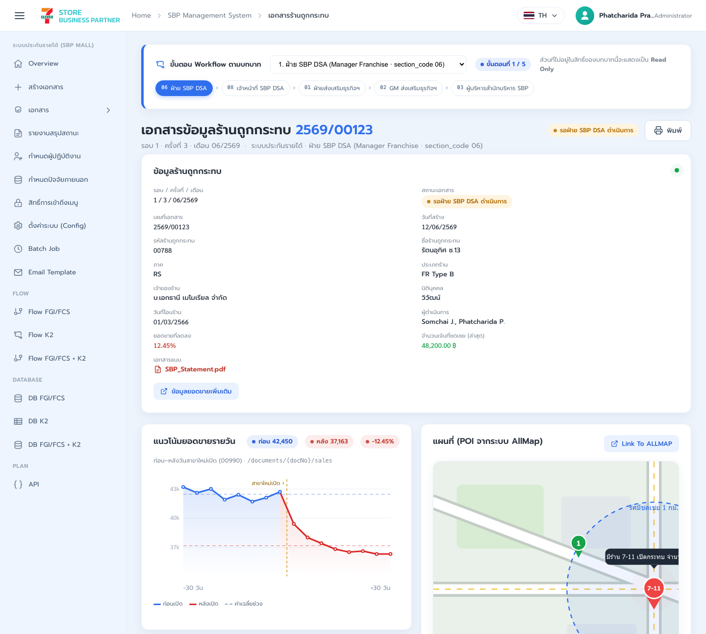
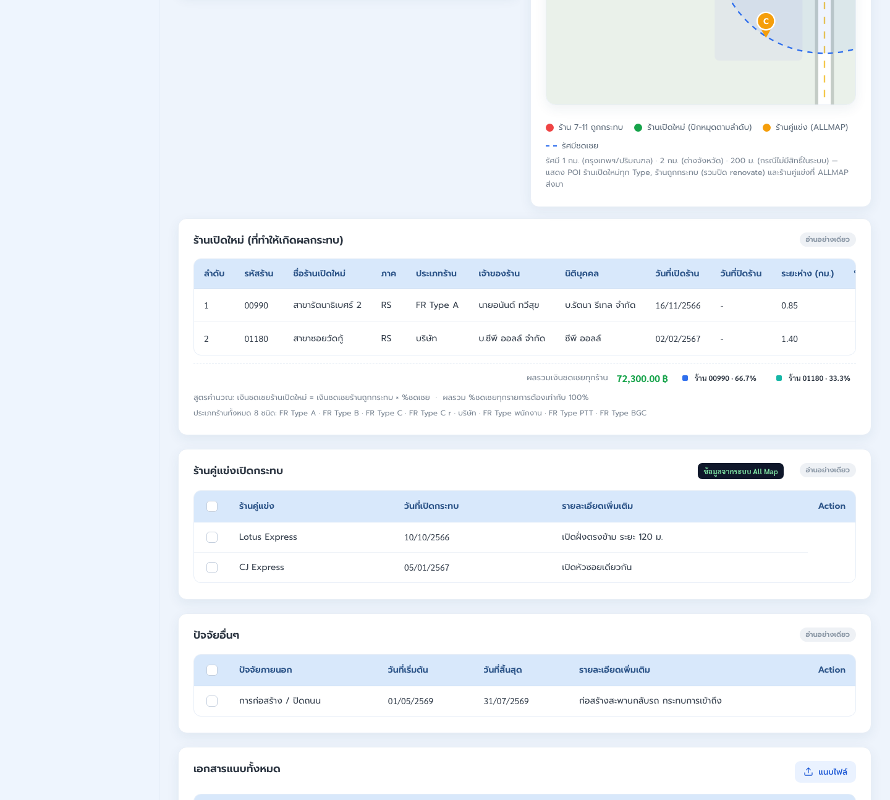
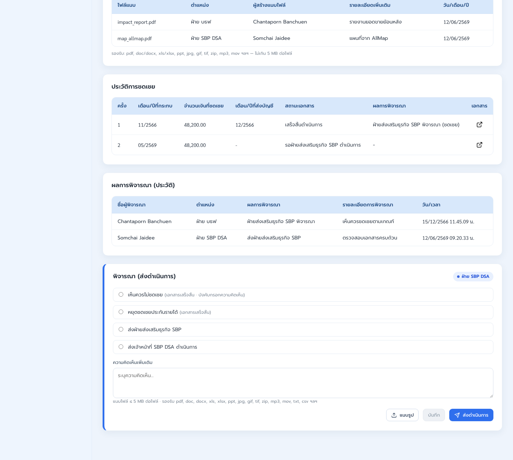
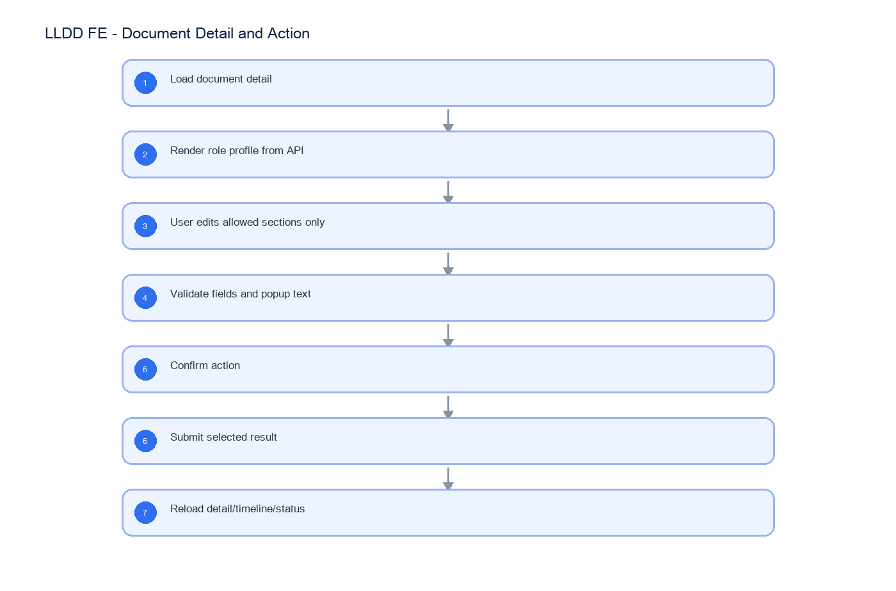

# LLDD FE - Document Detail and Action

SBP Mall - ระบบประกันรายได้ | Low Level Design Document

## 1. Overview

| รายการ | รายละเอียด |
| --- | --- |
| Track | FE |
| Estimate | 72 ชั่วโมง |
| Owner | Kittisak <New> Kaeowika |
| Objective | สร้างหน้าเอกสารรายละเอียดและ Action Panel โดยแสดงผลตาม role profile ของผู้ใช้ที่ login |

Common contract reference: ทุกหัวข้อ API/FE ต้องยึด LLDD-BE-API-Common-Contracts และ LLDD-FE-Integration-Contracts สำหรับ error/auth/format/pagination/action/RBAC ก่อนลงรายละเอียดเฉพาะหน้าหรือเฉพาะ endpoint

## 2. Screen / Functional Scope

- Document header
- Store impact/new-store/factor sections
- Role-based visible/editable sections
- Action panel by role profile
- History/timeline
- Attachment upload/download
- Map/ALLMAP link

## 3. Screenshot Reference



_รูปที่ 1: Screenshot: k2-document-01.png_



_รูปที่ 2: Screenshot: k2-document-02.png_



_รูปที่ 3: Screenshot: k2-document-03.png_

## 4. Implementation Flow Diagram (Reference)



_รูปที่ 4: Implementation flow reference: LLDD FE - Document Detail and Action_

## 5. Field, Format, and Validation

| Field / UI | Format | Validation | Behavior |
| --- | --- | --- | --- |
| docNo | YYYY/xxxxx | required when opening existing document | ใช้ปี พ.ศ. และ running 5 หลัก |
| storeCode | string 5 digits | numeric length = 5 | แสดง leading zero |
| amount | number, 2 decimals | >= 0 | format `#,##0.00` บาท |
| percent | number, 2 decimals | 0-100 | ใช้ `%` และรวม allocation ต้องเท่ากับ 100 |
| date | DD/MM/YYYY | valid date | FE แสดง พ.ศ. หาก source เป็น ISO ค.ศ. |
| attachment | file | <= 5 MB | รองรับ vsd, dwg, afp, pdf, mda, zip, wav, mp3, gif, jpg, tif, tiff, htm, html, txt, xml, mpg, mov, ivs, doc, docx, xls, xlsx, pps, ppt, pot, csv |
| result | verbatim from actionOptions | required on submit action | FE แสดง radio ตาม `actionOptions` จาก API เท่านั้น |
| comment | text | required บาง result | trim before submit |
| compensatePercent | number | sum = 100 | validate before save |

### 5.1 Role-based Render Contract (ไม่ใช่ Routing Spec)

หน้า Document Detail ต้องแสดงผลตาม role profile ที่ API ส่งมาเท่านั้น โดย role profile ระบุ visibleSections, editableSections และ actionOptions สำหรับผู้ใช้ที่ login จริง FE ไม่ต้องมี role switcher และไม่ต้องฝังตาราง action routing ใน production

#### Section Inventory

| Section key | UI section | Default display | Editable by |
| --- | --- | --- | --- |
| doc-header | ข้อมูลร้านถูกกระทบ | read-only | - |
| sec-sales | แนวโน้มยอดขายรายวัน | read-only | - |
| sec-map | แผนที่ AllMap | read-only | - |
| sec-newstore | ร้านเปิดใหม่ | read-only | role profile 01 |
| sec-competitor | ร้านคู่แข่งเปิดกระทบ | read-only | role profile 01 |
| sec-factor | ปัจจัยอื่นๆ | read-only | role profile 01 |
| sec-attach | เอกสารแนบทั้งหมด | visible + upload | all action roles upload |
| sec-calc | คำนวณเงินชดเชย | hidden | visible-only role profile 08 |
| sec-comp-history | ประวัติการชดเชย | read-only | - |
| sec-decision-history | ผลการพิจารณา (ประวัติ) | read-only | - |
| sec-action | พิจารณา / ส่งดำเนินการ | visible | current action role |

#### Role × Section Display Matrix

E = แก้ไขได้, R = อ่านอย่างเดียว, H = ซ่อน, Upload = เพิ่มเอกสารแนบได้

| Section | 06 ฝ่าย SBP DSA | 08 จนท. SBP DSA | 01 ฝ่ายส่งเสริมธุรกิจฯ | 02 GM ส่งเสริมฯ | 03 AVP สำนักบริหาร SBP |
| --- | --- | --- | --- | --- | --- |
| doc-header | R | R | R | R | R |
| sec-sales | R | R | R | R | R |
| sec-map | R | R | R | R | R |
| sec-newstore | R | R | E | R | R |
| sec-competitor | R | R | E | R | R |
| sec-factor | R | R | E | R | R |
| sec-attach | R+Upload | R+Upload | R+Upload | R+Upload | R+Upload |
| sec-calc | H | R | H | H | H |
| sec-comp-history | R | R | R | R | R |
| sec-decision-history | R | R | R | R | R |
| sec-action | Action set 06 | Action set 08 | Action set 01 | Action set 02 | Action set 03 |

#### Action Panel Options

| Role profile | Radio options shown | Required comment rule |
| --- | --- | --- |
| 06 ฝ่าย SBP DSA | เห็นควรไม่ชดเชย; หยุดชดเชยประกันรายได้; ส่งฝ่ายส่งเสริมธุรกิจ SBP; ส่งเจ้าหน้าที่ SBP DSA ดำเนินการ | บังคับเมื่อเลือก เห็นควรไม่ชดเชย |
| 08 เจ้าหน้าที่ SBP DSA | คำนวณเงินชดเชยเรียบร้อย; ส่งกลับฝ่าย SBP DSA | บังคับเมื่อ actionOptions.requireComment=true |
| 01 ฝ่ายส่งเสริมธุรกิจฯ | เห็นควรชดเชย; เห็นควรไม่ชดเชย; ฝ่าย SBP DSA ดำเนินการ (ส่งกลับ) | บังคับเมื่อเลือก เห็นควรไม่ชดเชย |
| 02 GM ส่งเสริมธุรกิจฯ | เห็นควรชดเชย; เห็นควรไม่ชดเชย; ส่งกลับฝ่ายส่งเสริมธุรกิจ SBP | บังคับเมื่อ actionOptions.requireComment=true |
| 03 AVP สำนักบริหาร SBP | เห็นควรชดเชย; เห็นควรไม่ชดเชย; ส่งกลับ GM ส่งเสริมธุรกิจฯ | บังคับเมื่อ actionOptions.requireComment=true |

#### Role Detail Documents

รายละเอียดแบบอ่านง่ายแยกตามบทบาทอยู่ในเอกสารลูก 5 ฉบับด้านล่าง เอกสารหลักนี้เก็บเฉพาะ contract กลางและ matrix รวม

| Role | เอกสารรายละเอียด | เนื้อหาหลัก |
| --- | --- | --- |
| 06 | LLDD-FE-Document-Detail-Role-06-SBP-DSA.pdf | ตรวจความครบถ้วนเบื้องต้นและเลือกส่งต่อ/ยุติตามผลพิจารณา |
| 08 | LLDD-FE-Document-Detail-Role-08-SBP-DSA-Officer.pdf | ตรวจ/ยืนยันผลคำนวณเงินชดเชยและส่งผลพิจารณา |
| 01 | LLDD-FE-Document-Detail-Role-01-Business-Promotion.pdf | ปรับข้อมูลร้านเปิดใหม่ ร้านคู่แข่ง ปัจจัยอื่น และส่งผลพิจารณา |
| 02 | LLDD-FE-Document-Detail-Role-02-GM-Business-Promotion.pdf | อ่านข้อมูลประกอบการอนุมัติวงเงินและส่งผลพิจารณา |
| 03 | LLDD-FE-Document-Detail-Role-03-AVP-SBP.pdf | อ่านข้อมูลประกอบการอนุมัติระดับสูงและส่งผลพิจารณา |

#### Validation Popup Text

| Condition | Popup message |
| --- | --- |
| กดส่งดำเนินการโดยไม่เลือกผลการพิจารณา | ท่านยังไม่เลือกผลการพิจารณา กรุณาเลือกข้อมูลก่อนกดส่งดำเนินการ |
| result ที่ requireComment=true แต่ comment ว่าง | กรุณากรอกความคิดเห็นเพิ่มเติม (บังคับกรอกสำหรับผลการพิจารณานี้) ก่อนส่งดำเนินการ |
| ผลรวม %ชดเชยร้านเปิดใหม่ไม่เท่ากับ 100 | โปรดตรวจสอบ %ชดเชย ของท่าน รวมกันแล้วไม่เท่ากับ 100% |

## 5.1 Input / Progress / Output Contract

| Stage | Contract for implementation |
| --- | --- |
| Input | GET /api/v1/documents/{docNo}; PUT /api/v1/documents/{docNo}; POST /api/v1/documents/{docNo}/actions |
| Progress | Load document detail; Render role profile from API; User edits allowed sections only; Validate fields and popup text |
| Output | Rendered UI state or normalized API response with status/message and audit-ready trace reference. |

### 5.90 Document Detail and Action Component Contract

| ID | Component / Scope | Single responsibility | Definition of done |
| --- | --- | --- | --- |
| C01 | Document header | โหลดและแสดง docNo, status, impacted store, impact month และ current operator จาก aggregate response | header refresh หลัง mutation และ status badge resolve จาก statusCode |
| C02 | Store impact/new-store/factor sections | render new-store, competitor และ factor collections ด้วย row key และ typed value mapping | ข้อมูลอ่าน/แก้/ลบตรง editableSections และ percent รวมตรวจได้ 100 |
| C03 | Role-based visible/editable sections | ใช้ visibleSections/editableSections/canAction เป็น source of truth สำหรับ DOM และ focusable controls | section ที่ซ่อนไม่อยู่ใน DOM และ read-only section ไม่มี mutation control |
| C04 | Action panel by role profile | สร้าง action radio/comment/confirm จาก actionOptions และ requireComment ที่ API ส่งมา | ไม่ hardcode route/nextSection และ block submit เมื่อ result/comment ไม่ครบ |
| C05 | History/timeline | รวม consideration history, workflow timeline และ invalidate หลัง save/upload/action | ลำดับเวลาใหม่สุดถูกต้องและข้อมูลหลัง submit ไม่ค้างจาก cache เดิม |
| C06 | Attachment upload/download | upload ด้วย allowlist/5MB/scan state และ download ผ่าน authorized BE stream | BLOCKED/PENDING ดาวน์โหลดไม่ได้และ success แสดงชื่อ/ขนาดไฟล์จาก metadata |
| C07 | Map/ALLMAP link | เปิด ALLMAP/map และ sales detail ด้วย doc/store context โดยไม่ expose credential | link/adapter ส่ง identifier ถูกตัวและ failure กลับสู่หน้า detail ได้ |

### 5.91 Document Detail and Action API Adapter Map

| Endpoint | Typed adapter purpose | Invoked by |
| --- | --- | --- |
| GET /api/v1/documents/{docNo} | โหลดรายละเอียดเอกสารพร้อม role profile สำหรับหน้า detail | Save section (ปุ่มบันทึก); Submit action (ปุ่มส่งดำเนินการ); Upload file (เลือกไฟล์); Open sales (ข้อมูลยอดขายเพิ่มเติม) |
| PUT /api/v1/documents/{docNo} | บันทึกส่วนย่อย เช่น ร้านเปิดใหม่/คู่แข่ง/ปัจจัย | Save section (ปุ่มบันทึก); Submit action (ปุ่มส่งดำเนินการ); Upload file (เลือกไฟล์); Open sales (ข้อมูลยอดขายเพิ่มเติม) |
| POST /api/v1/documents/{docNo}/actions | ส่งผลพิจารณาที่เลือกจาก actionOptions; ตัวอย่าง currentSection=01 จึงเปลี่ยนไป 02 | Submit action (ปุ่มส่งดำเนินการ) |
| POST /api/v1/documents/{docNo}/attachments | แนบไฟล์ | Upload file (เลือกไฟล์) |

### 5.92 Document Detail and Action Interaction State Machine

| Action | Trigger | API / State transition | Expected visible result |
| --- | --- | --- | --- |
| Save section | ปุ่มบันทึก | PUT /api/v1/documents/{docNo} | save partial |
| Submit action | ปุ่มส่งดำเนินการ | POST /api/v1/documents/{docNo}/actions | submit selected result and reload status |
| Upload file | เลือกไฟล์ | POST /api/v1/documents/{docNo}/attachments | append attachment |
| Open sales | ข้อมูลยอดขายเพิ่มเติม | GET /api/v1/documents/{docNo}/sales | show chart/detail |

### 5.93 Document Detail and Action Feature Failure Checks

| Case | Feature-specific scenario | Expected evidence |
| --- | --- | --- |
| FE-01 | เปิดเอกสาร | ส่วน read-only แก้ไม่ได้ |
| FE-02 | save section | % ชดเชยรวม 100 |
| FE-03 | submit without result | action required result |
| FE-04 | submit approve | upload limit 5MB |
| FE-05 | upload too large | timeline reload หลัง submit |
| FE-06 | timeline display | ส่วน read-only แก้ไม่ได้ |

## 6. Button / User Action Mapping

| Action | Trigger | API / Service | Expected Result |
| --- | --- | --- | --- |
| Save section | ปุ่มบันทึก | PUT /api/v1/documents/{docNo} | save partial |
| Submit action | ปุ่มส่งดำเนินการ | POST /api/v1/documents/{docNo}/actions | submit selected result and reload status |
| Upload file | เลือกไฟล์ | POST /api/v1/documents/{docNo}/attachments | append attachment |
| Open sales | ข้อมูลยอดขายเพิ่มเติม | GET /api/v1/documents/{docNo}/sales | show chart/detail |

## 7. API Contract

### GET /api/v1/documents/{docNo}

โหลดรายละเอียดเอกสารพร้อม role profile สำหรับหน้า detail

#### Query Params

```json
{
  "docNo": "2569/00123"
}
```

#### Request Field Schema

| Field | Type | Required | Constraint / Meaning |
| --- | --- | --- | --- |
| docNo | string | No | พ.ศ. YYYY/xxxxx |

#### Response

```json
{
  "docNo": "2569/00123",
  "statusCode": "06",
  "viewerRbacRoleCode": "R-XX",
  "roleProfileCode": "P-06",
  "visibleSections": [
    "doc-header",
    "sec-sales",
    "sec-map",
    "sec-newstore",
    "sec-competitor",
    "sec-factor",
    "sec-attach",
    "sec-comp-history",
    "sec-decision-history",
    "sec-action"
  ],
  "editableSections": [],
  "canUploadAttachment": true,
  "canAction": true,
  "actionOptions": [
    {
      "label": "เห็นควรไม่ชดเชย",
      "requireComment": true
    },
    {
      "label": "หยุดชดเชยประกันรายได้",
      "requireComment": false
    },
    {
      "label": "ส่งฝ่ายส่งเสริมธุรกิจ SBP",
      "requireComment": false
    },
    {
      "label": "ส่งเจ้าหน้าที่ SBP DSA ดำเนินการ",
      "requireComment": false
    }
  ],
  "impactedStore": {
    "storeCode": "01234"
  },
  "newStores": []
}
```

#### Response Field Schema

| Field | Type | Required | Constraint / Meaning |
| --- | --- | --- | --- |
| docNo | string | Yes | พ.ศ. YYYY/xxxxx |
| statusCode | string | Yes | canonical code; do not replace with display label |
| viewerRbacRoleCode | string | Yes | UTF-8; use value domain described by endpoint purpose |
| roleProfileCode | string | Yes | UTF-8; use value domain described by endpoint purpose |
| visibleSections | array<string> | Yes | JSON array; element type shown in Type column |
| editableSections | array<object> | Yes | JSON array; element type shown in Type column |
| canUploadAttachment | boolean | Yes | UTF-8; use value domain described by endpoint purpose |
| canAction | boolean | Yes | UTF-8; use value domain described by endpoint purpose |
| actionOptions | array<object> | Yes | JSON array; element type shown in Type column |
| actionOptions[].label | string | Yes | UTF-8; use value domain described by endpoint purpose |
| actionOptions[].requireComment | boolean | Yes | UTF-8; use value domain described by endpoint purpose |
| impactedStore | object | Yes | JSON object; nested fields listed below |
| impactedStore.storeCode | string | Yes | exactly 5 digits; preserve leading zero |
| newStores | array<object> | Yes | JSON array; element type shown in Type column |

### PUT /api/v1/documents/{docNo}

บันทึกส่วนย่อย เช่น ร้านเปิดใหม่/คู่แข่ง/ปัจจัย

#### Request

```json
{
  "newStores": [
    {
      "newStoreCode": "22864",
      "compensatePercent": 100
    }
  ]
}
```

#### Request Field Schema

| Field | Type | Required | Constraint / Meaning |
| --- | --- | --- | --- |
| newStores | array<object> | Yes | JSON array; element type shown in Type column |
| newStores[].newStoreCode | string | Yes | exactly 5 digits; preserve leading zero |
| newStores[].compensatePercent | integer | Yes | number 0..100 with 2 decimals |

#### Response

```json
{
  "message": "saved"
}
```

#### Response Field Schema

| Field | Type | Required | Constraint / Meaning |
| --- | --- | --- | --- |
| message | string | Yes | UTF-8; use value domain described by endpoint purpose |

### POST /api/v1/documents/{docNo}/actions

ส่งผลพิจารณาที่เลือกจาก actionOptions; ตัวอย่าง currentSection=01 จึงเปลี่ยนไป 02

#### Request

```json
{
  "result": "เห็นควรชดเชย",
  "comment": "เห็นควรชดเชยตามหลักเกณฑ์"
}
```

#### Request Field Schema

| Field | Type | Required | Constraint / Meaning |
| --- | --- | --- | --- |
| result | string | Yes | UTF-8; use value domain described by endpoint purpose |
| comment | string | Yes | trimmed UTF-8 Thai text; required by operation/business rule |

#### Response

```json
{
  "statusCode": "02",
  "nextSection": "02",
  "message": "submitted"
}
```

#### Response Field Schema

| Field | Type | Required | Constraint / Meaning |
| --- | --- | --- | --- |
| statusCode | string | Yes | canonical code; do not replace with display label |
| nextSection | string | Yes | canonical code; do not replace with display label |
| message | string | Yes | UTF-8; use value domain described by endpoint purpose |

### POST /api/v1/documents/{docNo}/attachments

แนบไฟล์

#### Request

```json
{
  "file": "multipart/form-data <= 5MB"
}
```

#### Request Field Schema

| Field | Type | Required | Constraint / Meaning |
| --- | --- | --- | --- |
| file | string | Yes | UTF-8; use value domain described by endpoint purpose |

#### Response

```json
{
  "attachmentId": "att-001",
  "fileName": "evidence.pdf"
}
```

#### Response Field Schema

| Field | Type | Required | Constraint / Meaning |
| --- | --- | --- | --- |
| attachmentId | string | Yes | UTF-8; use value domain described by endpoint purpose |
| fileName | string | Yes | UTF-8; use value domain described by endpoint purpose |

## 9. Processing Flow

| Step | Description |
| --- | --- |
| 1 | Load document detail |
| 2 | Render role profile from API |
| 3 | User edits allowed sections only |
| 4 | Validate fields and popup text |
| 5 | Confirm action |
| 6 | Submit selected result |
| 7 | Reload detail/timeline/status |

## 10. Acceptance Criteria

- ส่วน read-only แก้ไม่ได้
- % ชดเชยรวม 100
- action required result
- upload limit 5MB
- timeline reload หลัง submit

## 11. Developer Test Checklist

| No | Test |
| --- | --- |
| 1 | เปิดเอกสาร |
| 2 | save section |
| 3 | submit without result |
| 4 | submit approve |
| 5 | upload too large |
| 6 | timeline display |
