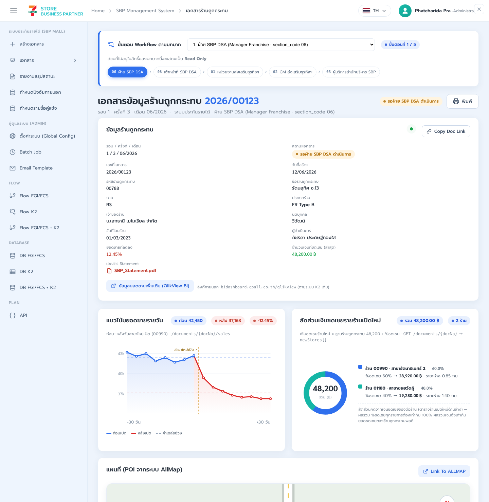
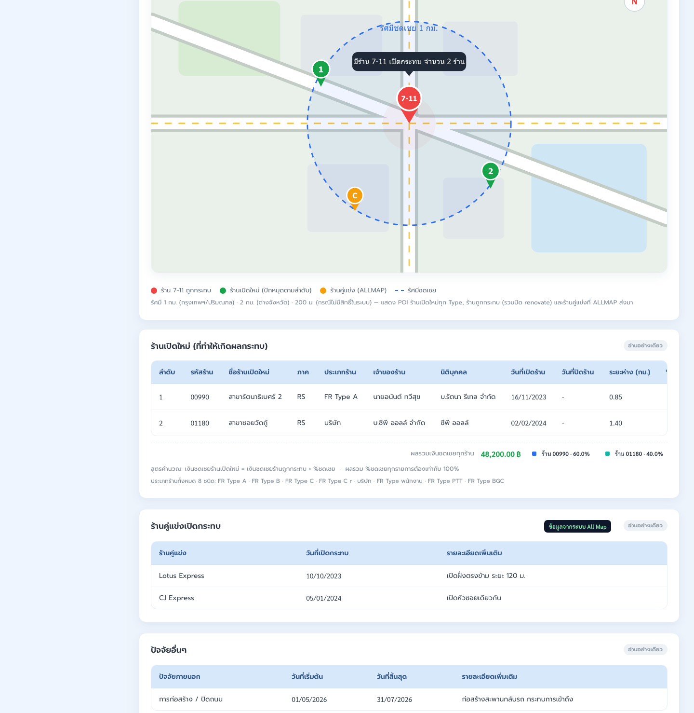
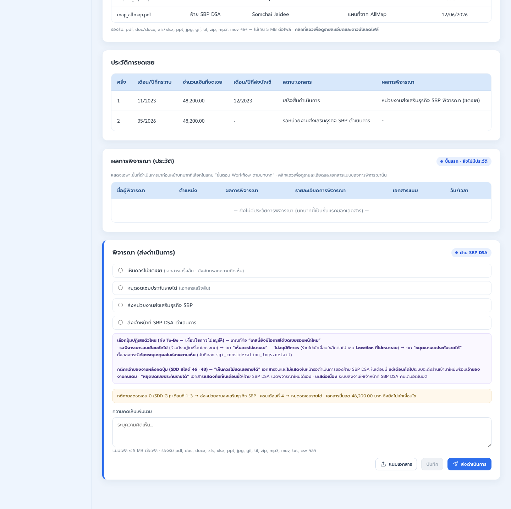
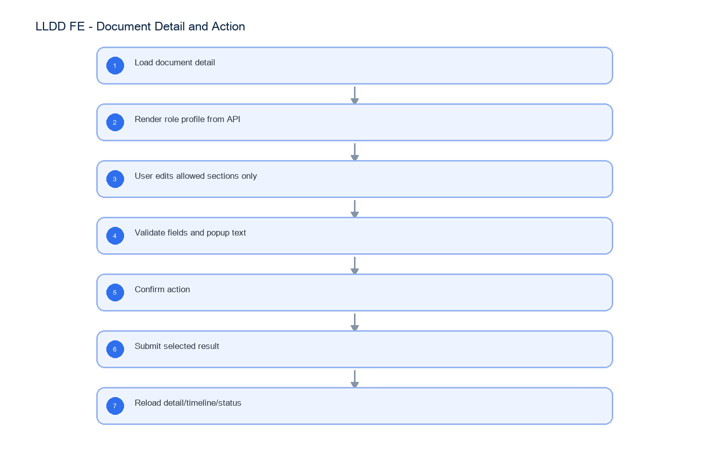

# LLDD FE - Document Detail and Action

SBP Mall - ระบบประกันรายได้ | Low Level Design Document

## 1. Overview

| รายการ | รายละเอียด |
| --- | --- |
| Track | FE |
| Estimate | 60 ชั่วโมง |
| Owner | Kittisak <New> Kaeowika |
| Objective | สร้างหน้าเอกสารรายละเอียดและ Action Panel โดยแสดงผลตาม role profile ของผู้ใช้ที่ login |

Common contract reference: ทุกหัวข้อ API/FE ต้องยึด LLDD-BE-API-Common-Contracts และ LLDD-FE-Integration-Contracts สำหรับ error/auth/format/pagination/action/RBAC ก่อนลงรายละเอียดเฉพาะหน้าหรือเฉพาะ endpoint

## 2. Screen / Functional Scope

- Document header
- Store impact/new-store/factor sections
- Role-based visible/editable sections
- Action panel by role profile
- History/timeline
- Attachment upload/download
- Map/ALLMAP link

## 3. Screenshot Reference



_รูปที่ 1: Screenshot: k2-document-01.png_



_รูปที่ 2: Screenshot: k2-document-02.png_



_รูปที่ 3: Screenshot: k2-document-03.png_

## 4. Implementation Flow Diagram (Reference)



_รูปที่ 4: Implementation flow reference: LLDD FE - Document Detail and Action_

## 5. Field, Format, and Validation

| Field / UI | Format | Validation | Behavior |
| --- | --- | --- | --- |
| docNo | YYYY/xxxxx | required when opening existing document | ใช้ปี **ค.ศ.** และ running 5 หลัก (มติ 2026-08-06) |
| storeCode | string 5 digits | numeric length = 5 | แสดง leading zero |
| amount | number, 2 decimals | >= 0 | format `#,##0.00` บาท |
| percent | number, 2 decimals | 0-100 | ใช้ `%` และรวม allocation ต้องเท่ากับ 100 |
| date | DD/MM/YYYY | valid date | payload เป็น ISO ค.ศ. · FE แสดง ค.ศ. เป็นค่าเริ่มต้น (DatePicker buddhistEra=false) แสดง พ.ศ. เฉพาะจุดที่เปิด flag |
| attachment | file | <= 5 MB | รองรับ vsd, dwg, afp, pdf, mda, zip, wav, mp3, gif, jpg, tif, tiff, htm, html, txt, xml, mpg, mov, ivs, doc, docx, xls, xlsx, pps, ppt, pot, csv |
| result | verbatim from actionOptions | required on submit action | FE แสดง radio ตาม `actionOptions` จาก API เท่านั้น · ไม่เลือกแล้วกดส่ง → popup **verbatim SRS**: `ท่านยังไม่เลือกผลการพิจารณา กรุณาเลือกข้อมูลก่อนกดส่งดำเนินการ` |
| comment | text | required บาง result | trim before submit · SRS บังคับ required เมื่อเลือกไม่ชดเชย แต่ไม่ได้ระบุข้อความ popup |
| compensatePercent | number | sum = 100 | validate before save · ไม่ครบ 100% → popup `โปรดตรวจสอบ %ชดเชย ของท่าน รวมกันแล้วไม่เท่ากับ 100%` |
| competitorCode | select จาก master competitors | required เมื่อเพิ่ม/แก้แถวคู่แข่ง | ไม่เลือก → popup **verbatim SRS §10**: `กรุณาเลือกร้านคู่แข่งที่ท่านต้องการ` |
| factor.startDate / factor.endDate | date | endDate >= startDate | **กติกา SRS §11**: วันที่สิ้นสุดต้องเท่ากับหรือมากกว่าวันที่เริ่มต้น — ถ้าน้อยกว่าต้องแสดง Pop-up แจ้งเตือน (SRS ไม่ได้ระบุข้อความ ให้ยืนยันกับ BA ก่อน UAT) |

### 5.1 Role-based Render Contract (ไม่ใช่ Routing Spec)

หน้า Document Detail ต้องแสดงผลตาม role profile ที่ API ส่งมาเท่านั้น โดย role profile ระบุ visibleSections, editableSections และ actionOptions สำหรับผู้ใช้ที่ login จริง FE ไม่ต้องมี role switcher และไม่ต้องฝังตาราง action routing ใน production

#### Section Inventory

| Section key | UI section | Default display | Editable by |
| --- | --- | --- | --- |
| doc-header | ข้อมูลร้านถูกกระทบ | read-only | - |
| sec-sales | แนวโน้มยอดขายรายวัน | read-only | - |
| sec-map | แผนที่ AllMap | read-only | - |
| sec-newstore | ร้านเปิดใหม่ | read-only | role profile 01 |
| sec-competitor | ร้านคู่แข่งเปิดกระทบ | read-only | role profile 01 |
| sec-factor | ปัจจัยอื่นๆ | read-only | role profile 01 |
| sec-attach | เอกสารแนบทั้งหมด | visible + upload | all action roles upload |
| sec-calc | คำนวณเงินชดเชย | hidden | visible-only role profile 08 |
| sec-comp-history | ประวัติการชดเชย | read-only | - |
| sec-decision-history | ผลการพิจารณา (ประวัติ) | read-only | - |
| sec-action | พิจารณา / ส่งดำเนินการ | visible | current action role |

#### Role × Section Display Matrix

E = แก้ไขได้, R = อ่านอย่างเดียว, H = ซ่อน, Upload = เพิ่มเอกสารแนบได้

| Section | 06 ฝ่าย SBP DSA | 08 จนท. SBP DSA | 01 หน่วยงานส่งเสริมธุรกิจ SBP | 02 GM ส่งเสริมฯ | 03 AVP สำนักบริหาร SBP |
| --- | --- | --- | --- | --- | --- |
| doc-header | R | R | R | R | R |
| sec-sales | R | R | R | R | R |
| sec-map | R | R | R | R | R |
| sec-newstore | R | R | E | R | R |
| sec-competitor | R | R | E | R | R |
| sec-factor | R | R | E | R | R |
| sec-attach | R+Upload | R+Upload | R+Upload | R+Upload | R+Upload |
| sec-calc | H | R | H | H | H |
| sec-comp-history | R | R | R | R | R |
| sec-decision-history | R | R | R | R | R |
| sec-action | Action set 06 | Action set 08 | Action set 01 | Action set 02 | Action set 03 |

#### Action Panel Options

| Role profile | Radio options shown | Required comment rule |
| --- | --- | --- |
| 06 ฝ่าย SBP DSA | เห็นควรไม่ชดเชย; หยุดชดเชยประกันรายได้; ส่งหน่วยงานส่งเสริมธุรกิจ SBP; ส่งเจ้าหน้าที่ SBP DSA ดำเนินการ | บังคับเมื่อเลือก เห็นควรไม่ชดเชย |
| 08 เจ้าหน้าที่ SBP DSA | คำนวณเงินชดเชยเรียบร้อย; ส่งกลับฝ่าย SBP DSA | บังคับเมื่อ actionOptions.requireComment=true |
| 01 หน่วยงานส่งเสริมธุรกิจ SBP | เห็นควรชดเชย; เห็นควรไม่ชดเชย; ฝ่าย SBP DSA ดำเนินการ (ส่งกลับ) | บังคับเมื่อเลือก เห็นควรไม่ชดเชย |
| 02 GM ส่งเสริมธุรกิจฯ | เห็นควรชดเชย; เห็นควรไม่ชดเชย; ส่งกลับหน่วยงานส่งเสริมธุรกิจ SBP | บังคับเมื่อ actionOptions.requireComment=true |
| 03 AVP สำนักบริหาร SBP | เห็นควรชดเชย; เห็นควรไม่ชดเชย; ส่งกลับ GM ส่งเสริมธุรกิจฯ | บังคับเมื่อ actionOptions.requireComment=true |

#### Role Detail Documents

รายละเอียดแบบอ่านง่ายแยกตามบทบาทอยู่ในเอกสารลูก 5 ฉบับด้านล่าง เอกสารหลักนี้เก็บเฉพาะ contract กลางและ matrix รวม

| Role | เอกสารรายละเอียด | เนื้อหาหลัก |
| --- | --- | --- |
| 06 | LLDD-FE-Document-Detail-Role-06-SBP-DSA.pdf | ตรวจความครบถ้วนเบื้องต้นและเลือกส่งต่อ/ยุติตามผลพิจารณา |
| 08 | LLDD-FE-Document-Detail-Role-08-SBP-DSA-Officer.pdf | ตรวจ/ยืนยันผลคำนวณเงินชดเชยและส่งผลพิจารณา |
| 01 | LLDD-FE-Document-Detail-Role-01-Business-Promotion.pdf | ปรับข้อมูลร้านเปิดใหม่ ร้านคู่แข่ง ปัจจัยอื่น และส่งผลพิจารณา |
| 02 | LLDD-FE-Document-Detail-Role-02-GM-Business-Promotion.pdf | อ่านข้อมูลประกอบการอนุมัติวงเงินและส่งผลพิจารณา |
| 03 | LLDD-FE-Document-Detail-Role-03-AVP-SBP.pdf | อ่านข้อมูลประกอบการอนุมัติระดับสูงและส่งผลพิจารณา |

#### Validation Popup Text

| Condition | Popup message |
| --- | --- |
| กดส่งดำเนินการโดยไม่เลือกผลการพิจารณา | ท่านยังไม่เลือกผลการพิจารณา กรุณาเลือกข้อมูลก่อนกดส่งดำเนินการ |
| result ที่ requireComment=true แต่ comment ว่าง | กรุณากรอกความคิดเห็นเพิ่มเติม (บังคับกรอกสำหรับผลการพิจารณานี้) ก่อนส่งดำเนินการ |
| ผลรวม %ชดเชยร้านเปิดใหม่ไม่เท่ากับ 100 | โปรดตรวจสอบ %ชดเชย ของท่าน รวมกันแล้วไม่เท่ากับ 100% |

## 5.1 Input / Progress / Output Contract

| Stage | Contract for implementation |
| --- | --- |
| Input | GET /api/v1/documents/{docNo}; PUT /api/v1/documents/{docNo}; POST /api/v1/documents/{docNo}/actions |
| Progress | Load document detail; Render role profile from API; User edits allowed sections only; Validate fields and popup text |
| Output | Rendered UI state or normalized API response with status/message and audit-ready trace reference. |

### 5.90 Document Detail and Action Component Contract

| ID | Component / Scope | Single responsibility | Definition of done |
| --- | --- | --- | --- |
| C01 | Document header | โหลดและแสดง docNo, status, impacted store, impact month และ current operator จาก aggregate response | header refresh หลัง mutation และ status badge resolve จาก statusCode |
| C02 | Store impact/new-store/factor sections | render new-store, competitor และ factor collections ด้วย row key และ typed value mapping | ข้อมูลอ่าน/แก้/ลบตรง editableSections และ percent รวมตรวจได้ 100 |
| C03 | Role-based visible/editable sections | ใช้ visibleSections/editableSections/canAction เป็น source of truth สำหรับ DOM และ focusable controls | section ที่ซ่อนไม่อยู่ใน DOM และ read-only section ไม่มี mutation control |
| C04 | Action panel by role profile | สร้าง action radio/comment/confirm จาก actionOptions และ requireComment ที่ API ส่งมา | ไม่ hardcode route/nextSection และ block submit เมื่อ result/comment ไม่ครบ |
| C05 | History/timeline | รวม consideration history, workflow timeline และ invalidate หลัง save/upload/action | ลำดับเวลาใหม่สุดถูกต้องและข้อมูลหลัง submit ไม่ค้างจาก cache เดิม |
| C06 | Attachment upload/download | upload ด้วย allowlist/5MB/scan state และ download ผ่าน authorized BE stream | BLOCKED/PENDING ดาวน์โหลดไม่ได้และ success แสดงชื่อ/ขนาดไฟล์จาก metadata |
| C07 | Map/ALLMAP link | เปิด ALLMAP/map และ sales detail ด้วย doc/store context โดยไม่ expose credential | link/adapter ส่ง identifier ถูกตัวและ failure กลับสู่หน้า detail ได้ |

### 5.91 Document Detail and Action API Adapter Map

| Endpoint | Typed adapter purpose | Invoked by |
| --- | --- | --- |
| GET /api/v1/documents/{docNo} | โหลดรายละเอียดเอกสารพร้อม role profile สำหรับหน้า detail | Save section (ปุ่มบันทึก); Submit action (ปุ่มส่งดำเนินการ); Upload file (เลือกไฟล์); Open sales (ข้อมูลยอดขายเพิ่มเติม) |
| PUT /api/v1/documents/{docNo} | บันทึกส่วนย่อย เช่น ร้านเปิดใหม่/คู่แข่ง/ปัจจัย | Save section (ปุ่มบันทึก); Submit action (ปุ่มส่งดำเนินการ); Upload file (เลือกไฟล์); Open sales (ข้อมูลยอดขายเพิ่มเติม) |
| POST /api/v1/documents/{docNo}/actions | ส่งผลพิจารณาที่เลือกจาก actionOptions; ตัวอย่าง currentSection=01 จึงเปลี่ยนไป 02 | Submit action (ปุ่มส่งดำเนินการ) |
| POST /api/v1/documents/{docNo}/attachments | แนบไฟล์ | Upload file (เลือกไฟล์) |

### 5.92 Document Detail and Action Interaction State Machine

| Action | Trigger | API / State transition | Expected visible result |
| --- | --- | --- | --- |
| Save section | ปุ่มบันทึก | PUT /api/v1/documents/{docNo} | save partial |
| Submit action | ปุ่มส่งดำเนินการ | POST /api/v1/documents/{docNo}/actions | submit selected result and reload status |
| Upload file | เลือกไฟล์ | POST /api/v1/documents/{docNo}/attachments | append attachment |
| Open sales | ข้อมูลยอดขายเพิ่มเติม | GET /api/v1/documents/{docNo}/sales | show chart/detail |

### 5.93 Document Detail and Action Feature Failure Checks

| Case | Feature-specific scenario | Expected evidence |
| --- | --- | --- |
| FE-01 | เปิดเอกสาร | ส่วน read-only แก้ไม่ได้ |
| FE-02 | save section | % ชดเชยรวม 100 |
| FE-03 | submit without result | action required result |
| FE-04 | submit approve | upload limit 5MB |
| FE-05 | upload too large | timeline reload หลัง submit |
| FE-06 | timeline display | ส่วน read-only แก้ไม่ได้ |

## 6. Button / User Action Mapping

| Action | Trigger | API / Service | Expected Result |
| --- | --- | --- | --- |
| Save section | ปุ่มบันทึก | PUT /api/v1/documents/{docNo} | save partial |
| Submit action | ปุ่มส่งดำเนินการ | POST /api/v1/documents/{docNo}/actions | submit selected result and reload status |
| Upload file | เลือกไฟล์ | POST /api/v1/documents/{docNo}/attachments | append attachment |
| Open sales | ข้อมูลยอดขายเพิ่มเติม | GET /api/v1/documents/{docNo}/sales | show chart/detail |

## 7. API Contract

### GET /api/v1/documents/{docNo}

โหลดรายละเอียดเอกสารพร้อม role profile สำหรับหน้า detail

#### Query Params

```json
{
  "docNo": "2026/00123"
}
```

#### Request Field Schema

| Field | Type | Required | Constraint / Meaning |
| --- | --- | --- | --- |
| docNo | string | No | ค.ศ. YYYY/xxxxx |

#### Response

```json
{
  "docNo": "2026/00123",
  "statusCode": "06",
  "viewerRbacRoleCode": "R-XX",
  "roleProfileCode": "P-06",
  "visibleSections": [
    "doc-header",
    "sec-sales",
    "sec-map",
    "sec-newstore",
    "sec-competitor",
    "sec-factor",
    "sec-attach",
    "sec-comp-history",
    "sec-decision-history",
    "sec-action"
  ],
  "editableSections": [],
  "canUploadAttachment": true,
  "canAction": true,
  "actionOptions": [
    {
      "label": "เห็นควรไม่ชดเชย",
      "requireComment": true
    },
    {
      "label": "หยุดชดเชยประกันรายได้",
      "requireComment": false
    },
    {
      "label": "ส่งหน่วยงานส่งเสริมธุรกิจ SBP",
      "requireComment": false
    },
    {
      "label": "ส่งเจ้าหน้าที่ SBP DSA ดำเนินการ",
      "requireComment": false
    }
  ],
  "impactedStore": {
    "storeCode": "01234"
  },
  "newStores": []
}
```

#### Response Field Schema

| Field | Type | Required | Constraint / Meaning |
| --- | --- | --- | --- |
| docNo | string | Yes | ค.ศ. YYYY/xxxxx |
| statusCode | string | Yes | canonical code; do not replace with display label |
| viewerRbacRoleCode | string | Yes | UTF-8; use value domain described by endpoint purpose |
| roleProfileCode | string | Yes | UTF-8; use value domain described by endpoint purpose |
| visibleSections | array<string> | Yes | JSON array; element type shown in Type column |
| editableSections | array<object> | Yes | JSON array; element type shown in Type column |
| canUploadAttachment | boolean | Yes | UTF-8; use value domain described by endpoint purpose |
| canAction | boolean | Yes | UTF-8; use value domain described by endpoint purpose |
| actionOptions | array<object> | Yes | JSON array; element type shown in Type column |
| actionOptions[].label | string | Yes | UTF-8; use value domain described by endpoint purpose |
| actionOptions[].requireComment | boolean | Yes | UTF-8; use value domain described by endpoint purpose |
| impactedStore | object | Yes | JSON object; nested fields listed below |
| impactedStore.storeCode | string | Yes | exactly 5 digits; preserve leading zero |
| newStores | array<object> | Yes | JSON array; element type shown in Type column |

### PUT /api/v1/documents/{docNo}

บันทึกส่วนย่อย เช่น ร้านเปิดใหม่/คู่แข่ง/ปัจจัย

#### Request

```json
{
  "newStores": [
    {
      "newStoreCode": "22864",
      "compensatePercent": 100
    }
  ]
}
```

#### Request Field Schema

| Field | Type | Required | Constraint / Meaning |
| --- | --- | --- | --- |
| newStores | array<object> | Yes | JSON array; element type shown in Type column |
| newStores[].newStoreCode | string | Yes | exactly 5 digits; preserve leading zero |
| newStores[].compensatePercent | integer | Yes | number 0..100 with 2 decimals |

#### Response

```json
{
  "message": "saved"
}
```

#### Response Field Schema

| Field | Type | Required | Constraint / Meaning |
| --- | --- | --- | --- |
| message | string | Yes | UTF-8; use value domain described by endpoint purpose |

### POST /api/v1/documents/{docNo}/actions

ส่งผลพิจารณาที่เลือกจาก actionOptions; ตัวอย่าง currentSection=01 จึงเปลี่ยนไป 02

#### Request

```json
{
  "result": "เห็นควรชดเชย",
  "comment": "เห็นควรชดเชยตามหลักเกณฑ์"
}
```

#### Request Field Schema

| Field | Type | Required | Constraint / Meaning |
| --- | --- | --- | --- |
| result | string | Yes | UTF-8; use value domain described by endpoint purpose |
| comment | string | Yes | trimmed UTF-8 Thai text; required by operation/business rule |

#### Response

```json
{
  "statusCode": "02",
  "nextSection": "02",
  "message": "submitted"
}
```

#### Response Field Schema

| Field | Type | Required | Constraint / Meaning |
| --- | --- | --- | --- |
| statusCode | string | Yes | canonical code; do not replace with display label |
| nextSection | string | Yes | canonical code; do not replace with display label |
| message | string | Yes | UTF-8; use value domain described by endpoint purpose |

### POST /api/v1/documents/{docNo}/attachments

แนบไฟล์

#### Request

```json
{
  "file": "multipart/form-data <= 5MB"
}
```

#### Request Field Schema

| Field | Type | Required | Constraint / Meaning |
| --- | --- | --- | --- |
| file | string | Yes | UTF-8; use value domain described by endpoint purpose |

#### Response

```json
{
  "attachmentId": "att-001",
  "fileName": "evidence.pdf"
}
```

#### Response Field Schema

| Field | Type | Required | Constraint / Meaning |
| --- | --- | --- | --- |
| attachmentId | string | Yes | UTF-8; use value domain described by endpoint purpose |
| fileName | string | Yes | UTF-8; use value domain described by endpoint purpose |

## 8. Skeleton Code (โครงโค้ดตั้งต้นของหน้าจอนี้)

โค้ดชุดนี้อิง convention ของ portal เดิม `srm-sps-spsap-web-frontend` (build target `sbpm`): Next.js App Router + `'use client'`, PrimeReact ที่ห่อไว้แล้วใน `@/components/Form` และ `@/components/Table`, react-hook-form + yup, Zustand `permissionStore`, axios instance กลาง `@/lib/apiClient` และ react-query 5 — **โปรเจกต์ไม่มี chart library** จึงไม่มีโค้ดกราฟในเอกสารนี้ คัดลอกไปตั้งต้นได้ทันที แล้วเติมจุดที่กำกับ `TODO:`

#### 8.1 ผังไฟล์ที่ต้องสร้าง

โครงไฟล์อิง portal เดิม (`srm-sps-spsap-web-frontend`, target `sbpm`) — โมดูล SBPGI อยู่ใต้ `src/app/(main)/sbpgi/*` และ import ผ่าน alias `@/*` ทุกจุด

| Path ไฟล์ | หน้าที่ |
| --- | --- |
| src/app/(main)/sbpgi/documents/[docNo]/page.tsx | route page — หน้ารายละเอียดเอกสาร + action panel ตาม role profile |
| src/components/sbpgi/document-detail/DocumentSection.tsx | component — render 1 section ตาม sectionKey + editable |
| src/components/sbpgi/document-detail/ActionPanel.tsx | component — radio ผลการพิจารณา + comment + ปุ่มยืนยัน |
| src/services/sbpgi/document.service.ts | service — เรียก BFF ผ่าน apiClient (GET, POST, PUT) |
| src/hooks/sbpgi/document.query.ts | hook — query key factory + useQuery/useMutation + invalidate |
| src/types/sbpgi/document.ts | types — request/response ตาม API contract ของเอกสารนี้ |

#### 8.2 page.tsx — หน้ารายละเอียดเอกสาร (section gating จาก API)

```tsx
'use client';
// หน้ารายละเอียดเอกสาร + action panel ตาม role profile
// route: /sbpgi/documents/[docNo]

import { useParams } from 'next/navigation';
import AccessDenied from '@/components/Permission/AccessDenied';
import { permissionStore } from '@/stores/permissionStore';
import DocumentSection from '@/components/sbpgi/document-detail/DocumentSection';
import ActionPanel from '@/components/sbpgi/document-detail/ActionPanel';
import { useDocumentsDetailQuery, useCreateDocumentsActionsMutation } from '@/hooks/sbpgi/document.query';

const PAGE_URL = '/sbpgi/documents';

export default function DocumentDetailPage() {
  const params = useParams<{ docNo: string }>();
  const docNo = decodeURIComponent(params.docNo); // docNo = 'YYYY/xxxxx' จึงถูก encode ใน route param
  const { hasPermission, isPermissionLoaded } = permissionStore();
  const { data: doc, isLoading } = useDocumentsDetailQuery(docNo);
  const submitAction = useCreateDocumentsActionsMutation(docNo);

  // สิทธิ์แสดง/แก้ไขแต่ละ section มาจาก API เท่านั้น — FE ห้ามคำนวณจาก role เอง
  const show = (key: string) => !!doc?.visibleSections?.includes(key);
  const editable = (key: string) => !!doc?.editableSections?.includes(key);

  if (!isPermissionLoaded) return null;
  if (!hasPermission(PAGE_URL, 'canView')) return <AccessDenied />;
  if (isLoading || !doc) return null; // TODO: ใส่ skeleton loading ตาม design

  return (
    <div className="flex flex-col gap-4 p-4">
      <h1 className="text-xl font-semibold">เอกสารเลขที่ {doc.docNo}</h1>
      {show('doc-header') && <DocumentSection sectionKey="doc-header" doc={doc} editable={editable('doc-header')} />}
      {show('sec-sales') && <DocumentSection sectionKey="sec-sales" doc={doc} editable={editable('sec-sales')} />}
      {show('sec-map') && <DocumentSection sectionKey="sec-map" doc={doc} editable={editable('sec-map')} />}
      {show('sec-newstore') && <DocumentSection sectionKey="sec-newstore" doc={doc} editable={editable('sec-newstore')} />}
      {show('sec-competitor') && <DocumentSection sectionKey="sec-competitor" doc={doc} editable={editable('sec-competitor')} />}
      {show('sec-factor') && <DocumentSection sectionKey="sec-factor" doc={doc} editable={editable('sec-factor')} />}
      {show('sec-attach') && <DocumentSection sectionKey="sec-attach" doc={doc} editable={editable('sec-attach')} />}
      {show('sec-comp-history') && <DocumentSection sectionKey="sec-comp-history" doc={doc} editable={editable('sec-comp-history')} />}
      {doc.canAction && (
        <ActionPanel
          options={doc.actionOptions}  // render radio จาก actionOptions เท่านั้น ห้าม hardcode
          onSubmit={(payload) => submitAction.mutate(payload)} // payload = { result, comment } เท่านั้น
          disabled={submitAction.isPending}
        />
      )}
    </div>
  );
}
```

#### 8.3 service — `src/services/sbpgi/document.service.ts`

⚠️ `src/services/sbpgi/document.service.ts` เป็น **ไฟล์ร่วมของโมดูล SBPGI** (เอกสาร FE หลายฉบับที่ใช้ domain `document` ประกาศไฟล์นี้เหมือนกัน) — เวลา implement ให้ **merge เพิ่ม** เข้าไฟล์เดิม ห้ามเขียนทับทั้งไฟล์ มิฉะนั้น type/function ของเอกสารฉบับก่อนหน้าจะหายไปเงียบ ๆ

```ts
// src/services/sbpgi/document.service.ts
// apiClient = axios instance กลาง (baseURL = bffUrl ซึ่งรวม /api/v1 แล้ว, withCredentials, refresh-token interceptor, global loading)
// ห้ามสร้าง axios instance ใหม่ และห้าม set Authorization header เอง — session อยู่ใน httpOnly cookie ของ BFF

import apiClient from '@/lib/apiClient';
import type { ApiResponse } from '@/types/sbpgi/common';
import type * as T from '@/types/sbpgi/document';

/** GET /api/v1/documents/{docNo} — โหลดรายละเอียดเอกสารพร้อม role profile สำหรับหน้า detail */
export async function getDocumentsDetail(docNo: string): Promise<T.DocumentsDetailResponse> {
  const { data } = await apiClient.get<ApiResponse<T.DocumentsDetailResponse>>(`/documents/${encodeURIComponent(docNo)}`);
  return data.data;
}

/** PUT /api/v1/documents/{docNo} — บันทึกส่วนย่อย เช่น ร้านเปิดใหม่/คู่แข่ง/ปัจจัย */
export async function updateDocuments(docNo: string, body: T.UpdateDocumentsRequest): Promise<T.UpdateDocumentsResponse> {
  const { data } = await apiClient.put<ApiResponse<T.UpdateDocumentsResponse>>(`/documents/${encodeURIComponent(docNo)}`, body);
  return data.data;
}

/** POST /api/v1/documents/{docNo}/actions — ส่งผลพิจารณาที่เลือกจาก actionOptions; ตัวอย่าง currentSection=01 จึงเปลี่ยนไป 02 */
export async function createDocumentsActions(docNo: string, body: T.CreateDocumentsActionsRequest): Promise<T.CreateDocumentsActionsResponse> {
  const { data } = await apiClient.post<ApiResponse<T.CreateDocumentsActionsResponse>>(`/documents/${encodeURIComponent(docNo)}/actions`, body);
  return data.data;
}

/** POST /api/v1/documents/{docNo}/attachments — แนบไฟล์ */
export async function createDocumentsAttachments(docNo: string, body: T.CreateDocumentsAttachmentsRequest): Promise<T.CreateDocumentsAttachmentsResponse> {
  const form = new FormData();
  form.append('file', body.file); // TODO: ตรวจขนาด <= 5MB และนามสกุลที่อนุญาตก่อนเรียก
  const { data } = await apiClient.post<ApiResponse<T.CreateDocumentsAttachmentsResponse>>(`/documents/${encodeURIComponent(docNo)}/attachments`, form, {
    headers: { 'Content-Type': 'multipart/form-data' },
  });
  return data.data;
}

// TODO: ยืนยันกับทีม BFF ว่า unwrap envelope { success, data } ที่ชั้นไหน (BFF หรือ FE)
```

#### 8.4 types — `src/types/sbpgi/document.ts`

⚠️ `src/types/sbpgi/document.ts` เป็น **ไฟล์ร่วมของโมดูล SBPGI** (เอกสาร FE หลายฉบับที่ใช้ domain `document` ประกาศไฟล์นี้เหมือนกัน) — เวลา implement ให้ **merge เพิ่ม** เข้าไฟล์เดิม ห้ามเขียนทับทั้งไฟล์ มิฉะนั้น type/function ของเอกสารฉบับก่อนหน้าจะหายไปเงียบ ๆ

```ts
// src/types/sbpgi/document.ts — ตรงกับตาราง API ในเอกสารนี้
// วันที่/เดือนเป็น ค.ศ. ทั้ง payload (ISO) และ display — ไม่แปลงเป็น พ.ศ. (มติ 2026-08-06)

/** GET /api/v1/documents/{docNo} — response */
export interface DocumentsDetailResponse {
  docNo: string;
  statusCode: string;
  viewerRbacRoleCode: string;
  roleProfileCode: string;
  visibleSections: string[];
  editableSections: unknown[];
  canUploadAttachment: boolean;
  canAction: boolean;
  actionOptions: {
    label: string;
    requireComment: boolean;
  }[];
  impactedStore: {
    storeCode: string;
  };
  newStores: unknown[];
}

/** PUT /api/v1/documents/{docNo} — request */
export interface UpdateDocumentsRequest {
  newStores: {
    newStoreCode: string;
    compensatePercent: number;
  }[];
}

/** PUT /api/v1/documents/{docNo} — response */
export interface UpdateDocumentsResponse {
  message: string;
}

/** POST /api/v1/documents/{docNo}/actions — request */
export interface CreateDocumentsActionsRequest {
  result: string;
  comment: string;
}

/** POST /api/v1/documents/{docNo}/actions — response */
export interface CreateDocumentsActionsResponse {
  statusCode: string;
  nextSection: string;
  message: string;
}

// endpoint ที่เหลือของเอกสารนี้ — TODO: แทน placeholder ด้วย interface เต็มรูปแบบเดียวกับข้างบน
export type CreateDocumentsAttachmentsRequest = Record<string, unknown>;
export type CreateDocumentsAttachmentsResponse = Record<string, unknown>;
// TODO: ใส่ nullable / required ให้ตรงกับ contract ฉบับล่าสุดของ BE
```

#### 8.5 react-query keys + hooks — `src/hooks/sbpgi/document.query.ts`

⚠️ `src/hooks/sbpgi/document.query.ts` เป็น **ไฟล์ร่วมของโมดูล SBPGI** (เอกสาร FE หลายฉบับที่ใช้ domain `document` ประกาศไฟล์นี้เหมือนกัน) — เวลา implement ให้ **merge เพิ่ม** เข้าไฟล์เดิม ห้ามเขียนทับทั้งไฟล์ มิฉะนั้น type/function ของเอกสารฉบับก่อนหน้าจะหายไปเงียบ ๆ

```ts
// src/hooks/sbpgi/document.query.ts
import { useMutation, useQuery, useQueryClient } from '@tanstack/react-query';
import * as api from '@/services/sbpgi/document.service';
import type * as T from '@/types/sbpgi/document';

export const documentKeys = {
  all: ['sbpgi', 'document'] as const,
  documentsDetail: (docNo: string) => [...documentKeys.all, 'documentsDetail', docNo] as const,
};

export function useDocumentsDetailQuery(docNo: string) {
  return useQuery({
    queryKey: documentKeys.documentsDetail(docNo),
    queryFn: () => api.getDocumentsDetail(docNo),
    enabled: !!docNo, // ยังไม่ยิงจนกว่าจะมีพารามิเตอร์ครบ
    staleTime: 30_000, // TODO: ปรับตามความถี่ของข้อมูลหน้านี้
  });
}

export function useUpdateDocumentsMutation(docNo: string) {
  const qc = useQueryClient();
  return useMutation({
    mutationFn: (body: T.UpdateDocumentsRequest) => api.updateDocuments(docNo, body),
    onSuccess: () => {
      qc.invalidateQueries({ queryKey: documentKeys.all }); // reload list/detail/timeline
    },
    // TODO: onError -> แสดง apiErrorMessage(error) ผ่าน Toast กลาง
  });
}

export function useCreateDocumentsActionsMutation(docNo: string) {
  const qc = useQueryClient();
  return useMutation({
    mutationFn: (body: T.CreateDocumentsActionsRequest) => api.createDocumentsActions(docNo, body),
    onSuccess: () => {
      qc.invalidateQueries({ queryKey: documentKeys.all }); // reload list/detail/timeline
    },
    // TODO: onError -> แสดง apiErrorMessage(error) ผ่าน Toast กลาง
  });
}

// TODO: ยังขาดอีก 1 เส้น เขียน hook ด้วยรูปแบบเดียวกัน: POST /documents/{docNo}/attachments
```

#### 8.6 ฟอร์มพิจารณา + validation — `src/components/sbpgi/document-detail/ActionPanel.tsx`

หน้านี้**ไม่มีการค้นหา** — ฟอร์มเดียวของหน้าคือฟอร์มผลการพิจารณาที่ยิง `POST /api/v1/documents/{docNo}/actions` โดยส่งได้แค่ `result` + `comment`

```tsx
'use client';
// ActionPanel — ฟอร์ม "ผลการพิจารณา" ของ workflow section 
// payload ที่ส่งจริงมีแค่ 2 field ตาม CreateDocumentsActionsRequest: { result, comment }
// option ที่ role นี้เห็นตาม contract (render จาก doc.actionOptions ห้าม hardcode ใน JSX):
//   - เห็นควรไม่ชดเชย (value='', requireComment=true)
//   - หยุดชดเชยประกันรายได้ (value='', requireComment=false)
//   - ส่งหน่วยงานส่งเสริมธุรกิจ SBP (value='', requireComment=false)
//   - ส่งเจ้าหน้าที่ SBP DSA ดำเนินการ (value='', requireComment=false)
// editableSections ของ role นี้ (ใช้เป็น constant สำหรับ assertion/test เท่านั้น ไม่ใช่เพื่อ hardcode การ render):
export const EDITABLE_SECTIONS_ROLE = [] as const;

import { Controller, useForm } from 'react-hook-form';
import { yupResolver } from '@hookform/resolvers/yup';
import * as yup from 'yup';
import { RadioButtonGroup } from '@/components/Form';
import { InputTextarea } from '@/components/Form/InputText/inputtextArea';
import type { DocumentActionRequest } from '@/types/sbpgi/common';

interface ActionOption { value: string; label: string; requireComment?: boolean }

// ค่าที่ "บังคับกรอกความคิดเห็น" มาจาก contract ของ role นี้
const REQUIRE_COMMENT: string[] = [/* TODO: ค่าที่บังคับ comment */];

// ⚠️ ข้อความ validation ด้านล่างเป็น verbatim จาก SRS v3.1 — ห้าม paraphrase ห้ามย่อ
//    (SRS "รายการหน้าจอ" §10/§13 · ตรงกับที่ prototype k2-document.html ใช้)
const schema = yup.object({
  result: yup.string().required('ท่านยังไม่เลือกผลการพิจารณา กรุณาเลือกข้อมูลก่อนกดส่งดำเนินการ'),
  // SRS บังคับให้ความคิดเห็นเป็น required เมื่อเลือกไม่ชดเชย แต่ไม่ได้ระบุข้อความ — ข้อความนี้เรากำหนดเอง
  comment: yup.string().when('result', {
    is: (v: string) => REQUIRE_COMMENT.includes(v),
    then: (s) => s.required('กรุณาระบุความคิดเห็น'),
    otherwise: (s) => s.optional(),
  }),
});

export default function ActionPanel({ options, onSubmit, onCancel, submitting }: {
  options: ActionOption[];          // = doc.actionOptions จาก API
  onSubmit: (payload: DocumentActionRequest) => void;
  onCancel?: () => void;
  submitting?: boolean;
}) {
  const { control, handleSubmit, watch, formState: { errors } } = useForm<DocumentActionRequest>({
    resolver: yupResolver(schema) as never,
    defaultValues: { result: '', comment: '' },
    mode: 'onSubmit',
  });
  const mustComment = REQUIRE_COMMENT.includes(watch('result'));

  return (
    <form onSubmit={handleSubmit(onSubmit)} className="flex flex-col gap-3">
      <Controller
        name="result"
        control={control}
        render={({ field }) => (
          <RadioButtonGroup
            options={options.map((o) => ({ label: o.label, value: o.value }))}
            value={field.value}
            onChange={(e) => field.onChange(e.value)}
            flex="col"
            gap="8px"
          />
        )}
      />
      {errors.result && <span className="text-red-600">{errors.result.message}</span>}
      <Controller
        name="comment"
        control={control}
        render={({ field }) => (
          <InputTextarea {...field} rows={4} placeholder={mustComment ? 'ระบุความคิดเห็น (บังคับ)' : 'ความคิดเห็น'} />
        )}
      />
      {errors.comment && <span className="text-red-600">{errors.comment.message}</span>}
      <div className="flex justify-end gap-2">
        <button type="submit" className="btn btn-primary" disabled={submitting}>
          ยืนยัน
        </button>
        <button type="button" className="btn btn-secondary" onClick={onCancel}>
          ยกเลิก
        </button>
      </div>
    </form>
  );
}
```

- ทุกหน้าเช็คสิทธิ์ด้วย `permissionStore.hasPermission(url, 'canView'|'canManage'|'canExport'|'canOther')` แล้ว render `<AccessDenied />` เมื่อไม่มีสิทธิ์
- เมนู/สิทธิ์มาจาก `GET /menus` และ `GET /groups/current-user/permissions` — ห้าม hardcode role หรือรายการเมนูใน FE
- session อยู่ใน httpOnly cookie ของ BFF (`withCredentials: true`) — FE ไม่เก็บและไม่แนบ token เอง
- payload และการแสดงผลใช้วันที่ ค.ศ. เสมอ ผ่าน formatter กลางจุดเดียว — ไม่แปลงเป็น พ.ศ. (มติ 2026-08-06)
- ข้อความ error แสดงจาก `error.message` ของ BE ตรง ๆ (ห้าม paraphrase) — fallback ใช้เฉพาะกรณี network error

## 9. Processing Flow

| Step | Description |
| --- | --- |
| 1 | Load document detail |
| 2 | Render role profile from API |
| 3 | User edits allowed sections only |
| 4 | Validate fields and popup text |
| 5 | Confirm action |
| 6 | Submit selected result |
| 7 | Reload detail/timeline/status |

## 10. Acceptance Criteria

- ส่วน read-only แก้ไม่ได้
- % ชดเชยรวม 100
- action required result
- upload limit 5MB
- timeline reload หลัง submit

## 11. Developer Test Checklist

| No | Test |
| --- | --- |
| 1 | เปิดเอกสาร |
| 2 | save section |
| 3 | submit without result |
| 4 | submit approve |
| 5 | upload too large |
| 6 | timeline display |
