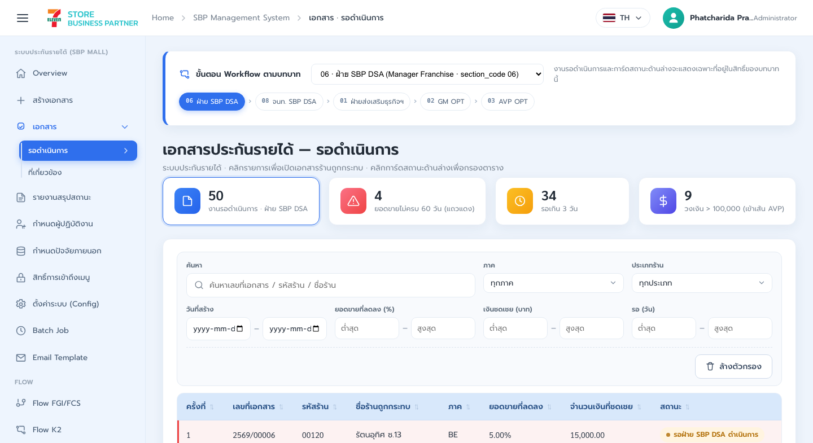
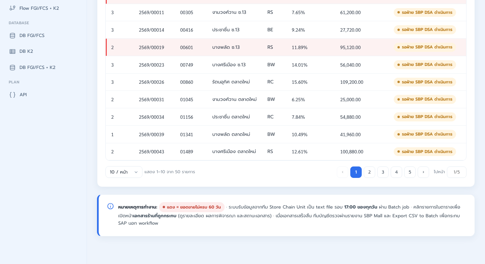
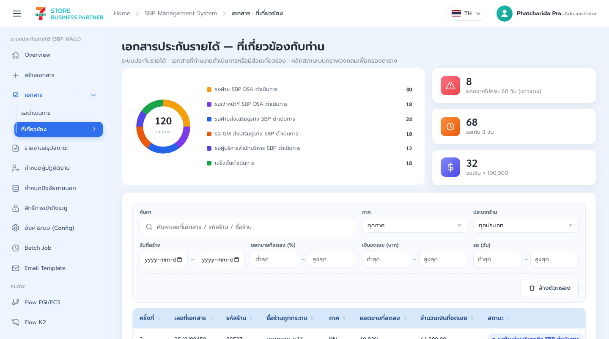
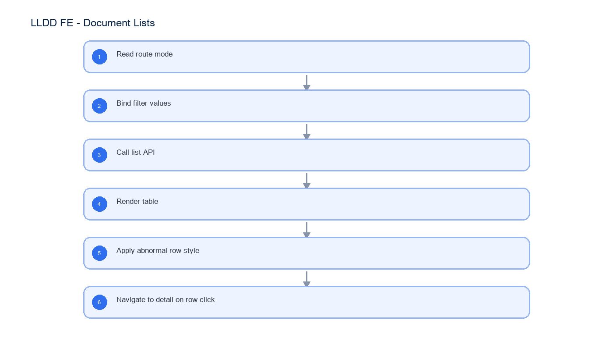

# LLDD FE - Document Lists

SBP Mall - ระบบประกันรายได้ | Low Level Design Document

## 1. Overview

| รายการ | รายละเอียด |
| --- | --- |
| Track | FE |
| Estimate | 42 ชั่วโมง |
| Owner | Peerakorn <Pete> Sakunkaewphithak |
| Objective | สร้างหน้ารายการเอกสารรอดำเนินการและเอกสารที่เกี่ยวข้อง |

Common contract reference: ทุกหัวข้อ API/FE ต้องยึด LLDD-BE-API-Common-Contracts และ LLDD-FE-Integration-Contracts สำหรับ error/auth/format/pagination/action/RBAC ก่อนลงรายละเอียดเฉพาะหน้าหรือเฉพาะ endpoint

## 2. Screen / Functional Scope

- Waiting list
- Related document list
- Search/filter/status filter
- Pagination/row action
- Red flag for sales data < 60 days

## 3. Screenshot Reference



_รูปที่ 1: Screenshot: k2-list-waiting-01.png_



_รูปที่ 2: Screenshot: k2-list-waiting-02.png_



_รูปที่ 3: Screenshot: k2-list-related-01.png_

## 4. Implementation Flow Diagram (Reference)



_รูปที่ 4: Implementation flow reference: LLDD FE - Document Lists_

## 5. Field, Format, and Validation

| Field / UI | Format | Validation | Behavior |
| --- | --- | --- | --- |
| docNo | YYYY/xxxxx | optional search | ถ้าคลิก row ส่งไป detail |
| year | พ.ศ. YYYY | required สำหรับ /documents | default current year |
| status | status code/string | optional single select | ใช้ filter chip |
| table.docNo | YYYY/xxxxx | column 1 | เลขที่เอกสารและลิงก์เปิด detail |
| table.impactedStoreCode | string 5 digits | column 2 | รหัสร้านถูกกระทบ; คง leading zero |
| table.impactedStoreName | string | column 3 | ชื่อร้านถูกกระทบ |
| table.impactMonth | YYYY-MM | column 4 | FE แสดงเดือน/ปี พ.ศ. |
| table.statusCode/statusName | code + label | column 5 | เก็บ code และ resolve label จาก dictionary |
| table.operatorName | string\|null | column 6 | ผู้ถือ task ปัจจุบันหรือ '-' |
| table.daysPending | integer | column 7; >=0 | จำนวนวันรอดำเนินการ |
| table.totalCompensationAmount | decimal | column 8; >=0 | format #,##0.00 |
| table.salesDataDays | integer | column 9; <60 = abnormal | row สีแดงและ label ผิดปกติ |

## 5.1 Input / Progress / Output Contract

| Stage | Contract for implementation |
| --- | --- |
| Input | GET /api/v1/tasks; GET /api/v1/documents |
| Progress | Read route mode; Bind filter values; Call list API; Render table |
| Output | Rendered UI state or normalized API response with status/message and audit-ready trace reference. |

### 5.90 Document Lists Component Contract

| ID | Component / Scope | Single responsibility | Definition of done |
| --- | --- | --- | --- |
| C01 | Waiting list | โหลดงานของผู้ใช้จาก /tasks และ map 9 คอลัมน์หลักพร้อม task owner/status | waiting list แสดง 9 คอลัมน์ตรง type และรักษา leading zero ของรหัสร้าน |
| C02 | Related document list | ค้นหาเอกสารจาก /documents โดยบังคับปีและแสดงเอกสารที่เกี่ยวข้องตาม permission | ไม่ call API เมื่อไม่มีปี และ empty result ไม่แสดงข้อมูลจาก query ก่อนหน้า |
| C03 | Search/filter/status filter | serialize docNo/year/status/store filters ลง query state และ restore เมื่อย้อนกลับจาก detail | Search/Clear/refresh ให้ผลซ้ำได้และ pagination ใช้ filter ชุดเดียวกัน |
| C04 | Pagination/row action | ควบคุม page/size/sort และ row navigation โดยใช้ docNo เป็น stable key | เปลี่ยนหน้าไม่ reset filter และเปิด detail ของ row ที่เลือกถูกเลขเอกสาร |
| C05 | Red flag for sales data < 60 days | คำนวณ presentation flag จาก salesDataDays < 60 โดยไม่ใช้ waitingDays แทน | แถวผิดปกติเป็นสีแดงพร้อม accessible label เฉพาะเมื่อยอดขายไม่ครบ 60 วัน |

### 5.91 Document Lists API Adapter Map

| Endpoint | Typed adapter purpose | Invoked by |
| --- | --- | --- |
| GET /api/v1/tasks | รายการเอกสารรอดำเนินการ | Search (ปุ่มค้นหา) |
| GET /api/v1/documents | ค้นหาเอกสารที่เกี่ยวข้อง ต้องระบุปี | Clear (ปุ่มเคลียร์) |

### 5.92 Document Lists Interaction State Machine

| Action | Trigger | API / State transition | Expected visible result |
| --- | --- | --- | --- |
| Search | ปุ่มค้นหา | GET /api/v1/tasks หรือ /documents | reload table |
| Clear | ปุ่มเคลียร์ | client state | reset filters |
| Open detail | click row | navigate /documents/:docNo | เปิดเอกสาร |

### 5.93 Document Lists Feature Failure Checks

| Case | Feature-specific scenario | Expected evidence |
| --- | --- | --- |
| FE-01 | ค้นหาด้วย docNo | ตาราง 9 คอลัมน์หลักครบ |
| FE-02 | filter status | ปีเป็น required เมื่อใช้ /documents |
| FE-03 | เปิด detail | ยอดขายไม่ครบ 60 วันแสดงแดง |
| FE-04 | empty result | pagination คง filter เดิม |
| FE-05 | abnormal row | ตาราง 9 คอลัมน์หลักครบ |

## 6. Button / User Action Mapping

| Action | Trigger | API / Service | Expected Result |
| --- | --- | --- | --- |
| Search | ปุ่มค้นหา | GET /api/v1/tasks หรือ /documents | reload table |
| Clear | ปุ่มเคลียร์ | client state | reset filters |
| Open detail | click row | navigate /documents/:docNo | เปิดเอกสาร |

## 7. API Contract

### GET /api/v1/tasks

รายการเอกสารรอดำเนินการ

#### Query Params

```json
{
  "page": 1,
  "size": 20,
  "status": "06"
}
```

#### Request Field Schema

| Field | Type | Required | Constraint / Meaning |
| --- | --- | --- | --- |
| page | integer | No | >= 1; default 1 |
| size | integer | No | 1..100; default 20 |
| status | string | No | UTF-8; use value domain described by endpoint purpose |

#### Response

```json
{
  "page": 1,
  "size": 20,
  "total": 24,
  "items": [
    {
      "docNo": "2569/00123",
      "impactedStoreCode": "01234",
      "impactedStoreName": "สาขาตัวอย่าง",
      "impactMonth": "2026-06",
      "statusCode": "06",
      "statusName": "รอฝ่าย SBP DSA ดำเนินการ",
      "operatorName": "สมชาย ใจดี",
      "daysPending": 3,
      "totalCompensationAmount": 48200.0,
      "salesDataDays": 58
    }
  ]
}
```

#### Response Field Schema

| Field | Type | Required | Constraint / Meaning |
| --- | --- | --- | --- |
| page | integer | Yes | >= 1; default 1 |
| size | integer | Yes | 1..100; default 20 |
| total | integer | Yes | UTF-8; use value domain described by endpoint purpose |
| items | array<object> | Yes | JSON array; element type shown in Type column |
| items[].docNo | string | Yes | พ.ศ. YYYY/xxxxx |
| items[].impactedStoreCode | string | Yes | exactly 5 digits; preserve leading zero |
| items[].impactedStoreName | string | Yes | UTF-8; use value domain described by endpoint purpose |
| items[].impactMonth | string | Yes | ISO-8601 ค.ศ.; nullable only when type includes null |
| items[].statusCode | string | Yes | canonical code; do not replace with display label |
| items[].statusName | string | Yes | UTF-8; use value domain described by endpoint purpose |
| items[].operatorName | string | Yes | UTF-8; use value domain described by endpoint purpose |
| items[].daysPending | integer | Yes | UTF-8; use value domain described by endpoint purpose |
| items[].totalCompensationAmount | number | Yes | number >= 0 with 2 decimals |
| items[].salesDataDays | integer | Yes | UTF-8; use value domain described by endpoint purpose |

### GET /api/v1/documents

ค้นหาเอกสารที่เกี่ยวข้อง ต้องระบุปี

#### Query Params

```json
{
  "year": 2569,
  "page": 1,
  "size": 20
}
```

#### Request Field Schema

| Field | Type | Required | Constraint / Meaning |
| --- | --- | --- | --- |
| year | integer | Yes | UTF-8; use value domain described by endpoint purpose |
| page | integer | No | >= 1; default 1 |
| size | integer | No | 1..100; default 20 |

#### Response

```json
{
  "page": 1,
  "size": 20,
  "total": 342,
  "items": [
    {
      "docNo": "2569/00124",
      "impactedStoreCode": "01235",
      "impactedStoreName": "สาขาตัวอย่าง 2",
      "impactMonth": "2026-06",
      "statusCode": "99",
      "statusName": "เสร็จสิ้น",
      "operatorName": null,
      "daysPending": 0,
      "totalCompensationAmount": 72500.0,
      "salesDataDays": 60
    }
  ]
}
```

#### Response Field Schema

| Field | Type | Required | Constraint / Meaning |
| --- | --- | --- | --- |
| page | integer | Yes | >= 1; default 1 |
| size | integer | Yes | 1..100; default 20 |
| total | integer | Yes | UTF-8; use value domain described by endpoint purpose |
| items | array<object> | Yes | JSON array; element type shown in Type column |
| items[].docNo | string | Yes | พ.ศ. YYYY/xxxxx |
| items[].impactedStoreCode | string | Yes | exactly 5 digits; preserve leading zero |
| items[].impactedStoreName | string | Yes | UTF-8; use value domain described by endpoint purpose |
| items[].impactMonth | string | Yes | ISO-8601 ค.ศ.; nullable only when type includes null |
| items[].statusCode | string | Yes | canonical code; do not replace with display label |
| items[].statusName | string | Yes | UTF-8; use value domain described by endpoint purpose |
| items[].operatorName | string \| null | No | UTF-8; use value domain described by endpoint purpose |
| items[].daysPending | integer | Yes | UTF-8; use value domain described by endpoint purpose |
| items[].totalCompensationAmount | number | Yes | number >= 0 with 2 decimals |
| items[].salesDataDays | integer | Yes | UTF-8; use value domain described by endpoint purpose |

## 9. Processing Flow

| Step | Description |
| --- | --- |
| 1 | Read route mode |
| 2 | Bind filter values |
| 3 | Call list API |
| 4 | Render table |
| 5 | Apply abnormal row style |
| 6 | Navigate to detail on row click |

## 10. Acceptance Criteria

- ตาราง 9 คอลัมน์หลักครบ
- ปีเป็น required เมื่อใช้ /documents
- ยอดขายไม่ครบ 60 วันแสดงแดง
- pagination คง filter เดิม

## 11. Developer Test Checklist

| No | Test |
| --- | --- |
| 1 | ค้นหาด้วย docNo |
| 2 | filter status |
| 3 | เปิด detail |
| 4 | empty result |
| 5 | abnormal row |
