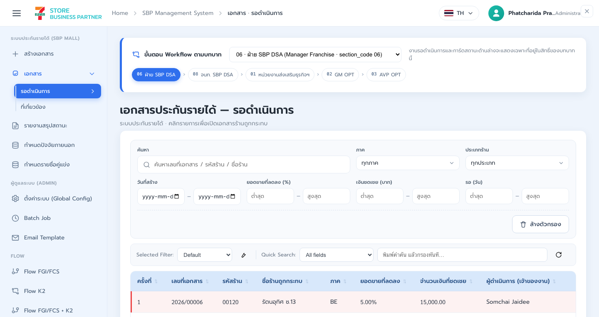
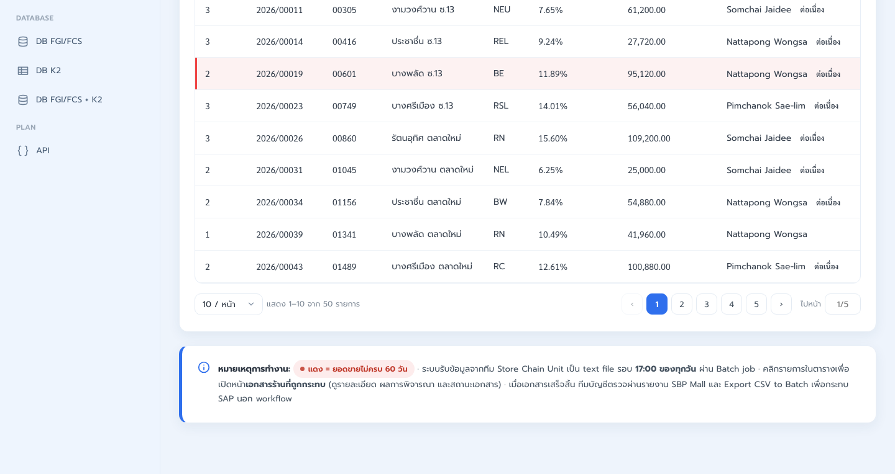
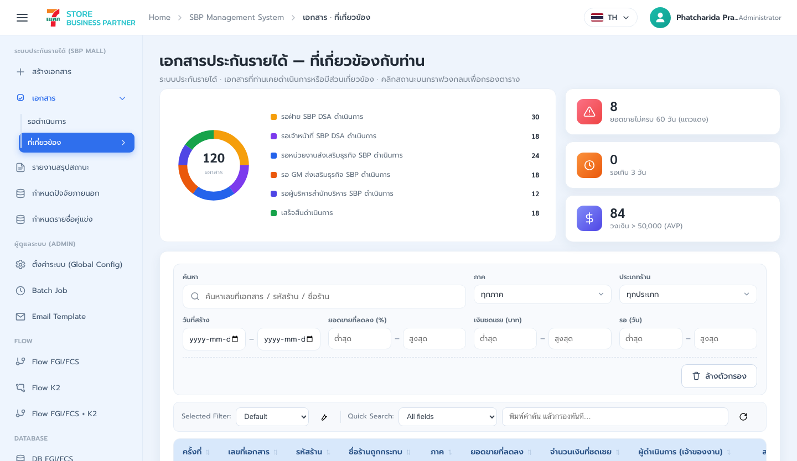
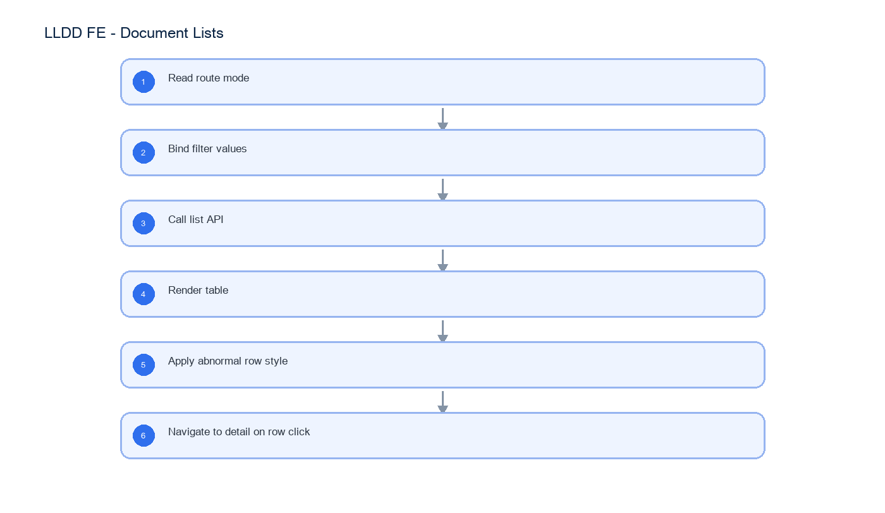

# LLDD FE - Document Lists

SBP Mall - ระบบประกันรายได้ | Low Level Design Document

## 1. Overview

| รายการ | รายละเอียด |
| --- | --- |
| Track | FE |
| Estimate | **35 ชั่วโมง** = implementation 28 + unit test 7 (25%) |
| Owner | Chidchanok <lin> Saengamnat |
| Target repository | `SBP/srm-sps-spsap-web-frontend` (sbp-portal · Next.js · `NEXT_PUBLIC_APP_TARGET=sbpm`) — เรียก API ผ่าน `SBP/srm-sps-spsap-sbp-bff` เท่านั้น ห้ามยิง store-backend ตรง |
| Objective | สร้างหน้ารายการเอกสารรอดำเนินการและเอกสารที่เกี่ยวข้อง |

Common contract reference: ทุกหัวข้อ API/FE ต้องยึด LLDD-BE-API-Common-Contracts และ LLDD-FE-Integration-Contracts สำหรับ error/auth/format/pagination/action/RBAC ก่อนลงรายละเอียดเฉพาะหน้าหรือเฉพาะ endpoint

## 2. Screen / Functional Scope

- Waiting list
- Related document list
- Search/filter/status filter
- Pagination/row action + เลือกหลายเอกสาร (bulk)
- Red flag (sales < 60 days) + rejected-ending rows ที่บทบาท 06 ต้องเห็น

## 3. Screenshot Reference



_รูปที่ 1: Screenshot: k2-list-waiting-01.png_



_รูปที่ 2: Screenshot: k2-list-waiting-02.png_



_รูปที่ 3: Screenshot: k2-list-related-01.png_

## 4. Implementation Flow Diagram (Reference)



_รูปที่ 4: Implementation flow reference: LLDD FE - Document Lists_

## 5. Field, Format, and Validation

| Field / UI | Format | Validation | Behavior |
| --- | --- | --- | --- |
| docNo | YYYY/xxxxx | optional search | ถ้าคลิก row ส่งไป detail |
| year | ค.ศ. YYYY | required สำหรับ /sbpgi/document | default current year (ค.ศ.) |
| status | status code/string | optional single select | ใช้ filter chip |
| table.roundNo | integer | column 1 | ครั้งที่ (รอบชดเชยของร้าน) |
| table.docNo | YYYY/xxxxx | column 2 | เลขที่เอกสารและลิงก์เปิด detail |
| table.impactedStoreCode | string 5 digits | column 3 | รหัสร้านถูกกระทบ; คง leading zero |
| table.impactedStoreName | string | column 4 | ชื่อร้านถูกกระทบ |
| table.regionCode | string | column 5 | ภาค |
| table.salesDeclinePercent | decimal | column 6 | ยอดขายที่ลดลง (%) |
| table.totalCompensationAmount | decimal | column 7; >=0 | จำนวนเงินที่ชดเชย; format #,##0.00 |
| table.statusCode/statusName | code + label | column 8 | สถานะ; เก็บ code และ resolve label จาก dictionary |
| table.daysPending | integer | column 9; >=0 | รอ (วัน) |
| table.salesDataDays | integer | internal (ไม่ใช่คอลัมน์แสดง) | <60 = แถวผิดปกติสีแดง (red-flag) |

### 5.9 Input / Progress / Output Contract

| Stage | Contract for implementation |
| --- | --- |
| Input | GET /api/v1/sbpgi/document/tasks; GET /api/v1/sbpgi/document |
| Progress | Read route mode; Bind filter values; Call list API; Render table |
| Output | ไม่มีตารางที่เอกสารนี้เขียนเอง — output คือ response ตาม envelope กลาง `{success, data}` และร่องรอยที่ตรวจย้อนได้ (log / consideration_logs / workflow_history ของ engine) |

### 5.90 Document Lists Component Contract

| ID | Component / Scope | Single responsibility | Definition of done |
| --- | --- | --- | --- |
| C01 | Waiting list | โหลดงานของผู้ใช้จาก /sbpgi/document/tasks และ map 9 คอลัมน์หลักพร้อม task owner/status | waiting list แสดง 9 คอลัมน์ตรง type และรักษา leading zero ของรหัสร้าน |
| C02 | Related document list | ค้นหาเอกสารจาก /sbpgi/document โดยบังคับปีและแสดงเอกสารที่เกี่ยวข้องตาม permission | ไม่ call API เมื่อไม่มีปี และ empty result ไม่แสดงข้อมูลจาก query ก่อนหน้า |
| C03 | Search/filter/status filter | serialize docNo/year/status/store filters ลง query state และ restore เมื่อย้อนกลับจาก detail | Search/Clear/refresh ให้ผลซ้ำได้และ pagination ใช้ filter ชุดเดียวกัน |
| C04 | Pagination/row action + เลือกหลายเอกสาร (bulk) | ควบคุม page/size/sort และ row navigation โดยใช้ docNo เป็น stable key · เพิ่มคอลัมน์ checkbox แรกสุดสำหรับเลือกหลายเอกสาร (SDD GI สไลด์ 48) — checkbox ต้อง stopPropagation ไม่ให้ทริกเกอร์ row navigation และ "เลือกทั้งหมด" ครอบเฉพาะแถวที่แสดงในหน้านั้น ไม่ใช่ทั้งชุดผลลัพธ์ | เปลี่ยนหน้าไม่ reset filter และเปิด detail ของ row ที่เลือกถูกเลขเอกสาร · เลือกหลายรายการแล้วกด "ดำเนินการที่เลือก" ต้องเปิด popup ยืนยันพร้อมรายการเลขที่เอกสารก่อนส่ง และเคลียร์การเลือกหลังส่งสำเร็จ |
| C05 | Red flag (sales < 60 days) + rejected-ending rows ที่บทบาท 06 ต้องเห็น | คำนวณ presentation flag จาก salesDataDays < 60 โดยไม่ใช้ waitingDays แทน และ render เอกสารที่จบด้วยผลปฏิเสธทั้ง 2 แบบ — หยุดชดเชยประกันรายได้ (stoppedReopenable=true) และ เห็นควรไม่ชดเชยรายได้ (notCompensated=true) — เฉพาะบทบาท section 06 | แถวผิดปกติเป็นสีแดงพร้อม accessible label เฉพาะเมื่อยอดขายไม่ครบ 60 วัน · บทบาท 06 เห็น 3 กลุ่มในหน้าเดียว (มติ 2026-08-24): (1) รอฝ่าย SBP DSA ดำเนินการ (2) เสร็จสิ้นดำเนินการ + ชิป หยุดชดเชยฯ (3) เสร็จสิ้นดำเนินการ + ชิป เห็นควรไม่ชดเชยฯ · บทบาท 08/01/02/03 ต้องไม่เห็นกลุ่ม (2) และ (3) · ชิปทั้งสองเป็นผลการพิจารณาสุดท้าย ไม่ใช่สถานะที่ 7/8 — สถานะจริงยังเป็น เสร็จสิ้นดำเนินการ ตามชุด 6 ค่า และมีตัวกรองแยก 2 ตัวจาก dropdown สถานะ · กลุ่ม (2) คลิกแล้วเปิดเอกสารในโหมดเปิดพิจารณาใหม่ · หมายเหตุที่มา: กลุ่ม (3) กว้างกว่าตัวอักษรของ SDD สไลด์ 46/64 ที่ให้แสดงเฉพาะรอบเดือนถัดไปในหน้างานค้างของ เจ้าหน้าที่ SBP DSA |

### 5.91 Document Lists API Adapter Map

| Endpoint | Typed adapter purpose | Invoked by |
| --- | --- | --- |
| GET /api/v1/sbpgi/document/tasks | รายการเอกสารรอดำเนินการ | Search (ปุ่มค้นหา) |
| GET /api/v1/sbpgi/document | ค้นหาเอกสารที่เกี่ยวข้อง ต้องระบุปี | Search (ปุ่มค้นหา) |

### 5.92 Document Lists Interaction State Machine

| Action | Trigger | API / State transition | Expected visible result |
| --- | --- | --- | --- |
| Search | ปุ่มค้นหา | GET /api/v1/sbpgi/document/tasks หรือ /sbpgi/document | reload table |
| Clear | ปุ่มเคลียร์ | client state | reset filters |
| Open detail | click row | navigate /sbpgi/document/:docNo | เปิดเอกสาร |

### 5.93 Document Lists Feature Failure Checks

| Case | Feature-specific scenario | Expected evidence |
| --- | --- | --- |
| FE-01 | ค้นหาด้วย docNo | ตาราง 9 คอลัมน์หลักครบ |
| FE-02 | filter status | ปีเป็น required เมื่อใช้ /sbpgi/document |
| FE-03 | เปิด detail | ยอดขายไม่ครบ 60 วันแสดงแดง |
| FE-04 | empty result | pagination คง filter เดิม |
| FE-05 | abnormal row | ตาราง 9 คอลัมน์หลักครบ |

## 6. Button / User Action Mapping

| Action | Trigger | API / Service | Expected Result |
| --- | --- | --- | --- |
| Search | ปุ่มค้นหา | GET /api/v1/sbpgi/document/tasks หรือ /sbpgi/document | reload table |
| Clear | ปุ่มเคลียร์ | client state | reset filters |
| Open detail | click row | navigate /sbpgi/document/:docNo | เปิดเอกสาร |

## 7. API Contract

### GET /api/v1/sbpgi/document/tasks

รายการเอกสารรอดำเนินการ

#### Query Params

```json
{
  "page": 1,
  "size": 20,
  "status": "06"
}
```

#### Request Field Schema

| Field | Type | Required | Constraint / Meaning |
| --- | --- | --- | --- |
| page | integer | No | >= 1; default 1 |
| size | integer | No | 1..100; default 20 |
| status | string | No | UTF-8; use value domain described by endpoint purpose |

#### Response

```json
{
  "page": 1,
  "size": 20,
  "total": 24,
  "items": [
    {
      "roundNo": 1,
      "docNo": "2026/00123",
      "impactedStoreCode": "01234",
      "impactedStoreName": "สาขาตัวอย่าง",
      "regionCode": "BE",
      "salesDeclinePercent": 12.5,
      "statusCode": "06",
      "statusName": "รอฝ่าย SBP DSA ดำเนินการ",
      "totalCompensationAmount": 48200.0,
      "daysPending": 3,
      "salesDataDays": 58
    }
  ]
}
```

#### Response Field Schema

| Field | Type | Required | Constraint / Meaning |
| --- | --- | --- | --- |
| page | integer | Yes | >= 1; default 1 |
| size | integer | Yes | 1..100; default 20 |
| total | integer | Yes | UTF-8; use value domain described by endpoint purpose |
| items | array<object> | Yes | JSON array; element type shown in Type column |
| items[].roundNo | integer | Yes | UTF-8; use value domain described by endpoint purpose |
| items[].docNo | string | Yes | ค.ศ. YYYY/xxxxx |
| items[].impactedStoreCode | string | Yes | exactly 5 digits; preserve leading zero |
| items[].impactedStoreName | string | Yes | UTF-8; use value domain described by endpoint purpose |
| items[].regionCode | string | Yes | UTF-8; use value domain described by endpoint purpose |
| items[].salesDeclinePercent | number | Yes | number 0..100 with 2 decimals |
| items[].statusCode | string | Yes | canonical code; do not replace with display label |
| items[].statusName | string | Yes | UTF-8; use value domain described by endpoint purpose |
| items[].totalCompensationAmount | number | Yes | number >= 0 with 2 decimals |
| items[].daysPending | integer | Yes | UTF-8; use value domain described by endpoint purpose |
| items[].salesDataDays | integer | Yes | UTF-8; use value domain described by endpoint purpose |

### GET /api/v1/sbpgi/document

ค้นหาเอกสารที่เกี่ยวข้อง ต้องระบุปี

#### Query Params

```json
{
  "year": 2026,
  "page": 1,
  "size": 20
}
```

#### Request Field Schema

| Field | Type | Required | Constraint / Meaning |
| --- | --- | --- | --- |
| year | integer | Yes | UTF-8; use value domain described by endpoint purpose |
| page | integer | No | >= 1; default 1 |
| size | integer | No | 1..100; default 20 |

#### Response

```json
{
  "page": 1,
  "size": 20,
  "total": 342,
  "items": [
    {
      "roundNo": 2,
      "docNo": "2026/00124",
      "impactedStoreCode": "01235",
      "impactedStoreName": "สาขาตัวอย่าง 2",
      "regionCode": "BS",
      "salesDeclinePercent": 18.0,
      "statusCode": "99",
      "statusName": "เสร็จสิ้น",
      "totalCompensationAmount": 72500.0,
      "daysPending": 0,
      "salesDataDays": 60
    }
  ]
}
```

#### Response Field Schema

| Field | Type | Required | Constraint / Meaning |
| --- | --- | --- | --- |
| page | integer | Yes | >= 1; default 1 |
| size | integer | Yes | 1..100; default 20 |
| total | integer | Yes | UTF-8; use value domain described by endpoint purpose |
| items | array<object> | Yes | JSON array; element type shown in Type column |
| items[].roundNo | integer | Yes | UTF-8; use value domain described by endpoint purpose |
| items[].docNo | string | Yes | ค.ศ. YYYY/xxxxx |
| items[].impactedStoreCode | string | Yes | exactly 5 digits; preserve leading zero |
| items[].impactedStoreName | string | Yes | UTF-8; use value domain described by endpoint purpose |
| items[].regionCode | string | Yes | UTF-8; use value domain described by endpoint purpose |
| items[].salesDeclinePercent | number | Yes | number 0..100 with 2 decimals |
| items[].statusCode | string | Yes | canonical code; do not replace with display label |
| items[].statusName | string | Yes | UTF-8; use value domain described by endpoint purpose |
| items[].totalCompensationAmount | number | Yes | number >= 0 with 2 decimals |
| items[].daysPending | integer | Yes | UTF-8; use value domain described by endpoint purpose |
| items[].salesDataDays | integer | Yes | UTF-8; use value domain described by endpoint purpose |

## 8. Skeleton Code (โครงโค้ดตั้งต้นของหน้าจอนี้)

โค้ดชุดนี้อิง convention ของ portal เดิม `srm-sps-spsap-web-frontend` (build target `sbpm`): Next.js App Router + `'use client'`, PrimeReact ที่ห่อไว้แล้วใน `@/components/Form` และ `@/components/Table`, react-hook-form + yup, Zustand `permissionStore`, axios instance กลาง `@/lib/apiClient` และ react-query 5 — **โปรเจกต์ไม่มี chart library** จึงไม่มีโค้ดกราฟในเอกสารนี้ คัดลอกไปตั้งต้นได้ทันที แล้วเติมจุดที่กำกับ `TODO:`

#### 8.1 ผังไฟล์ที่ต้องสร้าง

โครงไฟล์อิง portal เดิม (`srm-sps-spsap-web-frontend`, target `sbpm`) — โมดูล SBPGI อยู่ใต้ `src/app/(main)/sbpgi/*` และ import ผ่าน alias `@/*` ทุกจุด

| Path ไฟล์ | หน้าที่ |
| --- | --- |
| src/app/(main)/sbpgi/document/waiting/page.tsx | route page — หน้ารายการเอกสารรอดำเนินการ (GET /sbpgi/document/tasks) |
| src/app/(main)/sbpgi/document/related/page.tsx | route page — หน้าเอกสารที่เกี่ยวข้อง (GET /sbpgi/document · ปี = required) |
| src/components/sbpgi/document-lists/DocumentListsForm.tsx | component — ฟอร์ม/ฟิลเตอร์ (react-hook-form + yup + FormInputControl) |
| src/services/sbpgi/document.service.ts | service — เรียก BFF ผ่าน apiClient (GET) |
| src/hooks/sbpgi/document.query.ts | hook — query key factory + useQuery/useMutation + invalidate |
| src/types/sbpgi/document.ts | types — request/response ตาม API contract ของเอกสารนี้ |

#### 8.2 page.tsx — หน้ารายการ (permission gate + react-query + Table กลาง)

```tsx
'use client';
// หน้ารายการเอกสารรอดำเนินการ (GET /sbpgi/document/tasks)
// route: /sbpgi/document/waiting  ·  ต้องมี record ใน GET /menus และสิทธิ์ใน GET /groups/current-user/permissions

import { useState } from 'react';
import { useRouter } from 'next/navigation';
// Table/Column import จาก barrel `@/components/Table` เท่านั้น (table.tsx เป็น named export
// และ re-export `Column = PrimeColumn` ไว้แล้ว — ห้าม import จาก 'primereact/column')
import { Column, Table } from '@/components/Table';
import AccessDenied from '@/components/Permission/AccessDenied';
// permissionStore เป็น named export ของ Zustand store (ไม่มี symbol ชื่อ usePermissionStore ในโปรเจกต์)
import { permissionStore } from '@/stores/permissionStore';
import { apiErrorMessage } from '@/lib/sbpgi/apiError';
import { useSbpgiDocumentTasksQuery } from '@/hooks/sbpgi/document.query';
import type { SbpgiDocumentTasksItem } from '@/types/sbpgi/document';

const PAGE_URL = '/sbpgi/document/waiting';

export default function DocumentWaitingPage() {
  const router = useRouter();
  const { hasPermission, isPermissionLoaded } = permissionStore();
  const [query, setQuery] = useState({ page: 1, size: 20 });
  // NOTE: เรียก hook ให้ครบก่อน แล้วค่อย early-return (rules of hooks)
  const { data, isLoading, isError, error } = useSbpgiDocumentTasksQuery(query);

  // รอ permission โหลดเสร็จก่อน ไม่งั้นจะเห็น AccessDenied แว่บหนึ่งทุกครั้งที่เข้าหน้า
  if (!isPermissionLoaded) return null;
  if (!hasPermission(PAGE_URL, 'canView')) return <AccessDenied />;

  return (
    <div className="flex flex-col gap-4 p-4">
      <h1 className="text-xl font-semibold">{/* TODO: หัวข้อหน้าจอตาม SRS */}</h1>
      {/* TODO: <DocumentListsForm onSearch={(v) => setQuery((q) => ({ ...q, ...v, page: 1 }))} /> */}
      <Table
        value={data?.items ?? []}
        loading={isLoading}
        lazy
        paginator
        rows={query.size}
        first={(query.page - 1) * query.size}
        totalRecords={data?.total ?? 0}
        onPage={(e) => setQuery((q) => ({ ...q, page: (e.page ?? 0) + 1, size: e.rows ?? q.size }))}
        onRowClick={(e) => router.push(`/sbpgi/document/${encodeURIComponent((e.data as SbpgiDocumentTasksItem).docNo)}`)}
        emptyMessage="ไม่พบข้อมูล"
        rowClassName={(row: SbpgiDocumentTasksItem) => (row.salesDataDays < 60 ? 'flag-red' : '')} // ยอดขายไม่ครบ 60 วัน = แถวผิดปกติ
      >
        <Column field="roundNo" header="ครั้งที่ (รอบชดเชยของร้าน)" sortable align="right" />
        <Column field="docNo" header="เลขที่เอกสารและลิงก์เปิด detail" sortable />
        <Column field="impactedStoreCode" header="รหัสร้านถูกกระทบ" sortable />
        <Column field="impactedStoreName" header="ชื่อร้านถูกกระทบ" sortable />
        <Column field="regionCode" header="ภาค" sortable />
        <Column field="salesDeclinePercent" header="ยอดขายที่ลดลง (%)" sortable align="right" />
        <Column field="statusCode" header="สถานะ" sortable />
        <Column field="statusName" header="statusName" sortable />
        <Column field="totalCompensationAmount" header="จำนวนเงินที่ชดเชย" sortable align="right" />
        <Column field="daysPending" header="รอ (วัน)" sortable align="right" />
      </Table>
      {isError && <p className="text-red-600">{apiErrorMessage(error)}</p>}
    </div>
  );
}
```

#### 8.3 service — `src/services/sbpgi/document.service.ts`

⚠️ `src/services/sbpgi/document.service.ts` เป็น **ไฟล์ร่วมของโมดูล SBPGI** (เอกสาร FE หลายฉบับที่ใช้ domain `document` ประกาศไฟล์นี้เหมือนกัน) — เวลา implement ให้ **merge เพิ่ม** เข้าไฟล์เดิม ห้ามเขียนทับทั้งไฟล์ มิฉะนั้น type/function ของเอกสารฉบับก่อนหน้าจะหายไปเงียบ ๆ

```ts
// src/services/sbpgi/document.service.ts
// apiClient = axios instance กลาง (baseURL = bffUrl ซึ่งรวม /api/v1 แล้ว, withCredentials, refresh-token interceptor, global loading)
// ห้ามสร้าง axios instance ใหม่ และห้าม set Authorization header เอง — session อยู่ใน httpOnly cookie ของ BFF

import apiClient from '@/lib/apiClient';
import type { ApiResponse, PageResponse } from '@/types/sbpgi/common';
import type * as T from '@/types/sbpgi/document';

/** GET /api/v1/sbpgi/document/tasks — รายการเอกสารรอดำเนินการ */
export async function getSbpgiDocumentTasks(params: T.SbpgiDocumentTasksParams): Promise<PageResponse<T.SbpgiDocumentTasksItem>> {
  const { data } = await apiClient.get<ApiResponse<PageResponse<T.SbpgiDocumentTasksItem>>>('/sbpgi/document/tasks', { params });
  return data.data;
}

/** GET /api/v1/sbpgi/document — ค้นหาเอกสารที่เกี่ยวข้อง ต้องระบุปี */
export async function getSbpgiDocument(params: T.SbpgiDocumentParams): Promise<PageResponse<T.SbpgiDocumentItem>> {
  const { data } = await apiClient.get<ApiResponse<PageResponse<T.SbpgiDocumentItem>>>('/sbpgi/document', { params });
  return data.data;
}

// TODO: ยืนยันกับทีม BFF ว่า unwrap envelope { success, data } ที่ชั้นไหน (BFF หรือ FE)
```

#### 8.4 types — `src/types/sbpgi/document.ts`

⚠️ `src/types/sbpgi/document.ts` เป็น **ไฟล์ร่วมของโมดูล SBPGI** (เอกสาร FE หลายฉบับที่ใช้ domain `document` ประกาศไฟล์นี้เหมือนกัน) — เวลา implement ให้ **merge เพิ่ม** เข้าไฟล์เดิม ห้ามเขียนทับทั้งไฟล์ มิฉะนั้น type/function ของเอกสารฉบับก่อนหน้าจะหายไปเงียบ ๆ

```ts
// src/types/sbpgi/document.ts — ตรงกับตาราง API ในเอกสารนี้
// วันที่/เดือนเป็น ค.ศ. ทั้ง payload (ISO) และ display — ไม่แปลงเป็น พ.ศ. (มติ 2026-08-06)

import type { PageResponse } from '@/types/sbpgi/common';

/** GET /api/v1/sbpgi/document/tasks — request */
export interface SbpgiDocumentTasksParams {
  page?: number;
  size?: number;
  status?: string;
}

/** GET /api/v1/sbpgi/document/tasks — 1 แถวในตาราง */
export interface SbpgiDocumentTasksItem {
  roundNo: number;
  docNo: string;
  impactedStoreCode: string;
  impactedStoreName: string;
  regionCode: string;
  salesDeclinePercent: number;
  statusCode: string;
  statusName: string;
  totalCompensationAmount: number;
  daysPending: number;
  salesDataDays: number;
}
export type SbpgiDocumentTasksListResponse = PageResponse<SbpgiDocumentTasksItem>;

/** GET /api/v1/sbpgi/document — request */
export interface SbpgiDocumentParams {
  year?: number;
  page?: number;
  size?: number;
}

/** GET /api/v1/sbpgi/document — 1 แถวในตาราง */
export interface SbpgiDocumentItem {
  roundNo: number;
  docNo: string;
  impactedStoreCode: string;
  impactedStoreName: string;
  regionCode: string;
  salesDeclinePercent: number;
  statusCode: string;
  statusName: string;
  totalCompensationAmount: number;
  daysPending: number;
  salesDataDays: number;
}
export type SbpgiDocumentListResponse = PageResponse<SbpgiDocumentItem>;

// TODO: ใส่ nullable / required ให้ตรงกับ contract ฉบับล่าสุดของ BE
```

#### 8.5 react-query keys + hooks — `src/hooks/sbpgi/document.query.ts`

⚠️ `src/hooks/sbpgi/document.query.ts` เป็น **ไฟล์ร่วมของโมดูล SBPGI** (เอกสาร FE หลายฉบับที่ใช้ domain `document` ประกาศไฟล์นี้เหมือนกัน) — เวลา implement ให้ **merge เพิ่ม** เข้าไฟล์เดิม ห้ามเขียนทับทั้งไฟล์ มิฉะนั้น type/function ของเอกสารฉบับก่อนหน้าจะหายไปเงียบ ๆ

```ts
// src/hooks/sbpgi/document.query.ts
import { useQuery } from '@tanstack/react-query';
import * as api from '@/services/sbpgi/document.service';
import type * as T from '@/types/sbpgi/document';

export const documentKeys = {
  all: ['sbpgi', 'document'] as const,
  sbpgiDocumentTasks: (params?: T.SbpgiDocumentTasksParams | null) => [...documentKeys.all, 'sbpgiDocumentTasks', params] as const,
  sbpgiDocument: (params?: T.SbpgiDocumentParams | null) => [...documentKeys.all, 'sbpgiDocument', params] as const,
};

export function useSbpgiDocumentTasksQuery(params?: T.SbpgiDocumentTasksParams | null) {
  return useQuery({
    queryKey: documentKeys.sbpgiDocumentTasks(params),
    queryFn: () => api.getSbpgiDocumentTasks(params!),
    enabled: !!params, // ยังไม่ยิงจนกว่าจะมีพารามิเตอร์ครบ
    staleTime: 30_000, // TODO: ปรับตามความถี่ของข้อมูลหน้านี้
  });
}

export function useSbpgiDocumentQuery(params?: T.SbpgiDocumentParams | null) {
  return useQuery({
    queryKey: documentKeys.sbpgiDocument(params),
    queryFn: () => api.getSbpgiDocument(params!),
    enabled: !!params, // ยังไม่ยิงจนกว่าจะมีพารามิเตอร์ครบ
    staleTime: 30_000, // TODO: ปรับตามความถี่ของข้อมูลหน้านี้
  });
}
```

#### 8.6 ฟอร์ม + validation — `src/components/sbpgi/document-lists/DocumentListsForm.tsx`

```tsx
'use client';
// DocumentListsForm — ฟอร์มของ "LLDD FE - Document Lists" (ฟิลด์/validation ตามตารางฟิลด์ในเอกสารนี้)
// ผูก react-hook-form ด้วย FormInputControl (components/Form/Layout/form-input-control.tsx)
// — InputText เองไม่รับ prop name/control/label/error (extends PrimeInputTextProps เท่านั้น)

import { useForm } from 'react-hook-form';
import { yupResolver } from '@hookform/resolvers/yup';
import * as yup from 'yup';
import { FormInputControl, InputText } from '@/components/Form';

export interface DocumentListsFormValue {
  docNo: string;
  year: string;
  status: string;
}

// TODO: แทนข้อความ validation ด้วยข้อความ verbatim จาก SRS ก่อน UAT
const schema = yup.object({
  docNo: yup.string().matches(/^\d{4}\/\d{5}$/, 'เลขที่เอกสารต้องเป็น YYYY/xxxxx (ค.ศ.)'), // ถ้าคลิก row ส่งไป detail
  year: yup.string().required('กรุณาระบุ year'), // default current year (ค.ศ.)
  status: yup.string(), // ใช้ filter chip
});

export default function DocumentListsForm({ defaultValues, onSubmit }: {
  defaultValues?: Partial<DocumentListsFormValue>;
  onSubmit: (values: DocumentListsFormValue) => void;
}) {
  const { control, handleSubmit, reset } = useForm<DocumentListsFormValue>({
    resolver: yupResolver(schema) as never,
    defaultValues: defaultValues as DocumentListsFormValue,
    mode: 'onSubmit',
  });

  return (
    <form onSubmit={handleSubmit(onSubmit)} className="grid grid-cols-1 gap-3 md:grid-cols-3">
      <FormInputControl name="docNo" control={control} input={InputText} label="docNo" />
      <FormInputControl name="year" control={control} input={InputText} label="year" />
      <FormInputControl name="status" control={control} input={InputText} label="status" />
      {/* TODO: ปรับ input ให้ตรงชนิดข้อมูล (Dropdown / DatePicker / MultiSelect) ตามตารางฟิลด์ */}
      <div className="col-span-full flex justify-end gap-2">
        <button type="submit" className="btn btn-primary">
          ค้นหาข้อมูล
        </button>
        <button type="button" className="btn btn-secondary" onClick={() => reset()}>
          เคลียร์ค่าเริ่มใหม่
        </button>
      </div>
    </form>
  );
}
```

- ทุกหน้าเช็คสิทธิ์ด้วย `permissionStore.hasPermission(url, 'canView'|'canManage'|'canExport'|'canOther')` แล้ว render `<AccessDenied />` เมื่อไม่มีสิทธิ์
- เมนู/สิทธิ์มาจาก `GET /menus` และ `GET /groups/current-user/permissions` — ห้าม hardcode role หรือรายการเมนูใน FE
- session อยู่ใน httpOnly cookie ของ BFF (`withCredentials: true`) — FE ไม่เก็บและไม่แนบ token เอง
- payload และการแสดงผลใช้วันที่ ค.ศ. เสมอ ผ่าน formatter กลางจุดเดียว — ไม่แปลงเป็น พ.ศ. (มติ 2026-08-06)
- ข้อความ error แสดงจาก `error.message` ของ BE ตรง ๆ (ห้าม paraphrase) — fallback ใช้เฉพาะกรณี network error

## 9. Processing Flow

| Step | Description |
| --- | --- |
| 1 | Read route mode |
| 2 | Bind filter values |
| 3 | Call list API |
| 4 | Render table |
| 5 | Apply abnormal row style |
| 6 | Navigate to detail on row click |

## 10. Acceptance Criteria

- ตาราง 9 คอลัมน์หลักครบ
- ปีเป็น required เมื่อใช้ /sbpgi/document
- ยอดขายไม่ครบ 60 วันแสดงแดง
- pagination คง filter เดิม

## 11. Developer Test Checklist

| No | Test |
| --- | --- |
| 1 | ค้นหาด้วย docNo |
| 2 | filter status |
| 3 | เปิด detail |
| 4 | empty result |
| 5 | abnormal row |

## 12. Unit Test Scope

**7 ชั่วโมง** (25% ของ implementation 28 ชั่วโมง) · เครื่องมือ: Jest + React Testing Library + msw (mock API layer)

หัวข้อนี้คือ **unit test** ที่ต้องเขียนคู่กับโค้ด — ต่างจาก *Developer Test Checklist* ซึ่งเป็น scenario ระดับ end-to-end/manual ที่ใช้ตอนตรวจรับ · รายการด้านล่าง derive จาก field/validation, acceptance criteria, endpoint และตารางที่เอกสารนี้เขียน

| สิ่งที่ทดสอบ | ประเภท | เกณฑ์ผ่าน |
| --- | --- | --- |
| `year` | validation | ผ่านเมื่อถูกกฎ / โยน error เมื่อผิด — กฎ: required สำหรับ /sbpgi/document · รูปแบบ: ค.ศ. YYYY |
| `table.totalCompensationAmount` | validation | ผ่านเมื่อถูกกฎ / โยน error เมื่อผิด — กฎ: column 7; >=0 · รูปแบบ: decimal |
| `table.daysPending` | validation | ผ่านเมื่อถูกกฎ / โยน error เมื่อผิด — กฎ: column 9; >=0 · รูปแบบ: integer |
| `table.salesDataDays` | validation | ผ่านเมื่อถูกกฎ / โยน error เมื่อผิด — กฎ: internal (ไม่ใช่คอลัมน์แสดง) · รูปแบบ: integer |
| business rule | logic | ตาราง 9 คอลัมน์หลักครบ |
| business rule | logic | ปีเป็น required เมื่อใช้ /sbpgi/document |
| business rule | logic | ยอดขายไม่ครบ 60 วันแสดงแดง |
| business rule | logic | pagination คง filter เดิม |
| `GET /api/v1/sbpgi/document/tasks` | api client | hook/service เรียกเส้นนี้ด้วยพารามิเตอร์ถูกต้อง · map {success:true,data} เป็น state ที่หน้าจอใช้ · เจอ {success:false,error} แล้วแสดงข้อความไทย verbatim (mock ด้วย msw) |
| `GET /api/v1/sbpgi/document` | api client | hook/service เรียกเส้นนี้ด้วยพารามิเตอร์ถูกต้อง · map {success:true,data} เป็น state ที่หน้าจอใช้ · เจอ {success:false,error} แล้วแสดงข้อความไทย verbatim (mock ด้วย msw) |
| component | render | render ด้วย React Testing Library แล้วเห็น element ตาม field/action contract ของเอกสารนี้ |
| hook/state | interaction | ยิง action แล้ว state เปลี่ยนตามที่ระบุ และเรียก API layer ที่ mock ไว้ด้วยพารามิเตอร์ถูกต้อง |
| error path | ui | API ตอบ error envelope แล้วหน้าจอต้องแสดงข้อความไทย verbatim ไม่ crash |

- ทุกเคสต้องรันได้โดยไม่ต่อ DB/บริการภายนอกจริง — mock ที่ขอบ repository/client เสมอ
- ข้อความไทยที่ยืนยันในเทสต้องเป็น verbatim ตาม SRS ห้ามพิมพ์ใหม่
- เกณฑ์ผ่านของ CI: ทุกเคสในตารางนี้มี test จริงและผ่านทั้งหมด
