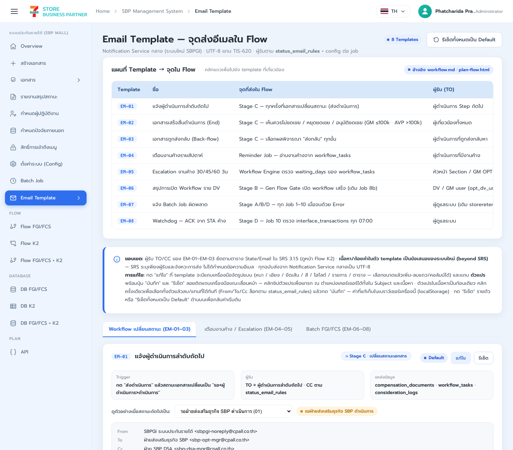
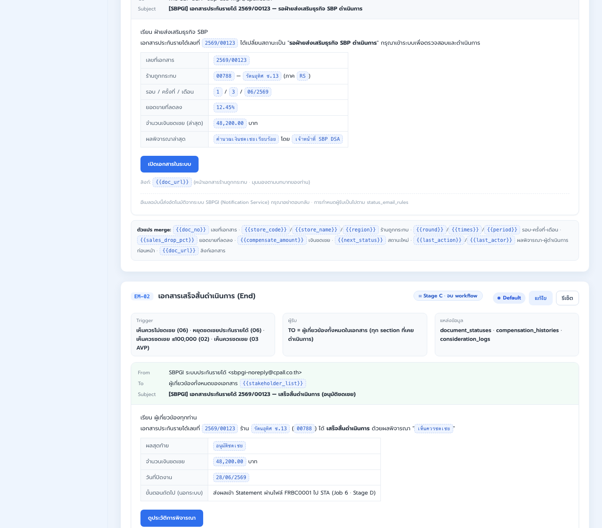
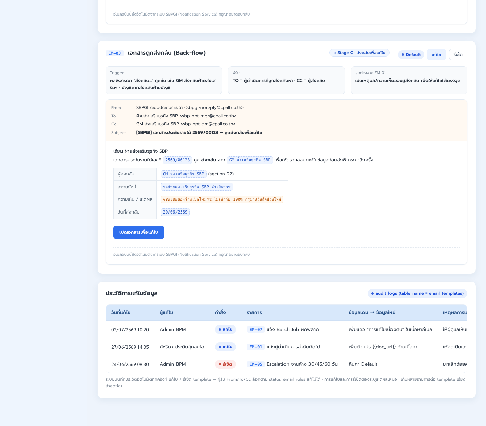
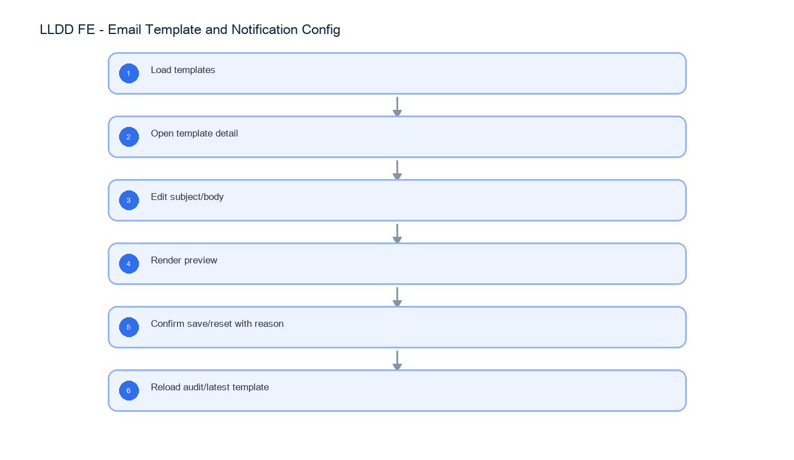

# LLDD FE - Email Template and Notification Config

SBP Mall - ระบบประกันรายได้ | Low Level Design Document

## 1. Overview

| รายการ | รายละเอียด |
| --- | --- |
| Track | FE |
| Estimate | 21 ชั่วโมง |
| Owner | Chidchanok <lin> Saengamnat |
| Objective | สร้างหน้า Email Template และ Notification Config สำหรับอ่าน/แก้/preview/reset template อีเมลของระบบประกันรายได้ โดยแยกจากหน้า Batch Job Monitor |

Common contract reference: ทุกหัวข้อ API/FE ต้องยึด LLDD-BE-API-Common-Contracts และ LLDD-FE-Integration-Contracts สำหรับ error/auth/format/pagination/action/RBAC ก่อนลงรายละเอียดเฉพาะหน้าหรือเฉพาะ endpoint

## 2. Screen / Functional Scope

- Email template list
- Template edit form
- Variable helper
- Preview modal
- Reset default confirm
- Notification recipient config display

## 3. Screenshot Reference



_รูปที่ 1: Screenshot: plan-email-01.png_



_รูปที่ 2: Screenshot: plan-email-02.png_



_รูปที่ 3: Screenshot: plan-email-03.png_

## 4. Implementation Flow Diagram (Reference)



_รูปที่ 4: Implementation flow reference: LLDD FE - Email Template and Notification Config_

## 5. Field, Format, and Validation

| Field / UI | Format | Validation | Behavior |
| --- | --- | --- | --- |
| templateCode | EM-xx | required | เลือก template ที่ต้องแก้ |
| subject | text | required | รองรับ variable token เช่น {{docNo}} |
| body | text/html | required | preview variable ก่อนบันทึก |
| reason | text | required on save/reset | บันทึก audit_logs |

## 5.1 Input / Progress / Output Contract

| Stage | Contract for implementation |
| --- | --- |
| Input | GET /api/v1/email-templates; GET /api/v1/email-templates/{code}; POST /api/v1/email-templates/{code}/preview |
| Progress | Load templates; Open template detail; Edit subject/body; Render preview |
| Output | Rendered UI state or normalized API response with status/message and audit-ready trace reference. |

### 5.90 Email Template and Notification Config Component Contract

| ID | Component / Scope | Single responsibility | Definition of done |
| --- | --- | --- | --- |
| C01 | Email template list | โหลดรายการ template พร้อม code, subject, channel, updatedAt และ active state | ค้นหา/เลือก template ใช้ code เป็น key และ empty state ไม่แสดง editor ค้าง |
| C02 | Template edit form | แก้ subject/body ด้วย dirty state, variable validation และ reason ก่อนบันทึก | save disabled เมื่อไม่เปลี่ยนค่า/invalid และ reload แล้วค่าใหม่ตรง API |
| C03 | Variable helper | แสดง variable catalog และ insert token ณ cursor โดยไม่เปลี่ยน syntax | unknown/missing variable ถูกแจ้งก่อน preview/save |
| C04 | Preview modal | เรียก preview endpoint ด้วย sample variables และ render subject/body แบบปลอดภัย | preview ไม่ execute HTML/script และแสดง missing-variable error ตรง contract |
| C05 | Reset default confirm | ยืนยัน reset default พร้อม reason และแสดง diff/ผลลัพธ์หลัง reset | cancel ไม่เปลี่ยนค่า; confirm แล้ว editor/list refresh เป็น default version |
| C06 | Notification recipient config display | แสดง From/To/Cc/recipient rule แบบ read-only จาก notification contract | ผู้ใช้แก้ recipient rule จากหน้านี้ไม่ได้และ label ตรง rule ที่ backend ส่ง |

### 5.91 Email Template and Notification Config API Adapter Map

| Endpoint | Typed adapter purpose | Invoked by |
| --- | --- | --- |
| GET /api/v1/email-templates | รายการ template ของ SBP Mall | Open template (click template); Preview email (preview); Save template (save); Reset default (reset) |
| GET /api/v1/email-templates/{code} | อ่าน template รายตัว | Open template (click template); Preview email (preview); Save template (save); Reset default (reset) |
| POST /api/v1/email-templates/{code}/preview | preview ด้วย sample variables | Preview email (preview) |
| PUT /api/v1/email-templates/{code} | บันทึก template | Open template (click template); Preview email (preview); Save template (save); Reset default (reset) |

### 5.92 Email Template and Notification Config Interaction State Machine

| Action | Trigger | API / State transition | Expected visible result |
| --- | --- | --- | --- |
| Open template | click template | GET /api/v1/email-templates/{code} | show subject/body/variables |
| Preview email | preview | POST /api/v1/email-templates/{code}/preview | render variable sample |
| Save template | save | PUT /api/v1/email-templates/{code} | update template |
| Reset default | reset | POST /api/v1/email-templates/{code}/reset | restore default template |

### 5.93 Email Template and Notification Config Feature Failure Checks

| Case | Feature-specific scenario | Expected evidence |
| --- | --- | --- |
| FE-01 | load templates | subject/body required |
| FE-02 | open template | save/reset ต้องมี reason |
| FE-03 | preview variable | preview render variable ได้ |
| FE-04 | save without reason | From/To/Cc แสดงตาม rule แต่ไม่แก้ในหน้านี้ |
| FE-05 | reset default | reset ต้อง confirm |
| FE-06 | invalid token warning | subject/body required |

## 6. Button / User Action Mapping

| Action | Trigger | API / Service | Expected Result |
| --- | --- | --- | --- |
| Open template | click template | GET /api/v1/email-templates/{code} | show subject/body/variables |
| Preview email | preview | POST /api/v1/email-templates/{code}/preview | render variable sample |
| Save template | save | PUT /api/v1/email-templates/{code} | update template |
| Reset default | reset | POST /api/v1/email-templates/{code}/reset | restore default template |

## 7. API Contract

### GET /api/v1/email-templates

รายการ template ของ SBP Mall

#### Query Params

```json
{}
```

#### Request Field Schema

| Field | Type | Required | Constraint / Meaning |
| --- | --- | --- | --- |
| - | none | No | No fields |

#### Response

```json
{
  "items": [
    {
      "templateCode": "EM-01",
      "subject": "แจ้งเตือน {{docNo}}"
    }
  ]
}
```

#### Response Field Schema

| Field | Type | Required | Constraint / Meaning |
| --- | --- | --- | --- |
| items | array<object> | Yes | JSON array; element type shown in Type column |
| items[].templateCode | string | Yes | UTF-8; use value domain described by endpoint purpose |
| items[].subject | string | Yes | UTF-8; use value domain described by endpoint purpose |

### GET /api/v1/email-templates/{code}

อ่าน template รายตัว

#### Query Params

```json
{
  "code": "EM-01"
}
```

#### Request Field Schema

| Field | Type | Required | Constraint / Meaning |
| --- | --- | --- | --- |
| code | string | No | UTF-8; use value domain described by endpoint purpose |

#### Response

```json
{
  "templateCode": "EM-01",
  "subject": "แจ้งเตือน {{docNo}}",
  "body": "...",
  "variables": [
    "docNo",
    "statusName"
  ]
}
```

#### Response Field Schema

| Field | Type | Required | Constraint / Meaning |
| --- | --- | --- | --- |
| templateCode | string | Yes | UTF-8; use value domain described by endpoint purpose |
| subject | string | Yes | UTF-8; use value domain described by endpoint purpose |
| body | string | Yes | UTF-8; use value domain described by endpoint purpose |
| variables | array<string> | Yes | JSON array; element type shown in Type column |

### POST /api/v1/email-templates/{code}/preview

preview ด้วย sample variables

#### Request

```json
{
  "variables": {
    "docNo": "2569/00123"
  }
}
```

#### Request Field Schema

| Field | Type | Required | Constraint / Meaning |
| --- | --- | --- | --- |
| variables | object | Yes | JSON object; nested fields listed below |
| variables.docNo | string | Yes | พ.ศ. YYYY/xxxxx |

#### Response

```json
{
  "subject": "แจ้งเตือน 2569/00123",
  "body": "..."
}
```

#### Response Field Schema

| Field | Type | Required | Constraint / Meaning |
| --- | --- | --- | --- |
| subject | string | Yes | UTF-8; use value domain described by endpoint purpose |
| body | string | Yes | UTF-8; use value domain described by endpoint purpose |

### PUT /api/v1/email-templates/{code}

บันทึก template

#### Request

```json
{
  "subject": "แจ้งเตือน {{docNo}}",
  "body": "...",
  "reason": "ปรับข้อความ"
}
```

#### Request Field Schema

| Field | Type | Required | Constraint / Meaning |
| --- | --- | --- | --- |
| subject | string | Yes | UTF-8; use value domain described by endpoint purpose |
| body | string | Yes | UTF-8; use value domain described by endpoint purpose |
| reason | string | Yes | trimmed UTF-8 Thai text; required by operation/business rule |

#### Response

```json
{
  "message": "saved"
}
```

#### Response Field Schema

| Field | Type | Required | Constraint / Meaning |
| --- | --- | --- | --- |
| message | string | Yes | UTF-8; use value domain described by endpoint purpose |

## 9. Processing Flow

| Step | Description |
| --- | --- |
| 1 | Load templates |
| 2 | Open template detail |
| 3 | Edit subject/body |
| 4 | Render preview |
| 5 | Confirm save/reset with reason |
| 6 | Reload audit/latest template |

## 10. Acceptance Criteria

- subject/body required
- save/reset ต้องมี reason
- preview render variable ได้
- From/To/Cc แสดงตาม rule แต่ไม่แก้ในหน้านี้
- reset ต้อง confirm

## 11. Developer Test Checklist

| No | Test |
| --- | --- |
| 1 | load templates |
| 2 | open template |
| 3 | preview variable |
| 4 | save without reason |
| 5 | reset default |
| 6 | invalid token warning |
