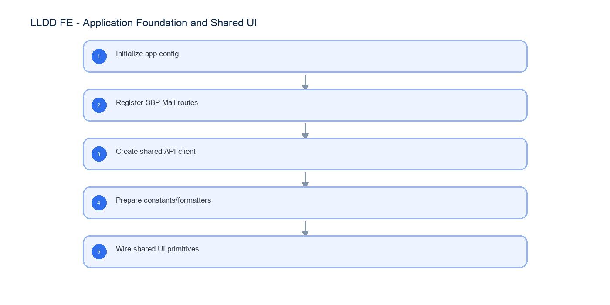

# LLDD FE - Application Foundation and Shared UI

SBP Mall - ระบบประกันรายได้ | Low Level Design Document

## 1. Overview

| รายการ | รายละเอียด |
| --- | --- |
| Track | FE |
| Estimate | 42 ชั่วโมง |
| Owner | Chidchanok <lin> Saengamnat |
| Objective | เตรียม foundation ฝั่ง Frontend สำหรับ SBP Mall: routing, API client, constants, shared state, formatters, mock mapping และ shared UI primitives; เอกสารนี้ไม่ใช่หน้าจอ Dashboard |

Common contract reference: ทุกหัวข้อ API/FE ต้องยึด LLDD-BE-API-Common-Contracts และ LLDD-FE-Integration-Contracts สำหรับ error/auth/format/pagination/action/RBAC ก่อนลงรายละเอียดเฉพาะหน้าหรือเฉพาะ endpoint

## 2. Screen / Functional Scope

- Non-screen technical foundation
- Route/module registry เฉพาะ SBP Mall
- API client และ response typing
- Shared constants/menu/status mapping
- Mock data mapping
- CSS/tokens สำหรับ table/form/modal/responsive

## 4. Implementation Flow Diagram (Reference)



_รูปที่ 1: Implementation flow reference: LLDD FE - Application Foundation and Shared UI_

## 5. Field, Format, and Validation

| Field / UI | Format | Validation | Behavior |
| --- | --- | --- | --- |
| routePath | string | required | ต้อง map กับเมนู SBP Mall |
| apiBaseUrl | URL | required by env | ใช้กับทุก API call |
| statusCode | string | must map to status dictionary | ใช้ร่วมกับ StatusBadge |
| mockData | JSON | schema compatible with API response | ใช้ก่อน BE พร้อม |

## 5.1 Input / Progress / Output Contract

| Stage | Contract for implementation |
| --- | --- |
| Input | GET /api/v1/document-statuses; GET /api/v1/me/menus |
| Progress | Initialize app config; Register SBP Mall routes; Create shared API client; Prepare constants/formatters |
| Output | Rendered UI state or normalized API response with status/message and audit-ready trace reference. |

### 5.90 Application Foundation and Shared UI Component Contract

| ID | Component / Scope | Single responsibility | Definition of done |
| --- | --- | --- | --- |
| C01 | Non-screen technical foundation | ประกอบ app bootstrap, environment validation, providers และ error boundary โดยไม่สร้าง business screen | เปิด application shell ได้เมื่อ config ครบ และ fail-fast พร้อมข้อความเมื่อ config ขาด |
| C02 | Route/module registry เฉพาะ SBP Mall | ลงทะเบียน route/module ของ SBP Mall และเชื่อม route guard กับ menuCode จาก API | ทุก route เข้าได้เฉพาะเมื่อ menu contract อนุญาตและ unknown route ไป not-found |
| C03 | API client และ response typing | จัดโครงสร้าง DTO, API adapter และ query key กลางให้ response typing ตรงกับ contract | TypeScript build ผ่านและ feature ไม่ cast unknown response แบบ ad hoc |
| C04 | Shared constants/menu/status mapping | รวม status/menu/action constants และ label resolver โดยให้ API dictionary เป็น source of truth | unknown code แสดง fallback ที่ trace ได้และไม่เพิ่มสถานะเองใน component |
| C05 | Mock data mapping | สร้าง fixture/mock ให้ใช้ schema เดียวกับ response จริง รวม success, empty และ error | สลับ mock/real adapter ได้โดยไม่แก้ component props หรือ table mapping |
| C06 | CSS/tokens สำหรับ table/form/modal/responsive | กำหนด token และ shared UI สำหรับ table, form, modal, badge และ responsive breakpoints | shared component ใช้งานได้บน desktop/tablet/mobile โดยข้อความและ control ไม่ล้น |

### 5.91 Application Foundation and Shared UI API Adapter Map

| Endpoint | Typed adapter purpose | Invoked by |
| --- | --- | --- |
| GET /api/v1/document-statuses | โหลดสถานะเอกสารสำหรับ dropdown/badge | Register module route (bootstrap) |
| GET /api/v1/me/menus | โหลดเมนูสำหรับสร้าง sidebar/route guard | Call API (React Query hook) |

### 5.92 Application Foundation and Shared UI Interaction State Machine

| Action | Trigger | API / State transition | Expected visible result |
| --- | --- | --- | --- |
| Register module route | bootstrap | client router | route guard รู้จักหน้า SBP Mall |
| Call API | React Query hook | shared API client | standard loading/error handling |

### 5.93 Application Foundation and Shared UI Feature Failure Checks

| Case | Feature-specific scenario | Expected evidence |
| --- | --- | --- |
| FE-01 | route registration | ไม่มี screenshot หรือ dashboard behavior ในเอกสารนี้ |
| FE-02 | API base missing | ทุก route ถูก register ผ่าน module registry |
| FE-03 | status unknown | API error shape ใช้ร่วมกัน |
| FE-04 | mock response compatible | ไม่มี dependency กับ Login/Auth ใหม่ |
| FE-05 | shared formatter output | CSS responsive base พร้อม |

## 6. Button / User Action Mapping

| Action | Trigger | API / Service | Expected Result |
| --- | --- | --- | --- |
| Register module route | bootstrap | client router | route guard รู้จักหน้า SBP Mall |
| Call API | React Query hook | shared API client | standard loading/error handling |

## 7. API Contract

### GET /api/v1/document-statuses

โหลดสถานะเอกสารสำหรับ dropdown/badge

#### Query Params

```json
{}
```

#### Request Field Schema

| Field | Type | Required | Constraint / Meaning |
| --- | --- | --- | --- |
| - | none | No | No fields |

#### Response

```json
{
  "items": [
    {
      "code": "06",
      "label": "รอฝ่าย SBP DSA ดำเนินการ"
    }
  ]
}
```

#### Response Field Schema

| Field | Type | Required | Constraint / Meaning |
| --- | --- | --- | --- |
| items | array<object> | Yes | JSON array; element type shown in Type column |
| items[].code | string | Yes | UTF-8; use value domain described by endpoint purpose |
| items[].label | string | Yes | UTF-8; use value domain described by endpoint purpose |

### GET /api/v1/me/menus

โหลดเมนูสำหรับสร้าง sidebar/route guard

#### Query Params

```json
{}
```

#### Request Field Schema

| Field | Type | Required | Constraint / Meaning |
| --- | --- | --- | --- |
| - | none | No | No fields |

#### Response

```json
{
  "menus": [
    {
      "menuCode": "k2-overview",
      "route": "/"
    }
  ]
}
```

#### Response Field Schema

| Field | Type | Required | Constraint / Meaning |
| --- | --- | --- | --- |
| menus | array<object> | Yes | JSON array; element type shown in Type column |
| menus[].menuCode | string | Yes | UTF-8; use value domain described by endpoint purpose |
| menus[].route | string | Yes | UTF-8; use value domain described by endpoint purpose |

## 9. Processing Flow

| Step | Description |
| --- | --- |
| 1 | Initialize app config |
| 2 | Register SBP Mall routes |
| 3 | Create shared API client |
| 4 | Prepare constants/formatters |
| 5 | Wire shared UI primitives |

## 10. Acceptance Criteria

- ไม่มี screenshot หรือ dashboard behavior ในเอกสารนี้
- ทุก route ถูก register ผ่าน module registry
- API error shape ใช้ร่วมกัน
- ไม่มี dependency กับ Login/Auth ใหม่
- CSS responsive base พร้อม

## 11. Developer Test Checklist

| No | Test |
| --- | --- |
| 1 | route registration |
| 2 | API base missing |
| 3 | status unknown |
| 4 | mock response compatible |
| 5 | shared formatter output |
