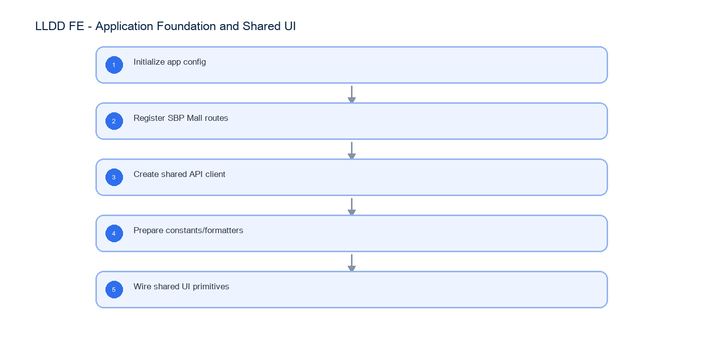

# LLDD FE - Application Foundation and Shared UI

SBP Mall - ระบบประกันรายได้ | Low Level Design Document

## 1. Overview

| รายการ | รายละเอียด |
| --- | --- |
| Track | FE |
| Estimate | 28 ชั่วโมง |
| Owner | Chidchanok <lin> Saengamnat |
| Objective | เตรียม foundation ฝั่ง Frontend สำหรับ SBP Mall: routing, API client, constants, shared state, formatters, mock mapping และ shared UI primitives; เอกสารนี้ไม่ใช่หน้าจอ Dashboard |

Common contract reference: ทุกหัวข้อ API/FE ต้องยึด LLDD-BE-API-Common-Contracts และ LLDD-FE-Integration-Contracts สำหรับ error/auth/format/pagination/action/RBAC ก่อนลงรายละเอียดเฉพาะหน้าหรือเฉพาะ endpoint

## 2. Screen / Functional Scope

- Non-screen technical foundation
- Route/module registry เฉพาะ SBP Mall
- API client และ response typing
- Shared constants/menu/status mapping
- Mock data mapping
- CSS/tokens สำหรับ table/form/modal/responsive

## 4. Implementation Flow Diagram (Reference)



_รูปที่ 1: Implementation flow reference: LLDD FE - Application Foundation and Shared UI_

## 5. Field, Format, and Validation

| Field / UI | Format | Validation | Behavior |
| --- | --- | --- | --- |
| routePath | string | required | ต้อง map กับเมนู SBP Mall |
| apiBaseUrl | URL | required by env | ใช้กับทุก API call |
| statusCode | string | must map to status dictionary | ใช้ร่วมกับ StatusBadge |
| mockData | JSON | schema compatible with API response | ใช้ก่อน BE พร้อม |

## 5.1 Input / Progress / Output Contract

| Stage | Contract for implementation |
| --- | --- |
| Input | GET /api/v1/document-statuses |
| Progress | Initialize app config; Register SBP Mall routes; Create shared API client; Prepare constants/formatters |
| Output | Rendered UI state or normalized API response with status/message and audit-ready trace reference. |

### 5.90 Application Foundation and Shared UI Component Contract

| ID | Component / Scope | Single responsibility | Definition of done |
| --- | --- | --- | --- |
| C01 | Non-screen technical foundation | ประกอบ app bootstrap, environment validation, providers และ error boundary โดยไม่สร้าง business screen | เปิด application shell ได้เมื่อ config ครบ และ fail-fast พร้อมข้อความเมื่อ config ขาด |
| C02 | Route/module registry เฉพาะ SBP Mall | ลงทะเบียน route/module ของ SBP Mall และเชื่อม route guard กับ menuCode จาก API | ทุก route เข้าได้เฉพาะเมื่อ menu contract อนุญาตและ unknown route ไป not-found |
| C03 | API client และ response typing | จัดโครงสร้าง DTO, API adapter และ query key กลางให้ response typing ตรงกับ contract | TypeScript build ผ่านและ feature ไม่ cast unknown response แบบ ad hoc |
| C04 | Shared constants/menu/status mapping | รวม status/menu/action constants และ label resolver โดยให้ API dictionary เป็น source of truth | unknown code แสดง fallback ที่ trace ได้และไม่เพิ่มสถานะเองใน component |
| C05 | Mock data mapping | สร้าง fixture/mock ให้ใช้ schema เดียวกับ response จริง รวม success, empty และ error | สลับ mock/real adapter ได้โดยไม่แก้ component props หรือ table mapping |
| C06 | CSS/tokens สำหรับ table/form/modal/responsive | กำหนด token และ shared UI สำหรับ table, form, modal, badge และ responsive breakpoints | shared component ใช้งานได้บน desktop/tablet/mobile โดยข้อความและ control ไม่ล้น |

### 5.91 Application Foundation and Shared UI API Adapter Map

| Endpoint | Typed adapter purpose | Invoked by |
| --- | --- | --- |
| GET /api/v1/document-statuses | โหลดสถานะเอกสารสำหรับ dropdown/badge | Register module route (bootstrap) |

### 5.92 Application Foundation and Shared UI Interaction State Machine

| Action | Trigger | API / State transition | Expected visible result |
| --- | --- | --- | --- |
| Register module route | bootstrap | client router | route guard รู้จักหน้า SBP Mall |
| Call API | React Query hook | shared API client | standard loading/error handling |

### 5.93 Application Foundation and Shared UI Feature Failure Checks

| Case | Feature-specific scenario | Expected evidence |
| --- | --- | --- |
| FE-01 | route registration | ไม่มี screenshot หรือ dashboard behavior ในเอกสารนี้ |
| FE-02 | API base missing | ทุก route ถูก register ผ่าน module registry |
| FE-03 | status unknown | API error shape ใช้ร่วมกัน |
| FE-04 | mock response compatible | ไม่มี dependency กับ Login/Auth ใหม่ |
| FE-05 | shared formatter output | CSS responsive base พร้อม |

## 6. Button / User Action Mapping

| Action | Trigger | API / Service | Expected Result |
| --- | --- | --- | --- |
| Register module route | bootstrap | client router | route guard รู้จักหน้า SBP Mall |
| Call API | React Query hook | shared API client | standard loading/error handling |

## 7. API Contract

### GET /api/v1/document-statuses

โหลดสถานะเอกสารสำหรับ dropdown/badge

#### Query Params

```json
{}
```

#### Request Field Schema

| Field | Type | Required | Constraint / Meaning |
| --- | --- | --- | --- |
| - | none | No | No fields |

#### Response

```json
{
  "items": [
    {
      "code": "06",
      "label": "รอฝ่าย SBP DSA ดำเนินการ"
    }
  ]
}
```

#### Response Field Schema

| Field | Type | Required | Constraint / Meaning |
| --- | --- | --- | --- |
| items | array<object> | Yes | JSON array; element type shown in Type column |
| items[].code | string | Yes | UTF-8; use value domain described by endpoint purpose |
| items[].label | string | Yes | UTF-8; use value domain described by endpoint purpose |

## 8. Skeleton Code (โครงโค้ดตั้งต้นของหน้าจอนี้)

โค้ดชุดนี้อิง convention ของ portal เดิม `srm-sps-spsap-web-frontend` (build target `sbpm`): Next.js App Router + `'use client'`, PrimeReact ที่ห่อไว้แล้วใน `@/components/Form` และ `@/components/Table`, react-hook-form + yup, Zustand `permissionStore`, axios instance กลาง `@/lib/apiClient` และ react-query 5 — **โปรเจกต์ไม่มี chart library** จึงไม่มีโค้ดกราฟในเอกสารนี้ คัดลอกไปตั้งต้นได้ทันที แล้วเติมจุดที่กำกับ `TODO:`

#### 8.1 ผังไฟล์ที่ต้องสร้าง

โครงไฟล์อิง portal เดิม (`srm-sps-spsap-web-frontend`, target `sbpm`) — โมดูล SBPGI อยู่ใต้ `src/app/(main)/sbpgi/*` และ import ผ่าน alias `@/*` ทุกจุด

| Path ไฟล์ | หน้าที่ |
| --- | --- |
| src/app/(main)/sbpgi/layout.tsx | layout ของโมดูล + prefetch lookup (ไม่สร้าง QueryClient ใหม่) |
| src/constants/sbpgi/routes.ts | route registry ของโมดูล (ใช้ร่วมกับ url ที่มาจาก GET /menus) |
| src/services/sbpgi/lookup.service.ts | service — เรียก BFF ผ่าน apiClient (GET) |
| src/hooks/sbpgi/lookup.query.ts | hook — query key factory + useQuery/useMutation + invalidate |
| src/types/sbpgi/lookup.ts | types — request/response ตาม API contract ของเอกสารนี้ |

#### 8.2 layout.tsx + route registry ของโมดูล SBPGI

```tsx
'use client';
// src/app/(main)/sbpgi/layout.tsx — โครง layout ของโมดูล SBPGI
// (main)/layout.tsx เดิมมี AppHeader / AppSider / LottieLoader / QueryClientProvider อยู่แล้ว
// โมดูลนี้จึง "ห้าม" สร้าง QueryClient ใหม่ และ "ห้าม" สร้าง axios instance ของตัวเอง

import { ReactNode } from 'react';
import { useDocumentStatusesQuery } from '@/hooks/sbpgi/lookup.query';

/** route registry ของโมดูล — ใช้ประกอบลิงก์ภายใน ส่วนเมนู/สิทธิ์ยังมาจาก GET /menus เท่านั้น */
export const SBPGI_ROUTES = {
  waiting: '/sbpgi/documents/waiting',
  related: '/sbpgi/documents/related',
  create: '/sbpgi/documents/create',
  detail: (docNo: string) => `/sbpgi/documents/${encodeURIComponent(docNo)}`,
  report: '/sbpgi/reports/status-summary',
} as const;

export default function SbpgiLayout({ children }: { children: ReactNode }) {
  // prefetch lookup ที่ทุกหน้าในโมดูลใช้ร่วมกัน (master -> staleTime ยาว)
  useDocumentStatusesQuery();

  // TODO: ใส่ ErrorBoundary ของโมดูล และ empty state เมื่อ permission ยังโหลดไม่เสร็จ
  return <div className="sbpgi-module">{children}</div>;
}
```

#### 8.3 service — `src/services/sbpgi/lookup.service.ts`

⚠️ `src/services/sbpgi/lookup.service.ts` เป็น **ไฟล์ร่วมของโมดูล SBPGI** (เอกสาร FE หลายฉบับที่ใช้ domain `lookup` ประกาศไฟล์นี้เหมือนกัน) — เวลา implement ให้ **merge เพิ่ม** เข้าไฟล์เดิม ห้ามเขียนทับทั้งไฟล์ มิฉะนั้น type/function ของเอกสารฉบับก่อนหน้าจะหายไปเงียบ ๆ

```ts
// src/services/sbpgi/lookup.service.ts
// apiClient = axios instance กลาง (baseURL = bffUrl ซึ่งรวม /api/v1 แล้ว, withCredentials, refresh-token interceptor, global loading)
// ห้ามสร้าง axios instance ใหม่ และห้าม set Authorization header เอง — session อยู่ใน httpOnly cookie ของ BFF

import apiClient from '@/lib/apiClient';
import type { ApiResponse } from '@/types/sbpgi/common';
import type * as T from '@/types/sbpgi/lookup';

/** GET /api/v1/document-statuses — โหลดสถานะเอกสารสำหรับ dropdown/badge */
export async function getDocumentStatuses(): Promise<T.DocumentStatusesResponse> {
  const { data } = await apiClient.get<ApiResponse<T.DocumentStatusesResponse>>('/document-statuses');
  return data.data;
}

// TODO: ยืนยันกับทีม BFF ว่า unwrap envelope { success, data } ที่ชั้นไหน (BFF หรือ FE)
```

#### 8.4 types — `src/types/sbpgi/lookup.ts`

⚠️ `src/types/sbpgi/lookup.ts` เป็น **ไฟล์ร่วมของโมดูล SBPGI** (เอกสาร FE หลายฉบับที่ใช้ domain `lookup` ประกาศไฟล์นี้เหมือนกัน) — เวลา implement ให้ **merge เพิ่ม** เข้าไฟล์เดิม ห้ามเขียนทับทั้งไฟล์ มิฉะนั้น type/function ของเอกสารฉบับก่อนหน้าจะหายไปเงียบ ๆ

```ts
// src/types/sbpgi/lookup.ts — ตรงกับตาราง API ในเอกสารนี้
// วันที่/เดือนเป็น ค.ศ. ทั้ง payload (ISO) และ display — ไม่แปลงเป็น พ.ศ. (มติ 2026-08-06)

/** GET /api/v1/document-statuses — 1 แถวในตาราง */
export interface DocumentStatusesItem {
  code: string;
  label: string;
}
export interface DocumentStatusesResponse { items: DocumentStatusesItem[]; }

// TODO: ใส่ nullable / required ให้ตรงกับ contract ฉบับล่าสุดของ BE
```

#### 8.5 react-query keys + hooks — `src/hooks/sbpgi/lookup.query.ts`

⚠️ `src/hooks/sbpgi/lookup.query.ts` เป็น **ไฟล์ร่วมของโมดูล SBPGI** (เอกสาร FE หลายฉบับที่ใช้ domain `lookup` ประกาศไฟล์นี้เหมือนกัน) — เวลา implement ให้ **merge เพิ่ม** เข้าไฟล์เดิม ห้ามเขียนทับทั้งไฟล์ มิฉะนั้น type/function ของเอกสารฉบับก่อนหน้าจะหายไปเงียบ ๆ

```ts
// src/hooks/sbpgi/lookup.query.ts
import { useQuery } from '@tanstack/react-query';
import * as api from '@/services/sbpgi/lookup.service';
import type * as T from '@/types/sbpgi/lookup';

export const lookupKeys = {
  all: ['sbpgi', 'lookup'] as const,
  documentStatuses: () => [...lookupKeys.all, 'documentStatuses'] as const,
};

export function useDocumentStatusesQuery() {
  return useQuery({
    queryKey: lookupKeys.documentStatuses(),
    queryFn: () => api.getDocumentStatuses(),
    staleTime: 30_000, // TODO: ปรับตามความถี่ของข้อมูลหน้านี้
  });
}
```

- ทุกหน้าเช็คสิทธิ์ด้วย `permissionStore.hasPermission(url, 'canView'|'canManage'|'canExport'|'canOther')` แล้ว render `<AccessDenied />` เมื่อไม่มีสิทธิ์
- เมนู/สิทธิ์มาจาก `GET /menus` และ `GET /groups/current-user/permissions` — ห้าม hardcode role หรือรายการเมนูใน FE
- session อยู่ใน httpOnly cookie ของ BFF (`withCredentials: true`) — FE ไม่เก็บและไม่แนบ token เอง
- payload และการแสดงผลใช้วันที่ ค.ศ. เสมอ ผ่าน formatter กลางจุดเดียว — ไม่แปลงเป็น พ.ศ. (มติ 2026-08-06)
- ข้อความ error แสดงจาก `error.message` ของ BE ตรง ๆ (ห้าม paraphrase) — fallback ใช้เฉพาะกรณี network error

## 9. Processing Flow

| Step | Description |
| --- | --- |
| 1 | Initialize app config |
| 2 | Register SBP Mall routes |
| 3 | Create shared API client |
| 4 | Prepare constants/formatters |
| 5 | Wire shared UI primitives |

## 10. Acceptance Criteria

- ไม่มี screenshot หรือ dashboard behavior ในเอกสารนี้
- ทุก route ถูก register ผ่าน module registry
- API error shape ใช้ร่วมกัน
- ไม่มี dependency กับ Login/Auth ใหม่
- CSS responsive base พร้อม

## 11. Developer Test Checklist

| No | Test |
| --- | --- |
| 1 | route registration |
| 2 | API base missing |
| 3 | status unknown |
| 4 | mock response compatible |
| 5 | shared formatter output |
