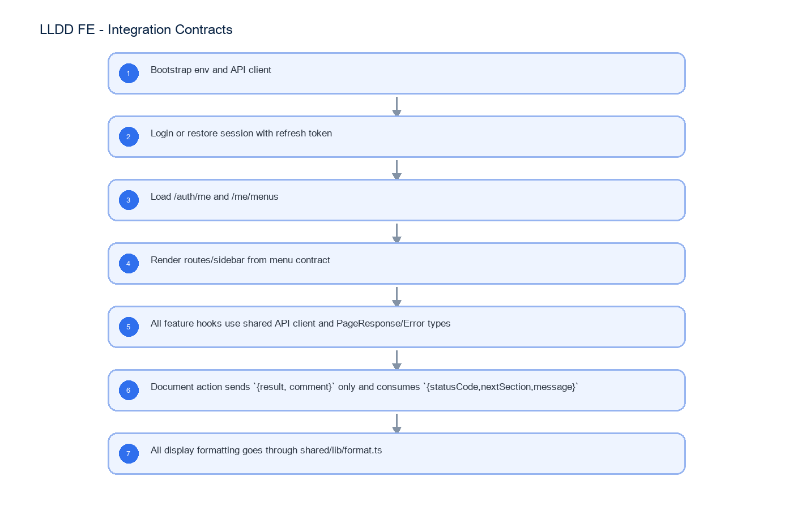

# LLDD FE - Integration Contracts

SBP Mall - ระบบประกันรายได้ | Low Level Design Document

## 1. Overview

| รายการ | รายละเอียด |
| --- | --- |
| Track | FE |
| Estimate | 18 ชั่วโมง |
| Owner | Chidchanok <lin> Saengamnat |
| Objective | กำหนดสัญญากลางฝั่ง Frontend สำหรับการ consume API ทุกหน้า: auth/session, error handling, pagination, format, document action และ RBAC/menu gating |

Common contract reference: ทุกหัวข้อ API/FE ต้องยึด LLDD-BE-API-Common-Contracts และ LLDD-FE-Integration-Contracts สำหรับ error/auth/format/pagination/action/RBAC ก่อนลงรายละเอียดเฉพาะหน้าหรือเฉพาะ endpoint

## 2. Screen / Functional Scope

- Shared API client contract
- Auth/JWT consumption from platform reference
- Error display and validation message mapping
- Date/year/money/docNo formatting
- Pagination, list empty/loading/error state
- Document action result enum and response consumption
- RBAC/menu gating and editable section flags

## 4. Implementation Flow Diagram (Reference)



_รูปที่ 1: Implementation flow reference: LLDD FE - Integration Contracts_

## 5. Field, Format, and Validation

| Field / UI | Format | Validation | Behavior |
| --- | --- | --- | --- |
| Authorization | Bearer JWT | required except /auth/login and /auth/refresh | แนบโดย axios interceptor เท่านั้น; component ห้าม set header เอง |
| ApiError | {code,message} | message required | แสดง message จาก BE ตรง ๆ; fallback ใช้เฉพาะ network/no response |
| PageResponse<T> | {page,size,total,items} | page>=1 size<=100 | ใช้กับ DataTable/Pager ทุกหน้า |
| date/month | ISO ค.ศ. YYYY-MM-DD / YYYY-MM | payload uses CE | แสดง พ.ศ. ผ่าน formatDateThai/formatMonthThai จุดเดียว |
| docNo | YYYY/xxxxx พ.ศ. | do not split except route params | route ใช้ /documents/:year/:running แล้วประกอบ docNo |
| result | verbatim from actionOptions | required before submit action | ส่งเป็น payload `{result, comment}` เท่านั้น |
| ActionResponse | {statusCode,nextSection,message} | required after action | invalidate detail/timeline/tasks แล้ว resolve label จาก /document-statuses |
| MenuItem | {menuCode,label,route,group} | from /me/menus | sidebar filter ด้วย menuCode จาก API; ไม่ hardcode role |
| canEditSections | string[] | from document detail | ใช้เปิด/ปิด section editor; FE ไม่คำนวณสิทธิ์เอง |

## 5.1 Input / Progress / Output Contract

| Stage | Contract for implementation |
| --- | --- |
| Input | ALL /api/v1/*; GET /api/v1/*?page=1&size=20; POST /api/v1/documents/{docNo}/actions |
| Progress | Bootstrap env and API client; Login or restore session with refresh token; Load /auth/me and /me/menus; Render routes/sidebar from menu contract |
| Output | Rendered UI state or normalized API response with status/message and audit-ready trace reference. |

### 5.90 Integration Contracts Component Contract

| ID | Component / Scope | Single responsibility | Definition of done |
| --- | --- | --- | --- |
| C01 | Shared API client contract | สร้าง shared API client ตัวเดียวสำหรับ base URL, trace header, timeout และ response envelope | ทุก feature import client กลางและไม่มี axios/fetch instance แยก |
| C02 | Auth/JWT consumption from platform reference | อ่าน access token จาก platform auth store, แนบ Bearer token และทำ refresh แบบ single-flight | 401 พร้อมกัน refresh ครั้งเดียว, replay request เดิม และไม่สร้างหน้า Login ใหม่ |
| C03 | Error display and validation message mapping | แปลง HTTP/Axios failure เป็น ApiError พร้อม code, message, fieldErrors และ traceId โดยไม่แก้ข้อความจาก BE | validation banner/inline error แสดงข้อความและ traceId จาก response ได้ครบ |
| C04 | Date/year/money/docNo formatting | ให้ formatter กลางสำหรับ ค.ศ./พ.ศ., เดือน, เงิน, percent และ docNo โดยไม่เปลี่ยนค่าที่ส่ง API | payload ใช้ ค.ศ.; UI แสดง พ.ศ. และรูปแบบเงิน/docNo ตรงกันทุกหน้า |
| C05 | Pagination, list empty/loading/error state | กำหนด PageResponse<T> และ state loading/empty/error/retry สำหรับ list ทุกชนิด | DataTable/Pager รักษา page/filter เดิมและไม่มี list shape เฉพาะหน้า |
| C06 | Document action result enum and response consumption | กำหนด typed action request/response และ consume statusCode/nextSection ที่ BE คำนวณ | FE ส่งเฉพาะ result/comment และไม่มี client-side workflow routing |
| C07 | RBAC/menu gating and editable section flags | สร้าง sidebar, route guard, visibleSections, editableSections และ actionOptions จาก platform/menu API | ไม่ hardcode RBAC role เป็นสิทธิ์เมนูหรือ section ที่แก้ไขได้ |

### 5.91 Integration Contracts API Adapter Map

| Endpoint | Typed adapter purpose | Invoked by |
| --- | --- | --- |
| ALL /api/v1/* | Error contract กลางสำหรับ FE ทุกหน้า | Attach token (ทุก API call) |
| GET /api/v1/*?page=1&size=20 | List/pagination contract กลาง | Refresh token (401 non-auth endpoint) |
| POST /api/v1/documents/{docNo}/actions | Document action contract ตัวอย่างเมื่อ currentSection=01 จึงเปลี่ยนไป 02; FE ห้ามส่งหรือคำนวณปลายทางเอง | Submit action (ปุ่มส่งดำเนินการ) |
| GET /api/v1/me/menus | Menu/RBAC contract สำหรับ sidebar และ route guard | Gate route/menu (login/bootstrap) |

### 5.92 Integration Contracts Interaction State Machine

| Action | Trigger | API / State transition | Expected visible result |
| --- | --- | --- | --- |
| Attach token | ทุก API call | shared/api/client.ts | Authorization header จาก auth store |
| Refresh token | 401 non-auth endpoint | POST /api/v1/auth/refresh | single-flight แล้ว replay request เดิม |
| Show API error | catch AxiosError | apiErrorMessage() | แสดงข้อความไทยจาก BE ตรง ๆ |
| Render list | GET list endpoint | PageResponse<T> | DataTable/Pager ใช้ shape เดียวกัน |
| Submit action | ปุ่มส่งดำเนินการ | POST /api/v1/documents/{docNo}/actions | ส่ง `{result, comment}` และ consume `{statusCode,nextSection,message}` |
| Gate route/menu | login/bootstrap | GET /api/v1/me/menus | สร้าง sidebar และ route guard จาก menuCode |

### 5.93 Integration Contracts Feature Failure Checks

| Case | Feature-specific scenario | Expected evidence |
| --- | --- | --- |
| FE-01 | 401 refresh single-flight | ไม่มี feature ใดสร้าง axios instance เอง |
| FE-02 | 403 route guard | ทุก API error แสดง message จาก BE โดยไม่ paraphrase |
| FE-03 | error message passthrough | ทุก list endpoint ใช้ PageResponse shape เดียวกัน |
| FE-04 | pagination pager mapping | วันที่ใน payload เป็น ค.ศ.; หน้าจอแสดง พ.ศ. จาก formatter กลาง |
| FE-05 | date BE display | Sidebar และ route access มาจาก /me/menus ไม่ hardcode role |
| FE-06 | action response invalidation | FE ไม่คำนวณ action routing เอง; ใช้ role profile และ actionOptions จาก API |

## 6. Button / User Action Mapping

| Action | Trigger | API / Service | Expected Result |
| --- | --- | --- | --- |
| Attach token | ทุก API call | shared/api/client.ts | Authorization header จาก auth store |
| Refresh token | 401 non-auth endpoint | POST /api/v1/auth/refresh | single-flight แล้ว replay request เดิม |
| Show API error | catch AxiosError | apiErrorMessage() | แสดงข้อความไทยจาก BE ตรง ๆ |
| Render list | GET list endpoint | PageResponse<T> | DataTable/Pager ใช้ shape เดียวกัน |
| Submit action | ปุ่มส่งดำเนินการ | POST /api/v1/documents/{docNo}/actions | ส่ง `{result, comment}` และ consume `{statusCode,nextSection,message}` |
| Gate route/menu | login/bootstrap | GET /api/v1/me/menus | สร้าง sidebar และ route guard จาก menuCode |

## 7. API Contract

### ALL /api/v1/*

Error contract กลางสำหรับ FE ทุกหน้า

#### Request Field Schema

| Field | Type | Required | Constraint / Meaning |
| --- | --- | --- | --- |
| - | none | No | Endpoint has no JSON body/query object |

#### Response

```json
{
  "code": "VALIDATION",
  "message": "ข้อความภาษาไทยตรงตาม SRS"
}
```

#### Response Field Schema

| Field | Type | Required | Constraint / Meaning |
| --- | --- | --- | --- |
| code | string | Yes | UTF-8; use value domain described by endpoint purpose |
| message | string | Yes | UTF-8; use value domain described by endpoint purpose |

### GET /api/v1/*?page=1&size=20

List/pagination contract กลาง

#### Query Params

```json
{
  "page": 1,
  "size": 20
}
```

#### Request Field Schema

| Field | Type | Required | Constraint / Meaning |
| --- | --- | --- | --- |
| page | integer | No | >= 1; default 1 |
| size | integer | No | 1..100; default 20 |

#### Response

```json
{
  "page": 1,
  "size": 20,
  "total": 0,
  "items": []
}
```

#### Response Field Schema

| Field | Type | Required | Constraint / Meaning |
| --- | --- | --- | --- |
| page | integer | Yes | >= 1; default 1 |
| size | integer | Yes | 1..100; default 20 |
| total | integer | Yes | UTF-8; use value domain described by endpoint purpose |
| items | array<object> | Yes | JSON array; element type shown in Type column |

### POST /api/v1/documents/{docNo}/actions

Document action contract ตัวอย่างเมื่อ currentSection=01 จึงเปลี่ยนไป 02; FE ห้ามส่งหรือคำนวณปลายทางเอง

#### Request

```json
{
  "result": "เห็นควรชดเชย",
  "comment": "เห็นควรชดเชยตามหลักเกณฑ์"
}
```

#### Request Field Schema

| Field | Type | Required | Constraint / Meaning |
| --- | --- | --- | --- |
| result | string | Yes | UTF-8; use value domain described by endpoint purpose |
| comment | string | Yes | trimmed UTF-8 Thai text; required by operation/business rule |

#### Response

```json
{
  "statusCode": "02",
  "nextSection": "02",
  "message": "submitted"
}
```

#### Response Field Schema

| Field | Type | Required | Constraint / Meaning |
| --- | --- | --- | --- |
| statusCode | string | Yes | canonical code; do not replace with display label |
| nextSection | string | Yes | canonical code; do not replace with display label |
| message | string | Yes | UTF-8; use value domain described by endpoint purpose |

### GET /api/v1/me/menus

Menu/RBAC contract สำหรับ sidebar และ route guard

#### Query Params

```json
{}
```

#### Request Field Schema

| Field | Type | Required | Constraint / Meaning |
| --- | --- | --- | --- |
| - | none | No | No fields |

#### Response

```json
{
  "menus": [
    {
      "menuCode": "k2-report",
      "label": "รายงานสรุปสถานะ",
      "route": "/reports/income-audit",
      "group": "ระบบประกันรายได้"
    }
  ]
}
```

#### Response Field Schema

| Field | Type | Required | Constraint / Meaning |
| --- | --- | --- | --- |
| menus | array<object> | Yes | JSON array; element type shown in Type column |
| menus[].menuCode | string | Yes | UTF-8; use value domain described by endpoint purpose |
| menus[].label | string | Yes | UTF-8; use value domain described by endpoint purpose |
| menus[].route | string | Yes | UTF-8; use value domain described by endpoint purpose |
| menus[].group | string | Yes | UTF-8; use value domain described by endpoint purpose |

## 9. Processing Flow

| Step | Description |
| --- | --- |
| 1 | Bootstrap env and API client |
| 2 | Login or restore session with refresh token |
| 3 | Load /auth/me and /me/menus |
| 4 | Render routes/sidebar from menu contract |
| 5 | All feature hooks use shared API client and PageResponse/Error types |
| 6 | Document action sends `{result, comment}` only and consumes `{statusCode,nextSection,message}` |
| 7 | All display formatting goes through shared/lib/format.ts |

## 10. Acceptance Criteria

- ไม่มี feature ใดสร้าง axios instance เอง
- ทุก API error แสดง message จาก BE โดยไม่ paraphrase
- ทุก list endpoint ใช้ PageResponse shape เดียวกัน
- วันที่ใน payload เป็น ค.ศ.; หน้าจอแสดง พ.ศ. จาก formatter กลาง
- Sidebar และ route access มาจาก /me/menus ไม่ hardcode role
- FE ไม่คำนวณ action routing เอง; ใช้ role profile และ actionOptions จาก API

## 11. Developer Test Checklist

| No | Test |
| --- | --- |
| 1 | 401 refresh single-flight |
| 2 | 403 route guard |
| 3 | error message passthrough |
| 4 | pagination pager mapping |
| 5 | date BE display |
| 6 | action response invalidation |
| 7 | menu filtering by API |
