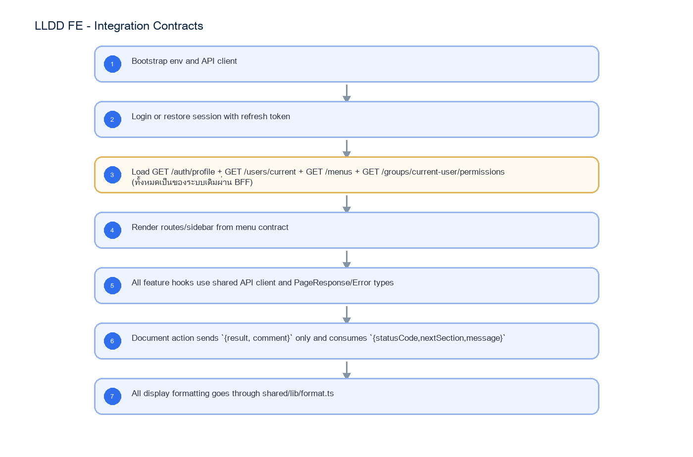

# LLDD FE - Integration Contracts

SBP Mall - ระบบประกันรายได้ | Low Level Design Document

## 1. Overview

| รายการ | รายละเอียด |
| --- | --- |
| Track | FE |
| Estimate | 16 ชั่วโมง (ไม่มี unit test แยก — ดูเหตุผลใน NO_UNIT_TEST_DOCS) |
| Owner | Chidchanok <lin> Saengamnat |
| Target repository | `SBP/srm-sps-spsap-web-frontend` (sbp-portal · Next.js · `NEXT_PUBLIC_APP_TARGET=sbpm`) — เรียก API ผ่าน `SBP/srm-sps-spsap-sbp-bff` เท่านั้น ห้ามยิง store-backend ตรง |
| Objective | กำหนดสัญญากลางฝั่ง Frontend สำหรับการ consume API ทุกหน้า: auth/session, error handling, pagination, format, document action และ RBAC/menu gating |

Common contract reference: ทุกหัวข้อ API/FE ต้องยึด LLDD-BE-API-Common-Contracts และ LLDD-FE-Integration-Contracts สำหรับ error/auth/format/pagination/action/RBAC ก่อนลงรายละเอียดเฉพาะหน้าหรือเฉพาะ endpoint

## 2. Screen / Functional Scope

- Shared API client contract
- Auth/JWT consumption from platform reference
- Error display and validation message mapping
- Date/year/money/docNo formatting
- Pagination, list empty/loading/error state
- Document action result enum and response consumption
- RBAC/menu gating and editable section flags

## 3. Screenshot Reference

ไม่มีภาพหน้าจอสำหรับหัวข้อนี้ — เป็นเอกสารฝั่ง Backend/Batch ที่ไม่มี UI (ภาพหน้าจอทั้งหมดอยู่ในเอกสารชุด FE)

## 4. Implementation Flow Diagram (Reference)



_รูปที่ 1: Implementation flow reference: LLDD FE - Integration Contracts_

## 5. Field, Format, and Validation

| Field / UI | Format | Validation | Behavior |
| --- | --- | --- | --- |
| Authorization | Bearer JWT | required except /auth/login and /auth/refresh | แนบโดย axios interceptor เท่านั้น; component ห้าม set header เอง |
| ApiError | {code,message} | message required | แสดง message จาก BE ตรง ๆ; fallback ใช้เฉพาะ network/no response |
| PageResponse<T> | {page,size,total,items} | page>=1 size<=100 | ใช้กับ DataTable/Pager ทุกหน้า |
| date/month | ISO ค.ศ. YYYY-MM-DD / YYYY-MM | payload uses CE | แสดงผ่าน formatDateThai/formatMonthThai จุดเดียว — ค่าเริ่มต้นเป็น ค.ศ. |
| docNo | YYYY/xxxxx ค.ศ. | do not split except route params | route ใช้ /documents/:year/:running แล้วประกอบ docNo |
| result | verbatim from actionOptions | required before submit action | ส่งเป็น payload `{result, comment}` เท่านั้น |
| ActionResponse | {statusCode,nextSection,message} | required after action | invalidate detail/timeline/tasks แล้ว resolve label จาก /document-statuses |
| MenuItem | {menuCode,label,route,group} | จาก GET /menus + GET /groups/current-user/permissions ของระบบเดิม (ผ่าน BFF) | sidebar filter ด้วย menuCode จาก API; ไม่ hardcode role |
| canEditSections | string[] | from document detail | ใช้เปิด/ปิด section editor; FE ไม่คำนวณสิทธิ์เอง |

### 5.9 Input / Progress / Output Contract

| Stage | Contract for implementation |
| --- | --- |
| Input | ALL /api/v1/*; GET /api/v1/*?page=1&size=20; POST /api/v1/documents/{docNo}/actions |
| Progress | Bootstrap env and API client; Login or restore session with refresh token; Load GET /auth/profile + GET /users/current + GET /menus + GET /groups/current-user/permissions (ทั้งหมดเป็นของระบบเดิมผ่าน BFF); Render routes/sidebar from menu contract |
| Output | Rendered UI state or normalized API response with status/message and audit-ready trace reference. |

### 5.90 Integration Contracts Component Contract

| ID | Component / Scope | Single responsibility | Definition of done |
| --- | --- | --- | --- |
| C01 | Shared API client contract | สร้าง shared API client ตัวเดียวสำหรับ base URL, trace header, timeout และ response envelope | ทุก feature import client กลางและไม่มี axios/fetch instance แยก |
| C02 | Auth/JWT consumption from platform reference | อ่าน access token จาก platform auth store, แนบ Bearer token และทำ refresh แบบ single-flight | 401 พร้อมกัน refresh ครั้งเดียว, replay request เดิม และไม่สร้างหน้า Login ใหม่ |
| C03 | Error display and validation message mapping | แปลง HTTP/Axios failure เป็น ApiError พร้อม code, message, fieldErrors และ traceId โดยไม่แก้ข้อความจาก BE | validation banner/inline error แสดงข้อความและ traceId จาก response ได้ครบ |
| C04 | Date/year/money/docNo formatting | ให้ formatter กลางสำหรับวันที่ (ค.ศ.), เดือน, เงิน, percent และ docNo โดยไม่เปลี่ยนค่าที่ส่ง API | payload และ UI ใช้ ค.ศ. เป็นค่าเริ่มต้น (buddhistEra=false); รูปแบบเงิน/docNo ตรงกันทุกหน้า |
| C05 | Pagination, list empty/loading/error state | กำหนด PageResponse<T> และ state loading/empty/error/retry สำหรับ list ทุกชนิด | DataTable/Pager รักษา page/filter เดิมและไม่มี list shape เฉพาะหน้า |
| C06 | Document action result enum and response consumption | กำหนด typed action request/response และ consume statusCode/nextSection ที่ BE คำนวณ | FE ส่งเฉพาะ result/comment และไม่มี client-side workflow routing |
| C07 | RBAC/menu gating and editable section flags | สร้าง sidebar, route guard, visibleSections, editableSections และ actionOptions จาก platform/menu API | ไม่ hardcode RBAC role เป็นสิทธิ์เมนูหรือ section ที่แก้ไขได้ |

### 5.91 Integration Contracts API Adapter Map

| Endpoint | Typed adapter purpose | Invoked by |
| --- | --- | --- |
| ALL /api/v1/* | Error contract กลางสำหรับ FE ทุกหน้า | Attach token (ทุก API call) |
| GET /api/v1/*?page=1&size=20 | List/pagination contract กลาง | Refresh token (401 non-auth endpoint) |
| POST /api/v1/documents/{docNo}/actions | Document action contract ตัวอย่างเมื่อ currentSection=01 จึงเปลี่ยนไป 02; FE ห้ามส่งหรือคำนวณปลายทางเอง | Submit action (ปุ่มส่งดำเนินการ) |

### 5.92 Integration Contracts Interaction State Machine

| Action | Trigger | API / State transition | Expected visible result |
| --- | --- | --- | --- |
| Attach token | ทุก API call | shared/api/client.ts | Authorization header จาก auth store |
| Refresh token | 401 non-auth endpoint | POST /api/v1/auth/refresh | single-flight แล้ว replay request เดิม |
| Show API error | catch AxiosError | apiErrorMessage() | แสดงข้อความไทยจาก BE ตรง ๆ |
| Render list | GET list endpoint | PageResponse<T> | DataTable/Pager ใช้ shape เดียวกัน |
| Submit action | ปุ่มส่งดำเนินการ | POST /api/v1/documents/{docNo}/actions | ส่ง `{result, comment}` และ consume `{statusCode,nextSection,message}` |
| Gate route/menu | login/bootstrap | GET /menus + GET /groups/current-user/permissions (ระบบเดิม ผ่าน BFF) | สร้าง sidebar และ route guard จาก menuCode |

### 5.93 Integration Contracts Feature Failure Checks

| Case | Feature-specific scenario | Expected evidence |
| --- | --- | --- |
| FE-01 | 401 refresh single-flight | ไม่มี feature ใดสร้าง axios instance เอง |
| FE-02 | 403 route guard | ทุก API error แสดง message จาก BE โดยไม่ paraphrase |
| FE-03 | error message passthrough | ทุก list endpoint ใช้ PageResponse shape เดียวกัน |
| FE-04 | pagination pager mapping | วันที่ใน payload และหน้าจอเป็น ค.ศ. จาก formatter กลาง (แสดง พ.ศ. เฉพาะจุดที่เปิด flag) |
| FE-05 | date BE display | Sidebar และ route access มาจาก GET /menus ของระบบเดิม ไม่ hardcode role |
| FE-06 | action response invalidation | FE ไม่คำนวณ action routing เอง; ใช้ role profile และ actionOptions จาก API |

## 6. Button / User Action Mapping

| Action | Trigger | API / Service | Expected Result |
| --- | --- | --- | --- |
| Attach token | ทุก API call | shared/api/client.ts | Authorization header จาก auth store |
| Refresh token | 401 non-auth endpoint | POST /api/v1/auth/refresh | single-flight แล้ว replay request เดิม |
| Show API error | catch AxiosError | apiErrorMessage() | แสดงข้อความไทยจาก BE ตรง ๆ |
| Render list | GET list endpoint | PageResponse<T> | DataTable/Pager ใช้ shape เดียวกัน |
| Submit action | ปุ่มส่งดำเนินการ | POST /api/v1/documents/{docNo}/actions | ส่ง `{result, comment}` และ consume `{statusCode,nextSection,message}` |
| Gate route/menu | login/bootstrap | GET /menus + GET /groups/current-user/permissions (ระบบเดิม ผ่าน BFF) | สร้าง sidebar และ route guard จาก menuCode |

## 7. API Contract

### ALL /api/v1/*

Error contract กลางสำหรับ FE ทุกหน้า

#### Request Field Schema

| Field | Type | Required | Constraint / Meaning |
| --- | --- | --- | --- |
| - | none | No | Endpoint has no JSON body/query object |

#### Response

```json
{
  "code": "VALIDATION",
  "message": "ข้อความภาษาไทยตรงตาม SRS"
}
```

#### Response Field Schema

| Field | Type | Required | Constraint / Meaning |
| --- | --- | --- | --- |
| code | string | Yes | UTF-8; use value domain described by endpoint purpose |
| message | string | Yes | UTF-8; use value domain described by endpoint purpose |

### GET /api/v1/*?page=1&size=20

List/pagination contract กลาง

#### Query Params

```json
{
  "page": 1,
  "size": 20
}
```

#### Request Field Schema

| Field | Type | Required | Constraint / Meaning |
| --- | --- | --- | --- |
| page | integer | No | >= 1; default 1 |
| size | integer | No | 1..100; default 20 |

#### Response

```json
{
  "page": 1,
  "size": 20,
  "total": 0,
  "items": []
}
```

#### Response Field Schema

| Field | Type | Required | Constraint / Meaning |
| --- | --- | --- | --- |
| page | integer | Yes | >= 1; default 1 |
| size | integer | Yes | 1..100; default 20 |
| total | integer | Yes | UTF-8; use value domain described by endpoint purpose |
| items | array<object> | Yes | JSON array; element type shown in Type column |

### POST /api/v1/documents/{docNo}/actions

Document action contract ตัวอย่างเมื่อ currentSection=01 จึงเปลี่ยนไป 02; FE ห้ามส่งหรือคำนวณปลายทางเอง

#### Request

```json
{
  "result": "เห็นควรชดเชย",
  "comment": "เห็นควรชดเชยตามหลักเกณฑ์"
}
```

#### Request Field Schema

| Field | Type | Required | Constraint / Meaning |
| --- | --- | --- | --- |
| result | string | Yes | UTF-8; use value domain described by endpoint purpose |
| comment | string | Yes | trimmed UTF-8 Thai text; required by operation/business rule |

#### Response

```json
{
  "statusCode": "02",
  "nextSection": "02",
  "message": "submitted"
}
```

#### Response Field Schema

| Field | Type | Required | Constraint / Meaning |
| --- | --- | --- | --- |
| statusCode | string | Yes | canonical code; do not replace with display label |
| nextSection | string | Yes | canonical code; do not replace with display label |
| message | string | Yes | UTF-8; use value domain described by endpoint purpose |

## 8. Skeleton Code (โครงโค้ดตั้งต้นของหน้าจอนี้)

โค้ดชุดนี้อิง convention ของ portal เดิม `srm-sps-spsap-web-frontend` (build target `sbpm`): Next.js App Router + `'use client'`, PrimeReact ที่ห่อไว้แล้วใน `@/components/Form` และ `@/components/Table`, react-hook-form + yup, Zustand `permissionStore`, axios instance กลาง `@/lib/apiClient` และ react-query 5 — **โปรเจกต์ไม่มี chart library** จึงไม่มีโค้ดกราฟในเอกสารนี้ คัดลอกไปตั้งต้นได้ทันที แล้วเติมจุดที่กำกับ `TODO:`

#### 8.1 ผังไฟล์ที่ต้องสร้าง

โครงไฟล์อิง portal เดิม (`srm-sps-spsap-web-frontend`, target `sbpm`) — โมดูล SBPGI อยู่ใต้ `src/app/(main)/sbpgi/*` และ import ผ่าน alias `@/*` ทุกจุด

| Path ไฟล์ | หน้าที่ |
| --- | --- |
| src/types/sbpgi/common.ts | types — ApiResponse / PageResponse / ApiError กลางของโมดูล |
| src/lib/sbpgi/apiError.ts | helper — แปลง AxiosError เป็นข้อความไทยจาก BE (ไม่ paraphrase) |
| src/utils/sbpgi/format.ts | helper — formatMonthThai / formatAmount / docNo (ค.ศ. ทั้งหมด · ไม่แปลง พ.ศ.) |
| src/services/sbpgi/integration.service.ts | service — เรียก BFF ผ่าน apiClient (POST) |
| src/hooks/sbpgi/integration.query.ts | hook — query key factory + useQuery/useMutation + invalidate |
| src/types/sbpgi/integration.ts | types — request/response ตาม API contract ของเอกสารนี้ |

#### 8.2 types/helper กลาง (envelope, error message, formatter)

```ts
// src/types/sbpgi/common.ts — สัญญากลางที่ทุกหน้าในโมดูล SBPGI ใช้ร่วมกัน
// envelope ต้องตรงกับ store-backend: { success, data } / { success:false, data:null, error:{code,message} }

export interface ApiError {
  code: string;    // เช่น VALIDATION, ACTION_RESULT_REQUIRED
  message: string; // ข้อความไทย verbatim จาก BE — ห้าม paraphrase ฝั่ง FE
}

export interface ApiResponse<T> {
  success: boolean;
  data: T;
  error?: ApiError | null;
}

export interface PageResponse<T> {
  page: number;  // >= 1
  size: number;  // <= 100
  total: number;
  items: T[];
}

/** payload ของทุก workflow action — FE ส่งได้แค่ 2 field นี้ ห้ามส่ง nextSection เอง */
export interface DocumentActionRequest {
  result: string;   // ต้องเป็นค่าจาก actionOptions ที่ API ส่งมาเท่านั้น
  comment: string;
}

export interface ActionResponse {
  statusCode: string;
  nextSection: string | null;
  message: string;
}

// ---------------------------------------------------------------------------
// src/lib/sbpgi/apiError.ts
// ---------------------------------------------------------------------------
import { AxiosError } from 'axios';

export function apiErrorMessage(error: unknown): string {
  const message = (error as AxiosError<{ error?: ApiError }>)?.response?.data?.error?.message;
  if (message) return message;                        // ใช้ข้อความจาก BE ตรง ๆ
  return 'ไม่สามารถเชื่อมต่อระบบได้ กรุณาลองใหม่อีกครั้ง'; // fallback เฉพาะ network/no-response
}

// ---------------------------------------------------------------------------
// src/utils/sbpgi/format.ts — formatter กลางจุดเดียว · ค.ศ. ทั้ง payload และ display (มติ 2026-08-06)
// ---------------------------------------------------------------------------
export const formatMonthThai = (isoMonth: string): string => {
  const [year, month] = isoMonth.split('-');
  return `${month}/${Number(year) + 543}`;
};

export const formatAmount = (value: number): string =>
  value.toLocaleString('th-TH', { minimumFractionDigits: 2, maximumFractionDigits: 2 });

// TODO: ยืนยันรูปแบบวันที่/เดือนกับ SRS ก่อนใช้จริง (บางหน้าจอแสดง ค.ศ. ตามระบบ SBP เดิม)
```

#### 8.3 service — `src/services/sbpgi/integration.service.ts`

```ts
// src/services/sbpgi/integration.service.ts
// apiClient = axios instance กลาง (baseURL = bffUrl ซึ่งรวม /api/v1 แล้ว, withCredentials, refresh-token interceptor, global loading)
// ห้ามสร้าง axios instance ใหม่ และห้าม set Authorization header เอง — session อยู่ใน httpOnly cookie ของ BFF

import apiClient from '@/lib/apiClient';
import type { ApiResponse } from '@/types/sbpgi/common';
import type * as T from '@/types/sbpgi/integration';

/** POST /api/v1/documents/{docNo}/actions — Document action contract ตัวอย่างเมื่อ currentSection=01 จึงเปลี่ยนไป 02; FE ห้ามส่งหรือคำนวณปลายทางเอง */
export async function createDocumentsActions(docNo: string, body: T.CreateDocumentsActionsRequest): Promise<T.CreateDocumentsActionsResponse> {
  const { data } = await apiClient.post<ApiResponse<T.CreateDocumentsActionsResponse>>(`/documents/${encodeURIComponent(docNo)}/actions`, body);
  return data.data;
}

// TODO: ยืนยันกับทีม BFF ว่า unwrap envelope { success, data } ที่ชั้นไหน (BFF หรือ FE)
```

#### 8.4 types — `src/types/sbpgi/integration.ts`

```ts
// src/types/sbpgi/integration.ts — ตรงกับตาราง API ในเอกสารนี้
// วันที่/เดือนเป็น ค.ศ. ทั้ง payload (ISO) และ display — ไม่แปลงเป็น พ.ศ. (มติ 2026-08-06)

/** POST /api/v1/documents/{docNo}/actions — request */
export interface CreateDocumentsActionsRequest {
  result: string;
  comment: string;
}

/** POST /api/v1/documents/{docNo}/actions — response */
export interface CreateDocumentsActionsResponse {
  statusCode: string;
  nextSection: string;
  message: string;
}

// TODO: ใส่ nullable / required ให้ตรงกับ contract ฉบับล่าสุดของ BE
```

#### 8.5 react-query keys + hooks — `src/hooks/sbpgi/integration.query.ts`

```ts
// src/hooks/sbpgi/integration.query.ts
import { useMutation, useQueryClient } from '@tanstack/react-query';
import * as api from '@/services/sbpgi/integration.service';
import type * as T from '@/types/sbpgi/integration';

export const integrationKeys = {
  all: ['sbpgi', 'integration'] as const,
};

export function useCreateDocumentsActionsMutation(docNo: string) {
  const qc = useQueryClient();
  return useMutation({
    mutationFn: (body: T.CreateDocumentsActionsRequest) => api.createDocumentsActions(docNo, body),
    onSuccess: () => {
      qc.invalidateQueries({ queryKey: integrationKeys.all }); // reload list/detail/timeline
    },
    // TODO: onError -> แสดง apiErrorMessage(error) ผ่าน Toast กลาง
  });
}
```

- ทุกหน้าเช็คสิทธิ์ด้วย `permissionStore.hasPermission(url, 'canView'|'canManage'|'canExport'|'canOther')` แล้ว render `<AccessDenied />` เมื่อไม่มีสิทธิ์
- เมนู/สิทธิ์มาจาก `GET /menus` และ `GET /groups/current-user/permissions` — ห้าม hardcode role หรือรายการเมนูใน FE
- session อยู่ใน httpOnly cookie ของ BFF (`withCredentials: true`) — FE ไม่เก็บและไม่แนบ token เอง
- payload และการแสดงผลใช้วันที่ ค.ศ. เสมอ ผ่าน formatter กลางจุดเดียว — ไม่แปลงเป็น พ.ศ. (มติ 2026-08-06)
- ข้อความ error แสดงจาก `error.message` ของ BE ตรง ๆ (ห้าม paraphrase) — fallback ใช้เฉพาะกรณี network error

## 9. Processing Flow

| Step | Description |
| --- | --- |
| 1 | Bootstrap env and API client |
| 2 | Login or restore session with refresh token |
| 3 | Load GET /auth/profile + GET /users/current + GET /menus + GET /groups/current-user/permissions (ทั้งหมดเป็นของระบบเดิมผ่าน BFF) |
| 4 | Render routes/sidebar from menu contract |
| 5 | All feature hooks use shared API client and PageResponse/Error types |
| 6 | Document action sends `{result, comment}` only and consumes `{statusCode,nextSection,message}` |
| 7 | All display formatting goes through shared/lib/format.ts |

## 10. Acceptance Criteria

- ไม่มี feature ใดสร้าง axios instance เอง
- ทุก API error แสดง message จาก BE โดยไม่ paraphrase
- ทุก list endpoint ใช้ PageResponse shape เดียวกัน
- วันที่ใน payload และหน้าจอเป็น ค.ศ. จาก formatter กลาง (แสดง พ.ศ. เฉพาะจุดที่เปิด flag)
- Sidebar และ route access มาจาก GET /menus ของระบบเดิม ไม่ hardcode role
- FE ไม่คำนวณ action routing เอง; ใช้ role profile และ actionOptions จาก API

## 11. Developer Test Checklist

| No | Test |
| --- | --- |
| 1 | 401 refresh single-flight |
| 2 | 403 route guard |
| 3 | error message passthrough |
| 4 | pagination pager mapping |
| 5 | date BE display |
| 6 | action response invalidation |
| 7 | menu filtering by API |
