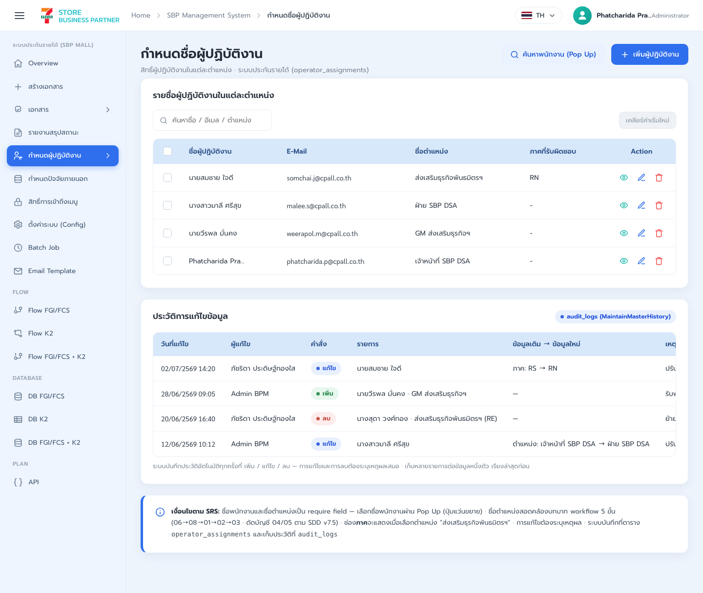
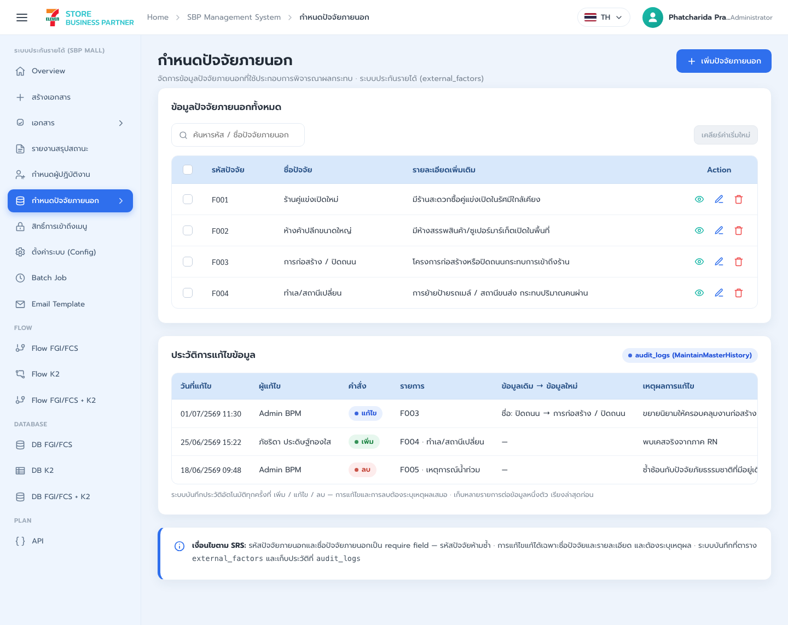
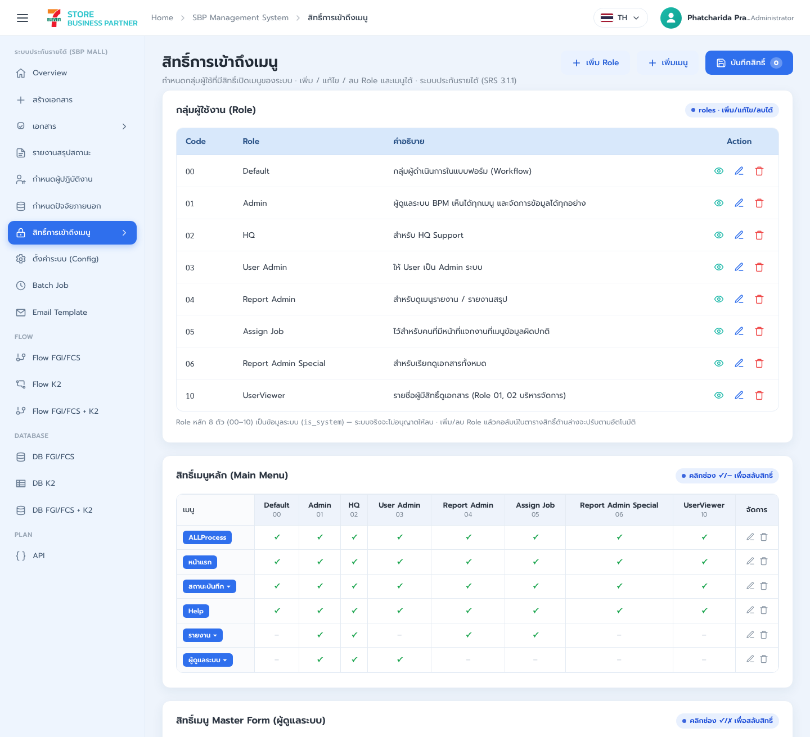
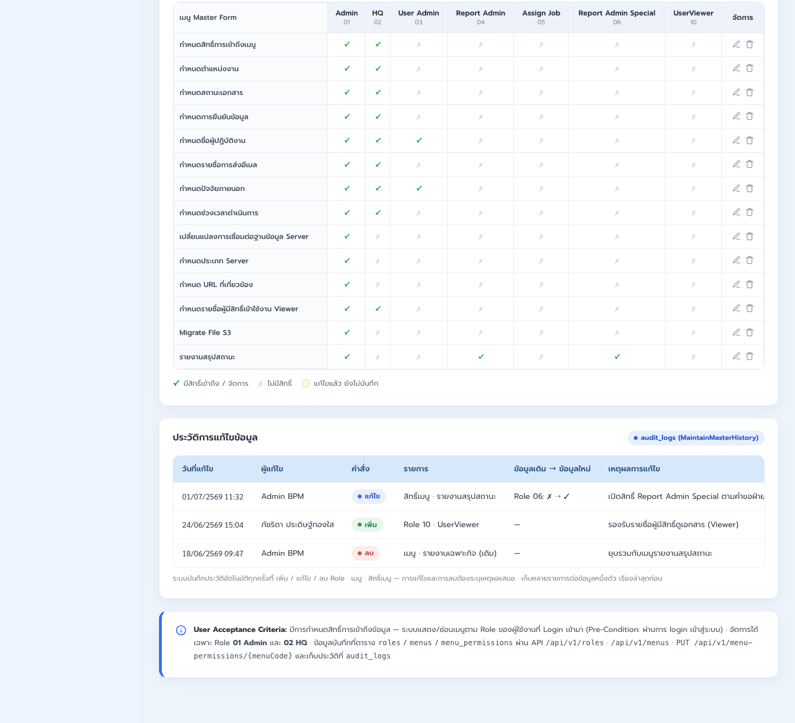
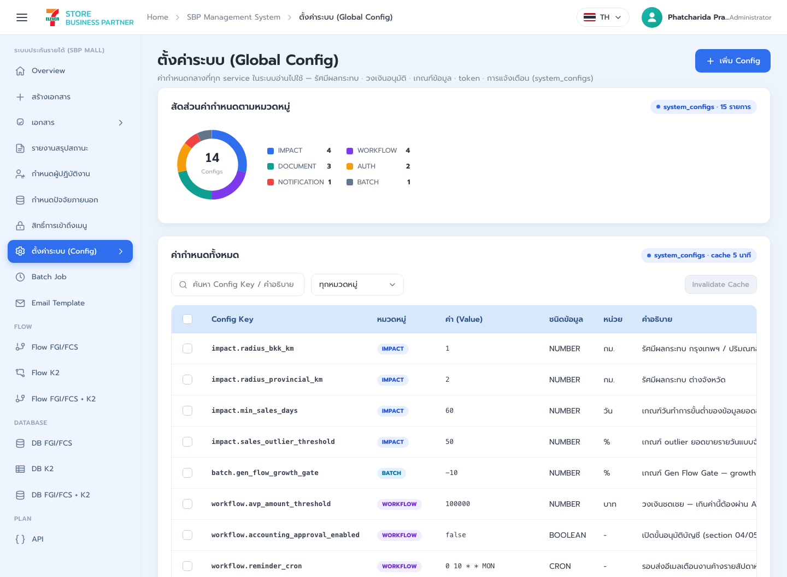
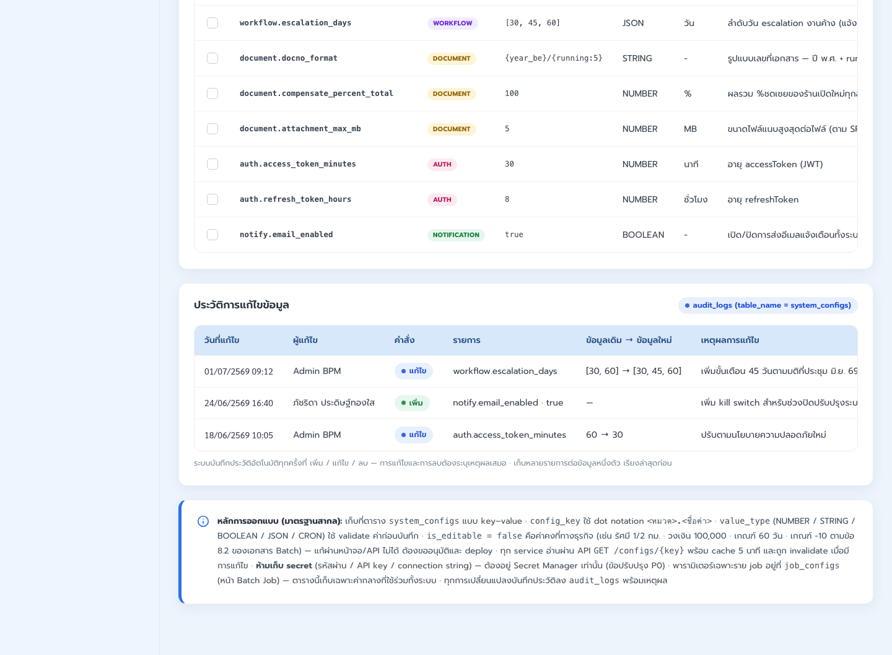
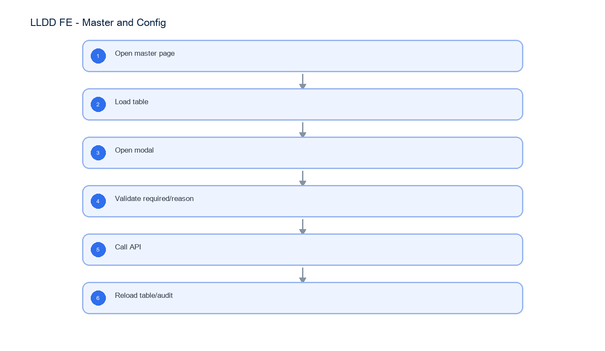

# LLDD FE - Master and Config

SBP Mall - ระบบประกันรายได้ | Low Level Design Document

## 1. Overview

| รายการ | รายละเอียด |
| --- | --- |
| Track | FE |
| Estimate | 30 ชั่วโมง |
| Owner | Peerakorn <Pete> Sakunkaewphithak |
| Objective | สร้างหน้าจอผู้ปฏิบัติงาน ปัจจัยภายนอก สิทธิ์เมนู และตั้งค่าระบบ |

Common contract reference: ทุกหัวข้อ API/FE ต้องยึด LLDD-BE-API-Common-Contracts และ LLDD-FE-Integration-Contracts สำหรับ error/auth/format/pagination/action/RBAC ก่อนลงรายละเอียดเฉพาะหน้าหรือเฉพาะ endpoint

## 2. Screen / Functional Scope

- Operator master
- External factor master
- Menu permission
- System/Global Config (SCR-11)
- CRUD modal
- Audit/reason

## 3. Screenshot Reference



_รูปที่ 1: Screenshot: k2-operators-01.png_



_รูปที่ 2: Screenshot: k2-factors-01.png_



_รูปที่ 3: Screenshot: k2-permissions-01.png_



_รูปที่ 4: Screenshot: k2-permissions-02.png_



_รูปที่ 5: Screenshot: system-config-01.png_



_รูปที่ 6: Screenshot: system-config-02.png_

## 4. Implementation Flow Diagram (Reference)



_รูปที่ 7: Implementation flow reference: LLDD FE - Master and Config_

## 5. Field, Format, and Validation

| Field / UI | Format | Validation | Behavior |
| --- | --- | --- | --- |
| employeeName | string | required | เลือกจาก popup/search |
| position | dropdown | required | เลือกตำแหน่ง |
| factorCode | string | required unique | ห้ามซ้ำ |
| reason | text | required on edit/delete | บันทึก audit |
| configValue | string/number/boolean | validate by type | ห้ามแก้ is_editable=false |

### 5.1 Screen Boundary and Route Matrix

หัวข้อนี้ประกอบด้วย 4 หน้าจออิสระ แต่ละหน้ามี route, state, validation และ endpoint ของตนเอง ห้าม implement เป็น form/table เดียวที่สลับชนิดข้อมูลด้วยเงื่อนไขใน component เดียว

| Screen | Route / Component | Primary model | Main operations |
| --- | --- | --- | --- |
| SCR-08 ผู้ปฏิบัติงาน | /admin/operators / OperatorAssignmentPage | OperatorAssignment | search employee, list, add, edit, deactivate, audit reason |
| SCR-09 ปัจจัยภายนอก | /admin/external-factors / ExternalFactorPage | ExternalFactor | list, add, edit, delete, duplicate-code guard |
| SCR-10 สิทธิ์เมนู | /admin/menu-permissions / MenuPermissionPage | MenuPermissionMatrix | load roles/menus, toggle canView, save per menu, refresh guard |
| SCR-11 ตั้งค่าระบบ | /admin/system-config / SystemConfigPage | SystemConfig | list, typed editor, immutable-key guard, audit reason |

### 5.2 SCR-08 Operator Assignment

| Field | Type | Required / Rule | UI behavior |
| --- | --- | --- | --- |
| id | integer | response only | row key |
| employeeId | string | required; selected from employee search | store employee id, not display name |
| employeeName | string | read-only | filled from selected employee |
| positionCode | enum 06\|08\|01\|02\|03 | required | workflow position selector |
| zoneCode | string \| null | optional by position | preserve leading zero if numeric-looking |
| active | boolean | required | deactivation requires reason |
| reason | string | required for create/update/deactivate | audit dialog before submit |

### 5.3 SCR-09 External Factor

| Field | Type | Required / Rule | UI behavior |
| --- | --- | --- | --- |
| factorCode | string | required; unique; immutable after create | uppercase and trim before submit |
| factorName | string | required; 1..200 chars | Thai UTF-8 supported |
| description | string \| null | optional; max 1000 chars | multiline editor |
| active | boolean | required | inactive rows remain visible under filter |
| reason | string | required for mutation | include in request and audit |

### 5.4 SCR-10 Menu Permission Matrix

| Field | Type | Required / Rule | UI behavior |
| --- | --- | --- | --- |
| menuCode | string | required; row key | one menu per row |
| menuName | string | response only | Thai display label |
| permissions[].roleCode | string | required | one column per role |
| permissions[].canView | boolean | required | toggle; dirty state tracked per menu |
| reason | string | required on save | save one menu row atomically |

### 5.5 SCR-11 System Config

| Field | Type | Required / Rule | UI behavior |
| --- | --- | --- | --- |
| key | string | required; unique; immutable | configuration key |
| value | string \| number \| boolean | required; validate by valueType | typed control, never secret input |
| valueType | enum STRING\|INTEGER\|DECIMAL\|BOOLEAN\|URL | required | drives editor and validation |
| editable | boolean | response only | false disables edit/delete |
| description | string | required | explain runtime impact |
| reason | string | required for mutation | audit dialog before submit |

### 5.6 Screen-level Acceptance

- แต่ละ SCR มี route/component/state แยกและสามารถ test/release แยกกันได้
- mutation ทุกหน้าส่ง reason และ refresh เฉพาะ resource ที่เปลี่ยน
- SCR-08 ไม่รับ employeeName ที่พิมพ์เองแทน employeeId จากผลค้นหา
- SCR-09 กัน factorCode ซ้ำทั้ง client response handling และ BE error
- SCR-10 rollback toggle เมื่อ save ล้มเหลวและคง dirty indication
- SCR-11 ไม่ render secret value และห้ามแก้ record ที่ editable=false

## 5.1 Input / Progress / Output Contract

| Stage | Contract for implementation |
| --- | --- |
| Input | GET /api/v1/operators; POST /api/v1/operators; PUT /api/v1/operators/{id} |
| Progress | Open master page; Load table; Open modal; Validate required/reason |
| Output | Rendered UI state or normalized API response with status/message and audit-ready trace reference. |

### 5.90 Master and Config Component Contract

| ID | Component / Scope | Single responsibility | Definition of done |
| --- | --- | --- | --- |
| C01 | Operator master | โหลด/ค้นหา/เพิ่ม/แก้/ปิด operator โดยเลือก employee จาก employee search | duplicate/invalid employee ถูก block และ mutation สำเร็จ refresh row/audit |
| C02 | External factor master | จัดการ factor CRUD รวม DELETE เฉพาะรายการที่ไม่ถูกใช้งานและต้องมี reason | factorCode ซ้ำไม่ได้, conflict แสดงข้อความ และ deleted row หายหลัง refresh |
| C03 | Menu permission | render role x menu matrix จาก canAccess และบันทึก permission ราย menu | toggle optimistic ได้เฉพาะเมื่อ rollback on error และค่าหลัง reload ตรงฐานข้อมูล |
| C04 | System/Global Config (SCR-11) | render config ตาม valueType/unit/isEditable และกัน secret/locked config จากการแก้ | type/range validation ผ่านและ isEditable=false ไม่มี enabled mutation control |
| C05 | CRUD modal | ใช้ modal mode ADD/EDIT/DELETE แยก initial values, validation และ confirm copy | เปลี่ยน mode ไม่ทิ้ง stale field และปุ่ม submit กัน double request |
| C06 | Audit/reason | บังคับ reason สำหรับ mutation และแสดง auditId/updatedBy/updatedAt หลังบันทึก | mutation ที่ไม่มี reason ไม่ออก request และ evidence trace กลับ audit log ได้ |

### 5.91 Master and Config API Adapter Map

| Endpoint | Typed adapter purpose | Invoked by |
| --- | --- | --- |
| GET /api/v1/operators | SCR-08 list/filter ผู้ปฏิบัติงาน | Add/Edit/Delete (modal action) |
| POST /api/v1/operators | SCR-08 เพิ่มผู้ปฏิบัติงาน | Search employee (แว่นขยาย) |
| PUT /api/v1/operators/{id} | SCR-08 แก้ไข/ปิดใช้งานผู้ปฏิบัติงาน | Save permission (toggle permission) |
| GET /api/v1/employees/search | SCR-08 popup ค้นหาพนักงาน | Search employee (แว่นขยาย) |
| GET /api/v1/factors | SCR-09 list/filter ปัจจัยภายนอก | Search employee (แว่นขยาย) |
| POST /api/v1/factors | SCR-09 เพิ่มปัจจัยภายนอก | Save permission (toggle permission) |
| PUT /api/v1/factors/{code} | SCR-09 แก้ไขปัจจัยภายนอก | Add/Edit/Delete (modal action) |
| DELETE /api/v1/factors/{code} | SCR-09 ลบปัจจัยภายนอกที่ไม่ถูกใช้งาน | Search employee (แว่นขยาย) |
| GET /api/v1/menu-permissions | อ่าน matrix สิทธิ์เมนูทุก role | Save permission (toggle permission) |
| PUT /api/v1/menu-permissions/{menuCode} | บันทึกสิทธิ์เมนูรายเมนู | Save permission (toggle permission) |
| GET /api/v1/configs | SCR-11 list ค่าระบบ | Search employee (แว่นขยาย) |
| POST /api/v1/configs | SCR-11 เพิ่มค่าระบบที่ไม่ใช่ secret | Save permission (toggle permission) |
| PUT /api/v1/configs/{key} | SCR-11 แก้ค่าระบบที่ editable=true | Add/Edit/Delete (modal action) |

### 5.92 Master and Config Interaction State Machine

| Action | Trigger | API / State transition | Expected visible result |
| --- | --- | --- | --- |
| Add/Edit/Delete | modal action | POST/PUT/DELETE master API | update table + audit |
| Search employee | แว่นขยาย | GET /api/v1/employees/search | select employee |
| Save permission | toggle permission | PUT /api/v1/menu-permissions/{menuCode} | save matrix |

### 5.93 Master and Config Feature Failure Checks

| Case | Feature-specific scenario | Expected evidence |
| --- | --- | --- |
| FE-01 | add operator | แก้ master ต้องมี reason |
| FE-02 | edit factor without reason | factorCode ซ้ำไม่ได้ |
| FE-03 | duplicate factor | permission toggle save ได้ |
| FE-04 | save permission | config type validate |
| FE-05 | edit locked config | แก้ master ต้องมี reason |

## 6. Button / User Action Mapping

| Action | Trigger | API / Service | Expected Result |
| --- | --- | --- | --- |
| Add/Edit/Delete | modal action | POST/PUT/DELETE master API | update table + audit |
| Search employee | แว่นขยาย | GET /api/v1/employees/search | select employee |
| Save permission | toggle permission | PUT /api/v1/menu-permissions/{menuCode} | save matrix |

## 7. API Contract

### GET /api/v1/operators

SCR-08 list/filter ผู้ปฏิบัติงาน

#### Query Params

```json
{
  "q": "สมชาย",
  "positionCode": "06",
  "active": true,
  "page": 1,
  "size": 20
}
```

#### Request Field Schema

| Field | Type | Required | Constraint / Meaning |
| --- | --- | --- | --- |
| q | string | No | UTF-8; use value domain described by endpoint purpose |
| positionCode | string | No | UTF-8; use value domain described by endpoint purpose |
| active | boolean | No | UTF-8; use value domain described by endpoint purpose |
| page | integer | No | >= 1; default 1 |
| size | integer | No | 1..100; default 20 |

#### Response

```json
{
  "page": 1,
  "size": 20,
  "total": 1,
  "items": [
    {
      "id": 1,
      "employeeId": "E001",
      "employeeName": "สมชาย ใจดี",
      "positionCode": "06",
      "zoneCode": "01",
      "active": true,
      "updatedAt": "2026-07-22T10:00:00+07:00"
    }
  ]
}
```

#### Response Field Schema

| Field | Type | Required | Constraint / Meaning |
| --- | --- | --- | --- |
| page | integer | Yes | >= 1; default 1 |
| size | integer | Yes | 1..100; default 20 |
| total | integer | Yes | UTF-8; use value domain described by endpoint purpose |
| items | array<object> | Yes | JSON array; element type shown in Type column |
| items[].id | integer | Yes | UTF-8; use value domain described by endpoint purpose |
| items[].employeeId | string | Yes | UTF-8; use value domain described by endpoint purpose |
| items[].employeeName | string | Yes | UTF-8; use value domain described by endpoint purpose |
| items[].positionCode | string | Yes | UTF-8; use value domain described by endpoint purpose |
| items[].zoneCode | string | Yes | UTF-8; use value domain described by endpoint purpose |
| items[].active | boolean | Yes | UTF-8; use value domain described by endpoint purpose |
| items[].updatedAt | string | Yes | ISO-8601 ค.ศ.; nullable only when type includes null |

### POST /api/v1/operators

SCR-08 เพิ่มผู้ปฏิบัติงาน

#### Request

```json
{
  "employeeId": "E001",
  "positionCode": "06",
  "zoneCode": "01",
  "active": true,
  "reason": "เพิ่มผู้รับผิดชอบ"
}
```

#### Request Field Schema

| Field | Type | Required | Constraint / Meaning |
| --- | --- | --- | --- |
| employeeId | string | Yes | UTF-8; use value domain described by endpoint purpose |
| positionCode | string | Yes | UTF-8; use value domain described by endpoint purpose |
| zoneCode | string | Yes | UTF-8; use value domain described by endpoint purpose |
| active | boolean | Yes | UTF-8; use value domain described by endpoint purpose |
| reason | string | Yes | trimmed UTF-8 Thai text; required by operation/business rule |

#### Response

```json
{
  "id": 1,
  "message": "saved",
  "auditId": 901
}
```

#### Response Field Schema

| Field | Type | Required | Constraint / Meaning |
| --- | --- | --- | --- |
| id | integer | Yes | UTF-8; use value domain described by endpoint purpose |
| message | string | Yes | UTF-8; use value domain described by endpoint purpose |
| auditId | integer | Yes | UTF-8; use value domain described by endpoint purpose |

### PUT /api/v1/operators/{id}

SCR-08 แก้ไข/ปิดใช้งานผู้ปฏิบัติงาน

#### Request

```json
{
  "positionCode": "08",
  "zoneCode": "01",
  "active": true,
  "reason": "ย้ายหน้าที่"
}
```

#### Request Field Schema

| Field | Type | Required | Constraint / Meaning |
| --- | --- | --- | --- |
| positionCode | string | Yes | UTF-8; use value domain described by endpoint purpose |
| zoneCode | string | Yes | UTF-8; use value domain described by endpoint purpose |
| active | boolean | Yes | UTF-8; use value domain described by endpoint purpose |
| reason | string | Yes | trimmed UTF-8 Thai text; required by operation/business rule |

#### Response

```json
{
  "id": 1,
  "message": "saved",
  "auditId": 902
}
```

#### Response Field Schema

| Field | Type | Required | Constraint / Meaning |
| --- | --- | --- | --- |
| id | integer | Yes | UTF-8; use value domain described by endpoint purpose |
| message | string | Yes | UTF-8; use value domain described by endpoint purpose |
| auditId | integer | Yes | UTF-8; use value domain described by endpoint purpose |

### GET /api/v1/employees/search

SCR-08 popup ค้นหาพนักงาน

#### Query Params

```json
{
  "q": "E001",
  "page": 1,
  "size": 20
}
```

#### Request Field Schema

| Field | Type | Required | Constraint / Meaning |
| --- | --- | --- | --- |
| q | string | No | UTF-8; use value domain described by endpoint purpose |
| page | integer | No | >= 1; default 1 |
| size | integer | No | 1..100; default 20 |

#### Response

```json
{
  "page": 1,
  "size": 20,
  "total": 1,
  "items": [
    {
      "employeeId": "E001",
      "employeeName": "สมชาย ใจดี",
      "email": "somchai@example.test",
      "active": true
    }
  ]
}
```

#### Response Field Schema

| Field | Type | Required | Constraint / Meaning |
| --- | --- | --- | --- |
| page | integer | Yes | >= 1; default 1 |
| size | integer | Yes | 1..100; default 20 |
| total | integer | Yes | UTF-8; use value domain described by endpoint purpose |
| items | array<object> | Yes | JSON array; element type shown in Type column |
| items[].employeeId | string | Yes | UTF-8; use value domain described by endpoint purpose |
| items[].employeeName | string | Yes | UTF-8; use value domain described by endpoint purpose |
| items[].email | string | Yes | UTF-8; use value domain described by endpoint purpose |
| items[].active | boolean | Yes | UTF-8; use value domain described by endpoint purpose |

### GET /api/v1/factors

SCR-09 list/filter ปัจจัยภายนอก

#### Query Params

```json
{
  "q": "ถนน",
  "active": true,
  "page": 1,
  "size": 20
}
```

#### Request Field Schema

| Field | Type | Required | Constraint / Meaning |
| --- | --- | --- | --- |
| q | string | No | UTF-8; use value domain described by endpoint purpose |
| active | boolean | No | UTF-8; use value domain described by endpoint purpose |
| page | integer | No | >= 1; default 1 |
| size | integer | No | 1..100; default 20 |

#### Response

```json
{
  "page": 1,
  "size": 20,
  "total": 1,
  "items": [
    {
      "factorCode": "F001",
      "factorName": "ก่อสร้างถนน",
      "description": "ผลกระทบจากการก่อสร้าง",
      "active": true,
      "updatedAt": "2026-07-22T10:00:00+07:00"
    }
  ]
}
```

#### Response Field Schema

| Field | Type | Required | Constraint / Meaning |
| --- | --- | --- | --- |
| page | integer | Yes | >= 1; default 1 |
| size | integer | Yes | 1..100; default 20 |
| total | integer | Yes | UTF-8; use value domain described by endpoint purpose |
| items | array<object> | Yes | JSON array; element type shown in Type column |
| items[].factorCode | string | Yes | UTF-8; use value domain described by endpoint purpose |
| items[].factorName | string | Yes | UTF-8; use value domain described by endpoint purpose |
| items[].description | string | Yes | UTF-8; use value domain described by endpoint purpose |
| items[].active | boolean | Yes | UTF-8; use value domain described by endpoint purpose |
| items[].updatedAt | string | Yes | ISO-8601 ค.ศ.; nullable only when type includes null |

### POST /api/v1/factors

SCR-09 เพิ่มปัจจัยภายนอก

#### Request

```json
{
  "factorCode": "F001",
  "factorName": "ก่อสร้างถนน",
  "description": "ผลกระทบจากการก่อสร้าง",
  "active": true,
  "reason": "เพิ่ม master"
}
```

#### Request Field Schema

| Field | Type | Required | Constraint / Meaning |
| --- | --- | --- | --- |
| factorCode | string | Yes | UTF-8; use value domain described by endpoint purpose |
| factorName | string | Yes | UTF-8; use value domain described by endpoint purpose |
| description | string | Yes | UTF-8; use value domain described by endpoint purpose |
| active | boolean | Yes | UTF-8; use value domain described by endpoint purpose |
| reason | string | Yes | trimmed UTF-8 Thai text; required by operation/business rule |

#### Response

```json
{
  "factorCode": "F001",
  "message": "saved",
  "auditId": 903
}
```

#### Response Field Schema

| Field | Type | Required | Constraint / Meaning |
| --- | --- | --- | --- |
| factorCode | string | Yes | UTF-8; use value domain described by endpoint purpose |
| message | string | Yes | UTF-8; use value domain described by endpoint purpose |
| auditId | integer | Yes | UTF-8; use value domain described by endpoint purpose |

### PUT /api/v1/factors/{code}

SCR-09 แก้ไขปัจจัยภายนอก

#### Request

```json
{
  "factorName": "ก่อสร้างถนนระยะยาว",
  "description": "กระทบการเข้าร้าน",
  "active": true,
  "reason": "ปรับคำอธิบาย"
}
```

#### Request Field Schema

| Field | Type | Required | Constraint / Meaning |
| --- | --- | --- | --- |
| factorName | string | Yes | UTF-8; use value domain described by endpoint purpose |
| description | string | Yes | UTF-8; use value domain described by endpoint purpose |
| active | boolean | Yes | UTF-8; use value domain described by endpoint purpose |
| reason | string | Yes | trimmed UTF-8 Thai text; required by operation/business rule |

#### Response

```json
{
  "factorCode": "F001",
  "message": "saved",
  "auditId": 904
}
```

#### Response Field Schema

| Field | Type | Required | Constraint / Meaning |
| --- | --- | --- | --- |
| factorCode | string | Yes | UTF-8; use value domain described by endpoint purpose |
| message | string | Yes | UTF-8; use value domain described by endpoint purpose |
| auditId | integer | Yes | UTF-8; use value domain described by endpoint purpose |

### DELETE /api/v1/factors/{code}

SCR-09 ลบปัจจัยภายนอกที่ไม่ถูกใช้งาน

#### Request

```json
{
  "reason": "ยกเลิกค่า master"
}
```

#### Request Field Schema

| Field | Type | Required | Constraint / Meaning |
| --- | --- | --- | --- |
| reason | string | Yes | trimmed UTF-8 Thai text; required by operation/business rule |

#### Response

```json
{
  "factorCode": "F001",
  "deleted": true,
  "auditId": 907
}
```

#### Response Field Schema

| Field | Type | Required | Constraint / Meaning |
| --- | --- | --- | --- |
| factorCode | string | Yes | UTF-8; use value domain described by endpoint purpose |
| deleted | boolean | Yes | UTF-8; use value domain described by endpoint purpose |
| auditId | integer | Yes | UTF-8; use value domain described by endpoint purpose |

### GET /api/v1/menu-permissions

อ่าน matrix สิทธิ์เมนูทุก role

#### Query Params

```json
{
  "roleCode": "04"
}
```

#### Request Field Schema

| Field | Type | Required | Constraint / Meaning |
| --- | --- | --- | --- |
| roleCode | string | No | canonical code; do not replace with display label |

#### Response

```json
{
  "items": [
    {
      "menuCode": "k2-report",
      "roleCode": "04",
      "canView": true
    }
  ]
}
```

#### Response Field Schema

| Field | Type | Required | Constraint / Meaning |
| --- | --- | --- | --- |
| items | array<object> | Yes | JSON array; element type shown in Type column |
| items[].menuCode | string | Yes | UTF-8; use value domain described by endpoint purpose |
| items[].roleCode | string | Yes | canonical code; do not replace with display label |
| items[].canView | boolean | Yes | UTF-8; use value domain described by endpoint purpose |

### PUT /api/v1/menu-permissions/{menuCode}

บันทึกสิทธิ์เมนูรายเมนู

#### Request

```json
{
  "roleCode": "04",
  "canView": true,
  "reason": "ปรับสิทธิ์รายงาน"
}
```

#### Request Field Schema

| Field | Type | Required | Constraint / Meaning |
| --- | --- | --- | --- |
| roleCode | string | Yes | canonical code; do not replace with display label |
| canView | boolean | Yes | UTF-8; use value domain described by endpoint purpose |
| reason | string | Yes | trimmed UTF-8 Thai text; required by operation/business rule |

#### Response

```json
{
  "message": "saved"
}
```

#### Response Field Schema

| Field | Type | Required | Constraint / Meaning |
| --- | --- | --- | --- |
| message | string | Yes | UTF-8; use value domain described by endpoint purpose |

### GET /api/v1/configs

SCR-11 list ค่าระบบ

#### Query Params

```json
{
  "q": "ATTACHMENT",
  "page": 1,
  "size": 20
}
```

#### Request Field Schema

| Field | Type | Required | Constraint / Meaning |
| --- | --- | --- | --- |
| q | string | No | UTF-8; use value domain described by endpoint purpose |
| page | integer | No | >= 1; default 1 |
| size | integer | No | 1..100; default 20 |

#### Response

```json
{
  "page": 1,
  "size": 20,
  "total": 1,
  "items": [
    {
      "key": "MAX_ATTACHMENT_MB",
      "value": 5,
      "valueType": "INTEGER",
      "editable": false,
      "description": "ขนาดไฟล์แนบสูงสุด",
      "updatedAt": "2026-07-22T10:00:00+07:00"
    }
  ]
}
```

#### Response Field Schema

| Field | Type | Required | Constraint / Meaning |
| --- | --- | --- | --- |
| page | integer | Yes | >= 1; default 1 |
| size | integer | Yes | 1..100; default 20 |
| total | integer | Yes | UTF-8; use value domain described by endpoint purpose |
| items | array<object> | Yes | JSON array; element type shown in Type column |
| items[].key | string | Yes | UTF-8; use value domain described by endpoint purpose |
| items[].value | integer | Yes | UTF-8; use value domain described by endpoint purpose |
| items[].valueType | string | Yes | UTF-8; use value domain described by endpoint purpose |
| items[].editable | boolean | Yes | UTF-8; use value domain described by endpoint purpose |
| items[].description | string | Yes | UTF-8; use value domain described by endpoint purpose |
| items[].updatedAt | string | Yes | ISO-8601 ค.ศ.; nullable only when type includes null |

### POST /api/v1/configs

SCR-11 เพิ่มค่าระบบที่ไม่ใช่ secret

#### Request

```json
{
  "key": "REPORT_PAGE_SIZE",
  "value": 20,
  "valueType": "INTEGER",
  "description": "จำนวนแถวเริ่มต้น",
  "reason": "เพิ่มค่า report"
}
```

#### Request Field Schema

| Field | Type | Required | Constraint / Meaning |
| --- | --- | --- | --- |
| key | string | Yes | UTF-8; use value domain described by endpoint purpose |
| value | integer | Yes | UTF-8; use value domain described by endpoint purpose |
| valueType | string | Yes | UTF-8; use value domain described by endpoint purpose |
| description | string | Yes | UTF-8; use value domain described by endpoint purpose |
| reason | string | Yes | trimmed UTF-8 Thai text; required by operation/business rule |

#### Response

```json
{
  "key": "REPORT_PAGE_SIZE",
  "message": "saved",
  "auditId": 905
}
```

#### Response Field Schema

| Field | Type | Required | Constraint / Meaning |
| --- | --- | --- | --- |
| key | string | Yes | UTF-8; use value domain described by endpoint purpose |
| message | string | Yes | UTF-8; use value domain described by endpoint purpose |
| auditId | integer | Yes | UTF-8; use value domain described by endpoint purpose |

### PUT /api/v1/configs/{key}

SCR-11 แก้ค่าระบบที่ editable=true

#### Request

```json
{
  "value": 50,
  "reason": "เพิ่มจำนวนแถว"
}
```

#### Request Field Schema

| Field | Type | Required | Constraint / Meaning |
| --- | --- | --- | --- |
| value | integer | Yes | UTF-8; use value domain described by endpoint purpose |
| reason | string | Yes | trimmed UTF-8 Thai text; required by operation/business rule |

#### Response

```json
{
  "key": "REPORT_PAGE_SIZE",
  "value": 50,
  "valueType": "INTEGER",
  "editable": true,
  "message": "saved",
  "auditId": 906
}
```

#### Response Field Schema

| Field | Type | Required | Constraint / Meaning |
| --- | --- | --- | --- |
| key | string | Yes | UTF-8; use value domain described by endpoint purpose |
| value | integer | Yes | UTF-8; use value domain described by endpoint purpose |
| valueType | string | Yes | UTF-8; use value domain described by endpoint purpose |
| editable | boolean | Yes | UTF-8; use value domain described by endpoint purpose |
| message | string | Yes | UTF-8; use value domain described by endpoint purpose |
| auditId | integer | Yes | UTF-8; use value domain described by endpoint purpose |

## 9. Processing Flow

| Step | Description |
| --- | --- |
| 1 | Open master page |
| 2 | Load table |
| 3 | Open modal |
| 4 | Validate required/reason |
| 5 | Call API |
| 6 | Reload table/audit |

## 10. Acceptance Criteria

- แก้ master ต้องมี reason
- factorCode ซ้ำไม่ได้
- permission toggle save ได้
- config type validate

## 11. Developer Test Checklist

| No | Test |
| --- | --- |
| 1 | add operator |
| 2 | edit factor without reason |
| 3 | duplicate factor |
| 4 | save permission |
| 5 | edit locked config |
