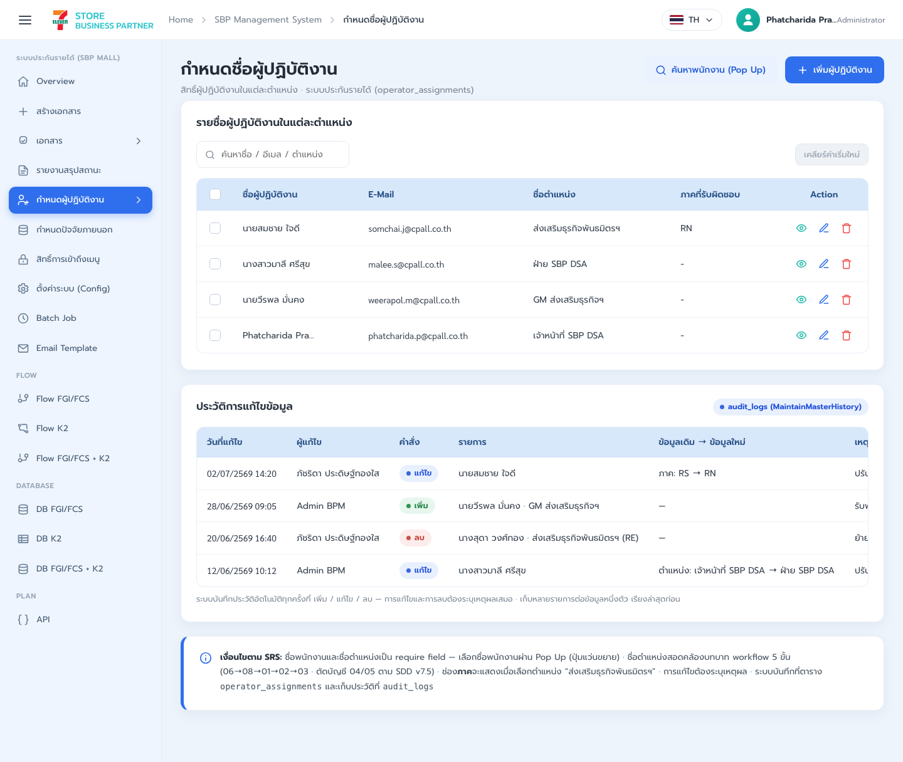
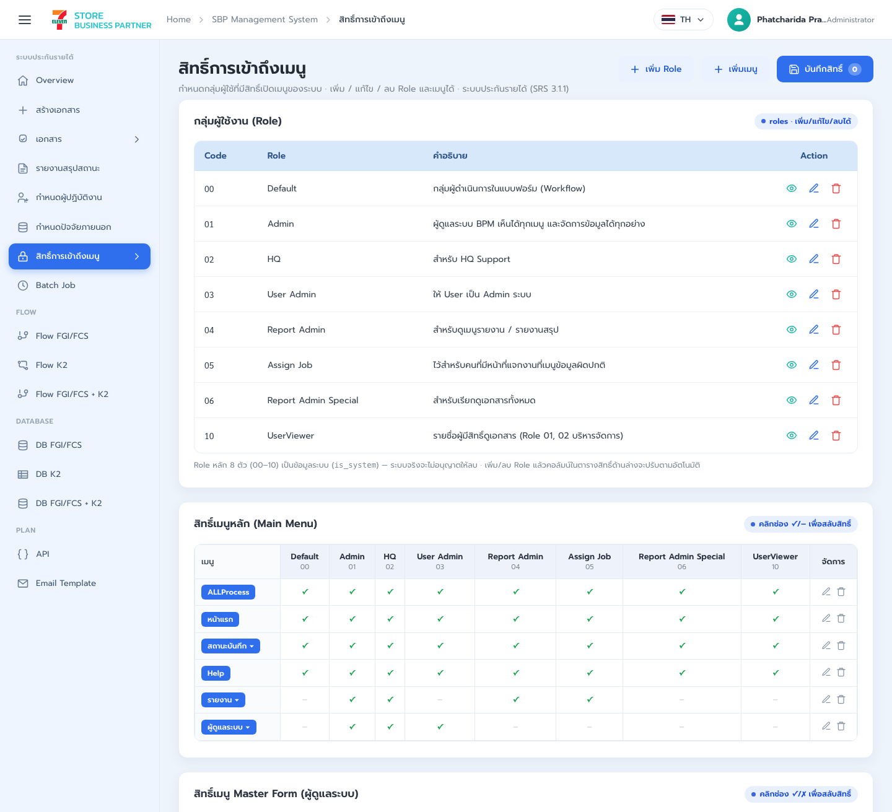
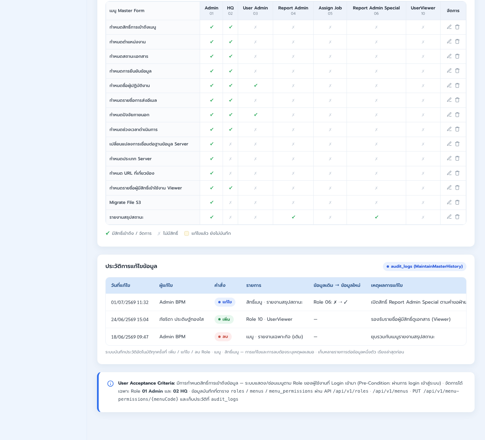

# LLDD FE - Master Data

SBP Mall - ระบบประกันรายได้ | Low Level Design Document

## 1. Overview

| รายการ | รายละเอียด |
| --- | --- |
| Track | FE |
| Estimate | 18 ชั่วโมง |
| Owner | Chidchanok <lin> Saengamnat |
| Objective | สร้างหน้าจอ master ที่ SBPGI ดูแลเอง: ปัจจัยภายนอก (SCR-09) และรายชื่อร้านคู่แข่ง (master แบรนด์ 01-11) |

Common contract reference: ทุกหัวข้อ API/FE ต้องยึด LLDD-BE-API-Common-Contracts และ LLDD-FE-Integration-Contracts สำหรับ error/auth/format/pagination/action/RBAC ก่อนลงรายละเอียดเฉพาะหน้าหรือเฉพาะ endpoint

## 2. Screen / Functional Scope

- Operator master
- External factor master
- Menu permission
- CRUD modal
- Audit/reason

## 3. Screenshot Reference



_รูปที่ 1: Screenshot: k2-operators-01.png_


_รูปที่ 2: Screenshot: k2-factors-01.png_



_รูปที่ 3: Screenshot: k2-permissions-01.png_



_รูปที่ 4: Screenshot: k2-permissions-02.png_

## 4. Implementation Flow Diagram (Reference)


_รูปที่ 5: Implementation flow reference: LLDD FE - Master Data_

## 5. Field, Format, and Validation

| Field / UI | Format | Validation | Behavior |
| --- | --- | --- | --- |
| employeeName | string | required | เลือกจาก popup/search |
| position | dropdown | required | เลือกตำแหน่ง |
| factorCode | string | required unique | ห้ามซ้ำ |
| reason | text | required on edit/delete | บันทึก audit |
| configValue | string/number/boolean | validate by type | ห้ามแก้ is_editable=false |

### 5.1 Screen Boundary and Route Matrix

หัวข้อนี้ประกอบด้วย 4 หน้าจออิสระ แต่ละหน้ามี route, state, validation และ endpoint ของตนเอง ห้าม implement เป็น form/table เดียวที่สลับชนิดข้อมูลด้วยเงื่อนไขใน component เดียว

| Screen | Route / Component | Primary model | Main operations |
| --- | --- | --- | --- |
| SCR-08 ผู้ปฏิบัติงาน | /admin/operators / OperatorAssignmentPage | OperatorAssignment | search employee, list, add, edit, deactivate, audit reason |
| SCR-09 ปัจจัยภายนอก | /admin/external-factors / ExternalFactorPage | ExternalFactor | list, add, edit, delete, duplicate-code guard |
| SCR-10 สิทธิ์เมนู | /admin/menu-permissions / MenuPermissionPage | MenuPermissionMatrix | load roles/menus, toggle canView, save per menu, refresh guard |

### 5.2 SCR-08 Operator Assignment

| Field | Type | Required / Rule | UI behavior |
| --- | --- | --- | --- |
| id | integer | response only | row key |
| employeeId | string | required; selected from employee search | store employee id, not display name |
| employeeName | string | read-only | filled from selected employee |
| positionCode | enum 06\|08\|01\|02\|03 | required | workflow position selector |
| zoneCode | string \| null | optional by position | preserve leading zero if numeric-looking |
| active | boolean | required | deactivation requires reason |
| reason | string | required for create/update/deactivate | audit dialog before submit |

### 5.3 SCR-09 External Factor

| Field | Type | Required / Rule | UI behavior |
| --- | --- | --- | --- |
| factorCode | string | required; unique; immutable after create | uppercase and trim before submit |
| factorName | string | required; 1..200 chars | Thai UTF-8 supported |
| description | string \| null | optional; max 1000 chars | multiline editor |
| active | boolean | required | inactive rows remain visible under filter |
| reason | string | required for mutation | include in request and audit |

### 5.4 SCR-10 Menu Permission Matrix

| Field | Type | Required / Rule | UI behavior |
| --- | --- | --- | --- |
| menuCode | string | required; row key | one menu per row |
| menuName | string | response only | Thai display label |
| permissions[].roleCode | string | required | one column per role |
| permissions[].canView | boolean | required | toggle; dirty state tracked per menu |
| reason | string | required on save | save one menu row atomically |

### 5.6 Screen-level Acceptance

- แต่ละ SCR มี route/component/state แยกและสามารถ test/release แยกกันได้
- mutation ทุกหน้าส่ง reason และ refresh เฉพาะ resource ที่เปลี่ยน
- SCR-08 ไม่รับ employeeName ที่พิมพ์เองแทน employeeId จากผลค้นหา
- SCR-09 กัน factorCode ซ้ำทั้ง client response handling และ BE error
- SCR-10 rollback toggle เมื่อ save ล้มเหลวและคง dirty indication

## 5.1 Input / Progress / Output Contract

| Stage | Contract for implementation |
| --- | --- |
| Input | GET /api/v1/operators; POST /api/v1/operators; PUT /api/v1/operators/{id} |
| Progress | Open master page; Load table; Open modal; Validate required/reason |
| Output | Rendered UI state or normalized API response with status/message and audit-ready trace reference. |

### 5.90 Master Data Component Contract

| ID | Component / Scope | Single responsibility | Definition of done |
| --- | --- | --- | --- |
| C01 | Operator master | โหลด/ค้นหา/เพิ่ม/แก้/ปิด operator โดยเลือก employee จาก employee search | duplicate/invalid employee ถูก block และ mutation สำเร็จ refresh row/audit |
| C02 | External factor master | จัดการ factor CRUD รวม DELETE เฉพาะรายการที่ไม่ถูกใช้งานและต้องมี reason | factorCode ซ้ำไม่ได้, conflict แสดงข้อความ และ deleted row หายหลัง refresh |
| C03 | Menu permission | render role x menu matrix จาก canAccess และบันทึก permission ราย menu | toggle optimistic ได้เฉพาะเมื่อ rollback on error และค่าหลัง reload ตรงฐานข้อมูล |
| C04 | CRUD modal | ใช้ modal mode ADD/EDIT/DELETE แยก initial values, validation และ confirm copy | เปลี่ยน mode ไม่ทิ้ง stale field และปุ่ม submit กัน double request |
| C05 | Audit/reason | แสดง updatedBy/updatedAt หลังบันทึก (ไม่มี audit log ของ master แล้ว · ยกเลิกระบบ audit ของ master 2026-08-07) | mutation สำเร็จแล้ว row ในตารางอัปเดตจริงและ refresh เห็นค่าใหม่ |

### 5.91 Master Data API Adapter Map

| Endpoint | Typed adapter purpose | Invoked by |
| --- | --- | --- |
| GET /api/v1/operators | SCR-08 list/filter ผู้ปฏิบัติงาน | Add/Edit/Delete (modal action) |
| POST /api/v1/operators | SCR-08 เพิ่มผู้ปฏิบัติงาน | Search employee (แว่นขยาย) |
| PUT /api/v1/operators/{id} | SCR-08 แก้ไข/ปิดใช้งานผู้ปฏิบัติงาน | Save permission (toggle permission) |
| GET /api/v1/employees/search | SCR-08 popup ค้นหาพนักงาน | Search employee (แว่นขยาย) |
| GET /api/v1/factors | SCR-09 list/filter ปัจจัยภายนอก | Search employee (แว่นขยาย) |
| POST /api/v1/factors | SCR-09 เพิ่มปัจจัยภายนอก | Save permission (toggle permission) |
| PUT /api/v1/factors/{code} | SCR-09 แก้ไขปัจจัยภายนอก | Add/Edit/Delete (modal action) |
| DELETE /api/v1/factors/{code} | SCR-09 ลบปัจจัยภายนอกที่ไม่ถูกใช้งาน | Search employee (แว่นขยาย) |
| GET /api/v1/menu-permissions | อ่าน matrix สิทธิ์เมนูทุก role | Save permission (toggle permission) |
| PUT /api/v1/menu-permissions/{menuCode} | บันทึกสิทธิ์เมนูรายเมนู | Save permission (toggle permission) |

### 5.92 Master Data Interaction State Machine

| Action | Trigger | API / State transition | Expected visible result |
| --- | --- | --- | --- |
| Add/Edit/Delete | modal action | POST/PUT/DELETE master API | update table + audit |
| Search employee | แว่นขยาย | GET /api/v1/employees/search | select employee |
| Save permission | toggle permission | PUT /api/v1/menu-permissions/{menuCode} | save matrix |

### 5.93 Master Data Feature Failure Checks

| Case | Feature-specific scenario | Expected evidence |
| --- | --- | --- |
| FE-01 | add operator | แก้ master ต้องมี reason |
| FE-02 | edit factor without reason | factorCode ซ้ำไม่ได้ |
| FE-03 | duplicate factor | permission toggle save ได้ |
| FE-04 | save permission | config type validate |
| FE-05 | edit locked config | แก้ master ต้องมี reason |

## 6. Button / User Action Mapping

| Action | Trigger | API / Service | Expected Result |
| --- | --- | --- | --- |
| Add/Edit/Delete | modal action | POST/PUT/DELETE master API | update table + audit |
| Search employee | แว่นขยาย | GET /api/v1/employees/search | select employee |
| Save permission | toggle permission | PUT /api/v1/menu-permissions/{menuCode} | save matrix |

## 7. API Contract

### GET /api/v1/operators

SCR-08 list/filter ผู้ปฏิบัติงาน

#### Query Params

```json
{
  "q": "สมชาย",
  "positionCode": "06",
  "active": true,
  "page": 1,
  "size": 20
}
```

#### Request Field Schema

| Field | Type | Required | Constraint / Meaning |
| --- | --- | --- | --- |
| q | string | No | UTF-8; use value domain described by endpoint purpose |
| positionCode | string | No | UTF-8; use value domain described by endpoint purpose |
| active | boolean | No | UTF-8; use value domain described by endpoint purpose |
| page | integer | No | >= 1; default 1 |
| size | integer | No | 1..100; default 20 |

#### Response

```json
{
  "page": 1,
  "size": 20,
  "total": 1,
  "items": [
    {
      "id": 1,
      "employeeId": "E001",
      "employeeName": "สมชาย ใจดี",
      "positionCode": "06",
      "zoneCode": "01",
      "active": true,
      "updatedAt": "2026-07-22T10:00:00+07:00"
    }
  ]
}
```

#### Response Field Schema

| Field | Type | Required | Constraint / Meaning |
| --- | --- | --- | --- |
| page | integer | Yes | >= 1; default 1 |
| size | integer | Yes | 1..100; default 20 |
| total | integer | Yes | UTF-8; use value domain described by endpoint purpose |
| items | array<object> | Yes | JSON array; element type shown in Type column |
| items[].id | integer | Yes | UTF-8; use value domain described by endpoint purpose |
| items[].employeeId | string | Yes | UTF-8; use value domain described by endpoint purpose |
| items[].employeeName | string | Yes | UTF-8; use value domain described by endpoint purpose |
| items[].positionCode | string | Yes | UTF-8; use value domain described by endpoint purpose |
| items[].zoneCode | string | Yes | UTF-8; use value domain described by endpoint purpose |
| items[].active | boolean | Yes | UTF-8; use value domain described by endpoint purpose |
| items[].updatedAt | string | Yes | ISO-8601 ค.ศ.; nullable only when type includes null |

### POST /api/v1/operators

SCR-08 เพิ่มผู้ปฏิบัติงาน

#### Request

```json
{
  "employeeId": "E001",
  "positionCode": "06",
  "zoneCode": "01",
  "active": true,
  "reason": "เพิ่มผู้รับผิดชอบ"
}
```

#### Request Field Schema

| Field | Type | Required | Constraint / Meaning |
| --- | --- | --- | --- |
| employeeId | string | Yes | UTF-8; use value domain described by endpoint purpose |
| positionCode | string | Yes | UTF-8; use value domain described by endpoint purpose |
| zoneCode | string | Yes | UTF-8; use value domain described by endpoint purpose |
| active | boolean | Yes | UTF-8; use value domain described by endpoint purpose |
| reason | string | Yes | trimmed UTF-8 Thai text; required by operation/business rule |

#### Response

```json
{
  "id": 1,
  "message": "saved",
  "auditId": 901
}
```

#### Response Field Schema

| Field | Type | Required | Constraint / Meaning |
| --- | --- | --- | --- |
| id | integer | Yes | UTF-8; use value domain described by endpoint purpose |
| message | string | Yes | UTF-8; use value domain described by endpoint purpose |
| auditId | integer | Yes | UTF-8; use value domain described by endpoint purpose |

### PUT /api/v1/operators/{id}

SCR-08 แก้ไข/ปิดใช้งานผู้ปฏิบัติงาน

#### Request

```json
{
  "positionCode": "08",
  "zoneCode": "01",
  "active": true,
  "reason": "ย้ายหน้าที่"
}
```

#### Request Field Schema

| Field | Type | Required | Constraint / Meaning |
| --- | --- | --- | --- |
| positionCode | string | Yes | UTF-8; use value domain described by endpoint purpose |
| zoneCode | string | Yes | UTF-8; use value domain described by endpoint purpose |
| active | boolean | Yes | UTF-8; use value domain described by endpoint purpose |
| reason | string | Yes | trimmed UTF-8 Thai text; required by operation/business rule |

#### Response

```json
{
  "id": 1,
  "message": "saved",
  "auditId": 902
}
```

#### Response Field Schema

| Field | Type | Required | Constraint / Meaning |
| --- | --- | --- | --- |
| id | integer | Yes | UTF-8; use value domain described by endpoint purpose |
| message | string | Yes | UTF-8; use value domain described by endpoint purpose |
| auditId | integer | Yes | UTF-8; use value domain described by endpoint purpose |

### GET /api/v1/employees/search

SCR-08 popup ค้นหาพนักงาน

#### Query Params

```json
{
  "q": "E001",
  "page": 1,
  "size": 20
}
```

#### Request Field Schema

| Field | Type | Required | Constraint / Meaning |
| --- | --- | --- | --- |
| q | string | No | UTF-8; use value domain described by endpoint purpose |
| page | integer | No | >= 1; default 1 |
| size | integer | No | 1..100; default 20 |

#### Response

```json
{
  "page": 1,
  "size": 20,
  "total": 1,
  "items": [
    {
      "employeeId": "E001",
      "employeeName": "สมชาย ใจดี",
      "email": "somchai@example.test",
      "active": true
    }
  ]
}
```

#### Response Field Schema

| Field | Type | Required | Constraint / Meaning |
| --- | --- | --- | --- |
| page | integer | Yes | >= 1; default 1 |
| size | integer | Yes | 1..100; default 20 |
| total | integer | Yes | UTF-8; use value domain described by endpoint purpose |
| items | array<object> | Yes | JSON array; element type shown in Type column |
| items[].employeeId | string | Yes | UTF-8; use value domain described by endpoint purpose |
| items[].employeeName | string | Yes | UTF-8; use value domain described by endpoint purpose |
| items[].email | string | Yes | UTF-8; use value domain described by endpoint purpose |
| items[].active | boolean | Yes | UTF-8; use value domain described by endpoint purpose |

### GET /api/v1/factors

SCR-09 list/filter ปัจจัยภายนอก

#### Query Params

```json
{
  "q": "ถนน",
  "active": true,
  "page": 1,
  "size": 20
}
```

#### Request Field Schema

| Field | Type | Required | Constraint / Meaning |
| --- | --- | --- | --- |
| q | string | No | UTF-8; use value domain described by endpoint purpose |
| active | boolean | No | UTF-8; use value domain described by endpoint purpose |
| page | integer | No | >= 1; default 1 |
| size | integer | No | 1..100; default 20 |

#### Response

```json
{
  "page": 1,
  "size": 20,
  "total": 1,
  "items": [
    {
      "factorCode": "F001",
      "factorName": "ก่อสร้างถนน",
      "description": "ผลกระทบจากการก่อสร้าง",
      "active": true,
      "updatedAt": "2026-07-22T10:00:00+07:00"
    }
  ]
}
```

#### Response Field Schema

| Field | Type | Required | Constraint / Meaning |
| --- | --- | --- | --- |
| page | integer | Yes | >= 1; default 1 |
| size | integer | Yes | 1..100; default 20 |
| total | integer | Yes | UTF-8; use value domain described by endpoint purpose |
| items | array<object> | Yes | JSON array; element type shown in Type column |
| items[].factorCode | string | Yes | UTF-8; use value domain described by endpoint purpose |
| items[].factorName | string | Yes | UTF-8; use value domain described by endpoint purpose |
| items[].description | string | Yes | UTF-8; use value domain described by endpoint purpose |
| items[].active | boolean | Yes | UTF-8; use value domain described by endpoint purpose |
| items[].updatedAt | string | Yes | ISO-8601 ค.ศ.; nullable only when type includes null |

### POST /api/v1/factors

SCR-09 เพิ่มปัจจัยภายนอก

#### Request

```json
{
  "factorCode": "F001",
  "factorName": "ก่อสร้างถนน",
  "description": "ผลกระทบจากการก่อสร้าง",
  "active": true,
  "reason": "เพิ่ม master"
}
```

#### Request Field Schema

| Field | Type | Required | Constraint / Meaning |
| --- | --- | --- | --- |
| factorCode | string | Yes | UTF-8; use value domain described by endpoint purpose |
| factorName | string | Yes | UTF-8; use value domain described by endpoint purpose |
| description | string | Yes | UTF-8; use value domain described by endpoint purpose |
| active | boolean | Yes | UTF-8; use value domain described by endpoint purpose |
| reason | string | Yes | trimmed UTF-8 Thai text; required by operation/business rule |

#### Response

```json
{
  "factorCode": "F001",
  "message": "saved",
  "auditId": 903
}
```

#### Response Field Schema

| Field | Type | Required | Constraint / Meaning |
| --- | --- | --- | --- |
| factorCode | string | Yes | UTF-8; use value domain described by endpoint purpose |
| message | string | Yes | UTF-8; use value domain described by endpoint purpose |
| auditId | integer | Yes | UTF-8; use value domain described by endpoint purpose |

### PUT /api/v1/factors/{code}

SCR-09 แก้ไขปัจจัยภายนอก

#### Request

```json
{
  "factorName": "ก่อสร้างถนนระยะยาว",
  "description": "กระทบการเข้าร้าน",
  "active": true,
  "reason": "ปรับคำอธิบาย"
}
```

#### Request Field Schema

| Field | Type | Required | Constraint / Meaning |
| --- | --- | --- | --- |
| factorName | string | Yes | UTF-8; use value domain described by endpoint purpose |
| description | string | Yes | UTF-8; use value domain described by endpoint purpose |
| active | boolean | Yes | UTF-8; use value domain described by endpoint purpose |
| reason | string | Yes | trimmed UTF-8 Thai text; required by operation/business rule |

#### Response

```json
{
  "factorCode": "F001",
  "message": "saved",
  "auditId": 904
}
```

#### Response Field Schema

| Field | Type | Required | Constraint / Meaning |
| --- | --- | --- | --- |
| factorCode | string | Yes | UTF-8; use value domain described by endpoint purpose |
| message | string | Yes | UTF-8; use value domain described by endpoint purpose |
| auditId | integer | Yes | UTF-8; use value domain described by endpoint purpose |

### DELETE /api/v1/factors/{code}

SCR-09 ลบปัจจัยภายนอกที่ไม่ถูกใช้งาน

#### Request

```json
{
  "reason": "ยกเลิกค่า master"
}
```

#### Request Field Schema

| Field | Type | Required | Constraint / Meaning |
| --- | --- | --- | --- |
| reason | string | Yes | trimmed UTF-8 Thai text; required by operation/business rule |

#### Response

```json
{
  "factorCode": "F001",
  "deleted": true,
  "auditId": 907
}
```

#### Response Field Schema

| Field | Type | Required | Constraint / Meaning |
| --- | --- | --- | --- |
| factorCode | string | Yes | UTF-8; use value domain described by endpoint purpose |
| deleted | boolean | Yes | UTF-8; use value domain described by endpoint purpose |
| auditId | integer | Yes | UTF-8; use value domain described by endpoint purpose |

### GET /api/v1/menu-permissions

อ่าน matrix สิทธิ์เมนูทุก role

#### Query Params

```json
{
  "roleCode": "04"
}
```

#### Request Field Schema

| Field | Type | Required | Constraint / Meaning |
| --- | --- | --- | --- |
| roleCode | string | No | canonical code; do not replace with display label |

#### Response

```json
{
  "items": [
    {
      "menuCode": "k2-report",
      "roleCode": "04",
      "canView": true
    }
  ]
}
```

#### Response Field Schema

| Field | Type | Required | Constraint / Meaning |
| --- | --- | --- | --- |
| items | array<object> | Yes | JSON array; element type shown in Type column |
| items[].menuCode | string | Yes | UTF-8; use value domain described by endpoint purpose |
| items[].roleCode | string | Yes | canonical code; do not replace with display label |
| items[].canView | boolean | Yes | UTF-8; use value domain described by endpoint purpose |

### PUT /api/v1/menu-permissions/{menuCode}

บันทึกสิทธิ์เมนูรายเมนู

#### Request

```json
{
  "roleCode": "04",
  "canView": true,
  "reason": "ปรับสิทธิ์รายงาน"
}
```

#### Request Field Schema

| Field | Type | Required | Constraint / Meaning |
| --- | --- | --- | --- |
| roleCode | string | Yes | canonical code; do not replace with display label |
| canView | boolean | Yes | UTF-8; use value domain described by endpoint purpose |
| reason | string | Yes | trimmed UTF-8 Thai text; required by operation/business rule |

#### Response

```json
{
  "message": "saved"
}
```

#### Response Field Schema

| Field | Type | Required | Constraint / Meaning |
| --- | --- | --- | --- |
| message | string | Yes | UTF-8; use value domain described by endpoint purpose |

## 8. Skeleton Code (โครงโค้ดตั้งต้นของหน้าจอนี้)

โค้ดชุดนี้อิง convention ของ portal เดิม `srm-sps-spsap-web-frontend` (build target `sbpm`): Next.js App Router + `'use client'`, PrimeReact ที่ห่อไว้แล้วใน `@/components/Form` และ `@/components/Table`, react-hook-form + yup, Zustand `permissionStore`, axios instance กลาง `@/lib/apiClient` และ react-query 5 — **โปรเจกต์ไม่มี chart library** จึงไม่มีโค้ดกราฟในเอกสารนี้ คัดลอกไปตั้งต้นได้ทันที แล้วเติมจุดที่กำกับ `TODO:`

เส้นที่อยู่ในตาราง API ของเอกสารนี้แต่ **ถูกตัดออกจากดีไซน์แล้ว** (มติ 2026-08-05/06 — RBAC/ผู้ปฏิบัติงานใช้ auth-backend ของระบบ SBP เดิม) จึงไม่มี skeleton ให้:

| Endpoint | จุดประสงค์เดิม | ใช้ของระบบเดิมแทน |
| --- | --- | --- |
| GET /api/v1/operators | SCR-08 list/filter ผู้ปฏิบัติงาน | ใช้ group + scope ของ auth-backend (หน้า `/setting/manage-user-rights`) |
| POST /api/v1/operators | SCR-08 เพิ่มผู้ปฏิบัติงาน | ใช้ group + scope ของ auth-backend (หน้า `/setting/manage-user-rights`) |
| PUT /api/v1/operators/{id} | SCR-08 แก้ไข/ปิดใช้งานผู้ปฏิบัติงาน | ใช้ group + scope ของ auth-backend (หน้า `/setting/manage-user-rights`) |
| GET /api/v1/employees/search | SCR-08 popup ค้นหาพนักงาน | ใช้ employee backend เดิมของระบบ SBP |
| GET /api/v1/menu-permissions | อ่าน matrix สิทธิ์เมนูทุก role | ใช้ auth-backend `/groups/{id}/permissions` |
| PUT /api/v1/menu-permissions/{menuCode} | บันทึกสิทธิ์เมนูรายเมนู | ใช้ auth-backend `/groups/{id}/permissions` |

#### 8.1 ผังไฟล์ที่ต้องสร้าง

โครงไฟล์อิง portal เดิม (`srm-sps-spsap-web-frontend`, target `sbpm`) — โมดูล SBPGI อยู่ใต้ `src/app/(main)/sbpgi/*` และ import ผ่าน alias `@/*` ทุกจุด

| Path ไฟล์ | หน้าที่ |
| --- | --- |
| src/app/(main)/sbpgi/master/factors/page.tsx | route page — ปัจจัยภายนอก (SCR-09) |
| src/app/(main)/sbpgi/master/competitors/page.tsx | route page — รายชื่อร้านคู่แข่ง (master แบรนด์ 01-11) |
| src/components/sbpgi/master-data/MasterDataForm.tsx | component — ฟอร์ม/ฟิลเตอร์ (react-hook-form + yup + FormInputControl) |
| src/services/sbpgi/master.service.ts | service — เรียก BFF ผ่าน apiClient (DELETE, GET, POST, PUT) |
| src/hooks/sbpgi/master.query.ts | hook — query key factory + useQuery/useMutation + invalidate |
| src/types/sbpgi/master.ts | types — request/response ตาม API contract ของเอกสารนี้ |

#### 8.2 page.tsx — หน้า master (ตาราง + modal CRUD + reason/audit)

```tsx
'use client';
// ปัจจัยภายนอก (SCR-09)
// route: /sbpgi/master/factors  ·  ต้องมี record ใน GET /menus และสิทธิ์ใน GET /groups/current-user/permissions

import { useState } from 'react';
// Table/Column import จาก barrel `@/components/Table` เท่านั้น (table.tsx เป็น named export
// และ re-export `Column = PrimeColumn` ไว้แล้ว — ห้าม import จาก 'primereact/column')
import { Column, Table, TableActionButton } from '@/components/Table';
import AccessDenied from '@/components/Permission/AccessDenied';
// permissionStore เป็น named export ของ Zustand store (ไม่มี symbol ชื่อ usePermissionStore ในโปรเจกต์)
import { permissionStore } from '@/stores/permissionStore';
// ConfirmDialog เป็น named export (index.ts = `export * from './confirm-dialog'`) และ prop ยืนยัน
// ของ PrimeReact คือ accept/reject — ไม่มี onConfirm; helper confirmDialog() คือรูปแบบที่ทีมใช้จริง
import { ConfirmDialog, confirmDialog } from '@/components/ConfirmDialog';
import { useFactorsQuery, useCreateFactorsMutation } from '@/hooks/sbpgi/master.query';
import type { FactorsItem } from '@/types/sbpgi/master';

const PAGE_URL = '/sbpgi/master/factors';

export default function MasterFactorsPage() {
  const { hasPermission, isPermissionLoaded } = permissionStore();
  const [query, setQuery] = useState({ page: 1, size: 20 });
  const [editing, setEditing] = useState<Partial<FactorsItem> | null>(null);
  const { data, isLoading } = useFactorsQuery(query);
  const save = useCreateFactorsMutation();

  const canManage = hasPermission(PAGE_URL, 'canManage');
  // รอ permission โหลดเสร็จก่อน ไม่งั้นจะเห็น AccessDenied แว่บหนึ่งทุกครั้งที่เข้าหน้า
  if (!isPermissionLoaded) return null;
  if (!hasPermission(PAGE_URL, 'canView')) return <AccessDenied />;

  // ทุก mutation ของ master ต้องแนบ `reason` เพื่อเขียน audit ในทรานแซกชันเดียวกัน
  const confirmSave = (values: Partial<FactorsItem> & { reason: string }) =>
    confirmDialog({
      severity: 'question',
      header: 'ยืนยันการบันทึก',
      message: 'ต้องการบันทึกการเปลี่ยนแปลงข้อมูล master นี้หรือไม่',
      accept: () => save.mutate(values as never),
    });

  return (
    <div className="flex flex-col gap-4 p-4">
      {/* ต้องมี <ConfirmDialog /> อยู่ใน tree หนึ่งตัวเพื่อให้ confirmDialog() มีที่ render */}
      <ConfirmDialog />
      <div className="flex justify-end">
        {canManage && (
          <button type="button" className="btn btn-primary" onClick={() => setEditing({})}>
            เพิ่มข้อมูล
          </button>
        )}
      </div>
      <Table value={data?.items ?? []} loading={isLoading} paginator rows={query.size} emptyMessage="ไม่พบข้อมูล">
        <Column field="factorCode" header="factorCode" sortable />
        <Column field="factorName" header="factorName" sortable />
        <Column field="description" header="description" sortable />
        <Column field="active" header="active" sortable />
        <Column field="updatedAt" header="updatedAt" sortable />
        <Column
          header="จัดการ"
          body={(row: FactorsItem) =>
            canManage && (
              // TODO: ใส่ icon component ของทีม (เช่น Edit จาก @/components/Icons)
              <TableActionButton icon={EditIcon} severity="primary" tooltipMessage="แก้ไข" onClick={() => setEditing(row)} />
            )
          }
        />
      </Table>
      {/* TODO: modal ฟอร์มแก้ไข (ดูหัวข้อฟอร์ม) แล้วเรียก confirmSave({ ...values, reason }) ตอนกดบันทึก */}
      {editing && null}
    </div>
  );
}
```

#### 8.3 service — `src/services/sbpgi/master.service.ts`

```ts
// src/services/sbpgi/master.service.ts
// apiClient = axios instance กลาง (baseURL = bffUrl ซึ่งรวม /api/v1 แล้ว, withCredentials, refresh-token interceptor, global loading)
// ห้ามสร้าง axios instance ใหม่ และห้าม set Authorization header เอง — session อยู่ใน httpOnly cookie ของ BFF

import apiClient from '@/lib/apiClient';
import type { ApiResponse, PageResponse } from '@/types/sbpgi/common';
import type * as T from '@/types/sbpgi/master';

/** GET /api/v1/factors — SCR-09 list/filter ปัจจัยภายนอก */
export async function getFactors(params: T.FactorsParams): Promise<PageResponse<T.FactorsItem>> {
  const { data } = await apiClient.get<ApiResponse<PageResponse<T.FactorsItem>>>('/factors', { params });
  return data.data;
}

/** POST /api/v1/factors — SCR-09 เพิ่มปัจจัยภายนอก */
export async function createFactors(body: T.CreateFactorsRequest): Promise<T.CreateFactorsResponse> {
  const { data } = await apiClient.post<ApiResponse<T.CreateFactorsResponse>>('/factors', body);
  return data.data;
}

/** PUT /api/v1/factors/{code} — SCR-09 แก้ไขปัจจัยภายนอก */
export async function updateFactors(code: string, body: T.UpdateFactorsRequest): Promise<T.UpdateFactorsResponse> {
  const { data } = await apiClient.put<ApiResponse<T.UpdateFactorsResponse>>(`/factors/${encodeURIComponent(code)}`, body);
  return data.data;
}

/** DELETE /api/v1/factors/{code} — SCR-09 ลบปัจจัยภายนอกที่ไม่ถูกใช้งาน */
export async function removeFactors(code: string, body: T.RemoveFactorsRequest): Promise<T.RemoveFactorsResponse> {
  const { data } = await apiClient.delete<ApiResponse<T.RemoveFactorsResponse>>(`/factors/${encodeURIComponent(code)}`, { data: body });
  return data.data;
}

// NOTE: เส้น GET /api/v1/operators, POST /api/v1/operators, PUT /api/v1/operators/{id}, GET /api/v1/employees/search, GET /api/v1/menu-permissions, PUT /api/v1/menu-permissions/{menuCode} ถูกตัดจากดีไซน์แล้ว (ใช้ระบบ SBP เดิม) — ห้ามสร้าง service ให้
// TODO: ยืนยันกับทีม BFF ว่า unwrap envelope { success, data } ที่ชั้นไหน (BFF หรือ FE)
```

#### 8.4 types — `src/types/sbpgi/master.ts`

```ts
// src/types/sbpgi/master.ts — ตรงกับตาราง API ในเอกสารนี้
// วันที่/เดือนใน payload เป็น ค.ศ. (ISO) เสมอ — แปลงเป็น พ.ศ. เฉพาะตอน display

import type { PageResponse } from '@/types/sbpgi/common';

/** GET /api/v1/factors — request */
export interface FactorsParams {
  q?: string;
  active?: boolean;
  page?: number;
  size?: number;
}

/** GET /api/v1/factors — 1 แถวในตาราง */
export interface FactorsItem {
  factorCode: string;
  factorName: string;
  description: string;
  active: boolean;
  updatedAt: string;
}
export type FactorsListResponse = PageResponse<FactorsItem>;

/** POST /api/v1/factors — request */
export interface CreateFactorsRequest {
  factorCode: string;
  factorName: string;
  description: string;
  active: boolean;
  reason: string;
}

/** POST /api/v1/factors — response */
export interface CreateFactorsResponse {
  factorCode: string;
  message: string;
  auditId: number;
}

/** PUT /api/v1/factors/{code} — request */
export interface UpdateFactorsRequest {
  factorName: string;
  description: string;
  active: boolean;
  reason: string;
}

/** PUT /api/v1/factors/{code} — response */
export interface UpdateFactorsResponse {
  factorCode: string;
  message: string;
  auditId: number;
}

// endpoint ที่เหลือของเอกสารนี้ — TODO: แทน placeholder ด้วย interface เต็มรูปแบบเดียวกับข้างบน
export type RemoveFactorsRequest = Record<string, unknown>;
export type RemoveFactorsResponse = Record<string, unknown>;
// TODO: ใส่ nullable / required ให้ตรงกับ contract ฉบับล่าสุดของ BE
```

#### 8.5 react-query keys + hooks — `src/hooks/sbpgi/master.query.ts`

```ts
// src/hooks/sbpgi/master.query.ts
import { useMutation, useQuery, useQueryClient } from '@tanstack/react-query';
import * as api from '@/services/sbpgi/master.service';
import type * as T from '@/types/sbpgi/master';

export const masterKeys = {
  all: ['sbpgi', 'master'] as const,
  factors: (params?: T.FactorsParams | null) => [...masterKeys.all, 'factors', params] as const,
};

export function useFactorsQuery(params?: T.FactorsParams | null) {
  return useQuery({
    queryKey: masterKeys.factors(params),
    queryFn: () => api.getFactors(params!),
    enabled: !!params, // ยังไม่ยิงจนกว่าจะมีพารามิเตอร์ครบ
    staleTime: 30_000, // TODO: ปรับตามความถี่ของข้อมูลหน้านี้
  });
}

export function useCreateFactorsMutation() {
  const qc = useQueryClient();
  return useMutation({
    mutationFn: (body: T.CreateFactorsRequest) => api.createFactors(body),
    onSuccess: () => {
      qc.invalidateQueries({ queryKey: masterKeys.all }); // reload list/detail/timeline
    },
    // TODO: onError -> แสดง apiErrorMessage(error) ผ่าน Toast กลาง
  });
}

export function useUpdateFactorsMutation(code: string) {
  const qc = useQueryClient();
  return useMutation({
    mutationFn: (body: T.UpdateFactorsRequest) => api.updateFactors(code, body),
    onSuccess: () => {
      qc.invalidateQueries({ queryKey: masterKeys.all }); // reload list/detail/timeline
    },
    // TODO: onError -> แสดง apiErrorMessage(error) ผ่าน Toast กลาง
  });
}

// TODO: ยังขาดอีก 1 เส้น เขียน hook ด้วยรูปแบบเดียวกัน: DELETE /factors/{code}
```

#### 8.6 ฟอร์ม + validation — `src/components/sbpgi/master-data/MasterDataForm.tsx`

```tsx
'use client';
// MasterDataForm — ฟอร์มของ "LLDD FE - Master Data" (ฟิลด์/validation ตามตารางฟิลด์ในเอกสารนี้)
// ผูก react-hook-form ด้วย FormInputControl (components/Form/Layout/form-input-control.tsx)
// — InputText เองไม่รับ prop name/control/label/error (extends PrimeInputTextProps เท่านั้น)

import { useForm } from 'react-hook-form';
import { yupResolver } from '@hookform/resolvers/yup';
import * as yup from 'yup';
import { FormInputControl, InputText } from '@/components/Form';

export interface MasterDataFormValue {
  employeeName: string;
  position: string;
  factorCode: string;
  reason: string;
  configValue: number;
}

// TODO: แทนข้อความ validation ด้วยข้อความ verbatim จาก SRS ก่อน UAT
const schema = yup.object({
  employeeName: yup.string().required('กรุณาระบุ employeeName'), // เลือกจาก popup/search
  position: yup.string().required('กรุณาระบุ position'), // เลือกตำแหน่ง
  factorCode: yup.string().required('กรุณาระบุ factorCode'), // ห้ามซ้ำ
  reason: yup.string().required('กรุณาระบุ reason'), // บันทึก audit
  configValue: yup.number().typeError('กรุณาระบุเป็นตัวเลข'), // ห้ามแก้ is_editable=false
});

export default function MasterDataForm({ defaultValues, onSubmit }: {
  defaultValues?: Partial<MasterDataFormValue>;
  onSubmit: (values: MasterDataFormValue) => void;
}) {
  const { control, handleSubmit, reset } = useForm<MasterDataFormValue>({
    resolver: yupResolver(schema) as never,
    defaultValues: defaultValues as MasterDataFormValue,
    mode: 'onSubmit',
  });

  return (
    <form onSubmit={handleSubmit(onSubmit)} className="grid grid-cols-1 gap-3 md:grid-cols-3">
      <FormInputControl name="employeeName" control={control} input={InputText} label="employeeName" />
      <FormInputControl name="position" control={control} input={InputText} label="position" />
      <FormInputControl name="factorCode" control={control} input={InputText} label="factorCode" />
      <FormInputControl name="reason" control={control} input={InputText} label="reason" />
      {/* TODO: ฟิลด์ที่เหลือ (configValue) ใช้ Dropdown / DatePicker / MultiSelect จาก @/components/Form ผ่าน FormInputControl แบบเดียวกัน */}
      <div className="col-span-full flex justify-end gap-2">
        <button type="submit" className="btn btn-primary">
          ค้นหาข้อมูล
        </button>
        <button type="button" className="btn btn-secondary" onClick={() => reset()}>
          เคลียร์ค่าเริ่มใหม่
        </button>
      </div>
    </form>
  );
}
```

- ทุกหน้าเช็คสิทธิ์ด้วย `permissionStore.hasPermission(url, 'canView'|'canManage'|'canExport'|'canOther')` แล้ว render `<AccessDenied />` เมื่อไม่มีสิทธิ์
- เมนู/สิทธิ์มาจาก `GET /menus` และ `GET /groups/current-user/permissions` — ห้าม hardcode role หรือรายการเมนูใน FE
- session อยู่ใน httpOnly cookie ของ BFF (`withCredentials: true`) — FE ไม่เก็บและไม่แนบ token เอง
- payload ใช้วันที่ ค.ศ. เสมอ; แปลงเป็น พ.ศ. เฉพาะตอนแสดงผลผ่าน formatter กลางจุดเดียว
- ข้อความ error แสดงจาก `error.message` ของ BE ตรง ๆ (ห้าม paraphrase) — fallback ใช้เฉพาะกรณี network error

## 9. Processing Flow

| Step | Description |
| --- | --- |
| 1 | Open master page |
| 2 | Load table |
| 3 | Open modal |
| 4 | Validate required/reason |
| 5 | Call API |
| 6 | Reload table/audit |

## 10. Acceptance Criteria

- แก้ master ต้องมี reason
- factorCode ซ้ำไม่ได้
- permission toggle save ได้
- config type validate

## 11. Developer Test Checklist

| No | Test |
| --- | --- |
| 1 | add operator |
| 2 | edit factor without reason |
| 3 | duplicate factor |
| 4 | save permission |
| 5 | edit locked config |
