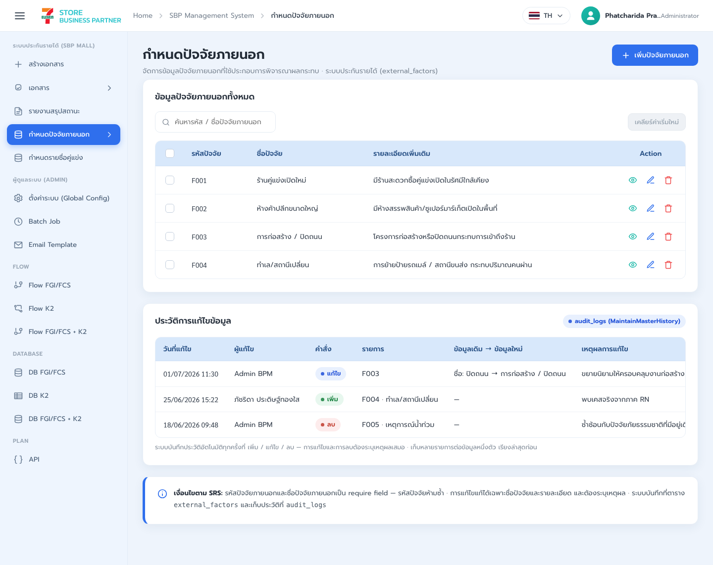
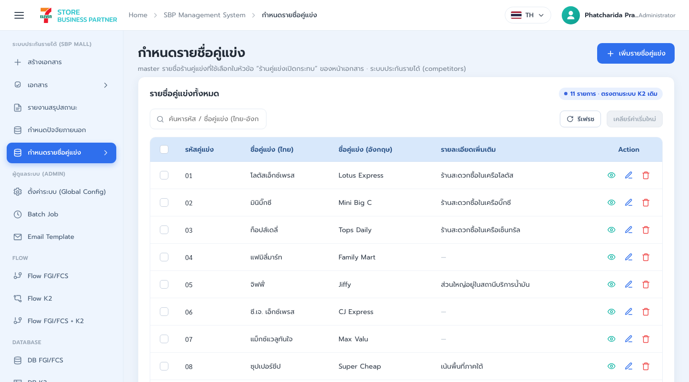
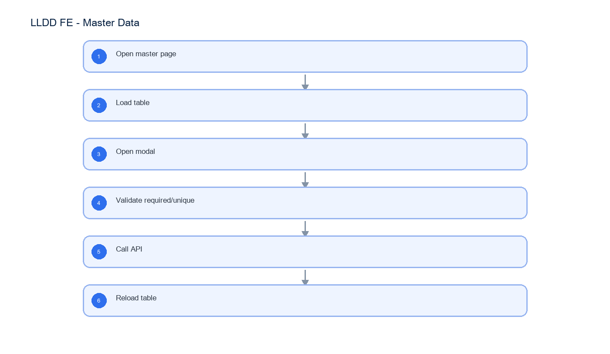

# LLDD FE - Master Data

SBP Mall - ระบบประกันรายได้ | Low Level Design Document

## 1. Overview

| รายการ | รายละเอียด |
| --- | --- |
| Track | FE |
| Estimate | **20 ชั่วโมง** = implementation 16 + unit test 4 (25%) |
| Owner | Kittisak <New> Kaeowika |
| Target repository | `SBP/srm-sps-spsap-web-frontend` (sbp-portal · Next.js · `NEXT_PUBLIC_APP_TARGET=sbpm`) — เรียก API ผ่าน `SBP/srm-sps-spsap-sbp-bff` เท่านั้น ห้ามยิง store-backend ตรง |
| Objective | สร้างหน้าจอ master ที่ SBPGI ดูแลเอง 2 หน้า: ปัจจัยภายนอก (SCR-09 · k2-factors.html) และรายชื่อแบรนด์ร้านคู่แข่ง (k2-competitors.html · รหัส 01-11 ไทย+อังกฤษ) — หน้าผู้ปฏิบัติงาน/สิทธิ์เมนู/ตั้งค่าระบบ ไม่อยู่ในขอบเขตแล้ว (ใช้ของระบบ SBP เดิม) |

Common contract reference: ทุกหัวข้อ API/FE ต้องยึด LLDD-BE-API-Common-Contracts และ LLDD-FE-Integration-Contracts สำหรับ error/auth/format/pagination/action/RBAC ก่อนลงรายละเอียดเฉพาะหน้าหรือเฉพาะ endpoint

## 2. Screen / Functional Scope

- External factor master (SCR-09)
- Competitor brand master
- CRUD modal
- Active/inactive toggle

## 3. Screenshot Reference



_รูปที่ 1: Screenshot: k2-factors-01.png_



_รูปที่ 2: Screenshot: k2-competitors-01.png_

## 4. Implementation Flow Diagram (Reference)



_รูปที่ 3: Implementation flow reference: LLDD FE - Master Data_

## 5. Field, Format, and Validation

| Field / UI | Format | Validation | Behavior |
| --- | --- | --- | --- |
| factorCode | string | required · unique · ห้ามซ้ำ | คีย์ของปัจจัยภายนอก — แก้ไม่ได้หลังสร้าง |
| factorName | string | required | ชื่อปัจจัยภายนอกที่แสดงในหน้าเอกสาร |
| description | text | optional | คำอธิบายเพิ่มเติม |
| competitorCode | string(30) | required · unique · รหัส 01-11 | คีย์ของแบรนด์คู่แข่ง — feed dropdown ร้านคู่แข่งในหน้าเอกสาร |
| nameTh | string(200) | required | ชื่อแบรนด์ภาษาไทย |
| nameEn | string(200) | required | ชื่อแบรนด์ภาษาอังกฤษ (ระบบเดิมเก็บทั้งสองภาษา) |
| remark | string(500) | optional | คอลัมน์ รายละเอียดเพิ่มเติม ของหน้า k2-competitors.html |
| active | boolean | default true | ปิดใช้งานแทนการลบเมื่อถูกอ้างในเอกสารแล้ว |

### 5.1 Screen Boundary and Route Matrix

หัวข้อนี้ประกอบด้วย **2 หน้าจออิสระ** แต่ละหน้ามี route, state, validation และ endpoint ของตนเอง ห้าม implement เป็น form/table เดียวที่สลับชนิดข้อมูลด้วยเงื่อนไขใน component · SCR-08 ผู้ปฏิบัติงาน และ SCR-10 สิทธิ์เมนู **ถูกตัดออก 2026-08-05** (ใช้ของระบบ SBP เดิม)

| Screen | Route / Component | Primary model | Main operations |
| --- | --- | --- | --- |
| SCR-09 ปัจจัยภายนอก | /admin/external-factors / ExternalFactorPage | ExternalFactor | list, add, edit, delete, duplicate-code guard |
| รายชื่อร้านคู่แข่ง (master แบรนด์) | /admin/competitors / CompetitorPage | Competitor | list, add, edit, delete, duplicate-code guard, active toggle |
| ~~SCR-08 ผู้ปฏิบัติงาน~~ **ตัด 2026-08-05** | ไม่มีหน้าจอใน SBPGI | - | ใช้ group + scope ของ auth-backend และ prepared approver ของ @srm/glb-workflow · จัดการที่หน้า /setting/manage-user-rights ของระบบเดิม — **ไม่มี field/endpoint ให้ implement** |
| ~~SCR-10 สิทธิ์เมนู~~ **ตัด 2026-08-05** | ไม่มีหน้าจอใน SBPGI | - | สิทธิ์เมนูจัดการที่หน้า /setting/manage-user-rights ของระบบเดิม · SBPGI อ่านผ่าน header x-user-permissions จาก BFF — **ไม่มี field/endpoint ให้ implement** |

### 5.2 SCR-09 External Factor

| Field | Type | Required / Rule | UI behavior |
| --- | --- | --- | --- |
| factorCode | string | required; unique; immutable after create | uppercase and trim before submit |
| factorName | string | required; 1..200 chars | Thai UTF-8 supported |
| description | string \| null | optional; max 1000 chars | multiline editor |
| active | boolean | required | inactive rows remain visible under filter แต่ไม่ขึ้นใน dropdown ของหน้าเอกสาร |

⚠️ **ไม่มีฟิลด์ `reason`** — ยกเลิกระบบ audit ของ master ทั้งหมด 2026-08-07 · mutation ไม่ต้องส่ง `reason` และไม่มี audit dialog ก่อน submit

### 5.3 Competitor Brand Master

| Field | Type | Required / Rule | UI behavior |
| --- | --- | --- | --- |
| competitorCode | string(30) | required; unique; immutable after create | รหัส 01-11 ของ master เดิม · trim ก่อน submit |
| nameTh | string(200) | required | ชื่อแบรนด์ภาษาไทย — แสดงใน dropdown ร้านคู่แข่งของหน้าเอกสาร |
| nameEn | string(200) | required | ชื่อแบรนด์ภาษาอังกฤษ (ระบบเดิมเก็บทั้งสองภาษา) |
| remark | string(500) \| null | optional | คอลัมน์ รายละเอียดเพิ่มเติม ของหน้า k2-competitors.html |
| active | boolean | required | ปิด active แทนการลบเมื่อถูกอ้างใน document_competitors แล้ว |

**คนละระดับกับ `document_competitors`** ซึ่งเก็บคู่แข่ง *รายสาขา* ที่ import จาก ALLMAP พร้อมรหัสของตัวเอง (เช่น `4832`, `TD58_08`) — หน้านี้ดูแลเฉพาะ **แบรนด์**

### 5.6 Screen-level Acceptance

- แต่ละหน้ามี route/component/state แยกและสามารถ test/release แยกกันได้
- mutation refresh เฉพาะ resource ที่เปลี่ยน — **ไม่ส่ง reason และไม่มี audit dialog** (ยกเลิก audit ของ master 2026-08-07)
- SCR-09 กัน factorCode ซ้ำทั้ง client response handling และ BE error (409 CODE_DUPLICATE)
- หน้าคู่แข่งกัน competitorCode ซ้ำ และบังคับ nameTh + nameEn ครบทั้งคู่
- ลบรายการที่ถูกอ้างในเอกสารแล้วต้องได้ 409 และ UI ต้องเสนอให้ปิด active แทน
- (SCR-08 และ SCR-10 ตัดออก 2026-08-05 — ไม่มีเกณฑ์ตรวจรับสำหรับสองหน้านี้)

### 5.9 Input / Progress / Output Contract

| Stage | Contract for implementation |
| --- | --- |
| Input | GET /api/v1/factors; POST /api/v1/factors; PUT /api/v1/factors/{code} |
| Progress | Open master page; Load table; Open modal; Validate required/unique |
| Output | Rendered UI state or normalized API response with status/message and audit-ready trace reference. |

### 5.90 Master Data Component Contract

| ID | Component / Scope | Single responsibility | Definition of done |
| --- | --- | --- | --- |
| C01 | External factor master (SCR-09) | จัดการปัจจัยภายนอก (SCR-09) CRUD ครบ — DELETE เฉพาะรายการที่ยังไม่ถูกอ้างในเอกสาร | factorCode ซ้ำไม่ได้ (409 CODE_DUPLICATE) · ลบรายการที่ถูกอ้างแล้วต้องได้ 409 · deleted row หายหลัง refresh |
| C02 | Competitor brand master | จัดการ master แบรนด์คู่แข่ง (รหัส 01-11) พร้อม nameTh/nameEn/remark | nameTh และ nameEn บังคับทั้งคู่ · competitorCode ซ้ำไม่ได้ · แถวใหม่ขึ้นใน dropdown ร้านคู่แข่งของหน้าเอกสาร |
| C03 | CRUD modal | ใช้ modal mode ADD/EDIT/DELETE แยก initial values, validation และ confirm copy | เปลี่ยน mode ไม่ทิ้ง stale field และปุ่ม submit กัน double request |
| C04 | Active/inactive toggle | toggle active แทนการลบเมื่อรายการถูกอ้างในเอกสารแล้ว | แถวที่ปิด active ต้องไม่ขึ้นใน dropdown ของหน้าเอกสาร แต่เอกสารเก่ายังแสดงชื่อเดิมได้ |

### 5.91 Master Data API Adapter Map

| Endpoint | Typed adapter purpose | Invoked by |
| --- | --- | --- |
| GET /api/v1/factors | SCR-09 list/filter ปัจจัยภายนอก | Add/Edit (modal action) |
| POST /api/v1/factors | SCR-09 เพิ่มปัจจัยภายนอก | Delete (ปุ่มถังขยะ + confirm) |
| PUT /api/v1/factors/{code} | SCR-09 แก้ไขปัจจัยภายนอก | Toggle active (switch ในตาราง) |
| DELETE /api/v1/factors/{code} | SCR-09 ลบปัจจัยภายนอกที่ยังไม่ถูกอ้างในเอกสาร | Add/Edit (modal action) |
| GET /api/v1/competitors | list แบรนด์คู่แข่ง (master 11 รายการ) | Delete (ปุ่มถังขยะ + confirm) |
| POST /api/v1/competitors | เพิ่มแบรนด์คู่แข่ง | Toggle active (switch ในตาราง) |
| PUT /api/v1/competitors/{code} | แก้ไขแบรนด์คู่แข่ง | Add/Edit (modal action) |
| DELETE /api/v1/competitors/{code} | ลบแบรนด์คู่แข่งที่ยังไม่ถูกอ้างใน document_competitors | Delete (ปุ่มถังขยะ + confirm) |

### 5.92 Master Data Interaction State Machine

| Action | Trigger | API / State transition | Expected visible result |
| --- | --- | --- | --- |
| Add/Edit | modal action | POST/PUT ของ master ที่กำลังเปิดอยู่ | ปิด modal + reload table |
| Delete | ปุ่มถังขยะ + confirm | DELETE master API | 409 ถ้าถูกอ้างในเอกสารแล้ว → ให้ปิด active แทน |
| Toggle active | switch ในตาราง | PUT พร้อม active | แถวที่ปิดใช้งานไม่ขึ้นใน dropdown ของหน้าเอกสาร |

### 5.93 Master Data Feature Failure Checks

| Case | Feature-specific scenario | Expected evidence |
| --- | --- | --- |
| FE-01 | duplicate factorCode | factorCode และ competitorCode ห้ามซ้ำ (409 CODE_DUPLICATE) |
| FE-02 | duplicate competitorCode | nameTh และ nameEn ของคู่แข่งบังคับทั้งคู่ |
| FE-03 | competitor ไม่ใส่ nameEn ต้อง block | ลบไม่ได้ถ้าถูกอ้างใน document_external_factors / document_competitors → 409 ให้ปิด active แทน |
| FE-04 | ลบ factor ที่ถูกอ้างในเอกสารแล้ว ต้องได้ 409 | ไม่มี reason และไม่มี audit log (ยกเลิกระบบ audit ของ master 2026-08-07) |
| FE-05 | toggle active แล้ว dropdown ในหน้าเอกสารต้องไม่แสดงแถวนั้น | factorCode และ competitorCode ห้ามซ้ำ (409 CODE_DUPLICATE) |

## 6. Button / User Action Mapping

| Action | Trigger | API / Service | Expected Result |
| --- | --- | --- | --- |
| Add/Edit | modal action | POST/PUT ของ master ที่กำลังเปิดอยู่ | ปิด modal + reload table |
| Delete | ปุ่มถังขยะ + confirm | DELETE master API | 409 ถ้าถูกอ้างในเอกสารแล้ว → ให้ปิด active แทน |
| Toggle active | switch ในตาราง | PUT พร้อม active | แถวที่ปิดใช้งานไม่ขึ้นใน dropdown ของหน้าเอกสาร |

## 7. API Contract

### GET /api/v1/factors

SCR-09 list/filter ปัจจัยภายนอก

#### Query Params

```json
{
  "q": "ถนน",
  "active": true,
  "page": 1,
  "size": 20
}
```

#### Request Field Schema

| Field | Type | Required | Constraint / Meaning |
| --- | --- | --- | --- |
| q | string | No | UTF-8; use value domain described by endpoint purpose |
| active | boolean | No | UTF-8; use value domain described by endpoint purpose |
| page | integer | No | >= 1; default 1 |
| size | integer | No | 1..100; default 20 |

#### Response

```json
{
  "page": 1,
  "size": 20,
  "total": 1,
  "items": [
    {
      "factorCode": "F001",
      "factorName": "ก่อสร้างถนน",
      "description": "ผลกระทบจากการก่อสร้าง",
      "active": true
    }
  ]
}
```

#### Response Field Schema

| Field | Type | Required | Constraint / Meaning |
| --- | --- | --- | --- |
| page | integer | Yes | >= 1; default 1 |
| size | integer | Yes | 1..100; default 20 |
| total | integer | Yes | UTF-8; use value domain described by endpoint purpose |
| items | array<object> | Yes | JSON array; element type shown in Type column |
| items[].factorCode | string | Yes | UTF-8; use value domain described by endpoint purpose |
| items[].factorName | string | Yes | UTF-8; use value domain described by endpoint purpose |
| items[].description | string | Yes | UTF-8; use value domain described by endpoint purpose |
| items[].active | boolean | Yes | UTF-8; use value domain described by endpoint purpose |

### POST /api/v1/factors

SCR-09 เพิ่มปัจจัยภายนอก

#### Request

```json
{
  "factorCode": "F001",
  "factorName": "ก่อสร้างถนน",
  "description": "ผลกระทบจากการก่อสร้าง",
  "active": true
}
```

#### Request Field Schema

| Field | Type | Required | Constraint / Meaning |
| --- | --- | --- | --- |
| factorCode | string | Yes | UTF-8; use value domain described by endpoint purpose |
| factorName | string | Yes | UTF-8; use value domain described by endpoint purpose |
| description | string | Yes | UTF-8; use value domain described by endpoint purpose |
| active | boolean | Yes | UTF-8; use value domain described by endpoint purpose |

#### Response

```json
{
  "factorCode": "F001",
  "created": true
}
```

#### Response Field Schema

| Field | Type | Required | Constraint / Meaning |
| --- | --- | --- | --- |
| factorCode | string | Yes | UTF-8; use value domain described by endpoint purpose |
| created | boolean | Yes | UTF-8; use value domain described by endpoint purpose |

### PUT /api/v1/factors/{code}

SCR-09 แก้ไขปัจจัยภายนอก

#### Request

```json
{
  "factorName": "ก่อสร้างถนนระยะยาว",
  "description": "กระทบการเข้าร้าน",
  "active": true
}
```

#### Request Field Schema

| Field | Type | Required | Constraint / Meaning |
| --- | --- | --- | --- |
| factorName | string | Yes | UTF-8; use value domain described by endpoint purpose |
| description | string | Yes | UTF-8; use value domain described by endpoint purpose |
| active | boolean | Yes | UTF-8; use value domain described by endpoint purpose |

#### Response

```json
{
  "factorCode": "F001",
  "updated": true
}
```

#### Response Field Schema

| Field | Type | Required | Constraint / Meaning |
| --- | --- | --- | --- |
| factorCode | string | Yes | UTF-8; use value domain described by endpoint purpose |
| updated | boolean | Yes | UTF-8; use value domain described by endpoint purpose |

### DELETE /api/v1/factors/{code}

SCR-09 ลบปัจจัยภายนอกที่ยังไม่ถูกอ้างในเอกสาร

#### Request

```json
{}
```

#### Request Field Schema

| Field | Type | Required | Constraint / Meaning |
| --- | --- | --- | --- |
| - | none | No | No fields |

#### Response

```json
{
  "factorCode": "F001",
  "deleted": true
}
```

#### Response Field Schema

| Field | Type | Required | Constraint / Meaning |
| --- | --- | --- | --- |
| factorCode | string | Yes | UTF-8; use value domain described by endpoint purpose |
| deleted | boolean | Yes | UTF-8; use value domain described by endpoint purpose |

### GET /api/v1/competitors

list แบรนด์คู่แข่ง (master 11 รายการ)

#### Query Params

```json
{
  "active": true
}
```

#### Request Field Schema

| Field | Type | Required | Constraint / Meaning |
| --- | --- | --- | --- |
| active | boolean | No | UTF-8; use value domain described by endpoint purpose |

#### Response

```json
{
  "total": 11,
  "items": [
    {
      "competitorCode": "01",
      "nameTh": "แฟมิลี่มาร์ท",
      "nameEn": "FamilyMart",
      "remark": "",
      "active": true
    }
  ]
}
```

#### Response Field Schema

| Field | Type | Required | Constraint / Meaning |
| --- | --- | --- | --- |
| total | integer | Yes | UTF-8; use value domain described by endpoint purpose |
| items | array<object> | Yes | JSON array; element type shown in Type column |
| items[].competitorCode | string | Yes | UTF-8; use value domain described by endpoint purpose |
| items[].nameTh | string | Yes | UTF-8; use value domain described by endpoint purpose |
| items[].nameEn | string | Yes | UTF-8; use value domain described by endpoint purpose |
| items[].remark | string | Yes | UTF-8; use value domain described by endpoint purpose |
| items[].active | boolean | Yes | UTF-8; use value domain described by endpoint purpose |

### POST /api/v1/competitors

เพิ่มแบรนด์คู่แข่ง

#### Request

```json
{
  "competitorCode": "12",
  "nameTh": "ร้านตัวอย่าง",
  "nameEn": "Sample Shop",
  "remark": "",
  "active": true
}
```

#### Request Field Schema

| Field | Type | Required | Constraint / Meaning |
| --- | --- | --- | --- |
| competitorCode | string | Yes | UTF-8; use value domain described by endpoint purpose |
| nameTh | string | Yes | UTF-8; use value domain described by endpoint purpose |
| nameEn | string | Yes | UTF-8; use value domain described by endpoint purpose |
| remark | string | Yes | UTF-8; use value domain described by endpoint purpose |
| active | boolean | Yes | UTF-8; use value domain described by endpoint purpose |

#### Response

```json
{
  "competitorCode": "12",
  "created": true
}
```

#### Response Field Schema

| Field | Type | Required | Constraint / Meaning |
| --- | --- | --- | --- |
| competitorCode | string | Yes | UTF-8; use value domain described by endpoint purpose |
| created | boolean | Yes | UTF-8; use value domain described by endpoint purpose |

### PUT /api/v1/competitors/{code}

แก้ไขแบรนด์คู่แข่ง

#### Request

```json
{
  "nameTh": "แฟมิลี่มาร์ท",
  "nameEn": "FamilyMart",
  "remark": "ปรับชื่อ",
  "active": true
}
```

#### Request Field Schema

| Field | Type | Required | Constraint / Meaning |
| --- | --- | --- | --- |
| nameTh | string | Yes | UTF-8; use value domain described by endpoint purpose |
| nameEn | string | Yes | UTF-8; use value domain described by endpoint purpose |
| remark | string | Yes | UTF-8; use value domain described by endpoint purpose |
| active | boolean | Yes | UTF-8; use value domain described by endpoint purpose |

#### Response

```json
{
  "competitorCode": "01",
  "updated": true
}
```

#### Response Field Schema

| Field | Type | Required | Constraint / Meaning |
| --- | --- | --- | --- |
| competitorCode | string | Yes | UTF-8; use value domain described by endpoint purpose |
| updated | boolean | Yes | UTF-8; use value domain described by endpoint purpose |

### DELETE /api/v1/competitors/{code}

ลบแบรนด์คู่แข่งที่ยังไม่ถูกอ้างใน document_competitors

#### Request

```json
{}
```

#### Request Field Schema

| Field | Type | Required | Constraint / Meaning |
| --- | --- | --- | --- |
| - | none | No | No fields |

#### Response

```json
{
  "competitorCode": "12",
  "deleted": true
}
```

#### Response Field Schema

| Field | Type | Required | Constraint / Meaning |
| --- | --- | --- | --- |
| competitorCode | string | Yes | UTF-8; use value domain described by endpoint purpose |
| deleted | boolean | Yes | UTF-8; use value domain described by endpoint purpose |

## 8. Skeleton Code (โครงโค้ดตั้งต้นของหน้าจอนี้)

โค้ดชุดนี้อิง convention ของ portal เดิม `srm-sps-spsap-web-frontend` (build target `sbpm`): Next.js App Router + `'use client'`, PrimeReact ที่ห่อไว้แล้วใน `@/components/Form` และ `@/components/Table`, react-hook-form + yup, Zustand `permissionStore`, axios instance กลาง `@/lib/apiClient` และ react-query 5 — **โปรเจกต์ไม่มี chart library** จึงไม่มีโค้ดกราฟในเอกสารนี้ คัดลอกไปตั้งต้นได้ทันที แล้วเติมจุดที่กำกับ `TODO:`

#### 8.1 ผังไฟล์ที่ต้องสร้าง

โครงไฟล์อิง portal เดิม (`srm-sps-spsap-web-frontend`, target `sbpm`) — โมดูล SBPGI อยู่ใต้ `src/app/(main)/sbpgi/*` และ import ผ่าน alias `@/*` ทุกจุด

| Path ไฟล์ | หน้าที่ |
| --- | --- |
| src/app/(main)/sbpgi/master/factors/page.tsx | route page — ปัจจัยภายนอก (SCR-09) |
| src/app/(main)/sbpgi/master/competitors/page.tsx | route page — รายชื่อร้านคู่แข่ง (master แบรนด์ 01-11) |
| src/components/sbpgi/master-data/MasterDataForm.tsx | component — ฟอร์ม/ฟิลเตอร์ (react-hook-form + yup + FormInputControl) |
| src/services/sbpgi/master.service.ts | service — เรียก BFF ผ่าน apiClient (DELETE, GET, POST, PUT) |
| src/hooks/sbpgi/master.query.ts | hook — query key factory + useQuery/useMutation + invalidate |
| src/types/sbpgi/master.ts | types — request/response ตาม API contract ของเอกสารนี้ |

#### 8.2 page.tsx — หน้า master (ตาราง + modal CRUD + reason/audit)

```tsx
'use client';
// ปัจจัยภายนอก (SCR-09)
// route: /sbpgi/master/factors  ·  ต้องมี record ใน GET /menus และสิทธิ์ใน GET /groups/current-user/permissions

import { useState } from 'react';
// Table/Column import จาก barrel `@/components/Table` เท่านั้น (table.tsx เป็น named export
// และ re-export `Column = PrimeColumn` ไว้แล้ว — ห้าม import จาก 'primereact/column')
import { Column, Table, TableActionButton } from '@/components/Table';
import AccessDenied from '@/components/Permission/AccessDenied';
// permissionStore เป็น named export ของ Zustand store (ไม่มี symbol ชื่อ usePermissionStore ในโปรเจกต์)
import { permissionStore } from '@/stores/permissionStore';
// ConfirmDialog เป็น named export (index.ts = `export * from './confirm-dialog'`) และ prop ยืนยัน
// ของ PrimeReact คือ accept/reject — ไม่มี onConfirm; helper confirmDialog() คือรูปแบบที่ทีมใช้จริง
import { ConfirmDialog, confirmDialog } from '@/components/ConfirmDialog';
import { useFactorsQuery, useCreateFactorsMutation } from '@/hooks/sbpgi/master.query';
import type { FactorsItem } from '@/types/sbpgi/master';

const PAGE_URL = '/sbpgi/master/factors';

export default function MasterFactorsPage() {
  const { hasPermission, isPermissionLoaded } = permissionStore();
  const [query, setQuery] = useState({ page: 1, size: 20 });
  const [editing, setEditing] = useState<Partial<FactorsItem> | null>(null);
  const { data, isLoading } = useFactorsQuery(query);
  const save = useCreateFactorsMutation();

  const canManage = hasPermission(PAGE_URL, 'canManage');
  // รอ permission โหลดเสร็จก่อน ไม่งั้นจะเห็น AccessDenied แว่บหนึ่งทุกครั้งที่เข้าหน้า
  if (!isPermissionLoaded) return null;
  if (!hasPermission(PAGE_URL, 'canView')) return <AccessDenied />;

  // ทุก mutation ของ master ต้องแนบ `reason` เพื่อเขียน audit ในทรานแซกชันเดียวกัน
  const confirmSave = (values: Partial<FactorsItem> & { reason: string }) =>
    confirmDialog({
      severity: 'question',
      header: 'ยืนยันการบันทึก',
      message: 'ต้องการบันทึกการเปลี่ยนแปลงข้อมูล master นี้หรือไม่',
      accept: () => save.mutate(values as never),
    });

  return (
    <div className="flex flex-col gap-4 p-4">
      {/* ต้องมี <ConfirmDialog /> อยู่ใน tree หนึ่งตัวเพื่อให้ confirmDialog() มีที่ render */}
      <ConfirmDialog />
      <div className="flex justify-end">
        {canManage && (
          <button type="button" className="btn btn-primary" onClick={() => setEditing({})}>
            เพิ่มข้อมูล
          </button>
        )}
      </div>
      <Table value={data?.items ?? []} loading={isLoading} paginator rows={query.size} emptyMessage="ไม่พบข้อมูล">
        <Column field="factorCode" header="factorCode" sortable />
        <Column field="factorName" header="factorName" sortable />
        <Column field="description" header="description" sortable />
        <Column field="active" header="active" sortable />
        <Column
          header="จัดการ"
          body={(row: FactorsItem) =>
            canManage && (
              // TODO: ใส่ icon component ของทีม (เช่น Edit จาก @/components/Icons)
              <TableActionButton icon={EditIcon} severity="primary" tooltipMessage="แก้ไข" onClick={() => setEditing(row)} />
            )
          }
        />
      </Table>
      {/* TODO: modal ฟอร์มแก้ไข (ดูหัวข้อฟอร์ม) แล้วเรียก confirmSave({ ...values, reason }) ตอนกดบันทึก */}
      {editing && null}
    </div>
  );
}
```

#### 8.3 service — `src/services/sbpgi/master.service.ts`

```ts
// src/services/sbpgi/master.service.ts
// apiClient = axios instance กลาง (baseURL = bffUrl ซึ่งรวม /api/v1 แล้ว, withCredentials, refresh-token interceptor, global loading)
// ห้ามสร้าง axios instance ใหม่ และห้าม set Authorization header เอง — session อยู่ใน httpOnly cookie ของ BFF

import apiClient from '@/lib/apiClient';
import type { ApiResponse, PageResponse } from '@/types/sbpgi/common';
import type * as T from '@/types/sbpgi/master';

/** GET /api/v1/factors — SCR-09 list/filter ปัจจัยภายนอก */
export async function getFactors(params: T.FactorsParams): Promise<PageResponse<T.FactorsItem>> {
  const { data } = await apiClient.get<ApiResponse<PageResponse<T.FactorsItem>>>('/factors', { params });
  return data.data;
}

/** POST /api/v1/factors — SCR-09 เพิ่มปัจจัยภายนอก */
export async function createFactors(body: T.CreateFactorsRequest): Promise<T.CreateFactorsResponse> {
  const { data } = await apiClient.post<ApiResponse<T.CreateFactorsResponse>>('/factors', body);
  return data.data;
}

/** PUT /api/v1/factors/{code} — SCR-09 แก้ไขปัจจัยภายนอก */
export async function updateFactors(code: string, body: T.UpdateFactorsRequest): Promise<T.UpdateFactorsResponse> {
  const { data } = await apiClient.put<ApiResponse<T.UpdateFactorsResponse>>(`/factors/${encodeURIComponent(code)}`, body);
  return data.data;
}

/** DELETE /api/v1/factors/{code} — SCR-09 ลบปัจจัยภายนอกที่ยังไม่ถูกอ้างในเอกสาร */
export async function removeFactors(code: string): Promise<T.RemoveFactorsResponse> {
  const { data } = await apiClient.delete<ApiResponse<T.RemoveFactorsResponse>>(`/factors/${encodeURIComponent(code)}`);
  return data.data;
}

/** GET /api/v1/competitors — list แบรนด์คู่แข่ง (master 11 รายการ) */
export async function getCompetitors(params: T.CompetitorsParams): Promise<PageResponse<T.CompetitorsItem>> {
  const { data } = await apiClient.get<ApiResponse<PageResponse<T.CompetitorsItem>>>('/competitors', { params });
  return data.data;
}

// TODO: ยังขาดอีก 3 เส้นที่ต้องเพิ่มในไฟล์นี้ด้วยรูปแบบเดียวกัน: POST /competitors, PUT /competitors/{code}, DELETE /competitors/{code}
// TODO: ยืนยันกับทีม BFF ว่า unwrap envelope { success, data } ที่ชั้นไหน (BFF หรือ FE)
```

#### 8.4 types — `src/types/sbpgi/master.ts`

```ts
// src/types/sbpgi/master.ts — ตรงกับตาราง API ในเอกสารนี้
// วันที่/เดือนเป็น ค.ศ. ทั้ง payload (ISO) และ display — ไม่แปลงเป็น พ.ศ. (มติ 2026-08-06)

import type { PageResponse } from '@/types/sbpgi/common';

/** GET /api/v1/factors — request */
export interface FactorsParams {
  q?: string;
  active?: boolean;
  page?: number;
  size?: number;
}

/** GET /api/v1/factors — 1 แถวในตาราง */
export interface FactorsItem {
  factorCode: string;
  factorName: string;
  description: string;
  active: boolean;
}
export type FactorsListResponse = PageResponse<FactorsItem>;

/** POST /api/v1/factors — request */
export interface CreateFactorsRequest {
  factorCode: string;
  factorName: string;
  description: string;
  active: boolean;
}

/** POST /api/v1/factors — response */
export interface CreateFactorsResponse {
  factorCode: string;
  created: boolean;
}

/** PUT /api/v1/factors/{code} — request */
export interface UpdateFactorsRequest {
  factorName: string;
  description: string;
  active: boolean;
}

/** PUT /api/v1/factors/{code} — response */
export interface UpdateFactorsResponse {
  factorCode: string;
  updated: boolean;
}

// endpoint ที่เหลือของเอกสารนี้ — TODO: แทน placeholder ด้วย interface เต็มรูปแบบเดียวกับข้างบน
export type RemoveFactorsResponse = Record<string, unknown>;
export type CompetitorsParams = Record<string, unknown>;
export type CompetitorsItem = Record<string, unknown>;
// TODO: ใส่ nullable / required ให้ตรงกับ contract ฉบับล่าสุดของ BE
```

#### 8.5 react-query keys + hooks — `src/hooks/sbpgi/master.query.ts`

```ts
// src/hooks/sbpgi/master.query.ts
import { useMutation, useQuery, useQueryClient } from '@tanstack/react-query';
import * as api from '@/services/sbpgi/master.service';
import type * as T from '@/types/sbpgi/master';

export const masterKeys = {
  all: ['sbpgi', 'master'] as const,
  factors: (params?: T.FactorsParams | null) => [...masterKeys.all, 'factors', params] as const,
  competitors: (params?: T.CompetitorsParams | null) => [...masterKeys.all, 'competitors', params] as const,
};

export function useFactorsQuery(params?: T.FactorsParams | null) {
  return useQuery({
    queryKey: masterKeys.factors(params),
    queryFn: () => api.getFactors(params!),
    enabled: !!params, // ยังไม่ยิงจนกว่าจะมีพารามิเตอร์ครบ
    staleTime: 30_000, // TODO: ปรับตามความถี่ของข้อมูลหน้านี้
  });
}

export function useCompetitorsQuery(params?: T.CompetitorsParams | null) {
  return useQuery({
    queryKey: masterKeys.competitors(params),
    queryFn: () => api.getCompetitors(params!),
    enabled: !!params, // ยังไม่ยิงจนกว่าจะมีพารามิเตอร์ครบ
    staleTime: 30_000, // TODO: ปรับตามความถี่ของข้อมูลหน้านี้
  });
}

export function useCreateFactorsMutation() {
  const qc = useQueryClient();
  return useMutation({
    mutationFn: (body: T.CreateFactorsRequest) => api.createFactors(body),
    onSuccess: () => {
      qc.invalidateQueries({ queryKey: masterKeys.all }); // reload list/detail/timeline
    },
    // TODO: onError -> แสดง apiErrorMessage(error) ผ่าน Toast กลาง
  });
}

export function useUpdateFactorsMutation(code: string) {
  const qc = useQueryClient();
  return useMutation({
    mutationFn: (body: T.UpdateFactorsRequest) => api.updateFactors(code, body),
    onSuccess: () => {
      qc.invalidateQueries({ queryKey: masterKeys.all }); // reload list/detail/timeline
    },
    // TODO: onError -> แสดง apiErrorMessage(error) ผ่าน Toast กลาง
  });
}

// TODO: ยังขาดอีก 1 เส้น เขียน hook ด้วยรูปแบบเดียวกัน: DELETE /factors/{code}
```

#### 8.6 ฟอร์ม + validation — `src/components/sbpgi/master-data/MasterDataForm.tsx`

```tsx
'use client';
// MasterDataForm — ฟอร์มของ "LLDD FE - Master Data" (ฟิลด์/validation ตามตารางฟิลด์ในเอกสารนี้)
// ผูก react-hook-form ด้วย FormInputControl (components/Form/Layout/form-input-control.tsx)
// — InputText เองไม่รับ prop name/control/label/error (extends PrimeInputTextProps เท่านั้น)

import { useForm } from 'react-hook-form';
import { yupResolver } from '@hookform/resolvers/yup';
import * as yup from 'yup';
import { FormInputControl, InputText } from '@/components/Form';

export interface MasterDataFormValue {
  active: boolean;
}

// TODO: แทนข้อความ validation ด้วยข้อความ verbatim จาก SRS ก่อน UAT
const schema = yup.object({
  active: yup.boolean(), // ปิดใช้งานแทนการลบเมื่อถูกอ้างในเอกสารแล้ว
});

export default function MasterDataForm({ defaultValues, onSubmit }: {
  defaultValues?: Partial<MasterDataFormValue>;
  onSubmit: (values: MasterDataFormValue) => void;
}) {
  const { control, handleSubmit, reset } = useForm<MasterDataFormValue>({
    resolver: yupResolver(schema) as never,
    defaultValues: defaultValues as MasterDataFormValue,
    mode: 'onSubmit',
  });

  return (
    <form onSubmit={handleSubmit(onSubmit)} className="grid grid-cols-1 gap-3 md:grid-cols-3">
      <FormInputControl name="active" control={control} input={InputText} label="active" />
      {/* TODO: ปรับ input ให้ตรงชนิดข้อมูล (Dropdown / DatePicker / MultiSelect) ตามตารางฟิลด์ */}
      <div className="col-span-full flex justify-end gap-2">
        <button type="submit" className="btn btn-primary">
          ค้นหาข้อมูล
        </button>
        <button type="button" className="btn btn-secondary" onClick={() => reset()}>
          เคลียร์ค่าเริ่มใหม่
        </button>
      </div>
    </form>
  );
}
```

- ทุกหน้าเช็คสิทธิ์ด้วย `permissionStore.hasPermission(url, 'canView'|'canManage'|'canExport'|'canOther')` แล้ว render `<AccessDenied />` เมื่อไม่มีสิทธิ์
- เมนู/สิทธิ์มาจาก `GET /menus` และ `GET /groups/current-user/permissions` — ห้าม hardcode role หรือรายการเมนูใน FE
- session อยู่ใน httpOnly cookie ของ BFF (`withCredentials: true`) — FE ไม่เก็บและไม่แนบ token เอง
- payload และการแสดงผลใช้วันที่ ค.ศ. เสมอ ผ่าน formatter กลางจุดเดียว — ไม่แปลงเป็น พ.ศ. (มติ 2026-08-06)
- ข้อความ error แสดงจาก `error.message` ของ BE ตรง ๆ (ห้าม paraphrase) — fallback ใช้เฉพาะกรณี network error

## 9. Processing Flow

| Step | Description |
| --- | --- |
| 1 | Open master page |
| 2 | Load table |
| 3 | Open modal |
| 4 | Validate required/unique |
| 5 | Call API |
| 6 | Reload table |

## 10. Acceptance Criteria

- factorCode และ competitorCode ห้ามซ้ำ (409 CODE_DUPLICATE)
- nameTh และ nameEn ของคู่แข่งบังคับทั้งคู่
- ลบไม่ได้ถ้าถูกอ้างใน document_external_factors / document_competitors → 409 ให้ปิด active แทน
- ไม่มี reason และไม่มี audit log (ยกเลิกระบบ audit ของ master 2026-08-07)

## 11. Developer Test Checklist

| No | Test |
| --- | --- |
| 1 | duplicate factorCode |
| 2 | duplicate competitorCode |
| 3 | competitor ไม่ใส่ nameEn ต้อง block |
| 4 | ลบ factor ที่ถูกอ้างในเอกสารแล้ว ต้องได้ 409 |
| 5 | toggle active แล้ว dropdown ในหน้าเอกสารต้องไม่แสดงแถวนั้น |

## 12. Unit Test Scope

**4 ชั่วโมง** (25% ของ implementation 16 ชั่วโมง) · เครื่องมือ: Jest + React Testing Library + msw (mock API layer)

หัวข้อนี้คือ **unit test** ที่ต้องเขียนคู่กับโค้ด — ต่างจาก *Developer Test Checklist* ซึ่งเป็น scenario ระดับ end-to-end/manual ที่ใช้ตอนตรวจรับ · รายการด้านล่าง derive จาก field/validation, acceptance criteria, endpoint และตารางที่เอกสารนี้เขียน

| สิ่งที่ทดสอบ | ประเภท | เกณฑ์ผ่าน |
| --- | --- | --- |
| `factorCode` | validation | ผ่านเมื่อถูกกฎ / โยน error เมื่อผิด — กฎ: required · unique · ห้ามซ้ำ · รูปแบบ: string |
| `factorName` | validation | ผ่านเมื่อถูกกฎ / โยน error เมื่อผิด — กฎ: required · รูปแบบ: string |
| `competitorCode` | validation | ผ่านเมื่อถูกกฎ / โยน error เมื่อผิด — กฎ: required · unique · รหัส 01-11 · รูปแบบ: string(30) |
| `nameTh` | validation | ผ่านเมื่อถูกกฎ / โยน error เมื่อผิด — กฎ: required · รูปแบบ: string(200) |
| `nameEn` | validation | ผ่านเมื่อถูกกฎ / โยน error เมื่อผิด — กฎ: required · รูปแบบ: string(200) |
| `active` | validation | ผ่านเมื่อถูกกฎ / โยน error เมื่อผิด — กฎ: default true · รูปแบบ: boolean |
| business rule | logic | factorCode และ competitorCode ห้ามซ้ำ (409 CODE_DUPLICATE) |
| business rule | logic | nameTh และ nameEn ของคู่แข่งบังคับทั้งคู่ |
| business rule | logic | ลบไม่ได้ถ้าถูกอ้างใน document_external_factors / document_competitors → 409 ให้ปิด active แทน |
| business rule | logic | ไม่มี reason และไม่มี audit log (ยกเลิกระบบ audit ของ master 2026-08-07) |
| `GET /api/v1/factors` | api client | hook/service เรียกเส้นนี้ด้วยพารามิเตอร์ถูกต้อง · map {success:true,data} เป็น state ที่หน้าจอใช้ · เจอ {success:false,error} แล้วแสดงข้อความไทย verbatim (mock ด้วย msw) |
| `POST /api/v1/factors` | api client | hook/service เรียกเส้นนี้ด้วยพารามิเตอร์ถูกต้อง · map {success:true,data} เป็น state ที่หน้าจอใช้ · เจอ {success:false,error} แล้วแสดงข้อความไทย verbatim (mock ด้วย msw) |
| `PUT /api/v1/factors/{code}` | api client | hook/service เรียกเส้นนี้ด้วยพารามิเตอร์ถูกต้อง · map {success:true,data} เป็น state ที่หน้าจอใช้ · เจอ {success:false,error} แล้วแสดงข้อความไทย verbatim (mock ด้วย msw) |
| `DELETE /api/v1/factors/{code}` | api client | hook/service เรียกเส้นนี้ด้วยพารามิเตอร์ถูกต้อง · map {success:true,data} เป็น state ที่หน้าจอใช้ · เจอ {success:false,error} แล้วแสดงข้อความไทย verbatim (mock ด้วย msw) |
| `GET /api/v1/competitors` | api client | hook/service เรียกเส้นนี้ด้วยพารามิเตอร์ถูกต้อง · map {success:true,data} เป็น state ที่หน้าจอใช้ · เจอ {success:false,error} แล้วแสดงข้อความไทย verbatim (mock ด้วย msw) |
| `POST /api/v1/competitors` | api client | hook/service เรียกเส้นนี้ด้วยพารามิเตอร์ถูกต้อง · map {success:true,data} เป็น state ที่หน้าจอใช้ · เจอ {success:false,error} แล้วแสดงข้อความไทย verbatim (mock ด้วย msw) |
| `PUT /api/v1/competitors/{code}` | api client | hook/service เรียกเส้นนี้ด้วยพารามิเตอร์ถูกต้อง · map {success:true,data} เป็น state ที่หน้าจอใช้ · เจอ {success:false,error} แล้วแสดงข้อความไทย verbatim (mock ด้วย msw) |
| `DELETE /api/v1/competitors/{code}` | api client | hook/service เรียกเส้นนี้ด้วยพารามิเตอร์ถูกต้อง · map {success:true,data} เป็น state ที่หน้าจอใช้ · เจอ {success:false,error} แล้วแสดงข้อความไทย verbatim (mock ด้วย msw) |
| component | render | render ด้วย React Testing Library แล้วเห็น element ตาม field/action contract ของเอกสารนี้ |
| hook/state | interaction | ยิง action แล้ว state เปลี่ยนตามที่ระบุ และเรียก API layer ที่ mock ไว้ด้วยพารามิเตอร์ถูกต้อง |
| error path | ui | API ตอบ error envelope แล้วหน้าจอต้องแสดงข้อความไทย verbatim ไม่ crash |

- ทุกเคสต้องรันได้โดยไม่ต่อ DB/บริการภายนอกจริง — mock ที่ขอบ repository/client เสมอ
- ข้อความไทยที่ยืนยันในเทสต้องเป็น verbatim ตาม SRS ห้ามพิมพ์ใหม่
- เกณฑ์ผ่านของ CI: ทุกเคสในตารางนี้มี test จริงและผ่านทั้งหมด
