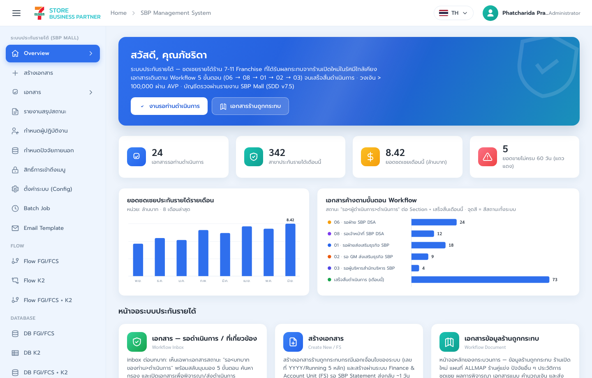
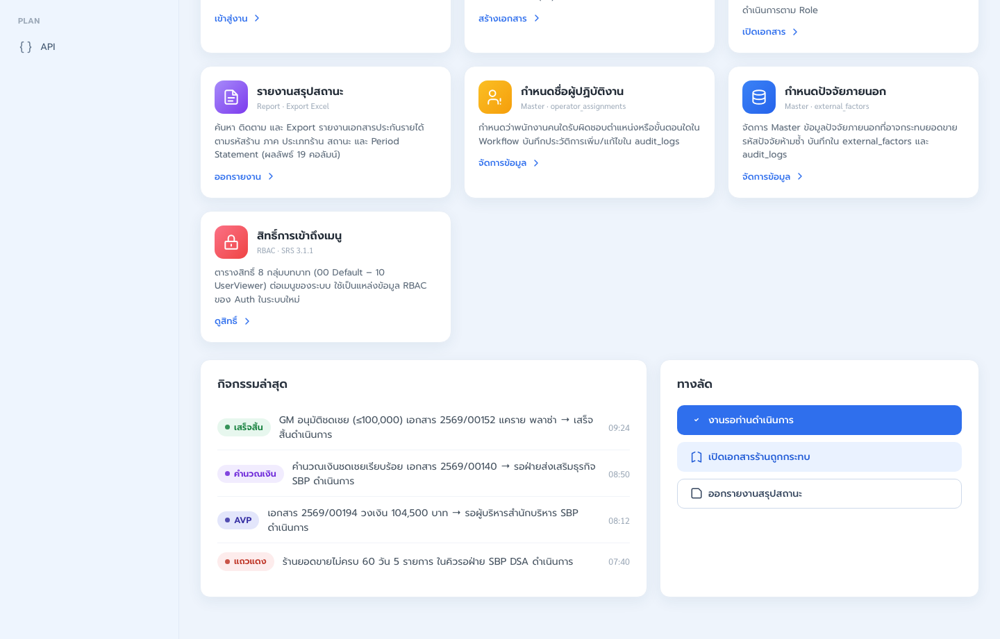
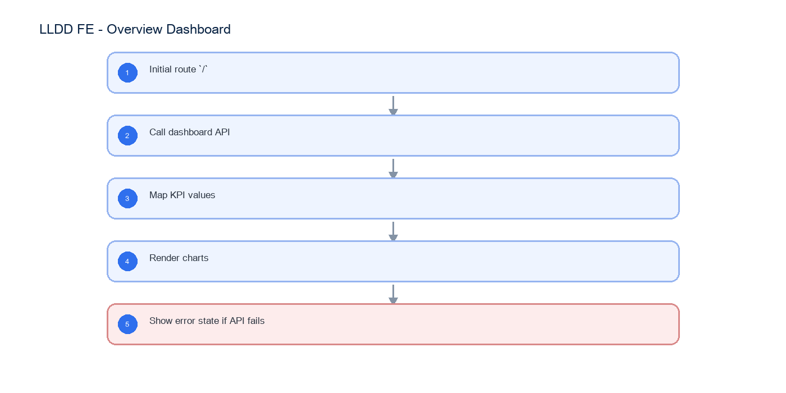

# LLDD FE - Overview Dashboard

SBP Mall - ระบบประกันรายได้ | Low Level Design Document

## 1. Overview

| รายการ | รายละเอียด |
| --- | --- |
| Track | FE |
| Estimate | 39 ชั่วโมง |
| Owner | Chidchanok <lin> Saengamnat |
| Objective | สร้างหน้า Dashboard เพื่อสรุปงานรอดำเนินการ สาขาประกันรายได้ ยอดชดเชย และกราฟสถานะ |

Common contract reference: ทุกหัวข้อ API/FE ต้องยึด LLDD-BE-API-Common-Contracts และ LLDD-FE-Integration-Contracts สำหรับ error/auth/format/pagination/action/RBAC ก่อนลงรายละเอียดเฉพาะหน้าหรือเฉพาะ endpoint

## 2. Screen / Functional Scope

- KPI cards 4 กล่อง
- Task summary และ pending queue
- Monthly compensation chart
- Pending status chart
- Loading/empty/error state

## 3. Screenshot Reference



_รูปที่ 1: Screenshot: index-01.png_



_รูปที่ 2: Screenshot: index-02.png_

## 4. Implementation Flow Diagram (Reference)



_รูปที่ 3: Implementation flow reference: LLDD FE - Overview Dashboard_

## 5. Field, Format, and Validation

| Field / UI | Format | Validation | Behavior |
| --- | --- | --- | --- |
| year | พ.ศ. YYYY | optional default current year | ใช้กับ query dashboard |
| totalPending | integer | >= 0 | แสดงจำนวนงานค้าง |
| compensationAmount | number | >= 0 | แสดงล้านบาท 2 decimal |
| statusChart | array | ต้องมี label/value/color | render SVG chart |

## 5.1 Input / Progress / Output Contract

| Stage | Contract for implementation |
| --- | --- |
| Input | GET /api/v1/dashboard/summary |
| Progress | Initial route `/`; Call dashboard API; Map KPI values; Render charts |
| Output | Rendered UI state or normalized API response with status/message and audit-ready trace reference. |

### 5.90 Overview Dashboard Component Contract

| ID | Component / Scope | Single responsibility | Definition of done |
| --- | --- | --- | --- |
| C01 | KPI cards 4 กล่อง | map ค่า waitingTasks, storesThisMonth, compensationThisMonth และ abnormalStores ลง KPI cards | ทั้งค่าศูนย์/ค่าปกติ format ถูกต้องและ card ไม่คำนวณข้อมูลเพิ่มเอง |
| C02 | Task summary และ pending queue | แสดง task summary/pending queue พร้อม link ไป waiting list โดยรักษา filter ที่เกี่ยวข้อง | จำนวนงานตรง response และ click card เปิดรายการรอดำเนินการ |
| C03 | Monthly compensation chart | แปลง monthlyChart เป็น series/axis/tooltip และรองรับเดือนที่ไม่มีข้อมูล | กราฟแสดงครบทุกเดือน, ค่า 0 ไม่ทำให้ chart blank และ tooltip format เงินถูกต้อง |
| C04 | Pending status chart | แปลง statusChart ด้วยสี/label จาก dictionary และแสดง legend ที่อ่านได้ | ยอดรวม segment ตรง API และ unknown status ใช้ fallback color/label |
| C05 | Loading/empty/error state | แยก skeleton, empty, partial-data, error และ retry state โดยไม่ล้างข้อมูลเดิมระหว่าง refresh | ผู้ใช้ retry ได้และ layout ไม่กระโดดหรือล้นใน mobile |

### 5.91 Overview Dashboard API Adapter Map

| Endpoint | Typed adapter purpose | Invoked by |
| --- | --- | --- |
| GET /api/v1/dashboard/summary | ดึงข้อมูล Dashboard | Refresh dashboard (เปิดหน้า/กด refresh) |

### 5.92 Overview Dashboard Interaction State Machine

| Action | Trigger | API / State transition | Expected visible result |
| --- | --- | --- | --- |
| Refresh dashboard | เปิดหน้า/กด refresh | GET /api/v1/dashboard/summary | update KPI + charts |
| Click pending card | card งานรอดำเนินการ | navigate /documents/waiting | เปิดรายการเอกสารรอ |

### 5.93 Overview Dashboard Feature Failure Checks

| Case | Feature-specific scenario | Expected evidence |
| --- | --- | --- |
| FE-01 | โหลดหน้าสำเร็จ | KPI ตรงกับ API response |
| FE-02 | API error แสดง retry | กราฟไม่ blank |
| FE-03 | ค่าศูนย์แสดง empty state | ข้อความไม่ล้นใน mobile |
| FE-04 | responsive desktop/mobile | กด card แล้วไปหน้ารายการถูกต้อง |

## 6. Button / User Action Mapping

| Action | Trigger | API / Service | Expected Result |
| --- | --- | --- | --- |
| Refresh dashboard | เปิดหน้า/กด refresh | GET /api/v1/dashboard/summary | update KPI + charts |
| Click pending card | card งานรอดำเนินการ | navigate /documents/waiting | เปิดรายการเอกสารรอ |

## 7. API Contract

### GET /api/v1/dashboard/summary

ดึงข้อมูล Dashboard

#### Query Params

```json
{
  "year": 2569
}
```

#### Request Field Schema

| Field | Type | Required | Constraint / Meaning |
| --- | --- | --- | --- |
| year | integer | No | UTF-8; use value domain described by endpoint purpose |

#### Response

```json
{
  "waitingTasks": 24,
  "storesThisMonth": 342,
  "compensationThisMonth": 8420000.0,
  "abnormalStores": 5,
  "monthlyChart": [
    {
      "month": "ม.ค.",
      "amount": 7200000.0
    }
  ],
  "statusChart": [
    {
      "statusCode": "06",
      "label": "รอฝ่าย SBP DSA ดำเนินการ",
      "count": 8
    }
  ]
}
```

#### Response Field Schema

| Field | Type | Required | Constraint / Meaning |
| --- | --- | --- | --- |
| waitingTasks | integer | Yes | UTF-8; use value domain described by endpoint purpose |
| storesThisMonth | integer | Yes | ISO-8601 ค.ศ.; nullable only when type includes null |
| compensationThisMonth | number | Yes | ISO-8601 ค.ศ.; nullable only when type includes null |
| abnormalStores | integer | Yes | UTF-8; use value domain described by endpoint purpose |
| monthlyChart | array<object> | Yes | JSON array; element type shown in Type column |
| monthlyChart[].month | string | Yes | ISO-8601 ค.ศ.; nullable only when type includes null |
| monthlyChart[].amount | number | Yes | number >= 0 with 2 decimals |
| statusChart | array<object> | Yes | JSON array; element type shown in Type column |
| statusChart[].statusCode | string | Yes | canonical code; do not replace with display label |
| statusChart[].label | string | Yes | UTF-8; use value domain described by endpoint purpose |
| statusChart[].count | integer | Yes | UTF-8; use value domain described by endpoint purpose |

## 9. Processing Flow

| Step | Description |
| --- | --- |
| 1 | Initial route `/` |
| 2 | Call dashboard API |
| 3 | Map KPI values |
| 4 | Render charts |
| 5 | Show error state if API fails |

## 10. Acceptance Criteria

- KPI ตรงกับ API response
- กราฟไม่ blank
- ข้อความไม่ล้นใน mobile
- กด card แล้วไปหน้ารายการถูกต้อง

## 11. Developer Test Checklist

| No | Test |
| --- | --- |
| 1 | โหลดหน้าสำเร็จ |
| 2 | API error แสดง retry |
| 3 | ค่าศูนย์แสดง empty state |
| 4 | responsive desktop/mobile |
