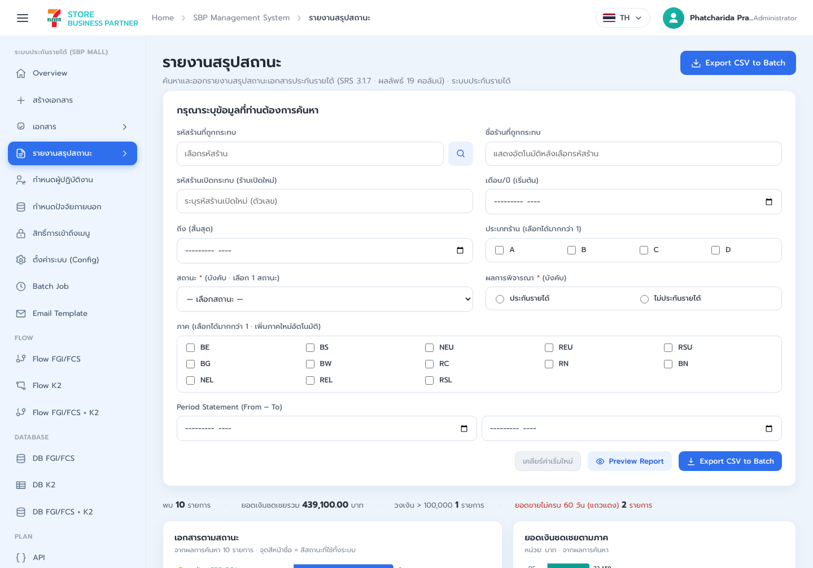
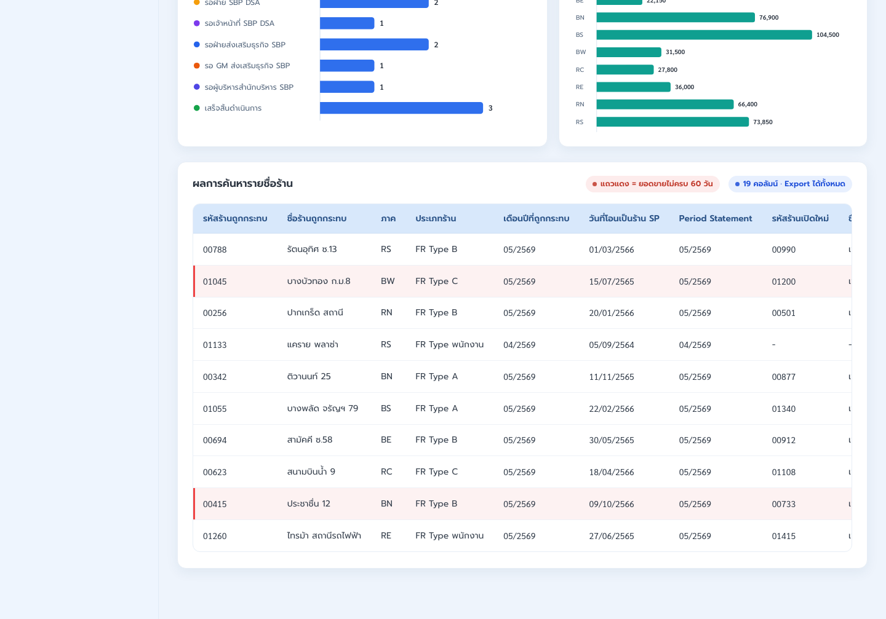
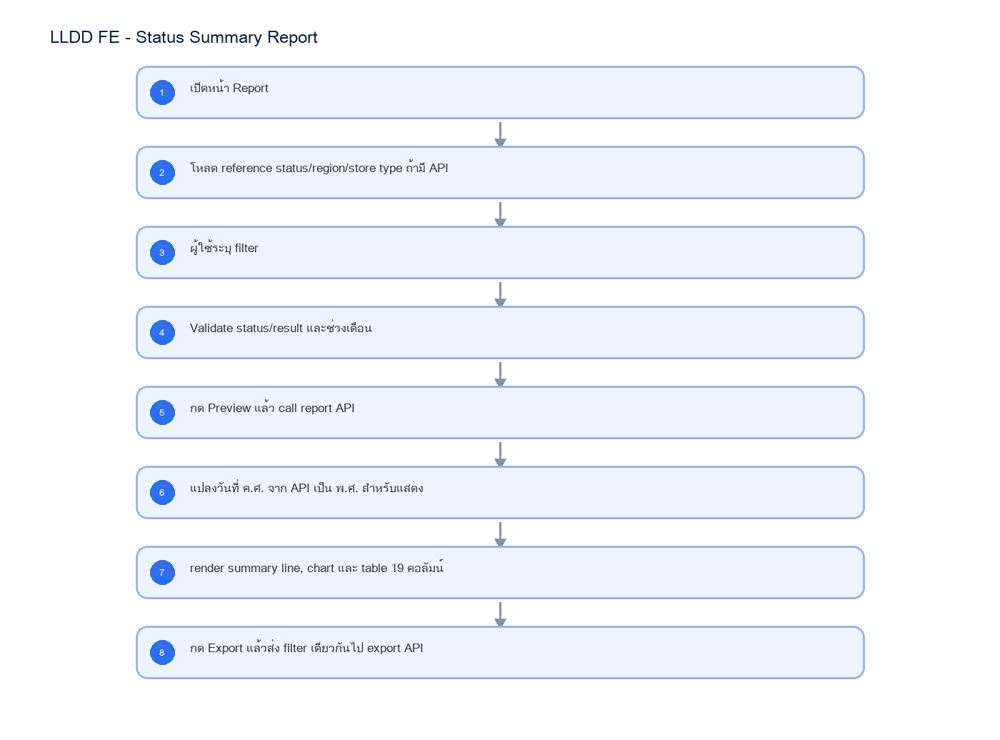

# LLDD FE - Status Summary Report

SBP Mall - ระบบประกันรายได้ | Low Level Design Document

## 1. Overview

| รายการ | รายละเอียด |
| --- | --- |
| Track | FE |
| Estimate | 30 ชั่วโมง |
| Owner | Peerakorn <Pete> Sakunkaewphithak |
| Objective | สร้างรายงานตรวจสอบประกันรายได้พร้อม Preview และ Export CSV |

Common contract reference: ทุกหัวข้อ API/FE ต้องยึด LLDD-BE-API-Common-Contracts และ LLDD-FE-Integration-Contracts สำหรับ error/auth/format/pagination/action/RBAC ก่อนลงรายละเอียดเฉพาะหน้าหรือเฉพาะ endpoint

## 2. Screen / Functional Scope

- Report filters
- Summary table
- Preview/detail modal
- Export action
- Sample data verification

## 3. Screenshot Reference



_รูปที่ 1: Screenshot: k2-report-01.png_



_รูปที่ 2: Screenshot: k2-report-02.png_

## 4. Implementation Flow Diagram (Reference)



_รูปที่ 3: Implementation flow reference: LLDD FE - Status Summary Report_

## 5. Field, Format, and Validation

| Field / UI | Format | Validation | Behavior |
| --- | --- | --- | --- |
| impactedStoreCode | string 5 digits | optional; numeric only when input | คง leading zero; ปุ่มแว่นขยายเรียก popup เลือกร้านที่ถูกกระทบ |
| impactedStoreName | string | readonly | แสดงอัตโนมัติหลังเลือกรหัสร้าน; ไม่ส่งเป็น filter หลักถ้ามี storeCode |
| newStoreCode | string 5 digits | optional; numeric only when input | รหัสร้านเปิดกระทบ/ร้านเปิดใหม่; คง leading zero |
| impactMonthFrom | YYYY-MM | optional; month picker | ส่งเป็น ค.ศ. เช่น 2026-05; FE แสดงเดือน/ปี พ.ศ. ในตาราง |
| impactMonthTo | YYYY-MM | optional; month picker; must be >= from | ถ้า from > to ให้แสดง validation ก่อน call API |
| storeTypes | array enum A\|B\|C\|D | optional multi select | checkbox เลือกได้มากกว่า 1; ส่งเป็น comma/query array |
| status | statusCode string | required single select | บังคับเลือก 1 สถานะก่อน Preview/Export; options ตรงกับ document_statuses |
| resultCategory | APPROVE\|REJECT | required radio | APPROVE=ประกันรายได้, REJECT=ไม่ประกันรายได้ |
| regions | array enum | optional multi select | รองรับ BE, BS, NEU, REU, RSU, BG, BW, RC, RN, BN, NEL, REL, RSL และภาคใหม่จาก API |
| statementPeriodFrom | YYYY-MM | optional month picker | Period Statement From; ส่ง ค.ศ. format YYYY-MM |
| statementPeriodTo | YYYY-MM | optional month picker; must be >= from | Period Statement To; validate range ก่อน call API |
| page | integer | default 1; >=1 | pagination ของ preview table |
| size | integer | default 20; max 100 | BE จำกัด page size เพื่อกัน query หนัก |
| resultTable.storeCode | string 5 digits | display only | คอลัมน์ 1 รหัสร้านถูกกระทบ |
| resultTable.storeName | string | display only | คอลัมน์ 2 ชื่อร้านถูกกระทบ |
| resultTable.region | string | display only | คอลัมน์ 3 ภาค |
| resultTable.storeType | string | display only | คอลัมน์ 4 ประเภทร้าน |
| resultTable.impactMonth | MM/YYYY พ.ศ. | display only | คอลัมน์ 5 เดือนปีที่ถูกกระทบ |
| resultTable.transferToSpDate | DD/MM/YYYY พ.ศ. | nullable | คอลัมน์ 6 วันที่โอนเป็นร้าน SP |
| resultTable.statementPeriod | MM/YYYY พ.ศ. | nullable | คอลัมน์ 7 Period Statement |
| resultTable.newStoreCode | string 5 digits or '-' | display only | คอลัมน์ 8 รหัสร้านเปิดใหม่ |
| resultTable.newStoreName | string or '-' | display only | คอลัมน์ 9 ชื่อร้านเปิดใหม่ |
| resultTable.newStoreRegion | string or '-' | display only | คอลัมน์ 10 ภาค (ร้านใหม่) |
| resultTable.newStoreType | string or '-' | display only | คอลัมน์ 11 ประเภทร้าน (ร้านใหม่) |
| resultTable.compensationAmount | number #,##0.00 | >=0 | คอลัมน์ 12 ยอดเงินชดเชย; align right |
| resultTable.statusName | string/status badge | required | คอลัมน์ 13 สถานะ; สี badge ตาม status |
| resultTable.operatorName | string | nullable | คอลัมน์ 14 ชื่อ-นามสกุลผู้ดำเนินการ |
| resultTable.resultText | string | nullable | คอลัมน์ 15 ผลการพิจารณา |
| resultTable.waitingDays | integer | >=0 | คอลัมน์ 16 รอดำเนินการ (วัน) |
| derived.salesDataDays | integer | <60 = abnormal | ข้อมูลประกอบสำหรับ class flag-red; ไม่ใช่ waitingDays |
| resultTable.roundNo | integer | >=1 | คอลัมน์ 17 ครั้งที่ |
| resultTable.createdDate | DD/MM/YYYY พ.ศ. | required | คอลัมน์ 18 วันที่สร้าง |
| resultTable.docNo | YYYY/xxxxx | required | คอลัมน์ 19 เลขที่เอกสาร; ใช้เปิด detail/preview |

## 5.1 Input / Progress / Output Contract

| Stage | Contract for implementation |
| --- | --- |
| Input | GET /api/v1/stores/search; GET /api/v1/reports/status-summary; GET /api/v1/reports/status-summary/export |
| Progress | เปิดหน้า Report; โหลด reference status/region/store type ถ้ามี API; ผู้ใช้ระบุ filter; Validate status/result และช่วงเดือน |
| Output | Rendered UI state or normalized API response with status/message and audit-ready trace reference. |

### 5.90 Status Summary Report Component Contract

| ID | Component / Scope | Single responsibility | Definition of done |
| --- | --- | --- | --- |
| C01 | Report filters | จัดการ filter store/month/type/status/result/region/statement period พร้อม dependency validation | status/result required และช่วง from-to ทุกคู่ตรวจผ่านก่อน Preview/Export |
| C02 | Summary table | map response เป็น summary line, chart และตาราง 19 คอลัมน์ด้วย formatter กลาง | คอลัมน์/ยอดรวม/วันที่/leading zero ตรง response และข้อมูลยอดขายผิดปกติใช้ salesDataDays |
| C03 | Preview/detail modal | แสดง preview/detail โดยใช้ filter snapshot เดียวกับผลลัพธ์ที่กำลังดู | เปิดเอกสารถูก docNo และปิด modal แล้ว filter/table ไม่ reset |
| C04 | Export action | ส่ง filter snapshot ล่าสุดไป export endpoint และจัดการ queued/download/error state | export ใช้เงื่อนไขเดียวกับ preview และชื่อไฟล์/content type ตรง response |
| C05 | Sample data verification | รองรับ fixture สำหรับ 0 แถว, หลาย region/type, เกิน threshold และยอดขายไม่ครบ 60 วัน | sample verification ครอบคลุม chart/table/export parity โดยไม่ฝังข้อมูลทดสอบใน production |

### 5.91 Status Summary Report API Adapter Map

| Endpoint | Typed adapter purpose | Invoked by |
| --- | --- | --- |
| GET /api/v1/stores/search | Popup เลือกร้านที่ถูกกระทบ | เปิด popup ร้าน (ปุ่มแว่นขยายข้างรหัสร้านที่ถูกกระทบ) |
| GET /api/v1/reports/status-summary | Preview รายงานและข้อมูล chart/summary | Preview Report (ปุ่ม Preview Report); Export CSV to Batch (ปุ่ม Export CSV to Batch ด้านบน/ท้าย filter) |
| GET /api/v1/reports/status-summary/export | Export CSV to Batch ด้วย filter เดียวกับ preview | Export CSV to Batch (ปุ่ม Export CSV to Batch ด้านบน/ท้าย filter) |

### 5.92 Status Summary Report Interaction State Machine

| Action | Trigger | API / State transition | Expected visible result |
| --- | --- | --- | --- |
| เปิด popup ร้าน | ปุ่มแว่นขยายข้างรหัสร้านที่ถูกกระทบ | GET /api/v1/stores/search?type=impacted | เลือก store แล้วเติม storeCode/storeName |
| Preview Report | ปุ่ม Preview Report | GET /api/v1/reports/status-summary | validate required แล้ว render summary line/chart/table 19 columns |
| เคลียร์ค่าเริ่มใหม่ | ปุ่มเคลียร์ค่าเริ่มใหม่ | client state | reset filter, summary, table และ error message |
| Export CSV to Batch | ปุ่ม Export CSV to Batch ด้านบน/ท้าย filter | GET /api/v1/reports/status-summary/export | ส่ง filter ชุดเดียวกับ preview แล้ว download/queue CSV |
| Hover chart | hover bar chart | client chart tooltip | แสดง tooltip จำนวนเอกสาร/ยอดเงินตามภาค |
| Open detail | คลิกเลขที่เอกสารหรือ row | navigate /documents/{docNo} หรือ preview modal | เปิดเอกสารที่เกี่ยวข้อง |

### 5.93 Status Summary Report Feature Failure Checks

| Case | Feature-specific scenario | Expected evidence |
| --- | --- | --- |
| FE-01 | ไม่เลือก status แล้ว preview ต้อง block | status และ resultCategory เป็น required ก่อน preview/export |
| FE-02 | ไม่เลือก resultCategory แล้ว export ต้อง block | month range ทุกคู่ต้อง from <= to |
| FE-03 | impactMonthFrom > impactMonthTo ต้อง error REPORT_DATE_RANGE_INVALID | ตารางแสดง 19 คอลัมน์ครบและ export ออกครบ 19 คอลัมน์ |
| FE-04 | ค้นหาด้วยร้านถูกกระทบ | ยอดเงิน format #,##0.00 และ total summary ตรงกับผลรวม API |
| FE-05 | เลือกหลาย region/storeType | แถวข้อมูลยอดขายไม่ครบ 60 วันใช้ class flag-red โดยอิง derived.salesDataDays < 60 |
| FE-06 | render table 19 columns | export ใช้ filter เดียวกับ preview ล่าสุด |

## 6. Button / User Action Mapping

| Action | Trigger | API / Service | Expected Result |
| --- | --- | --- | --- |
| เปิด popup ร้าน | ปุ่มแว่นขยายข้างรหัสร้านที่ถูกกระทบ | GET /api/v1/stores/search?type=impacted | เลือก store แล้วเติม storeCode/storeName |
| Preview Report | ปุ่ม Preview Report | GET /api/v1/reports/status-summary | validate required แล้ว render summary line/chart/table 19 columns |
| เคลียร์ค่าเริ่มใหม่ | ปุ่มเคลียร์ค่าเริ่มใหม่ | client state | reset filter, summary, table และ error message |
| Export CSV to Batch | ปุ่ม Export CSV to Batch ด้านบน/ท้าย filter | GET /api/v1/reports/status-summary/export | ส่ง filter ชุดเดียวกับ preview แล้ว download/queue CSV |
| Hover chart | hover bar chart | client chart tooltip | แสดง tooltip จำนวนเอกสาร/ยอดเงินตามภาค |
| Open detail | คลิกเลขที่เอกสารหรือ row | navigate /documents/{docNo} หรือ preview modal | เปิดเอกสารที่เกี่ยวข้อง |

## 7. API Contract

### GET /api/v1/stores/search

Popup เลือกร้านที่ถูกกระทบ

#### Query Params

```json
{
  "q": "00788",
  "type": "impacted"
}
```

#### Request Field Schema

| Field | Type | Required | Constraint / Meaning |
| --- | --- | --- | --- |
| q | string | No | UTF-8; use value domain described by endpoint purpose |
| type | string | No | UTF-8; use value domain described by endpoint purpose |

#### Response

```json
{
  "items": [
    {
      "storeCode": "00788",
      "storeName": "รัตนอุทิศ ซ.13",
      "region": "RS",
      "storeType": "FR Type B"
    }
  ]
}
```

#### Response Field Schema

| Field | Type | Required | Constraint / Meaning |
| --- | --- | --- | --- |
| items | array<object> | Yes | JSON array; element type shown in Type column |
| items[].storeCode | string | Yes | exactly 5 digits; preserve leading zero |
| items[].storeName | string | Yes | UTF-8; use value domain described by endpoint purpose |
| items[].region | string | Yes | UTF-8; use value domain described by endpoint purpose |
| items[].storeType | string | Yes | UTF-8; use value domain described by endpoint purpose |

### GET /api/v1/reports/status-summary

Preview รายงานและข้อมูล chart/summary

#### Query Params

```json
{
  "impactedStoreCode": "00788",
  "newStoreCode": "00990",
  "impactMonthFrom": "2026-05",
  "impactMonthTo": "2026-05",
  "storeTypes": [
    "A",
    "B"
  ],
  "status": "06",
  "resultCategory": "APPROVE",
  "regions": [
    "RS",
    "BN"
  ],
  "statementPeriodFrom": "2026-05",
  "statementPeriodTo": "2026-05",
  "page": 1,
  "size": 20
}
```

#### Request Field Schema

| Field | Type | Required | Constraint / Meaning |
| --- | --- | --- | --- |
| impactedStoreCode | string | No | exactly 5 digits; preserve leading zero |
| newStoreCode | string | No | exactly 5 digits; preserve leading zero |
| impactMonthFrom | string | No | UTF-8; use value domain described by endpoint purpose |
| impactMonthTo | string | No | UTF-8; use value domain described by endpoint purpose |
| storeTypes | array<string> | No | JSON array; element type shown in Type column |
| status | string | Yes | UTF-8; use value domain described by endpoint purpose |
| resultCategory | string | Yes | UTF-8; use value domain described by endpoint purpose |
| regions | array<string> | No | JSON array; element type shown in Type column |
| statementPeriodFrom | string | No | UTF-8; use value domain described by endpoint purpose |
| statementPeriodTo | string | No | UTF-8; use value domain described by endpoint purpose |
| page | integer | No | >= 1; default 1 |
| size | integer | No | 1..100; default 20 |

#### Response

```json
{
  "page": 1,
  "size": 20,
  "total": 10,
  "summary": {
    "totalItems": 10,
    "totalCompensationAmount": 439100.0,
    "overThresholdItems": 1,
    "abnormalSalesItems": 2
  },
  "charts": {
    "status": [
      {
        "label": "รอฝ่าย SBP DSA ดำเนินการ",
        "value": 2
      }
    ],
    "regionAmount": [
      {
        "region": "RS",
        "amount": 73850.0
      }
    ]
  },
  "items": [
    {
      "impactedStoreCode": "00788",
      "impactedStoreName": "รัตนอุทิศ ซ.13",
      "region": "RS",
      "storeType": "FR Type B",
      "impactMonth": "2026-05",
      "transferToSpDate": "2026-03-01",
      "statementPeriod": "2026-05",
      "newStoreCode": "00990",
      "newStoreName": "เซเว่นฯ รัตนาธิเบศร์ 12",
      "newStoreRegion": "RS",
      "newStoreType": "FR Type A",
      "compensationAmount": 48200.0,
      "statusName": "รอฝ่าย SBP DSA ดำเนินการ",
      "operatorName": "สมชาย ใจดี",
      "resultText": "-",
      "waitingDays": 2,
      "roundNo": 1,
      "createdDate": "2026-06-12",
      "docNo": "2569/00123"
    }
  ]
}
```

#### Response Field Schema

| Field | Type | Required | Constraint / Meaning |
| --- | --- | --- | --- |
| page | integer | Yes | >= 1; default 1 |
| size | integer | Yes | 1..100; default 20 |
| total | integer | Yes | UTF-8; use value domain described by endpoint purpose |
| summary | object | Yes | JSON object; nested fields listed below |
| summary.totalItems | integer | Yes | UTF-8; use value domain described by endpoint purpose |
| summary.totalCompensationAmount | number | Yes | number >= 0 with 2 decimals |
| summary.overThresholdItems | integer | Yes | UTF-8; use value domain described by endpoint purpose |
| summary.abnormalSalesItems | integer | Yes | UTF-8; use value domain described by endpoint purpose |
| charts | object | Yes | JSON object; nested fields listed below |
| charts.status | array<object> | Yes | JSON array; element type shown in Type column |
| charts.status[].label | string | Yes | UTF-8; use value domain described by endpoint purpose |
| charts.status[].value | integer | Yes | UTF-8; use value domain described by endpoint purpose |
| charts.regionAmount | array<object> | Yes | number >= 0 with 2 decimals |
| charts.regionAmount[].region | string | Yes | UTF-8; use value domain described by endpoint purpose |
| charts.regionAmount[].amount | number | Yes | number >= 0 with 2 decimals |
| items | array<object> | Yes | JSON array; element type shown in Type column |
| items[].impactedStoreCode | string | Yes | exactly 5 digits; preserve leading zero |
| items[].impactedStoreName | string | Yes | UTF-8; use value domain described by endpoint purpose |
| items[].region | string | Yes | UTF-8; use value domain described by endpoint purpose |
| items[].storeType | string | Yes | UTF-8; use value domain described by endpoint purpose |
| items[].impactMonth | string | Yes | ISO-8601 ค.ศ.; nullable only when type includes null |
| items[].transferToSpDate | string | Yes | ISO-8601 ค.ศ.; nullable only when type includes null |
| items[].statementPeriod | string | Yes | UTF-8; use value domain described by endpoint purpose |
| items[].newStoreCode | string | Yes | exactly 5 digits; preserve leading zero |
| items[].newStoreName | string | Yes | UTF-8; use value domain described by endpoint purpose |
| items[].newStoreRegion | string | Yes | UTF-8; use value domain described by endpoint purpose |
| items[].newStoreType | string | Yes | UTF-8; use value domain described by endpoint purpose |
| items[].compensationAmount | number | Yes | number >= 0 with 2 decimals |
| items[].statusName | string | Yes | UTF-8; use value domain described by endpoint purpose |
| items[].operatorName | string | Yes | UTF-8; use value domain described by endpoint purpose |
| items[].resultText | string | Yes | UTF-8; use value domain described by endpoint purpose |
| items[].waitingDays | integer | Yes | UTF-8; use value domain described by endpoint purpose |
| items[].roundNo | integer | Yes | UTF-8; use value domain described by endpoint purpose |
| items[].createdDate | string | Yes | ISO-8601 ค.ศ.; nullable only when type includes null |
| items[].docNo | string | Yes | พ.ศ. YYYY/xxxxx |

### GET /api/v1/reports/status-summary/export

Export CSV to Batch ด้วย filter เดียวกับ preview

#### Query Params

```json
{
  "sameAsPreview": true,
  "format": "csv"
}
```

#### Request Field Schema

| Field | Type | Required | Constraint / Meaning |
| --- | --- | --- | --- |
| sameAsPreview | boolean | No | UTF-8; use value domain described by endpoint purpose |
| format | string | No | ISO-8601 ค.ศ.; nullable only when type includes null |

#### Response

```json
{
  "contentType": "text/csv; charset=utf-8",
  "fileName": "status-summary-2569.csv",
  "queuedToBatch": true
}
```

#### Response Field Schema

| Field | Type | Required | Constraint / Meaning |
| --- | --- | --- | --- |
| contentType | string | Yes | UTF-8; use value domain described by endpoint purpose |
| fileName | string | Yes | UTF-8; use value domain described by endpoint purpose |
| queuedToBatch | boolean | Yes | UTF-8; use value domain described by endpoint purpose |

## 9. Processing Flow

| Step | Description |
| --- | --- |
| 1 | เปิดหน้า Report |
| 2 | โหลด reference status/region/store type ถ้ามี API |
| 3 | ผู้ใช้ระบุ filter |
| 4 | Validate status/result และช่วงเดือน |
| 5 | กด Preview แล้ว call report API |
| 6 | แปลงวันที่ ค.ศ. จาก API เป็น พ.ศ. สำหรับแสดง |
| 7 | render summary line, chart และ table 19 คอลัมน์ |
| 8 | กด Export แล้วส่ง filter เดียวกันไป export API |

## 10. Acceptance Criteria

- status และ resultCategory เป็น required ก่อน preview/export
- month range ทุกคู่ต้อง from <= to
- ตารางแสดง 19 คอลัมน์ครบและ export ออกครบ 19 คอลัมน์
- ยอดเงิน format #,##0.00 และ total summary ตรงกับผลรวม API
- แถวข้อมูลยอดขายไม่ครบ 60 วันใช้ class flag-red โดยอิง derived.salesDataDays < 60
- export ใช้ filter เดียวกับ preview ล่าสุด

## 11. Developer Test Checklist

| No | Test |
| --- | --- |
| 1 | ไม่เลือก status แล้ว preview ต้อง block |
| 2 | ไม่เลือก resultCategory แล้ว export ต้อง block |
| 3 | impactMonthFrom > impactMonthTo ต้อง error REPORT_DATE_RANGE_INVALID |
| 4 | ค้นหาด้วยร้านถูกกระทบ |
| 5 | เลือกหลาย region/storeType |
| 6 | render table 19 columns |
| 7 | export csv utf-8 |
| 8 | empty result แสดง summary เป็น 0 |
