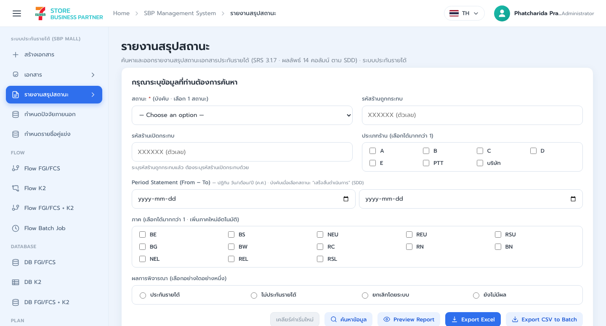
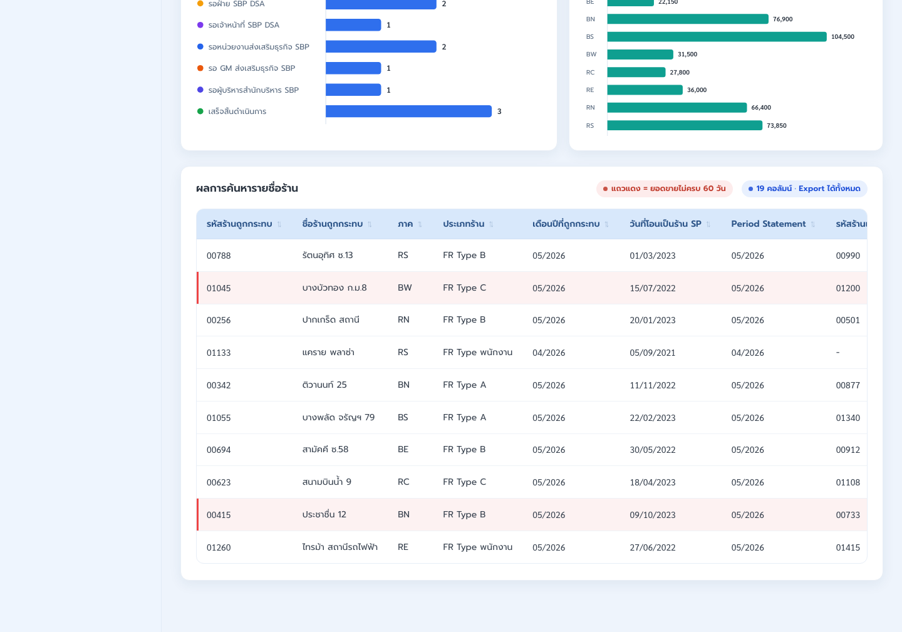
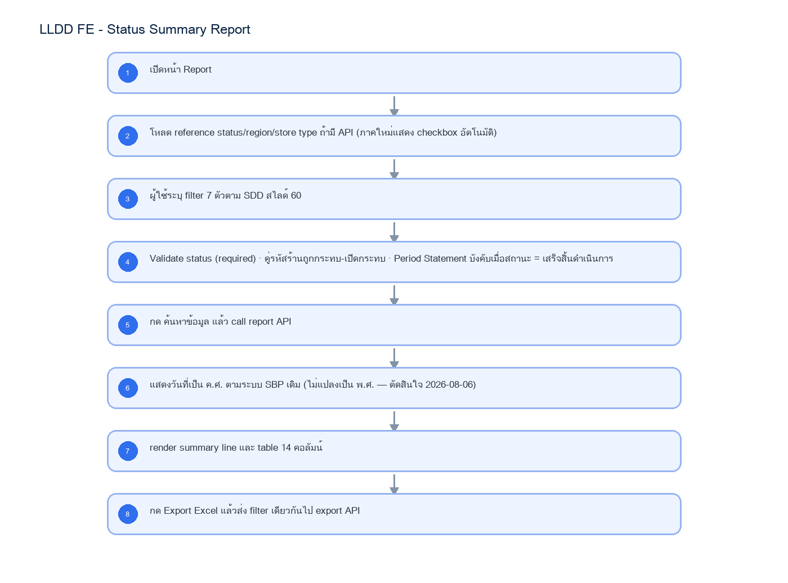

# LLDD FE - Status Summary Report

SBP Mall - ระบบประกันรายได้ | Low Level Design Document

## 1. Overview

| รายการ | รายละเอียด |
| --- | --- |
| Track | FE |
| Estimate | **25 ชั่วโมง** = implementation 20 + unit test 5 (25%) |
| Owner | Kittisak <New> Kaeowika |
| Target repository | `SBP/srm-sps-spsap-web-frontend` (sbp-portal · Next.js · `NEXT_PUBLIC_APP_TARGET=sbpm`) — เรียก API ผ่าน `SBP/srm-sps-spsap-sbp-bff` เท่านั้น ห้ามยิง store-backend ตรง |
| Objective | สร้างรายงานตรวจสอบประกันรายได้ตาม SDD สไลด์ 60 (7 ตัวกรอง / 14 คอลัมน์) พร้อมค้นหาข้อมูลและ Export Excel |

Common contract reference: ทุกหัวข้อ API/FE ต้องยึด LLDD-BE-API-Common-Contracts และ LLDD-FE-Integration-Contracts สำหรับ error/auth/format/pagination/action/RBAC ก่อนลงรายละเอียดเฉพาะหน้าหรือเฉพาะ endpoint

## 2. Screen / Functional Scope

- Report filters (SDD slide 60 · 2026-08-06: สถานะ*|รหัสร้านถูกกระทบ · รหัสร้านเปิดกระทบ|ประเภทร้าน (รหัสจาก common_code · รหัสที่ 4 รอยืนยัน) · Period Statement From-To (date, ค.ศ.) เต็มแถว · ภาคเต็มแถว · ผลการพิจารณาเต็มแถว)
- Summary table (sortable 14 columns)
- ปุ่มออกผล 3 ตัว (Preview Report · Export Excel · Export CSV to Batch)
- Sample data verification

## 3. Screenshot Reference



_รูปที่ 1: Screenshot: k2-report-01.png_



_รูปที่ 2: Screenshot: k2-report-02.png_

## 4. Implementation Flow Diagram (Reference)



_รูปที่ 3: Implementation flow reference: LLDD FE - Status Summary Report_

## 5. Field, Format, and Validation

| Field / UI | Format | Validation | Behavior |
| --- | --- | --- | --- |
| impactedStoreCode | string 5 digits | optional; numeric only when input | คง leading zero; ปุ่มแว่นขยายเรียก popup เลือกร้านที่ถูกกระทบ |
| impactedStoreName | string | readonly | แสดงอัตโนมัติหลังเลือกรหัสร้าน; ไม่ส่งเป็น filter หลักถ้ามี storeCode |
| newStoreCode | string 5 digits | optional; numeric only when input | รหัสร้านเปิดกระทบ/ร้านเปิดใหม่; คง leading zero |
| impactMonthFrom | YYYY-MM | optional; month picker | ส่งและแสดงเป็น ค.ศ. เช่น 2026-05 |
| impactMonthTo | YYYY-MM | optional; month picker; must be >= from | ถ้า from > to ให้แสดง validation ก่อน call API |
| storeTypes | array ของ BranchTypeFGIName | optional multi select | **ยืนยันจาก master จริงแล้ว (`ข้อมูล Master K2.xlsx` · ชีต `BranchTypeProfile` จาก `CPA_FRN_FGI`)**: ค่าที่ใช้คือคอลัมน์ `BranchTypeFGIName` มี **7 ค่าไม่ซ้ำ** — `A` (A-Mo) · `B` (B(1)) · `C` (C และ C(Retire CPALL)) · `D` (Type D — เดิมเรียก BGC) · `E` (B(2)) · `PTT` · `บริษัท` (Corporate) · ⚠️ **D กับ E เป็นคนละประเภทและมีจริงทั้งคู่** — เอกสารรุ่นก่อนที่แสดงเพียง 4 ตัวเลือก (A/B/C/E หรือ A/B/C/D) **ผิด** ทั้ง SDD สไลด์ 60 (แสดงบางส่วน) และ SRS (เขียน “พนักงาน” ซึ่ง**ไม่มีใน master**) · ยังคง**ห้าม hardcode** — โหลดจาก `GET /common/common-code` ของระบบ SBP เดิม แล้วใช้ 7 ค่านี้เป็น expected set ตอนทดสอบ |
| status | statusCode string | required single select | บังคับเลือก 1 สถานะก่อน Preview/Export; options มาจาก sps_store.workflow_status ของ @srm/glb-workflow (ตาราง document_statuses ของ SBPGI ถูกตัดแล้ว) |
| resultCategory | APPROVE\|REJECT\|CANCELLED\|PENDING | optional radio (status เท่านั้นที่บังคับ) | **4 ค่า** — APPROVE=ประกันรายได้ · REJECT=ไม่ประกันรายได้ · **CANCELLED=ยกเลิกโดยระบบ (เพิ่ม 2026-08-10)** · PENDING/ไม่มีค่า=ยังไม่มีผล · CANCELLED มาจาก master จริง `DecisionProfile` decision 14 `CancelBySystem` (`DecisionResultName` = ยกเลิกโดยระบบ) ซึ่ง SDD สไลด์ 60 ไม่ได้แสดงไว้ |
| regions | array ของ ZoneName | optional multi select | **ยืนยันจาก master จริงแล้ว (`ข้อมูล Master K2.xlsx` · ชีต `ZoneProfile`)**: **13 ภาค** — BN(10) · BW(20) · BE(30) · BG(40) · BS(70) · REU(81) · NEU(82) · RSU(83) · RSL(84) · RN(85) · RC(86) · REL(90) · NEL(92) (ตัวเลขในวงเล็บคือ `ZoneCode`) — ตรงกับรายการที่ prototype ใช้ **ครบทั้ง 13 ค่า** · รายการ 8 ค่าใน SRS (BE/BN/BS/BW/RC/RE/RN/RS) เป็นของเก่า **ไม่ต้องใช้** · ยังคง**ห้าม hardcode** — โหลดจาก `GET /store/all-regions` ของระบบ SBP เดิม |
| statementPeriodFrom | YYYY-MM | optional month picker | Period Statement From; ส่ง ค.ศ. format YYYY-MM |
| statementPeriodTo | YYYY-MM | optional month picker; must be >= from | Period Statement To; validate range ก่อน call API |
| page | integer | default 1; >=1 | pagination ของ preview table |
| size | integer | default 20; max 100 | BE จำกัด page size เพื่อกัน query หนัก |
| resultTable.storeCode | string 5 digits | display only | คอลัมน์ 1 รหัสร้านถูกกระทบ |
| resultTable.storeName | string | display only | คอลัมน์ 2 ชื่อร้านถูกกระทบ |
| resultTable.region | string | display only | คอลัมน์ 3 ภาค |
| resultTable.storeType | string | display only | คอลัมน์ 4 ประเภทร้าน |
| resultTable.impactMonth | MM/YYYY ค.ศ. | display only | คอลัมน์ 5 เดือน/ปีที่ถูกกระทบ |
| resultTable.statementPeriod | MM/YYYY ค.ศ. | nullable | คอลัมน์ 6 Period Statement |
| resultTable.newStoreCode | string 5 digits or '-' | display only | คอลัมน์ 7 รหัสร้านเปิดกระทบ |
| resultTable.newStoreName | string or '-' | display only | คอลัมน์ 8 ชื่อร้านเปิดกระทบ |
| resultTable.newStoreRegion | string or '-' | display only | คอลัมน์ 9 ภาค (ร้านเปิดกระทบ) |
| resultTable.newStoreType | string or '-' | display only | คอลัมน์ 10 ประเภทร้าน (ร้านเปิดกระทบ) |
| resultTable.compensationAmount | number #,##0.00 | >=0 | คอลัมน์ 11 ยอดเงินชดเชย; align right |
| derived.salesDataDays | integer | <60 = abnormal | ข้อมูลประกอบสำหรับ class flag-red; ไม่ใช่ waitingDays |
| resultTable.roundNo | integer | >=1 | คอลัมน์ 12 ครั้งที่ |
| resultTable.createdDate | DD/MM/YYYY ค.ศ. | required | คอลัมน์ 13 วันที่สร้าง |
| resultTable.docNo | YYYY/xxxxx | required | คอลัมน์ 14 เลขที่เอกสาร; ใช้เปิด detail/preview |

### 5.9 Input / Progress / Output Contract

| Stage | Contract for implementation |
| --- | --- |
| Input | GET /store/search (ระบบ SBP เดิม); GET /api/v1/reports/status-summary; GET /api/v1/reports/status-summary/export |
| Progress | เปิดหน้า Report; โหลด reference status/region/store type ถ้ามี API (ภาคใหม่แสดง checkbox อัตโนมัติ); ผู้ใช้ระบุ filter 7 ตัวตาม SDD สไลด์ 60; Validate status (required) · คู่รหัสร้านถูกกระทบ-เปิดกระทบ · Period Statement บังคับเมื่อสถานะ = เสร็จสิ้นดำเนินการ |
| Output | Rendered UI state or normalized API response with status/message and audit-ready trace reference. |

### 5.90 Status Summary Report Component Contract

| ID | Component / Scope | Single responsibility | Definition of done |
| --- | --- | --- | --- |
| C01 | Report filters (SDD slide 60 · 2026-08-06: สถานะ*\|รหัสร้านถูกกระทบ · รหัสร้านเปิดกระทบ\|ประเภทร้าน (รหัสจาก common_code · รหัสที่ 4 รอยืนยัน) · Period Statement From-To (date, ค.ศ.) เต็มแถว · ภาคเต็มแถว · ผลการพิจารณาเต็มแถว) | จัดการ filter 7 ตัวตาม SDD สไลด์ 60 (status, impacted/new store code, store type, period statement, region, result) พร้อม dependency validation | status required, คู่รหัสร้านต้องมาด้วยกัน, period statement บังคับเมื่อสถานะ = เสร็จสิ้นดำเนินการ และช่วง from-to ตรวจผ่านก่อนค้นหา/Export |
| C02 | Summary table (sortable 14 columns) | map response เป็น summary line และตาราง 14 คอลัมน์ (SDD สไลด์ 60) ด้วย formatter กลาง | คอลัมน์/ยอดรวม/วันที่ (ค.ศ.)/leading zero ตรง response และข้อมูลยอดขายผิดปกติใช้ salesDataDays |
| C03 | ปุ่มออกผล 3 ตัว (Preview Report · Export Excel · Export CSV to Batch) | ส่ง filter snapshot ล่าสุดไป export endpoint และจัดการ download/error state · SDD GI สไลด์ 62 กำหนดปุ่มออกผล 3 ตัว — Preview Report (ดูตัวอย่างก่อนออกไฟล์) · Export Excel (ทีมบัญชีเทียบ SAP) · Export CSV to Batch (ส่งเข้าคิว batch ประมวลผลต่อ) | ทั้งสามปุ่มใช้เงื่อนไขค้นหาชุดเดียวกับตารางผลลัพธ์ และชื่อไฟล์/content type ตรง response (.xlsx สำหรับ Excel · .csv สำหรับ CSV to Batch) |
| C04 | Sample data verification | รองรับ fixture สำหรับ 0 แถว, หลาย region/type, เกิน threshold และยอดขายไม่ครบ 60 วัน | sample verification ครอบคลุม table/export parity 14 คอลัมน์ โดยไม่ฝังข้อมูลทดสอบใน production |

### 5.91 Status Summary Report API Adapter Map

| Endpoint | Typed adapter purpose | Invoked by |
| --- | --- | --- |
| GET /store/search (ระบบ SBP เดิม) | Popup เลือกร้านที่ถูกกระทบ | เปิด popup ร้าน (ปุ่มแว่นขยายข้างรหัสร้านที่ถูกกระทบ) |
| GET /api/v1/reports/status-summary | ค้นหาข้อมูลรายงานตรวจสอบประกันรายได้ (14 คอลัมน์ · SDD สไลด์ 60) | ค้นหาข้อมูล (ปุ่ม ค้นหาข้อมูล); Export Excel (ปุ่ม Export Excel ท้าย filter) |
| GET /api/v1/reports/status-summary/export | Export Excel ด้วย filter เดียวกับการค้นหา | Export Excel (ปุ่ม Export Excel ท้าย filter) |

### 5.92 Status Summary Report Interaction State Machine

| Action | Trigger | API / State transition | Expected visible result |
| --- | --- | --- | --- |
| เปิด popup ร้าน | ปุ่มแว่นขยายข้างรหัสร้านที่ถูกกระทบ | GET /store/search (ระบบ SBP เดิม) | เลือก store แล้วเติม storeCode/storeName |
| ค้นหาข้อมูล | ปุ่ม ค้นหาข้อมูล | GET /api/v1/reports/status-summary | validate status (required) และคู่รหัสร้าน แล้ว render summary line + table 14 columns |
| เคลียร์ค่าเริ่มใหม่ | ปุ่มเคลียร์ค่าเริ่มใหม่ | client state | reset filter, summary, table และ error message |
| Export Excel | ปุ่ม Export Excel ท้าย filter | GET /api/v1/reports/status-summary/export | ส่ง filter ชุดเดียวกับการค้นหา แล้วดาวน์โหลดไฟล์ .xlsx 14 คอลัมน์ |
| Hover chart | hover bar chart | client chart tooltip | แสดง tooltip จำนวนเอกสาร/ยอดเงินตามภาค |
| Open detail | คลิกเลขที่เอกสารหรือ row | navigate /documents/{docNo} หรือ preview modal | เปิดเอกสารที่เกี่ยวข้อง |

### 5.93 Status Summary Report Feature Failure Checks

| Case | Feature-specific scenario | Expected evidence |
| --- | --- | --- |
| FE-01 | ไม่เลือก status แล้วค้นหาต้อง block | status เป็น required ตัวเดียวก่อนค้นหา/export (resultCategory เป็นตัวเลือก · SDD สไลด์ 60) |
| FE-02 | ระบุร้านถูกกระทบแต่ไม่ระบุร้านเปิดกระทบ ต้อง block | ระบุ impactedStoreCode แล้วต้องระบุ newStoreCode ด้วย |
| FE-03 | periodStatementFrom > periodStatementTo ต้อง error REPORT_DATE_RANGE_INVALID | Period Statement เป็นช่วงวันที่ ค.ศ. และ from <= to |
| FE-04 | สถานะ = เสร็จสิ้นดำเนินการ แต่ไม่ระบุ Period Statement ต้อง block | ตารางแสดง 14 คอลัมน์ครบและ export ออกครบ 14 คอลัมน์ |
| FE-05 | ค้นหาด้วยร้านถูกกระทบ | ยอดเงิน format #,##0.00 และ total summary ตรงกับผลรวม API |
| FE-06 | เลือกหลาย region/storeType | แถวข้อมูลยอดขายไม่ครบ 60 วันใช้ class flag-red โดยอิง derived.salesDataDays < 60 |

## 6. Button / User Action Mapping

| Action | Trigger | API / Service | Expected Result |
| --- | --- | --- | --- |
| เปิด popup ร้าน | ปุ่มแว่นขยายข้างรหัสร้านที่ถูกกระทบ | GET /store/search (ระบบ SBP เดิม) | เลือก store แล้วเติม storeCode/storeName |
| ค้นหาข้อมูล | ปุ่ม ค้นหาข้อมูล | GET /api/v1/reports/status-summary | validate status (required) และคู่รหัสร้าน แล้ว render summary line + table 14 columns |
| เคลียร์ค่าเริ่มใหม่ | ปุ่มเคลียร์ค่าเริ่มใหม่ | client state | reset filter, summary, table และ error message |
| Export Excel | ปุ่ม Export Excel ท้าย filter | GET /api/v1/reports/status-summary/export | ส่ง filter ชุดเดียวกับการค้นหา แล้วดาวน์โหลดไฟล์ .xlsx 14 คอลัมน์ |
| Hover chart | hover bar chart | client chart tooltip | แสดง tooltip จำนวนเอกสาร/ยอดเงินตามภาค |
| Open detail | คลิกเลขที่เอกสารหรือ row | navigate /documents/{docNo} หรือ preview modal | เปิดเอกสารที่เกี่ยวข้อง |

## 7. API Contract

### GET /store/search (ระบบ SBP เดิม)

Popup เลือกร้านที่ถูกกระทบ

#### Query Params

```json
{
  "q": "00788",
  "type": "impacted"
}
```

#### Request Field Schema

| Field | Type | Required | Constraint / Meaning |
| --- | --- | --- | --- |
| q | string | No | UTF-8; use value domain described by endpoint purpose |
| type | string | No | UTF-8; use value domain described by endpoint purpose |

#### Response

```json
{
  "items": [
    {
      "storeCode": "00788",
      "storeName": "รัตนอุทิศ ซ.13",
      "region": "BN",
      "storeType": "SBP Type B"
    }
  ]
}
```

#### Response Field Schema

| Field | Type | Required | Constraint / Meaning |
| --- | --- | --- | --- |
| items | array<object> | Yes | JSON array; element type shown in Type column |
| items[].storeCode | string | Yes | exactly 5 digits; preserve leading zero |
| items[].storeName | string | Yes | UTF-8; use value domain described by endpoint purpose |
| items[].region | string | Yes | UTF-8; use value domain described by endpoint purpose |
| items[].storeType | string | Yes | UTF-8; use value domain described by endpoint purpose |

### GET /api/v1/reports/status-summary

ค้นหาข้อมูลรายงานตรวจสอบประกันรายได้ (14 คอลัมน์ · SDD สไลด์ 60)

#### Query Params

```json
{
  "status": "06",
  "impactedStoreCode": "00788",
  "newStoreCode": "00990",
  "periodStatementFrom": "2026-06-01",
  "periodStatementTo": "2026-06-30",
  "storeTypes": [
    "A",
    "B"
  ],
  "regions": [
    "RSU",
    "BN"
  ],
  "result": "APPROVE",
  "page": 1,
  "size": 20
}
```

#### Request Field Schema

| Field | Type | Required | Constraint / Meaning |
| --- | --- | --- | --- |
| status | string | Yes | UTF-8; use value domain described by endpoint purpose |
| impactedStoreCode | string | No | exactly 5 digits; preserve leading zero |
| newStoreCode | string | No | exactly 5 digits; preserve leading zero |
| periodStatementFrom | string | No | UTF-8; use value domain described by endpoint purpose |
| periodStatementTo | string | No | UTF-8; use value domain described by endpoint purpose |
| storeTypes | array<string> | No | JSON array; element type shown in Type column |
| regions | array<string> | No | JSON array; element type shown in Type column |
| result | string | No | UTF-8; use value domain described by endpoint purpose |
| page | integer | No | >= 1; default 1 |
| size | integer | No | 1..100; default 20 |

#### Response

```json
{
  "page": 1,
  "size": 20,
  "total": 10,
  "summary": {
    "totalItems": 10,
    "totalCompensationAmount": 439100.0,
    "overThresholdItems": 3,
    "abnormalSalesItems": 2
  },
  "items": [
    {
      "impactedStoreCode": "00788",
      "impactedStoreName": "รัตนอุทิศ ซ.13",
      "impactedRegion": "RSU",
      "impactedStoreType": "B",
      "impactMonth": "2026-05",
      "periodStatement": "2026-06-07",
      "newStoreCode": "00990",
      "newStoreName": "เซเว่นฯ รัตนาธิเบศร์ 12",
      "newRegion": "RSU",
      "newStoreType": "A",
      "compensationAmount": 48200.0,
      "roundNo": 1,
      "createdDate": "2026-06-12",
      "docNo": "2026/00123"
    }
  ]
}
```

#### Response Field Schema

| Field | Type | Required | Constraint / Meaning |
| --- | --- | --- | --- |
| page | integer | Yes | >= 1; default 1 |
| size | integer | Yes | 1..100; default 20 |
| total | integer | Yes | UTF-8; use value domain described by endpoint purpose |
| summary | object | Yes | JSON object; nested fields listed below |
| summary.totalItems | integer | Yes | UTF-8; use value domain described by endpoint purpose |
| summary.totalCompensationAmount | number | Yes | number >= 0 with 2 decimals |
| summary.overThresholdItems | integer | Yes | UTF-8; use value domain described by endpoint purpose |
| summary.abnormalSalesItems | integer | Yes | UTF-8; use value domain described by endpoint purpose |
| items | array<object> | Yes | JSON array; element type shown in Type column |
| items[].impactedStoreCode | string | Yes | exactly 5 digits; preserve leading zero |
| items[].impactedStoreName | string | Yes | UTF-8; use value domain described by endpoint purpose |
| items[].impactedRegion | string | Yes | UTF-8; use value domain described by endpoint purpose |
| items[].impactedStoreType | string | Yes | UTF-8; use value domain described by endpoint purpose |
| items[].impactMonth | string | Yes | ISO-8601 ค.ศ.; nullable only when type includes null |
| items[].periodStatement | string | Yes | UTF-8; use value domain described by endpoint purpose |
| items[].newStoreCode | string | Yes | exactly 5 digits; preserve leading zero |
| items[].newStoreName | string | Yes | UTF-8; use value domain described by endpoint purpose |
| items[].newRegion | string | Yes | UTF-8; use value domain described by endpoint purpose |
| items[].newStoreType | string | Yes | UTF-8; use value domain described by endpoint purpose |
| items[].compensationAmount | number | Yes | number >= 0 with 2 decimals |
| items[].roundNo | integer | Yes | UTF-8; use value domain described by endpoint purpose |
| items[].createdDate | string | Yes | ISO-8601 ค.ศ.; nullable only when type includes null |
| items[].docNo | string | Yes | ค.ศ. YYYY/xxxxx |

### GET /api/v1/reports/status-summary/export

Export Excel ด้วย filter เดียวกับการค้นหา

#### Query Params

```json
{
  "sameAsSearch": true,
  "format": "xlsx"
}
```

#### Request Field Schema

| Field | Type | Required | Constraint / Meaning |
| --- | --- | --- | --- |
| sameAsSearch | boolean | No | UTF-8; use value domain described by endpoint purpose |
| format | string | No | ISO-8601 ค.ศ.; nullable only when type includes null |

#### Response

```json
{
  "contentType": "application/vnd.openxmlformats-officedocument.spreadsheetml.sheet",
  "fileName": "insurance-verification-2026.xlsx"
}
```

#### Response Field Schema

| Field | Type | Required | Constraint / Meaning |
| --- | --- | --- | --- |
| contentType | string | Yes | UTF-8; use value domain described by endpoint purpose |
| fileName | string | Yes | UTF-8; use value domain described by endpoint purpose |

## 8. Skeleton Code (โครงโค้ดตั้งต้นของหน้าจอนี้)

โค้ดชุดนี้อิง convention ของ portal เดิม `srm-sps-spsap-web-frontend` (build target `sbpm`): Next.js App Router + `'use client'`, PrimeReact ที่ห่อไว้แล้วใน `@/components/Form` และ `@/components/Table`, react-hook-form + yup, Zustand `permissionStore`, axios instance กลาง `@/lib/apiClient` และ react-query 5 — **โปรเจกต์ไม่มี chart library** จึงไม่มีโค้ดกราฟในเอกสารนี้ คัดลอกไปตั้งต้นได้ทันที แล้วเติมจุดที่กำกับ `TODO:`

#### 8.1 ผังไฟล์ที่ต้องสร้าง

โครงไฟล์อิง portal เดิม (`srm-sps-spsap-web-frontend`, target `sbpm`) — โมดูล SBPGI อยู่ใต้ `src/app/(main)/sbpgi/*` และ import ผ่าน alias `@/*` ทุกจุด

| Path ไฟล์ | หน้าที่ |
| --- | --- |
| src/app/(main)/sbpgi/reports/status-summary/page.tsx | route page — หน้ารายงานตรวจสอบประกันรายได้ (filter + ตารางผลลัพธ์ + Export Excel) |
| src/components/sbpgi/report/ReportForm.tsx | component — ฟอร์ม/ฟิลเตอร์ (react-hook-form + yup + FormInputControl) |
| src/services/sbpgi/report.service.ts | service — เรียก BFF ผ่าน apiClient (GET) |
| src/hooks/sbpgi/report.query.ts | hook — query key factory + useQuery/useMutation + invalidate |
| src/types/sbpgi/report.ts | types — request/response ตาม API contract ของเอกสารนี้ |

#### 8.2 page.tsx — หน้ารายงาน (filter ที่กดค้นหาแล้วค่อยยิง + Export Excel)

```tsx
'use client';
// หน้ารายงานตรวจสอบประกันรายได้ (filter + ตารางผลลัพธ์ + Export Excel)
// route: /sbpgi/reports/status-summary  ·  ต้องมี record ใน GET /menus และสิทธิ์ใน GET /groups/current-user/permissions

import { useState } from 'react';
// Table/Column import จาก barrel `@/components/Table` เท่านั้น (table.tsx เป็น named export
// และ re-export `Column = PrimeColumn` ไว้แล้ว — ห้าม import จาก 'primereact/column')
import { Column, Table } from '@/components/Table';
import AccessDenied from '@/components/Permission/AccessDenied';
// permissionStore เป็น named export ของ Zustand store (ไม่มี symbol ชื่อ usePermissionStore ในโปรเจกต์)
import { permissionStore } from '@/stores/permissionStore';
import { useReportsStatusSummaryQuery, useReportsStatusSummaryExportDownload } from '@/hooks/sbpgi/report.query';
import type { ReportsStatusSummaryParams, ReportsStatusSummaryItem } from '@/types/sbpgi/report';
import ReportForm from '@/components/sbpgi/report/ReportForm';

const PAGE_URL = '/sbpgi/reports/status-summary';

export default function ReportsStatusSummaryPage() {
  const { hasPermission, isPermissionLoaded } = permissionStore();
  // ยิง API เฉพาะตอนกด "ค้นหาข้อมูล" -> ก่อนหน้านั้น submitted = null และ query ถูก disable
  const [submitted, setSubmitted] = useState<ReportsStatusSummaryParams | null>(null);
  const { data, isFetching } = useReportsStatusSummaryQuery(submitted);
  const exportExcel = useReportsStatusSummaryExportDownload();

  const canExport = hasPermission(PAGE_URL, 'canExport');
  // รอ permission โหลดเสร็จก่อน ไม่งั้นจะเห็น AccessDenied แว่บหนึ่งทุกครั้งที่เข้าหน้า
  if (!isPermissionLoaded) return null;
  if (!hasPermission(PAGE_URL, 'canView')) return <AccessDenied />;

  return (
    <div className="flex flex-col gap-4 p-4">
      {/* "สถานะ" เป็น filter บังคับตัวเดียว — prop ชื่อ onSubmit ต้องตรงกับ component ในหัวข้อฟอร์ม */}
      <ReportForm onSubmit={setSubmitted} />
      <div className="flex justify-end gap-2">
        {canExport && (
          <button
            type="button"
            className="btn btn-secondary"
            disabled={!submitted || exportExcel.isPending}
            onClick={() => submitted && exportExcel.mutate(submitted)} // ใช้ filter ชุดเดียวกับการค้นหาล่าสุด
          >
            Export Excel
          </button>
        )}
      </div>
      <Table value={data?.items ?? []} loading={isFetching} paginator rows={20} emptyMessage="ไม่พบข้อมูล">
        <Column field="impactedStoreCode" header="รหัสร้านถูกกระทบ" sortable />
        <Column field="impactedStoreName" header="ชื่อร้านถูกกระทบ" sortable />
        <Column field="impactedRegion" header="ภาค" sortable />
        <Column field="impactedStoreType" header="ประเภทร้าน" sortable />
        <Column field="impactMonth" header="เดือน/ปีที่ถูกกระทบ" sortable />
        <Column field="periodStatement" header="Period Statement" sortable />
        <Column field="newStoreCode" header="รหัสร้านเปิดกระทบ" sortable />
        <Column field="newStoreName" header="ชื่อร้านเปิดกระทบ" sortable />
        <Column field="newRegion" header="ภาค (ร้านเปิดกระทบ)" sortable />
        <Column field="newStoreType" header="ประเภทร้าน (ร้านเปิดกระทบ)" sortable />
        <Column field="compensationAmount" header="ยอดเงินชดเชย" sortable align="right" />
        <Column field="roundNo" header="ครั้งที่" sortable align="right" />
        <Column field="createdDate" header="วันที่สร้าง" sortable />
        <Column field="docNo" header="เลขที่เอกสาร" sortable />
      </Table>
      {/* TODO: summary line (จำนวนรายการ/ยอดรวม) อ่านจาก data.summary */}
    </div>
  );
}
```

#### 8.3 service — `src/services/sbpgi/report.service.ts`

```ts
// src/services/sbpgi/report.service.ts
// apiClient = axios instance กลาง (baseURL = bffUrl ซึ่งรวม /api/v1 แล้ว, withCredentials, refresh-token interceptor, global loading)
// ห้ามสร้าง axios instance ใหม่ และห้าม set Authorization header เอง — session อยู่ใน httpOnly cookie ของ BFF

import apiClient from '@/lib/apiClient';
import type { ApiResponse, PageResponse } from '@/types/sbpgi/common';
import type * as T from '@/types/sbpgi/report';

/** GET /store/search (ระบบ SBP เดิม) — Popup เลือกร้านที่ถูกกระทบ */
export async function getStoreSearch(params: T.StoreSearchParams): Promise<T.StoreSearchResponse> {
  const { data } = await apiClient.get<ApiResponse<T.StoreSearchResponse>>('/store/search', { params });
  return data.data;
}

/** GET /api/v1/reports/status-summary — ค้นหาข้อมูลรายงานตรวจสอบประกันรายได้ (14 คอลัมน์ · SDD สไลด์ 60) */
export async function getReportsStatusSummary(params: T.ReportsStatusSummaryParams): Promise<PageResponse<T.ReportsStatusSummaryItem>> {
  const { data } = await apiClient.get<ApiResponse<PageResponse<T.ReportsStatusSummaryItem>>>('/reports/status-summary', { params });
  return data.data;
}

/** GET /api/v1/reports/status-summary/export — Export Excel ด้วย filter เดียวกับการค้นหา */
export async function getReportsStatusSummaryExport(params: T.ReportsStatusSummaryParams): Promise<Blob> {
  const { data } = await apiClient.get<Blob>('/reports/status-summary/export', { params, responseType: 'blob' });
  return data; // TODO: ตั้งชื่อไฟล์จาก content-disposition แล้วบันทึกด้วย file-saver
}

// TODO: ยืนยันกับทีม BFF ว่า unwrap envelope { success, data } ที่ชั้นไหน (BFF หรือ FE)
```

#### 8.4 types — `src/types/sbpgi/report.ts`

```ts
// src/types/sbpgi/report.ts — ตรงกับตาราง API ในเอกสารนี้
// วันที่/เดือนเป็น ค.ศ. ทั้ง payload (ISO) และ display — ไม่แปลงเป็น พ.ศ. (มติ 2026-08-06)

import type { PageResponse } from '@/types/sbpgi/common';

/** GET /store/search (ระบบ SBP เดิม) — request */
export interface StoreSearchParams {
  q?: string;
  type?: string;
}

/** GET /store/search (ระบบ SBP เดิม) — 1 แถวในตาราง */
export interface StoreSearchItem {
  storeCode: string;
  storeName: string;
  region: string;
  storeType: string;
}
export interface StoreSearchResponse { items: StoreSearchItem[]; }

/** GET /api/v1/reports/status-summary — request */
export interface ReportsStatusSummaryParams {
  status?: string;
  impactedStoreCode?: string;
  newStoreCode?: string;
  periodStatementFrom?: string;
  periodStatementTo?: string;
  storeTypes?: string[];
  regions?: string[];
  result?: string;
  page?: number;
  size?: number;
}

/** GET /api/v1/reports/status-summary — 1 แถวในตาราง */
export interface ReportsStatusSummaryItem {
  impactedStoreCode: string;
  impactedStoreName: string;
  impactedRegion: string;
  impactedStoreType: string;
  impactMonth: string;
  periodStatement: string;
  newStoreCode: string;
  newStoreName: string;
  newRegion: string;
  newStoreType: string;
  compensationAmount: number;
  roundNo: number;
  createdDate: string;
  docNo: string;
}
export type ReportsStatusSummaryListResponse = PageResponse<ReportsStatusSummaryItem>;

// TODO: ใส่ nullable / required ให้ตรงกับ contract ฉบับล่าสุดของ BE
```

#### 8.5 react-query keys + hooks — `src/hooks/sbpgi/report.query.ts`

```ts
// src/hooks/sbpgi/report.query.ts
import { useMutation, useQuery } from '@tanstack/react-query';
import { saveAs } from 'file-saver';
import * as api from '@/services/sbpgi/report.service';
import type * as T from '@/types/sbpgi/report';

export const reportKeys = {
  all: ['sbpgi', 'report'] as const,
  storeSearch: (params?: T.StoreSearchParams | null) => [...reportKeys.all, 'storeSearch', params] as const,
  reportsStatusSummary: (params?: T.ReportsStatusSummaryParams | null) => [...reportKeys.all, 'reportsStatusSummary', params] as const,
};

export function useStoreSearchQuery(params?: T.StoreSearchParams | null) {
  return useQuery({
    queryKey: reportKeys.storeSearch(params),
    queryFn: () => api.getStoreSearch(params!),
    enabled: !!params, // ยังไม่ยิงจนกว่าจะมีพารามิเตอร์ครบ
    staleTime: 30_000, // TODO: ปรับตามความถี่ของข้อมูลหน้านี้
  });
}

export function useReportsStatusSummaryQuery(params?: T.ReportsStatusSummaryParams | null) {
  return useQuery({
    queryKey: reportKeys.reportsStatusSummary(params),
    queryFn: () => api.getReportsStatusSummary(params!),
    enabled: !!params, // ยังไม่ยิงจนกว่าจะมีพารามิเตอร์ครบ
    staleTime: 30_000, // TODO: ปรับตามความถี่ของข้อมูลหน้านี้
  });
}

export function useReportsStatusSummaryExportDownload() {
  return useMutation({
    // filter ชุดเดียวกับการค้นหาล่าสุด -> input type = params ของ GET /reports/status-summary
    mutationFn: (params: T.ReportsStatusSummaryParams) => api.getReportsStatusSummaryExport(params),
    onSuccess: (blob) => saveAs(blob, 'export.xlsx'), // TODO: อ่านชื่อไฟล์จาก content-disposition
  });
}
```

#### 8.6 ฟอร์ม + validation — `src/components/sbpgi/report/ReportForm.tsx`

```tsx
'use client';
// ReportForm — ฟอร์มของ "LLDD FE - Status Summary Report" (ฟิลด์/validation ตามตารางฟิลด์ในเอกสารนี้)
// ผูก react-hook-form ด้วย FormInputControl (components/Form/Layout/form-input-control.tsx)
// — InputText เองไม่รับ prop name/control/label/error (extends PrimeInputTextProps เท่านั้น)

import { useForm } from 'react-hook-form';
import { yupResolver } from '@hookform/resolvers/yup';
import * as yup from 'yup';
import { FormInputControl, InputText } from '@/components/Form';

export interface ReportFormValue {
  impactedStoreCode: string;
  newStoreCode: string;
  impactMonthFrom: string;
  impactMonthTo: string;
  storeTypes: string[];
  status: string;
}

// TODO: แทนข้อความ validation ด้วยข้อความ verbatim จาก SRS ก่อน UAT
const schema = yup.object({
  impactedStoreCode: yup.string().matches(/^\d{5}$/, 'รหัสร้านต้องเป็นตัวเลข 5 หลัก'), // คง leading zero
  newStoreCode: yup.string().matches(/^\d{5}$/, 'รหัสร้านต้องเป็นตัวเลข 5 หลัก'), // รหัสร้านเปิดกระทบ/ร้านเปิดใหม่
  impactMonthFrom: yup.string().matches(/^\d{4}-(0[1-9]|1[0-2])$/, 'รูปแบบเดือนต้องเป็น YYYY-MM (ค.ศ.)'), // ส่งและแสดงเป็น ค.ศ. เช่น 2026-05
  impactMonthTo: yup.string().matches(/^\d{4}-(0[1-9]|1[0-2])$/, 'รูปแบบเดือนต้องเป็น YYYY-MM (ค.ศ.)'), // ถ้า from > to ให้แสดง validation ก่อน call API
  storeTypes: yup.array().of(yup.string().defined()), // **ยืนยันจาก master จริงแล้ว (`ข้อมูล Master K2.xlsx` · ชีต `BranchType
  status: yup.string().required('กรุณาระบุ status'), // บังคับเลือก 1 สถานะก่อน Preview/Export
});

export default function ReportForm({ defaultValues, onSubmit }: {
  defaultValues?: Partial<ReportFormValue>;
  onSubmit: (values: ReportFormValue) => void;
}) {
  const { control, handleSubmit, reset } = useForm<ReportFormValue>({
    resolver: yupResolver(schema) as never,
    defaultValues: defaultValues as ReportFormValue,
    mode: 'onSubmit',
  });

  return (
    <form onSubmit={handleSubmit(onSubmit)} className="grid grid-cols-1 gap-3 md:grid-cols-3">
      <FormInputControl name="impactedStoreCode" control={control} input={InputText} label="impactedStoreCode" />
      <FormInputControl name="newStoreCode" control={control} input={InputText} label="newStoreCode" />
      <FormInputControl name="impactMonthFrom" control={control} input={InputText} label="impactMonthFrom" />
      <FormInputControl name="impactMonthTo" control={control} input={InputText} label="impactMonthTo" />
      {/* TODO: ฟิลด์ที่เหลือ (storeTypes, status) ใช้ Dropdown / DatePicker / MultiSelect จาก @/components/Form ผ่าน FormInputControl แบบเดียวกัน */}
      <div className="col-span-full flex justify-end gap-2">
        <button type="submit" className="btn btn-primary">
          ค้นหาข้อมูล
        </button>
        <button type="button" className="btn btn-secondary" onClick={() => reset()}>
          เคลียร์ค่าเริ่มใหม่
        </button>
      </div>
    </form>
  );
}
```

- ทุกหน้าเช็คสิทธิ์ด้วย `permissionStore.hasPermission(url, 'canView'|'canManage'|'canExport'|'canOther')` แล้ว render `<AccessDenied />` เมื่อไม่มีสิทธิ์
- เมนู/สิทธิ์มาจาก `GET /menus` และ `GET /groups/current-user/permissions` — ห้าม hardcode role หรือรายการเมนูใน FE
- session อยู่ใน httpOnly cookie ของ BFF (`withCredentials: true`) — FE ไม่เก็บและไม่แนบ token เอง
- payload และการแสดงผลใช้วันที่ ค.ศ. เสมอ ผ่าน formatter กลางจุดเดียว — ไม่แปลงเป็น พ.ศ. (มติ 2026-08-06)
- ข้อความ error แสดงจาก `error.message` ของ BE ตรง ๆ (ห้าม paraphrase) — fallback ใช้เฉพาะกรณี network error

## 9. Processing Flow

| Step | Description |
| --- | --- |
| 1 | เปิดหน้า Report |
| 2 | โหลด reference status/region/store type ถ้ามี API (ภาคใหม่แสดง checkbox อัตโนมัติ) |
| 3 | ผู้ใช้ระบุ filter 7 ตัวตาม SDD สไลด์ 60 |
| 4 | Validate status (required) · คู่รหัสร้านถูกกระทบ-เปิดกระทบ · Period Statement บังคับเมื่อสถานะ = เสร็จสิ้นดำเนินการ |
| 5 | กด ค้นหาข้อมูล แล้ว call report API |
| 6 | แสดงวันที่เป็น ค.ศ. ตามระบบ SBP เดิม (ไม่แปลงเป็น พ.ศ. — ตัดสินใจ 2026-08-06) |
| 7 | render summary line และ table 14 คอลัมน์ |
| 8 | กด Export Excel แล้วส่ง filter เดียวกันไป export API |

## 10. Acceptance Criteria

- status เป็น required ตัวเดียวก่อนค้นหา/export (resultCategory เป็นตัวเลือก · SDD สไลด์ 60)
- ระบุ impactedStoreCode แล้วต้องระบุ newStoreCode ด้วย
- Period Statement เป็นช่วงวันที่ ค.ศ. และ from <= to
- ตารางแสดง 14 คอลัมน์ครบและ export ออกครบ 14 คอลัมน์
- ยอดเงิน format #,##0.00 และ total summary ตรงกับผลรวม API
- แถวข้อมูลยอดขายไม่ครบ 60 วันใช้ class flag-red โดยอิง derived.salesDataDays < 60
- export ใช้ filter เดียวกับการค้นหาล่าสุด

## 11. Developer Test Checklist

| No | Test |
| --- | --- |
| 1 | ไม่เลือก status แล้วค้นหาต้อง block |
| 2 | ระบุร้านถูกกระทบแต่ไม่ระบุร้านเปิดกระทบ ต้อง block |
| 3 | periodStatementFrom > periodStatementTo ต้อง error REPORT_DATE_RANGE_INVALID |
| 4 | สถานะ = เสร็จสิ้นดำเนินการ แต่ไม่ระบุ Period Statement ต้อง block |
| 5 | ค้นหาด้วยร้านถูกกระทบ |
| 6 | เลือกหลาย region/storeType |
| 7 | render table 14 columns |
| 8 | export xlsx |
| 9 | empty result แสดง summary เป็น 0 |

## 12. Unit Test Scope

**5 ชั่วโมง** (25% ของ implementation 20 ชั่วโมง) · เครื่องมือ: Jest + React Testing Library + msw (mock API layer)

หัวข้อนี้คือ **unit test** ที่ต้องเขียนคู่กับโค้ด — ต่างจาก *Developer Test Checklist* ซึ่งเป็น scenario ระดับ end-to-end/manual ที่ใช้ตอนตรวจรับ · รายการด้านล่าง derive จาก field/validation, acceptance criteria, endpoint และตารางที่เอกสารนี้เขียน

| สิ่งที่ทดสอบ | ประเภท | เกณฑ์ผ่าน |
| --- | --- | --- |
| `impactedStoreCode` | validation | ผ่านเมื่อถูกกฎ / โยน error เมื่อผิด — กฎ: optional; numeric only when input · รูปแบบ: string 5 digits |
| `impactedStoreName` | validation | ผ่านเมื่อถูกกฎ / โยน error เมื่อผิด — กฎ: readonly · รูปแบบ: string |
| `newStoreCode` | validation | ผ่านเมื่อถูกกฎ / โยน error เมื่อผิด — กฎ: optional; numeric only when input · รูปแบบ: string 5 digits |
| `impactMonthFrom` | validation | ผ่านเมื่อถูกกฎ / โยน error เมื่อผิด — กฎ: optional; month picker · รูปแบบ: YYYY-MM |
| `impactMonthTo` | validation | ผ่านเมื่อถูกกฎ / โยน error เมื่อผิด — กฎ: optional; month picker; must be >= from · รูปแบบ: YYYY-MM |
| `status` | validation | ผ่านเมื่อถูกกฎ / โยน error เมื่อผิด — กฎ: required single select · รูปแบบ: statusCode string |
| `resultCategory` | validation | ผ่านเมื่อถูกกฎ / โยน error เมื่อผิด — กฎ: optional radio (status เท่านั้นที่บังคับ) · รูปแบบ: APPROVE\|REJECT\|CANCELLED\|PENDING |
| `statementPeriodTo` | validation | ผ่านเมื่อถูกกฎ / โยน error เมื่อผิด — กฎ: optional month picker; must be >= from · รูปแบบ: YYYY-MM |
| `page` | validation | ผ่านเมื่อถูกกฎ / โยน error เมื่อผิด — กฎ: default 1; >=1 · รูปแบบ: integer |
| `size` | validation | ผ่านเมื่อถูกกฎ / โยน error เมื่อผิด — กฎ: default 20; max 100 · รูปแบบ: integer |
| `resultTable.statementPeriod` | validation | ผ่านเมื่อถูกกฎ / โยน error เมื่อผิด — กฎ: nullable · รูปแบบ: MM/YYYY ค.ศ. |
| `resultTable.compensationAmount` | validation | ผ่านเมื่อถูกกฎ / โยน error เมื่อผิด — กฎ: >=0 · รูปแบบ: number #,##0.00 |
| `derived.salesDataDays` | validation | ผ่านเมื่อถูกกฎ / โยน error เมื่อผิด — กฎ: <60 = abnormal · รูปแบบ: integer |
| `resultTable.roundNo` | validation | ผ่านเมื่อถูกกฎ / โยน error เมื่อผิด — กฎ: >=1 · รูปแบบ: integer |
| `resultTable.createdDate` | validation | ผ่านเมื่อถูกกฎ / โยน error เมื่อผิด — กฎ: required · รูปแบบ: DD/MM/YYYY ค.ศ. |
| `resultTable.docNo` | validation | ผ่านเมื่อถูกกฎ / โยน error เมื่อผิด — กฎ: required · รูปแบบ: YYYY/xxxxx |
| business rule | logic | status เป็น required ตัวเดียวก่อนค้นหา/export (resultCategory เป็นตัวเลือก · SDD สไลด์ 60) |
| business rule | logic | ระบุ impactedStoreCode แล้วต้องระบุ newStoreCode ด้วย |
| business rule | logic | Period Statement เป็นช่วงวันที่ ค.ศ. และ from <= to |
| business rule | logic | ตารางแสดง 14 คอลัมน์ครบและ export ออกครบ 14 คอลัมน์ |
| business rule | logic | ยอดเงิน format #,##0.00 และ total summary ตรงกับผลรวม API |
| business rule | logic | แถวข้อมูลยอดขายไม่ครบ 60 วันใช้ class flag-red โดยอิง derived.salesDataDays < 60 |
| business rule | logic | export ใช้ filter เดียวกับการค้นหาล่าสุด |
| `GET /store/search (ระบบ SBP เดิม)` | api client | hook/service เรียกเส้นนี้ด้วยพารามิเตอร์ถูกต้อง · map {success:true,data} เป็น state ที่หน้าจอใช้ · เจอ {success:false,error} แล้วแสดงข้อความไทย verbatim (mock ด้วย msw) |
| `GET /api/v1/reports/status-summary` | api client | hook/service เรียกเส้นนี้ด้วยพารามิเตอร์ถูกต้อง · map {success:true,data} เป็น state ที่หน้าจอใช้ · เจอ {success:false,error} แล้วแสดงข้อความไทย verbatim (mock ด้วย msw) |
| `GET /api/v1/reports/status-summary/export` | api client | hook/service เรียกเส้นนี้ด้วยพารามิเตอร์ถูกต้อง · map {success:true,data} เป็น state ที่หน้าจอใช้ · เจอ {success:false,error} แล้วแสดงข้อความไทย verbatim (mock ด้วย msw) |
| component | render | render ด้วย React Testing Library แล้วเห็น element ตาม field/action contract ของเอกสารนี้ |
| hook/state | interaction | ยิง action แล้ว state เปลี่ยนตามที่ระบุ และเรียก API layer ที่ mock ไว้ด้วยพารามิเตอร์ถูกต้อง |
| error path | ui | API ตอบ error envelope แล้วหน้าจอต้องแสดงข้อความไทย verbatim ไม่ crash |

- ทุกเคสต้องรันได้โดยไม่ต่อ DB/บริการภายนอกจริง — mock ที่ขอบ repository/client เสมอ
- ข้อความไทยที่ยืนยันในเทสต้องเป็น verbatim ตาม SRS ห้ามพิมพ์ใหม่
- เกณฑ์ผ่านของ CI: ทุกเคสในตารางนี้มี test จริงและผ่านทั้งหมด
