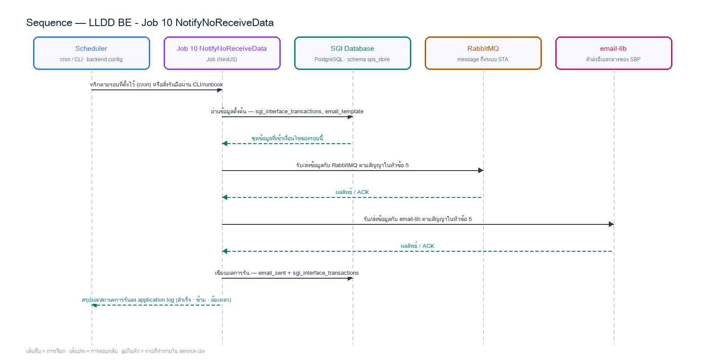

# LLDD BE - Job 10 NotifyNoReceiveData

SBP Mall - ระบบประกันรายได้ | Low Level Design Document

## 1. Overview

| รายการ | รายละเอียด |
| --- | --- |
| Track | BE |
| Estimate | **8 ชั่วโมง** = implementation 6 + unit test 2 (30%) |
| Owner | Aphiwit &lt;Bank&gt; Khammoon |
| Target repository | **`SBP/srm-sps-spsap-sop-sgi-batch`** (NestJS 11 + TypeORM · schema `sps_store` · **มติ 2026-09-02 — ย้ายมาจาก store-backend**) — batch runner ของ SBP ที่รันอยู่แล้ว 42 job บน **AWS Batch** · ลงทะเบียน job ใน `src/main.ts` แล้วรับ argument ผ่าน `JOB_NAME`/`INPUT` (local) หรือ `argv[3]`/`argv[2]` (AWS Batch) · **ไม่ผ่าน BFF และไม่เปิด HTTP** · ตารางเวลาเป็น AWS Batch scheduled event ไม่ใช่ `@Cron` · ดู `SBP/srm-sps-spsap-sop-sgi-batch.md` |
| Objective | Watchdog เฝ้าระวังข้อความขาออกที่ค้างส่ง: งาน safety net ตรวจ sgi_interface_transactions หาข้อความขาออกที่ยังไม่ได้ publisher confirm จาก RabbitMQ เกิน 1 วัน; ส่งอีเมล UTF-8 ผ่าน email-lib กลาง (sendEmail) — มติ 2026-09-08 (ข้อ 2.13) เปลี่ยนเกณฑ์จาก ACK ระดับธุรกิจเป็น publisher confirm เพราะสเปก STA ไม่มี ACK แบบ HTTP (เส้น POST /sgi/interface/sta/ack ถูกตัด) |

Common contract reference: ทุกหัวข้อ API/FE ต้องยึด LLDD-BE-API-Common-Contracts และ LLDD-FE-Integration-Contracts สำหรับ error/auth/format/pagination/action/RBAC ก่อนลงรายละเอียดเฉพาะหน้าหรือเฉพาะ endpoint

### 1.1 เอกสาร LLDD ที่เกี่ยวข้อง

ตารางนี้สร้างจาก endpoint และตารางที่เอกสารฉบับนี้ประกาศไว้จริง — อ่านฉบับที่อยู่ในตารางก่อนลงมือ เพื่อไม่ให้สัญญา request/response หรือชื่อคอลัมน์หลุดจากกัน

| ความสัมพันธ์ | เอกสาร LLDD | เกี่ยวข้องตรงไหน |
| --- | --- | --- |
| สัญญากลาง | **LLDD-BE-API-Common-Contracts** | envelope `{success,data}` · error code · pagination · รูปแบบวันที่/เลขเอกสาร |
| โครงสร้างข้อมูล | **LLDD-BE-Database-Structure** | DDL ของตารางที่หัวข้อ Reference DB Mapping อ้างถึง |
| แพลตฟอร์มระบบเดิม | **LLDD-BE-Integration-SBP-Platform** | header จาก BFF (`x-api-key` / `x-user-*`) · การ reuse ตารางและ service ของระบบ SBP เดิม |
| ต้องจบก่อน (ลำดับงาน) | **LLDD-BE-API-Common-Contracts** | เป็นฉบับต้นทางของสัญญา/โครงที่ฉบับนี้อ้าง |
| ต้องจบก่อน (ลำดับงาน) | **LLDD-BE-Job-6-ExportImpactStoreToFS** | เป็นฉบับต้นทางของสัญญา/โครงที่ฉบับนี้อ้าง |

## 2. Screen / Functional Scope

- Main class/script: fgi.main.NotifyNoReceiveData / FGI_NotifyNoReceiveData.sh
- Phase: E
- Output: อีเมลเตือน UTF-8 + หน้ารายการค้างส่ง (pending-ack)
- Estimate: 6 ชั่วโมง
- Argument รับผ่าน `INPUT` (JSON) — local ใช้ env `JOB_NAME`/`INPUT` · AWS Batch ใช้ `argv[3]`/`argv[2]` · ดูหัวข้อ 5.95 · ไม่มีตาราง job_configs และไม่มีหน้าจอควบคุม (หน้า Flow Batch Job ในกลุ่มเมนู Flow เหลือแค่ Flowchart + Database ที่ใช้ · 2026-08-06)
- ตารางเวลาตั้งที่ **AWS Batch scheduled event** (repo ไม่มี `@Cron`) — **ยกเว้น job ที่เป็น event-driven (ดูหัวข้อ Config Schema ของ job นั้น) ซึ่งห้ามตั้ง schedule** · ทุก job ถูกบันทึกลง `integration_log` โดย `main.ts` อัตโนมัติ + structured log `BATCH_START`/`BATCH_END` พร้อม `runId`

## 3. Screenshot Reference

ไม่มีภาพหน้าจอสำหรับหัวข้อนี้ — เป็นเอกสารฝั่ง Backend/Batch ที่ไม่มี UI (ภาพหน้าจอทั้งหมดอยู่ในเอกสารชุด FE)

## 4. Implementation Flow & Sequence Diagram (Reference)

### 4.1 Implementation Flow (ลำดับขั้นการทำงาน)


_รูปที่ 1: Implementation flow reference: LLDD BE - Job 10 NotifyNoReceiveData_

### 4.2 Sequence Diagram (ใครคุยกับใคร ลำดับไหน)

ผู้แสดงและลำดับข้อความในภาพนี้สร้างจาก endpoint ในหัวข้อ 7 และตารางในหัวข้อ Reference DB Mapping ของเอกสารฉบับนี้เอง จึงตรงกับสัญญาเสมอ



_รูปที่ 2: Sequence diagram: LLDD BE - Job 10 NotifyNoReceiveData_

## 5. Field, Format, and Validation

| Field / UI | Format | Validation | Behavior |
| --- | --- | --- | --- |
| กำหนดการรัน (Cron) | 0 07 * * * | แก้ไขได้ | ทุกวัน 07:00; เป็น safety net ของ outbox publisher |
| Pending threshold | >= 1 วัน | แก้ไขได้ | เตือนเมื่อ outbox_status ยังไม่เป็น CONFIRMED หลังครบ threshold |
| ขอบเขตที่เฝ้าดู | direction = OUT · data_name = COMPENSATE_INIT_I, COMPENSATE_APPROVE_I | ค่าคงที่/แก้ผ่านหน้าจอไม่ได้ | เฉพาะฝั่ง STA - ไม่เฝ้า dataset ของ BPM |
| Encoding | UTF-8 | ค่าคงที่/แก้ผ่านหน้าจอไม่ได้ | แทน TIS-620 เดิมตาม email-lib กลาง (sendEmail) |

### 5.9 Input / Progress / Output Contract

| Stage | Contract for implementation |
| --- | --- |
| Input | FGI_CONFIRM_RECEIVE_DATA rows without return_code after the waiting threshold. |
| Progress | query missing receive data, group by data_name/direction (To-Be — เดิม Oracle ใช้ interface_type), build notification message, send admin mail, close run. |
| Output | Notification sent for overdue receive confirmations; run status records grouped counts or no-data success. |

### 5.90 Job 10 Execution Stages

query missing receive data, group by data_name/direction (To-Be — เดิม Oracle ใช้ interface_type), build notification message, send admin mail, close run.

| Order | Service step | Repository | Output / failure contract |
| --- | --- | --- | --- |
| 1 | loadOverdueAcknowledgements | pendingAckRepository | คืน metrics และ throw typed error; transaction/rerun ใช้ contract ด้านล่าง |
| 2 | reserveNotificationMarkers | pendingAckRepository | คืน metrics และ throw typed error; transaction/rerun ใช้ contract ด้านล่าง |
| 3 | sendPendingAckDigest | pendingAckRepository | คืน metrics และ throw typed error; transaction/rerun ใช้ contract ด้านล่าง |
| 4 | closeNotificationMarkers | pendingAckRepository | คืน metrics และ throw typed error; transaction/rerun ใช้ contract ด้านล่าง |

### 5.91 Job 10 Run Evidence

| Evidence | Job-specific value | Acceptance |
| --- | --- | --- |
| Input identity | FGI_CONFIRM_RECEIVE_DATA rows without return_code after the waiting threshold. | snapshot input file/business key/period in run record |
| Output identity | Notification sent for overdue receive confirmations; run status records grouped counts or no-data success. | reconcile input, success, reject and skipped counts |
| Dedup proof | คอลัมน์ last_ack_notified_on บน sgi_interface_transactions เป็น marker ต่อรายการต่อวัน; rerun วันเดียวกันไม่ส่งอีเมลซ้ำ (ย้ายมาจาก audit_logs ที่ถูกยกเลิก 2026-08-07) | rerun fixture produces no duplicate target business key |
| Transaction proof | อ่าน pending แบบ read-only (ไม่แตะ outbox_status — Job 6 เป็นผู้เขียน `outbox_status = 'CONFIRMED'` + `status = 'COMPLETED'` เมื่อได้ publisher confirm); reserve notification marker ก่อนส่ง; ส่งอีเมลล้มเหลวจึง mark FAILED และ retry ด้วย marker เดิม | injected failure leaves no partial committed state outside documented boundary |
| Security proof | SGI เรียก sendEmail() ของ email-lib เอง (ปิด DP-5 · 2026-08-14) — เลข template มาจาก workflow_route.email_id · credential SMTP/SES และตาราง email_template/email_sent เป็นของระบบ SBP เดิม | config/log/error contains no plaintext secret |

### 5.92 Legacy Java Source Reference

| Legacy file | Line range | Responsibility to carry forward |
| --- | --- | --- |
| fcsJar/src/th/co/gosoft/fgi/main/NotifyNoReceiveData.java | 16-37 | Legacy main entrypoint for missing-receive notification. |
| fcsJar/src/th/co/gosoft/fgi/controller/ManageCompensateController.java | 748-775 | Build and send notification content for missing receive data. |
| fcsJar/src/th/co/gosoft/fgi/dao/jdbc/ExportJdbc.java | 1894-1917 | Query confirm-receive rows without return_code. |

Line ranges refer to the legacy Java implementation under `batchjob/fcsJar/` (path นับจากราก `sbp-prototype/`). Use these ranges to preserve business behavior while implementing the target Node job.

### 5.93 Target Repository and SQL Contract

| Contract | Target implementation |
| --- | --- |
| Repository | pendingAckRepository |
| Idempotency / dedup | คอลัมน์ last_ack_notified_on บน sgi_interface_transactions เป็น marker ต่อรายการต่อวัน; rerun วันเดียวกันไม่ส่งอีเมลซ้ำ (ย้ายมาจาก audit_logs ที่ถูกยกเลิก 2026-08-07) |
| Transaction boundary | อ่าน pending แบบ read-only (ไม่แตะ outbox_status — Job 6 เป็นผู้เขียน `outbox_status = 'CONFIRMED'` + `status = 'COMPLETED'` เมื่อได้ publisher confirm); reserve notification marker ก่อนส่ง; ส่งอีเมลล้มเหลวจึง mark FAILED และ retry ด้วย marker เดิม |
| Security | SGI เรียก sendEmail() ของ email-lib เอง (ปิด DP-5 · 2026-08-14) — เลข template มาจาก workflow_route.email_id · credential SMTP/SES และตาราง email_template/email_sent เป็นของระบบ SBP เดิม |

#### Input / candidate query

```sql
-- bind ตามลำดับ: $1=threshold_hours
-- มติ 2026-09-08 (ข้อ 2.13): "ค้าง" = broker ยังไม่ publisher confirm ไม่ใช่ "STA ยังไม่ ACK"
-- สเปก STA มีแค่ 3 ข้อความบน RabbitMQ ไม่มีช่องทาง ACK กลับมา จึงไม่รอ ACK ระดับธุรกิจ
SELECT id, data_name, business_key, file_name, sent_at
FROM sgi_interface_transactions
WHERE direction = 'OUT'
  AND (outbox_status IS NULL OR outbox_status <> 'CONFIRMED')
  AND created_at < CURRENT_TIMESTAMP - ($1 /* threshold_hours */ * INTERVAL '1 hour')
  AND (last_ack_notified_on IS NULL OR last_ack_notified_on < CURRENT_DATE)
ORDER BY created_at;
```

#### Write / upsert query

```sql
-- bind ตามลำดับ: $1=transaction_ids
-- ยกเลิกตาราง audit_logs แล้ว (2026-08-07) — marker กันส่งซ้ำย้ายมาไว้บน sgi_interface_transactions เอง
-- คอลัมน์ last_ack_notified_on DATE มีอยู่ใน DDL ของ sgi_interface_transactions แล้ว (ดู LLDD-Database 5.x)
UPDATE sgi_interface_transactions
   SET last_ack_notified_on = CURRENT_DATE
 WHERE id = ANY($1 /* transaction_ids */)
   AND (last_ack_notified_on IS NULL OR last_ack_notified_on < CURRENT_DATE)
RETURNING id;
```

### 5.94 Target Node Implementation

โครงสร้างนี้ระบุ service/repository เฉพาะงานและต้อง implement ตาม SQL, transaction, idempotency และ security contract ด้านบน โดยทุกขั้นต้องคืน metrics สำหรับ reconcile และ run history

```js
export async function runLlddBeJob10Notifynoreceivedata(ctx, services) {
  const run = await services.jobRuns.acquire({
    jobNo: "10", period: ctx.period, triggeredBy: ctx.triggeredBy
  });

  try {
    ctx = { ...ctx, runId: run.id, repository: services.pendingAckRepository };
    const step1 = await services.loadOverdueAcknowledgements(ctx, undefined);
    const step2 = await services.reserveNotificationMarkers(ctx, step1);
    const step3 = await services.sendPendingAckDigest(ctx, step2);
    const step4 = await services.closeNotificationMarkers(ctx, step3);
    const result = step4;
    await services.jobRuns.finish(run.id, "SUCCESS", result.metrics);
    return { runId: run.id, status: "SUCCESS", ...result };
  } catch (error) {
    await services.jobRuns.finish(run.id, "FAILED", {
      errorCode: error.code ?? "JOB_FAILED",
      errorMessage: error.message
    });
    throw error;
  }
}
```

### 5.95 การลงทะเบียน job และ Arguments (sop-sgi-batch)

งานนี้ลงทะเบียนเป็น job ชื่อ **`sgi-notify-no-receive-data`** ใน `src/main.ts` ของ `SBP/srm-sps-spsap-sop-sgi-batch` โดยใช้ dispatcher เดิมของ repo (ไม่สร้าง runner ใหม่) — `main.ts` อ่านชื่อ job และ input มา 2 ทาง แล้วเลือกอัตโนมัติจากการมี `argv[3]` หรือไม่

| ช่องทางรัน | ชื่อ job มาจาก | input มาจาก | ตัวอย่าง |
| --- | --- | --- | --- |
| Local / CLI / runbook | env `JOB_NAME` | env `INPUT` (JSON string) | `JOB_NAME=sgi-notify-no-receive-data INPUT='{"asOfDate":"2026-06-16","ageDays":1}' npm run start` |
| AWS Batch (ตารางเวลาจริง) | `process.argv[3]` | `process.argv[2]` (JSON string) | `node dist/main.js '{"asOfDate":"2026-06-16","ageDays":1}' sgi-notify-no-receive-data` |

**ตารางเวลาไม่ได้อยู่ในโค้ด** — repo นี้ไม่มี `@Cron`/`@Interval` แม้แต่จุดเดียว (แม้ติดตั้ง `@nestjs/schedule` ไว้) cron ในหัวข้อ 5 เป็น **นิยามของ AWS Batch scheduled event** ที่ต้องตั้งตอน deploy ไม่ใช่ค่าที่อ่านจาก config file

#### Argument ที่รับได้ (`INPUT` เป็น JSON object · ไม่ส่ง = `{}`)

**ระบบเดิมรับ argument แบบนี้:** **ไม่รับ args**  
ของใหม่เปลี่ยนจาก positional string เป็น JSON เพื่อให้เพิ่มฟิลด์ได้โดยไม่พังของเดิม แต่ **ต้องรองรับทุกอย่างที่ระบบเดิมรับได้เป็นอย่างน้อย** — ห้ามลดความสามารถลง

| Field | ชนิด | ไม่ส่งแล้วได้อะไร (default) | Validation | ตรงกับ argument เดิม |
| --- | --- | --- | --- | --- |
| `asOfDate` | string | วันนี้ | `YYYY-MM-DD` | **ของใหม่** — ใช้ทดสอบ/ย้อนหลัง |
| `ageDays` | number | `1` | จำนวนเต็ม ≥ 1 | **ของใหม่** — เดิม hardcode 1 วัน |
| `dryRun` | boolean | `false` | `true` = อ่าน/คำนวณครบแต่ไม่ commit และไม่ publish/ไม่ส่งไฟล์ | **ของกลาง** ทุก job |
| `limit` | number | `null` | จำกัดจำนวนรายการที่ประมวลผลรอบนี้ (ใช้ตอน smoke test) | **ของกลาง** ทุก job |

**กติกาการ validate ที่ทุก job ต้องทำเหมือนกัน** — parse `INPUT` ไม่สำเร็จ หรือฟิลด์ไม่ผ่าน validation ให้ log `BATCH_END` ด้วย `batchStatus: 'FAILED'` แล้ว `exit(1)` **ก่อนแตะฐานข้อมูล** (ห้าม fallback ไปค่า default เงียบ ๆ เมื่อผู้ใช้ตั้งใจส่งค่ามาแล้วผิด) · ฟิลด์ที่ไม่รู้จักให้ log warn แล้วข้าม ไม่ทำให้ job ล้ม

- เปลี่ยน `ageDays` ไม่ล้าง marker `last_ack_notified_on` — รันซ้ำวันเดียวกันยังไม่ส่งเมลซ้ำ

### 5.96 เงื่อนไขตัดสิน (Decision Rules) — ตัดสินจากอะไร

Job 10 เป็น watchdog ของ **ข้อความขาออกที่ยังไม่ถึงปลายทาง** — 🔴 **มติ 2026-09-08 (ข้อ 2.13) เปลี่ยนนิยามจาก "ACK ระดับธุรกิจ" เป็น "publisher confirm ของ RabbitMQ"** เพราะสเปกของทีม STA มีแค่ 3 ข้อความบน RabbitMQ **ไม่มี ACK แบบ HTTP** — เส้น `POST /sgi/interface/sta/ack` จึงถูกตัดทิ้ง · เงื่อนไขที่ต้องชัดมี 2 ข้อ: "แถวไหนเรียกว่าค้าง" และ "อะไรกันไม่ให้ส่งอีเมลซ้ำ" · ⚠️ **อย่าสับสนกับงานเตือน/escalation ของเอกสารค้างพิจารณา** ซึ่งเป็นคนละงาน และมีเอกสารของตัวเองแล้วคือ **LLDD-BE-Job-12-NotifyPendingWork** (สร้าง 2026-09-02 · ปิดช่องว่าง G6) — Job 10 ดู **ข้อความ interface ที่ยังไม่ออกจากระบบเรา** ส่วน Job 12 ดู **เอกสารที่ค้างรอคนกดใน workflow**

| คำถามที่โค้ดต้องตอบ | ตัดสินจาก (ตาราง · คอลัมน์) | เงื่อนไขที่ต้องเป็นจริง | ไม่เข้าเงื่อนไขแล้วทำอะไร |
| --- | --- | --- | --- |
| แถวนี้นับว่า **ค้างส่ง** หรือไม่ | `sgi_interface_transactions` — `direction` · `outbox_status` · `data_name` · `created_at` | `direction = 'OUT'` **และ** `outbox_status` ยังไม่เป็น `CONFIRMED` **และ** สร้างมาแล้วเก่ากว่า `asOfDate - ageDays` (ค่าตั้งต้น 1 วัน) | ขาเข้า (`IN`) และการส่งต่อภายใน (`INTERNAL`) **ไม่นับ** · 🔴 **มติ 2026-09-08:** เกณฑ์คือ **publisher confirm ของ broker** (RabbitMQ ตอบว่ารับข้อความแล้ว) ไม่ใช่การรอ ACK จากระบบ STA — เพราะสเปก STA ไม่มีช่องทาง ACK กลับมา · Job 6 ต้องตั้ง `outbox_status = 'CONFIRMED'` **เฉพาะเมื่อได้ confirm จาก broker เท่านั้น** |
| ส่งอีเมลซ้ำหรือยัง (วันนี้) | `sgi_interface_transactions.last_ack_notified_on` (ชื่อคอลัมน์คงเดิม — ความหมายคือ "วันที่แจ้งเตือนล่าสุด") | `last_ack_notified_on` = วันที่ของ `asOfDate` แล้ว → เคยแจ้งไปแล้ววันนี้ → ข้าม | อัปเดต marker **หลังส่งอีเมลสำเร็จเท่านั้น** — marker นี้ย้ายมาจาก `audit_logs` ที่ถูกยกเลิก 2026-08-07 |

#### ช่องว่างที่เคยค้างของหัวข้อนี้ — ปิดครบแล้ว (เก็บไว้เป็นประวัติ)

ทุกข้อปิดแล้ว — เก็บตารางไว้เพื่อให้ตามรอยได้ว่าเคยค้างอะไรและปิดด้วยอะไร

| # | สิ่งที่ขาด | ต้องทำอะไรก่อน |
| --- | --- | --- |
| **G6** ✅ ปิดแล้ว 2026-09-02 | **งานเตือนงานค้าง + escalation 30/45/60 วัน** เดิมไม่มีเอกสารและไม่มีชั่วโมง — ตอนนี้แยกเป็นเอกสารของตัวเองแล้ว: **`LLDD-BE-Job-12-NotifyPendingWork`** (13 ชั่วโมง · เจ้าของ Aphiwit &lt;Bank&gt; Khammoon) ครอบคลุม `SendMailReport.java` / `MailReportService.java` ของระบบเดิมครบ · ข้อค้างที่เหลือย้ายไปอยู่ในเอกสารฉบับนั้นแล้ว (G7 = วันที่ พ.ศ. ในอีเมล · G8 = ไม่มี marker กันส่งซ้ำ) | ดู **LLDD-BE-Job-12-NotifyPendingWork** หัวข้อ 5.96 |

#### ค่าคงที่และโดเมนที่ใช้ในเงื่อนไขข้างบน

ทุกค่าในตารางนี้ต้องอ่านจาก config/env ไม่ hardcode ในคิวรี — แต่ **ค่าตั้งต้นต้องเท่าระบบเดิมทุกตัว** ไม่งั้นผลลัพธ์จะไม่ตรงกันตอนเทียบ UAT

| ค่า | โดเมน / ค่าที่ระบบเดิมใช้ | ที่มา |
| --- | --- | --- |
| ค่าตั้งต้น `ageDays` | 1 วัน | ระบบเดิมคัดรายการที่ยังไม่มี `return_code` |
| สัญญาณที่ถือว่า "ส่งถึงแล้ว" | **publisher confirm ของ RabbitMQ** (`channel.waitForConfirms()` / `amqp-connection-manager` callback) | 🔴 มติ 2026-09-08 — สเปก STA มีแค่ 3 ข้อความบน MQ **ไม่มี ACK แบบ HTTP** เส้น `POST /sgi/interface/sta/ack` จึงถูกตัด · ไม่มีการรอ ACK ระดับธุรกิจอีกต่อไป |
| `direction` | `OUT` = ส่งออกไประบบภายนอก · `IN` = รับกลับ · `INTERNAL` = ส่งต่อภายในระบบ (Jobs 7/8/9) | คอมเมนต์ใน DDL |

## 6. Button / User Action Mapping

| Action | Trigger | API / Service | Expected Result |
| --- | --- | --- | --- |
| รันตามตารางเวลา | CRON | scheduler → runner (job 10) | อ่าน cron/พารามิเตอร์จาก backend config |
| รันนอกรอบ (manual/rerun) | CLI | CLI/ops runbook → runner (job 10) | guard ไม่ให้รันซ้อนด้วย distributed lock |
| แก้พารามิเตอร์/เปิด-ปิด job | CONFIG | แก้ backend config แล้ว deploy | ไม่มี endpoint และไม่มีหน้าจอควบคุม — หน้า Flow Batch Job เป็น reference อย่างเดียว (2026-08-06) |
| ตรวจผลการรัน | LOG | application log (structured) | ไม่มีตาราง job_run_histories แล้ว · ผลการรับส่งไฟล์/ข้อความดูที่ sgi_interface_transactions |

## 7. API Contract

**เอกสารฉบับนี้ไม่มี endpoint ของตัวเอง** — เป็นสัญญา/งานภายในที่เอกสารอื่นเรียกใช้ (ดูขอบเขตใน 5.90 Endpoint Implementation Contract) · รายการ endpoint ทั้ง 28 เส้นของ SGI อยู่ที่ **LLDD-API** และ `api.md`

## 8. Reference DB Mapping (No Database Page Work)

ส่วนนี้เป็นข้อมูลอ้างอิงสำหรับการ implement API/Job เท่านั้น ไม่ใช่งานสร้างหน้า Database, ไม่ใช่งานออกแบบ DB page และไม่ถูกนับเป็น deliverable แยกของ FE/BE

| Table / Object | R/W | Usage |
| --- | --- | --- |
| sgi_interface_transactions | R | แถวขาออกที่ยังไม่ CONFIRMED และสถานะล่าสุด |
| email_template (ระบบ SBP เดิม) | R | template EM-08 watchdog ค้างส่ง — อ่านอย่างเดียว |
| email_sent (ระบบ SBP เดิม) | W (โดย @gosoft-sbp/email-lib) | lib เขียน log ให้เอง · SGI ไม่ INSERT เอง |
| (backend config) | R | ผู้รับอีเมลของ job นี้ (EM-08 watchdog) — กำหนดใน config file/env |

## 9. Skeleton Code (Batch Job 10)

### 9.1 ผังไฟล์ที่ต้องสร้าง (Job 10) — บน `srm-sps-spsap-sop-sgi-batch`

โครงไฟล์ของ Job 10 (fgi.main.NotifyNoReceiveData เดิม) วางใต้ `src/modules/sgi/` ตาม convention ที่ repo นี้ใช้อยู่จริง (ดูตัวอย่างที่ `src/modules/performance/import-qssi.service.ts`): service ถือ logic ทั้งหมด, inject `DataSource`/repository ผ่าน TypeORM, ยิง raw SQL ได้ตรง, และ **ไม่มี controller** เพราะ repo นี้ไม่เปิด HTTP

**สิ่งที่ reuse ได้ทันที ไม่ต้องเขียนใหม่** — ต่างจากแผนเดิมที่ตั้งไว้บน store-backend ซึ่งต้องสร้าง runner ทั้งชุดเอง: `src/main.ts` (dispatcher + `BATCH_START`/`BATCH_END` + `runId` + log ลง `integration_log` อัตโนมัติ) · `src/modules/rabbitMQ/rabbitmq.service.ts` (`publishMessage`) · `src/shared/services/s3.service.ts` · `StatementService.decodeThaiFileContent()` (WINDOWS-874 auto-detect) · `@gosoft-sbp/email-lib` · `@srm/glb-log`

⚠️ **สิ่งที่ repo นี้ยังไม่มี และเป็นงานตั้งต้นจริง**: (1) ไม่มี `@Cron` เลย — ตารางเวลาต้องตั้งเป็น **AWS Batch scheduled event** (2) ไม่มี distributed lock (`pg_try_advisory_lock`) — การกันรันซ้อนพึ่ง AWS Batch queue ถ้างานไหนรับความเสี่ยงนี้ไม่ได้ต้องเพิ่มเอง (3) `publishMessage` เป็น fire-and-forget **ไม่มี publisher confirm และไม่มี outbox** — งานที่ต้องการ **transactional outbox + publisher confirm** (Job 6 · และ `sgi_reflow` ฝั่ง BE) ต้องสร้างกลไกเพิ่มเอง ไม่ใช่ reuse ได้เลย · ⚠️ ไม่มี ACK ระดับธุรกิจให้รอ (มติ 2026-09-08 ข้อ 2.13) (4) ยังไม่มี entity/ตาราง `sgi_*` แม้แต่ตัวเดียว

| Path | หน้าที่ |
| --- | --- |
| src/modules/sgi/job-10-notify-no-receive-data.service.ts | คลาส `NotifyNoReceiveDataService` — **`execute(input)` เป็น entry point เดียว** เรียงตาม flow ของ Job 10 ทีละขั้น ครอบ transaction เอง และจบด้วย structured log สรุป metrics (แบบเดียวกับ `ImportQssiService.execute(body)` ที่มีอยู่) |
| src/modules/sgi/job-10-notify-no-receive-data.service.spec.ts | unit test ของ service — repo นี้วาง spec ไว้ข้างไฟล์จริงเสมอ (`jest` + `npm run test:ci` มี coverage/SonarQube) |
| src/modules/sgi/dto/job-10-notify-no-receive-data-input.dto.ts | DTO ของ `INPUT` (JSON) พร้อม `class-validator` ตามตารางในหัวข้อ 9.2 — parse ไม่ผ่านต้อง fail ก่อนแตะ DB |
| src/modules/sgi/sgi.module.ts | NestJS module ของกลุ่มงานประกันรายได้ — ผูก service ทุกตัวของ SGI เข้ากับ `TypeOrmModule` (ไฟล์ร่วมของทุก job ให้ merge ไม่ใช่เขียนทับ) |
| src/main.ts | **เพิ่ม `case 'sgi-notify-no-receive-data':`** ในสวิตช์เดิม → `await import('./modules/sgi/job-10-notify-no-receive-data.service')` แล้ว `app.get(NotifyNoReceiveDataService).execute(input)` (ไฟล์กลางของทุก job — เป็นจุด merge conflict ที่ต้องระวัง) |
| src/entities/sgi-*.entity.ts | entity ของตาราง `sgi_*` ที่หัวข้อ Reference DB Mapping อ้างถึง — **ยังไม่มีใน repo เลยสักตัว** ต้องสร้างใหม่ทั้งหมด |
| src/config/config.ts | เพิ่ม `export const sgiJob10Config` ตามแบบของไฟล์นี้ (โปรเจกต์ไม่ใช้ `registerAs`) — ค่าคงที่ทางธุรกิจของ Job 10 |

#### การลงทะเบียนใน `src/main.ts` (job `sgi-notify-no-receive-data`)

```js
// src/main.ts — เพิ่มเคสนี้ในสวิตช์เดิม (เรียงต่อจาก job ของ SGI ตัวก่อนหน้า)
      case 'sgi-notify-no-receive-data': {
        const { NotifyNoReceiveDataService } = await import('./modules/sgi/job-10-notify-no-receive-data.service');
        const job10notifynoreceivedataService = app.get(NotifyNoReceiveDataService);
        await job10notifynoreceivedataService.execute(input);   // input = JSON ที่ parse จาก INPUT/argv[2] แล้ว
        break;
      }
```

`main.ts` เรียก `StatementService.logInterfest('sgi-notify-no-receive-data', input)` ให้อยู่แล้วก่อนเข้าสวิตช์ → **ไม่ต้องเขียน log ลง `integration_log` เองซ้ำ** · และ `BATCH_END` ที่ท้ายไฟล์จะสรุป `batchStatus` + `durationMs` ให้อัตโนมัติ หน้าที่ของ service คือ throw เมื่อทำงานไม่สำเร็จเท่านั้น

### 9.2 Config Schema ของ Job 10 (backend config / env)

ตารางเวลาของ Job 10 คือ `0 07 * * *` (ทุกวัน 07:00) — ⚠️ **ตัวจริงตั้งที่ AWS Batch scheduled event ไม่ใช่ในโค้ด** (repo นี้ไม่มี `@Cron` เลย) ค่า `SGI_JOB10_CRON` เก็บไว้เป็นเอกสารประกอบ/ตรวจสอบเท่านั้น · `SGI_JOB10_ENABLED=false` ให้ `execute()` จบทันทีแบบ SUCCESS พร้อม log เหตุผล (กันกรณี AWS Batch ยังยิงเข้ามา)

```ts
// src/config/config.ts — เพิ่มบล็อกนี้ต่อท้าย (repo ใช้ export const ไม่ใช้ registerAs)
// convention จริงของ sop-sgi-batch คือ `export const` ใน `src/config/config.ts` (ไม่ใช้ registerAs · ดูของเดิมที่
// `AppConfigModule` แบบ @Global แล้วอ่าน process.env ตรง ๆ) — โปรเจกต์นี้ **ไม่ได้ใช้ registerAs**
// แม้แต่จุดเดียว จึงประกาศเป็นคลาสให้รีวิว/ทดสอบเหมือน config ตัวอื่น
import { Injectable } from '@nestjs/common';

// TODO: Job 10 ไม่มีตาราง job_configs และไม่มี Job Admin API แล้ว (ตัดสินใจ 2026-08-06)
// TODO: ค่าทุกตัวอ่านจาก env/config file ของ backend เท่านั้น — เปลี่ยนค่า = แก้ config แล้ว deploy
export interface Job10Config {
  /** เปิด/ปิด job รอบถัดไปโดยไม่ต้อง deploy โค้ด */
  enabled: boolean;
  /** ตารางเวลาของ job นี้ — บันทึกไว้เพื่ออ้างอิงเท่านั้น ตัวจริงตั้งที่ AWS Batch scheduled event */
  cron: string;
  /** Pending threshold — เตือนเมื่อ outbox_status ยังไม่เป็น CONFIRMED หลังครบ threshold */
  pendingThreshold: string;
  /** ขอบเขตที่เฝ้าดู — เฉพาะฝั่ง STA - ไม่เฝ้า dataset ของ BPM */
  param3: string;
  /** Encoding — แทน TIS-620 เดิมตาม email-lib กลาง (sendEmail) */
  encoding: string;
  /** ผู้รับอีเมลเมื่อ job ล้มเหลว — เก็บเป็น string คั่น comma ให้ตรง signature ของ
      `EmailLibService.sendMail({ mailTo })` ที่รับ string ไม่ใช่ string[] */
  mailTo: string;
}

@Injectable()
export class SgiJob10Config implements Job10Config {
  // TODO: ยืนยันค่า default ทุกตัวกับ Ops ก่อนขึ้น production (ไม่มีหน้าจอแก้ค่าแล้ว)
  enabled = (process.env.SGI_JOB10_ENABLED ?? 'true') === 'true';
  cron = process.env.SGI_JOB10_CRON ?? '0 07 * * *';
  pendingThreshold = process.env.SGI_JOB10_PENDING_THRESHOLD ?? '>= 1 วัน'; // TODO: แก้ผ่าน env/config file แล้ว deploy
  param3 = process.env.SGI_JOB10_PARAM3 ?? 'direction = OUT · data_name = COMPENSATE_INIT_I, COMPENSATE_APPROVE_I'; // TODO: ค่าคงที่ทางธุรกิจ — เปลี่ยนต้องผ่านการอนุมัติ
  encoding = process.env.SGI_JOB10_ENCODING ?? 'UTF-8'; // TODO: ค่าคงที่ทางธุรกิจ — เปลี่ยนต้องผ่านการอนุมัติ
  mailTo = process.env.SGI_JOB10_MAIL_TO ?? ''; // TODO: ผู้รับอีเมลแจ้ง error คั่นด้วย comma (เดิม: email-lib (sendEmail · UTF-8))
}

// TODO: เพิ่ม SgiJob10Config ใน providers/exports ของ AppConfigModule (@Global) เหมือน AppConfig
```

### 9.3 Job Class — `run(ctx)` ของ Job 10 ทีละขั้นตามผัง

#### 9.3.1 สัญญาของชั้นกลาง (`runner.ts`) + โครง service ของ Job 10

service อ้าง `JobRunContext` / `JobRunResult` / `JobState` / `JobFailedError` — ทั้งหมดนิยาม ครั้งเดียวใน `src/modules/sgi/sgi-job.types.ts` (ไฟล์ร่วมของทุก job ให้ merge ไม่ใช่เขียนทับ) และ service ต้องมี method ครบตามตารางขั้นตอนด้านล่าง มิฉะนั้น `execute(input)` จะเรียก method ที่ไม่มีอยู่

```ts
// src/modules/sgi/sgi-job.types.ts — สัญญากลางของทุก job ของ SGI (ประกาศครั้งเดียว ใช้ร่วมทั้ง 10 ฉบับ)

export interface JobRunContext {
  jobNo: string;
  period: string;        // YYYYMM ของงวดที่รัน
  triggeredBy: string;   // 'CRON' | userId ที่สั่งรันนอกรอบ
  params?: Record<string, string>;
}

export interface JobRunResult {
  event: 'job.finish';
  jobNo: string;
  jobName: string;
  status: 'SUCCESS' | 'SKIPPED' | 'SKIPPED_LOCKED' | 'FAILED';
  period: string;
  output: string;
  read: number; written: number; skipped: number; rejected: number;
  durationMs: number;
}

/** counter + ค่าที่ทุกขั้นของ job ใช้ร่วมกัน (service เป็นผู้สร้างผ่าน createState) */
export interface JobState {
  period: string;
  read: number; written: number; skipped: number; rejected: number;
  // TODO: เพิ่ม field เฉพาะของ job นี้ (เช่น rows ที่อ่านมา, path ไฟล์ที่เขียน)
  [key: string]: unknown;
}

/** error ที่ทำให้ job จบเป็น FAILED และส่งอีเมลแจ้งผู้ดูแล */
export class JobFailedError extends Error {
  constructor(public readonly code: string, message: string) { super(message); }
}

/** ใช้ออกจาก transaction เมื่อสาขา NO บอกให้ข้ามงวด/เรคคอร์ด — runner สรุปเป็น SKIPPED ไม่ใช่ FAILED */
export class JobSkippedError extends Error {}
```

```ts
// NotifyNoReceiveDataService — method ที่ job class เรียก (1 method ต่อ 1 ขั้นในตารางด้านบน)
import { Inject, Injectable } from '@nestjs/common';
import type { DataSource, EntityManager } from 'typeorm';
import type { JobRunContext, JobState } from '../../runner';
export type { JobState };

@Injectable()
export class NotifyNoReceiveDataService {
  constructor(@Inject('DATA_SOURCE') private readonly dataSource: DataSource) {}

  createState(ctx: JobRunContext): JobState {
    return { period: ctx.period, read: 0, written: 0, skipped: 0, rejected: 0 };
  }

  // อ่าน sgi_interface_transactions: direction = OUT · outbox_status != CONFIRMED · อายุ >= threshold
  async step02Publish(state: JobState, manager?: EntityManager): Promise<void> {
    throw new Error('step02Publish: ยังไม่ได้ implement — ดู SQL ที่หัวข้อ Repository / SQL และกติกาที่หัวข้อเงื่อนไขตัดสิน');
  }

  // พบรายการค้าง?
  //   เงื่อนไขจริง: ดูตารางในหัวข้อ "เงื่อนไขตัดสิน (Decision Rules)" ของเอกสารฉบับนี้
  async check03Condition(state: JobState): Promise<boolean> {
    throw new Error('check03Condition: ยังไม่ได้ implement — ห้าม deploy ทั้งที่ยังไม่เขียนเงื่อนไขจริง');
  }

  // ส่งอีเมล UTF-8 ผ่าน @gosoft-sbp/email-lib ของระบบ SBP เดิม
  async step04Notify(state: JobState, manager?: EntityManager): Promise<void> {
    throw new Error('step04Notify: ยังไม่ได้ implement — ดู SQL ที่หัวข้อ Repository / SQL และกติกาที่หัวข้อเงื่อนไขตัดสิน');
  }

  // แสดงรายการใน /sgi/interface/pending-ack
  async step05Publish(state: JobState, manager?: EntityManager): Promise<void> {
    throw new Error('step05Publish: ยังไม่ได้ implement — ดู SQL ที่หัวข้อ Repository / SQL และกติกาที่หัวข้อเงื่อนไขตัดสิน');
  }

}
```

#### 9.3.2 `run(ctx)` ของ Job 10

ทุกขั้นใน `run()` ตรงกับ flowchart ของ Job 10 หนึ่งต่อหนึ่ง (decision และ error path รวมอยู่ด้วย) — method ที่ต้อง implement ใน service ตามตารางนี้

| ลำดับ | ชนิด | ขั้นตอนจากผัง | Method ที่ต้อง implement | เส้นทาง NO / error |
| --- | --- | --- | --- | --- |
| 1 | start | เริ่ม | createState() | - |
| 2 | process | อ่าน sgi_interface_transactions: direction = OUT · outbox_status != CONFIRMED · อายุ >= threshold | step02Publish() | throw JobFailedError เมื่อทำไม่สำเร็จ |
| 3 | decision | พบรายการค้าง? | check03Condition() | [end] จบการทำงาน |
| 4 | io | ส่งอีเมล UTF-8 ผ่าน @gosoft-sbp/email-lib ของระบบ SBP เดิม | step04Notify() | throw JobFailedError เมื่อทำไม่สำเร็จ |
| 5 | process | แสดงรายการใน /sgi/interface/pending-ack | step05Publish() | throw JobFailedError เมื่อทำไม่สำเร็จ |
| 6 | end | จบ | summarize() | - |

```ts
// src/modules/sgi/job-10-notify-no-receive-data.service.ts — execute(input) เป็น entry point เดียว
import { Inject, Injectable, Logger } from '@nestjs/common';
import type { DataSource, EntityManager } from 'typeorm';
import { NotifyNoReceiveDataService, type JobState } from './job-10-notify-no-receive-data.service';
// 4 symbol นี้นิยามใน src/modules/sgi/sgi-job.types.ts (ไฟล์ร่วมของทุก job — ดูหัวข้อก่อนหน้า)
import { JobFailedError, JobSkippedError, JobRunContext, JobRunResult } from '../../runner';

@Injectable()
export class NotifyNoReceiveDataJob {
  static readonly jobNo = '10';
  private readonly logger = new Logger(NotifyNoReceiveDataJob.name);

  constructor(
    // TODO: repo นี้ตั้ง replication ใน typeorm.config.ts อยู่แล้ว — SELECT ไป slave, write ไป master อัตโนมัติ
    @Inject('DATA_SOURCE') private readonly dataSource: DataSource,
    private readonly service: NotifyNoReceiveDataService,
  ) {}

  async run(ctx: JobRunContext): Promise<JobRunResult> {
    const startedAt = Date.now();
    // TODO: state ถือ candidates ที่อ่านมา + counter (read/written/skipped/rejected/marked)
    //       และค่าจาก job10Config — ทุก counter ต้องถูกอัปเดตจาก record จริง ไม่ใช่ค่าคงที่
    const state = this.service.createState(ctx);
    try {
      // ขั้นที่ 2: อ่าน sgi_interface_transactions: direction = OUT · outbox_status != CONFIRMED · อายุ >= threshold · TODO: CONFIRMED = broker ตอบรับแล้ว (publisher confirm)
      await this.service.step02Publish(state);
      // ขั้นที่ 3 (decision): พบรายการค้าง?
      const ok03 = await this.service.check03Condition(state);
      if (!ok03) { // NO → จบการทำงาน
        return this.summarize(state, 'SKIPPED', startedAt);
      }
      // ขั้นที่ 4: ส่งอีเมล UTF-8 ผ่าน @gosoft-sbp/email-lib ของระบบ SBP เดิม · TODO: ผู้รับตาม backend config
      await this.service.step04Notify(state);
      // ขั้นที่ 5: แสดงรายการใน /sgi/interface/pending-ack · TODO: ทีมงานใช้หน้านี้ตามงานค้าง แล้วสั่ง republish จาก outbox
      await this.service.step05Publish(state);
      return this.summarize(state, 'SUCCESS', startedAt);
    } catch (error) {
      // TODO: error path ของ Job 10 — ห้ามกลับไปใช้ TIS-620/hardcoded recipient; ห้ามตีความว่ารอ ACK จาก STA — สเปก STA ไม่มี ACK
      this.logger.error(JSON.stringify({ event: 'job.failed', jobNo: '10', period: ctx.period,
        triggeredBy: ctx.triggeredBy, durationMs: Date.now() - startedAt, error: (error as Error).message }));
      // TODO: แจ้งผู้ดูแลผ่าน JobFailureNotifier (หัวข้อ 9.6.1) — runner เป็นผู้เรียกให้
      throw error;
    }
  }

  private summarize(state: JobState, status: JobRunResult['status'], startedAt = Date.now()): JobRunResult {
    // TODO: structured log บรรทัดเดียวจบ — ไม่มีตาราง job_run_histories แล้ว (2026-08-06)
    const summary = {
      event: 'job.finish', jobNo: '10', jobName: 'NotifyNoReceiveData', status,
      period: state.period, output: 'อีเมลเตือน UTF-8 + หน้ารายการค้างส่ง (pending-ack)',
      read: state.read, written: state.written, skipped: state.skipped,
      rejected: state.rejected, durationMs: Date.now() - startedAt,
    };
    this.logger.log(JSON.stringify(summary));
    return summary as JobRunResult;
  }
}
```

### 9.4 การกันรันซ้อนของ Job 10 (PostgreSQL advisory lock — **ของใหม่**)

Job 10 มีข้อควรระวังจาก legacy: ห้ามกลับไปใช้ TIS-620/hardcoded recipient; ห้ามตีความว่ารอ ACK จาก STA — สเปก STA ไม่มี ACK — runner ล็อกด้วย `pg_try_advisory_lock` ก่อนเริ่มขั้นแรกเสมอ และรอบที่ล็อกไม่ได้ให้จบด้วยสถานะ SKIPPED_LOCKED (ไม่ใช่ FAILED)

```ts
// src/modules/sgi/sgi-job.lock.ts (ของใหม่ — repo นี้ยังไม่มีกลไกกันรันซ้อนใด ๆ)
import { Inject, Injectable, Logger } from '@nestjs/common';
import type { DataSource } from 'typeorm';

// TODO: ห้ามใช้แถวสถานะ RUNNING ในตารางเป็นตัวกัน (ไม่มีตาราง job_run_histories แล้ว)
//       ใช้ PostgreSQL advisory lock ระดับ session แทน — ปลดอัตโนมัติเมื่อ connection หลุด
export const SGI_JOB_LOCK_CLASS_ID = 861000; // namespace ของระบบ SGI
export const JOB_LOCK_KEYS: Record<string, number> = { '10': 100 /* TODO: เพิ่มให้ครบทุก job */ };

@Injectable()
export class BatchRunner {
  private readonly logger = new Logger(BatchRunner.name);
  constructor(@Inject('DATA_SOURCE') private readonly dataSource: DataSource) {}

  // period = งวดที่รอบนี้ทำงาน ('YYYY-MM') — เป็นส่วนหนึ่งของคีย์ล็อก ไม่ใช่แค่หมายเลข job
  // (เจอจริง 2026-09-09: ล็อกด้วย jobNo อย่างเดียว = คนละงวดก็รันพร้อมกันไม่ได้
  //  ทั้งที่เอกสารระบุว่าคนละงวดต้องรันขนานกันได้ · ส่ง period = null ถ้าต้องการล็อกทั้ง job)
  async runExclusive<T>(jobNo: string, period: string | null, fn: () => Promise<T>): Promise<T | { status: 'SKIPPED_LOCKED' }> {
    // TODO: ต้องใช้ QueryRunner (connection เดียวบน master) — dataSource.query() ของโปรเจกต์นี้
    //       route SQL ที่ขึ้นต้นด้วย SELECT ไป slave pool ทำให้ lock ไปตกที่ replica คนละ connection
    const runner = this.dataSource.createQueryRunner('master');
    await runner.connect();
    // pg_try_advisory_lock(int4, int4) — objectId ต้องอยู่ในช่วง int4
    //   ล็อกทั้ง job : objectId = JOB_LOCK_KEYS[jobNo]
    //   ล็อกรายงวด  : ผสมงวดเข้าไปด้วย hashtext() แล้วบีบให้อยู่ในช่วงที่ปลอดภัย
    const baseId = JOB_LOCK_KEYS[jobNo];
    const objectId = period === null ? baseId
      : (await runner.query('SELECT (hashtext($1) & 2147483647) % 1000000 + $2 * 1000000 AS id',
                            [period, baseId]))[0].id;
    try {
      const [{ locked }] = await runner.query(
        'SELECT pg_try_advisory_lock($1, $2) AS locked',
        [SGI_JOB_LOCK_CLASS_ID, objectId],
      );
      if (!locked) {
        // TODO: รอบนี้ข้ามไปเฉย ๆ ไม่ถือเป็น error และไม่ต้องส่งอีเมล
        this.logger.warn(JSON.stringify({ event: 'job.skipped.locked', jobNo, period }));
        return { status: 'SKIPPED_LOCKED' };
      }
      return await fn();
    } finally {
      // TODO: ปลด lock ทุกกรณี แล้วคืน connection เข้า pool
      await runner.query('SELECT pg_advisory_unlock($1, $2)', [SGI_JOB_LOCK_CLASS_ID, objectId]);
      await runner.release();
    }
  }
}
```

### 9.5 Repository / SQL หลักของ Job 10

repository ของ Job 10 ประกาศเป็น factory provider (`{provide: 'NOTIFY_NO_RECEIVE_DATA_REPOSITORY', useFactory: (ds) => ds.getRepository(Entity), inject: [DataSource]}`) แล้วยิง raw SQL ตามแบบ module ธุรกิจอื่นของ store-backend (schema `sps_store` มาจาก search_path)

| ตาราง | R/W | การใช้งานตามผัง | หมายเหตุ target design |
| --- | --- | --- | --- |
| sgi_interface_transactions | R | แถวขาออกที่ยังไม่ CONFIRMED และสถานะล่าสุด | เขียน SQL ตรงผ่าน DATA_SOURCE |
| email_template (ระบบ SBP เดิม) | R | template EM-08 watchdog ค้างส่ง — อ่านอย่างเดียว | เขียน SQL ตรงผ่าน DATA_SOURCE |
| email_sent (ระบบ SBP เดิม) | W (โดย @gosoft-sbp/email-lib) | lib เขียน log ให้เอง · SGI ไม่ INSERT เอง | เขียน SQL ตรงผ่าน DATA_SOURCE |
| (backend config) | R | ผู้รับอีเมลของ job นี้ (EM-08 watchdog) — กำหนดใน config file/env | เขียน SQL ตรงผ่าน DATA_SOURCE |

```sql
-- Job 10 NotifyNoReceiveData — query หลักที่ต้อง implement
-- TODO: ทุก statement รันผ่าน DATA_SOURCE (SELECT ไป slave, write ไป master) และ
--       write ทั้งหมดต้องอยู่ใน transaction เดียวกับที่ระบุใน 9.3

-- [R] sgi_interface_transactions : แถวขาออกที่ยังไม่ CONFIRMED และสถานะล่าสุด
-- อ่านรายการขาออกที่ broker ยังไม่ publisher confirm (มติ 2026-09-08 ข้อ 2.13 — ไม่ใช่การรอ ACK จาก STA)
SELECT id, data_name, direction, status, business_key, period_key, file_name, created_at
  FROM sgi_interface_transactions
 WHERE data_name = ANY($1)  -- TODO: รายการ interface ที่ Job 10 เฝ้าดู (ไม่ใช่ job_no ของตัวเอง)
   AND (outbox_status IS NULL OR outbox_status <> 'CONFIRMED')  -- ยังไม่ได้ publisher confirm
   AND created_at < NOW() - ($2 || ' hours')::interval  -- TODO: threshold จาก config
 ORDER BY created_at;

-- [R] email_template (ระบบ SBP เดิม) : template EM-08 watchdog ค้างส่ง — อ่านอย่างเดียว
-- คอลัมน์มาจาก DDL จริงของตารางนี้ (ห้าม SELECT *) · ตรวจว่ามี index รองรับ WHERE ก่อนขึ้น prod
SELECT email_template_id, email_template_name, email_template_desc, subject_format, body_format, create_by, create_date, sender, email_from, active_flag, update_by, update_date   -- คอลัมน์จริงจาก SBP/db-schema-sps_store.md (ทั้งตารางมี 12 คอลัมน์) · ตัดที่ job นี้ไม่ได้ใช้ออก
  FROM email_template
 WHERE email_template_id = $1  -- เลข template มาจาก workflow_route.email_id ห้าม hardcode
 ORDER BY email_template_id   -- ตารางระบบเดิมไม่มี PK ที่ประกาศไว้ · ใช้คอลัมน์นี้ให้ลำดับคงที่
 LIMIT $2 OFFSET $3;  -- อ่านเป็น chunk กัน memory บวม

-- [W (โดย @GOSOFT-SBP/EMAIL-LIB)] email_sent (ระบบ SBP เดิม) : lib เขียน log ให้เอง · SGI ไม่ INSERT เอง
-- 🔴 ห้ามเขียนตารางนี้ — **`@gosoft-sbp/email-lib` เขียนให้เอง** — SGI ห้าม INSERT/UPDATE ตารางนี้
--    ถ้าต้องบันทึกร่องรอย ให้ลงที่ `sgi_interface_transactions` หรือ structured log ของ job แทน

-- [R] (backend config) : ผู้รับอีเมลของ job นี้ (EM-08 watchdog) — กำหนดใน config file/env
-- (backend config) ไม่ใช่ตารางในฐานข้อมูล — ไม่มี SQL
-- อ่านค่าจาก config/env ตอน bootstrap · บันทึกผลการรันเป็น structured log บรรทัดเดียวจบ
-- (jobNo · runId · period · counts · durationMs · outcome)
```

### 9.6 การแจ้งเตือนและการรันซ้ำของ Job 10

#### 9.6.1 อีเมลแจ้งผู้ดูแลเมื่อ job ล้มเหลว

ใช้ `EmailLibService` จาก `@gosoft-sbp/email-lib` ตัวเดียวกับที่ระบบเดิมใช้ (inform-evaluate / external-audit / statement PTT) — ไม่สร้างกลไกส่งเมลใหม่

```ts
// src/modules/sgi/sgi-job-failure.notifier.ts (ใช้ @gosoft-sbp/email-lib ที่ repo มีอยู่แล้ว)
import { Injectable, Logger } from '@nestjs/common';
// ชื่อ method ของ lib ที่ repo นี้เรียกจริงคือ `sendMail` (ไม่ใช่ sendEmail) และ
// `mailTo` / `mailCc` เป็น **string** คั่นด้วย comma — ดู evaluation-process.service.ts,
// external-audit.service.ts, statement.service.ts, inform-evaluate.service.ts, performance.service.ts
import { EmailLibService } from '@gosoft-sbp/email-lib';
import type { JobRunContext } from './runner';

@Injectable()
export class JobFailureNotifier {
  private readonly logger = new Logger(JobFailureNotifier.name);
  // TODO: ใช้ lib อีเมลของระบบเดิม — template อยู่ในตาราง email_template และ log ลง email_sent อัตโนมัติ
  //       (ตั้งชื่อ property ว่า mailService ตาม call site เดิมของ sop-sgi-batch)
  constructor(private readonly mailService: EmailLibService) {}

  async notifyFailure(jobNo: string, ctx: JobRunContext, error: Error): Promise<void> {
    // TODO: ผู้รับของ Job 10 เดิมคือ email-lib (sendEmail · UTF-8) — ย้ายมาเป็น env SGI_JOB10_MAIL_TO
    const recipients = (process.env.SGI_JOB10_MAIL_TO ?? '').split(',').map((s) => s.trim()).filter(Boolean);
    if (!recipients.length) {
      this.logger.warn(JSON.stringify({ event: 'job.mail.skipped', jobNo, reason: 'NO_RECIPIENT' }));
      return;
    }
    try {
      await this.mailService.sendMail({
        // TODO: emailId = id ของ template EM-07 (แจ้ง error batch) ในตาราง email_template
        emailId: Number(process.env.SGI_JOB_FAIL_EMAIL_TEMPLATE_ID),
        mailTo: recipients.join(','), // signature รับ string ไม่ใช่ string[]
        mailCc: '',
        param: {
          jobNo, jobName: 'NotifyNoReceiveData',
          jobTitle: 'Watchdog เฝ้าระวังข้อความขาออกที่ค้างส่ง',
          period: ctx.period, triggeredBy: ctx.triggeredBy,
          output: 'อีเมลเตือน UTF-8 + หน้ารายการค้างส่ง (pending-ack)',
          errorMessage: error.message,
          rerunNote: 'รันซ้ำได้; ต้องไม่ส่งอีเมลซ้ำถ้ามี sent marker ในรอบเดียวกัน',
        },
      });
    } catch (mailError) {
      // TODO: ส่งเมลไม่สำเร็จห้ามกลบ error เดิมของ job — log แล้วปล่อยผ่าน
      this.logger.error(JSON.stringify({ event: 'job.mail.failed', jobNo, error: (mailError as Error).message }));
    }
  }
}
```

#### 9.6.2 Checklist การ rerun

- กติกา rerun ของ Job 10: รันซ้ำได้; ต้องไม่ส่งอีเมลซ้ำถ้ามี sent marker ในรอบเดียวกัน
- ขอบเขต transaction ที่ต้องรักษาเมื่อรันซ้ำ: read-only; Job 6 เป็นผู้เขียน outbox_status = CONFIRMED เมื่อได้ publisher confirm
- ความเสี่ยงที่ต้องตรวจก่อน/หลังรันซ้ำ: ห้ามกลับไปใช้ TIS-620/hardcoded recipient; ห้ามตีความว่ารอ ACK จาก STA — สเปก STA ไม่มี ACK
- ตรวจว่ารอบก่อนหน้าไม่ได้ค้าง lock อยู่ (`SELECT * FROM pg_locks WHERE locktype = 'advisory'`) ก่อนสั่งรันนอกรอบ
- สั่งรันนอกรอบผ่าน CLI/runbook เท่านั้น (ไม่มีหน้าจอและไม่มี Job Admin API) — local: `JOB_NAME=sgi-notify-no-receive-data INPUT='{"year":2026,"month":6}' npm run start` · AWS Batch: `node dist/main.js '{"year":2026,"month":6}' sgi-notify-no-receive-data` (quote เดี่ยวครอบ JSON เสมอ) · ตรวจผลด้วย `echo $?` ต้องเป็น 0 เมื่อสำเร็จ
- หลังรันซ้ำ ตรวจ output `อีเมลเตือน UTF-8 + หน้ารายการค้างส่ง (pending-ack)` และ log บรรทัด `job.finish` ว่า read/written/skipped/rejected ตรงกับที่คาด
- ถ้ารอบก่อนล้มเหลวกลางทาง ตรวจ `sgi_interface_transactions` ของงวดนั้นว่ามีแถวค้างสถานะ READY/PENDING หรือไม่ ก่อนสั่งรันใหม่

## 10. Processing Flow

| Step | Description |
| --- | --- |
| 1 | เริ่ม |
| 2 | อ่าน sgi_interface_transactions: direction = OUT · outbox_status != CONFIRMED · อายุ >= threshold (CONFIRMED = broker ตอบรับแล้ว (publisher confirm)) |
| 3 | พบรายการค้าง? \| No: จบการทำงาน |
| 4 | ส่งอีเมล UTF-8 ผ่าน @gosoft-sbp/email-lib ของระบบ SBP เดิม (ผู้รับตาม backend config) |
| 5 | แสดงรายการใน /sgi/interface/pending-ack (ทีมงานใช้หน้านี้ตามงานค้าง แล้วสั่ง republish จาก outbox) |
| 6 | จบ |

## 11. Acceptance Criteria

- พารามิเตอร์รับผ่าน `INPUT` (JSON) และ config ของ repo — เปลี่ยนค่าโดย deploy ไม่ใช่ผ่าน API/หน้าจอ · **ตารางเวลาตั้งที่ AWS Batch scheduled event ไม่ใช่ `@Cron` ในโค้ด**
- การรันต้องตรวจ enabled flag ใน config · **การกันรันซ้อนพึ่ง AWS Batch queue เป็นหลัก** — advisory lock เป็นของใหม่ที่ต้องสร้างเองถ้างานนั้นรับความเสี่ยงรันซ้อนไม่ได้
- ทุกรอบต้องเขียน application log แบบ structured (`BATCH_START`/`BATCH_END` + `runId` — `src/main.ts` ทำให้แล้ว) และบันทึกลง `integration_log` อัตโนมัติ · error ต้องส่ง EM-07
- DB/table mapping ใช้เป็น reference สำหรับ implement Job เท่านั้น ไม่ใช่งานสร้างหน้า Database
- รองรับ rerun rule และ risk note ตาม runbook

## 12. Developer Test Checklist

| No | Test |
| --- | --- |
| 1 | รันตามตารางเวลาแล้วผลถูกต้องบน fixture |
| 2 | รันนอกรอบผ่าน CLI ได้ผลเดียวกับ cron |
| 3 | สั่งรันซ้อนขณะกำลังรัน → runner ปฏิเสธ (lock ทำงาน) |
| 4 | แก้ config แล้ว deploy → รอบถัดไปใช้ค่าใหม่ |
| 5 | job throw error → EM-07 ออก และ log มีบรรทัด error |
| 6 | ตรวจผลกระทบตารางตาม R/W mapping reference |

## 13. Unit Test Scope

**2 ชั่วโมง** (30% ของ implementation 6 ชั่วโมง) · เครื่องมือ: Jest + mock repository/DataSource (ไม่ต่อ DB จริง)

หัวข้อนี้คือ **unit test** ที่ต้องเขียนคู่กับโค้ด — ต่างจาก *Developer Test Checklist* ซึ่งเป็น scenario ระดับ end-to-end/manual ที่ใช้ตอนตรวจรับ · รายการด้านล่าง derive จาก field/validation, acceptance criteria, endpoint และตารางที่เอกสารนี้เขียน

| สิ่งที่ทดสอบ | ประเภท | เกณฑ์ผ่าน |
| --- | --- | --- |
| business rule | logic | พารามิเตอร์รับผ่าน `INPUT` (JSON) และ config ของ repo — เปลี่ยนค่าโดย deploy ไม่ใช่ผ่าน API/หน้าจอ · **ตารางเวลาตั้งที่ AWS Batch scheduled event ไม่ใช่ `@Cron` ในโค้ด** |
| business rule | logic | การรันต้องตรวจ enabled flag ใน config · **การกันรันซ้อนพึ่ง AWS Batch queue เป็นหลัก** — advisory lock เป็นของใหม่ที่ต้องสร้างเองถ้างานนั้นรับความเสี่ยงรันซ้อนไม่ได้ |
| business rule | logic | ทุกรอบต้องเขียน application log แบบ structured (`BATCH_START`/`BATCH_END` + `runId` — `src/main.ts` ทำให้แล้ว) และบันทึกลง `integration_log` อัตโนมัติ · error ต้องส่ง EM-07 |
| business rule | logic | DB/table mapping ใช้เป็น reference สำหรับ implement Job เท่านั้น ไม่ใช่งานสร้างหน้า Database |
| business rule | logic | รองรับ rerun rule และ risk note ตาม runbook |
| `email_sent (ระบบ SBP เดิม)` | transaction | จำลอง error กลางทาง แล้วยืนยันว่า rollback ครบ ไม่เหลือแถวค้าง (mock DataSource/QueryRunner) |
| runner | idempotency | รันซ้ำด้วย fixture เดิมต้องไม่เกิดแถวซ้ำ (ON CONFLICT / business unique key ทำงาน) |
| runner | lock | เรียกซ้อนขณะกำลังรัน ต้องถูกปฏิเสธด้วย advisory lock |

- ทุกเคสต้องรันได้โดยไม่ต่อ DB/บริการภายนอกจริง — mock ที่ขอบ repository/client เสมอ
- ข้อความไทยที่ยืนยันในเทสต้องเป็น verbatim ตาม SRS ห้ามพิมพ์ใหม่
- เกณฑ์ผ่านของ CI: ทุกเคสในตารางนี้มี test จริงและผ่านทั้งหมด
