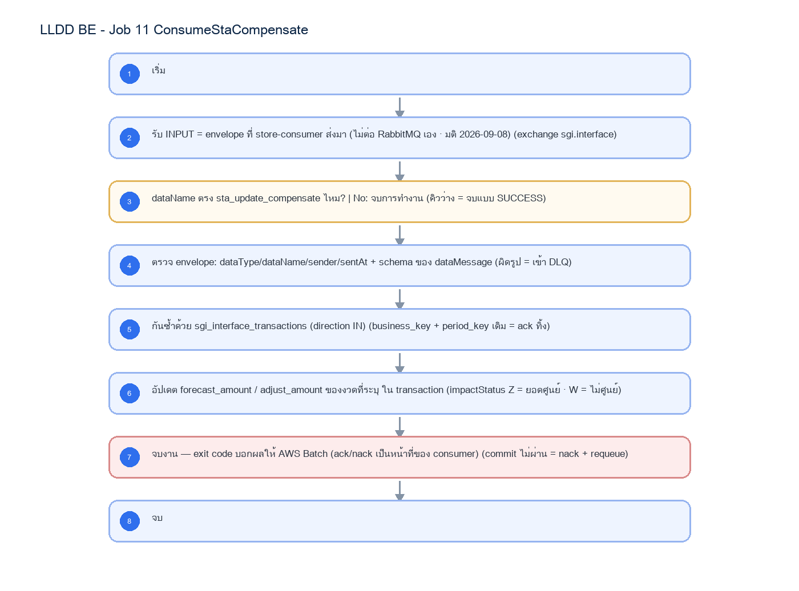
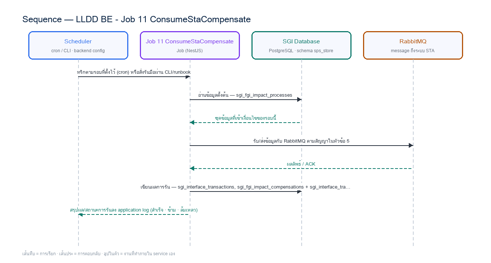

# LLDD BE - Job 11 ConsumeStaCompensate

SBP Mall - ระบบประกันรายได้ | Low Level Design Document

## 1. Overview

| รายการ | รายละเอียด |
| --- | --- |
| Track | BE |
| Estimate | **16 ชั่วโมง** = implementation 12 + unit test 4 (30%) |
| Owner | Aphiwit &lt;Bank&gt; Khammoon |
| Target repository | **`SBP/srm-sps-spsap-sop-sgi-batch`** (NestJS 11 + TypeORM · schema `sps_store` · **มติ 2026-09-02 — ย้ายมาจาก store-backend**) — batch runner ของ SBP ที่รันอยู่แล้ว 42 job บน **AWS Batch** · ลงทะเบียน job ใน `src/main.ts` แล้วรับ argument ผ่าน `JOB_NAME`/`INPUT` (local) หรือ `argv[3]`/`argv[2]` (AWS Batch) · **ไม่ผ่าน BFF และไม่เปิด HTTP** · ตารางเวลาเป็น AWS Batch scheduled event ไม่ใช่ `@Cron` · ดู `SBP/srm-sps-spsap-sop-sgi-batch.md` |
| Objective | รับยอดชดเชยจาก STA (RabbitMQ): **ไม่ต่อ RabbitMQ เอง** (มติ 2026-09-08) — `srm-sps-spsap-store-consumer` เป็นผู้ consume คิว `sta_update_compensate` แล้ว SubmitJob มาที่ job นี้พร้อม `INPUT` = ข้อความทั้ง envelope · job มีหน้าที่ **อัปเดตยอดเงินประกันรายได้ของงวดที่ระบุ** อย่างเดียว — ปิดช่องว่างที่สเปก STA บังคับให้ SGI consume แต่ยังไม่มีเอกสารรองรับ (มติ 2026-09-02) |

Common contract reference: ทุกหัวข้อ API/FE ต้องยึด LLDD-BE-API-Common-Contracts และ LLDD-FE-Integration-Contracts สำหรับ error/auth/format/pagination/action/RBAC ก่อนลงรายละเอียดเฉพาะหน้าหรือเฉพาะ endpoint

### 1.1 เอกสาร LLDD ที่เกี่ยวข้อง

ตารางนี้สร้างจาก endpoint และตารางที่เอกสารฉบับนี้ประกาศไว้จริง — อ่านฉบับที่อยู่ในตารางก่อนลงมือ เพื่อไม่ให้สัญญา request/response หรือชื่อคอลัมน์หลุดจากกัน

| ความสัมพันธ์ | เอกสาร LLDD | เกี่ยวข้องตรงไหน |
| --- | --- | --- |
| สัญญากลาง | **LLDD-BE-API-Common-Contracts** | envelope `{success,data}` · error code · pagination · รูปแบบวันที่/เลขเอกสาร |
| โครงสร้างข้อมูล | **LLDD-BE-Database-Structure** | DDL ของตารางที่หัวข้อ Reference DB Mapping อ้างถึง |
| แพลตฟอร์มระบบเดิม | **LLDD-BE-Integration-SBP-Platform** | header จาก BFF (`x-api-key` / `x-user-*`) · การ reuse ตารางและ service ของระบบ SBP เดิม |
| ต้องจบก่อน (ลำดับงาน) | **LLDD-BE-API-Common-Contracts** | เป็นฉบับต้นทางของสัญญา/โครงที่ฉบับนี้อ้าง |
| ต้องจบก่อน (ลำดับงาน) | **LLDD-BE-Job-6-ExportImpactStoreToFS** | เป็นฉบับต้นทางของสัญญา/โครงที่ฉบับนี้อ้าง |

## 2. Screen / Functional Scope

- Main class/script: (ของใหม่ — ไม่มีคลาสเดิมใน fcsJar) / sgi-consume-sta-compensate
- Phase: B
- Output: sgi_fgi_impact_compensations (forecast_amount / adjust_amount)
- Estimate: 12 ชั่วโมง
- Argument รับผ่าน `INPUT` (JSON) — local ใช้ env `JOB_NAME`/`INPUT` · AWS Batch ใช้ `argv[3]`/`argv[2]` · ดูหัวข้อ 5.95 · ไม่มีตาราง job_configs และไม่มีหน้าจอควบคุม (หน้า Flow Batch Job ในกลุ่มเมนู Flow เหลือแค่ Flowchart + Database ที่ใช้ · 2026-08-06)
- ตารางเวลาตั้งที่ **AWS Batch scheduled event** (repo ไม่มี `@Cron`) — **ยกเว้น job ที่เป็น event-driven (ดูหัวข้อ Config Schema ของ job นั้น) ซึ่งห้ามตั้ง schedule** · ทุก job ถูกบันทึกลง `integration_log` โดย `main.ts` อัตโนมัติ + structured log `BATCH_START`/`BATCH_END` พร้อม `runId`

## 3. Screenshot Reference

ไม่มีภาพหน้าจอสำหรับหัวข้อนี้ — เป็นเอกสารฝั่ง Backend/Batch ที่ไม่มี UI (ภาพหน้าจอทั้งหมดอยู่ในเอกสารชุด FE)

## 4. Implementation Flow & Sequence Diagram (Reference)

### 4.1 Implementation Flow (ลำดับขั้นการทำงาน)



_รูปที่ 1: Implementation flow reference: LLDD BE - Job 11 ConsumeStaCompensate_

### 4.2 Sequence Diagram (ใครคุยกับใคร ลำดับไหน)

ผู้แสดงและลำดับข้อความในภาพนี้สร้างจาก endpoint ในหัวข้อ 7 และตารางในหัวข้อ Reference DB Mapping ของเอกสารฉบับนี้เอง จึงตรงกับสัญญาเสมอ



_รูปที่ 2: Sequence diagram: LLDD BE - Job 11 ConsumeStaCompensate_

## 5. Field, Format, and Validation

| Field / UI | Format | Validation | Behavior |
| --- | --- | --- | --- |
| ตัวกระตุ้น (Trigger) | ข้อความจาก STA ผ่าน srm-sps-spsap-store-consumer | แก้ไขได้ | มติ 2026-09-08 — 1 ข้อความ = 1 การรัน (ไม่ใช่ cron ทุก 10 นาที) · consumer คุม prefetch/ack ให้ |
| Queue | srm.sgi.sta-update-compensate.queue | ค่าคงที่/แก้ผ่านหน้าจอไม่ได้ | **consumer เป็นผู้ bind/consume คิวนี้ ไม่ใช่ job** — ระบุไว้เพื่ออ้างอิง · ชื่อ queue/routing key ต้อง confirm กับทีม STA |
| dataName ที่รับ | sta_update_compensate | ค่าคงที่/แก้ผ่านหน้าจอไม่ได้ | ข้ามข้อความที่ dataName ไม่ตรง (log warn + ack ทิ้ง) |
| DLQ | srm.sgi.sta-update-compensate.dlq | ค่าคงที่/แก้ผ่านหน้าจอไม่ได้ | **เป็นหน้าที่ของ consumer ไม่ใช่ job** — ⚠️ ทั้ง DLQ และ retry ยังไม่มีในโค้ด consumer (ข้อ C1/C2) ต้องผลักให้ทีมนั้นเพิ่มก่อน UAT |

### 5.9 Input / Progress / Output Contract

| Stage | Contract for implementation |
| --- | --- |
| Input | `INPUT` = envelope ของข้อความ `sta_update_compensate` ที่ **`srm-sps-spsap-store-consumer` ส่งต่อมา** (consumer เป็นผู้ bind คิวบน exchange `sgi.interface` · มติ 2026-09-08) — ยอดเงินประกันรายได้รายงวดจากระบบ STA |
| Progress | อ่าน `INPUT`, ตรวจ envelope (`dataName` ต้องเป็น sta_update_compensate), ถ้า `dataType = S3` ให้ดาวน์โหลดไฟล์จาก `urls` เอง, กันซ้ำด้วย `uq_interface_business`, อัปเดตยอดชดเชยของงวดใน transaction เดียว — **ไม่ต่อ RabbitMQ เอง ไม่ ack เอง** (consumer จัดการให้) |
| Output | sgi_fgi_impact_compensations มี forecast_amount / adjust_amount ของงวดที่ STA แจ้ง + แถว direction=IN ใน sgi_interface_transactions |

### 5.90 Job 11 Execution Stages

อ่าน `INPUT`, ตรวจ envelope (`dataName` ต้องเป็น sta_update_compensate), ถ้า `dataType = S3` ให้ดาวน์โหลดไฟล์จาก `urls` เอง, กันซ้ำด้วย `uq_interface_business`, อัปเดตยอดชดเชยของงวดใน transaction เดียว — **ไม่ต่อ RabbitMQ เอง ไม่ ack เอง** (consumer จัดการให้)

| Order | Service step | Repository | Output / failure contract |
| --- | --- | --- | --- |
| 1 | connectAndDrainQueue | staCompensateRepository | คืน metrics และ throw typed error; transaction/rerun ใช้ contract ด้านล่าง |
| 2 | validateEnvelope | staCompensateRepository | คืน metrics และ throw typed error; transaction/rerun ใช้ contract ด้านล่าง |
| 3 | skipDuplicateMessage | staCompensateRepository | คืน metrics และ throw typed error; transaction/rerun ใช้ contract ด้านล่าง |
| 4 | applyCompensateAmount | staCompensateRepository | คืน metrics และ throw typed error; transaction/rerun ใช้ contract ด้านล่าง |

### 5.91 Job 11 Run Evidence

| Evidence | Job-specific value | Acceptance |
| --- | --- | --- |
| Input identity | `INPUT` = envelope ของข้อความ `sta_update_compensate` ที่ **`srm-sps-spsap-store-consumer` ส่งต่อมา** (consumer เป็นผู้ bind คิวบน exchange `sgi.interface` · มติ 2026-09-08) — ยอดเงินประกันรายได้รายงวดจากระบบ STA | snapshot input file/business key/period in run record |
| Output identity | sgi_fgi_impact_compensations มี forecast_amount / adjust_amount ของงวดที่ STA แจ้ง + แถว direction=IN ใน sgi_interface_transactions | reconcile input, success, reject and skipped counts |
| Dedup proof | UNIQUE(data_name,direction,business_key,period_key) ของ sgi_interface_transactions — ข้อความเดิมที่ redeliver ต้อง ack ทิ้งโดยไม่แก้ยอดซ้ำ | rerun fixture produces no duplicate target business key |
| Transaction proof | insert outbox ขาเข้า + update ยอด อยู่ transaction เดียวกัน แล้วจึง ack ข้อความ; commit ไม่ผ่าน = nack + requeue (ครบ 3 ครั้งเข้า DLQ) | injected failure leaves no partial committed state outside documented boundary |
| Security proof | RabbitMQ ใช้ secretRef=secret/sgi/mq/sta ผ่าน AMQPS (TLS 1.2+ verify-full); ชื่อ queue/exchange มาจาก config ไม่ใช่ค่าที่ผู้ใช้แก้ได้ | config/log/error contains no plaintext secret |

### 5.92 Legacy Java Source Reference

| Legacy file | Line range | Responsibility to carry forward |
| --- | --- | --- |
| (ไม่มีคลาสเดิมใน fcsJar) | - | งานใหม่ทั้งหมด — ระบบเดิมรับยอดจาก STA ผ่านไฟล์/WS ไม่ใช่ RabbitMQ · สัญญาข้อความมาจาก STA/ประกันรายได้-ตัวอย่าง-Message-RabbitMQ.md ข้อ 3 (2026-09-01) |

Line ranges refer to the legacy Java implementation under /Users/bank_mac/gosoft/java/SBP/fcsJar. Use these ranges to preserve business behavior while implementing the target Node job.

### 5.93 Target Repository and SQL Contract

| Contract | Target implementation |
| --- | --- |
| Repository | staCompensateRepository |
| Idempotency / dedup | UNIQUE(data_name,direction,business_key,period_key) ของ sgi_interface_transactions — ข้อความเดิมที่ redeliver ต้อง ack ทิ้งโดยไม่แก้ยอดซ้ำ |
| Transaction boundary | insert outbox ขาเข้า + update ยอด อยู่ transaction เดียวกัน แล้วจึง ack ข้อความ; commit ไม่ผ่าน = nack + requeue (ครบ 3 ครั้งเข้า DLQ) |
| Security | RabbitMQ ใช้ secretRef=secret/sgi/mq/sta ผ่าน AMQPS (TLS 1.2+ verify-full); ชื่อ queue/exchange มาจาก config ไม่ใช่ค่าที่ผู้ใช้แก้ได้ |

#### Input / candidate query

```sql
-- bind ตามลำดับ: $1=business_key · $2=compensate_month
-- กันซ้ำ: ข้อความเดิมเคยประมวลผลไปแล้วหรือยัง
SELECT 1
FROM sgi_interface_transactions
WHERE data_name = 'STA_UPDATE_COMPENSATE'
  AND direction = 'IN'
  AND business_key = $1 /* business_key */      -- storecode_i:storecode_n
  AND period_key   = $2 /* compensate_month */  -- 'YYYY-MM' (แปลงจาก yyMM พ.ศ. ในข้อความแล้ว)
LIMIT 1;
```

#### Write / upsert query

```sql
-- bind ตามลำดับ: $1=run_id · $2=impact_process_id · $3=business_key · $4=compensate_month · $5=forecast_amount · $6=adjust_amount
INSERT INTO sgi_interface_transactions
    (run_id, data_name, direction, status, impact_process_id, business_key, period_key, purge_after)
VALUES ($1 /* run_id */, 'STA_UPDATE_COMPENSATE', 'IN', 'COMPLETED', $2 /* impact_process_id */,
        $3 /* business_key */, $4 /* compensate_month */, CURRENT_TIMESTAMP + INTERVAL '180 days')
ON CONFLICT (data_name, direction, business_key, period_key) DO NOTHING;

UPDATE sgi_fgi_impact_compensations
SET forecast_amount = COALESCE($5 /* forecast_amount */, forecast_amount),
    adjust_amount   = COALESCE($6 /* adjust_amount */, adjust_amount),
    updated_by = 'STA', updated_at = CURRENT_TIMESTAMP
WHERE impact_process_id = $2 /* impact_process_id */
  AND compensate_month  = $4 /* compensate_month */;
```

### 5.94 Target Node Implementation

โครงสร้างนี้ระบุ service/repository เฉพาะงานและต้อง implement ตาม SQL, transaction, idempotency และ security contract ด้านบน โดยทุกขั้นต้องคืน metrics สำหรับ reconcile และ run history

```js
export async function runLlddBeJob11Consumestacompensate(ctx, services) {
  const run = await services.jobRuns.acquire({
    jobNo: "11", period: ctx.period, triggeredBy: ctx.triggeredBy
  });

  try {
    ctx = { ...ctx, runId: run.id, repository: services.staCompensateRepository };
    const step1 = await services.connectAndDrainQueue(ctx, undefined);
    const step2 = await services.validateEnvelope(ctx, step1);
    const step3 = await services.skipDuplicateMessage(ctx, step2);
    const step4 = await services.applyCompensateAmount(ctx, step3);
    const result = step4;
    await services.jobRuns.finish(run.id, "SUCCESS", result.metrics);
    return { runId: run.id, status: "SUCCESS", ...result };
  } catch (error) {
    await services.jobRuns.finish(run.id, "FAILED", {
      errorCode: error.code ?? "JOB_FAILED",
      errorMessage: error.message
    });
    throw error;
  }
}
```

### 5.95 การลงทะเบียน job และ Arguments (sop-sgi-batch)

งานนี้ลงทะเบียนเป็น job ชื่อ **`sgi-consume-sta-compensate`** ใน `src/main.ts` ของ `SBP/srm-sps-spsap-sop-sgi-batch` โดยใช้ dispatcher เดิมของ repo (ไม่สร้าง runner ใหม่) — `main.ts` อ่านชื่อ job และ input มา 2 ทาง แล้วเลือกอัตโนมัติจากการมี `argv[3]` หรือไม่

| ช่องทางรัน | ชื่อ job มาจาก | input มาจาก | ตัวอย่าง |
| --- | --- | --- | --- |
| Local / CLI / runbook | env `JOB_NAME` | env `INPUT` (JSON string) | `JOB_NAME=sgi-consume-sta-compensate INPUT='{"dataType":"message","dataName":"sta_update_compensate","dataMessage":[{"storeCode":"01234","compensateMonth":"2026-06","amount":15000}],"sender":"sta","sentAt":"2026-09-08T03:00:00.000Z"}' npm run start` |
| AWS Batch (ตารางเวลาจริง) | `process.argv[3]` | `process.argv[2]` (JSON string) | `node dist/main.js '{"dataType":"message","dataName":"sta_update_compensate","dataMessage":[{"storeCode":"01234","compensateMonth":"2026-06","amount":15000}],"sender":"sta","sentAt":"2026-09-08T03:00:00.000Z"}' sgi-consume-sta-compensate` |

**ตารางเวลาไม่ได้อยู่ในโค้ด** — repo นี้ไม่มี `@Cron`/`@Interval` แม้แต่จุดเดียว (แม้ติดตั้ง `@nestjs/schedule` ไว้) cron ในหัวข้อ 5 เป็น **นิยามของ AWS Batch scheduled event** ที่ต้องตั้งตอน deploy ไม่ใช่ค่าที่อ่านจาก config file · 🔴 **ยกเว้น job นี้** ซึ่งเป็น **event-driven ไม่มีตารางเวลา** — `srm-sps-spsap-store-consumer` เรียก SubmitJob ให้เมื่อมีข้อความเข้าคิว **ห้ามตั้ง AWS Batch scheduled event ให้ job นี้** เพราะจะรันซ้อนกับ consumer

#### Argument ที่รับได้ (`INPUT` เป็น JSON object · ไม่ส่ง = `{}`)

**ระบบเดิมรับ argument แบบนี้:** **ไม่มีของเดิม** — ระบบเดิมรับยอดจาก STA ผ่านไฟล์/WS ไม่ใช่ RabbitMQ · งานนี้เกิดจากสเปกข้อความชุดใหม่ของทีม STA (2026-09-01)  
ของใหม่เปลี่ยนจาก positional string เป็น JSON เพื่อให้เพิ่มฟิลด์ได้โดยไม่พังของเดิม แต่ **ต้องรองรับทุกอย่างที่ระบบเดิมรับได้เป็นอย่างน้อย** — ห้ามลดความสามารถลง

| Field | ชนิด | ไม่ส่งแล้วได้อะไร (default) | Validation | ตรงกับ argument เดิม |
| --- | --- | --- | --- | --- |
| `dataType` | string | — | `message` \\| `S3` \\| `file` — envelope ที่ `store-consumer` ส่งต่อมาทั้งก้อน | **ของใหม่** |
| `dataName` | string | — | ต้องเป็น `sta_update_compensate` เท่านั้น · ไม่ตรง = จบงานแบบสำเร็จพร้อม log warn (ห้าม fail job เพราะ consumer ack ไปแล้ว) | **ของใหม่** |
| `dataMessage` | object[] | — | รายการยอดชดเชยรายงวด (ใช้เมื่อ `dataType = message`) | **ของใหม่** |
| `urls` | string | — | S3 URI ของไฟล์ (ใช้เมื่อ `dataType = S3`) — **job ต้องดาวน์โหลดเอง** | **ของใหม่** |
| `sender` / `sentAt` | string | — | ผู้ส่งและเวลาส่ง — เก็บลง `sgi_interface_transactions` เพื่อตามรอย | **ของใหม่** |
| `dryRun` | boolean | `false` | `true` = อ่าน/คำนวณครบแต่ไม่ commit และไม่ publish/ไม่ส่งไฟล์ | **ของกลาง** ทุก job |
| `limit` | number | `null` | จำกัดจำนวนรายการที่ประมวลผลรอบนี้ (ใช้ตอน smoke test) | **ของกลาง** ทุก job |

**กติกาการ validate ที่ทุก job ต้องทำเหมือนกัน** — parse `INPUT` ไม่สำเร็จ หรือฟิลด์ไม่ผ่าน validation ให้ log `BATCH_END` ด้วย `batchStatus: 'FAILED'` แล้ว `exit(1)` **ก่อนแตะฐานข้อมูล** (ห้าม fallback ไปค่า default เงียบ ๆ เมื่อผู้ใช้ตั้งใจส่งค่ามาแล้วผิด) · ฟิลด์ที่ไม่รู้จักให้ log warn แล้วข้าม ไม่ทำให้ job ล้ม

- 🔴 **มติ 2026-09-08 — job นี้ไม่ต่อ RabbitMQ เอง** · `srm-sps-spsap-store-consumer` เป็นผู้ consume คิวแล้ว `SubmitJob` มาที่ job นี้พร้อม `INPUT` = envelope ทั้งก้อน · **1 ข้อความ = 1 การรัน** ไม่ใช่ drain-then-exit ตามที่เคยออกแบบไว้
- ผลที่ตามมา: `maxMessages` / `stopWhenEmpty` / `queue` **ไม่ใช้แล้ว** — prefetch, ack/nack และ DLQ เป็นหน้าที่ของ consumer (ดู `SBP/srm-sps-spsap-store-consumer.md` ข้อ C1/C2 — ทั้ง DLQ และ retry **ยังไม่มีในโค้ดของ consumer** ต้องผลักให้ทีมนั้นเพิ่มก่อน UAT)
- job ต้องเป็น **idempotent** เพราะ consumer ไม่มีกลไกกันส่งซ้ำ — ใช้ `uq_interface_business` (`data_name` + `direction` + `business_key` + `period_key`) เป็นตัวกันบันทึกซ้ำ

### 5.96 เงื่อนไขตัดสิน (Decision Rules) — ตัดสินจากอะไร

Job 11 ตัดสิน 3 เรื่องต่อข้อความ 1 ใบ: **ข้อความนี้ของเราหรือเปล่า · เคยประมวลผลไปแล้วหรือยัง · จะเอายอดไปลงงวดไหน** — ผิดข้อกลางแล้วยอดชดเชยจะถูกทับซ้ำเงียบ ๆ

| คำถามที่โค้ดต้องตอบ | ตัดสินจาก (ตาราง · คอลัมน์) | เงื่อนไขที่ต้องเป็นจริง | ไม่เข้าเงื่อนไขแล้วทำอะไร |
| --- | --- | --- | --- |
| ข้อความนี้เป็นของ job นี้หรือไม่ | envelope ของข้อความ — `dataType` · `dataName` · `sender` | `dataType = 'message'` **และ** `dataName = 'sta_update_compensate'` · `sender` ที่ได้รับจริงคือ `"STA"` (⚠️ ไฟล์ต้นฉบับของ STA เขียนสลับเป็น `"SGI"` — ยึดทิศทางไม่ยึดค่าในไฟล์) | `dataName` ไม่ตรง = **ack ทิ้งพร้อม log warn** (ไม่ใช่ nack — ไม่งั้นจะวนไม่รู้จบ) · envelope ผิดรูป = เข้า DLQ |
| ข้อความนี้เคยประมวลผลไปแล้วหรือยัง | `sgi_interface_transactions` — `data_name = 'STA_UPDATE_COMPENSATE'` · `direction = 'IN'` · `business_key` · `period_key` | `business_key` = `storecode_i:storecode_n` · `period_key` = `compensate_year_month` แปลงจาก `yyMM` **พ.ศ.** เป็น `'YYYY-MM'` **ค.ศ.** แล้ว · พบแถวเดิม = เคยทำแล้ว | เคยทำแล้ว = **ack ทิ้ง ไม่แก้ยอดซ้ำ** (นับเป็น `skipped`) — RabbitMQ redeliver ได้เสมอเมื่อ ack หาย |
| ยอดนี้ลงงวดไหน ของรอบไหน | `sgi_fgi_impact_processes` (`impacted_store_code` + งวด) → `sgi_fgi_impact_compensations` (`impact_process_id` + `compensate_month`) | หา `impact_process_id` จาก `impacted_store_code` + งวดก่อน แล้วอัปเดตแถว `compensate_month` ที่ตรงกัน · `impactStatus` `Z` = ยอดเป็นศูนย์ · `W` = ยอดไม่เป็นศูนย์ | หารอบไม่เจอ = **เข้า DLQ พร้อม reason** ห้ามสร้างรอบใหม่เอง (รอบเป็นของ Job 6) |

#### ค่าคงที่และโดเมนที่ใช้ในเงื่อนไขข้างบน

ทุกค่าในตารางนี้ต้องอ่านจาก config/env ไม่ hardcode ในคิวรี — แต่ **ค่าตั้งต้นต้องเท่าระบบเดิมทุกตัว** ไม่งั้นผลลัพธ์จะไม่ตรงกันตอนเทียบ UAT

| ค่า | โดเมน / ค่าที่ระบบเดิมใช้ | ที่มา |
| --- | --- | --- |
| `dataName` ที่รับ | `sta_update_compensate` เท่านั้น | สเปก STA §3 |
| `impactStatus` | `Z` = ยอดเป็นศูนย์ · `W` = ยอดไม่เป็นศูนย์ | สเปก STA §3 |
| ปีในข้อความ | `compensate_year_month` / `stmt_year_month` เป็น `yyMM` **พ.ศ.** | แปลงเป็น ค.ศ. ตอนอ่าน ห้ามให้ พ.ศ. หลุดเข้า DB |
| จำนวนครั้ง retry ก่อนเข้า DLQ | 3 | ค่าตั้งต้นของ job นี้ (ของใหม่) |

## 6. Button / User Action Mapping

| Action | Trigger | API / Service | Expected Result |
| --- | --- | --- | --- |
| รันตามตารางเวลา | CRON | scheduler → runner (job 11) | อ่าน cron/พารามิเตอร์จาก backend config |
| รันนอกรอบ (manual/rerun) | CLI | CLI/ops runbook → runner (job 11) | guard ไม่ให้รันซ้อนด้วย distributed lock |
| แก้พารามิเตอร์/เปิด-ปิด job | CONFIG | แก้ backend config แล้ว deploy | ไม่มี endpoint และไม่มีหน้าจอควบคุม — หน้า Flow Batch Job เป็น reference อย่างเดียว (2026-08-06) |
| ตรวจผลการรัน | LOG | application log (structured) | ไม่มีตาราง job_run_histories แล้ว · ผลการรับส่งไฟล์/ข้อความดูที่ sgi_interface_transactions |

## 7. API Contract

**เอกสารฉบับนี้ไม่มี endpoint ของตัวเอง** — เป็นสัญญา/งานภายในที่เอกสารอื่นเรียกใช้ (ดูขอบเขตใน 5.90 Endpoint Implementation Contract) · รายการ endpoint ทั้ง 28 เส้นของ SGI อยู่ที่ **LLDD-API** และ `api.md`

## 8. Reference DB Mapping (No Database Page Work)

ส่วนนี้เป็นข้อมูลอ้างอิงสำหรับการ implement API/Job เท่านั้น ไม่ใช่งานสร้างหน้า Database, ไม่ใช่งานออกแบบ DB page และไม่ถูกนับเป็น deliverable แยกของ FE/BE

| Table / Object | R/W | Usage |
| --- | --- | --- |
| sgi_interface_transactions | W | บันทึกขาเข้า direction = IN · กันซ้ำระดับข้อความ |
| sgi_fgi_impact_compensations | W | forecast_amount / adjust_amount ของงวดที่ STA แจ้ง |
| sgi_fgi_impact_processes | R | หา impact_process_id จาก impacted_store_code + งวด |

## 9. Skeleton Code (Batch Job 11)

### 9.1 ผังไฟล์ที่ต้องสร้าง (Job 11) — บน `srm-sps-spsap-sop-sgi-batch`

โครงไฟล์ของ Job 11 ((ของใหม่ — ไม่มีคลาสเดิมใน fcsJar) เดิม) วางใต้ `src/modules/sgi/` ตาม convention ที่ repo นี้ใช้อยู่จริง (ดูตัวอย่างที่ `src/modules/performance/import-qssi.service.ts`): service ถือ logic ทั้งหมด, inject `DataSource`/repository ผ่าน TypeORM, ยิง raw SQL ได้ตรง, และ **ไม่มี controller** เพราะ repo นี้ไม่เปิด HTTP

**สิ่งที่ reuse ได้ทันที ไม่ต้องเขียนใหม่** — ต่างจากแผนเดิมที่ตั้งไว้บน store-backend ซึ่งต้องสร้าง runner ทั้งชุดเอง: `src/main.ts` (dispatcher + `BATCH_START`/`BATCH_END` + `runId` + log ลง `integration_log` อัตโนมัติ) · `src/modules/rabbitMQ/rabbitmq.service.ts` (`publishMessage`) · `src/shared/services/s3.service.ts` · `StatementService.decodeThaiFileContent()` (WINDOWS-874 auto-detect) · `@gosoft-sbp/email-lib` · `@srm/glb-log`

⚠️ **สิ่งที่ repo นี้ยังไม่มี และเป็นงานตั้งต้นจริง**: (1) ไม่มี `@Cron` เลย — ตารางเวลาต้องตั้งเป็น **AWS Batch scheduled event** (2) ไม่มี distributed lock (`pg_try_advisory_lock`) — การกันรันซ้อนพึ่ง AWS Batch queue ถ้างานไหนรับความเสี่ยงนี้ไม่ได้ต้องเพิ่มเอง (3) `publishMessage` เป็น fire-and-forget **ไม่มี publisher confirm และไม่มี outbox** — งานที่ต้องการ **transactional outbox + publisher confirm** (Job 6 · และ `sgi_reflow` ฝั่ง BE) ต้องสร้างกลไกเพิ่มเอง ไม่ใช่ reuse ได้เลย · ⚠️ ไม่มี ACK ระดับธุรกิจให้รอ (มติ 2026-09-08 ข้อ 2.13) (4) ยังไม่มี entity/ตาราง `sgi_*` แม้แต่ตัวเดียว

| Path | หน้าที่ |
| --- | --- |
| src/modules/sgi/job-11-consume-sta-compensate.service.ts | คลาส `ConsumeStaCompensateService` — **`execute(input)` เป็น entry point เดียว** เรียงตาม flow ของ Job 11 ทีละขั้น ครอบ transaction เอง และจบด้วย structured log สรุป metrics (แบบเดียวกับ `ImportQssiService.execute(body)` ที่มีอยู่) |
| src/modules/sgi/job-11-consume-sta-compensate.service.spec.ts | unit test ของ service — repo นี้วาง spec ไว้ข้างไฟล์จริงเสมอ (`jest` + `npm run test:ci` มี coverage/SonarQube) |
| src/modules/sgi/dto/job-11-consume-sta-compensate-input.dto.ts | DTO ของ `INPUT` (JSON) พร้อม `class-validator` ตามตารางในหัวข้อ 9.2 — parse ไม่ผ่านต้อง fail ก่อนแตะ DB |
| src/modules/sgi/sgi.module.ts | NestJS module ของกลุ่มงานประกันรายได้ — ผูก service ทุกตัวของ SGI เข้ากับ `TypeOrmModule` (ไฟล์ร่วมของทุก job ให้ merge ไม่ใช่เขียนทับ) |
| src/main.ts | **เพิ่ม `case 'sgi-job-11-consume-sta-compensate':`** ในสวิตช์เดิม → `await import('./modules/sgi/job-11-consume-sta-compensate.service')` แล้ว `app.get(ConsumeStaCompensateService).execute(input)` (ไฟล์กลางของทุก job — เป็นจุด merge conflict ที่ต้องระวัง) |
| src/entities/sgi-*.entity.ts | entity ของตาราง `sgi_*` ที่หัวข้อ Reference DB Mapping อ้างถึง — **ยังไม่มีใน repo เลยสักตัว** ต้องสร้างใหม่ทั้งหมด |
| src/config/config.ts | เพิ่ม `export const sgiJob11Config` ตามแบบของไฟล์นี้ (โปรเจกต์ไม่ใช้ `registerAs`) — ค่าคงที่ทางธุรกิจของ Job 11 |

#### การลงทะเบียนใน `src/main.ts` (job `sgi-job-11-consume-sta-compensate`)

```js
// src/main.ts — เพิ่มเคสนี้ในสวิตช์เดิม (เรียงต่อจาก job ของ SGI ตัวก่อนหน้า)
      case 'sgi-job-11-consume-sta-compensate': {
        const { ConsumeStaCompensateService } = await import('./modules/sgi/job-11-consume-sta-compensate.service');
        const job11consumestacompensateService = app.get(ConsumeStaCompensateService);
        await job11consumestacompensateService.execute(input);   // input = JSON ที่ parse จาก INPUT/argv[2] แล้ว
        break;
      }
```

`main.ts` เรียก `StatementService.logInterfest('sgi-job-11-consume-sta-compensate', input)` ให้อยู่แล้วก่อนเข้าสวิตช์ → **ไม่ต้องเขียน log ลง `integration_log` เองซ้ำ** · และ `BATCH_END` ที่ท้ายไฟล์จะสรุป `batchStatus` + `durationMs` ให้อัตโนมัติ หน้าที่ของ service คือ throw เมื่อทำงานไม่สำเร็จเท่านั้น

### 9.2 Config Schema ของ Job 11 (backend config / env)

🔴 **Job 11 เป็น event-driven — ไม่มีตารางเวลา และห้ามตั้ง** · ตัวกระตุ้นคือ `srm-sps-spsap-store-consumer` เรียก SubmitJob ทุกครั้งที่มีข้อความเข้าคิว (1 ข้อความ = 1 การรัน · มติ 2026-09-08 ข้อ 2.11) · **ห้ามประกาศ `SGI_JOB11_CRON` และห้ามตั้ง AWS Batch scheduled event ให้ job นี้** เพราะจะรันซ้อนกับ consumer แล้วประมวลผลข้อความซ้ำ · `SGI_JOB11_ENABLED=false` ให้ `execute()` จบทันทีแบบ SUCCESS พร้อม log เหตุผล

```ts
// src/config/config.ts — เพิ่มบล็อกนี้ต่อท้าย (repo ใช้ export const ไม่ใช้ registerAs)
// convention จริงของ sop-sgi-batch คือ `export const` ใน `src/config/config.ts` (ไม่ใช้ registerAs · ดูของเดิมที่
// `AppConfigModule` แบบ @Global แล้วอ่าน process.env ตรง ๆ) — โปรเจกต์นี้ **ไม่ได้ใช้ registerAs**
// แม้แต่จุดเดียว จึงประกาศเป็นคลาสให้รีวิว/ทดสอบเหมือน config ตัวอื่น
import { Injectable } from '@nestjs/common';

// TODO: Job 11 ไม่มีตาราง job_configs และไม่มี Job Admin API แล้ว (ตัดสินใจ 2026-08-06)
// TODO: ค่าทุกตัวอ่านจาก env/config file ของ backend เท่านั้น — เปลี่ยนค่า = แก้ config แล้ว deploy
export interface Job11Config {
  /** เปิด/ปิด job รอบถัดไปโดยไม่ต้อง deploy โค้ด */
  enabled: boolean;
  /** ⚠️ job นี้เป็น event-driven — **ไม่มีและต้องไม่มี** cron/schedule
   *  ตัวกระตุ้นคือ store-consumer เรียก SubmitJob เมื่อมีข้อความเข้าคิว (1 ข้อความ = 1 การรัน)
   *  ห้ามประกาศ SGI_JOB11_CRON หรือตั้ง AWS Batch scheduled event ให้ job นี้
   *  เพราะจะรันซ้อนกับ consumer แล้วประมวลผลข้อความซ้ำ */
  /** ตัวกระตุ้น (Trigger) — มติ 2026-09-08 — 1 ข้อความ = 1 การรัน (ไม่ใช่ cron ทุก 10 นาที) · consumer คุม prefetch/ack ให้ */
  trigger: string;
  /** Queue — **consumer เป็นผู้ bind/consume คิวนี้ ไม่ใช่ job** — ระบุไว้เพื่ออ้างอิง · ชื่อ queue/routing key ต้อง confirm กับทีม STA */
  queue: string;
  /** dataName ที่รับ — ข้ามข้อความที่ dataName ไม่ตรง (log warn + ack ทิ้ง) */
  dataName: string;
  /** DLQ — **เป็นหน้าที่ของ consumer ไม่ใช่ job** — ⚠️ ทั้ง DLQ และ retry ยังไม่มีในโค้ด consumer (ข้อ C1/C2) ต้องผลักให้ทีมนั้นเพิ่มก่อน UAT */
  dlq: string;
  /** ผู้รับอีเมลเมื่อ job ล้มเหลว — เก็บเป็น string คั่น comma ให้ตรง signature ของ
      `EmailLibService.sendMail({ mailTo })` ที่รับ string ไม่ใช่ string[] */
  mailTo: string;
}

@Injectable()
export class SgiJob11Config implements Job11Config {
  // TODO: ยืนยันค่า default ทุกตัวกับ Ops ก่อนขึ้น production (ไม่มีหน้าจอแก้ค่าแล้ว)
  enabled = (process.env.SGI_JOB11_ENABLED ?? 'true') === 'true';
  trigger = process.env.SGI_JOB11_TRIGGER ?? 'ข้อความจาก STA ผ่าน srm-sps-spsap-store-consumer'; // TODO: แก้ผ่าน env/config file แล้ว deploy
  queue = process.env.SGI_JOB11_QUEUE ?? 'srm.sgi.sta-update-compensate.queue'; // TODO: ค่าคงที่ทางธุรกิจ — เปลี่ยนต้องผ่านการอนุมัติ
  dataName = process.env.SGI_JOB11_DATA_NAME ?? 'sta_update_compensate'; // TODO: ค่าคงที่ทางธุรกิจ — เปลี่ยนต้องผ่านการอนุมัติ
  dlq = process.env.SGI_JOB11_DLQ ?? 'srm.sgi.sta-update-compensate.dlq'; // TODO: ทั้ง DLQ และ retry ยังไม่มีในโค้ด consumer (ข้อ C1/C2) ต้องผลักให้ทีมนั้นเพิ่มก่อน UAT (⚠️)
  mailTo = process.env.SGI_JOB11_MAIL_TO ?? ''; // TODO: ผู้รับอีเมลแจ้ง error คั่นด้วย comma (เดิม: -)
}

// TODO: เพิ่ม SgiJob11Config ใน providers/exports ของ AppConfigModule (@Global) เหมือน AppConfig
```

### 9.3 Job Class — `run(ctx)` ของ Job 11 ทีละขั้นตามผัง

#### 9.3.1 สัญญาของชั้นกลาง (`runner.ts`) + โครง service ของ Job 11

service อ้าง `JobRunContext` / `JobRunResult` / `JobState` / `JobFailedError` — ทั้งหมดนิยาม ครั้งเดียวใน `src/modules/sgi/sgi-job.types.ts` (ไฟล์ร่วมของทุก job ให้ merge ไม่ใช่เขียนทับ) และ service ต้องมี method ครบตามตารางขั้นตอนด้านล่าง มิฉะนั้น `execute(input)` จะเรียก method ที่ไม่มีอยู่

```ts
// src/modules/sgi/sgi-job.types.ts — สัญญากลางของทุก job ของ SGI (ประกาศครั้งเดียว ใช้ร่วมทั้ง 10 ฉบับ)

export interface JobRunContext {
  jobNo: string;
  period: string;        // YYYYMM ของงวดที่รัน
  triggeredBy: string;   // 'CRON' | userId ที่สั่งรันนอกรอบ
  params?: Record<string, string>;
}

export interface JobRunResult {
  event: 'job.finish';
  jobNo: string;
  jobName: string;
  status: 'SUCCESS' | 'SKIPPED' | 'SKIPPED_LOCKED' | 'FAILED';
  period: string;
  output: string;
  read: number; written: number; skipped: number; rejected: number;
  durationMs: number;
}

/** counter + ค่าที่ทุกขั้นของ job ใช้ร่วมกัน (service เป็นผู้สร้างผ่าน createState) */
export interface JobState {
  period: string;
  read: number; written: number; skipped: number; rejected: number;
  // TODO: เพิ่ม field เฉพาะของ job นี้ (เช่น rows ที่อ่านมา, path ไฟล์ที่เขียน)
  [key: string]: unknown;
}

/** error ที่ทำให้ job จบเป็น FAILED และส่งอีเมลแจ้งผู้ดูแล */
export class JobFailedError extends Error {
  constructor(public readonly code: string, message: string) { super(message); }
}

/** ใช้ออกจาก transaction เมื่อสาขา NO บอกให้ข้ามงวด/เรคคอร์ด — runner สรุปเป็น SKIPPED ไม่ใช่ FAILED */
export class JobSkippedError extends Error {}
```

```ts
// ConsumeStaCompensateService — method ที่ job class เรียก (1 method ต่อ 1 ขั้นในตารางด้านบน)
import { Inject, Injectable } from '@nestjs/common';
import type { DataSource, EntityManager } from 'typeorm';
import type { JobRunContext, JobState } from '../../runner';
export type { JobState };

@Injectable()
export class ConsumeStaCompensateService {
  constructor(@Inject('DATA_SOURCE') private readonly dataSource: DataSource) {}

  createState(ctx: JobRunContext): JobState {
    return { period: ctx.period, read: 0, written: 0, skipped: 0, rejected: 0 };
  }

  // รับ INPUT = envelope ที่ store-consumer ส่งมา (ไม่ต่อ RabbitMQ เอง · มติ 2026-09-08)
  async step02Publish(state: JobState, manager?: EntityManager): Promise<void> {
    throw new Error('step02Publish: ยังไม่ได้ implement — ดู SQL ที่หัวข้อ Repository / SQL และกติกาที่หัวข้อเงื่อนไขตัดสิน');
  }

  // dataName ตรง sta_update_compensate ไหม?
  //   เงื่อนไขจริง: ดูตารางในหัวข้อ "เงื่อนไขตัดสิน (Decision Rules)" ของเอกสารฉบับนี้
  async check03Update(state: JobState): Promise<boolean> {
    throw new Error('check03Update: ยังไม่ได้ implement — ห้าม deploy ทั้งที่ยังไม่เขียนเงื่อนไขจริง');
  }

  // ตรวจ envelope: dataType/dataName/sender/sentAt + schema ของ dataMessage
  async step04Validate(state: JobState, manager?: EntityManager): Promise<void> {
    throw new Error('step04Validate: ยังไม่ได้ implement — ดู SQL ที่หัวข้อ Repository / SQL และกติกาที่หัวข้อเงื่อนไขตัดสิน');
  }

  // กันซ้ำด้วย sgi_interface_transactions (direction IN)
  async step05Process(state: JobState, manager?: EntityManager): Promise<void> {
    throw new Error('step05Process: ยังไม่ได้ implement — ดู SQL ที่หัวข้อ Repository / SQL และกติกาที่หัวข้อเงื่อนไขตัดสิน');
  }

  // อัปเดต forecast_amount / adjust_amount ของงวดที่ระบุ ใน transaction
  async step06Update(state: JobState, manager?: EntityManager): Promise<void> {
    throw new Error('step06Update: ยังไม่ได้ implement — ดู SQL ที่หัวข้อ Repository / SQL และกติกาที่หัวข้อเงื่อนไขตัดสิน');
  }

  // จบงาน — exit code บอกผลให้ AWS Batch (ack/nack เป็นหน้าที่ของ consumer)
  async step07Commit(state: JobState, manager?: EntityManager): Promise<void> {
    throw new Error('step07Commit: ยังไม่ได้ implement — ดู SQL ที่หัวข้อ Repository / SQL และกติกาที่หัวข้อเงื่อนไขตัดสิน');
  }

}
```

#### 9.3.2 `run(ctx)` ของ Job 11

ทุกขั้นใน `run()` ตรงกับ flowchart ของ Job 11 หนึ่งต่อหนึ่ง (decision และ error path รวมอยู่ด้วย) — method ที่ต้อง implement ใน service ตามตารางนี้

| ลำดับ | ชนิด | ขั้นตอนจากผัง | Method ที่ต้อง implement | เส้นทาง NO / error |
| --- | --- | --- | --- | --- |
| 1 | start | เริ่ม | createState() | - |
| 2 | io | รับ INPUT = envelope ที่ store-consumer ส่งมา (ไม่ต่อ RabbitMQ เอง · มติ 2026-09-08) | step02Publish() | throw JobFailedError เมื่อทำไม่สำเร็จ |
| 3 | decision | dataName ตรง sta_update_compensate ไหม? | check03Update() | [end] จบการทำงาน |
| 4 | process | ตรวจ envelope: dataType/dataName/sender/sentAt + schema ของ dataMessage | step04Validate() | throw JobFailedError เมื่อทำไม่สำเร็จ |
| 5 | process | กันซ้ำด้วย sgi_interface_transactions (direction IN) | step05Process() | throw JobFailedError เมื่อทำไม่สำเร็จ |
| 6 | process | อัปเดต forecast_amount / adjust_amount ของงวดที่ระบุ ใน transaction | step06Update() | throw JobFailedError เมื่อทำไม่สำเร็จ |
| 7 | io | จบงาน — exit code บอกผลให้ AWS Batch (ack/nack เป็นหน้าที่ของ consumer) | step07Commit() | throw JobFailedError เมื่อทำไม่สำเร็จ |
| 8 | end | จบ | summarize() | - |

```ts
// src/modules/sgi/job-11-consume-sta-compensate.service.ts — execute(input) เป็น entry point เดียว
import { Inject, Injectable, Logger } from '@nestjs/common';
import type { DataSource, EntityManager } from 'typeorm';
import { ConsumeStaCompensateService, type JobState } from './job-11-consume-sta-compensate.service';
// 4 symbol นี้นิยามใน src/modules/sgi/sgi-job.types.ts (ไฟล์ร่วมของทุก job — ดูหัวข้อก่อนหน้า)
import { JobFailedError, JobSkippedError, JobRunContext, JobRunResult } from '../../runner';

@Injectable()
export class ConsumeStaCompensateJob {
  static readonly jobNo = '11';
  private readonly logger = new Logger(ConsumeStaCompensateJob.name);

  constructor(
    // TODO: repo นี้ตั้ง replication ใน typeorm.config.ts อยู่แล้ว — SELECT ไป slave, write ไป master อัตโนมัติ
    @Inject('DATA_SOURCE') private readonly dataSource: DataSource,
    private readonly service: ConsumeStaCompensateService,
  ) {}

  async run(ctx: JobRunContext): Promise<JobRunResult> {
    const startedAt = Date.now();
    // TODO: state ถือ counter (read/written/skipped/rejected) และค่าจาก job11Config
    const state = this.service.createState(ctx);
    try {
      // ขั้นที่ 2: รับ INPUT = envelope ที่ store-consumer ส่งมา (ไม่ต่อ RabbitMQ เอง · มติ 2026-09-08) · TODO: exchange sgi.interface
      await this.service.step02Publish(state);
      // ขั้นที่ 3 (decision): dataName ตรง sta_update_compensate ไหม? · TODO: คิวว่าง = จบแบบ SUCCESS
      const ok03 = await this.service.check03Update(state);
      if (!ok03) { // NO → จบการทำงาน
        return this.summarize(state, 'SKIPPED', startedAt);
      }
      // ขั้นที่ 4: ตรวจ envelope: dataType/dataName/sender/sentAt + schema ของ dataMessage · TODO: ผิดรูป = เข้า DLQ
      await this.service.step04Validate(state);
      // ขั้นที่ 5: กันซ้ำด้วย sgi_interface_transactions (direction IN) · TODO: business_key + period_key เดิม = ack ทิ้ง
      await this.service.step05Process(state);
      // === transaction boundary === TODO: ยืนยันขอบเขต transaction กับ BA
      await this.dataSource.transaction(async (manager: EntityManager) => {
        // ขั้นที่ 6: อัปเดต forecast_amount / adjust_amount ของงวดที่ระบุ ใน transaction · TODO: impactStatus Z = ยอดศูนย์ · W = ไม่ศูนย์
        await this.service.step06Update(state, manager);
        // ขั้นที่ 7: จบงาน — exit code บอกผลให้ AWS Batch (ack/nack เป็นหน้าที่ของ consumer) · TODO: commit ไม่ผ่าน = nack + requeue
        await this.service.step07Commit(state, manager);
      });
      return this.summarize(state, 'SUCCESS', startedAt);
    } catch (error) {
      // TODO: error path ของ Job 11 — ตรวจ risk ในเอกสาร
      this.logger.error(JSON.stringify({ event: 'job.failed', jobNo: '11', period: ctx.period,
        triggeredBy: ctx.triggeredBy, durationMs: Date.now() - startedAt, error: (error as Error).message }));
      // TODO: แจ้งผู้ดูแลผ่าน JobFailureNotifier (หัวข้อ 9.6.1) — runner เป็นผู้เรียกให้
      throw error;
    }
  }

  private summarize(state: JobState, status: JobRunResult['status'], startedAt = Date.now()): JobRunResult {
    // TODO: structured log บรรทัดเดียวจบ — ไม่มีตาราง job_run_histories แล้ว (2026-08-06)
    const summary = {
      event: 'job.finish', jobNo: '11', jobName: 'ConsumeStaCompensate', status,
      period: state.period, output: 'sgi_fgi_impact_compensations (forecast_amount / adjust_amount)',
      read: state.read, written: state.written, skipped: state.skipped,
      rejected: state.rejected, durationMs: Date.now() - startedAt,
    };
    this.logger.log(JSON.stringify(summary));
    return summary as JobRunResult;
  }
}
```

### 9.4 การกันรันซ้อนของ Job 11 (PostgreSQL advisory lock — **ของใหม่**)

Job 11 ต้องกันรันซ้อนทั้งกรณี cron ซ้อนกับ manual rerun และกรณีหลาย pod — runner ล็อกด้วย `pg_try_advisory_lock` ก่อนเริ่มขั้นแรกเสมอ และรอบที่ล็อกไม่ได้ให้จบด้วยสถานะ SKIPPED_LOCKED (ไม่ใช่ FAILED)

```ts
// src/modules/sgi/sgi-job.lock.ts (ของใหม่ — repo นี้ยังไม่มีกลไกกันรันซ้อนใด ๆ)
import { Inject, Injectable, Logger } from '@nestjs/common';
import type { DataSource } from 'typeorm';

// TODO: ห้ามใช้แถวสถานะ RUNNING ในตารางเป็นตัวกัน (ไม่มีตาราง job_run_histories แล้ว)
//       ใช้ PostgreSQL advisory lock ระดับ session แทน — ปลดอัตโนมัติเมื่อ connection หลุด
export const SGI_JOB_LOCK_CLASS_ID = 861000; // namespace ของระบบ SGI
export const JOB_LOCK_KEYS: Record<string, number> = { '11': 110 /* TODO: เพิ่มให้ครบทุก job */ };

@Injectable()
export class BatchRunner {
  private readonly logger = new Logger(BatchRunner.name);
  constructor(@Inject('DATA_SOURCE') private readonly dataSource: DataSource) {}

  async runExclusive<T>(jobNo: string, fn: () => Promise<T>): Promise<T | { status: 'SKIPPED_LOCKED' }> {
    // TODO: ต้องใช้ QueryRunner (connection เดียวบน master) — dataSource.query() ของโปรเจกต์นี้
    //       route SQL ที่ขึ้นต้นด้วย SELECT ไป slave pool ทำให้ lock ไปตกที่ replica คนละ connection
    const runner = this.dataSource.createQueryRunner('master');
    await runner.connect();
    const objectId = JOB_LOCK_KEYS[jobNo];
    try {
      const [{ locked }] = await runner.query(
        'SELECT pg_try_advisory_lock($1, $2) AS locked',
        [SGI_JOB_LOCK_CLASS_ID, objectId],
      );
      if (!locked) {
        // TODO: รอบนี้ข้ามไปเฉย ๆ ไม่ถือเป็น error และไม่ต้องส่งอีเมล
        this.logger.warn(JSON.stringify({ event: 'job.skipped.locked', jobNo }));
        return { status: 'SKIPPED_LOCKED' };
      }
      return await fn();
    } finally {
      // TODO: ปลด lock ทุกกรณี แล้วคืน connection เข้า pool
      await runner.query('SELECT pg_advisory_unlock($1, $2)', [SGI_JOB_LOCK_CLASS_ID, objectId]);
      await runner.release();
    }
  }
}
```

### 9.5 Repository / SQL หลักของ Job 11

repository ของ Job 11 ประกาศเป็น factory provider (`{provide: 'CONSUME_STA_COMPENSATE_REPOSITORY', useFactory: (ds) => ds.getRepository(Entity), inject: [DataSource]}`) แล้วยิง raw SQL ตามแบบ module ธุรกิจอื่นของ store-backend (schema `sps_store` มาจาก search_path)

| ตาราง | R/W | การใช้งานตามผัง | หมายเหตุ target design |
| --- | --- | --- | --- |
| sgi_interface_transactions | W | บันทึกขาเข้า direction = IN · กันซ้ำระดับข้อความ | เขียน SQL ตรงผ่าน DATA_SOURCE |
| sgi_fgi_impact_compensations | W | forecast_amount / adjust_amount ของงวดที่ STA แจ้ง | เขียน SQL ตรงผ่าน DATA_SOURCE |
| sgi_fgi_impact_processes | R | หา impact_process_id จาก impacted_store_code + งวด | เขียน SQL ตรงผ่าน DATA_SOURCE |

```sql
-- Job 11 ConsumeStaCompensate — query หลักที่ต้อง implement
-- TODO: ทุก statement รันผ่าน DATA_SOURCE (SELECT ไป slave, write ไป master) และ
--       write ทั้งหมดต้องอยู่ใน transaction เดียวกับที่ระบุใน 9.3

-- [W] sgi_interface_transactions : บันทึกขาเข้า direction = IN · กันซ้ำระดับข้อความ
-- บันทึกผลการรับส่งระดับ record ของ interface (แทน job_run_histories ที่ยกเลิกไปแล้ว)
INSERT INTO sgi_interface_transactions
  (run_id, data_name, direction, status, business_key, period_key,
   file_name, file_checksum, created_at)
VALUES ($1 /* run_id = correlation id ของรอบรัน Job 11 จาก application log */,
        $2 /* TODO: data_name ของ Job 11 */, $3 /* IN|OUT|INTERNAL */, 'READY',
        $4 /* business key ของแถว */, $5 /* YYYYMM */, $6, $7, NOW())
ON CONFLICT (data_name, direction, business_key, period_key) DO NOTHING;

-- [W] sgi_fgi_impact_compensations : forecast_amount / adjust_amount ของงวดที่ STA แจ้ง
-- คอลัมน์มาจาก DDL จริง — ตัดคอลัมน์ที่ job นี้ไม่ได้เขียนออก แล้วเลื่อนเลข $n ให้ตรง
INSERT INTO sgi_fgi_impact_compensations
  (impact_process_id, impacted_store_code, compensate_seq, compensate_seq_no, compensate_month, compensate_year, adjust_amount, approve_date, compensate_comment, compensate_status, created_by, forecast_amount, stmt_month, stmt_year)
VALUES ($1 /* impact_process_id */, $2 /* impacted_store_code */, $3 /* compensate_seq */, $4 /* compensate_seq_no */, $5 /* compensate_month */, $6 /* compensate_year */, $7 /* adjust_amount */, $8 /* approve_date */, $9 /* compensate_comment */, $10 /* compensate_status */, $11 /* created_by */, $12 /* forecast_amount */, $13 /* stmt_month */, $14 /* stmt_year */)
-- ⚠️ ตารางนี้ไม่มี business unique key ใน DDL จริง — ON CONFLICT ใช้ไม่ได้
--    fcs_qssi_score: reuse ตารางเดิมแบบอ่านอย่างเดียว — ห้ามแก้ constraint/index ของตารางเดิม
--    ระหว่างยังไม่ปิด: ลบงวดเดิมก่อนแล้ว INSERT ใหม่ใน transaction เดียว
ON CONFLICT (/* ยังใช้ไม่ได้ — ดูหมายเหตุด้านบน */)
DO UPDATE SET impact_process_id = EXCLUDED.impact_process_id, impacted_store_code = EXCLUDED.impacted_store_code, compensate_seq = EXCLUDED.compensate_seq, compensate_seq_no = EXCLUDED.compensate_seq_no, compensate_month = EXCLUDED.compensate_month, compensate_year = EXCLUDED.compensate_year, adjust_amount = EXCLUDED.adjust_amount, approve_date = EXCLUDED.approve_date, compensate_comment = EXCLUDED.compensate_comment, compensate_status = EXCLUDED.compensate_status, created_by = EXCLUDED.created_by, forecast_amount = EXCLUDED.forecast_amount, stmt_month = EXCLUDED.stmt_month, stmt_year = EXCLUDED.stmt_year, updated_by = EXCLUDED.updated_by,
       updated_at = NOW(), updated_by = 'JOB11';

-- [R] sgi_fgi_impact_processes : หา impact_process_id จาก impacted_store_code + งวด
-- คอลัมน์มาจาก DDL จริงของตารางนี้ (ห้าม SELECT *) · ตรวจว่ามี index รองรับ WHERE ก่อนขึ้น prod
SELECT id, action_status, created_at, datasource, end_compensate_month, end_compensate_year, flag_action, impact_month, impact_year, impacted_store_code, last_compensate_seq, last_compensate_seq_no   -- ตัดคอลัมน์ที่ job นี้ไม่ได้ใช้ออก (ทั้งตารางมี 19 คอลัมน์)
  FROM sgi_fgi_impact_processes
 WHERE impact_year = $1 AND impact_month = $2  -- คอลัมน์งวดจริงของตารางนี้ตาม DDL
 ORDER BY id   -- PK ทำให้ลำดับคงที่ระหว่างแบ่งหน้า
 LIMIT $3 OFFSET $4;  -- อ่านเป็น chunk กัน memory บวม
```

### 9.6 การแจ้งเตือนและการรันซ้ำของ Job 11

#### 9.6.1 อีเมลแจ้งผู้ดูแลเมื่อ job ล้มเหลว

ใช้ `EmailLibService` จาก `@gosoft-sbp/email-lib` ตัวเดียวกับที่ระบบเดิมใช้ (inform-evaluate / external-audit / statement PTT) — ไม่สร้างกลไกส่งเมลใหม่

```ts
// src/modules/sgi/sgi-job-failure.notifier.ts (ใช้ @gosoft-sbp/email-lib ที่ repo มีอยู่แล้ว)
import { Injectable, Logger } from '@nestjs/common';
// ชื่อ method ของ lib ที่ repo นี้เรียกจริงคือ `sendMail` (ไม่ใช่ sendEmail) และ
// `mailTo` / `mailCc` เป็น **string** คั่นด้วย comma — ดู evaluation-process.service.ts,
// external-audit.service.ts, statement.service.ts, inform-evaluate.service.ts, performance.service.ts
import { EmailLibService } from '@gosoft-sbp/email-lib';
import type { JobRunContext } from './runner';

@Injectable()
export class JobFailureNotifier {
  private readonly logger = new Logger(JobFailureNotifier.name);
  // TODO: ใช้ lib อีเมลของระบบเดิม — template อยู่ในตาราง email_template และ log ลง email_sent อัตโนมัติ
  //       (ตั้งชื่อ property ว่า mailService ตาม call site เดิมของ sop-sgi-batch)
  constructor(private readonly mailService: EmailLibService) {}

  async notifyFailure(jobNo: string, ctx: JobRunContext, error: Error): Promise<void> {
    // TODO: ผู้รับของ Job 11 เดิมคือ - — ย้ายมาเป็น env SGI_JOB11_MAIL_TO
    const recipients = (process.env.SGI_JOB11_MAIL_TO ?? '').split(',').map((s) => s.trim()).filter(Boolean);
    if (!recipients.length) {
      this.logger.warn(JSON.stringify({ event: 'job.mail.skipped', jobNo, reason: 'NO_RECIPIENT' }));
      return;
    }
    try {
      await this.mailService.sendMail({
        // TODO: emailId = id ของ template EM-07 (แจ้ง error batch) ในตาราง email_template
        emailId: Number(process.env.SGI_JOB_FAIL_EMAIL_TEMPLATE_ID),
        mailTo: recipients.join(','), // signature รับ string ไม่ใช่ string[]
        mailCc: '',
        param: {
          jobNo, jobName: 'ConsumeStaCompensate',
          jobTitle: 'รับยอดชดเชยจาก STA (RabbitMQ)',
          period: ctx.period, triggeredBy: ctx.triggeredBy,
          output: 'sgi_fgi_impact_compensations (forecast_amount / adjust_amount)',
          errorMessage: error.message,
          rerunNote: '',
        },
      });
    } catch (mailError) {
      // TODO: ส่งเมลไม่สำเร็จห้ามกลบ error เดิมของ job — log แล้วปล่อยผ่าน
      this.logger.error(JSON.stringify({ event: 'job.mail.failed', jobNo, error: (mailError as Error).message }));
    }
  }
}
```

#### 9.6.2 Checklist การ rerun

- กติกา rerun ของ Job 11: รันซ้ำได้แบบ idempotent — กันซ้ำด้วย business key ของรอบนั้น
- ขอบเขต transaction ที่ต้องรักษาเมื่อรันซ้ำ: ยังไม่ระบุ
- ความเสี่ยงที่ต้องตรวจก่อน/หลังรันซ้ำ: ยังไม่ระบุ
- ตรวจว่ารอบก่อนหน้าไม่ได้ค้าง lock อยู่ (`SELECT * FROM pg_locks WHERE locktype = 'advisory'`) ก่อนสั่งรันนอกรอบ
- สั่งรันนอกรอบผ่าน CLI/runbook เท่านั้น (ไม่มีหน้าจอและไม่มี Job Admin API): `node dist/batch/cli.js --job=11 --period=&lt;YYYYMM&gt;`
- หลังรันซ้ำ ตรวจ output `sgi_fgi_impact_compensations (forecast_amount / adjust_amount)` และ log บรรทัด `job.finish` ว่า read/written/skipped/rejected ตรงกับที่คาด
- ถ้ารอบก่อนล้มเหลวกลางทาง ตรวจ `sgi_interface_transactions` ของงวดนั้นว่ามีแถวค้างสถานะ READY/PENDING หรือไม่ ก่อนสั่งรันใหม่

## 10. Processing Flow

| Step | Description |
| --- | --- |
| 1 | เริ่ม |
| 2 | รับ INPUT = envelope ที่ store-consumer ส่งมา (ไม่ต่อ RabbitMQ เอง · มติ 2026-09-08) (exchange sgi.interface) |
| 3 | dataName ตรง sta_update_compensate ไหม? \| No: จบการทำงาน (คิวว่าง = จบแบบ SUCCESS) |
| 4 | ตรวจ envelope: dataType/dataName/sender/sentAt + schema ของ dataMessage (ผิดรูป = เข้า DLQ) |
| 5 | กันซ้ำด้วย sgi_interface_transactions (direction IN) (business_key + period_key เดิม = ack ทิ้ง) |
| 6 | อัปเดต forecast_amount / adjust_amount ของงวดที่ระบุ ใน transaction (impactStatus Z = ยอดศูนย์ · W = ไม่ศูนย์) |
| 7 | จบงาน — exit code บอกผลให้ AWS Batch (ack/nack เป็นหน้าที่ของ consumer) (commit ไม่ผ่าน = nack + requeue) |
| 8 | จบ |

## 11. Acceptance Criteria

- พารามิเตอร์รับผ่าน `INPUT` (JSON) และ config ของ repo — เปลี่ยนค่าโดย deploy ไม่ใช่ผ่าน API/หน้าจอ · **ตารางเวลาตั้งที่ AWS Batch scheduled event ไม่ใช่ `@Cron` ในโค้ด**
- การรันต้องตรวจ enabled flag ใน config · **การกันรันซ้อนพึ่ง AWS Batch queue เป็นหลัก** — advisory lock เป็นของใหม่ที่ต้องสร้างเองถ้างานนั้นรับความเสี่ยงรันซ้อนไม่ได้
- ทุกรอบต้องเขียน application log แบบ structured (`BATCH_START`/`BATCH_END` + `runId` — `src/main.ts` ทำให้แล้ว) และบันทึกลง `integration_log` อัตโนมัติ · error ต้องส่ง EM-07
- DB/table mapping ใช้เป็น reference สำหรับ implement Job เท่านั้น ไม่ใช่งานสร้างหน้า Database
- รองรับ rerun rule และ risk note ตาม runbook

## 12. Developer Test Checklist

| No | Test |
| --- | --- |
| 1 | รันตามตารางเวลาแล้วผลถูกต้องบน fixture |
| 2 | รันนอกรอบผ่าน CLI ได้ผลเดียวกับ cron |
| 3 | สั่งรันซ้อนขณะกำลังรัน → runner ปฏิเสธ (lock ทำงาน) |
| 4 | แก้ config แล้ว deploy → รอบถัดไปใช้ค่าใหม่ |
| 5 | job throw error → EM-07 ออก และ log มีบรรทัด error |
| 6 | ตรวจผลกระทบตารางตาม R/W mapping reference |

## 13. Unit Test Scope

**4 ชั่วโมง** (30% ของ implementation 12 ชั่วโมง) · เครื่องมือ: Jest + mock repository/DataSource (ไม่ต่อ DB จริง)

หัวข้อนี้คือ **unit test** ที่ต้องเขียนคู่กับโค้ด — ต่างจาก *Developer Test Checklist* ซึ่งเป็น scenario ระดับ end-to-end/manual ที่ใช้ตอนตรวจรับ · รายการด้านล่าง derive จาก field/validation, acceptance criteria, endpoint และตารางที่เอกสารนี้เขียน

| สิ่งที่ทดสอบ | ประเภท | เกณฑ์ผ่าน |
| --- | --- | --- |
| business rule | logic | พารามิเตอร์รับผ่าน `INPUT` (JSON) และ config ของ repo — เปลี่ยนค่าโดย deploy ไม่ใช่ผ่าน API/หน้าจอ · **ตารางเวลาตั้งที่ AWS Batch scheduled event ไม่ใช่ `@Cron` ในโค้ด** |
| business rule | logic | การรันต้องตรวจ enabled flag ใน config · **การกันรันซ้อนพึ่ง AWS Batch queue เป็นหลัก** — advisory lock เป็นของใหม่ที่ต้องสร้างเองถ้างานนั้นรับความเสี่ยงรันซ้อนไม่ได้ |
| business rule | logic | ทุกรอบต้องเขียน application log แบบ structured (`BATCH_START`/`BATCH_END` + `runId` — `src/main.ts` ทำให้แล้ว) และบันทึกลง `integration_log` อัตโนมัติ · error ต้องส่ง EM-07 |
| business rule | logic | DB/table mapping ใช้เป็น reference สำหรับ implement Job เท่านั้น ไม่ใช่งานสร้างหน้า Database |
| business rule | logic | รองรับ rerun rule และ risk note ตาม runbook |
| `sgi_interface_transactions`, `sgi_fgi_impact_compensations` | transaction | จำลอง error กลางทาง แล้วยืนยันว่า rollback ครบ ไม่เหลือแถวค้าง (mock DataSource/QueryRunner) |
| runner | idempotency | รันซ้ำด้วย fixture เดิมต้องไม่เกิดแถวซ้ำ (ON CONFLICT / business unique key ทำงาน) |
| runner | lock | เรียกซ้อนขณะกำลังรัน ต้องถูกปฏิเสธด้วย advisory lock |

- ทุกเคสต้องรันได้โดยไม่ต่อ DB/บริการภายนอกจริง — mock ที่ขอบ repository/client เสมอ
- ข้อความไทยที่ยืนยันในเทสต้องเป็น verbatim ตาม SRS ห้ามพิมพ์ใหม่
- เกณฑ์ผ่านของ CI: ทุกเคสในตารางนี้มี test จริงและผ่านทั้งหมด
