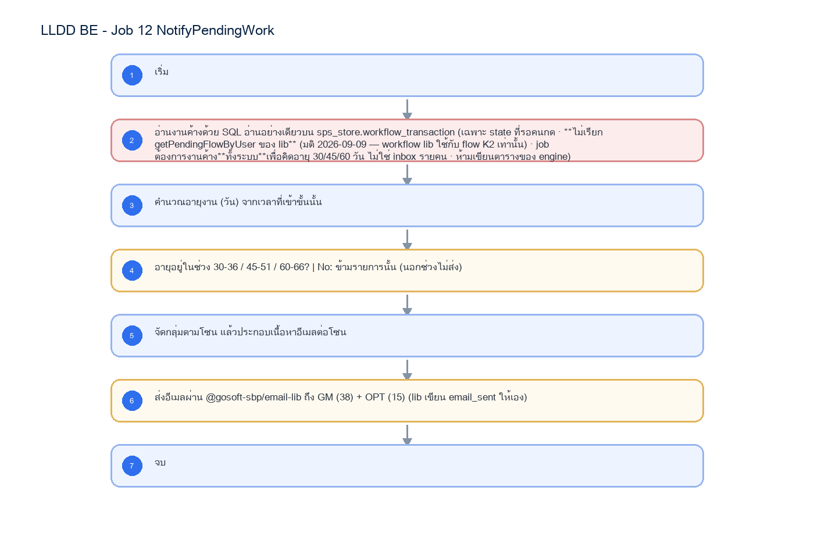
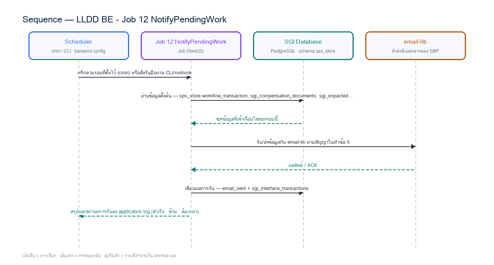

# LLDD BE - Job 12 NotifyPendingWork

SBP Mall - ระบบประกันรายได้ | Low Level Design Document

## 1. Overview

| รายการ | รายละเอียด |
| --- | --- |
| Track | BE |
| Estimate | **13 ชั่วโมง** = implementation 10 + unit test 3 (30%) |
| Owner | Aphiwit &lt;Bank&gt; Khammoon |
| Target repository | **`SBP/srm-sps-spsap-sop-sgi-batch`** (NestJS 11 + TypeORM · schema `sps_store` · **มติ 2026-09-02 — ย้ายมาจาก store-backend**) — batch runner ของ SBP ที่รันอยู่แล้ว 42 job บน **AWS Batch** · ลงทะเบียน job ใน `src/main.ts` แล้วรับ argument ผ่าน `JOB_NAME`/`INPUT` (local) หรือ `argv[3]`/`argv[2]` (AWS Batch) · **ไม่ผ่าน BFF และไม่เปิด HTTP** · ตารางเวลาเป็น AWS Batch scheduled event ไม่ใช่ `@Cron` · ดู `SBP/srm-sps-spsap-sop-sgi-batch.md` |
| Objective | เตือนงานค้าง + escalation (ช่วง 30-36 / 45-51 / 60-66 วัน): อ่านงานที่ค้างในขั้นรอดำเนินการของ workflow engine แล้วส่งอีเมลเตือนตามช่วงอายุงาน 30-36 / 45-51 / 60-66 วัน จัดกลุ่มตามโซนของร้านที่ถูกกระทบ ส่งถึง GM และหน่วยงานส่งเสริมธุรกิจ — ปิดช่องว่างที่ไม่มีเอกสารรองรับมาก่อน (มติ 2026-09-02) |

Common contract reference: ทุกหัวข้อ API/FE ต้องยึด LLDD-BE-API-Common-Contracts และ LLDD-FE-Integration-Contracts สำหรับ error/auth/format/pagination/action/RBAC ก่อนลงรายละเอียดเฉพาะหน้าหรือเฉพาะ endpoint

### 1.1 เอกสาร LLDD ที่เกี่ยวข้อง

ตารางนี้สร้างจาก endpoint และตารางที่เอกสารฉบับนี้ประกาศไว้จริง — อ่านฉบับที่อยู่ในตารางก่อนลงมือ เพื่อไม่ให้สัญญา request/response หรือชื่อคอลัมน์หลุดจากกัน

| ความสัมพันธ์ | เอกสาร LLDD | เกี่ยวข้องตรงไหน |
| --- | --- | --- |
| สัญญากลาง | **LLDD-BE-API-Common-Contracts** | envelope `{success,data}` · error code · pagination · รูปแบบวันที่/เลขเอกสาร |
| โครงสร้างข้อมูล | **LLDD-BE-Database-Structure** | DDL ของตารางที่หัวข้อ Reference DB Mapping อ้างถึง |
| แพลตฟอร์มระบบเดิม | **LLDD-BE-Integration-SBP-Platform** | header จาก BFF (`x-api-key` / `x-user-*`) · การ reuse ตารางและ service ของระบบ SBP เดิม |
| ต้องจบก่อน (ลำดับงาน) | **LLDD-BE-API-Common-Contracts** | เป็นฉบับต้นทางของสัญญา/โครงที่ฉบับนี้อ้าง |
| ต้องจบก่อน (ลำดับงาน) | **LLDD-BE-Job-8b-StartInternalWorkflow** | เป็นฉบับต้นทางของสัญญา/โครงที่ฉบับนี้อ้าง |

## 2. Screen / Functional Scope

- Main class/script: fgi.main.SendMailReport / FGI_SendMailReport.sh
- Phase: E
- Output: อีเมลเตือนงานค้าง แยกตามโซน 3 ช่วงอายุงาน
- Estimate: 10 ชั่วโมง
- Argument รับผ่าน `INPUT` (JSON) — local ใช้ env `JOB_NAME`/`INPUT` · AWS Batch ใช้ `argv[3]`/`argv[2]` · ดูหัวข้อ 5.95 · ไม่มีตาราง job_configs และไม่มีหน้าจอควบคุม (หน้า Flow Batch Job ในกลุ่มเมนู Flow เหลือแค่ Flowchart + Database ที่ใช้ · 2026-08-06)
- ตารางเวลาตั้งที่ **AWS Batch scheduled event** (repo ไม่มี `@Cron`) · ทุก job ถูกบันทึกลง `integration_log` โดย `main.ts` อัตโนมัติ + structured log `BATCH_START`/`BATCH_END` พร้อม `runId`

## 3. Screenshot Reference

ไม่มีภาพหน้าจอสำหรับหัวข้อนี้ — เป็นเอกสารฝั่ง Backend/Batch ที่ไม่มี UI (ภาพหน้าจอทั้งหมดอยู่ในเอกสารชุด FE)

## 4. Implementation Flow & Sequence Diagram (Reference)

### 4.1 Implementation Flow (ลำดับขั้นการทำงาน)



_รูปที่ 1: Implementation flow reference: LLDD BE - Job 12 NotifyPendingWork_

### 4.2 Sequence Diagram (ใครคุยกับใคร ลำดับไหน)

ผู้แสดงและลำดับข้อความในภาพนี้สร้างจาก endpoint ในหัวข้อ 7 และตารางในหัวข้อ Reference DB Mapping ของเอกสารฉบับนี้เอง จึงตรงกับสัญญาเสมอ



_รูปที่ 2: Sequence diagram: LLDD BE - Job 12 NotifyPendingWork_

## 5. Field, Format, and Validation

| Field / UI | Format | Validation | Behavior |
| --- | --- | --- | --- |
| กำหนดการรัน (Cron) | 0 10 * * 1 | แก้ไขได้ | ทุกวันจันทร์ 10:00 น. ตาม workflow.md |
| ช่วงอายุงานที่เตือน | 30-36 \| 45-51 \| 60-66 วัน | แก้ไขได้ | เป็นช่วง 7 วัน ไม่ใช่ ">= n วัน" — นอกช่วงไม่ส่งเลย (พฤติกรรมเดิมของ MailReportService.seperateDay) |
| กลุ่มผู้รับ | GM group 38 · OPT group 15 | แก้ไขได้ | business_user ของระบบ SBP เดิม |
| การจัดกลุ่ม | ตามโซนของร้านที่ถูกกระทบ (zone) | ค่าคงที่/แก้ผ่านหน้าจอไม่ได้ | 1 อีเมลต่อ 1 โซนต่อ 1 ช่วงอายุ |
| Template | EM-04 (เตือนรายสัปดาห์) · EM-05 (escalation) | แก้ไขได้ | ใช้ template ที่มีอยู่แล้วในชุด 8 ฉบับ — ไม่สร้าง EM ใหม่ · เลขจริงอ่านจาก mas_param · ระบบเดิมใช้ template 38 (EMAILTOSBP) |

### 5.9 Input / Progress / Output Contract

| Stage | Contract for implementation |
| --- | --- |
| Input | งานค้างในขั้นรอดำเนินการของ workflow engine + อายุงานเป็นวัน |
| Progress | อ่านงานค้างจาก engine, คำนวณอายุงาน, คัดเฉพาะช่วง 30-36 / 45-51 / 60-66 วัน, จัดกลุ่มตามโซน, ส่งอีเมลถึง GM และ OPT ต่อโซน |
| Output | อีเมลเตือนงานค้าง 1 ฉบับต่อโซนต่อช่วงอายุ พร้อมแถวใน email_sent |

### 5.90 Job 12 Execution Stages

อ่านงานค้างจาก engine, คำนวณอายุงาน, คัดเฉพาะช่วง 30-36 / 45-51 / 60-66 วัน, จัดกลุ่มตามโซน, ส่งอีเมลถึง GM และ OPT ต่อโซน

| Order | Service step | Repository | Output / failure contract |
| --- | --- | --- | --- |
| 1 | loadPendingWorkFromEngine | pendingWorkRepository | คืน metrics และ throw typed error; transaction/rerun ใช้ contract ด้านล่าง |
| 2 | bucketByAgeWindow | pendingWorkRepository | คืน metrics และ throw typed error; transaction/rerun ใช้ contract ด้านล่าง |
| 3 | groupByZone | pendingWorkRepository | คืน metrics และ throw typed error; transaction/rerun ใช้ contract ด้านล่าง |
| 4 | sendZoneEmails | pendingWorkRepository | คืน metrics และ throw typed error; transaction/rerun ใช้ contract ด้านล่าง |

### 5.91 Job 12 Run Evidence

| Evidence | Job-specific value | Acceptance |
| --- | --- | --- |
| Input identity | งานค้างในขั้นรอดำเนินการของ workflow engine + อายุงานเป็นวัน | snapshot input file/business key/period in run record |
| Output identity | อีเมลเตือนงานค้าง 1 ฉบับต่อโซนต่อช่วงอายุ พร้อมแถวใน email_sent | reconcile input, success, reject and skipped counts |
| Dedup proof | ส่งสัปดาห์ละครั้งตาม cron; รันซ้ำวันเดียวกันจะส่งซ้ำ — ถ้าต้องกันซ้ำให้ใช้ marker เดียวกับ Job 10 (last_notified_on) ซึ่งยังไม่มีในโครง (ดูช่องว่าง) | rerun fixture produces no duplicate target business key |
| Transaction proof | อ่านอย่างเดียว ไม่มี DB transaction; ส่งเมลล้มเหลวรายโซนต้องไม่ทำให้โซนอื่นไม่ได้รับ (รวบ error แล้วรายงานท้ายรอบ) | injected failure leaves no partial committed state outside documented boundary |
| Security proof | อ่าน business_user ของระบบเดิมได้เฉพาะคอลัมน์อีเมล/กลุ่ม; ห้าม log อีเมลผู้รับแบบเต็มใน application log | config/log/error contains no plaintext secret |

### 5.92 Legacy Java Source Reference

| Legacy file | Line range | Responsibility to carry forward |
| --- | --- | --- |
| fcsJar/src/th/co/gosoft/fgi/main/SendMailReport.java | 23-60 | Legacy main entrypoint — เรียก 3 ช่วง 30/45/60 ตามลำดับ |
| fcsJar/src/th/co/gosoft/fgi/service/MailReportService.java | 168-240 | seperateDay() คัดช่วงอายุงาน + sendEmail() จัดกลุ่มตามโซนและ resolve ผู้รับ GM/OPT |

Line ranges refer to the legacy Java implementation under /Users/bank_mac/gosoft/java/SBP/fcsJar. Use these ranges to preserve business behavior while implementing the target Node job.

### 5.93 Target Repository and SQL Contract

| Contract | Target implementation |
| --- | --- |
| Repository | pendingWorkRepository |
| Idempotency / dedup | ส่งสัปดาห์ละครั้งตาม cron; รันซ้ำวันเดียวกันจะส่งซ้ำ — ถ้าต้องกันซ้ำให้ใช้ marker เดียวกับ Job 10 (last_notified_on) ซึ่งยังไม่มีในโครง (ดูช่องว่าง) |
| Transaction boundary | อ่านอย่างเดียว ไม่มี DB transaction; ส่งเมลล้มเหลวรายโซนต้องไม่ทำให้โซนอื่นไม่ได้รับ (รวบ error แล้วรายงานท้ายรอบ) |
| Security | อ่าน business_user ของระบบเดิมได้เฉพาะคอลัมน์อีเมล/กลุ่ม; ห้าม log อีเมลผู้รับแบบเต็มใน application log |

#### Input / candidate query

```sql
-- bind ตามลำดับ: $1=sgi_version_id · $2=waiting_state_ids · $3=win_lo · $4=win_hi
SELECT d.doc_no, d.impact_process_id, d.current_section_code,
       ist.store_code AS impacted_store_code, ms.region AS zone_code,
       (CURRENT_DATE - date_trunc('day', w.update_date)::date) AS waiting_days
FROM sps_store.workflow_transaction w                 -- ⚠️ ไม่มี PK/index — ประเมินต้นทุน query ก่อนใช้
JOIN sgi_compensation_documents d ON d.id::text = w.reference_id
JOIN sgi_impacted_stores ist ON ist.store_code = d.impacted_store_code
JOIN mas_store ms ON ms.branch_id = ist.store_code
WHERE w.version_id = $1 /* sgi_version_id */
  AND w.current_state_id = ANY($2 /* waiting_state_ids */)     -- เฉพาะ state ที่รอคนกด (แทน stepID 501001 เดิม)
  -- ช่วงวันค้าง 3 ช่วงตาม FgiConstant (30-36 · 45-51 · 60-66)
  -- ⚠️ `BETWEEN ANY (...)` **ไม่ใช่ syntax ของ PostgreSQL** (แก้ 2026-09-04) — `ANY` ใช้ได้กับตัวเปรียบเทียบ
  --    เดี่ยว ๆ อย่าง `= ANY(...)` เท่านั้น · ช่วงหลายช่วงต้องกาง 2 อาร์เรย์แล้ว unnest คู่กัน
  AND EXISTS (
        SELECT 1
        FROM unnest($3 /* win_lo */::int[], $4 /* win_hi */::int[]) AS win(lo, hi)
        WHERE (CURRENT_DATE - date_trunc('day', w.update_date)::date) BETWEEN win.lo AND win.hi)
ORDER BY ms.region, waiting_days DESC;
```

#### Write / upsert query

```sql
-- job นี้ไม่เขียนตารางของ SGI เลย — email-lib เขียน email_sent ให้เอง
-- บันทึกผลการรันไปที่ integration_log ผ่าน main.ts (อัตโนมัติ) + structured log BATCH_END
```

### 5.94 Target Node Implementation

โครงสร้างนี้ระบุ service/repository เฉพาะงานและต้อง implement ตาม SQL, transaction, idempotency และ security contract ด้านบน โดยทุกขั้นต้องคืน metrics สำหรับ reconcile และ run history

```js
export async function runLlddBeJob12Notifypendingwork(ctx, services) {
  const run = await services.jobRuns.acquire({
    jobNo: "12", period: ctx.period, triggeredBy: ctx.triggeredBy
  });

  try {
    ctx = { ...ctx, runId: run.id, repository: services.pendingWorkRepository };
    const step1 = await services.loadPendingWorkFromEngine(ctx, undefined);
    const step2 = await services.bucketByAgeWindow(ctx, step1);
    const step3 = await services.groupByZone(ctx, step2);
    const step4 = await services.sendZoneEmails(ctx, step3);
    const result = step4;
    await services.jobRuns.finish(run.id, "SUCCESS", result.metrics);
    return { runId: run.id, status: "SUCCESS", ...result };
  } catch (error) {
    await services.jobRuns.finish(run.id, "FAILED", {
      errorCode: error.code ?? "JOB_FAILED",
      errorMessage: error.message
    });
    throw error;
  }
}
```

### 5.95 การลงทะเบียน job และ Arguments (sop-sgi-batch)

งานนี้ลงทะเบียนเป็น job ชื่อ **`sgi-notify-pending-work`** ใน `src/main.ts` ของ `SBP/srm-sps-spsap-sop-sgi-batch` โดยใช้ dispatcher เดิมของ repo (ไม่สร้าง runner ใหม่) — `main.ts` อ่านชื่อ job และ input มา 2 ทาง แล้วเลือกอัตโนมัติจากการมี `argv[3]` หรือไม่

| ช่องทางรัน | ชื่อ job มาจาก | input มาจาก | ตัวอย่าง |
| --- | --- | --- | --- |
| Local / CLI / runbook | env `JOB_NAME` | env `INPUT` (JSON string) | `JOB_NAME=sgi-notify-pending-work INPUT='{"asOfDate":"2026-06-15","windows":[[30,36],[45,51],[60,66]]}' npm run start` |
| AWS Batch (ตารางเวลาจริง) | `process.argv[3]` | `process.argv[2]` (JSON string) | `node dist/main.js '{"asOfDate":"2026-06-15","windows":[[30,36],[45,51],[60,66]]}' sgi-notify-pending-work` |

**ตารางเวลาไม่ได้อยู่ในโค้ด** — repo นี้ไม่มี `@Cron`/`@Interval` แม้แต่จุดเดียว (แม้ติดตั้ง `@nestjs/schedule` ไว้) cron ในหัวข้อ 5 เป็น **นิยามของ AWS Batch scheduled event** ที่ต้องตั้งตอน deploy ไม่ใช่ค่าที่อ่านจาก config file

#### Argument ที่รับได้ (`INPUT` เป็น JSON object · ไม่ส่ง = `{}`)

**ระบบเดิมรับ argument แบบนี้:** `SendMailReport.main` **ไม่รับ args** — เรียก `sendEmail(...)` 3 ครั้งตายตัวด้วย period `"30"`, `"45"`, `"60"`  
ของใหม่เปลี่ยนจาก positional string เป็น JSON เพื่อให้เพิ่มฟิลด์ได้โดยไม่พังของเดิม แต่ **ต้องรองรับทุกอย่างที่ระบบเดิมรับได้เป็นอย่างน้อย** — ห้ามลดความสามารถลง

| Field | ชนิด | ไม่ส่งแล้วได้อะไร (default) | Validation | ตรงกับ argument เดิม |
| --- | --- | --- | --- | --- |
| `asOfDate` | string | วันนี้ | `YYYY-MM-DD` · ใช้คำนวณอายุงาน | **ของใหม่** — เดิมใช้วันปัจจุบันเสมอ ทดสอบย้อนหลังไม่ได้ |
| `windows` | number[][] | `[[30,36],[45,51],[60,66]]` | คู่ `[เริ่ม,จบ]` · ต้องไม่ทับกัน · จบ ≥ เริ่ม | **ของใหม่** — เดิม hardcode ใน `FgiConstant` |
| `zones` | string[] | `null` = ทุกโซน | รหัสโซนต้องมีจริง | **ของใหม่** |
| `dryRun` | boolean | `false` | `true` = อ่าน/คำนวณครบแต่ไม่ commit และไม่ publish/ไม่ส่งไฟล์ | **ของกลาง** ทุก job |
| `limit` | number | `null` | จำกัดจำนวนรายการที่ประมวลผลรอบนี้ (ใช้ตอน smoke test) | **ของกลาง** ทุก job |

**กติกาการ validate ที่ทุก job ต้องทำเหมือนกัน** — parse `INPUT` ไม่สำเร็จ หรือฟิลด์ไม่ผ่าน validation ให้ log `BATCH_END` ด้วย `batchStatus: 'FAILED'` แล้ว `exit(1)` **ก่อนแตะฐานข้อมูล** (ห้าม fallback ไปค่า default เงียบ ๆ เมื่อผู้ใช้ตั้งใจส่งค่ามาแล้วผิด) · ฟิลด์ที่ไม่รู้จักให้ log warn แล้วข้าม ไม่ทำให้ job ล้ม

- `dryRun=true` ให้ประกอบเนื้อหาอีเมลครบแต่ **ไม่ส่งจริงและไม่เขียน `email_sent`** — ใช้ตรวจว่าคัดงานได้ตรงก่อนเปิดใช้

### 5.96 เงื่อนไขตัดสิน (Decision Rules) — ตัดสินจากอะไร

Job 12 ตัดสินเรื่องเดียวแต่พลาดง่ายที่สุดในชุด: **งานค้างกี่วันถึงจะเตือน** — ระบบเดิมใช้ "ช่วง 7 วัน" ไม่ใช่ "ครบ n วันขึ้นไป" ซึ่งเอกสารรุ่นก่อนเขียนผิดมาตลอด

| คำถามที่โค้ดต้องตอบ | ตัดสินจาก (ตาราง · คอลัมน์) | เงื่อนไขที่ต้องเป็นจริง | ไม่เข้าเงื่อนไขแล้วทำอะไร |
| --- | --- | --- | --- |
| งานค้างชิ้นนี้ต้องเตือนหรือไม่ | อายุงาน (วัน) นับจากเวลาที่เอกสารเข้าขั้นปัจจุบัน — `sps_store.workflow_transaction` | อายุต้องอยู่ใน **ช่วงใดช่วงหนึ่งของ 3 ช่วงนี้: `30-36` · `45-51` · `60-66` วัน** · **นอกช่วงไม่ส่งเลย** | ⚠️ ค้าง 37-44 · 52-59 · หรือ **67 วันขึ้นไป จะเงียบสนิท** — เป็นพฤติกรรมเดิม (`MailReportService.seperateDay` บรรทัด 177-183) ที่ผูกกับการรัน**สัปดาห์ละครั้ง** พอดี · เปลี่ยนความถี่การรันเมื่อไร **ต้องทบทวนช่วงพร้อมกัน** ไม่งั้นงานจะหลุดการเตือน |
| งานแบบไหนถึงนับ | `sps_store.workflow_transaction.current_state_id` เทียบกับชุด state ที่รอคนกด | เฉพาะเอกสารที่อยู่ใน **ขั้นรอดำเนินการ** (ระบบเดิมคือ `stepID = 501001`) — ระบบใหม่ต้อง map เป็นชุด state ของ engine กลางแล้วเก็บใน config | เอกสารที่จบแล้ว (`99`) หรืออยู่ระหว่างระบบทำงานเอง ไม่นับ |
| ส่งหาใคร | โซนของร้านที่ถูกกระทบ (`mas_store.region`) + `business_user` ของระบบ SBP เดิม | จัดกลุ่มตามโซนก่อน แล้วส่ง **1 ฉบับต่อโซนต่อช่วงอายุ** ถึง **GM group `38`** และ **OPT group `15`** | โซนที่ไม่มีผู้รับ = log warn แล้วข้ามโซนนั้น **ห้ามล้มทั้ง job** |

#### ⚠️ ช่องว่างของ schema ที่ต้องปิดก่อน implement เงื่อนไขข้างบนได้จริง

แถวในตารางนี้ไม่ใช่ "ข้อควรระวัง" แต่เป็น **ของที่ยังไม่มีในโครง 20 ตาราง** — เขียนโค้ดตามเงื่อนไขด้านบนแล้วจะ compile ไม่ผ่าน/คิวรีพังทันที

| # | สิ่งที่ขาด | ต้องทำอะไรก่อน |
| --- | --- | --- |
| **G7** ⏳ ต้องยืนยัน | ระบบเดิมใส่ **วันที่ พ.ศ.** ในอีเมล (`getCurrentBuddhistDate()`) ซึ่งขัดกับกติกา ค.ศ. ทั้งระบบ (มติ 2026-08-06) | ตัดสินว่าอีเมลจะคง พ.ศ. ตามของเดิม หรือเปลี่ยนเป็น ค.ศ. ให้ตรงทั้งระบบ — กระทบ template ที่ต้องเตรียม |
| **G8** ⏳ ต้องยืนยัน | ไม่มี marker กันส่งซ้ำเมื่อ rerun วันเดียวกัน (ต่างจาก Job 10 ที่มี `last_ack_notified_on`) | ถ้าต้องกันซ้ำ ต้องเพิ่มคอลัมน์/ตาราง marker · ถ้ายอมให้ส่งซ้ำได้ตอน rerun ให้ระบุไว้ใน runbook |

#### ค่าคงที่และโดเมนที่ใช้ในเงื่อนไขข้างบน

ทุกค่าในตารางนี้ต้องอ่านจาก config/env ไม่ hardcode ในคิวรี — แต่ **ค่าตั้งต้นต้องเท่าระบบเดิมทุกตัว** ไม่งั้นผลลัพธ์จะไม่ตรงกันตอนเทียบ UAT

| ค่า | โดเมน / ค่าที่ระบบเดิมใช้ | ที่มา |
| --- | --- | --- |
| ช่วงอายุงาน | `30-36` · `45-51` · `60-66` วัน (ช่วงละ 7 วัน) | `FgiConstant.THIRTYDAY/THIRTYSIX/FOURTYFIVEDAY/FIFTYONE/SIXTYDAY/SIXTYSIX` |
| กลุ่มผู้รับ | GM = `38` · OPT = `15` | `FgiConstant.GM_GROUP_ID` / `OPT_GROUP_ID` |
| ขั้นที่นับว่าค้าง | ระบบเดิม `stepID = 501001` | `FgiConstant.STEPIDWAIT` — ระบบใหม่ map เป็น state ของ `@srm/glb-workflow` |
| จังหวะรัน | ทุกวันจันทร์ 10:00 น. | `workflow.md` · ต้องสอดคล้องกับช่วง 7 วันข้างบน |

## 6. Button / User Action Mapping

| Action | Trigger | API / Service | Expected Result |
| --- | --- | --- | --- |
| รันตามตารางเวลา | CRON | scheduler → runner (job 12) | อ่าน cron/พารามิเตอร์จาก backend config |
| รันนอกรอบ (manual/rerun) | CLI | CLI/ops runbook → runner (job 12) | guard ไม่ให้รันซ้อนด้วย distributed lock |
| แก้พารามิเตอร์/เปิด-ปิด job | CONFIG | แก้ backend config แล้ว deploy | ไม่มี endpoint และไม่มีหน้าจอควบคุม — หน้า Flow Batch Job เป็น reference อย่างเดียว (2026-08-06) |
| ตรวจผลการรัน | LOG | application log (structured) | ไม่มีตาราง job_run_histories แล้ว · ไฟล์/ACK ดูที่ sgi_interface_transactions |

## 7. API Contract

**เอกสารฉบับนี้ไม่มี endpoint ของตัวเอง** — เป็นสัญญา/งานภายในที่เอกสารอื่นเรียกใช้ (ดูขอบเขตใน 5.90 Endpoint Implementation Contract) · รายการ endpoint ทั้ง 28 เส้นของ SGI อยู่ที่ **LLDD-API** และ `api.md`

## 8. Reference DB Mapping (No Database Page Work)

ส่วนนี้เป็นข้อมูลอ้างอิงสำหรับการ implement API/Job เท่านั้น ไม่ใช่งานสร้างหน้า Database, ไม่ใช่งานออกแบบ DB page และไม่ถูกนับเป็น deliverable แยกของ FE/BE

| Table / Object | R/W | Usage |
| --- | --- | --- |
| sps_store.workflow_transaction | R | งานค้างของ engine กลาง — ห้ามเขียน |
| sgi_compensation_documents | R | เลขเอกสาร · ร้าน · งวด สำหรับเนื้อหาอีเมล |
| sgi_impacted_stores | R | โซนของร้านที่ถูกกระทบ ใช้จัดกลุ่มผู้รับ |
| business_user (ระบบ SBP เดิม) | R | อีเมลของ GM group 38 และ OPT group 15 |
| email_sent (ระบบ SBP เดิม) | W (โดย @gosoft-sbp/email-lib) | lib เขียน log ให้เอง |

## 9. Skeleton Code (Batch Job 12)

### 9.1 ผังไฟล์ที่ต้องสร้าง (Job 12) — บน `srm-sps-spsap-sop-sgi-batch`

โครงไฟล์ของ Job 12 (fgi.main.SendMailReport เดิม) วางใต้ `src/modules/sgi/` ตาม convention ที่ repo นี้ใช้อยู่จริง (ดูตัวอย่างที่ `src/modules/performance/import-qssi.service.ts`): service ถือ logic ทั้งหมด, inject `DataSource`/repository ผ่าน TypeORM, ยิง raw SQL ได้ตรง, และ **ไม่มี controller** เพราะ repo นี้ไม่เปิด HTTP

**สิ่งที่ reuse ได้ทันที ไม่ต้องเขียนใหม่** — ต่างจากแผนเดิมที่ตั้งไว้บน store-backend ซึ่งต้องสร้าง runner ทั้งชุดเอง: `src/main.ts` (dispatcher + `BATCH_START`/`BATCH_END` + `runId` + log ลง `integration_log` อัตโนมัติ) · `src/modules/rabbitMQ/rabbitmq.service.ts` (`publishMessage`) · `src/shared/services/s3.service.ts` · `StatementService.decodeThaiFileContent()` (WINDOWS-874 auto-detect) · `@gosoft-sbp/email-lib` · `@srm/glb-log`

⚠️ **สิ่งที่ repo นี้ยังไม่มี และเป็นงานตั้งต้นจริง**: (1) ไม่มี `@Cron` เลย — ตารางเวลาต้องตั้งเป็น **AWS Batch scheduled event** (2) ไม่มี distributed lock (`pg_try_advisory_lock`) — การกันรันซ้อนพึ่ง AWS Batch queue ถ้างานไหนรับความเสี่ยงนี้ไม่ได้ต้องเพิ่มเอง (3) `publishMessage` เป็น fire-and-forget ไม่มี publisher confirm/outbox — งานที่ต้องการ **transactional outbox + ACK** (Job 6) ต้องสร้างกลไกเพิ่ม ไม่ใช่ reuse ตรง ๆ (4) ยังไม่มี entity/ตาราง `sgi_*` แม้แต่ตัวเดียว

| Path | หน้าที่ |
| --- | --- |
| src/modules/sgi/job-12-notify-pending-work.service.ts | คลาส `NotifyPendingWorkService` — **`execute(input)` เป็น entry point เดียว** เรียงตาม flow ของ Job 12 ทีละขั้น ครอบ transaction เอง และจบด้วย structured log สรุป metrics (แบบเดียวกับ `ImportQssiService.execute(body)` ที่มีอยู่) |
| src/modules/sgi/job-12-notify-pending-work.service.spec.ts | unit test ของ service — repo นี้วาง spec ไว้ข้างไฟล์จริงเสมอ (`jest` + `npm run test:ci` มี coverage/SonarQube) |
| src/modules/sgi/dto/job-12-notify-pending-work-input.dto.ts | DTO ของ `INPUT` (JSON) พร้อม `class-validator` ตามตารางในหัวข้อ 9.2 — parse ไม่ผ่านต้อง fail ก่อนแตะ DB |
| src/modules/sgi/sgi.module.ts | NestJS module ของกลุ่มงานประกันรายได้ — ผูก service ทุกตัวของ SGI เข้ากับ `TypeOrmModule` (ไฟล์ร่วมของทุก job ให้ merge ไม่ใช่เขียนทับ) |
| src/main.ts | **เพิ่ม `case 'sgi-job-12-notify-pending-work':`** ในสวิตช์เดิม → `await import('./modules/sgi/job-12-notify-pending-work.service')` แล้ว `app.get(NotifyPendingWorkService).execute(input)` (ไฟล์กลางของทุก job — เป็นจุด merge conflict ที่ต้องระวัง) |
| src/entities/sgi-*.entity.ts | entity ของตาราง `sgi_*` ที่หัวข้อ Reference DB Mapping อ้างถึง — **ยังไม่มีใน repo เลยสักตัว** ต้องสร้างใหม่ทั้งหมด |
| src/config/config.ts | เพิ่ม `export const sgiJob12Config` ตามแบบของไฟล์นี้ (โปรเจกต์ไม่ใช้ `registerAs`) — ค่าคงที่ทางธุรกิจของ Job 12 |

#### การลงทะเบียนใน `src/main.ts` (job `sgi-job-12-notify-pending-work`)

```js
// src/main.ts — เพิ่มเคสนี้ในสวิตช์เดิม (เรียงต่อจาก job ของ SGI ตัวก่อนหน้า)
      case 'sgi-job-12-notify-pending-work': {
        const { NotifyPendingWorkService } = await import('./modules/sgi/job-12-notify-pending-work.service');
        const job12notifypendingworkService = app.get(NotifyPendingWorkService);
        await job12notifypendingworkService.execute(input);   // input = JSON ที่ parse จาก INPUT/argv[2] แล้ว
        break;
      }
```

`main.ts` เรียก `StatementService.logInterfest('sgi-job-12-notify-pending-work', input)` ให้อยู่แล้วก่อนเข้าสวิตช์ → **ไม่ต้องเขียน log ลง `integration_log` เองซ้ำ** · และ `BATCH_END` ที่ท้ายไฟล์จะสรุป `batchStatus` + `durationMs` ให้อัตโนมัติ หน้าที่ของ service คือ throw เมื่อทำงานไม่สำเร็จเท่านั้น

### 9.2 Config Schema ของ Job 12 (backend config / env)

ตารางเวลาของ Job 12 คือ `0 10 * * 1` (ทุกวันจันทร์ 10:00 น.) — ⚠️ **ตัวจริงตั้งที่ AWS Batch scheduled event ไม่ใช่ในโค้ด** (repo นี้ไม่มี `@Cron` เลย) ค่า `SGI_JOB12_CRON` เก็บไว้เป็นเอกสารประกอบ/ตรวจสอบเท่านั้น · `SGI_JOB12_ENABLED=false` ให้ `execute()` จบทันทีแบบ SUCCESS พร้อม log เหตุผล (กันกรณี AWS Batch ยังยิงเข้ามา)

```ts
// src/config/config.ts — เพิ่มบล็อกนี้ต่อท้าย (repo ใช้ export const ไม่ใช้ registerAs)
// convention จริงของ sop-sgi-batch คือ `export const` ใน `src/config/config.ts` (ไม่ใช้ registerAs · ดูของเดิมที่
// `AppConfigModule` แบบ @Global แล้วอ่าน process.env ตรง ๆ) — โปรเจกต์นี้ **ไม่ได้ใช้ registerAs**
// แม้แต่จุดเดียว จึงประกาศเป็นคลาสให้รีวิว/ทดสอบเหมือน config ตัวอื่น
import { Injectable } from '@nestjs/common';

// TODO: Job 12 ไม่มีตาราง job_configs และไม่มี Job Admin API แล้ว (ตัดสินใจ 2026-08-06)
// TODO: ค่าทุกตัวอ่านจาก env/config file ของ backend เท่านั้น — เปลี่ยนค่า = แก้ config แล้ว deploy
export interface Job12Config {
  /** เปิด/ปิด job รอบถัดไปโดยไม่ต้อง deploy โค้ด */
  enabled: boolean;
  /** ตารางเวลาของ job นี้ — บันทึกไว้เพื่ออ้างอิงเท่านั้น ตัวจริงตั้งที่ AWS Batch scheduled event */
  cron: string;
  /** กำหนดการรัน (Cron) — ทุกวันจันทร์ 10:00 น. ตาม workflow.md */
  cron: string;
  /** ช่วงอายุงานที่เตือน — เป็นช่วง 7 วัน ไม่ใช่ ">= n วัน" — นอกช่วงไม่ส่งเลย (พฤติกรรมเดิมของ MailReportService.seperateDay) */
  param2: string;
  /** กลุ่มผู้รับ — business_user ของระบบ SBP เดิม */
  recipients: string;
  /** การจัดกลุ่ม — 1 อีเมลต่อ 1 โซนต่อ 1 ช่วงอายุ */
  param4: string;
  /** Template — ใช้ template ที่มีอยู่แล้วในชุด 8 ฉบับ — ไม่สร้าง EM ใหม่ · เลขจริงอ่านจาก mas_param · ระบบเดิมใช้ template 38 (EMAILTOSBP) */
  template: string;
  /** ผู้รับอีเมลเมื่อ job ล้มเหลว — เก็บเป็น string คั่น comma ให้ตรง signature ของ
      `EmailLibService.sendMail({ mailTo })` ที่รับ string ไม่ใช่ string[] */
  mailTo: string;
}

@Injectable()
export class SgiJob12Config implements Job12Config {
  // TODO: ยืนยันค่า default ทุกตัวกับ Ops ก่อนขึ้น production (ไม่มีหน้าจอแก้ค่าแล้ว)
  enabled = (process.env.SGI_JOB12_ENABLED ?? 'true') === 'true';
  cron = process.env.SGI_JOB12_CRON ?? '0 10 * * 1';
  cron = process.env.SGI_JOB12_CRON ?? '0 10 * * 1'; // TODO: แก้ผ่าน env/config file แล้ว deploy
  param2 = process.env.SGI_JOB12_PARAM2 ?? '30-36 | 45-51 | 60-66 วัน'; // TODO: แก้ผ่าน env/config file แล้ว deploy
  recipients = process.env.SGI_JOB12_RECIPIENTS ?? 'GM group 38 · OPT group 15'; // TODO: แก้ผ่าน env/config file แล้ว deploy
  param4 = process.env.SGI_JOB12_PARAM4 ?? 'ตามโซนของร้านที่ถูกกระทบ (zone)'; // TODO: ค่าคงที่ทางธุรกิจ — เปลี่ยนต้องผ่านการอนุมัติ
  template = process.env.SGI_JOB12_TEMPLATE ?? 'EM-04 (เตือนรายสัปดาห์) · EM-05 (escalation)'; // TODO: แก้ผ่าน env/config file แล้ว deploy
  mailTo = process.env.SGI_JOB12_MAIL_TO ?? ''; // TODO: ผู้รับอีเมลแจ้ง error คั่นด้วย comma (เดิม: -)
}

// TODO: เพิ่ม SgiJob12Config ใน providers/exports ของ AppConfigModule (@Global) เหมือน AppConfig
```

### 9.3 Job Class — `run(ctx)` ของ Job 12 ทีละขั้นตามผัง

#### 9.3.1 สัญญาของชั้นกลาง (`runner.ts`) + โครง service ของ Job 12

service อ้าง `JobRunContext` / `JobRunResult` / `JobState` / `JobFailedError` — ทั้งหมดนิยาม ครั้งเดียวใน `src/modules/sgi/sgi-job.types.ts` (ไฟล์ร่วมของทุก job ให้ merge ไม่ใช่เขียนทับ) และ service ต้องมี method ครบตามตารางขั้นตอนด้านล่าง มิฉะนั้น `execute(input)` จะเรียก method ที่ไม่มีอยู่

```ts
// src/modules/sgi/sgi-job.types.ts — สัญญากลางของทุก job ของ SGI (ประกาศครั้งเดียว ใช้ร่วมทั้ง 10 ฉบับ)

export interface JobRunContext {
  jobNo: string;
  period: string;        // YYYYMM ของงวดที่รัน
  triggeredBy: string;   // 'CRON' | userId ที่สั่งรันนอกรอบ
  params?: Record<string, string>;
}

export interface JobRunResult {
  event: 'job.finish';
  jobNo: string;
  jobName: string;
  status: 'SUCCESS' | 'SKIPPED' | 'SKIPPED_LOCKED' | 'FAILED';
  period: string;
  output: string;
  read: number; written: number; skipped: number; rejected: number;
  durationMs: number;
}

/** counter + ค่าที่ทุกขั้นของ job ใช้ร่วมกัน (service เป็นผู้สร้างผ่าน createState) */
export interface JobState {
  period: string;
  read: number; written: number; skipped: number; rejected: number;
  // TODO: เพิ่ม field เฉพาะของ job นี้ (เช่น rows ที่อ่านมา, path ไฟล์ที่เขียน)
  [key: string]: unknown;
}

/** error ที่ทำให้ job จบเป็น FAILED และส่งอีเมลแจ้งผู้ดูแล */
export class JobFailedError extends Error {
  constructor(public readonly code: string, message: string) { super(message); }
}

/** ใช้ออกจาก transaction เมื่อสาขา NO บอกให้ข้ามงวด/เรคคอร์ด — runner สรุปเป็น SKIPPED ไม่ใช่ FAILED */
export class JobSkippedError extends Error {}
```

```ts
// NotifyPendingWorkService — method ที่ job class เรียก (1 method ต่อ 1 ขั้นในตารางด้านบน)
import { Inject, Injectable } from '@nestjs/common';
import type { DataSource, EntityManager } from 'typeorm';
import type { JobRunContext, JobState } from '../../runner';
export type { JobState };

@Injectable()
export class NotifyPendingWorkService {
  constructor(@Inject('DATA_SOURCE') private readonly dataSource: DataSource) {}

  createState(ctx: JobRunContext): JobState {
    return { period: ctx.period, read: 0, written: 0, skipped: 0, rejected: 0 };
  }

  // อ่านงานค้างด้วย SQL อ่านอย่างเดียวบน sps_store.workflow_transaction
  async step02Read(state: JobState, manager?: EntityManager): Promise<void> {
    throw new Error('step02Read: ยังไม่ได้ implement — ดู SQL ที่หัวข้อ Repository / SQL และกติกาที่หัวข้อเงื่อนไขตัดสิน');
  }

  // คำนวณอายุงาน (วัน) จากเวลาที่เข้าขั้นนั้น
  async step03Calculate(state: JobState, manager?: EntityManager): Promise<void> {
    throw new Error('step03Calculate: ยังไม่ได้ implement — ดู SQL ที่หัวข้อ Repository / SQL และกติกาที่หัวข้อเงื่อนไขตัดสิน');
  }

  // อายุอยู่ในช่วง 30-36 / 45-51 / 60-66?
  //   เงื่อนไขจริง: ดูตารางในหัวข้อ "เงื่อนไขตัดสิน (Decision Rules)" ของเอกสารฉบับนี้
  async check04Condition(state: JobState): Promise<boolean> {
    throw new Error('check04Condition: ยังไม่ได้ implement — ห้าม deploy ทั้งที่ยังไม่เขียนเงื่อนไขจริง');
  }

  // จัดกลุ่มตามโซน แล้วประกอบเนื้อหาอีเมลต่อโซน
  async step05Notify(state: JobState, manager?: EntityManager): Promise<void> {
    throw new Error('step05Notify: ยังไม่ได้ implement — ดู SQL ที่หัวข้อ Repository / SQL และกติกาที่หัวข้อเงื่อนไขตัดสิน');
  }

  // ส่งอีเมลผ่าน @gosoft-sbp/email-lib ถึง GM (38) + OPT (15)
  async step06Notify(state: JobState, manager?: EntityManager): Promise<void> {
    throw new Error('step06Notify: ยังไม่ได้ implement — ดู SQL ที่หัวข้อ Repository / SQL และกติกาที่หัวข้อเงื่อนไขตัดสิน');
  }

}
```

#### 9.3.2 `run(ctx)` ของ Job 12

ทุกขั้นใน `run()` ตรงกับ flowchart ของ Job 12 หนึ่งต่อหนึ่ง (decision และ error path รวมอยู่ด้วย) — method ที่ต้อง implement ใน service ตามตารางนี้

| ลำดับ | ชนิด | ขั้นตอนจากผัง | Method ที่ต้อง implement | เส้นทาง NO / error |
| --- | --- | --- | --- | --- |
| 1 | start | เริ่ม | createState() | - |
| 2 | process | อ่านงานค้างด้วย SQL อ่านอย่างเดียวบน sps_store.workflow_transaction | step02Read() | throw JobFailedError เมื่อทำไม่สำเร็จ |
| 3 | process | คำนวณอายุงาน (วัน) จากเวลาที่เข้าขั้นนั้น | step03Calculate() | throw JobFailedError เมื่อทำไม่สำเร็จ |
| 4 | decision | อายุอยู่ในช่วง 30-36 / 45-51 / 60-66? | check04Condition() | [p] ข้ามรายการนั้น |
| 5 | process | จัดกลุ่มตามโซน แล้วประกอบเนื้อหาอีเมลต่อโซน | step05Notify() | throw JobFailedError เมื่อทำไม่สำเร็จ |
| 6 | io | ส่งอีเมลผ่าน @gosoft-sbp/email-lib ถึง GM (38) + OPT (15) | step06Notify() | throw JobFailedError เมื่อทำไม่สำเร็จ |
| 7 | end | จบ | summarize() | - |

```ts
// src/modules/sgi/job-12-notify-pending-work.service.ts — execute(input) เป็น entry point เดียว
import { Inject, Injectable, Logger } from '@nestjs/common';
import type { DataSource, EntityManager } from 'typeorm';
import { NotifyPendingWorkService, type JobState } from './job-12-notify-pending-work.service';
// 4 symbol นี้นิยามใน src/modules/sgi/sgi-job.types.ts (ไฟล์ร่วมของทุก job — ดูหัวข้อก่อนหน้า)
import { JobFailedError, JobSkippedError, JobRunContext, JobRunResult } from '../../runner';

@Injectable()
export class NotifyPendingWorkJob {
  static readonly jobNo = '12';
  private readonly logger = new Logger(NotifyPendingWorkJob.name);

  constructor(
    // TODO: repo นี้ตั้ง replication ใน typeorm.config.ts อยู่แล้ว — SELECT ไป slave, write ไป master อัตโนมัติ
    @Inject('DATA_SOURCE') private readonly dataSource: DataSource,
    private readonly service: NotifyPendingWorkService,
  ) {}

  async run(ctx: JobRunContext): Promise<JobRunResult> {
    const startedAt = Date.now();
    // TODO: state ถือ counter (read/written/skipped/rejected) และค่าจาก job12Config
    const state = this.service.createState(ctx);
    try {
      // === transaction boundary === TODO: ยืนยันขอบเขต transaction กับ BA
      await this.dataSource.transaction(async (manager: EntityManager) => {
        // ขั้นที่ 2: อ่านงานค้างด้วย SQL อ่านอย่างเดียวบน sps_store.workflow_transaction · TODO: เฉพาะ state ที่รอคนกด · **ไม่เรียก getPendingFlowByUser ของ lib** (มติ 2026-09-09 — workflow lib ใช้กับ flow K2 เท่านั้น) · job ต้องการงานค้าง**ทั้งระบบ**เพื่อคิดอายุ 30/45/60 วัน ไม่ใช่ inbox รายคน · ห้ามเขียนตารางของ engine
        await this.service.step02Read(state, manager);
        // ขั้นที่ 3: คำนวณอายุงาน (วัน) จากเวลาที่เข้าขั้นนั้น
        await this.service.step03Calculate(state, manager);
        // ขั้นที่ 4 (decision): อายุอยู่ในช่วง 30-36 / 45-51 / 60-66? · TODO: นอกช่วงไม่ส่ง
        const ok04 = await this.service.check04Condition(state);
        if (!ok04) { // NO → ข้ามรายการนั้น
          // TODO: เส้น NO ของขั้นนี้เป็น branch ระดับ record — ผังไม่ได้ระบุว่าหยุดหรือไปต่อ
          //   ถ้าเป็น 'ข้ามรายการ'      -> state.skipped += 1; แล้ว continue ในลูปของ record
          //   ถ้าเป็น 'ตั้งค่าแล้วไปต่อ' -> เรียก service ตั้งค่าสถานะ แล้วเดินขั้นถัดไป (ห้าม return)
          //   ถ้าเป็น 'คงสถานะเดิม/ไม่เปิดงาน' -> หยุดเฉพาะ record นี้ ห้ามไหลไปขั้นถัดไป
        }
        // ขั้นที่ 5: จัดกลุ่มตามโซน แล้วประกอบเนื้อหาอีเมลต่อโซน
        await this.service.step05Notify(state, manager);
        // ขั้นที่ 6: ส่งอีเมลผ่าน @gosoft-sbp/email-lib ถึง GM (38) + OPT (15) · TODO: lib เขียน email_sent ให้เอง
        await this.service.step06Notify(state, manager);
      });
      return this.summarize(state, 'SUCCESS', startedAt);
    } catch (error) {
      // TODO: error path ของ Job 12 — ตรวจ risk ในเอกสาร
      this.logger.error(JSON.stringify({ event: 'job.failed', jobNo: '12', period: ctx.period,
        triggeredBy: ctx.triggeredBy, durationMs: Date.now() - startedAt, error: (error as Error).message }));
      // TODO: แจ้งผู้ดูแลผ่าน JobFailureNotifier (หัวข้อ 9.6.1) — runner เป็นผู้เรียกให้
      throw error;
    }
  }

  private summarize(state: JobState, status: JobRunResult['status'], startedAt = Date.now()): JobRunResult {
    // TODO: structured log บรรทัดเดียวจบ — ไม่มีตาราง job_run_histories แล้ว (2026-08-06)
    const summary = {
      event: 'job.finish', jobNo: '12', jobName: 'NotifyPendingWork', status,
      period: state.period, output: 'อีเมลเตือนงานค้าง แยกตามโซน 3 ช่วงอายุงาน',
      read: state.read, written: state.written, skipped: state.skipped,
      rejected: state.rejected, durationMs: Date.now() - startedAt,
    };
    this.logger.log(JSON.stringify(summary));
    return summary as JobRunResult;
  }
}
```

### 9.4 การกันรันซ้อนของ Job 12 (PostgreSQL advisory lock — **ของใหม่**)

Job 12 ต้องกันรันซ้อนทั้งกรณี cron ซ้อนกับ manual rerun และกรณีหลาย pod — runner ล็อกด้วย `pg_try_advisory_lock` ก่อนเริ่มขั้นแรกเสมอ และรอบที่ล็อกไม่ได้ให้จบด้วยสถานะ SKIPPED_LOCKED (ไม่ใช่ FAILED)

```ts
// src/modules/sgi/sgi-job.lock.ts (ของใหม่ — repo นี้ยังไม่มีกลไกกันรันซ้อนใด ๆ)
import { Inject, Injectable, Logger } from '@nestjs/common';
import type { DataSource } from 'typeorm';

// TODO: ห้ามใช้แถวสถานะ RUNNING ในตารางเป็นตัวกัน (ไม่มีตาราง job_run_histories แล้ว)
//       ใช้ PostgreSQL advisory lock ระดับ session แทน — ปลดอัตโนมัติเมื่อ connection หลุด
export const SGI_JOB_LOCK_CLASS_ID = 861000; // namespace ของระบบ SGI
export const JOB_LOCK_KEYS: Record<string, number> = { '12': 120 /* TODO: เพิ่มให้ครบทุก job */ };

@Injectable()
export class BatchRunner {
  private readonly logger = new Logger(BatchRunner.name);
  constructor(@Inject('DATA_SOURCE') private readonly dataSource: DataSource) {}

  async runExclusive<T>(jobNo: string, fn: () => Promise<T>): Promise<T | { status: 'SKIPPED_LOCKED' }> {
    // TODO: ต้องใช้ QueryRunner (connection เดียวบน master) — dataSource.query() ของโปรเจกต์นี้
    //       route SQL ที่ขึ้นต้นด้วย SELECT ไป slave pool ทำให้ lock ไปตกที่ replica คนละ connection
    const runner = this.dataSource.createQueryRunner('master');
    await runner.connect();
    const objectId = JOB_LOCK_KEYS[jobNo];
    try {
      const [{ locked }] = await runner.query(
        'SELECT pg_try_advisory_lock($1, $2) AS locked',
        [SGI_JOB_LOCK_CLASS_ID, objectId],
      );
      if (!locked) {
        // TODO: รอบนี้ข้ามไปเฉย ๆ ไม่ถือเป็น error และไม่ต้องส่งอีเมล
        this.logger.warn(JSON.stringify({ event: 'job.skipped.locked', jobNo }));
        return { status: 'SKIPPED_LOCKED' };
      }
      return await fn();
    } finally {
      // TODO: ปลด lock ทุกกรณี แล้วคืน connection เข้า pool
      await runner.query('SELECT pg_advisory_unlock($1, $2)', [SGI_JOB_LOCK_CLASS_ID, objectId]);
      await runner.release();
    }
  }
}
```

### 9.5 Repository / SQL หลักของ Job 12

repository ของ Job 12 ประกาศเป็น factory provider (`{provide: 'NOTIFY_PENDING_WORK_REPOSITORY', useFactory: (ds) => ds.getRepository(Entity), inject: [DataSource]}`) แล้วยิง raw SQL ตามแบบ module ธุรกิจอื่นของ store-backend (schema `sps_store` มาจาก search_path)

| ตาราง | R/W | การใช้งานตามผัง | หมายเหตุ target design |
| --- | --- | --- | --- |
| sps_store.workflow_transaction | R | งานค้างของ engine กลาง — ห้ามเขียน | เขียน SQL ตรงผ่าน DATA_SOURCE |
| sgi_compensation_documents | R | เลขเอกสาร · ร้าน · งวด สำหรับเนื้อหาอีเมล | เขียน SQL ตรงผ่าน DATA_SOURCE |
| sgi_impacted_stores | R | โซนของร้านที่ถูกกระทบ ใช้จัดกลุ่มผู้รับ | เขียน SQL ตรงผ่าน DATA_SOURCE |
| business_user (ระบบ SBP เดิม) | R | อีเมลของ GM group 38 และ OPT group 15 | เขียน SQL ตรงผ่าน DATA_SOURCE |
| email_sent (ระบบ SBP เดิม) | W (โดย @gosoft-sbp/email-lib) | lib เขียน log ให้เอง | เขียน SQL ตรงผ่าน DATA_SOURCE |

```sql
-- Job 12 NotifyPendingWork — query หลักที่ต้อง implement
-- TODO: ทุก statement รันผ่าน DATA_SOURCE (SELECT ไป slave, write ไป master) และ
--       write ทั้งหมดต้องอยู่ใน transaction เดียวกับที่ระบุใน 9.3

-- [R] sps_store.workflow_transaction : งานค้างของ engine กลาง — ห้ามเขียน
-- คอลัมน์มาจาก DDL จริงของตารางนี้ (ห้าม SELECT *) · ตรวจว่ามี index รองรับ WHERE ก่อนขึ้น prod
SELECT transaction_id, version_id, reference_id, current_state_id, current_approver, approver_type, current_status_id, data_json, update_date   -- คอลัมน์จริงจาก SBP/db-schema-sps_store.md (ทั้งตารางมี 9 คอลัมน์) · ตัดที่ job นี้ไม่ได้ใช้ออก
  FROM sps_store.workflow_transaction
 WHERE version_id = $1 AND current_state_id = ANY($2)
   -- ⚠️ ตารางนี้ไม่มี PK และไม่มี index เลย (19,283 แถว) — ประเมินต้นทุน query ก่อนใช้
 ORDER BY transaction_id   -- ตารางระบบเดิมไม่มี PK ที่ประกาศไว้ · ใช้คอลัมน์นี้ให้ลำดับคงที่
 LIMIT $3 OFFSET $4;  -- อ่านเป็น chunk กัน memory บวม

-- [R] sgi_compensation_documents : เลขเอกสาร · ร้าน · งวด สำหรับเนื้อหาอีเมล
-- คอลัมน์มาจาก DDL จริงของตารางนี้ (ห้าม SELECT *) · ตรวจว่ามี index รองรับ WHERE ก่อนขึ้น prod
SELECT id, account_month, account_year, allmap_url, approver_snapshot, created_at, created_by, current_section_code, doc_no, impact_month, impact_process_id, impacted_store_code   -- ตัดคอลัมน์ที่ job นี้ไม่ได้ใช้ออก (ทั้งตารางมี 25 คอลัมน์)
  FROM sgi_compensation_documents
 WHERE impact_month = $1  -- คอลัมน์งวดจริงของตารางนี้ตาม DDL
 ORDER BY id   -- PK ทำให้ลำดับคงที่ระหว่างแบ่งหน้า
 LIMIT $2 OFFSET $3;  -- อ่านเป็น chunk กัน memory บวม

-- [R] sgi_impacted_stores : โซนของร้านที่ถูกกระทบ ใช้จัดกลุ่มผู้รับ
-- คอลัมน์มาจาก DDL จริงของตารางนี้ (ห้าม SELECT *) · ตรวจว่ามี index รองรับ WHERE ก่อนขึ้น prod
SELECT store_code, dv_code, is_active, latitude, longitude, opt_dv_user_id, transfer_sbp_date, updated_at   -- ตัดคอลัมน์ที่ job นี้ไม่ได้ใช้ออก (ทั้งตารางมี 8 คอลัมน์)
  FROM sgi_impacted_stores
 WHERE store_code = $1   -- คีย์ที่ job นี้ใช้คัดแถว (ตารางนี้ไม่มีคอลัมน์งวดของตัวเอง)
 ORDER BY store_code   -- PK ทำให้ลำดับคงที่ระหว่างแบ่งหน้า
 LIMIT $2 OFFSET $3;  -- อ่านเป็น chunk กัน memory บวม

-- [R] business_user (ระบบ SBP เดิม) : อีเมลของ GM group 38 และ OPT group 15
-- คอลัมน์มาจาก DDL จริงของตารางนี้ (ห้าม SELECT *) · ตรวจว่ามี index รองรับ WHERE ก่อนขึ้น prod
SELECT user_name, user_id, group_id, title_code, first_name, last_name, pop3, smtp, email, update_date, update_user, franchisee_id   -- คอลัมน์จริงจาก SBP/db-schema-sps_store.md (ทั้งตารางมี 34 คอลัมน์) · ตัดที่ job นี้ไม่ได้ใช้ออก
  FROM business_user
 WHERE group_id IN ($1 /* GM_GROUP_ID = 38 */, $2 /* OPT_GROUP_ID = 15 */)
   AND email IS NOT NULL AND email <> ''
 ORDER BY user_id   -- ตารางระบบเดิมไม่มี PK ที่ประกาศไว้ · ใช้คอลัมน์นี้ให้ลำดับคงที่
 LIMIT $3 OFFSET $4;  -- อ่านเป็น chunk กัน memory บวม
```

### 9.6 การแจ้งเตือนและการรันซ้ำของ Job 12

#### 9.6.1 อีเมลแจ้งผู้ดูแลเมื่อ job ล้มเหลว

ใช้ `EmailLibService` จาก `@gosoft-sbp/email-lib` ตัวเดียวกับที่ระบบเดิมใช้ (inform-evaluate / external-audit / statement PTT) — ไม่สร้างกลไกส่งเมลใหม่

```ts
// src/modules/sgi/sgi-job-failure.notifier.ts (ใช้ @gosoft-sbp/email-lib ที่ repo มีอยู่แล้ว)
import { Injectable, Logger } from '@nestjs/common';
// ชื่อ method ของ lib ที่ repo นี้เรียกจริงคือ `sendMail` (ไม่ใช่ sendEmail) และ
// `mailTo` / `mailCc` เป็น **string** คั่นด้วย comma — ดู evaluation-process.service.ts,
// external-audit.service.ts, statement.service.ts, inform-evaluate.service.ts, performance.service.ts
import { EmailLibService } from '@gosoft-sbp/email-lib';
import type { JobRunContext } from './runner';

@Injectable()
export class JobFailureNotifier {
  private readonly logger = new Logger(JobFailureNotifier.name);
  // TODO: ใช้ lib อีเมลของระบบเดิม — template อยู่ในตาราง email_template และ log ลง email_sent อัตโนมัติ
  //       (ตั้งชื่อ property ว่า mailService ตาม call site เดิมของ sop-sgi-batch)
  constructor(private readonly mailService: EmailLibService) {}

  async notifyFailure(jobNo: string, ctx: JobRunContext, error: Error): Promise<void> {
    // TODO: ผู้รับของ Job 12 เดิมคือ - — ย้ายมาเป็น env SGI_JOB12_MAIL_TO
    const recipients = (process.env.SGI_JOB12_MAIL_TO ?? '').split(',').map((s) => s.trim()).filter(Boolean);
    if (!recipients.length) {
      this.logger.warn(JSON.stringify({ event: 'job.mail.skipped', jobNo, reason: 'NO_RECIPIENT' }));
      return;
    }
    try {
      await this.mailService.sendMail({
        // TODO: emailId = id ของ template EM-07 (แจ้ง error batch) ในตาราง email_template
        emailId: Number(process.env.SGI_JOB_FAIL_EMAIL_TEMPLATE_ID),
        mailTo: recipients.join(','), // signature รับ string ไม่ใช่ string[]
        mailCc: '',
        param: {
          jobNo, jobName: 'NotifyPendingWork',
          jobTitle: 'เตือนงานค้าง + escalation (ช่วง 30-36 / 45-51 / 60-66 วัน)',
          period: ctx.period, triggeredBy: ctx.triggeredBy,
          output: 'อีเมลเตือนงานค้าง แยกตามโซน 3 ช่วงอายุงาน',
          errorMessage: error.message,
          rerunNote: '',
        },
      });
    } catch (mailError) {
      // TODO: ส่งเมลไม่สำเร็จห้ามกลบ error เดิมของ job — log แล้วปล่อยผ่าน
      this.logger.error(JSON.stringify({ event: 'job.mail.failed', jobNo, error: (mailError as Error).message }));
    }
  }
}
```

#### 9.6.2 Checklist การ rerun

- กติกา rerun ของ Job 12: รันซ้ำได้แบบ idempotent — กันซ้ำด้วย business key ของรอบนั้น
- ขอบเขต transaction ที่ต้องรักษาเมื่อรันซ้ำ: ยังไม่ระบุ
- ความเสี่ยงที่ต้องตรวจก่อน/หลังรันซ้ำ: ยังไม่ระบุ
- ตรวจว่ารอบก่อนหน้าไม่ได้ค้าง lock อยู่ (`SELECT * FROM pg_locks WHERE locktype = 'advisory'`) ก่อนสั่งรันนอกรอบ
- สั่งรันนอกรอบผ่าน CLI/runbook เท่านั้น (ไม่มีหน้าจอและไม่มี Job Admin API): `node dist/batch/cli.js --job=12 --period=&lt;YYYYMM&gt;`
- หลังรันซ้ำ ตรวจ output `อีเมลเตือนงานค้าง แยกตามโซน 3 ช่วงอายุงาน` และ log บรรทัด `job.finish` ว่า read/written/skipped/rejected ตรงกับที่คาด
- ถ้ารอบก่อนล้มเหลวกลางทาง ตรวจ `sgi_interface_transactions` ของงวดนั้นว่ามีแถวค้างสถานะ READY/PENDING หรือไม่ ก่อนสั่งรันใหม่

## 10. Processing Flow

| Step | Description |
| --- | --- |
| 1 | เริ่ม |
| 2 | อ่านงานค้างด้วย SQL อ่านอย่างเดียวบน sps_store.workflow_transaction (เฉพาะ state ที่รอคนกด · **ไม่เรียก getPendingFlowByUser ของ lib** (มติ 2026-09-09 — workflow lib ใช้กับ flow K2 เท่านั้น) · job ต้องการงานค้าง**ทั้งระบบ**เพื่อคิดอายุ 30/45/60 วัน ไม่ใช่ inbox รายคน · ห้ามเขียนตารางของ engine) |
| 3 | คำนวณอายุงาน (วัน) จากเวลาที่เข้าขั้นนั้น |
| 4 | อายุอยู่ในช่วง 30-36 / 45-51 / 60-66? \| No: ข้ามรายการนั้น (นอกช่วงไม่ส่ง) |
| 5 | จัดกลุ่มตามโซน แล้วประกอบเนื้อหาอีเมลต่อโซน |
| 6 | ส่งอีเมลผ่าน @gosoft-sbp/email-lib ถึง GM (38) + OPT (15) (lib เขียน email_sent ให้เอง) |
| 7 | จบ |

## 11. Acceptance Criteria

- พารามิเตอร์รับผ่าน `INPUT` (JSON) และ config ของ repo — เปลี่ยนค่าโดย deploy ไม่ใช่ผ่าน API/หน้าจอ · **ตารางเวลาตั้งที่ AWS Batch scheduled event ไม่ใช่ `@Cron` ในโค้ด**
- การรันต้องตรวจ enabled flag ใน config · **การกันรันซ้อนพึ่ง AWS Batch queue เป็นหลัก** — advisory lock เป็นของใหม่ที่ต้องสร้างเองถ้างานนั้นรับความเสี่ยงรันซ้อนไม่ได้
- ทุกรอบต้องเขียน application log แบบ structured (`BATCH_START`/`BATCH_END` + `runId` — `src/main.ts` ทำให้แล้ว) และบันทึกลง `integration_log` อัตโนมัติ · error ต้องส่ง EM-07
- DB/table mapping ใช้เป็น reference สำหรับ implement Job เท่านั้น ไม่ใช่งานสร้างหน้า Database
- รองรับ rerun rule และ risk note ตาม runbook

## 12. Developer Test Checklist

| No | Test |
| --- | --- |
| 1 | รันตามตารางเวลาแล้วผลถูกต้องบน fixture |
| 2 | รันนอกรอบผ่าน CLI ได้ผลเดียวกับ cron |
| 3 | สั่งรันซ้อนขณะกำลังรัน → runner ปฏิเสธ (lock ทำงาน) |
| 4 | แก้ config แล้ว deploy → รอบถัดไปใช้ค่าใหม่ |
| 5 | job throw error → EM-07 ออก และ log มีบรรทัด error |
| 6 | ตรวจผลกระทบตารางตาม R/W mapping reference |

## 13. Unit Test Scope

**3 ชั่วโมง** (30% ของ implementation 10 ชั่วโมง) · เครื่องมือ: Jest + mock repository/DataSource (ไม่ต่อ DB จริง)

หัวข้อนี้คือ **unit test** ที่ต้องเขียนคู่กับโค้ด — ต่างจาก *Developer Test Checklist* ซึ่งเป็น scenario ระดับ end-to-end/manual ที่ใช้ตอนตรวจรับ · รายการด้านล่าง derive จาก field/validation, acceptance criteria, endpoint และตารางที่เอกสารนี้เขียน

| สิ่งที่ทดสอบ | ประเภท | เกณฑ์ผ่าน |
| --- | --- | --- |
| business rule | logic | พารามิเตอร์รับผ่าน `INPUT` (JSON) และ config ของ repo — เปลี่ยนค่าโดย deploy ไม่ใช่ผ่าน API/หน้าจอ · **ตารางเวลาตั้งที่ AWS Batch scheduled event ไม่ใช่ `@Cron` ในโค้ด** |
| business rule | logic | การรันต้องตรวจ enabled flag ใน config · **การกันรันซ้อนพึ่ง AWS Batch queue เป็นหลัก** — advisory lock เป็นของใหม่ที่ต้องสร้างเองถ้างานนั้นรับความเสี่ยงรันซ้อนไม่ได้ |
| business rule | logic | ทุกรอบต้องเขียน application log แบบ structured (`BATCH_START`/`BATCH_END` + `runId` — `src/main.ts` ทำให้แล้ว) และบันทึกลง `integration_log` อัตโนมัติ · error ต้องส่ง EM-07 |
| business rule | logic | DB/table mapping ใช้เป็น reference สำหรับ implement Job เท่านั้น ไม่ใช่งานสร้างหน้า Database |
| business rule | logic | รองรับ rerun rule และ risk note ตาม runbook |
| `email_sent (ระบบ SBP เดิม)` | transaction | จำลอง error กลางทาง แล้วยืนยันว่า rollback ครบ ไม่เหลือแถวค้าง (mock DataSource/QueryRunner) |
| runner | idempotency | รันซ้ำด้วย fixture เดิมต้องไม่เกิดแถวซ้ำ (ON CONFLICT / business unique key ทำงาน) |
| runner | lock | เรียกซ้อนขณะกำลังรัน ต้องถูกปฏิเสธด้วย advisory lock |

- ทุกเคสต้องรันได้โดยไม่ต่อ DB/บริการภายนอกจริง — mock ที่ขอบ repository/client เสมอ
- ข้อความไทยที่ยืนยันในเทสต้องเป็น verbatim ตาม SRS ห้ามพิมพ์ใหม่
- เกณฑ์ผ่านของ CI: ทุกเคสในตารางนี้มี test จริงและผ่านทั้งหมด
