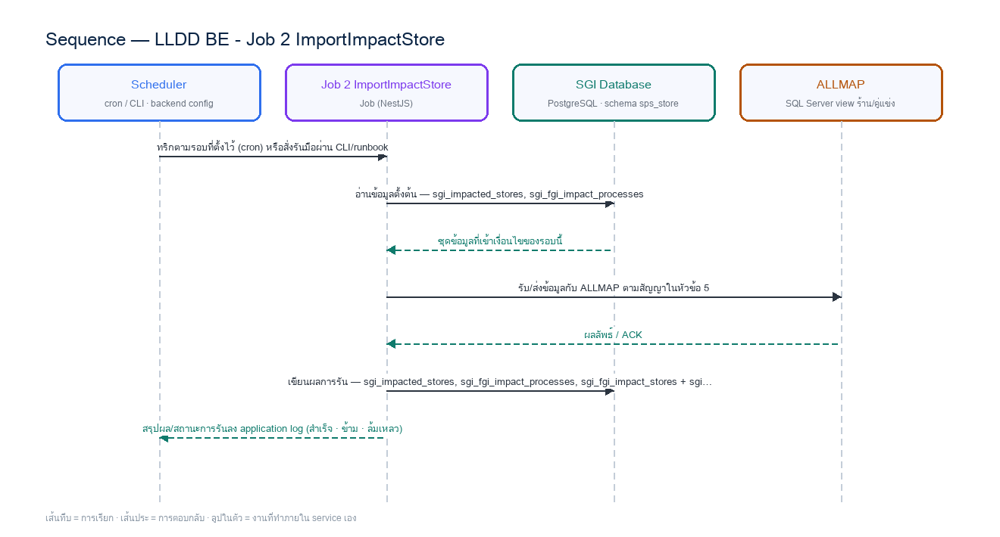

# LLDD BE - Job 2 ImportImpactStore

SBP Mall - ระบบประกันรายได้ | Low Level Design Document

## 1. Overview

| รายการ | รายละเอียด |
| --- | --- |
| Track | BE |
| Estimate | **20 ชั่วโมง** = implementation 15 + unit test 5 (30%) |
| Owner | Aphiwit &lt;Bank&gt; Khammoon |
| Target repository | **`SBP/srm-sps-spsap-sop-sgi-batch`** (NestJS 11 + TypeORM · schema `sps_store` · **มติ 2026-09-02 — ย้ายมาจาก store-backend**) — batch runner ของ SBP ที่รันอยู่แล้ว 42 job บน **AWS Batch** · ลงทะเบียน job ใน `src/main.ts` แล้วรับ argument ผ่าน `JOB_NAME`/`INPUT` (local) หรือ `argv[3]`/`argv[2]` (AWS Batch) · **ไม่ผ่าน BFF และไม่เปิด HTTP** · ตารางเวลาเป็น AWS Batch scheduled event ไม่ใช่ `@Cron` · ดู `SBP/srm-sps-spsap-sop-sgi-batch.md` |
| Objective | นำเข้าคู่ร้านถูกกระทบจาก ALLMAP: นำคู่ร้านถูกกระทบ–ร้านเปิดใหม่จากวิว ALLMAP เข้า sgi_fgi_impact_stores เติมข้อมูลจากตาราง master แล้วใช้กฎ DENY และ ON_PROCESS ตั้งค่า sales_request_status เป็น W / N / P |

Common contract reference: ทุกหัวข้อ API/FE ต้องยึด LLDD-BE-API-Common-Contracts และ LLDD-FE-Integration-Contracts สำหรับ error/auth/format/pagination/action/RBAC ก่อนลงรายละเอียดเฉพาะหน้าหรือเฉพาะ endpoint

### 1.1 เอกสาร LLDD ที่เกี่ยวข้อง

ตารางนี้สร้างจาก endpoint และตารางที่เอกสารฉบับนี้ประกาศไว้จริง — อ่านฉบับที่อยู่ในตารางก่อนลงมือ เพื่อไม่ให้สัญญา request/response หรือชื่อคอลัมน์หลุดจากกัน

| ความสัมพันธ์ | เอกสาร LLDD | เกี่ยวข้องตรงไหน |
| --- | --- | --- |
| สัญญากลาง | **LLDD-BE-API-Common-Contracts** | envelope `{success,data}` · error code · pagination · รูปแบบวันที่/เลขเอกสาร |
| โครงสร้างข้อมูล | **LLDD-BE-Database-Structure** | DDL ของตารางที่หัวข้อ Reference DB Mapping อ้างถึง |
| แพลตฟอร์มระบบเดิม | **LLDD-BE-Integration-SBP-Platform** | header จาก BFF (`x-api-key` / `x-user-*`) · การ reuse ตารางและ service ของระบบ SBP เดิม |
| ต้องจบก่อน (ลำดับงาน) | **LLDD-BE-API-Common-Contracts** | เป็นฉบับต้นทางของสัญญา/โครงที่ฉบับนี้อ้าง |

## 2. Screen / Functional Scope

- Main class/script: fgi.main.ImportImpactStore / FGI_ImportImpactStore.sh
- Phase: A
- Output: sgi_fgi_impact_stores
- Estimate: 15 ชั่วโมง
- Argument รับผ่าน `INPUT` (JSON) — local ใช้ env `JOB_NAME`/`INPUT` · AWS Batch ใช้ `argv[3]`/`argv[2]` · ดูหัวข้อ 5.95 · ไม่มีตาราง job_configs และไม่มีหน้าจอควบคุม (หน้า Flow Batch Job ในกลุ่มเมนู Flow เหลือแค่ Flowchart + Database ที่ใช้ · 2026-08-06)
- ตารางเวลาตั้งที่ **AWS Batch scheduled event** (repo ไม่มี `@Cron`) — **ยกเว้น job ที่เป็น event-driven (ดูหัวข้อ Config Schema ของ job นั้น) ซึ่งห้ามตั้ง schedule** · ทุก job ถูกบันทึกลง `integration_log` โดย `main.ts` อัตโนมัติ + structured log `BATCH_START`/`BATCH_END` พร้อม `runId`

## 3. Screenshot Reference

ไม่มีภาพหน้าจอสำหรับหัวข้อนี้ — เป็นเอกสารฝั่ง Backend/Batch ที่ไม่มี UI (ภาพหน้าจอทั้งหมดอยู่ในเอกสารชุด FE)

## 4. Implementation Flow & Sequence Diagram (Reference)

### 4.1 Implementation Flow (ลำดับขั้นการทำงาน)


_รูปที่ 1: Implementation flow reference: LLDD BE - Job 2 ImportImpactStore_

### 4.2 Sequence Diagram (ใครคุยกับใคร ลำดับไหน)

ผู้แสดงและลำดับข้อความในภาพนี้สร้างจาก endpoint ในหัวข้อ 7 และตารางในหัวข้อ Reference DB Mapping ของเอกสารฉบับนี้เอง จึงตรงกับสัญญาเสมอ



_รูปที่ 2: Sequence diagram: LLDD BE - Job 2 ImportImpactStore_

## 5. Field, Format, and Validation

| Field / UI | Format | Validation | Behavior |
| --- | --- | --- | --- |
| กำหนดการรัน (Cron) | 0 07 7 * * | แก้ไขได้ | ทุกวันที่ 7 ของเดือน เวลา 07:00 |
| Argument (ขอบเขต\|งวด) | ALL\|2569\|06 | แก้ไขได้ | รูปแบบ ZONES\|YYYY\|MM หรือ ALL\|YYYY\|MM — ไม่ระบุจะใช้งวดตาม modifyDateToString · ⚠️ ปีในตัวอย่างเป็น พ.ศ. (2569) ตามค่าที่ระบบเดิมใช้กับวิว ALLMAP ซึ่งขัดกับกติกา ค.ศ. ทั้งระบบ (มติ 2026-08-06) — ค่าที่ส่งเข้าวิว ALLMAP คงรูปแบบเดิมของวิว ส่วนค่าที่เขียนลงตารางของ SGI ต้องแปลงเป็น ค.ศ. ทุกครั้ง |
| Source View | allmapssa.SEVEN_IMPACT_VIEW (SQL Server GSMALLMAP) | ค่าคงที่/แก้ผ่านหน้าจอไม่ได้ | dedup ด้วย ROW_NUMBER |
| Branch Type ที่เข้าเกณฑ์ | B, FAM, FB1, FB2, FC1, FVB, FVC, FPT1 | ค่าคงที่/แก้ผ่านหน้าจอไม่ได้ | FPT1 เข้าเกณฑ์เฉพาะเมื่อ SBP_CANCEL_TYPE_I = 06 |
| กฎ DENY (ตรวจก่อน ON_PROCESS) | สาขา N=F / juristic เดียวกัน / สัญญาไม่คลุมงวด / เก่ากว่า 12 เดือน | ค่าคงที่/แก้ผ่านหน้าจอไม่ได้ |  |
| PK Sequence | BIGSERIAL ของ sgi_fgi_impact_stores (PostgreSQL — ไม่ใช้ named sequence แบบ Oracle) | ค่าคงที่/แก้ผ่านหน้าจอไม่ได้ |  |

### 5.9 Input / Progress / Output Contract

| Stage | Contract for implementation |
| --- | --- |
| Input | Period year/month, optional zone filter, and ALLMAP SEVEN_IMPACT_VIEW rows. |
| Progress | query candidate impacted stores, deduplicate by store/month, batch insert impact-store master data, derive related new-store/impact-store records, update verification flags. |
| Output | FGI_IMPACT_STORE and related impact/new-store tables contain imported candidates for the requested period with duplicate-safe status. |

### 5.90 Job 2 Execution Stages

query candidate impacted stores, deduplicate by store/month, batch insert impact-store master data, derive related new-store/impact-store records, update verification flags.

| Order | Service step | Repository | Output / failure contract |
| --- | --- | --- | --- |
| 1 | loadAllmapCandidates | impactStoreRepository | คืน metrics และ throw typed error; transaction/rerun ใช้ contract ด้านล่าง |
| 2 | resolveImpactProcesses | impactStoreRepository | คืน metrics และ throw typed error; transaction/rerun ใช้ contract ด้านล่าง |
| 3 | upsertImpactPairs | impactStoreRepository | คืน metrics และ throw typed error; transaction/rerun ใช้ contract ด้านล่าง |
| 4 | reconcileImportedPairs | impactStoreRepository | คืน metrics และ throw typed error; transaction/rerun ใช้ contract ด้านล่าง |

### 5.91 Job 2 Run Evidence

| Evidence | Job-specific value | Acceptance |
| --- | --- | --- |
| Input identity | Period year/month, optional zone filter, and ALLMAP SEVEN_IMPACT_VIEW rows. | snapshot input file/business key/period in run record |
| Output identity | FGI_IMPACT_STORE and related impact/new-store tables contain imported candidates for the requested period with duplicate-safe status. | reconcile input, success, reject and skipped counts |
| Dedup proof | UNIQUE(impacted_store_code, new_store_code, impact_month) + `ON CONFLICT DO NOTHING`; คู่ร้านที่มีอยู่แล้วต้อง **ข้ามเงียบและนับเป็น `skipped`** ห้ามอัปเดตทับ (พฤติกรรมเดิมของระบบ) | rerun fixture produces no duplicate target business key |
| Transaction proof | สร้าง/หา sgi_fgi_impact_processes และ upsert candidate ทีละ chunk ใน transaction; chunk fail rollback เฉพาะ chunk | injected failure leaves no partial committed state outside documented boundary |
| Security proof | ALLMAP connection ใช้ datasource secretRef และ TLS verify-full; job parameter เก็บได้เฉพาะ datasource alias ไม่เก็บ username/password | config/log/error contains no plaintext secret |

### 5.92 Legacy Java Source Reference

| Legacy file | Line range | Responsibility to carry forward |
| --- | --- | --- |
| fcsJar/src/th/co/gosoft/fgi/main/ImportImpactStore.java | 24-186 | Legacy main entrypoint for impacted-store import. |
| fcsJar/src/th/co/gosoft/fgi/dao/jdbc/ImportStoreJdbc.java | 30-84, 170-484 | Query SEVEN_IMPACT_VIEW and insert/update FGI impact/new-store records. |

Line ranges refer to the legacy Java implementation under /Users/bank_mac/gosoft/java/SBP/fcsJar. Use these ranges to preserve business behavior while implementing the target Node job.

### 5.93 Target Repository and SQL Contract

| Contract | Target implementation |
| --- | --- |
| Repository | impactStoreRepository |
| Idempotency / dedup | UNIQUE(impacted_store_code, new_store_code, impact_month) + `ON CONFLICT DO NOTHING`; คู่ร้านที่มีอยู่แล้วต้อง **ข้ามเงียบและนับเป็น `skipped`** ห้ามอัปเดตทับ (พฤติกรรมเดิมของระบบ) |
| Transaction boundary | สร้าง/หา sgi_fgi_impact_processes และ upsert candidate ทีละ chunk ใน transaction; chunk fail rollback เฉพาะ chunk |
| Security | ALLMAP connection ใช้ datasource secretRef และ TLS verify-full; job parameter เก็บได้เฉพาะ datasource alias ไม่เก็บ username/password |

#### Input / candidate query

```sql
-- bind ตามลำดับ: $1=impact_month · $2=zone_code · $3=bangkok_metro_region_codes
SELECT impacted_store_code, new_store_code, impact_month, distance_km, region_code, zone_code, branch_type
FROM allmap_seven_impact_view
WHERE impact_month = $1 /* impact_month */
  AND ($2 /* zone_code */ IS NULL OR zone_code = $2 /* zone_code */)
  AND distance_km <= CASE
        WHEN region_code = ANY($3 /* bangkok_metro_region_codes */) THEN 1.000
        ELSE 2.000
      END;
```

#### Write / upsert query

```sql
-- bind ตามลำดับ: $1=impact_process_id · $2=impacted_store_code · $3=new_store_code · $4=impact_month · $5=distance_km · $6=created_by
-- ⚠️ ต้องเป็น DO NOTHING ไม่ใช่ DO UPDATE — ระบบเดิมไม่อัปเดตคู่ร้านที่มีอยู่แล้วเลย
--    (ImpactStoreService บรรทัด 45-51 สร้าง updateList ขึ้นมาแต่ manageImpactStore() เรียกเฉพาะ insertList)
--    เขียนเป็น DO UPDATE จะทับค่าที่คนแก้ไว้ในเอกสารรอบก่อน — ดูหัวข้อเงื่อนไขตัดสินข้อ ข.
INSERT INTO sgi_fgi_impact_stores
    (impact_process_id, impacted_store_code, new_store_code, impact_month, distance_km,
     verify_status, created_by, created_at, updated_at)
VALUES ($1 /* impact_process_id */, $2 /* impacted_store_code */, $3 /* new_store_code */, $4 /* impact_month */, $5 /* distance_km */,
        'W',              -- รอตรวจ · กฎ DENY/ON_PROCESS จะเปลี่ยนเป็น N/P ในขั้นถัดไป
        $6 /* created_by */,      -- 'ALM' เมื่อมาจากวิว ALLMAP · 'STA' เมื่อระบบ Statement ส่งเข้ามา (ห้ามพึ่ง DEFAULT)
        CURRENT_TIMESTAMP, CURRENT_TIMESTAMP)
ON CONFLICT (impacted_store_code, new_store_code, impact_month) DO NOTHING;
```

### 5.94 Target Node Implementation

โครงสร้างนี้ระบุ service/repository เฉพาะงานและต้อง implement ตาม SQL, transaction, idempotency และ security contract ด้านบน โดยทุกขั้นต้องคืน metrics สำหรับ reconcile และ run history

```js
export async function runLlddBeJob2Importimpactstore(ctx, services) {
  const run = await services.jobRuns.acquire({
    jobNo: "2", period: ctx.period, triggeredBy: ctx.triggeredBy
  });

  try {
    ctx = { ...ctx, runId: run.id, repository: services.impactStoreRepository };
    const step1 = await services.loadAllmapCandidates(ctx, undefined);
    const step2 = await services.resolveImpactProcesses(ctx, step1);
    const step3 = await services.upsertImpactPairs(ctx, step2);
    const step4 = await services.reconcileImportedPairs(ctx, step3);
    const result = step4;
    await services.jobRuns.finish(run.id, "SUCCESS", result.metrics);
    return { runId: run.id, status: "SUCCESS", ...result };
  } catch (error) {
    await services.jobRuns.finish(run.id, "FAILED", {
      errorCode: error.code ?? "JOB_FAILED",
      errorMessage: error.message
    });
    throw error;
  }
}
```

### 5.95 การลงทะเบียน job และ Arguments (sop-sgi-batch)

งานนี้ลงทะเบียนเป็น job ชื่อ **`sgi-import-impact-store`** ใน `src/main.ts` ของ `SBP/srm-sps-spsap-sop-sgi-batch` โดยใช้ dispatcher เดิมของ repo (ไม่สร้าง runner ใหม่) — `main.ts` อ่านชื่อ job และ input มา 2 ทาง แล้วเลือกอัตโนมัติจากการมี `argv[3]` หรือไม่

| ช่องทางรัน | ชื่อ job มาจาก | input มาจาก | ตัวอย่าง |
| --- | --- | --- | --- |
| Local / CLI / runbook | env `JOB_NAME` | env `INPUT` (JSON string) | `JOB_NAME=sgi-import-impact-store INPUT='{"year":2026,"month":6,"zones":["BN","BS"]}' npm run start` |
| AWS Batch (ตารางเวลาจริง) | `process.argv[3]` | `process.argv[2]` (JSON string) | `node dist/main.js '{"year":2026,"month":6,"zones":["BN","BS"]}' sgi-import-impact-store` |

**ตารางเวลาไม่ได้อยู่ในโค้ด** — repo นี้ไม่มี `@Cron`/`@Interval` แม้แต่จุดเดียว (แม้ติดตั้ง `@nestjs/schedule` ไว้) cron ในหัวข้อ 5 เป็น **นิยามของ AWS Batch scheduled event** ที่ต้องตั้งตอน deploy ไม่ใช่ค่าที่อ่านจาก config file

#### Argument ที่รับได้ (`INPUT` เป็น JSON object · ไม่ส่ง = `{}`)

**ระบบเดิมรับ argument แบบนี้:** `args[0]` = `ZONES|YYYY|MM` (`ZONES` = `BN,BS,BW` หรือ `ALL`) · ไม่ส่ง = **งวดเดือนก่อนหน้า** (`modifyDateToString(now, -1)`)  
ของใหม่เปลี่ยนจาก positional string เป็น JSON เพื่อให้เพิ่มฟิลด์ได้โดยไม่พังของเดิม แต่ **ต้องรองรับทุกอย่างที่ระบบเดิมรับได้เป็นอย่างน้อย** — ห้ามลดความสามารถลง

| Field | ชนิด | ไม่ส่งแล้วได้อะไร (default) | Validation | ตรงกับ argument เดิม |
| --- | --- | --- | --- | --- |
| `year` | number | งวดเดือนก่อนหน้า | ค.ศ. 4 หลัก · 2000-2999 | `params[1]` |
| `month` | number | งวดเดือนก่อนหน้า | 1-12 | `params[2]` |
| `zones` | string[] | `null` = ทุกโซน | รหัสโซนต้องมีใน `mas_zone` · `[]`/`null`/`"ALL"` = ไม่กรอง | `params[0]` แยกด้วย `,` |
| `dryRun` | boolean | `false` | `true` = อ่าน/คำนวณครบแต่ไม่ commit และไม่ publish/ไม่ส่งไฟล์ | **ของกลาง** ทุก job |
| `limit` | number | `null` | จำกัดจำนวนรายการที่ประมวลผลรอบนี้ (ใช้ตอน smoke test) | **ของกลาง** ทุก job |

**กติกาการ validate ที่ทุก job ต้องทำเหมือนกัน** — parse `INPUT` ไม่สำเร็จ หรือฟิลด์ไม่ผ่าน validation ให้ log `BATCH_END` ด้วย `batchStatus: 'FAILED'` แล้ว `exit(1)` **ก่อนแตะฐานข้อมูล** (ห้าม fallback ไปค่า default เงียบ ๆ เมื่อผู้ใช้ตั้งใจส่งค่ามาแล้วผิด) · ฟิลด์ที่ไม่รู้จักให้ log warn แล้วข้าม ไม่ทำให้ job ล้ม

- ⚠️ legacy ส่ง **ปี พ.ศ.** เข้าวิว `SEVEN_IMPACT_VIEW` (ตัวอย่างในเอกสารเดิมคือ `ALL|2569|06`) — ค่าที่ยิงเข้าวิว ALLMAP คงรูปแบบเดิมของวิว แต่ `INPUT` ของ job ใหม่รับเป็น **ค.ศ.** และแปลงตอนประกอบ query เท่านั้น

### 5.96 เงื่อนไขตัดสิน (Decision Rules) — ตัดสินจากอะไร

Job 2 ตัดสิน 3 เรื่องต่อกันเป็นทอด และ **ผิดข้อใดข้อหนึ่งก็ทำให้ร้านหายไปเงียบ ๆ โดยไม่มี error**: (ก) แถวไหนจาก ALLMAP นับเป็น candidate (ข) candidate นั้น **เป็นคู่ร้านใหม่หรือมีอยู่แล้ว** (ค) คู่ที่ insert แล้วจะ **เข้ากระบวนการ** หรือ **ถูกตัดทิ้ง**

| คำถามที่โค้ดต้องตอบ | ตัดสินจาก (ตาราง · คอลัมน์) | เงื่อนไขที่ต้องเป็นจริง | ไม่เข้าเงื่อนไขแล้วทำอะไร |
| --- | --- | --- | --- |
| ก. แถวนี้เป็น candidate ของงวดหรือไม่ | วิว `allmapssa.SEVEN_IMPACT_VIEW` (SQL Server GSMALLMAP · ระบบภายนอก อ่านอย่างเดียว) | `PERIOD_YEAR` = ปีที่ขอ **และ** `PERIOD_MONTH` = เดือนที่ขอ · ส่ง `zones` มาก็เพิ่ม `ZONE_I IN (...)` · เก็บเฉพาะแถวแรกของแต่ละ `(STORECODE_I, STORECODE_N, PERIOD_YEAR, PERIOD_MONTH)` ด้วย `ROW_NUMBER() OVER(PARTITION BY ... ORDER BY PERIOD_YEAR, PERIOD_MONTH) = 1` | ไม่เข้าเกณฑ์ = ไม่อ่านเข้ามา · **วิวไม่คืนแถวเลย = จบงานแบบ SUCCESS** พร้อม note (ระบบเดิม `return true` ไม่ใช่ FAIL) |
| ข. **เป็นคู่ร้านใหม่หรือมีอยู่แล้ว** | `sgi_fgi_impact_stores` (`impacted_store_code` · `new_store_code` · `impact_month` · `verify_status`) LEFT JOIN `sgi_fgi_impact_processes` (`impacted_store_code` · `flag_action` · `start_compensate_year/_month` · `end_compensate_year/_month`) | สร้าง **ชุด "มีอยู่แล้ว"** ของงวดก่อน (SQL ด้านล่าง) แล้วเทียบ candidate ด้วยคีย์ `(impacted_store_code, new_store_code)` · **ไม่พบในชุด = คู่ใหม่ → INSERT** · **พบ = ข้าม** | ⚠️ **พบแล้วระบบเดิมไม่อัปเดตอะไรเลย** — `updateList` ถูกสร้างขึ้นแต่ `manageImpactStore()` เรียกเฉพาะ `insertList` (`ImpactStoreService` บรรทัด 45-51, 148-155) · ระบบใหม่ต้องคงพฤติกรรมนี้และนับเป็น `skipped` |
| ค1. คู่นี้ต้อง **ถูกตัดทิ้ง** หรือไม่ (`verify_status = 'N'`) | **ตารางของระบบ SBP เดิม (อ่านอย่างเดียว)**: `mas_store` (`branch_id` · `status_type` · `open_date` · `region`) · `fr_store` (`store_id` · `juristic_id` · `start_date` · `cancel_date` · `cancel_type` · `status` · `order_id`) · `juristic` (`juristic_id` · `juristic_name`) | ตัดทิ้งเมื่อ **ข้อใดข้อหนึ่ง** จริง: ประเภทสาขาฝั่ง I ไม่อยู่ในรายการที่รับได้ · ฝั่ง N เป็น `F` · **นิติบุคคลสองฝั่งเป็นรายเดียวกัน** · สัญญา SBP ของร้าน I ไม่คลุมงวด · หรือแถวเก่ากว่า 12 เดือน (SQL ด้านล่าง) | ตั้ง **`verify_status = 'N'`** + `updated_at` และ **ไม่ลบแถว** (เก็บไว้ตรวจย้อนหลัง) |
| ค2. คู่นี้ **เข้ากระบวนการ** หรือไม่ (`verify_status = 'P'`) | ชุดคอลัมน์เดียวกับ ค1 + **`sgi_fgi_impact_stores.created_by` / `.updated_by`** | เข้ากระบวนการเมื่อ มาจาก ALLMAP **และ** ผ่านเกณฑ์ประเภทสาขาทั้งสองฝั่ง **และ** นิติบุคคลคนละราย **และ** สัญญา SBP คลุมงวด — **หรือ** มาจาก STA (เคสที่ระบบ Statement ส่งเข้ามาเอง ผ่านทันทีโดยไม่ตรวจเกณฑ์) | ตั้ง **`verify_status = 'P'`** + `updated_at` · แถวที่ไม่เข้าทั้ง ค1 และ ค2 ค้างเป็น `'W'` ให้รอบถัดไปหยิบ |

#### ⚠️ ช่องว่างของ schema ที่ต้องปิดก่อน implement เงื่อนไขข้างบนได้จริง

แถวในตารางนี้ไม่ใช่ "ข้อควรระวัง" แต่เป็น **ของที่ยังไม่มีในโครง 20 ตาราง** — เขียนโค้ดตามเงื่อนไขด้านบนแล้วจะ compile ไม่ผ่าน/คิวรีพังทันที

| # | สิ่งที่ขาด | ต้องทำอะไรก่อน |
| --- | --- | --- |
| **G1** ✅ ปิดแล้ว 2026-09-02 | เดิม `sales_request_status` (`W/P/Y/E`) ไม่มีที่เก็บผล DENY | เพิ่มคอลัมน์ **`verify_status CHAR(1) CHECK IN ('W','P','N')`** แยกจาก `sales_request_status` — legacy มีสองสถานะคนละเรื่อง (ตรวจคู่ร้าน vs ขอยอดขาย) ที่โครงเดิมยุบเหลือคอลัมน์เดียว |
| **G2** ✅ ปิดแล้ว 2026-09-02 | เดิมไม่มี `created_by` / `updated_by` | เพิ่ม **`created_by` / `updated_by VARCHAR(10) CHECK IN ('ALM','STA','USER')`** และ **`created_at`** (กฎ "เก่ากว่า 12 เดือน" อ้างคอลัมน์นี้) |
| **G3** ⏳ ยังค้าง | ไม่มีคอลัมน์วันเปิดร้าน / ประเภทสาขา / นิติบุคคล / วันสัญญา SBP ใน `sgi_*` เลย — **และจะไม่เพิ่ม** | ทุกเงื่อนไขของ ค1/ค2 **join ออกไปที่ `mas_store` · `fr_store` · `juristic` ของ schema `sps_store`** (อ่านอย่างเดียว · ห้ามคัดลอกมาเก็บซ้ำเพราะจะ stale) — สิ่งที่ต้องทำก่อน implement คือ **ยืนยันสิทธิ์อ่านข้าม schema + index บน `mas_store.branch_id` / `fr_store.store_id`** |

#### ค่าคงที่และโดเมนที่ใช้ในเงื่อนไขข้างบน

ทุกค่าในตารางนี้ต้องอ่านจาก config/env ไม่ hardcode ในคิวรี — แต่ **ค่าตั้งต้นต้องเท่าระบบเดิมทุกตัว** ไม่งั้นผลลัพธ์จะไม่ตรงกันตอนเทียบ UAT

| ค่า | โดเมน / ค่าที่ระบบเดิมใช้ | ที่มา |
| --- | --- | --- |
| `verify_status` (เดิม `FLAG_VERIFY`) | `W` = รอตรวจ (ค่าตั้งต้นตอน insert) · `P` = เข้ากระบวนการ · `N` = ถูกตัดทิ้ง | `FgiConstant.FLAG_VERIFY_WAIT` / `_ON_PROCESS` / `_DENY` |
| `created_by` / `updated_by` (เดิม `CREATE_BY`/`UPDATE_BY`) | `ALM` = ALLMAP · `STA` = ระบบ Statement ส่งเข้ามา · `USER` = คนคีย์เอง | `FgiConstant.ALLMAP` / `FRANCHISE_STATEMENT` |
| ประเภทสาขาฝั่ง I ที่รับได้ | `B` · `FAM` · `FB1` · `FB2` · `FC1` · `FVB` · `FVC` — และ `FPT1` **เฉพาะเมื่อ** ประเภทการยกเลิก SBP = `'06'` | SQL ของ `updateImpactStoreByJuristicMeetCondition()` |
| ประเภทสาขาฝั่ง N ที่ห้าม | `F` | เงื่อนไข `a.branchtype_n in ('F')` ในกฎตัดทิ้ง |
| อายุแถวสูงสุดก่อนถูกตัดทิ้ง | 12 เดือนนับจากวันที่สร้างแถว | `FgiConstant.INTERVAL_MONTH = 12` |
| ค่าแทน "ไม่มีวันยกเลิก" | `4000-01-01` (`to_date('01/4000','mm/yyyy')`) | ใช้กับ `COALESCE(cancel_date, ...)` ทั้ง ค1 และ ค2 |

#### ข. ชุด "คู่ร้านที่มีอยู่แล้ว" — ตัวตัดสินว่าเป็นคู่ใหม่หรือไม่

ชุดนี้ **ไม่ใช่แค่ "แถวของงวดนี้"** — ร้าน I ที่ยังมีรอบชดเชย active (`flag_action IN ('Y','W')`) ครอบคลุมงวดที่ขอ ก็นับว่า "มีอยู่แล้ว" ทั้งที่คู่ (I,N) นั้นอาจมาจากงวดอื่น · **จุดนี้คือสาเหตุที่คู่ร้านบางคู่หายไปเงียบ ๆ ถ้า implement เป็นแค่ `WHERE impact_month = :m`**

```sql
-- bind ตามลำดับ: $1=impact_month
-- ชุด "มีอยู่แล้ว" ของงวด :impact_month ('YYYY-MM')
-- แปลงตรงจาก ImportStoreJdbc.getImpactStoreFranchise (บรรทัด 170-219)
SELECT DISTINCT fis.impacted_store_code, fis.new_store_code
FROM sgi_fgi_impact_stores fis
LEFT JOIN sgi_fgi_impact_processes op
       ON op.flag_action IN ('Y', 'W')                       -- นับเฉพาะรอบที่ยัง active
      AND op.impacted_store_code = fis.impacted_store_code
      AND to_date($1 /* impact_month */, 'YYYY-MM') BETWEEN
              to_date(op.start_compensate_month, 'YYYY-MM')
          AND CASE
                -- ถ้า "เดือนก่อนหน้าเดือนปัจจุบัน" = งวดปิดล่าสุด หรือ งวดปิดล่าสุด + 1 เดือน
                -- ให้ยืดขอบบนออกไปถึงเดือนก่อนหน้า (รองรับรอบที่ยังชดเชยต่อเนื่องอยู่)
                WHEN (date_trunc('month', CURRENT_DATE) - INTERVAL '1 month') IN (
                       to_date(op.end_compensate_month, 'YYYY-MM'),
                       to_date(op.end_compensate_month, 'YYYY-MM') + INTERVAL '1 month')
                THEN date_trunc('month', CURRENT_DATE) - INTERVAL '1 month'
                ELSE to_date(op.end_compensate_month, 'YYYY-MM')
              END
WHERE fis.verify_status <> 'N'               -- แถวที่ถูกตัดทิ้งไม่นับว่ามีอยู่
  AND ( fis.impact_month = $1 /* impact_month */     -- แถวของงวดนี้
        OR op.id IS NOT NULL );              -- หรือร้าน I อยู่ในรอบ active ที่คลุมงวดนี้

-- candidate จาก ALLMAP ที่ (impacted_store_code, new_store_code) ไม่อยู่ในผลลัพธ์นี้ = คู่ใหม่ -> INSERT
-- ที่อยู่ในผลลัพธ์ = ข้าม (นับเป็น skipped) ห้าม UPDATE ทับ
```

#### ค. กฎตัดทิ้ง และกฎเข้ากระบวนการ — **ต้องรันตามลำดับนี้เท่านั้น** (ตัดทิ้งก่อนเสมอ)

```sql
-- ค1. ตัดทิ้ง : รันก่อน (updateImpactStoreByJuristicNotMeetCondition · บรรทัด 344-380)
UPDATE sgi_fgi_impact_stores a
   SET verify_status = 'N', updated_by = 'ALM', updated_at = CURRENT_TIMESTAMP
  FROM mas_store   ms_i  -- ร้านที่ถูกกระทบ
  LEFT JOIN fr_store s_i ON s_i.store_id = ms_i.branch_id AND COALESCE(s_i.status,'-') <> 'D'
  LEFT JOIN juristic j_i ON j_i.juristic_id = s_i.juristic_id
     , mas_store   ms_n  -- ร้านเปิดใหม่
  LEFT JOIN fr_store s_n ON s_n.store_id = ms_n.branch_id AND COALESCE(s_n.status,'-') <> 'D'
  LEFT JOIN juristic j_n ON j_n.juristic_id = s_n.juristic_id
 WHERE a.verify_status = 'W'
   AND ms_i.branch_id = a.impacted_store_code
   AND ms_n.branch_id = a.new_store_code
   AND 'ALM' IN (a.created_by, a.updated_by)
   AND (
         ms_i.status_type NOT IN ('B','FAM','FB1','FB2','FC1','FVB','FVC','FPT1')
      OR ms_n.status_type IN ('F')
      OR TRIM(COALESCE(j_n.juristic_name,'juristic_n')) = TRIM(COALESCE(j_i.juristic_name,'juristic_i'))
      OR ( (    ms_i.status_type IN ('B','FAM','FB1','FB2','FC1','FVB','FVC')
             OR (ms_i.status_type = 'FPT1' AND s_i.cancel_type = '06') )
           AND ( date_trunc('day', s_i.start_date)
                     >= (to_date(a.impact_month,'YYYY-MM') + INTERVAL '1 month - 1 day')
              OR to_date(a.impact_month,'YYYY-MM')
                     >= date_trunc('day', COALESCE(s_i.cancel_date, DATE '4000-01-01')) ) )
      OR CURRENT_TIMESTAMP > (date_trunc('day', a.created_at) + INTERVAL '12 months')
   );

-- ค2. เข้ากระบวนการ : รันหลัง ค1 เสมอ (updateImpactStoreByJuristicMeetCondition · บรรทัด 381-420)
UPDATE sgi_fgi_impact_stores a
   SET verify_status = 'P', updated_by = 'ALM', updated_at = CURRENT_TIMESTAMP
 WHERE a.verify_status = 'W'
   AND (
        (    a.created_by = 'ALM'
         AND <ผ่านเกณฑ์ประเภทสาขาฝั่ง I>          -- เงื่อนไขชุดเดียวกับ ค1 แต่กลับด้าน
         AND <ประเภทสาขาฝั่ง N ไม่ใช่ 'F'>
         AND <นิติบุคคลสองฝั่งคนละราย>
         AND <สัญญา SBP ของร้าน I คลุมงวด>  )
     OR a.created_by = 'STA'      -- STA ส่งเข้ามาเอง: ผ่านทันที ไม่ตรวจเกณฑ์ด้านบน
   );
```

## 6. Button / User Action Mapping

| Action | Trigger | API / Service | Expected Result |
| --- | --- | --- | --- |
| รันตามตารางเวลา | CRON | scheduler → runner (job 2) | อ่าน cron/พารามิเตอร์จาก backend config |
| รันนอกรอบ (manual/rerun) | CLI | CLI/ops runbook → runner (job 2) | guard ไม่ให้รันซ้อนด้วย distributed lock |
| แก้พารามิเตอร์/เปิด-ปิด job | CONFIG | แก้ backend config แล้ว deploy | ไม่มี endpoint และไม่มีหน้าจอควบคุม — หน้า Flow Batch Job เป็น reference อย่างเดียว (2026-08-06) |
| ตรวจผลการรัน | LOG | application log (structured) | ไม่มีตาราง job_run_histories แล้ว · ผลการรับส่งไฟล์/ข้อความดูที่ sgi_interface_transactions |

## 7. API Contract

**เอกสารฉบับนี้ไม่มี endpoint ของตัวเอง** — เป็นสัญญา/งานภายในที่เอกสารอื่นเรียกใช้ (ดูขอบเขตใน 5.90 Endpoint Implementation Contract) · รายการ endpoint ทั้ง 28 เส้นของ SGI อยู่ที่ **LLDD-API** และ `api.md`

## 8. Reference DB Mapping (No Database Page Work)

ส่วนนี้เป็นข้อมูลอ้างอิงสำหรับการ implement API/Job เท่านั้น ไม่ใช่งานสร้างหน้า Database, ไม่ใช่งานออกแบบ DB page และไม่ถูกนับเป็น deliverable แยกของ FE/BE

| Table / Object | R/W | Usage |
| --- | --- | --- |
| sgi_fgi_impact_stores | W | insert คู่ร้านกระทบ–ร้านใหม่ / ตั้ง sales_request_status = W · N · P (ตารางนี้ไม่มี created_by — ช่องทางต้นทางอยู่ที่ sgi_fgi_impact_processes.datasource) |

## 9. Skeleton Code (Batch Job 2)

### 9.1 ผังไฟล์ที่ต้องสร้าง (Job 2) — บน `srm-sps-spsap-sop-sgi-batch`

โครงไฟล์ของ Job 2 (fgi.main.ImportImpactStore เดิม) วางใต้ `src/modules/sgi/` ตาม convention ที่ repo นี้ใช้อยู่จริง (ดูตัวอย่างที่ `src/modules/performance/import-qssi.service.ts`): service ถือ logic ทั้งหมด, inject `DataSource`/repository ผ่าน TypeORM, ยิง raw SQL ได้ตรง, และ **ไม่มี controller** เพราะ repo นี้ไม่เปิด HTTP

**สิ่งที่ reuse ได้ทันที ไม่ต้องเขียนใหม่** — ต่างจากแผนเดิมที่ตั้งไว้บน store-backend ซึ่งต้องสร้าง runner ทั้งชุดเอง: `src/main.ts` (dispatcher + `BATCH_START`/`BATCH_END` + `runId` + log ลง `integration_log` อัตโนมัติ) · `src/modules/rabbitMQ/rabbitmq.service.ts` (`publishMessage`) · `src/shared/services/s3.service.ts` · `StatementService.decodeThaiFileContent()` (WINDOWS-874 auto-detect) · `@gosoft-sbp/email-lib` · `@srm/glb-log`

⚠️ **สิ่งที่ repo นี้ยังไม่มี และเป็นงานตั้งต้นจริง**: (1) ไม่มี `@Cron` เลย — ตารางเวลาต้องตั้งเป็น **AWS Batch scheduled event** (2) ไม่มี distributed lock (`pg_try_advisory_lock`) — การกันรันซ้อนพึ่ง AWS Batch queue ถ้างานไหนรับความเสี่ยงนี้ไม่ได้ต้องเพิ่มเอง (3) `publishMessage` เป็น fire-and-forget **ไม่มี publisher confirm และไม่มี outbox** — งานที่ต้องการ **transactional outbox + publisher confirm** (Job 6 · และ `sgi_reflow` ฝั่ง BE) ต้องสร้างกลไกเพิ่มเอง ไม่ใช่ reuse ได้เลย · ⚠️ ไม่มี ACK ระดับธุรกิจให้รอ (มติ 2026-09-08 ข้อ 2.13) (4) ยังไม่มี entity/ตาราง `sgi_*` แม้แต่ตัวเดียว

| Path | หน้าที่ |
| --- | --- |
| src/modules/sgi/job-2-import-impact-store.service.ts | คลาส `ImportImpactStoreService` — **`execute(input)` เป็น entry point เดียว** เรียงตาม flow ของ Job 2 ทีละขั้น ครอบ transaction เอง และจบด้วย structured log สรุป metrics (แบบเดียวกับ `ImportQssiService.execute(body)` ที่มีอยู่) |
| src/modules/sgi/job-2-import-impact-store.service.spec.ts | unit test ของ service — repo นี้วาง spec ไว้ข้างไฟล์จริงเสมอ (`jest` + `npm run test:ci` มี coverage/SonarQube) |
| src/modules/sgi/dto/job-2-import-impact-store-input.dto.ts | DTO ของ `INPUT` (JSON) พร้อม `class-validator` ตามตารางในหัวข้อ 9.2 — parse ไม่ผ่านต้อง fail ก่อนแตะ DB |
| src/modules/sgi/sgi.module.ts | NestJS module ของกลุ่มงานประกันรายได้ — ผูก service ทุกตัวของ SGI เข้ากับ `TypeOrmModule` (ไฟล์ร่วมของทุก job ให้ merge ไม่ใช่เขียนทับ) |
| src/main.ts | **เพิ่ม `case 'sgi-job-2-import-impact-store':`** ในสวิตช์เดิม → `await import('./modules/sgi/job-2-import-impact-store.service')` แล้ว `app.get(ImportImpactStoreService).execute(input)` (ไฟล์กลางของทุก job — เป็นจุด merge conflict ที่ต้องระวัง) |
| src/entities/sgi-*.entity.ts | entity ของตาราง `sgi_*` ที่หัวข้อ Reference DB Mapping อ้างถึง — **ยังไม่มีใน repo เลยสักตัว** ต้องสร้างใหม่ทั้งหมด |
| src/config/config.ts | เพิ่ม `export const sgiJob2Config` ตามแบบของไฟล์นี้ (โปรเจกต์ไม่ใช้ `registerAs`) — ค่าคงที่ทางธุรกิจของ Job 2 |

#### การลงทะเบียนใน `src/main.ts` (job `sgi-job-2-import-impact-store`)

```js
// src/main.ts — เพิ่มเคสนี้ในสวิตช์เดิม (เรียงต่อจาก job ของ SGI ตัวก่อนหน้า)
      case 'sgi-job-2-import-impact-store': {
        const { ImportImpactStoreService } = await import('./modules/sgi/job-2-import-impact-store.service');
        const job2importimpactstoreService = app.get(ImportImpactStoreService);
        await job2importimpactstoreService.execute(input);   // input = JSON ที่ parse จาก INPUT/argv[2] แล้ว
        break;
      }
```

`main.ts` เรียก `StatementService.logInterfest('sgi-job-2-import-impact-store', input)` ให้อยู่แล้วก่อนเข้าสวิตช์ → **ไม่ต้องเขียน log ลง `integration_log` เองซ้ำ** · และ `BATCH_END` ที่ท้ายไฟล์จะสรุป `batchStatus` + `durationMs` ให้อัตโนมัติ หน้าที่ของ service คือ throw เมื่อทำงานไม่สำเร็จเท่านั้น

### 9.2 Config Schema ของ Job 2 (backend config / env)

ตารางเวลาของ Job 2 คือ `0 07 7 * *` (ทุกวันที่ 7 เวลา 07:00) — ⚠️ **ตัวจริงตั้งที่ AWS Batch scheduled event ไม่ใช่ในโค้ด** (repo นี้ไม่มี `@Cron` เลย) ค่า `SGI_JOB2_CRON` เก็บไว้เป็นเอกสารประกอบ/ตรวจสอบเท่านั้น · `SGI_JOB2_ENABLED=false` ให้ `execute()` จบทันทีแบบ SUCCESS พร้อม log เหตุผล (กันกรณี AWS Batch ยังยิงเข้ามา)

```ts
// src/config/config.ts — เพิ่มบล็อกนี้ต่อท้าย (repo ใช้ export const ไม่ใช้ registerAs)
// convention จริงของ sop-sgi-batch คือ `export const` ใน `src/config/config.ts` (ไม่ใช้ registerAs · ดูของเดิมที่
// `AppConfigModule` แบบ @Global แล้วอ่าน process.env ตรง ๆ) — โปรเจกต์นี้ **ไม่ได้ใช้ registerAs**
// แม้แต่จุดเดียว จึงประกาศเป็นคลาสให้รีวิว/ทดสอบเหมือน config ตัวอื่น
import { Injectable } from '@nestjs/common';

// TODO: Job 2 ไม่มีตาราง job_configs และไม่มี Job Admin API แล้ว (ตัดสินใจ 2026-08-06)
// TODO: ค่าทุกตัวอ่านจาก env/config file ของ backend เท่านั้น — เปลี่ยนค่า = แก้ config แล้ว deploy
export interface Job2Config {
  /** เปิด/ปิด job รอบถัดไปโดยไม่ต้อง deploy โค้ด */
  enabled: boolean;
  /** ตารางเวลาของ job นี้ — บันทึกไว้เพื่ออ้างอิงเท่านั้น ตัวจริงตั้งที่ AWS Batch scheduled event */
  cron: string;
  /** กำหนดการรัน (Cron) — ทุกวันที่ 7 ของเดือน เวลา 07:00 */
  cron: string;
  /** Argument (ขอบเขต|งวด) — รูปแบบ ZONES|YYYY|MM หรือ ALL|YYYY|MM — ไม่ระบุจะใช้งวดตาม modifyDateToString · ⚠️ ปีในตัวอย่างเป็น พ.ศ. (2569) ตามค่าที่ระบบเดิมใช้กับวิว ALLMAP ซึ่งขัดกับกติกา ค.ศ. ทั้งระบบ (มติ 2026-08-06) — ค่าที่ส่งเข้าวิว ALLMAP คงรูปแบบเดิมของวิว ส่วนค่าที่เขียนลงตารางของ SGI ต้องแปลงเป็น ค.ศ. ทุกครั้ง */
  argument: string;
  /** Source View — dedup ด้วย ROW_NUMBER */
  sourceView: string;
  /** Branch Type ที่เข้าเกณฑ์ — FPT1 เข้าเกณฑ์เฉพาะเมื่อ SBP_CANCEL_TYPE_I = 06 */
  branchType: string;
  /** กฎ DENY (ตรวจก่อน ON_PROCESS) */
  denyOnProcess: string;
  /** PK Sequence */
  pkSequence: string;
  /** ผู้รับอีเมลเมื่อ job ล้มเหลว — เก็บเป็น string คั่น comma ให้ตรง signature ของ
      `EmailLibService.sendMail({ mailTo })` ที่รับ string ไม่ใช่ string[] */
  mailTo: string;
}

@Injectable()
export class SgiJob2Config implements Job2Config {
  // TODO: ยืนยันค่า default ทุกตัวกับ Ops ก่อนขึ้น production (ไม่มีหน้าจอแก้ค่าแล้ว)
  enabled = (process.env.SGI_JOB2_ENABLED ?? 'true') === 'true';
  cron = process.env.SGI_JOB2_CRON ?? '0 07 7 * *';
  cron = process.env.SGI_JOB2_CRON ?? '0 07 7 * *'; // TODO: แก้ผ่าน env/config file แล้ว deploy
  argument = process.env.SGI_JOB2_ARGUMENT ?? 'ALL|2569|06'; // TODO: ปีในตัวอย่างเป็น พ.ศ. (2569) ตามค่าที่ระบบเดิมใช้กับวิว ALLMAP ซึ่งขัดกับกติกา ค.ศ. ทั้งระบบ (มติ 2026-08-06) — ค่าที่ส่งเข้าวิว ALLMAP คงรูปแบบเดิมของวิว ส่วนค่าที่เขียนลงตารางของ SGI ต้องแปลงเป็น ค.ศ. ทุกครั้ง (⚠️)
  sourceView = process.env.SGI_JOB2_SOURCE_VIEW ?? 'allmapssa.SEVEN_IMPACT_VIEW (SQL Server GSMALLMAP)'; // TODO: ค่าคงที่ทางธุรกิจ — เปลี่ยนต้องผ่านการอนุมัติ
  branchType = process.env.SGI_JOB2_BRANCH_TYPE ?? 'B, FAM, FB1, FB2, FC1, FVB, FVC, FPT1'; // TODO: ค่าคงที่ทางธุรกิจ — เปลี่ยนต้องผ่านการอนุมัติ
  denyOnProcess = process.env.SGI_JOB2_DENY_ON_PROCESS ?? 'สาขา N=F / juristic เดียวกัน / สัญญาไม่คลุมงวด / เก่ากว่า 12 เดือน'; // TODO: ค่าคงที่ทางธุรกิจ — เปลี่ยนต้องผ่านการอนุมัติ
  pkSequence = process.env.SGI_JOB2_PK_SEQUENCE ?? 'BIGSERIAL ของ sgi_fgi_impact_stores (PostgreSQL — ไม่ใช้ named sequence แบบ Oracle)'; // TODO: ค่าคงที่ทางธุรกิจ — เปลี่ยนต้องผ่านการอนุมัติ
  mailTo = process.env.SGI_JOB2_MAIL_TO ?? ''; // TODO: ผู้รับอีเมลแจ้ง error คั่นด้วย comma (เดิม: go-sbp (hardcoded, template 34))
}

// TODO: เพิ่ม SgiJob2Config ใน providers/exports ของ AppConfigModule (@Global) เหมือน AppConfig
```

### 9.3 Job Class — `run(ctx)` ของ Job 2 ทีละขั้นตามผัง

#### 9.3.1 สัญญาของชั้นกลาง (`runner.ts`) + โครง service ของ Job 2

service อ้าง `JobRunContext` / `JobRunResult` / `JobState` / `JobFailedError` — ทั้งหมดนิยาม ครั้งเดียวใน `src/modules/sgi/sgi-job.types.ts` (ไฟล์ร่วมของทุก job ให้ merge ไม่ใช่เขียนทับ) และ service ต้องมี method ครบตามตารางขั้นตอนด้านล่าง มิฉะนั้น `execute(input)` จะเรียก method ที่ไม่มีอยู่

```ts
// src/modules/sgi/sgi-job.types.ts — สัญญากลางของทุก job ของ SGI (ประกาศครั้งเดียว ใช้ร่วมทั้ง 10 ฉบับ)

export interface JobRunContext {
  jobNo: string;
  period: string;        // YYYYMM ของงวดที่รัน
  triggeredBy: string;   // 'CRON' | userId ที่สั่งรันนอกรอบ
  params?: Record<string, string>;
}

export interface JobRunResult {
  event: 'job.finish';
  jobNo: string;
  jobName: string;
  status: 'SUCCESS' | 'SKIPPED' | 'SKIPPED_LOCKED' | 'FAILED';
  period: string;
  output: string;
  read: number; written: number; skipped: number; rejected: number;
  durationMs: number;
}

/** counter + ค่าที่ทุกขั้นของ job ใช้ร่วมกัน (service เป็นผู้สร้างผ่าน createState) */
export interface JobState {
  period: string;
  read: number; written: number; skipped: number; rejected: number;
  // TODO: เพิ่ม field เฉพาะของ job นี้ (เช่น rows ที่อ่านมา, path ไฟล์ที่เขียน)
  [key: string]: unknown;
}

/** error ที่ทำให้ job จบเป็น FAILED และส่งอีเมลแจ้งผู้ดูแล */
export class JobFailedError extends Error {
  constructor(public readonly code: string, message: string) { super(message); }
}

/** ใช้ออกจาก transaction เมื่อสาขา NO บอกให้ข้ามงวด/เรคคอร์ด — runner สรุปเป็น SKIPPED ไม่ใช่ FAILED */
export class JobSkippedError extends Error {}
```

```ts
// ImportImpactStoreService — method ที่ job class เรียก (1 method ต่อ 1 ขั้นในตารางด้านบน)
import { Inject, Injectable } from '@nestjs/common';
import type { DataSource, EntityManager } from 'typeorm';
import type { JobRunContext, JobState } from '../../runner';
export type { JobState };

@Injectable()
export class ImportImpactStoreService {
  constructor(@Inject('DATA_SOURCE') private readonly dataSource: DataSource) {}

  createState(ctx: JobRunContext): JobState {
    return { period: ctx.period, read: 0, written: 0, skipped: 0, rejected: 0 };
  }

  // อ่าน SEVEN_IMPACT_VIEW จาก ALLMAP (ROW_NUMBER dedup)
  async step02Read(state: JobState, manager?: EntityManager): Promise<void> {
    throw new Error('step02Read: ยังไม่ได้ implement — ดู SQL ที่หัวข้อ Repository / SQL และกติกาที่หัวข้อเงื่อนไขตัดสิน');
  }

  // มีข้อมูลต้นทาง?
  //   เงื่อนไขจริง: ดูตารางในหัวข้อ "เงื่อนไขตัดสิน (Decision Rules)" ของเอกสารฉบับนี้
  async check03Condition(state: JobState): Promise<boolean> {
    throw new Error('check03Condition: ยังไม่ได้ implement — ห้าม deploy ทั้งที่ยังไม่เขียนเงื่อนไขจริง');
  }

  // เป็นคู่ร้านใหม่ (ยังไม่มีใน Oracle)?
  //   เงื่อนไขจริง: ดูตารางในหัวข้อ "เงื่อนไขตัดสิน (Decision Rules)" ของเอกสารฉบับนี้
  async check04Update(state: JobState): Promise<boolean> {
    throw new Error('check04Update: ยังไม่ได้ implement — ห้าม deploy ทั้งที่ยังไม่เขียนเงื่อนไขจริง');
  }

  // insert คู่ใหม่ sales_request_status = W
  async step05Insert(state: JobState, manager?: EntityManager): Promise<void> {
    throw new Error('step05Insert: ยังไม่ได้ implement — ดู SQL ที่หัวข้อ Repository / SQL และกติกาที่หัวข้อเงื่อนไขตัดสิน');
  }

  // เติมข้อมูล master และ enrichment data
  async step06Enrich(state: JobState, manager?: EntityManager): Promise<void> {
    throw new Error('step06Enrich: ยังไม่ได้ implement — ดู SQL ที่หัวข้อ Repository / SQL และกติกาที่หัวข้อเงื่อนไขตัดสิน');
  }

  // ผ่านกฎ DENY? (ตรวจก่อน ON_PROCESS)
  //   เงื่อนไขจริง: ดูตารางในหัวข้อ "เงื่อนไขตัดสิน (Decision Rules)" ของเอกสารฉบับนี้
  async check07Validate(state: JobState): Promise<boolean> {
    throw new Error('check07Validate: ยังไม่ได้ implement — ห้าม deploy ทั้งที่ยังไม่เขียนเงื่อนไขจริง');
  }

  // เข้าเงื่อนไข ON_PROCESS หรือ sgi_fgi_impact_processes.datasource = STA?
  //   เงื่อนไขจริง: ดูตารางในหัวข้อ "เงื่อนไขตัดสิน (Decision Rules)" ของเอกสารฉบับนี้
  async check08Condition(state: JobState): Promise<boolean> {
    throw new Error('check08Condition: ยังไม่ได้ implement — ห้าม deploy ทั้งที่ยังไม่เขียนเงื่อนไขจริง');
  }

  // sales_request_status = P (On Process) แล้ววนจนครบทุกแถว
  async step09Process(state: JobState, manager?: EntityManager): Promise<void> {
    throw new Error('step09Process: ยังไม่ได้ implement — ดู SQL ที่หัวข้อ Repository / SQL และกติกาที่หัวข้อเงื่อนไขตัดสิน');
  }

}
```

#### 9.3.2 `run(ctx)` ของ Job 2

ทุกขั้นใน `run()` ตรงกับ flowchart ของ Job 2 หนึ่งต่อหนึ่ง (decision และ error path รวมอยู่ด้วย) — method ที่ต้อง implement ใน service ตามตารางนี้

| ลำดับ | ชนิด | ขั้นตอนจากผัง | Method ที่ต้อง implement | เส้นทาง NO / error |
| --- | --- | --- | --- | --- |
| 1 | start | เริ่ม | createState() | - |
| 2 | io | อ่าน SEVEN_IMPACT_VIEW จาก ALLMAP (ROW_NUMBER dedup) | step02Read() | throw JobFailedError เมื่อทำไม่สำเร็จ |
| 3 | decision | มีข้อมูลต้นทาง? | check03Condition() | [end] จบการทำงาน |
| 4 | decision | เป็นคู่ร้านใหม่ (ยังไม่มีใน Oracle)? | check04Update() | [branch] ข้ามรายการ — ของเดิมไม่ถูกอัปเดต (updateList เป็น dead code) |
| 5 | process | insert คู่ใหม่ sales_request_status = W | step05Insert() | throw JobFailedError เมื่อทำไม่สำเร็จ |
| 6 | process | เติมข้อมูล master และ enrichment data | step06Enrich() | throw JobFailedError เมื่อทำไม่สำเร็จ |
| 7 | decision | ผ่านกฎ DENY? (ตรวจก่อน ON_PROCESS) | check07Validate() | [err] sales_request_status = N (Deny) |
| 8 | decision | เข้าเงื่อนไข ON_PROCESS หรือ sgi_fgi_impact_processes.datasource = STA? | check08Condition() | [branch] คงค่า W (รอตรวจสอบ) |
| 9 | process | sales_request_status = P (On Process) แล้ววนจนครบทุกแถว | step09Process() | throw JobFailedError เมื่อทำไม่สำเร็จ |
| 10 | end | จบ | summarize() | - |

```ts
// src/modules/sgi/job-2-import-impact-store.service.ts — execute(input) เป็น entry point เดียว
import { Inject, Injectable, Logger } from '@nestjs/common';
import type { DataSource, EntityManager } from 'typeorm';
import { ImportImpactStoreService, type JobState } from './job-2-import-impact-store.service';
// 4 symbol นี้นิยามใน src/modules/sgi/sgi-job.types.ts (ไฟล์ร่วมของทุก job — ดูหัวข้อก่อนหน้า)
import { JobFailedError, JobSkippedError, JobRunContext, JobRunResult } from '../../runner';

@Injectable()
export class ImportImpactStoreJob {
  static readonly jobNo = '2';
  private readonly logger = new Logger(ImportImpactStoreJob.name);

  constructor(
    // TODO: repo นี้ตั้ง replication ใน typeorm.config.ts อยู่แล้ว — SELECT ไป slave, write ไป master อัตโนมัติ
    @Inject('DATA_SOURCE') private readonly dataSource: DataSource,
    private readonly service: ImportImpactStoreService,
  ) {}

  async run(ctx: JobRunContext): Promise<JobRunResult> {
    const startedAt = Date.now();
    // TODO: state ถือ counter (read/written/skipped/rejected) และค่าจาก job2Config
    const state = this.service.createState(ctx);
    try {
      // ขั้นที่ 2: อ่าน SEVEN_IMPACT_VIEW จาก ALLMAP (ROW_NUMBER dedup) · TODO: เชื่อม SQL Server GSMALLMAP ด้วย user allmapssa
      await this.service.step02Read(state);
      // ขั้นที่ 3 (decision): มีข้อมูลต้นทาง?
      const ok03 = await this.service.check03Condition(state);
      if (!ok03) { // NO → จบการทำงาน
        return this.summarize(state, 'SKIPPED', startedAt);
      }
      // ขั้นที่ 4 (decision): เป็นคู่ร้านใหม่ (ยังไม่มีใน Oracle)? · TODO: Errata E4: รันซ้ำจะไม่อัปเดตคู่เดิม
      const ok04 = await this.service.check04Update(state);
      if (!ok04) { // NO → ข้ามรายการ — ของเดิมไม่ถูกอัปเดต (updateList เป็น dead code)
        // TODO: เส้น NO ของขั้นนี้เป็น branch ระดับ record — ผังไม่ได้ระบุว่าหยุดหรือไปต่อ
        //   ถ้าเป็น 'ข้ามรายการ'      -> state.skipped += 1; แล้ว continue ในลูปของ record
        //   ถ้าเป็น 'ตั้งค่าแล้วไปต่อ' -> เรียก service ตั้งค่าสถานะ แล้วเดินขั้นถัดไป (ห้าม return)
        //   ถ้าเป็น 'คงสถานะเดิม/ไม่เปิดงาน' -> หยุดเฉพาะ record นี้ ห้ามไหลไปขั้นถัดไป
      }
      // === transaction boundary === TODO: หนึ่ง transaction + savepoint
      await this.dataSource.transaction(async (manager: EntityManager) => {
        // ขั้นที่ 5: insert คู่ใหม่ sales_request_status = W · TODO: ช่องทางต้นทางเก็บที่ sgi_fgi_impact_processes.datasource = ALM (sgi_fgi_impact_stores ไม่มีคอลัมน์ created_by/datasource)
        await this.service.step05Insert(state, manager);
      });
      // ขั้นที่ 6: เติมข้อมูล master และ enrichment data · TODO: INNER JOIN — ถ้า master ไม่ครบ แถวจะหลุดหายเงียบ ๆ
      await this.service.step06Enrich(state);
      // ขั้นที่ 7 (decision): ผ่านกฎ DENY? (ตรวจก่อน ON_PROCESS) · TODO: DENY: สาขา N=F / juristic เดียวกัน / สัญญา SBP ไม่คลุมงวด / เก่ากว่า 12 เดือน
      const ok07 = await this.service.check07Validate(state);
      if (!ok07) throw new JobFailedError('JOB2_STEP07', 'sales_request_status = N (Deny)');
      // ขั้นที่ 8 (decision): เข้าเงื่อนไข ON_PROCESS หรือ sgi_fgi_impact_processes.datasource = STA? · TODO: แหล่ง STA เข้าสถานะ P ได้อัตโนมัติ
      const ok08 = await this.service.check08Condition(state);
      if (!ok08) { // NO → คงค่า W (รอตรวจสอบ)
        // TODO: เส้น NO ของขั้นนี้เป็น branch ระดับ record — ผังไม่ได้ระบุว่าหยุดหรือไปต่อ
        //   ถ้าเป็น 'ข้ามรายการ'      -> state.skipped += 1; แล้ว continue ในลูปของ record
        //   ถ้าเป็น 'ตั้งค่าแล้วไปต่อ' -> เรียก service ตั้งค่าสถานะ แล้วเดินขั้นถัดไป (ห้าม return)
        //   ถ้าเป็น 'คงสถานะเดิม/ไม่เปิดงาน' -> หยุดเฉพาะ record นี้ ห้ามไหลไปขั้นถัดไป
      }
      // ขั้นที่ 9: sales_request_status = P (On Process) แล้ววนจนครบทุกแถว
      await this.service.step09Process(state);
      return this.summarize(state, 'SUCCESS', startedAt);
    } catch (error) {
      // TODO: error path ของ Job 2 — E4: updateList เป็น dead code / INNER JOIN ทำแถวที่ master ไม่ครบหายเงียบ (P1)
      this.logger.error(JSON.stringify({ event: 'job.failed', jobNo: '2', period: ctx.period,
        triggeredBy: ctx.triggeredBy, durationMs: Date.now() - startedAt, error: (error as Error).message }));
      // TODO: แจ้งผู้ดูแลผ่าน JobFailureNotifier (หัวข้อ 9.6.1) — runner เป็นผู้เรียกให้
      throw error;
    }
  }

  private summarize(state: JobState, status: JobRunResult['status'], startedAt = Date.now()): JobRunResult {
    // TODO: structured log บรรทัดเดียวจบ — ไม่มีตาราง job_run_histories แล้ว (2026-08-06)
    const summary = {
      event: 'job.finish', jobNo: '2', jobName: 'ImportImpactStore', status,
      period: state.period, output: 'sgi_fgi_impact_stores',
      read: state.read, written: state.written, skipped: state.skipped,
      rejected: state.rejected, durationMs: Date.now() - startedAt,
    };
    this.logger.log(JSON.stringify(summary));
    return summary as JobRunResult;
  }
}
```

### 9.4 การกันรันซ้อนของ Job 2 (PostgreSQL advisory lock — **ของใหม่**)

Job 2 มีข้อควรระวังจาก legacy: E4: updateList เป็น dead code / INNER JOIN ทำแถวที่ master ไม่ครบหายเงียบ (P1) — runner ล็อกด้วย `pg_try_advisory_lock` ก่อนเริ่มขั้นแรกเสมอ และรอบที่ล็อกไม่ได้ให้จบด้วยสถานะ SKIPPED_LOCKED (ไม่ใช่ FAILED)

```ts
// src/modules/sgi/sgi-job.lock.ts (ของใหม่ — repo นี้ยังไม่มีกลไกกันรันซ้อนใด ๆ)
import { Inject, Injectable, Logger } from '@nestjs/common';
import type { DataSource } from 'typeorm';

// TODO: ห้ามใช้แถวสถานะ RUNNING ในตารางเป็นตัวกัน (ไม่มีตาราง job_run_histories แล้ว)
//       ใช้ PostgreSQL advisory lock ระดับ session แทน — ปลดอัตโนมัติเมื่อ connection หลุด
export const SGI_JOB_LOCK_CLASS_ID = 861000; // namespace ของระบบ SGI
export const JOB_LOCK_KEYS: Record<string, number> = { '2': 20 /* TODO: เพิ่มให้ครบทุก job */ };

@Injectable()
export class BatchRunner {
  private readonly logger = new Logger(BatchRunner.name);
  constructor(@Inject('DATA_SOURCE') private readonly dataSource: DataSource) {}

  async runExclusive<T>(jobNo: string, fn: () => Promise<T>): Promise<T | { status: 'SKIPPED_LOCKED' }> {
    // TODO: ต้องใช้ QueryRunner (connection เดียวบน master) — dataSource.query() ของโปรเจกต์นี้
    //       route SQL ที่ขึ้นต้นด้วย SELECT ไป slave pool ทำให้ lock ไปตกที่ replica คนละ connection
    const runner = this.dataSource.createQueryRunner('master');
    await runner.connect();
    const objectId = JOB_LOCK_KEYS[jobNo];
    try {
      const [{ locked }] = await runner.query(
        'SELECT pg_try_advisory_lock($1, $2) AS locked',
        [SGI_JOB_LOCK_CLASS_ID, objectId],
      );
      if (!locked) {
        // TODO: รอบนี้ข้ามไปเฉย ๆ ไม่ถือเป็น error และไม่ต้องส่งอีเมล
        this.logger.warn(JSON.stringify({ event: 'job.skipped.locked', jobNo }));
        return { status: 'SKIPPED_LOCKED' };
      }
      return await fn();
    } finally {
      // TODO: ปลด lock ทุกกรณี แล้วคืน connection เข้า pool
      await runner.query('SELECT pg_advisory_unlock($1, $2)', [SGI_JOB_LOCK_CLASS_ID, objectId]);
      await runner.release();
    }
  }
}
```

### 9.5 Repository / SQL หลักของ Job 2

repository ของ Job 2 ประกาศเป็น factory provider (`{provide: 'IMPORT_IMPACT_STORE_REPOSITORY', useFactory: (ds) => ds.getRepository(Entity), inject: [DataSource]}`) แล้วยิง raw SQL ตามแบบ module ธุรกิจอื่นของ store-backend (schema `sps_store` มาจาก search_path)

| ตาราง | R/W | การใช้งานตามผัง | หมายเหตุ target design |
| --- | --- | --- | --- |
| sgi_fgi_impact_stores | W | insert คู่ร้านกระทบ–ร้านใหม่ / ตั้ง sales_request_status = W · N · P (ตารางนี้ไม่มี created_by — ช่องทางต้นทางอยู่ที่ sgi_fgi_impact_processes.datasource) | เขียน SQL ตรงผ่าน DATA_SOURCE |

```sql
-- Job 2 ImportImpactStore — query หลักที่ต้อง implement
-- TODO: ทุก statement รันผ่าน DATA_SOURCE (SELECT ไป slave, write ไป master) และ
--       write ทั้งหมดต้องอยู่ใน transaction เดียวกับที่ระบุใน 9.3

-- [W] sgi_fgi_impact_stores : insert คู่ร้านกระทบ–ร้านใหม่ / ตั้ง sales_request_status = W · N · P (ตารางนี้ไม่มี created_by — ช่องทางต้นทางอยู่ที่ sgi_fgi_impact_processes.datasource)
-- คอลัมน์มาจาก DDL จริง — ตัดคอลัมน์ที่ job นี้ไม่ได้เขียนออก แล้วเลื่อนเลข $n ให้ตรง
INSERT INTO sgi_fgi_impact_stores
  (impact_process_id, impacted_store_code, new_store_code, impact_month, adjust_compensate_percent, adjust_compensation_amount, created_by, distance_km, forecast_compensate_percent, forecast_compensation_amount, sales_request_status, updated_by, verify_status)
VALUES ($1 /* impact_process_id */, $2 /* impacted_store_code */, $3 /* new_store_code */, $4 /* impact_month */, $5 /* adjust_compensate_percent */, $6 /* adjust_compensation_amount */, $7 /* created_by */, $8 /* distance_km */, $9 /* forecast_compensate_percent */, $10 /* forecast_compensation_amount */, $11 /* sales_request_status */, $12 /* updated_by */, $13 /* verify_status */)
ON CONFLICT (impacted_store_code, new_store_code, impact_month)   -- unique key จริงตาม DDL ของ sgi_fgi_impact_stores (ห้ามเดา)
DO UPDATE SET impact_process_id = EXCLUDED.impact_process_id, adjust_compensate_percent = EXCLUDED.adjust_compensate_percent, adjust_compensation_amount = EXCLUDED.adjust_compensation_amount, created_by = EXCLUDED.created_by, distance_km = EXCLUDED.distance_km, forecast_compensate_percent = EXCLUDED.forecast_compensate_percent, forecast_compensation_amount = EXCLUDED.forecast_compensation_amount, sales_request_status = EXCLUDED.sales_request_status, updated_by = EXCLUDED.updated_by, verify_status = EXCLUDED.verify_status,
       updated_at = NOW(), updated_by = 'JOB2';
```

### 9.6 การแจ้งเตือนและการรันซ้ำของ Job 2

#### 9.6.1 อีเมลแจ้งผู้ดูแลเมื่อ job ล้มเหลว

ใช้ `EmailLibService` จาก `@gosoft-sbp/email-lib` ตัวเดียวกับที่ระบบเดิมใช้ (inform-evaluate / external-audit / statement PTT) — ไม่สร้างกลไกส่งเมลใหม่

```ts
// src/modules/sgi/sgi-job-failure.notifier.ts (ใช้ @gosoft-sbp/email-lib ที่ repo มีอยู่แล้ว)
import { Injectable, Logger } from '@nestjs/common';
// ชื่อ method ของ lib ที่ repo นี้เรียกจริงคือ `sendMail` (ไม่ใช่ sendEmail) และ
// `mailTo` / `mailCc` เป็น **string** คั่นด้วย comma — ดู evaluation-process.service.ts,
// external-audit.service.ts, statement.service.ts, inform-evaluate.service.ts, performance.service.ts
import { EmailLibService } from '@gosoft-sbp/email-lib';
import type { JobRunContext } from './runner';

@Injectable()
export class JobFailureNotifier {
  private readonly logger = new Logger(JobFailureNotifier.name);
  // TODO: ใช้ lib อีเมลของระบบเดิม — template อยู่ในตาราง email_template และ log ลง email_sent อัตโนมัติ
  //       (ตั้งชื่อ property ว่า mailService ตาม call site เดิมของ sop-sgi-batch)
  constructor(private readonly mailService: EmailLibService) {}

  async notifyFailure(jobNo: string, ctx: JobRunContext, error: Error): Promise<void> {
    // TODO: ผู้รับของ Job 2 เดิมคือ go-sbp (hardcoded, template 34) — ย้ายมาเป็น env SGI_JOB2_MAIL_TO
    const recipients = (process.env.SGI_JOB2_MAIL_TO ?? '').split(',').map((s) => s.trim()).filter(Boolean);
    if (!recipients.length) {
      this.logger.warn(JSON.stringify({ event: 'job.mail.skipped', jobNo, reason: 'NO_RECIPIENT' }));
      return;
    }
    try {
      await this.mailService.sendMail({
        // TODO: emailId = id ของ template EM-07 (แจ้ง error batch) ในตาราง email_template
        emailId: Number(process.env.SGI_JOB_FAIL_EMAIL_TEMPLATE_ID),
        mailTo: recipients.join(','), // signature รับ string ไม่ใช่ string[]
        mailCc: '',
        param: {
          jobNo, jobName: 'ImportImpactStore',
          jobTitle: 'นำเข้าคู่ร้านถูกกระทบจาก ALLMAP',
          period: ctx.period, triggeredBy: ctx.triggeredBy,
          output: 'sgi_fgi_impact_stores',
          errorMessage: error.message,
          rerunNote: 'คู่เดิมถูกข้าม — รันซ้ำไม่อัปเดตของเดิม ต้องลบ/แก้คู่ที่ต้องการอย่างจงใจก่อน',
        },
      });
    } catch (mailError) {
      // TODO: ส่งเมลไม่สำเร็จห้ามกลบ error เดิมของ job — log แล้วปล่อยผ่าน
      this.logger.error(JSON.stringify({ event: 'job.mail.failed', jobNo, error: (mailError as Error).message }));
    }
  }
}
```

#### 9.6.2 Checklist การ rerun

- กติกา rerun ของ Job 2: คู่เดิมถูกข้าม — รันซ้ำไม่อัปเดตของเดิม ต้องลบ/แก้คู่ที่ต้องการอย่างจงใจก่อน
- ขอบเขต transaction ที่ต้องรักษาเมื่อรันซ้ำ: หนึ่ง transaction + savepoint
- ความเสี่ยงที่ต้องตรวจก่อน/หลังรันซ้ำ: E4: updateList เป็น dead code / INNER JOIN ทำแถวที่ master ไม่ครบหายเงียบ (P1)
- ตรวจว่ารอบก่อนหน้าไม่ได้ค้าง lock อยู่ (`SELECT * FROM pg_locks WHERE locktype = 'advisory'`) ก่อนสั่งรันนอกรอบ
- สั่งรันนอกรอบผ่าน CLI/runbook เท่านั้น (ไม่มีหน้าจอและไม่มี Job Admin API): `node dist/batch/cli.js --job=2 --period=&lt;YYYYMM&gt;`
- หลังรันซ้ำ ตรวจ output `sgi_fgi_impact_stores` และ log บรรทัด `job.finish` ว่า read/written/skipped/rejected ตรงกับที่คาด
- ถ้ารอบก่อนล้มเหลวกลางทาง ตรวจ `sgi_interface_transactions` ของงวดนั้นว่ามีแถวค้างสถานะ READY/PENDING หรือไม่ ก่อนสั่งรันใหม่

## 10. Processing Flow

| Step | Description |
| --- | --- |
| 1 | เริ่ม |
| 2 | อ่าน SEVEN_IMPACT_VIEW จาก ALLMAP (ROW_NUMBER dedup) (เชื่อม SQL Server GSMALLMAP ด้วย user allmapssa) |
| 3 | มีข้อมูลต้นทาง? \| No: จบการทำงาน |
| 4 | เป็นคู่ร้านใหม่ (ยังไม่มีใน Oracle)? \| No: ข้ามรายการ — ของเดิมไม่ถูกอัปเดต (updateList เป็น dead code) (Errata E4: รันซ้ำจะไม่อัปเดตคู่เดิม) |
| 5 | insert คู่ใหม่ sales_request_status = W (ช่องทางต้นทางเก็บที่ sgi_fgi_impact_processes.datasource = ALM (sgi_fgi_impact_stores ไม่มีคอลัมน์ created_by/datasource)) |
| 6 | เติมข้อมูล master และ enrichment data (INNER JOIN — ถ้า master ไม่ครบ แถวจะหลุดหายเงียบ ๆ) |
| 7 | ผ่านกฎ DENY? (ตรวจก่อน ON_PROCESS) \| No: sales_request_status = N (Deny) (DENY: สาขา N=F / juristic เดียวกัน / สัญญา SBP ไม่คลุมงวด / เก่ากว่า 12 เดือน) |
| 8 | เข้าเงื่อนไข ON_PROCESS หรือ sgi_fgi_impact_processes.datasource = STA? \| No: คงค่า W (รอตรวจสอบ) (แหล่ง STA เข้าสถานะ P ได้อัตโนมัติ) |
| 9 | sales_request_status = P (On Process) แล้ววนจนครบทุกแถว |
| 10 | จบ |

## 11. Acceptance Criteria

- พารามิเตอร์รับผ่าน `INPUT` (JSON) และ config ของ repo — เปลี่ยนค่าโดย deploy ไม่ใช่ผ่าน API/หน้าจอ · **ตารางเวลาตั้งที่ AWS Batch scheduled event ไม่ใช่ `@Cron` ในโค้ด**
- การรันต้องตรวจ enabled flag ใน config · **การกันรันซ้อนพึ่ง AWS Batch queue เป็นหลัก** — advisory lock เป็นของใหม่ที่ต้องสร้างเองถ้างานนั้นรับความเสี่ยงรันซ้อนไม่ได้
- ทุกรอบต้องเขียน application log แบบ structured (`BATCH_START`/`BATCH_END` + `runId` — `src/main.ts` ทำให้แล้ว) และบันทึกลง `integration_log` อัตโนมัติ · error ต้องส่ง EM-07
- DB/table mapping ใช้เป็น reference สำหรับ implement Job เท่านั้น ไม่ใช่งานสร้างหน้า Database
- รองรับ rerun rule และ risk note ตาม runbook

## 12. Developer Test Checklist

| No | Test |
| --- | --- |
| 1 | รันตามตารางเวลาแล้วผลถูกต้องบน fixture |
| 2 | รันนอกรอบผ่าน CLI ได้ผลเดียวกับ cron |
| 3 | สั่งรันซ้อนขณะกำลังรัน → runner ปฏิเสธ (lock ทำงาน) |
| 4 | แก้ config แล้ว deploy → รอบถัดไปใช้ค่าใหม่ |
| 5 | job throw error → EM-07 ออก และ log มีบรรทัด error |
| 6 | ตรวจผลกระทบตารางตาม R/W mapping reference |

## 13. Unit Test Scope

**5 ชั่วโมง** (30% ของ implementation 15 ชั่วโมง) · เครื่องมือ: Jest + mock repository/DataSource (ไม่ต่อ DB จริง)

หัวข้อนี้คือ **unit test** ที่ต้องเขียนคู่กับโค้ด — ต่างจาก *Developer Test Checklist* ซึ่งเป็น scenario ระดับ end-to-end/manual ที่ใช้ตอนตรวจรับ · รายการด้านล่าง derive จาก field/validation, acceptance criteria, endpoint และตารางที่เอกสารนี้เขียน

| สิ่งที่ทดสอบ | ประเภท | เกณฑ์ผ่าน |
| --- | --- | --- |
| `Branch Type ที่เข้าเกณฑ์` | rule | ใช้กฎกับข้อมูลตัวอย่างแล้วได้ผลตามที่ระบุ — B, FAM, FB1, FB2, FC1, FVB, FVC, FPT1 |
| `กฎ DENY (ตรวจก่อน ON_PROCESS)` | rule | ใช้กฎกับข้อมูลตัวอย่างแล้วได้ผลตามที่ระบุ — สาขา N=F / juristic เดียวกัน / สัญญาไม่คลุมงวด / เก่ากว่า 12 เดือน |
| business rule | logic | พารามิเตอร์รับผ่าน `INPUT` (JSON) และ config ของ repo — เปลี่ยนค่าโดย deploy ไม่ใช่ผ่าน API/หน้าจอ · **ตารางเวลาตั้งที่ AWS Batch scheduled event ไม่ใช่ `@Cron` ในโค้ด** |
| business rule | logic | การรันต้องตรวจ enabled flag ใน config · **การกันรันซ้อนพึ่ง AWS Batch queue เป็นหลัก** — advisory lock เป็นของใหม่ที่ต้องสร้างเองถ้างานนั้นรับความเสี่ยงรันซ้อนไม่ได้ |
| business rule | logic | ทุกรอบต้องเขียน application log แบบ structured (`BATCH_START`/`BATCH_END` + `runId` — `src/main.ts` ทำให้แล้ว) และบันทึกลง `integration_log` อัตโนมัติ · error ต้องส่ง EM-07 |
| business rule | logic | DB/table mapping ใช้เป็น reference สำหรับ implement Job เท่านั้น ไม่ใช่งานสร้างหน้า Database |
| business rule | logic | รองรับ rerun rule และ risk note ตาม runbook |
| `sgi_fgi_impact_stores` | transaction | จำลอง error กลางทาง แล้วยืนยันว่า rollback ครบ ไม่เหลือแถวค้าง (mock DataSource/QueryRunner) |
| runner | idempotency | รันซ้ำด้วย fixture เดิมต้องไม่เกิดแถวซ้ำ (ON CONFLICT / business unique key ทำงาน) |
| runner | lock | เรียกซ้อนขณะกำลังรัน ต้องถูกปฏิเสธด้วย advisory lock |

- ทุกเคสต้องรันได้โดยไม่ต่อ DB/บริการภายนอกจริง — mock ที่ขอบ repository/client เสมอ
- ข้อความไทยที่ยืนยันในเทสต้องเป็น verbatim ตาม SRS ห้ามพิมพ์ใหม่
- เกณฑ์ผ่านของ CI: ทุกเคสในตารางนี้มี test จริงและผ่านทั้งหมด
