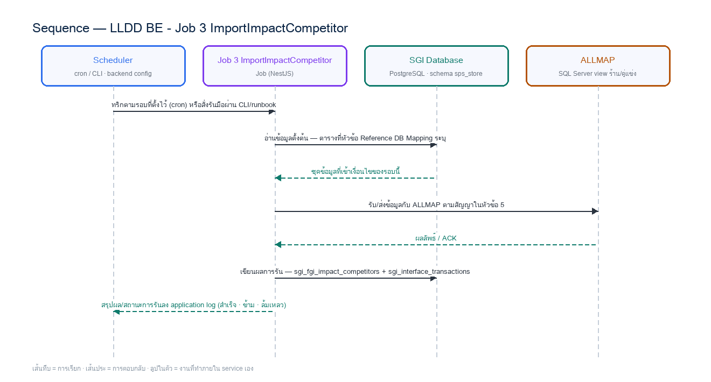

# LLDD BE - Job 3 ImportImpactCompetitor

SBP Mall - ระบบประกันรายได้ | Low Level Design Document

## 1. Overview

| รายการ | รายละเอียด |
| --- | --- |
| Track | BE |
| Estimate | **12 ชั่วโมง** = implementation 9 + unit test 3 (30%) |
| Owner | Aphiwit &lt;Bank&gt; Khammoon |
| Target repository | **`SBP/srm-sps-spsap-sop-sgi-batch`** (NestJS 11 + TypeORM · schema `sps_store` · **มติ 2026-09-02 — ย้ายมาจาก store-backend**) — batch runner ของ SBP ที่รันอยู่แล้ว 42 job บน **AWS Batch** · ลงทะเบียน job ใน `src/main.ts` แล้วรับ argument ผ่าน `JOB_NAME`/`INPUT` (local) หรือ `argv[3]`/`argv[2]` (AWS Batch) · **ไม่ผ่าน BFF และไม่เปิด HTTP** · ตารางเวลาเป็น AWS Batch scheduled event ไม่ใช่ `@Cron` · ดู `SBP/srm-sps-spsap-sop-sgi-batch.md` |
| Objective | นำเข้าร้านคู่แข่งจาก ALLMAP: นำข้อมูลร้านคู่แข่งรายงวดจากวิว COMPETITOR_IMPACT_VIEW **ของ ALLMAP (SQL Server GSMALLMAP — ระบบภายนอก คงกลไกเดิม)** เข้า sgi_fgi_impact_competitors ทีละ 10,000 แถว กันซ้ำระดับงวด (ถ้างวดมีข้อมูลแล้วจะข้ามทั้งงวด ไม่มี upsert) |

Common contract reference: ทุกหัวข้อ API/FE ต้องยึด LLDD-BE-API-Common-Contracts และ LLDD-FE-Integration-Contracts สำหรับ error/auth/format/pagination/action/RBAC ก่อนลงรายละเอียดเฉพาะหน้าหรือเฉพาะ endpoint

### 1.1 เอกสาร LLDD ที่เกี่ยวข้อง

ตารางนี้สร้างจาก endpoint และตารางที่เอกสารฉบับนี้ประกาศไว้จริง — อ่านฉบับที่อยู่ในตารางก่อนลงมือ เพื่อไม่ให้สัญญา request/response หรือชื่อคอลัมน์หลุดจากกัน

| ความสัมพันธ์ | เอกสาร LLDD | เกี่ยวข้องตรงไหน |
| --- | --- | --- |
| สัญญากลาง | **LLDD-BE-API-Common-Contracts** | envelope `{success,data}` · error code · pagination · รูปแบบวันที่/เลขเอกสาร |
| โครงสร้างข้อมูล | **LLDD-BE-Database-Structure** | DDL ของตารางที่หัวข้อ Reference DB Mapping อ้างถึง |
| แพลตฟอร์มระบบเดิม | **LLDD-BE-Integration-SBP-Platform** | header จาก BFF (`x-api-key` / `x-user-*`) · การ reuse ตารางและ service ของระบบ SBP เดิม |
| ต้องจบก่อน (ลำดับงาน) | **LLDD-BE-API-Common-Contracts** | เป็นฉบับต้นทางของสัญญา/โครงที่ฉบับนี้อ้าง |
| ต้องจบก่อน (ลำดับงาน) | **LLDD-BE-Job-2-ImportImpactStore** | เป็นฉบับต้นทางของสัญญา/โครงที่ฉบับนี้อ้าง |

## 2. Screen / Functional Scope

- Main class/script: th.co.gosoft.fgi.main.ImportImpactCompetitor / /appstore/SPS/FGI/schedule/FGI_ImportCompetitor.sh
- Phase: A
- Output: sgi_fgi_impact_competitors
- Estimate: 9 ชั่วโมง
- Argument รับผ่าน `INPUT` (JSON) — local ใช้ env `JOB_NAME`/`INPUT` · AWS Batch ใช้ `argv[3]`/`argv[2]` · ดูหัวข้อ 5.95 · ไม่มีตาราง job_configs และไม่มีหน้าจอควบคุม (หน้า Flow Batch Job ในกลุ่มเมนู Flow เหลือแค่ Flowchart + Database ที่ใช้ · 2026-08-06)
- ตารางเวลาตั้งที่ **AWS Batch scheduled event** (repo ไม่มี `@Cron`) — **ยกเว้น job ที่เป็น event-driven (ดูหัวข้อ Config Schema ของ job นั้น) ซึ่งห้ามตั้ง schedule** · ทุก job ถูกบันทึกลง `integration_log` โดย `main.ts` อัตโนมัติ + structured log `BATCH_START`/`BATCH_END` พร้อม `runId`

## 3. Screenshot Reference

ไม่มีภาพหน้าจอสำหรับหัวข้อนี้ — เป็นเอกสารฝั่ง Backend/Batch ที่ไม่มี UI (ภาพหน้าจอทั้งหมดอยู่ในเอกสารชุด FE)

## 4. Implementation Flow & Sequence Diagram (Reference)

### 4.1 Implementation Flow (ลำดับขั้นการทำงาน)


_รูปที่ 1: Implementation flow reference: LLDD BE - Job 3 ImportImpactCompetitor_

### 4.2 Sequence Diagram (ใครคุยกับใคร ลำดับไหน)

ผู้แสดงและลำดับข้อความในภาพนี้สร้างจาก endpoint ในหัวข้อ 7 และตารางในหัวข้อ Reference DB Mapping ของเอกสารฉบับนี้เอง จึงตรงกับสัญญาเสมอ



_รูปที่ 2: Sequence diagram: LLDD BE - Job 3 ImportImpactCompetitor_

## 5. Field, Format, and Validation

| Field / UI | Format | Validation | Behavior |
| --- | --- | --- | --- |
| กำหนดการรัน (Cron) | 0 07 7 * * | แก้ไขได้ | ใช้สคริปต์ /appstore/SPS/FGI/schedule/FGI_ImportCompetitor.sh; Operations ตรวจ deployment path และ owner permission ก่อนขึ้น production |
| Argument (งวด) | 2569\|06 | แก้ไขได้ | รูปแบบ YYYY\|MM · ⚠️ ปีเป็น พ.ศ. ตามวิว ALLMAP — ค่าที่เขียนลงตารางของ SGI ต้องแปลงเป็น ค.ศ. ทุกครั้ง |
| Chunk Size | 10000 | แก้ไขได้ | จำนวนแถวต่อรอบ insert |
| Source View | COMPETITOR_IMPACT_VIEW | ค่าคงที่/แก้ผ่านหน้าจอไม่ได้ | SELECT DISTINCT / map คอลัมน์ NAMT -> NAME_TH, BRANCHT -> BRANCH_TH |

### 5.9 Input / Progress / Output Contract

| Stage | Contract for implementation |
| --- | --- |
| Input | Period year/month and competitor impact data from ALLMAP COMPETITOR_IMPACT_VIEW. |
| Progress | validate period, skip when period already exists, query competitor view, insert in chunks inside a transaction, send status mail. |
| Output | FGI_IMPACT_COMPETITOR rows for the target period; run status is success/no-data/failed with inserted-count reconciliation. |

### 5.90 Job 3 Execution Stages

validate period, skip when period already exists, query competitor view, insert in chunks inside a transaction, send status mail.

| Order | Service step | Repository | Output / failure contract |
| --- | --- | --- | --- |
| 1 | loadCompetitorPeriod | impactCompetitorRepository | คืน metrics และ throw typed error; transaction/rerun ใช้ contract ด้านล่าง |
| 2 | deduplicateCompetitors | impactCompetitorRepository | คืน metrics และ throw typed error; transaction/rerun ใช้ contract ด้านล่าง |
| 3 | upsertCompetitors | impactCompetitorRepository | คืน metrics และ throw typed error; transaction/rerun ใช้ contract ด้านล่าง |
| 4 | reconcileCompetitorCount | impactCompetitorRepository | คืน metrics และ throw typed error; transaction/rerun ใช้ contract ด้านล่าง |

### 5.91 Job 3 Run Evidence

| Evidence | Job-specific value | Acceptance |
| --- | --- | --- |
| Input identity | Period year/month and competitor impact data from ALLMAP COMPETITOR_IMPACT_VIEW. | snapshot input file/business key/period in run record |
| Output identity | FGI_IMPACT_COMPETITOR rows for the target period; run status is success/no-data/failed with inserted-count reconciliation. | reconcile input, success, reject and skipped counts |
| Dedup proof | UNIQUE(impact_process_id, competitor_code, period_key); source row ซ้ำในไฟล์/วิวต้อง deduplicate ก่อน upsert | rerun fixture produces no duplicate target business key |
| Transaction proof | validate งวดก่อนอ่าน; upsert ทีละ chunk และ commit หลัง reconcile จำนวน input/success/reject ของ chunk ตรงกัน | injected failure leaves no partial committed state outside documented boundary |
| Security proof | ALLMAP datasource ใช้ secretRef และ TLS verify-full; จำกัด DB user เป็น SELECT เฉพาะ source view | config/log/error contains no plaintext secret |

### 5.92 Legacy Java Source Reference

| Legacy file | Line range | Responsibility to carry forward |
| --- | --- | --- |
| fcsJar/src/th/co/gosoft/fgi/main/ImportImpactCompetitor.java | 16-48 | Legacy main entrypoint and notification wrapper. |
| fcsJar/src/th/co/gosoft/fgi/controller/ImportController.java | 483-598 | Validate params, skip duplicates, query source, chunk insert sgi_competitors. |
| fcsJar/src/th/co/gosoft/fgi/dao/jdbc/ImportJdbc.java | 200-241 | Count existing period, query COMPETITOR_IMPACT_VIEW, insert FGI_IMPACT_COMPETITOR. |

Line ranges refer to the legacy Java implementation under /Users/bank_mac/gosoft/java/SBP/fcsJar. Use these ranges to preserve business behavior while implementing the target Node job.

### 5.93 Target Repository and SQL Contract

| Contract | Target implementation |
| --- | --- |
| Repository | impactCompetitorRepository |
| Idempotency / dedup | UNIQUE(impact_process_id, competitor_code, period_key); source row ซ้ำในไฟล์/วิวต้อง deduplicate ก่อน upsert |
| Transaction boundary | validate งวดก่อนอ่าน; upsert ทีละ chunk และ commit หลัง reconcile จำนวน input/success/reject ของ chunk ตรงกัน |
| Security | ALLMAP datasource ใช้ secretRef และ TLS verify-full; จำกัด DB user เป็น SELECT เฉพาะ source view |

#### Input / candidate query

```sql
-- bind ตามลำดับ: $1=period_key
SELECT impact_process_id, competitor_code, name_th, branch_th, opened_date, closed_date, period_key
FROM allmap_competitor_impact_view
WHERE period_key = $1 /* period_key */;
```

#### Write / upsert query

```sql
-- bind ตามลำดับ: $1=impact_process_id · $2=competitor_code · $3=name_th · $4=branch_th · $5=opened_date · $6=closed_date · $7=period_key
INSERT INTO sgi_fgi_impact_competitors
    (impact_process_id, competitor_code, name_th, branch_th, opened_date, closed_date, period_key, updated_at)
VALUES ($1 /* impact_process_id */, $2 /* competitor_code */, $3 /* name_th */, $4 /* branch_th */, $5 /* opened_date */, $6 /* closed_date */, $7 /* period_key */, CURRENT_TIMESTAMP)
ON CONFLICT (impact_process_id, competitor_code, period_key)
DO UPDATE SET name_th = EXCLUDED.name_th,
              branch_th = EXCLUDED.branch_th,
              opened_date = EXCLUDED.opened_date,
              closed_date = EXCLUDED.closed_date,
              updated_at = CURRENT_TIMESTAMP;
```

### 5.94 Target Node Implementation

โครงสร้างนี้ระบุ service/repository เฉพาะงานและต้อง implement ตาม SQL, transaction, idempotency และ security contract ด้านบน โดยทุกขั้นต้องคืน metrics สำหรับ reconcile และ run history

```js
export async function runLlddBeJob3Importimpactcompetitor(ctx, services) {
  const run = await services.jobRuns.acquire({
    jobNo: "3", period: ctx.period, triggeredBy: ctx.triggeredBy
  });

  try {
    ctx = { ...ctx, runId: run.id, repository: services.impactCompetitorRepository };
    const step1 = await services.loadCompetitorPeriod(ctx, undefined);
    const step2 = await services.deduplicateCompetitors(ctx, step1);
    const step3 = await services.upsertCompetitors(ctx, step2);
    const step4 = await services.reconcileCompetitorCount(ctx, step3);
    const result = step4;
    await services.jobRuns.finish(run.id, "SUCCESS", result.metrics);
    return { runId: run.id, status: "SUCCESS", ...result };
  } catch (error) {
    await services.jobRuns.finish(run.id, "FAILED", {
      errorCode: error.code ?? "JOB_FAILED",
      errorMessage: error.message
    });
    throw error;
  }
}
```

### 5.95 การลงทะเบียน job และ Arguments (sop-sgi-batch)

งานนี้ลงทะเบียนเป็น job ชื่อ **`sgi-import-impact-competitor`** ใน `src/main.ts` ของ `SBP/srm-sps-spsap-sop-sgi-batch` โดยใช้ dispatcher เดิมของ repo (ไม่สร้าง runner ใหม่) — `main.ts` อ่านชื่อ job และ input มา 2 ทาง แล้วเลือกอัตโนมัติจากการมี `argv[3]` หรือไม่

| ช่องทางรัน | ชื่อ job มาจาก | input มาจาก | ตัวอย่าง |
| --- | --- | --- | --- |
| Local / CLI / runbook | env `JOB_NAME` | env `INPUT` (JSON string) | `JOB_NAME=sgi-import-impact-competitor INPUT='{"year":2026,"month":6}' npm run start` |
| AWS Batch (ตารางเวลาจริง) | `process.argv[3]` | `process.argv[2]` (JSON string) | `node dist/main.js '{"year":2026,"month":6}' sgi-import-impact-competitor` |

**ตารางเวลาไม่ได้อยู่ในโค้ด** — repo นี้ไม่มี `@Cron`/`@Interval` แม้แต่จุดเดียว (แม้ติดตั้ง `@nestjs/schedule` ไว้) cron ในหัวข้อ 5 เป็น **นิยามของ AWS Batch scheduled event** ที่ต้องตั้งตอน deploy ไม่ใช่ค่าที่อ่านจาก config file

#### Argument ที่รับได้ (`INPUT` เป็น JSON object · ไม่ส่ง = `{}`)

**ระบบเดิมรับ argument แบบนี้:** `args[0]` = `YYYY|MM` — **ต้องมี 2 ส่วนพอดี** (ว่าง/เกิน = `NullPointerException`) · validate ด้วย `isDateValid(yyyy/MM)` · ไม่ส่ง = **งวดเดือนก่อนหน้า**  
ของใหม่เปลี่ยนจาก positional string เป็น JSON เพื่อให้เพิ่มฟิลด์ได้โดยไม่พังของเดิม แต่ **ต้องรองรับทุกอย่างที่ระบบเดิมรับได้เป็นอย่างน้อย** — ห้ามลดความสามารถลง

| Field | ชนิด | ไม่ส่งแล้วได้อะไร (default) | Validation | ตรงกับ argument เดิม |
| --- | --- | --- | --- | --- |
| `year` | number | งวดเดือนก่อนหน้า | ค.ศ. 4 หลัก · ต้องส่งคู่กับ `month` เสมอ | `paramsArr[0]` |
| `month` | number | งวดเดือนก่อนหน้า | 1-12 · ส่งมาตัวเดียวโดยไม่มีอีกตัว = `INVALID_JOB_INPUT` | `paramsArr[1]` |
| `dryRun` | boolean | `false` | `true` = อ่าน/คำนวณครบแต่ไม่ commit และไม่ publish/ไม่ส่งไฟล์ | **ของกลาง** ทุก job |
| `limit` | number | `null` | จำกัดจำนวนรายการที่ประมวลผลรอบนี้ (ใช้ตอน smoke test) | **ของกลาง** ทุก job |

**กติกาการ validate ที่ทุก job ต้องทำเหมือนกัน** — parse `INPUT` ไม่สำเร็จ หรือฟิลด์ไม่ผ่าน validation ให้ log `BATCH_END` ด้วย `batchStatus: 'FAILED'` แล้ว `exit(1)` **ก่อนแตะฐานข้อมูล** (ห้าม fallback ไปค่า default เงียบ ๆ เมื่อผู้ใช้ตั้งใจส่งค่ามาแล้วผิด) · ฟิลด์ที่ไม่รู้จักให้ log warn แล้วข้าม ไม่ทำให้ job ล้ม

- legacy โยน exception ทันทีเมื่อ argument ผิดรูป — job ใหม่ต้องคง**พฤติกรรม fail-fast** ไม่ใช่ fallback เงียบ ๆ ไปงวดก่อนหน้า

### 5.96 เงื่อนไขตัดสิน (Decision Rules) — ตัดสินจากอะไร

Job 3 ตัดสินเรื่องเดียวแต่พลาดง่าย: **งวดนี้เคยนำเข้าคู่แข่งไปแล้วหรือยัง** — ระบบเดิมล้างข้อมูลของงวดทิ้งแล้วนำเข้าใหม่ ไม่ได้ merge ทีละแถว

| คำถามที่โค้ดต้องตอบ | ตัดสินจาก (ตาราง · คอลัมน์) | เงื่อนไขที่ต้องเป็นจริง | ไม่เข้าเงื่อนไขแล้วทำอะไร |
| --- | --- | --- | --- |
| งวดนี้มีข้อมูลคู่แข่งอยู่แล้วหรือไม่ | `sgi_fgi_impact_competitors` — `impact_process_id` · `period_key` (CHAR(7) `'YYYY-MM'`) | มีแถวของ `period_key` = งวดที่ขอ อยู่แล้ว → ถือว่า "งวดนี้นำเข้าแล้ว" | **ล้างข้อมูลของงวดนั้นก่อนแล้วนำเข้าใหม่ทั้งงวด** (ไม่ใช่ upsert รายแถว) — ทำใน transaction เดียวกับการ insert ชุดใหม่ ไม่งั้นระหว่างรันจะมีช่วงที่งวดว่างเปล่า |
| ร้านคู่แข่งรายนี้อ้างอิงได้หรือไม่ | `sgi_competitors.competitor_code` (master 11 รหัส `01`-`11`) | `competitor_code` ที่วิวส่งมาต้องมีอยู่ใน master · ไม่มี = FK violation | ต้อง **reject รายแถวพร้อมเก็บ reason** ไม่ใช่ล้มทั้งงวด (นับเข้า `rejected` ใน metrics) |
| แถวซ้ำในวิวต้นทาง | วิว `COMPETITOR_IMPACT_VIEW` (ALLMAP · SQL Server GSMALLMAP) | อ่านทีละ 10,000 แถว · deduplicate ด้วยคีย์ `(impact_process_id, competitor_code, period_key)` **ก่อน** ยิงเข้า DB | ไม่ dedup ก่อน จะชน `uq_impact_competitor` แล้วทั้ง chunk fail |

#### ค่าคงที่และโดเมนที่ใช้ในเงื่อนไขข้างบน

ทุกค่าในตารางนี้ต้องอ่านจาก config/env ไม่ hardcode ในคิวรี — แต่ **ค่าตั้งต้นต้องเท่าระบบเดิมทุกตัว** ไม่งั้นผลลัพธ์จะไม่ตรงกันตอนเทียบ UAT

| ค่า | โดเมน / ค่าที่ระบบเดิมใช้ | ที่มา |
| --- | --- | --- |
| ขนาด chunk | 10,000 แถว | พฤติกรรมเดิมของ `ImportImpactCompetitor` |
| คีย์กันซ้ำ | `UNIQUE (impact_process_id, competitor_code, period_key)` | `uq_impact_competitor` ใน DDL |

## 6. Button / User Action Mapping

| Action | Trigger | API / Service | Expected Result |
| --- | --- | --- | --- |
| รันตามตารางเวลา | CRON | scheduler → runner (job 3) | อ่าน cron/พารามิเตอร์จาก backend config |
| รันนอกรอบ (manual/rerun) | CLI | CLI/ops runbook → runner (job 3) | guard ไม่ให้รันซ้อนด้วย distributed lock |
| แก้พารามิเตอร์/เปิด-ปิด job | CONFIG | แก้ backend config แล้ว deploy | ไม่มี endpoint และไม่มีหน้าจอควบคุม — หน้า Flow Batch Job เป็น reference อย่างเดียว (2026-08-06) |
| ตรวจผลการรัน | LOG | application log (structured) | ไม่มีตาราง job_run_histories แล้ว · ผลการรับส่งไฟล์/ข้อความดูที่ sgi_interface_transactions |

## 7. API Contract

**เอกสารฉบับนี้ไม่มี endpoint ของตัวเอง** — เป็นสัญญา/งานภายในที่เอกสารอื่นเรียกใช้ (ดูขอบเขตใน 5.90 Endpoint Implementation Contract) · รายการ endpoint ทั้ง 28 เส้นของ SGI อยู่ที่ **LLDD-API** และ `api.md`

## 8. Reference DB Mapping (No Database Page Work)

ส่วนนี้เป็นข้อมูลอ้างอิงสำหรับการ implement API/Job เท่านั้น ไม่ใช่งานสร้างหน้า Database, ไม่ใช่งานออกแบบ DB page และไม่ถูกนับเป็น deliverable แยกของ FE/BE

| Table / Object | R/W | Usage |
| --- | --- | --- |
| sgi_fgi_impact_competitors | W | insert รายงวด (งวดล่าสุดต่อร้าน) ดึงจาก ALLMAP · ช่องทางต้นทาง ALM เก็บที่ sgi_fgi_impact_processes.datasource |

## 9. Skeleton Code (Batch Job 3)

### 9.1 ผังไฟล์ที่ต้องสร้าง (Job 3) — บน `srm-sps-spsap-sop-sgi-batch`

โครงไฟล์ของ Job 3 (th.co.gosoft.fgi.main.ImportImpactCompetitor เดิม) วางใต้ `src/modules/sgi/` ตาม convention ที่ repo นี้ใช้อยู่จริง (ดูตัวอย่างที่ `src/modules/performance/import-qssi.service.ts`): service ถือ logic ทั้งหมด, inject `DataSource`/repository ผ่าน TypeORM, ยิง raw SQL ได้ตรง, และ **ไม่มี controller** เพราะ repo นี้ไม่เปิด HTTP

**สิ่งที่ reuse ได้ทันที ไม่ต้องเขียนใหม่** — ต่างจากแผนเดิมที่ตั้งไว้บน store-backend ซึ่งต้องสร้าง runner ทั้งชุดเอง: `src/main.ts` (dispatcher + `BATCH_START`/`BATCH_END` + `runId` + log ลง `integration_log` อัตโนมัติ) · `src/modules/rabbitMQ/rabbitmq.service.ts` (`publishMessage`) · `src/shared/services/s3.service.ts` · `StatementService.decodeThaiFileContent()` (WINDOWS-874 auto-detect) · `@gosoft-sbp/email-lib` · `@srm/glb-log`

⚠️ **สิ่งที่ repo นี้ยังไม่มี และเป็นงานตั้งต้นจริง**: (1) ไม่มี `@Cron` เลย — ตารางเวลาต้องตั้งเป็น **AWS Batch scheduled event** (2) ไม่มี distributed lock (`pg_try_advisory_lock`) — การกันรันซ้อนพึ่ง AWS Batch queue ถ้างานไหนรับความเสี่ยงนี้ไม่ได้ต้องเพิ่มเอง (3) `publishMessage` เป็น fire-and-forget **ไม่มี publisher confirm และไม่มี outbox** — งานที่ต้องการ **transactional outbox + publisher confirm** (Job 6 · และ `sgi_reflow` ฝั่ง BE) ต้องสร้างกลไกเพิ่มเอง ไม่ใช่ reuse ได้เลย · ⚠️ ไม่มี ACK ระดับธุรกิจให้รอ (มติ 2026-09-08 ข้อ 2.13) (4) ยังไม่มี entity/ตาราง `sgi_*` แม้แต่ตัวเดียว

| Path | หน้าที่ |
| --- | --- |
| src/modules/sgi/job-3-import-impact-competitor.service.ts | คลาส `ImportImpactCompetitorService` — **`execute(input)` เป็น entry point เดียว** เรียงตาม flow ของ Job 3 ทีละขั้น ครอบ transaction เอง และจบด้วย structured log สรุป metrics (แบบเดียวกับ `ImportQssiService.execute(body)` ที่มีอยู่) |
| src/modules/sgi/job-3-import-impact-competitor.service.spec.ts | unit test ของ service — repo นี้วาง spec ไว้ข้างไฟล์จริงเสมอ (`jest` + `npm run test:ci` มี coverage/SonarQube) |
| src/modules/sgi/dto/job-3-import-impact-competitor-input.dto.ts | DTO ของ `INPUT` (JSON) พร้อม `class-validator` ตามตารางในหัวข้อ 9.2 — parse ไม่ผ่านต้อง fail ก่อนแตะ DB |
| src/modules/sgi/sgi.module.ts | NestJS module ของกลุ่มงานประกันรายได้ — ผูก service ทุกตัวของ SGI เข้ากับ `TypeOrmModule` (ไฟล์ร่วมของทุก job ให้ merge ไม่ใช่เขียนทับ) |
| src/main.ts | **เพิ่ม `case 'sgi-job-3-import-impact-competitor':`** ในสวิตช์เดิม → `await import('./modules/sgi/job-3-import-impact-competitor.service')` แล้ว `app.get(ImportImpactCompetitorService).execute(input)` (ไฟล์กลางของทุก job — เป็นจุด merge conflict ที่ต้องระวัง) |
| src/entities/sgi-*.entity.ts | entity ของตาราง `sgi_*` ที่หัวข้อ Reference DB Mapping อ้างถึง — **ยังไม่มีใน repo เลยสักตัว** ต้องสร้างใหม่ทั้งหมด |
| src/config/config.ts | เพิ่ม `export const sgiJob3Config` ตามแบบของไฟล์นี้ (โปรเจกต์ไม่ใช้ `registerAs`) — ค่าคงที่ทางธุรกิจของ Job 3 |

#### การลงทะเบียนใน `src/main.ts` (job `sgi-job-3-import-impact-competitor`)

```js
// src/main.ts — เพิ่มเคสนี้ในสวิตช์เดิม (เรียงต่อจาก job ของ SGI ตัวก่อนหน้า)
      case 'sgi-job-3-import-impact-competitor': {
        const { ImportImpactCompetitorService } = await import('./modules/sgi/job-3-import-impact-competitor.service');
        const job3importimpactcompetitorService = app.get(ImportImpactCompetitorService);
        await job3importimpactcompetitorService.execute(input);   // input = JSON ที่ parse จาก INPUT/argv[2] แล้ว
        break;
      }
```

`main.ts` เรียก `StatementService.logInterfest('sgi-job-3-import-impact-competitor', input)` ให้อยู่แล้วก่อนเข้าสวิตช์ → **ไม่ต้องเขียน log ลง `integration_log` เองซ้ำ** · และ `BATCH_END` ที่ท้ายไฟล์จะสรุป `batchStatus` + `durationMs` ให้อัตโนมัติ หน้าที่ของ service คือ throw เมื่อทำงานไม่สำเร็จเท่านั้น

### 9.2 Config Schema ของ Job 3 (backend config / env)

ตารางเวลาของ Job 3 คือ `0 07 7 * *` (ทุกวันที่ 7 เวลา 07:00) — ⚠️ **ตัวจริงตั้งที่ AWS Batch scheduled event ไม่ใช่ในโค้ด** (repo นี้ไม่มี `@Cron` เลย) ค่า `SGI_JOB3_CRON` เก็บไว้เป็นเอกสารประกอบ/ตรวจสอบเท่านั้น · `SGI_JOB3_ENABLED=false` ให้ `execute()` จบทันทีแบบ SUCCESS พร้อม log เหตุผล (กันกรณี AWS Batch ยังยิงเข้ามา)

```ts
// src/config/config.ts — เพิ่มบล็อกนี้ต่อท้าย (repo ใช้ export const ไม่ใช้ registerAs)
// convention จริงของ sop-sgi-batch คือ `export const` ใน `src/config/config.ts` (ไม่ใช้ registerAs · ดูของเดิมที่
// `AppConfigModule` แบบ @Global แล้วอ่าน process.env ตรง ๆ) — โปรเจกต์นี้ **ไม่ได้ใช้ registerAs**
// แม้แต่จุดเดียว จึงประกาศเป็นคลาสให้รีวิว/ทดสอบเหมือน config ตัวอื่น
import { Injectable } from '@nestjs/common';

// TODO: Job 3 ไม่มีตาราง job_configs และไม่มี Job Admin API แล้ว (ตัดสินใจ 2026-08-06)
// TODO: ค่าทุกตัวอ่านจาก env/config file ของ backend เท่านั้น — เปลี่ยนค่า = แก้ config แล้ว deploy
export interface Job3Config {
  /** เปิด/ปิด job รอบถัดไปโดยไม่ต้อง deploy โค้ด */
  enabled: boolean;
  /** ตารางเวลาของ job นี้ — บันทึกไว้เพื่ออ้างอิงเท่านั้น ตัวจริงตั้งที่ AWS Batch scheduled event */
  cron: string;
  /** กำหนดการรัน (Cron) — ใช้สคริปต์ /appstore/SPS/FGI/schedule/FGI_ImportCompetitor.sh; Operations ตรวจ deployment path และ owner permission ก่อนขึ้น production */
  cron: string;
  /** Argument (งวด) — รูปแบบ YYYY|MM · ⚠️ ปีเป็น พ.ศ. ตามวิว ALLMAP — ค่าที่เขียนลงตารางของ SGI ต้องแปลงเป็น ค.ศ. ทุกครั้ง */
  argument: string;
  /** Chunk Size — จำนวนแถวต่อรอบ insert */
  chunkSize: number;
  /** Source View — SELECT DISTINCT / map คอลัมน์ NAMT -> NAME_TH, BRANCHT -> BRANCH_TH */
  sourceView: string;
  /** ผู้รับอีเมลเมื่อ job ล้มเหลว — เก็บเป็น string คั่น comma ให้ตรง signature ของ
      `EmailLibService.sendMail({ mailTo })` ที่รับ string ไม่ใช่ string[] */
  mailTo: string;
}

@Injectable()
export class SgiJob3Config implements Job3Config {
  // TODO: ยืนยันค่า default ทุกตัวกับ Ops ก่อนขึ้น production (ไม่มีหน้าจอแก้ค่าแล้ว)
  enabled = (process.env.SGI_JOB3_ENABLED ?? 'true') === 'true';
  cron = process.env.SGI_JOB3_CRON ?? '0 07 7 * *';
  cron = process.env.SGI_JOB3_CRON ?? '0 07 7 * *'; // TODO: แก้ผ่าน env/config file แล้ว deploy
  argument = process.env.SGI_JOB3_ARGUMENT ?? '2569|06'; // TODO: ปีเป็น พ.ศ. ตามวิว ALLMAP — ค่าที่เขียนลงตารางของ SGI ต้องแปลงเป็น ค.ศ. ทุกครั้ง (⚠️)
  chunkSize = Number(process.env.SGI_JOB3_CHUNK_SIZE ?? 10000); // TODO: แก้ผ่าน env/config file แล้ว deploy
  sourceView = process.env.SGI_JOB3_SOURCE_VIEW ?? 'COMPETITOR_IMPACT_VIEW'; // TODO: ค่าคงที่ทางธุรกิจ — เปลี่ยนต้องผ่านการอนุมัติ
  mailTo = process.env.SGI_JOB3_MAIL_TO ?? ''; // TODO: ผู้รับอีเมลแจ้ง error คั่นด้วย comma (เดิม: config mailTo / storeretention)
}

// TODO: เพิ่ม SgiJob3Config ใน providers/exports ของ AppConfigModule (@Global) เหมือน AppConfig
```

### 9.3 Job Class — `run(ctx)` ของ Job 3 ทีละขั้นตามผัง

#### 9.3.1 สัญญาของชั้นกลาง (`runner.ts`) + โครง service ของ Job 3

service อ้าง `JobRunContext` / `JobRunResult` / `JobState` / `JobFailedError` — ทั้งหมดนิยาม ครั้งเดียวใน `src/modules/sgi/sgi-job.types.ts` (ไฟล์ร่วมของทุก job ให้ merge ไม่ใช่เขียนทับ) และ service ต้องมี method ครบตามตารางขั้นตอนด้านล่าง มิฉะนั้น `execute(input)` จะเรียก method ที่ไม่มีอยู่

```ts
// src/modules/sgi/sgi-job.types.ts — สัญญากลางของทุก job ของ SGI (ประกาศครั้งเดียว ใช้ร่วมทั้ง 10 ฉบับ)

export interface JobRunContext {
  jobNo: string;
  period: string;        // YYYYMM ของงวดที่รัน
  triggeredBy: string;   // 'CRON' | userId ที่สั่งรันนอกรอบ
  params?: Record<string, string>;
}

export interface JobRunResult {
  event: 'job.finish';
  jobNo: string;
  jobName: string;
  status: 'SUCCESS' | 'SKIPPED' | 'SKIPPED_LOCKED' | 'FAILED';
  period: string;
  output: string;
  read: number; written: number; skipped: number; rejected: number;
  durationMs: number;
}

/** counter + ค่าที่ทุกขั้นของ job ใช้ร่วมกัน (service เป็นผู้สร้างผ่าน createState) */
export interface JobState {
  period: string;
  read: number; written: number; skipped: number; rejected: number;
  // TODO: เพิ่ม field เฉพาะของ job นี้ (เช่น rows ที่อ่านมา, path ไฟล์ที่เขียน)
  [key: string]: unknown;
}

/** error ที่ทำให้ job จบเป็น FAILED และส่งอีเมลแจ้งผู้ดูแล */
export class JobFailedError extends Error {
  constructor(public readonly code: string, message: string) { super(message); }
}

/** ใช้ออกจาก transaction เมื่อสาขา NO บอกให้ข้ามงวด/เรคคอร์ด — runner สรุปเป็น SKIPPED ไม่ใช่ FAILED */
export class JobSkippedError extends Error {}
```

```ts
// ImportImpactCompetitorService — method ที่ job class เรียก (1 method ต่อ 1 ขั้นในตารางด้านบน)
import { Inject, Injectable } from '@nestjs/common';
import type { DataSource, EntityManager } from 'typeorm';
import type { JobRunContext, JobState } from '../../runner';
export type { JobState };

@Injectable()
export class ImportImpactCompetitorService {
  constructor(@Inject('DATA_SOURCE') private readonly dataSource: DataSource) {}

  createState(ctx: JobRunContext): JobState {
    return { period: ctx.period, read: 0, written: 0, skipped: 0, rejected: 0 };
  }

  // เป็นงวดใหม่ (ยังไม่เคยนำเข้า)?
  //   เงื่อนไขจริง: ดูตารางในหัวข้อ "เงื่อนไขตัดสิน (Decision Rules)" ของเอกสารฉบับนี้
  async check02ResolvePeriod(state: JobState): Promise<boolean> {
    throw new Error('check02ResolvePeriod: ยังไม่ได้ implement — ห้าม deploy ทั้งที่ยังไม่เขียนเงื่อนไขจริง');
  }

  // SELECT DISTINCT จาก COMPETITOR_IMPACT_VIEW
  async step03Query(state: JobState, manager?: EntityManager): Promise<void> {
    throw new Error('step03Query: ยังไม่ได้ implement — ดู SQL ที่หัวข้อ Repository / SQL และกติกาที่หัวข้อเงื่อนไขตัดสิน');
  }

  // พบข้อมูลต้นทาง?
  //   เงื่อนไขจริง: ดูตารางในหัวข้อ "เงื่อนไขตัดสิน (Decision Rules)" ของเอกสารฉบับนี้
  async check04Condition(state: JobState): Promise<boolean> {
    throw new Error('check04Condition: ยังไม่ได้ implement — ห้าม deploy ทั้งที่ยังไม่เขียนเงื่อนไขจริง');
  }

  // insert ทีละ 10,000 แถว (ผูก impact_process_id)
  async step05Insert(state: JobState, manager?: EntityManager): Promise<void> {
    throw new Error('step05Insert: ยังไม่ได้ implement — ดู SQL ที่หัวข้อ Repository / SQL และกติกาที่หัวข้อเงื่อนไขตัดสิน');
  }

  // จำนวนที่ insert = จำนวนต้นทาง?
  //   เงื่อนไขจริง: ดูตารางในหัวข้อ "เงื่อนไขตัดสิน (Decision Rules)" ของเอกสารฉบับนี้
  async check06Insert(state: JobState): Promise<boolean> {
    throw new Error('check06Insert: ยังไม่ได้ implement — ห้าม deploy ทั้งที่ยังไม่เขียนเงื่อนไขจริง');
  }

}
```

#### 9.3.2 `run(ctx)` ของ Job 3

ทุกขั้นใน `run()` ตรงกับ flowchart ของ Job 3 หนึ่งต่อหนึ่ง (decision และ error path รวมอยู่ด้วย) — method ที่ต้อง implement ใน service ตามตารางนี้

| ลำดับ | ชนิด | ขั้นตอนจากผัง | Method ที่ต้อง implement | เส้นทาง NO / error |
| --- | --- | --- | --- | --- |
| 1 | start | เริ่ม | createState() | - |
| 2 | decision | เป็นงวดใหม่ (ยังไม่เคยนำเข้า)? | check02ResolvePeriod() | [branch] ข้ามทั้งงวด — ไม่มี upsert ต้องลบงวดก่อนจึงนำเข้าใหม่ได้ |
| 3 | io | SELECT DISTINCT จาก COMPETITOR_IMPACT_VIEW | step03Query() | throw JobFailedError เมื่อทำไม่สำเร็จ |
| 4 | decision | พบข้อมูลต้นทาง? | check04Condition() | [end] จบการทำงาน |
| 5 | process | insert ทีละ 10,000 แถว (ผูก impact_process_id) | step05Insert() | throw JobFailedError เมื่อทำไม่สำเร็จ |
| 6 | decision | จำนวนที่ insert = จำนวนต้นทาง? | check06Insert() | [err] Rollback + ส่งเมลแจ้งล้มเหลว |
| 7 | end | Commit / จบ | summarize() | - |

```ts
// src/modules/sgi/job-3-import-impact-competitor.service.ts — execute(input) เป็น entry point เดียว
import { Inject, Injectable, Logger } from '@nestjs/common';
import type { DataSource, EntityManager } from 'typeorm';
import { ImportImpactCompetitorService, type JobState } from './job-3-import-impact-competitor.service';
// 4 symbol นี้นิยามใน src/modules/sgi/sgi-job.types.ts (ไฟล์ร่วมของทุก job — ดูหัวข้อก่อนหน้า)
import { JobFailedError, JobSkippedError, JobRunContext, JobRunResult } from '../../runner';

@Injectable()
export class ImportImpactCompetitorJob {
  static readonly jobNo = '3';
  private readonly logger = new Logger(ImportImpactCompetitorJob.name);

  constructor(
    // TODO: repo นี้ตั้ง replication ใน typeorm.config.ts อยู่แล้ว — SELECT ไป slave, write ไป master อัตโนมัติ
    @Inject('DATA_SOURCE') private readonly dataSource: DataSource,
    private readonly service: ImportImpactCompetitorService,
  ) {}

  async run(ctx: JobRunContext): Promise<JobRunResult> {
    const startedAt = Date.now();
    // TODO: state ถือ counter (read/written/skipped/rejected) และค่าจาก job3Config
    const state = this.service.createState(ctx);
    try {
      // ขั้นที่ 2 (decision): เป็นงวดใหม่ (ยังไม่เคยนำเข้า)? · TODO: กันซ้ำระดับงวด (Errata E15)
      const ok02 = await this.service.check02ResolvePeriod(state);
      if (!ok02) { // NO → ข้ามทั้งงวด — ไม่มี upsert ต้องลบงวดก่อนจึงนำเข้าใหม่ได้
        // TODO: เส้น NO ของขั้นนี้เป็น branch ระดับ record — ผังไม่ได้ระบุว่าหยุดหรือไปต่อ
        //   ถ้าเป็น 'ข้ามรายการ'      -> state.skipped += 1; แล้ว continue ในลูปของ record
        //   ถ้าเป็น 'ตั้งค่าแล้วไปต่อ' -> เรียก service ตั้งค่าสถานะ แล้วเดินขั้นถัดไป (ห้าม return)
        //   ถ้าเป็น 'คงสถานะเดิม/ไม่เปิดงาน' -> หยุดเฉพาะ record นี้ ห้ามไหลไปขั้นถัดไป
      }
      // ขั้นที่ 3: SELECT DISTINCT จาก COMPETITOR_IMPACT_VIEW
      await this.service.step03Query(state);
      // ขั้นที่ 4 (decision): พบข้อมูลต้นทาง?
      const ok04 = await this.service.check04Condition(state);
      if (!ok04) { // NO → จบการทำงาน
        return this.summarize(state, 'SKIPPED', startedAt);
      }
      // === transaction boundary === TODO: หนึ่ง transaction + savepoint (insert เป็น chunk ละ 10,000)
      await this.dataSource.transaction(async (manager: EntityManager) => {
        // ขั้นที่ 5: insert ทีละ 10,000 แถว (ผูก impact_process_id) · TODO: ช่องทางต้นทาง ALM เก็บที่ sgi_fgi_impact_processes.datasource — sgi_fgi_impact_competitors ไม่มีคอลัมน์นี้ · map คอลัมน์ NAMT → name_th และ BRANCHT → branch_th (NAMT/BRANCHT เป็นคอลัมน์ของวิวฝั่ง ALLMAP)
        await this.service.step05Insert(state, manager);
      });
      // ขั้นที่ 6 (decision): จำนวนที่ insert = จำนวนต้นทาง? · TODO: ตรวจ reconcile จำนวนแถวก่อน commit
      const ok06 = await this.service.check06Insert(state);
      if (!ok06) throw new JobFailedError('JOB3_STEP06', 'Rollback + ส่งเมลแจ้งล้มเหลว');
      return this.summarize(state, 'SUCCESS', startedAt);
    } catch (error) {
      // TODO: error path ของ Job 3 — กันซ้ำระดับงวดเท่านั้น — ไม่ใช่ upsert (E15)
      this.logger.error(JSON.stringify({ event: 'job.failed', jobNo: '3', period: ctx.period,
        triggeredBy: ctx.triggeredBy, durationMs: Date.now() - startedAt, error: (error as Error).message }));
      // TODO: แจ้งผู้ดูแลผ่าน JobFailureNotifier (หัวข้อ 9.6.1) — runner เป็นผู้เรียกให้
      throw error;
    }
  }

  private summarize(state: JobState, status: JobRunResult['status'], startedAt = Date.now()): JobRunResult {
    // TODO: structured log บรรทัดเดียวจบ — ไม่มีตาราง job_run_histories แล้ว (2026-08-06)
    const summary = {
      event: 'job.finish', jobNo: '3', jobName: 'ImportImpactCompetitor', status,
      period: state.period, output: 'sgi_fgi_impact_competitors',
      read: state.read, written: state.written, skipped: state.skipped,
      rejected: state.rejected, durationMs: Date.now() - startedAt,
    };
    this.logger.log(JSON.stringify(summary));
    return summary as JobRunResult;
  }
}
```

### 9.4 การกันรันซ้อนของ Job 3 (PostgreSQL advisory lock — **ของใหม่**)

Job 3 มีข้อควรระวังจาก legacy: กันซ้ำระดับงวดเท่านั้น — ไม่ใช่ upsert (E15) — runner ล็อกด้วย `pg_try_advisory_lock` ก่อนเริ่มขั้นแรกเสมอ และรอบที่ล็อกไม่ได้ให้จบด้วยสถานะ SKIPPED_LOCKED (ไม่ใช่ FAILED)

```ts
// src/modules/sgi/sgi-job.lock.ts (ของใหม่ — repo นี้ยังไม่มีกลไกกันรันซ้อนใด ๆ)
import { Inject, Injectable, Logger } from '@nestjs/common';
import type { DataSource } from 'typeorm';

// TODO: ห้ามใช้แถวสถานะ RUNNING ในตารางเป็นตัวกัน (ไม่มีตาราง job_run_histories แล้ว)
//       ใช้ PostgreSQL advisory lock ระดับ session แทน — ปลดอัตโนมัติเมื่อ connection หลุด
export const SGI_JOB_LOCK_CLASS_ID = 861000; // namespace ของระบบ SGI
export const JOB_LOCK_KEYS: Record<string, number> = { '3': 30 /* TODO: เพิ่มให้ครบทุก job */ };

@Injectable()
export class BatchRunner {
  private readonly logger = new Logger(BatchRunner.name);
  constructor(@Inject('DATA_SOURCE') private readonly dataSource: DataSource) {}

  async runExclusive<T>(jobNo: string, fn: () => Promise<T>): Promise<T | { status: 'SKIPPED_LOCKED' }> {
    // TODO: ต้องใช้ QueryRunner (connection เดียวบน master) — dataSource.query() ของโปรเจกต์นี้
    //       route SQL ที่ขึ้นต้นด้วย SELECT ไป slave pool ทำให้ lock ไปตกที่ replica คนละ connection
    const runner = this.dataSource.createQueryRunner('master');
    await runner.connect();
    const objectId = JOB_LOCK_KEYS[jobNo];
    try {
      const [{ locked }] = await runner.query(
        'SELECT pg_try_advisory_lock($1, $2) AS locked',
        [SGI_JOB_LOCK_CLASS_ID, objectId],
      );
      if (!locked) {
        // TODO: รอบนี้ข้ามไปเฉย ๆ ไม่ถือเป็น error และไม่ต้องส่งอีเมล
        this.logger.warn(JSON.stringify({ event: 'job.skipped.locked', jobNo }));
        return { status: 'SKIPPED_LOCKED' };
      }
      return await fn();
    } finally {
      // TODO: ปลด lock ทุกกรณี แล้วคืน connection เข้า pool
      await runner.query('SELECT pg_advisory_unlock($1, $2)', [SGI_JOB_LOCK_CLASS_ID, objectId]);
      await runner.release();
    }
  }
}
```

### 9.5 Repository / SQL หลักของ Job 3

repository ของ Job 3 ประกาศเป็น factory provider (`{provide: 'IMPORT_IMPACT_COMPETITOR_REPOSITORY', useFactory: (ds) => ds.getRepository(Entity), inject: [DataSource]}`) แล้วยิง raw SQL ตามแบบ module ธุรกิจอื่นของ store-backend (schema `sps_store` มาจาก search_path)

| ตาราง | R/W | การใช้งานตามผัง | หมายเหตุ target design |
| --- | --- | --- | --- |
| sgi_fgi_impact_competitors | W | insert รายงวด (งวดล่าสุดต่อร้าน) ดึงจาก ALLMAP · ช่องทางต้นทาง ALM เก็บที่ sgi_fgi_impact_processes.datasource | เขียน SQL ตรงผ่าน DATA_SOURCE |

```sql
-- Job 3 ImportImpactCompetitor — query หลักที่ต้อง implement
-- TODO: ทุก statement รันผ่าน DATA_SOURCE (SELECT ไป slave, write ไป master) และ
--       write ทั้งหมดต้องอยู่ใน transaction เดียวกับที่ระบุใน 9.3

-- [W] sgi_fgi_impact_competitors : insert รายงวด (งวดล่าสุดต่อร้าน) ดึงจาก ALLMAP · ช่องทางต้นทาง ALM เก็บที่ sgi_fgi_impact_processes.datasource
-- คอลัมน์มาจาก DDL จริง — ตัดคอลัมน์ที่ job นี้ไม่ได้เขียนออก แล้วเลื่อนเลข $n ให้ตรง
INSERT INTO sgi_fgi_impact_competitors
  (impact_process_id, competitor_code, period_key, branch_th, closed_date, name_th, opened_date)
VALUES ($1 /* impact_process_id */, $2 /* competitor_code */, $3 /* period_key */, $4 /* branch_th */, $5 /* closed_date */, $6 /* name_th */, $7 /* opened_date */)
ON CONFLICT (impact_process_id, competitor_code, period_key)   -- unique key จริงตาม DDL ของ sgi_fgi_impact_competitors (ห้ามเดา)
DO UPDATE SET branch_th = EXCLUDED.branch_th, closed_date = EXCLUDED.closed_date, name_th = EXCLUDED.name_th, opened_date = EXCLUDED.opened_date,
       updated_at = NOW();
```

### 9.6 การแจ้งเตือนและการรันซ้ำของ Job 3

#### 9.6.1 อีเมลแจ้งผู้ดูแลเมื่อ job ล้มเหลว

ใช้ `EmailLibService` จาก `@gosoft-sbp/email-lib` ตัวเดียวกับที่ระบบเดิมใช้ (inform-evaluate / external-audit / statement PTT) — ไม่สร้างกลไกส่งเมลใหม่

```ts
// src/modules/sgi/sgi-job-failure.notifier.ts (ใช้ @gosoft-sbp/email-lib ที่ repo มีอยู่แล้ว)
import { Injectable, Logger } from '@nestjs/common';
// ชื่อ method ของ lib ที่ repo นี้เรียกจริงคือ `sendMail` (ไม่ใช่ sendEmail) และ
// `mailTo` / `mailCc` เป็น **string** คั่นด้วย comma — ดู evaluation-process.service.ts,
// external-audit.service.ts, statement.service.ts, inform-evaluate.service.ts, performance.service.ts
import { EmailLibService } from '@gosoft-sbp/email-lib';
import type { JobRunContext } from './runner';

@Injectable()
export class JobFailureNotifier {
  private readonly logger = new Logger(JobFailureNotifier.name);
  // TODO: ใช้ lib อีเมลของระบบเดิม — template อยู่ในตาราง email_template และ log ลง email_sent อัตโนมัติ
  //       (ตั้งชื่อ property ว่า mailService ตาม call site เดิมของ sop-sgi-batch)
  constructor(private readonly mailService: EmailLibService) {}

  async notifyFailure(jobNo: string, ctx: JobRunContext, error: Error): Promise<void> {
    // TODO: ผู้รับของ Job 3 เดิมคือ config mailTo / storeretention — ย้ายมาเป็น env SGI_JOB3_MAIL_TO
    const recipients = (process.env.SGI_JOB3_MAIL_TO ?? '').split(',').map((s) => s.trim()).filter(Boolean);
    if (!recipients.length) {
      this.logger.warn(JSON.stringify({ event: 'job.mail.skipped', jobNo, reason: 'NO_RECIPIENT' }));
      return;
    }
    try {
      await this.mailService.sendMail({
        // TODO: emailId = id ของ template EM-07 (แจ้ง error batch) ในตาราง email_template
        emailId: Number(process.env.SGI_JOB_FAIL_EMAIL_TEMPLATE_ID),
        mailTo: recipients.join(','), // signature รับ string ไม่ใช่ string[]
        mailCc: '',
        param: {
          jobNo, jobName: 'ImportImpactCompetitor',
          jobTitle: 'นำเข้าร้านคู่แข่งจาก ALLMAP',
          period: ctx.period, triggeredBy: ctx.triggeredBy,
          output: 'sgi_fgi_impact_competitors',
          errorMessage: error.message,
          rerunNote: 'ต้องลบข้อมูลงวดเองก่อน re-import แล้วตรวจจำนวนแถวเทียบต้นทาง',
        },
      });
    } catch (mailError) {
      // TODO: ส่งเมลไม่สำเร็จห้ามกลบ error เดิมของ job — log แล้วปล่อยผ่าน
      this.logger.error(JSON.stringify({ event: 'job.mail.failed', jobNo, error: (mailError as Error).message }));
    }
  }
}
```

#### 9.6.2 Checklist การ rerun

- กติกา rerun ของ Job 3: ต้องลบข้อมูลงวดเองก่อน re-import แล้วตรวจจำนวนแถวเทียบต้นทาง
- ขอบเขต transaction ที่ต้องรักษาเมื่อรันซ้ำ: หนึ่ง transaction + savepoint (insert เป็น chunk ละ 10,000)
- ความเสี่ยงที่ต้องตรวจก่อน/หลังรันซ้ำ: กันซ้ำระดับงวดเท่านั้น — ไม่ใช่ upsert (E15)
- ตรวจว่ารอบก่อนหน้าไม่ได้ค้าง lock อยู่ (`SELECT * FROM pg_locks WHERE locktype = 'advisory'`) ก่อนสั่งรันนอกรอบ
- สั่งรันนอกรอบผ่าน CLI/runbook เท่านั้น (ไม่มีหน้าจอและไม่มี Job Admin API): `node dist/batch/cli.js --job=3 --period=&lt;YYYYMM&gt;`
- หลังรันซ้ำ ตรวจ output `sgi_fgi_impact_competitors` และ log บรรทัด `job.finish` ว่า read/written/skipped/rejected ตรงกับที่คาด
- ถ้ารอบก่อนล้มเหลวกลางทาง ตรวจ `sgi_interface_transactions` ของงวดนั้นว่ามีแถวค้างสถานะ READY/PENDING หรือไม่ ก่อนสั่งรันใหม่

## 10. Processing Flow

| Step | Description |
| --- | --- |
| 1 | เริ่ม |
| 2 | เป็นงวดใหม่ (ยังไม่เคยนำเข้า)? \| No: ข้ามทั้งงวด — ไม่มี upsert ต้องลบงวดก่อนจึงนำเข้าใหม่ได้ (กันซ้ำระดับงวด (Errata E15)) |
| 3 | SELECT DISTINCT จาก COMPETITOR_IMPACT_VIEW |
| 4 | พบข้อมูลต้นทาง? \| No: จบการทำงาน |
| 5 | insert ทีละ 10,000 แถว (ผูก impact_process_id) (ช่องทางต้นทาง ALM เก็บที่ sgi_fgi_impact_processes.datasource — sgi_fgi_impact_competitors ไม่มีคอลัมน์นี้ · map คอลัมน์ NAMT → name_th และ BRANCHT → branch_th (NAMT/BRANCHT เป็นคอลัมน์ของวิวฝั่ง ALLMAP)) |
| 6 | จำนวนที่ insert = จำนวนต้นทาง? \| No: Rollback + ส่งเมลแจ้งล้มเหลว (ตรวจ reconcile จำนวนแถวก่อน commit) |
| 7 | Commit / จบ |

## 11. Acceptance Criteria

- พารามิเตอร์รับผ่าน `INPUT` (JSON) และ config ของ repo — เปลี่ยนค่าโดย deploy ไม่ใช่ผ่าน API/หน้าจอ · **ตารางเวลาตั้งที่ AWS Batch scheduled event ไม่ใช่ `@Cron` ในโค้ด**
- การรันต้องตรวจ enabled flag ใน config · **การกันรันซ้อนพึ่ง AWS Batch queue เป็นหลัก** — advisory lock เป็นของใหม่ที่ต้องสร้างเองถ้างานนั้นรับความเสี่ยงรันซ้อนไม่ได้
- ทุกรอบต้องเขียน application log แบบ structured (`BATCH_START`/`BATCH_END` + `runId` — `src/main.ts` ทำให้แล้ว) และบันทึกลง `integration_log` อัตโนมัติ · error ต้องส่ง EM-07
- DB/table mapping ใช้เป็น reference สำหรับ implement Job เท่านั้น ไม่ใช่งานสร้างหน้า Database
- รองรับ rerun rule และ risk note ตาม runbook

## 12. Developer Test Checklist

| No | Test |
| --- | --- |
| 1 | รันตามตารางเวลาแล้วผลถูกต้องบน fixture |
| 2 | รันนอกรอบผ่าน CLI ได้ผลเดียวกับ cron |
| 3 | สั่งรันซ้อนขณะกำลังรัน → runner ปฏิเสธ (lock ทำงาน) |
| 4 | แก้ config แล้ว deploy → รอบถัดไปใช้ค่าใหม่ |
| 5 | job throw error → EM-07 ออก และ log มีบรรทัด error |
| 6 | ตรวจผลกระทบตารางตาม R/W mapping reference |

## 13. Unit Test Scope

**3 ชั่วโมง** (30% ของ implementation 9 ชั่วโมง) · เครื่องมือ: Jest + mock repository/DataSource (ไม่ต่อ DB จริง)

หัวข้อนี้คือ **unit test** ที่ต้องเขียนคู่กับโค้ด — ต่างจาก *Developer Test Checklist* ซึ่งเป็น scenario ระดับ end-to-end/manual ที่ใช้ตอนตรวจรับ · รายการด้านล่าง derive จาก field/validation, acceptance criteria, endpoint และตารางที่เอกสารนี้เขียน

| สิ่งที่ทดสอบ | ประเภท | เกณฑ์ผ่าน |
| --- | --- | --- |
| business rule | logic | พารามิเตอร์รับผ่าน `INPUT` (JSON) และ config ของ repo — เปลี่ยนค่าโดย deploy ไม่ใช่ผ่าน API/หน้าจอ · **ตารางเวลาตั้งที่ AWS Batch scheduled event ไม่ใช่ `@Cron` ในโค้ด** |
| business rule | logic | การรันต้องตรวจ enabled flag ใน config · **การกันรันซ้อนพึ่ง AWS Batch queue เป็นหลัก** — advisory lock เป็นของใหม่ที่ต้องสร้างเองถ้างานนั้นรับความเสี่ยงรันซ้อนไม่ได้ |
| business rule | logic | ทุกรอบต้องเขียน application log แบบ structured (`BATCH_START`/`BATCH_END` + `runId` — `src/main.ts` ทำให้แล้ว) และบันทึกลง `integration_log` อัตโนมัติ · error ต้องส่ง EM-07 |
| business rule | logic | DB/table mapping ใช้เป็น reference สำหรับ implement Job เท่านั้น ไม่ใช่งานสร้างหน้า Database |
| business rule | logic | รองรับ rerun rule และ risk note ตาม runbook |
| `sgi_fgi_impact_competitors` | transaction | จำลอง error กลางทาง แล้วยืนยันว่า rollback ครบ ไม่เหลือแถวค้าง (mock DataSource/QueryRunner) |
| runner | idempotency | รันซ้ำด้วย fixture เดิมต้องไม่เกิดแถวซ้ำ (ON CONFLICT / business unique key ทำงาน) |
| runner | lock | เรียกซ้อนขณะกำลังรัน ต้องถูกปฏิเสธด้วย advisory lock |

- ทุกเคสต้องรันได้โดยไม่ต่อ DB/บริการภายนอกจริง — mock ที่ขอบ repository/client เสมอ
- ข้อความไทยที่ยืนยันในเทสต้องเป็น verbatim ตาม SRS ห้ามพิมพ์ใหม่
- เกณฑ์ผ่านของ CI: ทุกเคสในตารางนี้มี test จริงและผ่านทั้งหมด
