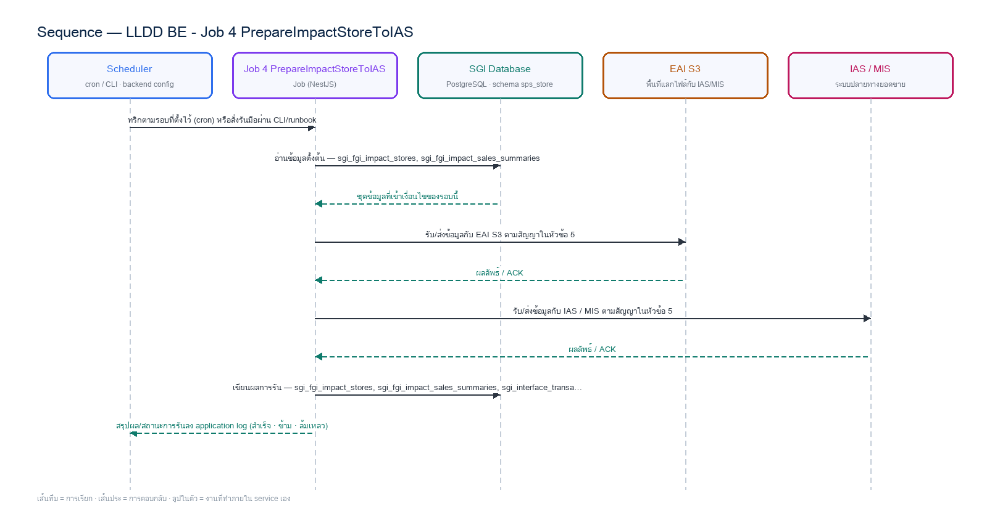

# LLDD BE - Job 4 PrepareImpactStoreToIAS

SBP Mall - ระบบประกันรายได้ | Low Level Design Document

## 1. Overview

| รายการ | รายละเอียด |
| --- | --- |
| Track | BE |
| Estimate | **17 ชั่วโมง** = implementation 13 + unit test 4 (30%) |
| Owner | Aphiwit &lt;Bank&gt; Khammoon |
| Target repository | **`SBP/srm-sps-spsap-sop-sgi-batch`** (NestJS 11 + TypeORM · schema `sps_store` · **มติ 2026-09-02 — ย้ายมาจาก store-backend**) — batch runner ของ SBP ที่รันอยู่แล้ว 42 job บน **AWS Batch** · ลงทะเบียน job ใน `src/main.ts` แล้วรับ argument ผ่าน `JOB_NAME`/`INPUT` (local) หรือ `argv[3]`/`argv[2]` (AWS Batch) · **ไม่ผ่าน BFF และไม่เปิด HTTP** · ตารางเวลาเป็น AWS Batch scheduled event ไม่ใช่ `@Cron` · ดู `SBP/srm-sps-spsap-sop-sgi-batch.md` |
| Objective | เตรียมและส่งคำขอยอดขายไป IAS: สร้างไฟล์คำขอยอดขาย IAS/MIS แบบ durable ก่อนเปลี่ยนสถานะ W→P แล้วบันทึก transactional outbox เพื่อส่งซ้ำได้โดยไม่สร้างรายการซ้ำ · **วางไฟล์บน EAI S3** (มติ 2026-08-24 — แทน SFTP ตรงไป IAS) |

Common contract reference: ทุกหัวข้อ API/FE ต้องยึด LLDD-BE-API-Common-Contracts และ LLDD-FE-Integration-Contracts สำหรับ error/auth/format/pagination/action/RBAC ก่อนลงรายละเอียดเฉพาะหน้าหรือเฉพาะ endpoint

### 1.1 เอกสาร LLDD ที่เกี่ยวข้อง

ตารางนี้สร้างจาก endpoint และตารางที่เอกสารฉบับนี้ประกาศไว้จริง — อ่านฉบับที่อยู่ในตารางก่อนลงมือ เพื่อไม่ให้สัญญา request/response หรือชื่อคอลัมน์หลุดจากกัน

| ความสัมพันธ์ | เอกสาร LLDD | เกี่ยวข้องตรงไหน |
| --- | --- | --- |
| สัญญากลาง | **LLDD-BE-API-Common-Contracts** | envelope `{success,data}` · error code · pagination · รูปแบบวันที่/เลขเอกสาร |
| โครงสร้างข้อมูล | **LLDD-BE-Database-Structure** | DDL ของตารางที่หัวข้อ Reference DB Mapping อ้างถึง |
| แพลตฟอร์มระบบเดิม | **LLDD-BE-Integration-SBP-Platform** | header จาก BFF (`x-api-key` / `x-user-*`) · การ reuse ตารางและ service ของระบบ SBP เดิม |
| ต้องจบก่อน (ลำดับงาน) | **LLDD-BE-API-Common-Contracts** | เป็นฉบับต้นทางของสัญญา/โครงที่ฉบับนี้อ้าง |
| ต้องจบก่อน (ลำดับงาน) | **LLDD-BE-Job-2-ImportImpactStore** | เป็นฉบับต้นทางของสัญญา/โครงที่ฉบับนี้อ้าง |

## 2. Screen / Functional Scope

- Main class/script: fgi.main.PrepareImpactStoreToIAS / FGI_ExportImpactStoreToAMS.sh
- Phase: B
- Output: AMS06001O (UTF-8)
- Estimate: 13 ชั่วโมง
- Argument รับผ่าน `INPUT` (JSON) — local ใช้ env `JOB_NAME`/`INPUT` · AWS Batch ใช้ `argv[3]`/`argv[2]` · ดูหัวข้อ 5.95 · ไม่มีตาราง job_configs และไม่มีหน้าจอควบคุม (หน้า Flow Batch Job ในกลุ่มเมนู Flow เหลือแค่ Flowchart + Database ที่ใช้ · 2026-08-06)
- ตารางเวลาตั้งที่ **AWS Batch scheduled event** (repo ไม่มี `@Cron`) — **ยกเว้น job ที่เป็น event-driven (ดูหัวข้อ Config Schema ของ job นั้น) ซึ่งห้ามตั้ง schedule** · ทุก job ถูกบันทึกลง `integration_log` โดย `main.ts` อัตโนมัติ + structured log `BATCH_START`/`BATCH_END` พร้อม `runId`

## 3. Screenshot Reference

ไม่มีภาพหน้าจอสำหรับหัวข้อนี้ — เป็นเอกสารฝั่ง Backend/Batch ที่ไม่มี UI (ภาพหน้าจอทั้งหมดอยู่ในเอกสารชุด FE)

## 4. Implementation Flow & Sequence Diagram (Reference)

### 4.1 Implementation Flow (ลำดับขั้นการทำงาน)


_รูปที่ 1: Implementation flow reference: LLDD BE - Job 4 PrepareImpactStoreToIAS_

### 4.2 Sequence Diagram (ใครคุยกับใคร ลำดับไหน)

ผู้แสดงและลำดับข้อความในภาพนี้สร้างจาก endpoint ในหัวข้อ 7 และตารางในหัวข้อ Reference DB Mapping ของเอกสารฉบับนี้เอง จึงตรงกับสัญญาเสมอ



_รูปที่ 2: Sequence diagram: LLDD BE - Job 4 PrepareImpactStoreToIAS_

## 5. Field, Format, and Validation

| Field / UI | Format | Validation | Behavior |
| --- | --- | --- | --- |
| กำหนดการรัน (Cron) | 0 16 7-16 * * | แก้ไขได้ | รันวันที่ 7-16 เวลา 16:00 |
| EAI S3 bucket + prefix (ขาออก) | eai-sgi/outbound/ias/ | ค่าคงที่/แก้ผ่านหน้าจอไม่ได้ | endpoint/region resolve จาก environment; สิทธิ์ใช้ IAM role ของ pod หรือ secretRef และจำกัดเฉพาะ prefix ขาออกของ IAS |
| Credential reference (IAM role / secret) | secret/sgi/interfaces/eai-s3 | ค่าคงที่/แก้ผ่านหน้าจอไม่ได้ | ห้ามเก็บ password/private key ใน config/env ของ job |
| Local staging path (ก่อนอัปโหลด) | /data/sgi/outbox/ias | แก้ไขได้ | ต้องรองรับ temp file, fsync และ atomic rename |

### 5.9 Input / Progress / Output Contract

| Stage | Contract for implementation |
| --- | --- |
| Input | FGI_IMPACT_STORE_SALES rows waiting for IAS sales data and EAI S3 bucket/prefix parameters. |
| Progress | query eligible stores, write outbound IAS request file, upload to EAI S3 outbound prefix, keep local backup, record success/failure and notification. |
| Output | IAS request file containing store/open-date pairs; run history includes generated file name and exported row count. |

### 5.90 Job 4 Execution Stages

query eligible stores, write outbound IAS request file, upload to EAI S3 outbound prefix, keep local backup, record success/failure and notification.

| Order | Service step | Repository | Output / failure contract |
| --- | --- | --- | --- |
| 1 | lockWaitingSalesRequests | iasRequestRepository | คืน metrics และ throw typed error; transaction/rerun ใช้ contract ด้านล่าง |
| 2 | writeDurableIasFile | iasRequestRepository | คืน metrics และ throw typed error; transaction/rerun ใช้ contract ด้านล่าง |
| 3 | markPendingAndCreateOutbox | iasRequestRepository | คืน metrics และ throw typed error; transaction/rerun ใช้ contract ด้านล่าง |
| 4 | dispatchIasOutbox | iasRequestRepository | คืน metrics และ throw typed error; transaction/rerun ใช้ contract ด้านล่าง |

### 5.91 Job 4 Run Evidence

| Evidence | Job-specific value | Acceptance |
| --- | --- | --- |
| Input identity | FGI_IMPACT_STORE_SALES rows waiting for IAS sales data and EAI S3 bucket/prefix parameters. | snapshot input file/business key/period in run record |
| Output identity | IAS request file containing store/open-date pairs; run history includes generated file name and exported row count. | reconcile input, success, reject and skipped counts |
| Dedup proof | ชื่อไฟล์ deterministic จาก period+runId และ UNIQUE(data_name,direction,business_key,period_key); outbox retry ใช้ transaction เดิม ไม่สร้าง request ซ้ำ | rerun fixture produces no duplicate target business key |
| Transaction proof | สร้างไฟล์ temp, fsync, atomic rename และคำนวณ checksum ให้สำเร็จก่อน; จากนั้น transaction เดียว lock W, update W→P และ insert outbox READY; ห้าม commit W→P ก่อนมี durable file | injected failure leaves no partial committed state outside documented boundary |
| Security proof | สิทธิ์เขียน EAI S3 ใช้ IAM role ของ pod หรือ secretRef=secret/sgi/interfaces/eai-s3; จำกัดสิทธิ์เฉพาะ prefix ขาออกของ IAS (PutObject เท่านั้น) และห้าม editable access key ในหน้าจอ/ไฟล์ config | config/log/error contains no plaintext secret |

### 5.92 Legacy Java Source Reference

| Legacy file | Line range | Responsibility to carry forward |
| --- | --- | --- |
| fcsJar/src/th/co/gosoft/fgi/main/PrepareImpactStoreToIAS.java | 28-243 | Legacy main entrypoint, file generation, upload, backup, notification. |
| fcsJar/src/th/co/gosoft/fgi/dao/jdbc/ImportStoreJdbc.java | 99-115 | Query FGI_IMPACT_STORE_SALES rows eligible for IAS request. |

Line ranges refer to the legacy Java implementation under /Users/bank_mac/gosoft/java/SBP/fcsJar. Use these ranges to preserve business behavior while implementing the target Node job.

### 5.93 Target Repository and SQL Contract

| Contract | Target implementation |
| --- | --- |
| Repository | iasRequestRepository |
| Idempotency / dedup | ชื่อไฟล์ deterministic จาก period+runId และ UNIQUE(data_name,direction,business_key,period_key); outbox retry ใช้ transaction เดิม ไม่สร้าง request ซ้ำ |
| Transaction boundary | สร้างไฟล์ temp, fsync, atomic rename และคำนวณ checksum ให้สำเร็จก่อน; จากนั้น transaction เดียว lock W, update W→P และ insert outbox READY; ห้าม commit W→P ก่อนมี durable file |
| Security | สิทธิ์เขียน EAI S3 ใช้ IAM role ของ pod หรือ secretRef=secret/sgi/interfaces/eai-s3; จำกัดสิทธิ์เฉพาะ prefix ขาออกของ IAS (PutObject เท่านั้น) และห้าม editable access key ในหน้าจอ/ไฟล์ config |

#### Input / candidate query

```sql
SELECT s.id, s.impact_process_id, s.impacted_store_code, s.new_store_code, s.impact_month
FROM sgi_fgi_impact_stores s
WHERE s.sales_request_status = 'W'
ORDER BY s.id
FOR UPDATE SKIP LOCKED;
```

#### Write / upsert query

```sql
-- bind ตามลำดับ: $1=impact_store_ids · $2=run_id · $3=file_name · $4=file_checksum
UPDATE sgi_fgi_impact_stores
SET sales_request_status = 'P', updated_at = CURRENT_TIMESTAMP
WHERE id = ANY($1 /* impact_store_ids */) AND sales_request_status = 'W';

INSERT INTO sgi_interface_transactions
    (run_id, data_name, direction, status, impact_process_id, business_key, period_key,
     file_name, file_checksum, outbox_status, purge_after)
SELECT $2 /* run_id */, 'IAS_SALES_REQUEST', 'OUT', 'READY', impact_process_id,
       impacted_store_code || ':' || new_store_code, impact_month,
       $3 /* file_name */, $4 /* file_checksum */, 'READY', CURRENT_TIMESTAMP + INTERVAL '180 days'
FROM sgi_fgi_impact_stores
WHERE id = ANY($1 /* impact_store_ids */)
ON CONFLICT (data_name, direction, business_key, period_key) DO NOTHING;
```

### 5.94 Target Node Implementation

โครงสร้างนี้ระบุ service/repository เฉพาะงานและต้อง implement ตาม SQL, transaction, idempotency และ security contract ด้านบน โดยทุกขั้นต้องคืน metrics สำหรับ reconcile และ run history

```js
export async function runLlddBeJob4Prepareimpactstoretoias(ctx, services) {
  const run = await services.jobRuns.acquire({
    jobNo: "4", period: ctx.period, triggeredBy: ctx.triggeredBy
  });

  try {
    ctx = { ...ctx, runId: run.id, repository: services.iasRequestRepository };
    const step1 = await services.lockWaitingSalesRequests(ctx, undefined);
    const step2 = await services.writeDurableIasFile(ctx, step1);
    const step3 = await services.markPendingAndCreateOutbox(ctx, step2);
    const step4 = await services.dispatchIasOutbox(ctx, step3);
    const result = step4;
    await services.jobRuns.finish(run.id, "SUCCESS", result.metrics);
    return { runId: run.id, status: "SUCCESS", ...result };
  } catch (error) {
    await services.jobRuns.finish(run.id, "FAILED", {
      errorCode: error.code ?? "JOB_FAILED",
      errorMessage: error.message
    });
    throw error;
  }
}
```

### 5.95 การลงทะเบียน job และ Arguments (sop-sgi-batch)

งานนี้ลงทะเบียนเป็น job ชื่อ **`sgi-prepare-impact-store-to-ias`** ใน `src/main.ts` ของ `SBP/srm-sps-spsap-sop-sgi-batch` โดยใช้ dispatcher เดิมของ repo (ไม่สร้าง runner ใหม่) — `main.ts` อ่านชื่อ job และ input มา 2 ทาง แล้วเลือกอัตโนมัติจากการมี `argv[3]` หรือไม่

| ช่องทางรัน | ชื่อ job มาจาก | input มาจาก | ตัวอย่าง |
| --- | --- | --- | --- |
| Local / CLI / runbook | env `JOB_NAME` | env `INPUT` (JSON string) | `JOB_NAME=sgi-prepare-impact-store-to-ias INPUT='{"year":2026,"month":6}' npm run start` |
| AWS Batch (ตารางเวลาจริง) | `process.argv[3]` | `process.argv[2]` (JSON string) | `node dist/main.js '{"year":2026,"month":6}' sgi-prepare-impact-store-to-ias` |

**ตารางเวลาไม่ได้อยู่ในโค้ด** — repo นี้ไม่มี `@Cron`/`@Interval` แม้แต่จุดเดียว (แม้ติดตั้ง `@nestjs/schedule` ไว้) cron ในหัวข้อ 5 เป็น **นิยามของ AWS Batch scheduled event** ที่ต้องตั้งตอน deploy ไม่ใช่ค่าที่อ่านจาก config file

#### Argument ที่รับได้ (`INPUT` เป็น JSON object · ไม่ส่ง = `{}`)

**ระบบเดิมรับ argument แบบนี้:** **ไม่รับ args** — ใช้ปี/เดือน**ปัจจุบัน** จาก `Calendar` ไปประกอบชื่อไฟล์ (`ftpFileTimePattern`) และแปลง พ.ศ.→ค.ศ. เมื่อ `year > 2100`  
ของใหม่เปลี่ยนจาก positional string เป็น JSON เพื่อให้เพิ่มฟิลด์ได้โดยไม่พังของเดิม แต่ **ต้องรองรับทุกอย่างที่ระบบเดิมรับได้เป็นอย่างน้อย** — ห้ามลดความสามารถลง

| Field | ชนิด | ไม่ส่งแล้วได้อะไร (default) | Validation | ตรงกับ argument เดิม |
| --- | --- | --- | --- | --- |
| `year` | number | ปีปัจจุบัน | ค.ศ. 4 หลัก | **ของใหม่** — legacy ไม่มี ทำให้ rerun งวดย้อนหลังไม่ได้ |
| `month` | number | เดือนปัจจุบัน | 1-12 | **ของใหม่** |
| `dryRun` | boolean | `false` | `true` = อ่าน/คำนวณครบแต่ไม่ commit และไม่ publish/ไม่ส่งไฟล์ | **ของกลาง** ทุก job |
| `limit` | number | `null` | จำกัดจำนวนรายการที่ประมวลผลรอบนี้ (ใช้ตอน smoke test) | **ของกลาง** ทุก job |

**กติกาการ validate ที่ทุก job ต้องทำเหมือนกัน** — parse `INPUT` ไม่สำเร็จ หรือฟิลด์ไม่ผ่าน validation ให้ log `BATCH_END` ด้วย `batchStatus: 'FAILED'` แล้ว `exit(1)` **ก่อนแตะฐานข้อมูล** (ห้าม fallback ไปค่า default เงียบ ๆ เมื่อผู้ใช้ตั้งใจส่งค่ามาแล้วผิด) · ฟิลด์ที่ไม่รู้จักให้ log warn แล้วข้าม ไม่ทำให้ job ล้ม

- ชื่อไฟล์ยังเป็น `AMS06001O_yyyyMMddHHmm.txt` ที่สร้างจากเวลา ณ ตอนรัน — `year`/`month` ใช้คัดงวดของ candidate ไม่ใช่เปลี่ยนชื่อไฟล์

### 5.96 เงื่อนไขตัดสิน (Decision Rules) — ตัดสินจากอะไร

Job 4 ตัดสินว่า **ร้านไหนพร้อมขอยอดขายจาก IAS/MIS แล้ว** — ไม่ใช่ทุกแถวที่สถานะ `'W'` จะถูกส่ง เพราะมีเงื่อนไข **อายุร้าน** และ **ระยะเวลารอหลังร้านใหม่เปิด** คุมอยู่ และทั้งสองข้อนี้หายไปจากเอกสารเดิม

| คำถามที่โค้ดต้องตอบ | ตัดสินจาก (ตาราง · คอลัมน์) | เงื่อนไขที่ต้องเป็นจริง | ไม่เข้าเงื่อนไขแล้วทำอะไร |
| --- | --- | --- | --- |
| ร้านนี้พร้อมส่งขอยอดขายหรือยัง | `sgi_fgi_impact_stores.verify_status` · `.sales_request_status` + **วันเปิดร้านจาก `mas_store.open_date`** ของทั้งร้าน I (`impacted_store_code`) และร้าน N (`new_store_code`) | ต้องจริงครบ 4 ข้อ: (0) **`verify_status = 'P'`** (ผ่านกฎของ Job 2 มาแล้ว) (1) `sales_request_status = 'W'` (2) **ร้านเก่าเปิดก่อนร้านใหม่อย่างน้อย 12 เดือน 15 วัน** → `open_date(I) <= (open_date(N) - 12 เดือน) - 15 วัน` (3) **วันนี้ต้องเลย `open_date(N) + 15 + 1` วันไปแล้ว** | ไม่ครบ = ไม่ส่งรอบนี้ ค้างเป็น `'W'` ให้รอบถัดไปหยิบ — **ไม่ใช่ error และไม่นับเป็น rejected** |
| ส่งอะไรลงไฟล์ | คอลัมน์เดียวกับข้างบน | 1 บรรทัด = `impacted_store_code + '\|' + to_char(open_date(N),'YYYYMMDD')` · เรียงด้วย `open_date(N)`, `impacted_store_code` | จำนวนบรรทัดต้องเท่ากับจำนวน candidate ที่ล็อกไว้ ไม่เท่า = ยกเลิกทั้งรอบ |
| เปลี่ยนสถานะเมื่อไร | `sgi_fgi_impact_stores.sales_request_status` | `'W' → 'P'` **หลังเขียนไฟล์ลงดิสก์สำเร็จ (fsync + atomic rename) แล้วเท่านั้น** และอยู่ transaction เดียวกับ insert outbox | อัปโหลด S3 ล้มเหลว **ห้ามย้อน `'P' → 'W'`** (จะสร้างไฟล์ซ้ำ) — ให้ outbox retry แทน |

#### ⚠️ ช่องว่างของ schema ที่ต้องปิดก่อน implement เงื่อนไขข้างบนได้จริง

แถวในตารางนี้ไม่ใช่ "ข้อควรระวัง" แต่เป็น **ของที่ยังไม่มีในโครง 20 ตาราง** — เขียนโค้ดตามเงื่อนไขด้านบนแล้วจะ compile ไม่ผ่าน/คิวรีพังทันที

| # | สิ่งที่ขาด | ต้องทำอะไรก่อน |
| --- | --- | --- |
| **G4** ⏳ ยังค้าง | ไม่มีคอลัมน์วันเปิดร้านใน `sgi_*` เลย (`open_date` ไม่ปรากฏใน DDL ทั้ง 19 ตาราง) — **และจะไม่เพิ่ม** (วันเปิดร้านเป็น master ของระบบเดิม คัดลอกมาเก็บจะ stale) | เงื่อนไข 12 เดือน 15 วัน และ 16 วัน ต้อง join ออกไปที่ `mas_store.open_date` (schema `sps_store`) ทุกครั้ง — ต้องยืนยัน **สิทธิ์อ่าน + index บน `mas_store.branch_id`** ก่อน implement |

#### ค่าคงที่และโดเมนที่ใช้ในเงื่อนไขข้างบน

ทุกค่าในตารางนี้ต้องอ่านจาก config/env ไม่ hardcode ในคิวรี — แต่ **ค่าตั้งต้นต้องเท่าระบบเดิมทุกตัว** ไม่งั้นผลลัพธ์จะไม่ตรงกันตอนเทียบ UAT

| ค่า | โดเมน / ค่าที่ระบบเดิมใช้ | ที่มา |
| --- | --- | --- |
| ระยะห่างอายุร้าน | 12 เดือน 15 วัน | `FgiConstant.INTERVAL_MONTH = 12` · `INTERVAL_DAY = 15` |
| ระยะรอหลังร้านใหม่เปิด | 15 + 1 = 16 วัน | `TRUNC(SYSDATE) > (TRUNC(OPENDATE_N + 15) + 1)` |
| สถานะของ `sales_request_status` | `W` = รอส่งขอ · `P` = ส่งขอแล้วรอไฟล์ตอบกลับ · `Y` = ได้ยอดแล้ว · `E` = ผิดพลาด | `CHECK` ใน DDL |

#### SQL คัด candidate (แปลงจาก `ImportStoreJdbc.getPrepareImpactStoreToIASList` บรรทัด 99-115)

ค่า 12 / 15 ต้องอ่านจาก config ไม่ hardcode ในคิวรี แต่ **ค่าตั้งต้นต้องเท่าระบบเดิม** ไม่งั้นจำนวนร้านที่ส่งขอจะไม่ตรงกับของเดิมตอนเทียบ UAT

```sql
SELECT fis.id,
       fis.impact_process_id,
       fis.impacted_store_code,
       fis.new_store_code,
       fis.impact_month,
       fis.impacted_store_code || '|' || to_char(ms_n.open_date, 'YYYYMMDD') AS line
FROM sgi_fgi_impact_stores fis
JOIN mas_store ms_i ON ms_i.branch_id = fis.impacted_store_code   -- schema sps_store (อ่านอย่างเดียว)
JOIN mas_store ms_n ON ms_n.branch_id = fis.new_store_code
WHERE fis.verify_status = 'P'          -- ผ่านกฎ DENY/ON_PROCESS ของ Job 2 มาแล้วเท่านั้น
  AND fis.sales_request_status = 'W'
  AND ms_i.open_date <= date_trunc('day', ms_n.open_date - INTERVAL '12 months' - INTERVAL '15 days')
  AND date_trunc('day', CURRENT_DATE) > date_trunc('day', ms_n.open_date + INTERVAL '15 days') + INTERVAL '1 day'
ORDER BY ms_n.open_date, fis.impacted_store_code
FOR UPDATE OF fis SKIP LOCKED;
```

### 5.97 Job 4 Atomic File / Outbox Sequence

| Order | Required action | Failure behavior |
| --- | --- | --- |
| 1 | lock candidate W ด้วย FOR UPDATE SKIP LOCKED และสร้าง payload ใน memory | validation fail: rollback lock; สถานะยัง W |
| 2 | เขียน temporary file, fsync, atomic rename และคำนวณ SHA-256 | write/rename/checksum fail: ลบ temp; สถานะยัง W; ไม่สร้าง outbox |
| 3 | transaction เดียว update W→P และ insert sgi_interface_transactions/outbox READY | DB fail: rollback W→P และ outbox; durable file คงไว้ให้ cleanup/reconcile โดย checksum |
| 4 | dispatcher อ่าน READY แล้วอัปโหลดขึ้น EAI S3 (prefix ขาออก); compare checksum ก่อนส่ง | อัปโหลด fail: outbox ยัง READY/FAILED_RETRY; ห้ามเปลี่ยน candidate กลับ W เพื่อไม่ให้สร้างไฟล์ซ้ำ |
| 5 | publish สำเร็จ mark SENT + outbox_status = PUBLISHED; ได้ publisher confirm จึง CONFIRMED + status = COMPLETED | ใช้ transaction id เดิมตลอด lifecycle |

## 6. Button / User Action Mapping

| Action | Trigger | API / Service | Expected Result |
| --- | --- | --- | --- |
| รันตามตารางเวลา | CRON | scheduler → runner (job 4) | อ่าน cron/พารามิเตอร์จาก backend config |
| รันนอกรอบ (manual/rerun) | CLI | CLI/ops runbook → runner (job 4) | guard ไม่ให้รันซ้อนด้วย distributed lock |
| แก้พารามิเตอร์/เปิด-ปิด job | CONFIG | แก้ backend config แล้ว deploy | ไม่มี endpoint และไม่มีหน้าจอควบคุม — หน้า Flow Batch Job เป็น reference อย่างเดียว (2026-08-06) |
| ตรวจผลการรัน | LOG | application log (structured) | ไม่มีตาราง job_run_histories แล้ว · ผลการรับส่งไฟล์/ข้อความดูที่ sgi_interface_transactions |

## 7. API Contract

**เอกสารฉบับนี้ไม่มี endpoint ของตัวเอง** — เป็นสัญญา/งานภายในที่เอกสารอื่นเรียกใช้ (ดูขอบเขตใน 5.90 Endpoint Implementation Contract) · รายการ endpoint ทั้ง 28 เส้นของ SGI อยู่ที่ **LLDD-API** และ `api.md`

## 8. Reference DB Mapping (No Database Page Work)

ส่วนนี้เป็นข้อมูลอ้างอิงสำหรับการ implement API/Job เท่านั้น ไม่ใช่งานสร้างหน้า Database, ไม่ใช่งานออกแบบ DB page และไม่ถูกนับเป็น deliverable แยกของ FE/BE

| Table / Object | R/W | Usage |
| --- | --- | --- |
| sgi_fgi_impact_stores | R/W | lock candidate W และเปลี่ยนเป็น P หลัง durable file สำเร็จเท่านั้น |
| sgi_fgi_impact_sales_summaries | R/W | สร้าง/ผูกหัวสรุปยอดขายใน transaction |
| sgi_interface_transactions | W | transactional outbox READY/SENT/COMPLETED + outbox_status READY/PUBLISHED/CONFIRMED พร้อม checksum และ idempotency key |
| (application log แบบ structured) | W | run status และ reconcile count — ตาราง job_run_histories ถูกตัด 2026-08-06 |

## 9. Skeleton Code (Batch Job 4)

### 9.1 ผังไฟล์ที่ต้องสร้าง (Job 4) — บน `srm-sps-spsap-sop-sgi-batch`

โครงไฟล์ของ Job 4 (fgi.main.PrepareImpactStoreToIAS เดิม) วางใต้ `src/modules/sgi/` ตาม convention ที่ repo นี้ใช้อยู่จริง (ดูตัวอย่างที่ `src/modules/performance/import-qssi.service.ts`): service ถือ logic ทั้งหมด, inject `DataSource`/repository ผ่าน TypeORM, ยิง raw SQL ได้ตรง, และ **ไม่มี controller** เพราะ repo นี้ไม่เปิด HTTP

**สิ่งที่ reuse ได้ทันที ไม่ต้องเขียนใหม่** — ต่างจากแผนเดิมที่ตั้งไว้บน store-backend ซึ่งต้องสร้าง runner ทั้งชุดเอง: `src/main.ts` (dispatcher + `BATCH_START`/`BATCH_END` + `runId` + log ลง `integration_log` อัตโนมัติ) · `src/modules/rabbitMQ/rabbitmq.service.ts` (`publishMessage`) · `src/shared/services/s3.service.ts` · `StatementService.decodeThaiFileContent()` (WINDOWS-874 auto-detect) · `@gosoft-sbp/email-lib` · `@srm/glb-log`

⚠️ **สิ่งที่ repo นี้ยังไม่มี และเป็นงานตั้งต้นจริง**: (1) ไม่มี `@Cron` เลย — ตารางเวลาต้องตั้งเป็น **AWS Batch scheduled event** (2) ไม่มี distributed lock (`pg_try_advisory_lock`) — การกันรันซ้อนพึ่ง AWS Batch queue ถ้างานไหนรับความเสี่ยงนี้ไม่ได้ต้องเพิ่มเอง (3) `publishMessage` เป็น fire-and-forget **ไม่มี publisher confirm และไม่มี outbox** — งานที่ต้องการ **transactional outbox + publisher confirm** (Job 6 · และ `sgi_reflow` ฝั่ง BE) ต้องสร้างกลไกเพิ่มเอง ไม่ใช่ reuse ได้เลย · ⚠️ ไม่มี ACK ระดับธุรกิจให้รอ (มติ 2026-09-08 ข้อ 2.13) (4) ยังไม่มี entity/ตาราง `sgi_*` แม้แต่ตัวเดียว

| Path | หน้าที่ |
| --- | --- |
| src/modules/sgi/job-4-prepare-impact-store-to-ias.service.ts | คลาส `PrepareImpactStoreToIasService` — **`execute(input)` เป็น entry point เดียว** เรียงตาม flow ของ Job 4 ทีละขั้น ครอบ transaction เอง และจบด้วย structured log สรุป metrics (แบบเดียวกับ `ImportQssiService.execute(body)` ที่มีอยู่) |
| src/modules/sgi/job-4-prepare-impact-store-to-ias.service.spec.ts | unit test ของ service — repo นี้วาง spec ไว้ข้างไฟล์จริงเสมอ (`jest` + `npm run test:ci` มี coverage/SonarQube) |
| src/modules/sgi/dto/job-4-prepare-impact-store-to-ias-input.dto.ts | DTO ของ `INPUT` (JSON) พร้อม `class-validator` ตามตารางในหัวข้อ 9.2 — parse ไม่ผ่านต้อง fail ก่อนแตะ DB |
| src/modules/sgi/sgi.module.ts | NestJS module ของกลุ่มงานประกันรายได้ — ผูก service ทุกตัวของ SGI เข้ากับ `TypeOrmModule` (ไฟล์ร่วมของทุก job ให้ merge ไม่ใช่เขียนทับ) |
| src/main.ts | **เพิ่ม `case 'sgi-job-4-prepare-impact-store-to-ias':`** ในสวิตช์เดิม → `await import('./modules/sgi/job-4-prepare-impact-store-to-ias.service')` แล้ว `app.get(PrepareImpactStoreToIasService).execute(input)` (ไฟล์กลางของทุก job — เป็นจุด merge conflict ที่ต้องระวัง) |
| src/entities/sgi-*.entity.ts | entity ของตาราง `sgi_*` ที่หัวข้อ Reference DB Mapping อ้างถึง — **ยังไม่มีใน repo เลยสักตัว** ต้องสร้างใหม่ทั้งหมด |
| src/config/config.ts | เพิ่ม `export const sgiJob4Config` ตามแบบของไฟล์นี้ (โปรเจกต์ไม่ใช้ `registerAs`) — ค่าคงที่ทางธุรกิจของ Job 4 |

#### การลงทะเบียนใน `src/main.ts` (job `sgi-job-4-prepare-impact-store-to-ias`)

```js
// src/main.ts — เพิ่มเคสนี้ในสวิตช์เดิม (เรียงต่อจาก job ของ SGI ตัวก่อนหน้า)
      case 'sgi-job-4-prepare-impact-store-to-ias': {
        const { PrepareImpactStoreToIasService } = await import('./modules/sgi/job-4-prepare-impact-store-to-ias.service');
        const job4prepareimpactstoretoiasService = app.get(PrepareImpactStoreToIasService);
        await job4prepareimpactstoretoiasService.execute(input);   // input = JSON ที่ parse จาก INPUT/argv[2] แล้ว
        break;
      }
```

`main.ts` เรียก `StatementService.logInterfest('sgi-job-4-prepare-impact-store-to-ias', input)` ให้อยู่แล้วก่อนเข้าสวิตช์ → **ไม่ต้องเขียน log ลง `integration_log` เองซ้ำ** · และ `BATCH_END` ที่ท้ายไฟล์จะสรุป `batchStatus` + `durationMs` ให้อัตโนมัติ หน้าที่ของ service คือ throw เมื่อทำงานไม่สำเร็จเท่านั้น

### 9.2 Config Schema ของ Job 4 (backend config / env)

ตารางเวลาของ Job 4 คือ `0 16 7-16 * *` (วันที่ 7–16 เวลา 16:00) — ⚠️ **ตัวจริงตั้งที่ AWS Batch scheduled event ไม่ใช่ในโค้ด** (repo นี้ไม่มี `@Cron` เลย) ค่า `SGI_JOB4_CRON` เก็บไว้เป็นเอกสารประกอบ/ตรวจสอบเท่านั้น · `SGI_JOB4_ENABLED=false` ให้ `execute()` จบทันทีแบบ SUCCESS พร้อม log เหตุผล (กันกรณี AWS Batch ยังยิงเข้ามา)

```ts
// src/config/config.ts — เพิ่มบล็อกนี้ต่อท้าย (repo ใช้ export const ไม่ใช้ registerAs)
// convention จริงของ sop-sgi-batch คือ `export const` ใน `src/config/config.ts` (ไม่ใช้ registerAs · ดูของเดิมที่
// `AppConfigModule` แบบ @Global แล้วอ่าน process.env ตรง ๆ) — โปรเจกต์นี้ **ไม่ได้ใช้ registerAs**
// แม้แต่จุดเดียว จึงประกาศเป็นคลาสให้รีวิว/ทดสอบเหมือน config ตัวอื่น
import { Injectable } from '@nestjs/common';

// TODO: Job 4 ไม่มีตาราง job_configs และไม่มี Job Admin API แล้ว (ตัดสินใจ 2026-08-06)
// TODO: ค่าทุกตัวอ่านจาก env/config file ของ backend เท่านั้น — เปลี่ยนค่า = แก้ config แล้ว deploy
export interface Job4Config {
  /** เปิด/ปิด job รอบถัดไปโดยไม่ต้อง deploy โค้ด */
  enabled: boolean;
  /** ตารางเวลาของ job นี้ — บันทึกไว้เพื่ออ้างอิงเท่านั้น ตัวจริงตั้งที่ AWS Batch scheduled event */
  cron: string;
  /** กำหนดการรัน (Cron) — รันวันที่ 7-16 เวลา 16:00 */
  cron: string;
  /** EAI S3 bucket + prefix (ขาออก) — endpoint/region resolve จาก environment; สิทธิ์ใช้ IAM role ของ pod หรือ secretRef และจำกัดเฉพาะ prefix ขาออกของ IAS */
  eaiS3Bucket: string;
  /** Credential reference (IAM role / secret) — ห้ามเก็บ password/private key ใน config/env ของ job */
  credentialReferenceIam: string;
  /** Local staging path (ก่อนอัปโหลด) — ต้องรองรับ temp file, fsync และ atomic rename */
  localStagingPath: string;
  /** ผู้รับอีเมลเมื่อ job ล้มเหลว — เก็บเป็น string คั่น comma ให้ตรง signature ของ
      `EmailLibService.sendMail({ mailTo })` ที่รับ string ไม่ใช่ string[] */
  mailTo: string;
}

@Injectable()
export class SgiJob4Config implements Job4Config {
  // TODO: ยืนยันค่า default ทุกตัวกับ Ops ก่อนขึ้น production (ไม่มีหน้าจอแก้ค่าแล้ว)
  enabled = (process.env.SGI_JOB4_ENABLED ?? 'true') === 'true';
  cron = process.env.SGI_JOB4_CRON ?? '0 16 7-16 * *';
  cron = process.env.SGI_JOB4_CRON ?? '0 16 7-16 * *'; // TODO: แก้ผ่าน env/config file แล้ว deploy
  eaiS3Bucket = process.env.SGI_JOB4_EAI_S3_BUCKET ?? 'eai-sgi/outbound/ias/'; // TODO: ค่าคงที่ทางธุรกิจ — เปลี่ยนต้องผ่านการอนุมัติ
  credentialReferenceIam = process.env.SGI_JOB4_CREDENTIAL_REFERENCE_IAM ?? 'secret/sgi/interfaces/eai-s3'; // TODO: ค่าคงที่ทางธุรกิจ — เปลี่ยนต้องผ่านการอนุมัติ
  localStagingPath = process.env.SGI_JOB4_LOCAL_STAGING_PATH ?? '/data/sgi/outbox/ias'; // TODO: แก้ผ่าน env/config file แล้ว deploy
  mailTo = process.env.SGI_JOB4_MAIL_TO ?? ''; // TODO: ผู้รับอีเมลแจ้ง error คั่นด้วย comma (เดิม: email-lib กลาง (sendEmail) แจ้งเมื่อ durable write, DB transaction หรือการอัปโหลดขึ้น EAI S3 retry เกิน threshold)
}

// TODO: เพิ่ม SgiJob4Config ใน providers/exports ของ AppConfigModule (@Global) เหมือน AppConfig
```

### 9.3 Job Class — `run(ctx)` ของ Job 4 ทีละขั้นตามผัง

#### 9.3.1 สัญญาของชั้นกลาง (`runner.ts`) + โครง service ของ Job 4

service อ้าง `JobRunContext` / `JobRunResult` / `JobState` / `JobFailedError` — ทั้งหมดนิยาม ครั้งเดียวใน `src/modules/sgi/sgi-job.types.ts` (ไฟล์ร่วมของทุก job ให้ merge ไม่ใช่เขียนทับ) และ service ต้องมี method ครบตามตารางขั้นตอนด้านล่าง มิฉะนั้น `execute(input)` จะเรียก method ที่ไม่มีอยู่

```ts
// src/modules/sgi/sgi-job.types.ts — สัญญากลางของทุก job ของ SGI (ประกาศครั้งเดียว ใช้ร่วมทั้ง 10 ฉบับ)

export interface JobRunContext {
  jobNo: string;
  period: string;        // YYYYMM ของงวดที่รัน
  triggeredBy: string;   // 'CRON' | userId ที่สั่งรันนอกรอบ
  params?: Record<string, string>;
}

export interface JobRunResult {
  event: 'job.finish';
  jobNo: string;
  jobName: string;
  status: 'SUCCESS' | 'SKIPPED' | 'SKIPPED_LOCKED' | 'FAILED';
  period: string;
  output: string;
  read: number; written: number; skipped: number; rejected: number;
  durationMs: number;
}

/** counter + ค่าที่ทุกขั้นของ job ใช้ร่วมกัน (service เป็นผู้สร้างผ่าน createState) */
export interface JobState {
  period: string;
  read: number; written: number; skipped: number; rejected: number;
  // TODO: เพิ่ม field เฉพาะของ job นี้ (เช่น rows ที่อ่านมา, path ไฟล์ที่เขียน)
  [key: string]: unknown;
}

/** error ที่ทำให้ job จบเป็น FAILED และส่งอีเมลแจ้งผู้ดูแล */
export class JobFailedError extends Error {
  constructor(public readonly code: string, message: string) { super(message); }
}

/** ใช้ออกจาก transaction เมื่อสาขา NO บอกให้ข้ามงวด/เรคคอร์ด — runner สรุปเป็น SKIPPED ไม่ใช่ FAILED */
export class JobSkippedError extends Error {}
```

```ts
// PrepareImpactStoreToIasService — method ที่ job class เรียก (1 method ต่อ 1 ขั้นในตารางด้านบน)
import { Inject, Injectable } from '@nestjs/common';
import type { DataSource, EntityManager } from 'typeorm';
import type { JobRunContext, JobState } from '../../runner';
export type { JobState };

@Injectable()
export class PrepareImpactStoreToIasService {
  constructor(@Inject('DATA_SOURCE') private readonly dataSource: DataSource) {}

  createState(ctx: JobRunContext): JobState {
    return { period: ctx.period, read: 0, written: 0, skipped: 0, rejected: 0 };
  }

  // lock รายการ sales_request_status=W
  async step02Process(state: JobState, manager?: EntityManager): Promise<void> {
    throw new Error('step02Process: ยังไม่ได้ implement — ดู SQL ที่หัวข้อ Repository / SQL และกติกาที่หัวข้อเงื่อนไขตัดสิน');
  }

  // สร้าง temporary file และ validate record count
  async step03Validate(state: JobState, manager?: EntityManager): Promise<void> {
    throw new Error('step03Validate: ยังไม่ได้ implement — ดู SQL ที่หัวข้อ Repository / SQL และกติกาที่หัวข้อเงื่อนไขตัดสิน');
  }

  // fsync + atomic rename + SHA-256
  async step04Process(state: JobState, manager?: EntityManager): Promise<void> {
    throw new Error('step04Process: ยังไม่ได้ implement — ดู SQL ที่หัวข้อ Repository / SQL และกติกาที่หัวข้อเงื่อนไขตัดสิน');
  }

  // transaction: update W→P + insert outbox READY
  async step05Insert(state: JobState, manager?: EntityManager): Promise<void> {
    throw new Error('step05Insert: ยังไม่ได้ implement — ดู SQL ที่หัวข้อ Repository / SQL และกติกาที่หัวข้อเงื่อนไขตัดสิน');
  }

  // dispatcher อัปโหลดไฟล์ขึ้น EAI S3 (prefix ขาออก) ด้วย IAM role/secretRef
  async step06Upload(state: JobState, manager?: EntityManager): Promise<void> {
    throw new Error('step06Upload: ยังไม่ได้ implement — ดู SQL ที่หัวข้อ Repository / SQL และกติกาที่หัวข้อเงื่อนไขตัดสิน');
  }

}
```

#### 9.3.2 `run(ctx)` ของ Job 4

ทุกขั้นใน `run()` ตรงกับ flowchart ของ Job 4 หนึ่งต่อหนึ่ง (decision และ error path รวมอยู่ด้วย) — method ที่ต้อง implement ใน service ตามตารางนี้

| ลำดับ | ชนิด | ขั้นตอนจากผัง | Method ที่ต้อง implement | เส้นทาง NO / error |
| --- | --- | --- | --- | --- |
| 1 | start | เริ่ม | createState() | - |
| 2 | process | lock รายการ sales_request_status=W | step02Process() | throw JobFailedError เมื่อทำไม่สำเร็จ |
| 3 | process | สร้าง temporary file และ validate record count | step03Validate() | throw JobFailedError เมื่อทำไม่สำเร็จ |
| 4 | process | fsync + atomic rename + SHA-256 | step04Process() | throw JobFailedError เมื่อทำไม่สำเร็จ |
| 5 | process | transaction: update W→P + insert outbox READY | step05Insert() | throw JobFailedError เมื่อทำไม่สำเร็จ |
| 6 | io | dispatcher อัปโหลดไฟล์ขึ้น EAI S3 (prefix ขาออก) ด้วย IAM role/secretRef | step06Upload() | throw JobFailedError เมื่อทำไม่สำเร็จ |
| 7 | end | จบ | summarize() | - |

```ts
// src/modules/sgi/job-4-prepare-impact-store-to-ias.service.ts — execute(input) เป็น entry point เดียว
import { Inject, Injectable, Logger } from '@nestjs/common';
import type { DataSource, EntityManager } from 'typeorm';
import { PrepareImpactStoreToIasService, type JobState } from './job-4-prepare-impact-store-to-ias.service';
// 4 symbol นี้นิยามใน src/modules/sgi/sgi-job.types.ts (ไฟล์ร่วมของทุก job — ดูหัวข้อก่อนหน้า)
import { JobFailedError, JobSkippedError, JobRunContext, JobRunResult } from '../../runner';

@Injectable()
export class PrepareImpactStoreToIasJob {
  static readonly jobNo = '4';
  private readonly logger = new Logger(PrepareImpactStoreToIasJob.name);

  constructor(
    // TODO: repo นี้ตั้ง replication ใน typeorm.config.ts อยู่แล้ว — SELECT ไป slave, write ไป master อัตโนมัติ
    @Inject('DATA_SOURCE') private readonly dataSource: DataSource,
    private readonly service: PrepareImpactStoreToIasService,
  ) {}

  async run(ctx: JobRunContext): Promise<JobRunResult> {
    const startedAt = Date.now();
    // TODO: state ถือ counter (read/written/skipped/rejected) และค่าจาก job4Config
    const state = this.service.createState(ctx);
    try {
      // ขั้นที่ 2: lock รายการ sales_request_status=W · TODO: FOR UPDATE SKIP LOCKED
      await this.service.step02Process(state);
      // === transaction boundary === TODO: durable file ก่อน; transaction เดียว update W→P + insert outbox READY; dispatcher ส่งภายหลัง
      await this.dataSource.transaction(async (manager: EntityManager) => {
        // ขั้นที่ 3: สร้าง temporary file และ validate record count · TODO: ยังไม่เปลี่ยน W→P
        await this.service.step03Validate(state, manager);
        // ขั้นที่ 4: fsync + atomic rename + SHA-256 · TODO: ไฟล์ต้อง durable ก่อนเริ่ม DB transaction
        await this.service.step04Process(state, manager);
        // ขั้นที่ 5: transaction: update W→P + insert outbox READY · TODO: fail แล้ว rollback ทั้งสถานะและ outbox
        await this.service.step05Insert(state, manager);
      });
      // ขั้นที่ 6: dispatcher อัปโหลดไฟล์ขึ้น EAI S3 (prefix ขาออก) ด้วย IAM role/secretRef · TODO: retry จาก outbox transaction เดิม
      await this.service.step06Upload(state);
      return this.summarize(state, 'SUCCESS', startedAt);
    } catch (error) {
      // TODO: error path ของ Job 4 — Target remediation: ห้าม commit W→P ก่อน fsync/atomic rename/checksum สำเร็จ และห้ามส่ง อัปโหลดขึ้น S3 โดยไม่มี outbox
      this.logger.error(JSON.stringify({ event: 'job.failed', jobNo: '4', period: ctx.period,
        triggeredBy: ctx.triggeredBy, durationMs: Date.now() - startedAt, error: (error as Error).message }));
      // TODO: แจ้งผู้ดูแลผ่าน JobFailureNotifier (หัวข้อ 9.6.1) — runner เป็นผู้เรียกให้
      throw error;
    }
  }

  private summarize(state: JobState, status: JobRunResult['status'], startedAt = Date.now()): JobRunResult {
    // TODO: structured log บรรทัดเดียวจบ — ไม่มีตาราง job_run_histories แล้ว (2026-08-06)
    const summary = {
      event: 'job.finish', jobNo: '4', jobName: 'PrepareImpactStoreToIAS', status,
      period: state.period, output: 'AMS06001O (UTF-8)',
      read: state.read, written: state.written, skipped: state.skipped,
      rejected: state.rejected, durationMs: Date.now() - startedAt,
    };
    this.logger.log(JSON.stringify(summary));
    return summary as JobRunResult;
  }
}
```

### 9.4 การกันรันซ้อนของ Job 4 (PostgreSQL advisory lock — **ของใหม่**)

Job 4 มีข้อควรระวังจาก legacy: Target remediation: ห้าม commit W→P ก่อน fsync/atomic rename/checksum สำเร็จ และห้ามส่ง อัปโหลดขึ้น S3 โดยไม่มี outbox — runner ล็อกด้วย `pg_try_advisory_lock` ก่อนเริ่มขั้นแรกเสมอ และรอบที่ล็อกไม่ได้ให้จบด้วยสถานะ SKIPPED_LOCKED (ไม่ใช่ FAILED)

```ts
// src/modules/sgi/sgi-job.lock.ts (ของใหม่ — repo นี้ยังไม่มีกลไกกันรันซ้อนใด ๆ)
import { Inject, Injectable, Logger } from '@nestjs/common';
import type { DataSource } from 'typeorm';

// TODO: ห้ามใช้แถวสถานะ RUNNING ในตารางเป็นตัวกัน (ไม่มีตาราง job_run_histories แล้ว)
//       ใช้ PostgreSQL advisory lock ระดับ session แทน — ปลดอัตโนมัติเมื่อ connection หลุด
export const SGI_JOB_LOCK_CLASS_ID = 861000; // namespace ของระบบ SGI
export const JOB_LOCK_KEYS: Record<string, number> = { '4': 40 /* TODO: เพิ่มให้ครบทุก job */ };

@Injectable()
export class BatchRunner {
  private readonly logger = new Logger(BatchRunner.name);
  constructor(@Inject('DATA_SOURCE') private readonly dataSource: DataSource) {}

  async runExclusive<T>(jobNo: string, fn: () => Promise<T>): Promise<T | { status: 'SKIPPED_LOCKED' }> {
    // TODO: ต้องใช้ QueryRunner (connection เดียวบน master) — dataSource.query() ของโปรเจกต์นี้
    //       route SQL ที่ขึ้นต้นด้วย SELECT ไป slave pool ทำให้ lock ไปตกที่ replica คนละ connection
    const runner = this.dataSource.createQueryRunner('master');
    await runner.connect();
    const objectId = JOB_LOCK_KEYS[jobNo];
    try {
      const [{ locked }] = await runner.query(
        'SELECT pg_try_advisory_lock($1, $2) AS locked',
        [SGI_JOB_LOCK_CLASS_ID, objectId],
      );
      if (!locked) {
        // TODO: รอบนี้ข้ามไปเฉย ๆ ไม่ถือเป็น error และไม่ต้องส่งอีเมล
        this.logger.warn(JSON.stringify({ event: 'job.skipped.locked', jobNo }));
        return { status: 'SKIPPED_LOCKED' };
      }
      return await fn();
    } finally {
      // TODO: ปลด lock ทุกกรณี แล้วคืน connection เข้า pool
      await runner.query('SELECT pg_advisory_unlock($1, $2)', [SGI_JOB_LOCK_CLASS_ID, objectId]);
      await runner.release();
    }
  }
}
```

### 9.5 Repository / SQL หลักของ Job 4

repository ของ Job 4 ประกาศเป็น factory provider (`{provide: 'PREPARE_IMPACT_STORE_TO_IAS_REPOSITORY', useFactory: (ds) => ds.getRepository(Entity), inject: [DataSource]}`) แล้วยิง raw SQL ตามแบบ module ธุรกิจอื่นของ store-backend (schema `sps_store` มาจาก search_path)

| ตาราง | R/W | การใช้งานตามผัง | หมายเหตุ target design |
| --- | --- | --- | --- |
| sgi_fgi_impact_stores | R/W | lock candidate W และเปลี่ยนเป็น P หลัง durable file สำเร็จเท่านั้น | เขียน SQL ตรงผ่าน DATA_SOURCE |
| sgi_fgi_impact_sales_summaries | R/W | สร้าง/ผูกหัวสรุปยอดขายใน transaction | เขียน SQL ตรงผ่าน DATA_SOURCE |
| sgi_interface_transactions | W | transactional outbox READY/SENT/COMPLETED + outbox_status READY/PUBLISHED/CONFIRMED พร้อม checksum และ idempotency key | เขียน SQL ตรงผ่าน DATA_SOURCE |
| (application log แบบ structured) | W | run status และ reconcile count — ตาราง job_run_histories ถูกตัด 2026-08-06 | เขียน SQL ตรงผ่าน DATA_SOURCE |

```sql
-- Job 4 PrepareImpactStoreToIAS — query หลักที่ต้อง implement
-- TODO: ทุก statement รันผ่าน DATA_SOURCE (SELECT ไป slave, write ไป master) และ
--       write ทั้งหมดต้องอยู่ใน transaction เดียวกับที่ระบุใน 9.3

-- [R/W] sgi_fgi_impact_stores : lock candidate W และเปลี่ยนเป็น P หลัง durable file สำเร็จเท่านั้น
-- อ่าน candidate แบบล็อกแถว กันรอบอื่น/pod อื่นแย่งอัปเดตแถวเดียวกัน
SELECT id, adjust_compensate_percent, adjust_compensation_amount, created_at, created_by, distance_km, forecast_compensate_percent, forecast_compensation_amount   -- ตัดคอลัมน์ที่ job นี้ไม่ได้ใช้ออก (ทั้งตารางมี 16 คอลัมน์)
  FROM sgi_fgi_impact_stores
 WHERE impact_month = $1  -- คอลัมน์งวดจริงของตารางนี้ตาม DDL
   FOR UPDATE SKIP LOCKED;

UPDATE sgi_fgi_impact_stores
   SET /* TODO: คอลัมน์สถานะ/ผลคำนวณที่ job นี้เขียน */
       updated_at = NOW(), updated_by = 'JOB4'
 WHERE /* id ที่ล็อกไว้จาก SELECT ... FOR UPDATE ข้างบน */ id = ANY($1);

-- [R/W] sgi_fgi_impact_sales_summaries : สร้าง/ผูกหัวสรุปยอดขายใน transaction
-- อ่าน candidate แบบล็อกแถว กันรอบอื่น/pod อื่นแย่งอัปเดตแถวเดียวกัน
SELECT id, growth_rate_after, growth_rate_before, growth_rate_diff, impact_process_id, sales_status, total_working_days, updated_at   -- ตัดคอลัมน์ที่ job นี้ไม่ได้ใช้ออก (ทั้งตารางมี 9 คอลัมน์)
  FROM sgi_fgi_impact_sales_summaries
 WHERE impact_process_id = $1   -- คีย์ที่ job นี้ใช้คัดแถว (ตารางนี้ไม่มีคอลัมน์งวดของตัวเอง)
   FOR UPDATE SKIP LOCKED;

UPDATE sgi_fgi_impact_sales_summaries
   SET /* TODO: คอลัมน์สถานะ/ผลคำนวณที่ job นี้เขียน */
       updated_at = NOW(), updated_by = 'JOB4'
 WHERE /* id ที่ล็อกไว้จาก SELECT ... FOR UPDATE ข้างบน */ id = ANY($1);

-- [W] sgi_interface_transactions : transactional outbox READY/SENT/COMPLETED + outbox_status READY/PUBLISHED/CONFIRMED พร้อม checksum และ idempotency key
-- บันทึกผลการรับส่งระดับ record ของ interface (แทน job_run_histories ที่ยกเลิกไปแล้ว)
INSERT INTO sgi_interface_transactions
  (run_id, data_name, direction, status, business_key, period_key,
   file_name, file_checksum, created_at)
VALUES ($1 /* run_id = correlation id ของรอบรัน Job 4 จาก application log */,
        $2 /* TODO: data_name ของ Job 4 */, $3 /* IN|OUT|INTERNAL */, 'READY',
        $4 /* business key ของแถว */, $5 /* YYYYMM */, $6, $7, NOW())
ON CONFLICT (data_name, direction, business_key, period_key) DO NOTHING;

-- [W] (application log แบบ structured) : run status และ reconcile count — ตาราง job_run_histories ถูกตัด 2026-08-06
-- (application log แบบ structured) ไม่ใช่ตารางในฐานข้อมูล — ไม่มี SQL
-- อ่านค่าจาก config/env ตอน bootstrap · บันทึกผลการรันเป็น structured log บรรทัดเดียวจบ
-- (jobNo · runId · period · counts · durationMs · outcome)
```

### 9.6 การแจ้งเตือนและการรันซ้ำของ Job 4

#### 9.6.1 อีเมลแจ้งผู้ดูแลเมื่อ job ล้มเหลว

ใช้ `EmailLibService` จาก `@gosoft-sbp/email-lib` ตัวเดียวกับที่ระบบเดิมใช้ (inform-evaluate / external-audit / statement PTT) — ไม่สร้างกลไกส่งเมลใหม่

```ts
// src/modules/sgi/sgi-job-failure.notifier.ts (ใช้ @gosoft-sbp/email-lib ที่ repo มีอยู่แล้ว)
import { Injectable, Logger } from '@nestjs/common';
// ชื่อ method ของ lib ที่ repo นี้เรียกจริงคือ `sendMail` (ไม่ใช่ sendEmail) และ
// `mailTo` / `mailCc` เป็น **string** คั่นด้วย comma — ดู evaluation-process.service.ts,
// external-audit.service.ts, statement.service.ts, inform-evaluate.service.ts, performance.service.ts
import { EmailLibService } from '@gosoft-sbp/email-lib';
import type { JobRunContext } from './runner';

@Injectable()
export class JobFailureNotifier {
  private readonly logger = new Logger(JobFailureNotifier.name);
  // TODO: ใช้ lib อีเมลของระบบเดิม — template อยู่ในตาราง email_template และ log ลง email_sent อัตโนมัติ
  //       (ตั้งชื่อ property ว่า mailService ตาม call site เดิมของ sop-sgi-batch)
  constructor(private readonly mailService: EmailLibService) {}

  async notifyFailure(jobNo: string, ctx: JobRunContext, error: Error): Promise<void> {
    // TODO: ผู้รับของ Job 4 เดิมคือ email-lib กลาง (sendEmail) แจ้งเมื่อ durable write, DB transaction หรือการอัปโหลดขึ้น EAI S3 retry เกิน threshold — ย้ายมาเป็น env SGI_JOB4_MAIL_TO
    const recipients = (process.env.SGI_JOB4_MAIL_TO ?? '').split(',').map((s) => s.trim()).filter(Boolean);
    if (!recipients.length) {
      this.logger.warn(JSON.stringify({ event: 'job.mail.skipped', jobNo, reason: 'NO_RECIPIENT' }));
      return;
    }
    try {
      await this.mailService.sendMail({
        // TODO: emailId = id ของ template EM-07 (แจ้ง error batch) ในตาราง email_template
        emailId: Number(process.env.SGI_JOB_FAIL_EMAIL_TEMPLATE_ID),
        mailTo: recipients.join(','), // signature รับ string ไม่ใช่ string[]
        mailCc: '',
        param: {
          jobNo, jobName: 'PrepareImpactStoreToIAS',
          jobTitle: 'เตรียมและส่งคำขอยอดขายไป IAS',
          period: ctx.period, triggeredBy: ctx.triggeredBy,
          output: 'AMS06001O (UTF-8)',
          errorMessage: error.message,
          rerunNote: 'UNIQUE(data_name,direction,business_key,period_key) และ checksum เดิมไม่สร้าง request ซ้ำ',
        },
      });
    } catch (mailError) {
      // TODO: ส่งเมลไม่สำเร็จห้ามกลบ error เดิมของ job — log แล้วปล่อยผ่าน
      this.logger.error(JSON.stringify({ event: 'job.mail.failed', jobNo, error: (mailError as Error).message }));
    }
  }
}
```

#### 9.6.2 Checklist การ rerun

- กติกา rerun ของ Job 4: UNIQUE(data_name,direction,business_key,period_key) และ checksum เดิมไม่สร้าง request ซ้ำ
- ขอบเขต transaction ที่ต้องรักษาเมื่อรันซ้ำ: durable file ก่อน; transaction เดียว update W→P + insert outbox READY; dispatcher ส่งภายหลัง
- ความเสี่ยงที่ต้องตรวจก่อน/หลังรันซ้ำ: Target remediation: ห้าม commit W→P ก่อน fsync/atomic rename/checksum สำเร็จ และห้ามส่ง อัปโหลดขึ้น S3 โดยไม่มี outbox
- ตรวจว่ารอบก่อนหน้าไม่ได้ค้าง lock อยู่ (`SELECT * FROM pg_locks WHERE locktype = 'advisory'`) ก่อนสั่งรันนอกรอบ
- สั่งรันนอกรอบผ่าน CLI/runbook เท่านั้น (ไม่มีหน้าจอและไม่มี Job Admin API): `node dist/batch/cli.js --job=4 --period=&lt;YYYYMM&gt;`
- หลังรันซ้ำ ตรวจ output `AMS06001O (UTF-8)` และ log บรรทัด `job.finish` ว่า read/written/skipped/rejected ตรงกับที่คาด
- ถ้ารอบก่อนล้มเหลวกลางทาง ตรวจ `sgi_interface_transactions` ของงวดนั้นว่ามีแถวค้างสถานะ READY/PENDING หรือไม่ ก่อนสั่งรันใหม่

## 10. Processing Flow

| Step | Description |
| --- | --- |
| 1 | เริ่ม |
| 2 | lock รายการ sales_request_status=W (FOR UPDATE SKIP LOCKED) |
| 3 | สร้าง temporary file และ validate record count (ยังไม่เปลี่ยน W→P) |
| 4 | fsync + atomic rename + SHA-256 (ไฟล์ต้อง durable ก่อนเริ่ม DB transaction) |
| 5 | transaction: update W→P + insert outbox READY (fail แล้ว rollback ทั้งสถานะและ outbox) |
| 6 | dispatcher อัปโหลดไฟล์ขึ้น EAI S3 (prefix ขาออก) ด้วย IAM role/secretRef (retry จาก outbox transaction เดิม) |
| 7 | จบ |

## 11. Acceptance Criteria

- พารามิเตอร์รับผ่าน `INPUT` (JSON) และ config ของ repo — เปลี่ยนค่าโดย deploy ไม่ใช่ผ่าน API/หน้าจอ · **ตารางเวลาตั้งที่ AWS Batch scheduled event ไม่ใช่ `@Cron` ในโค้ด**
- การรันต้องตรวจ enabled flag ใน config · **การกันรันซ้อนพึ่ง AWS Batch queue เป็นหลัก** — advisory lock เป็นของใหม่ที่ต้องสร้างเองถ้างานนั้นรับความเสี่ยงรันซ้อนไม่ได้
- ทุกรอบต้องเขียน application log แบบ structured (`BATCH_START`/`BATCH_END` + `runId` — `src/main.ts` ทำให้แล้ว) และบันทึกลง `integration_log` อัตโนมัติ · error ต้องส่ง EM-07
- DB/table mapping ใช้เป็น reference สำหรับ implement Job เท่านั้น ไม่ใช่งานสร้างหน้า Database
- รองรับ rerun rule และ risk note ตาม runbook

## 12. Developer Test Checklist

| No | Test |
| --- | --- |
| 1 | รันตามตารางเวลาแล้วผลถูกต้องบน fixture |
| 2 | รันนอกรอบผ่าน CLI ได้ผลเดียวกับ cron |
| 3 | สั่งรันซ้อนขณะกำลังรัน → runner ปฏิเสธ (lock ทำงาน) |
| 4 | แก้ config แล้ว deploy → รอบถัดไปใช้ค่าใหม่ |
| 5 | job throw error → EM-07 ออก และ log มีบรรทัด error |
| 6 | ตรวจผลกระทบตารางตาม R/W mapping reference |

## 13. Unit Test Scope

**4 ชั่วโมง** (30% ของ implementation 13 ชั่วโมง) · เครื่องมือ: Jest + mock repository/DataSource (ไม่ต่อ DB จริง)

หัวข้อนี้คือ **unit test** ที่ต้องเขียนคู่กับโค้ด — ต่างจาก *Developer Test Checklist* ซึ่งเป็น scenario ระดับ end-to-end/manual ที่ใช้ตอนตรวจรับ · รายการด้านล่าง derive จาก field/validation, acceptance criteria, endpoint และตารางที่เอกสารนี้เขียน

| สิ่งที่ทดสอบ | ประเภท | เกณฑ์ผ่าน |
| --- | --- | --- |
| business rule | logic | พารามิเตอร์รับผ่าน `INPUT` (JSON) และ config ของ repo — เปลี่ยนค่าโดย deploy ไม่ใช่ผ่าน API/หน้าจอ · **ตารางเวลาตั้งที่ AWS Batch scheduled event ไม่ใช่ `@Cron` ในโค้ด** |
| business rule | logic | การรันต้องตรวจ enabled flag ใน config · **การกันรันซ้อนพึ่ง AWS Batch queue เป็นหลัก** — advisory lock เป็นของใหม่ที่ต้องสร้างเองถ้างานนั้นรับความเสี่ยงรันซ้อนไม่ได้ |
| business rule | logic | ทุกรอบต้องเขียน application log แบบ structured (`BATCH_START`/`BATCH_END` + `runId` — `src/main.ts` ทำให้แล้ว) และบันทึกลง `integration_log` อัตโนมัติ · error ต้องส่ง EM-07 |
| business rule | logic | DB/table mapping ใช้เป็น reference สำหรับ implement Job เท่านั้น ไม่ใช่งานสร้างหน้า Database |
| business rule | logic | รองรับ rerun rule และ risk note ตาม runbook |
| `sgi_fgi_impact_stores`, `sgi_fgi_impact_sales_summaries`, `sgi_interface_transactions` | transaction | จำลอง error กลางทาง แล้วยืนยันว่า rollback ครบ ไม่เหลือแถวค้าง (mock DataSource/QueryRunner) |
| runner | idempotency | รันซ้ำด้วย fixture เดิมต้องไม่เกิดแถวซ้ำ (ON CONFLICT / business unique key ทำงาน) |
| runner | lock | เรียกซ้อนขณะกำลังรัน ต้องถูกปฏิเสธด้วย advisory lock |

- ทุกเคสต้องรันได้โดยไม่ต่อ DB/บริการภายนอกจริง — mock ที่ขอบ repository/client เสมอ
- ข้อความไทยที่ยืนยันในเทสต้องเป็น verbatim ตาม SRS ห้ามพิมพ์ใหม่
- เกณฑ์ผ่านของ CI: ทุกเคสในตารางนี้มี test จริงและผ่านทั้งหมด
