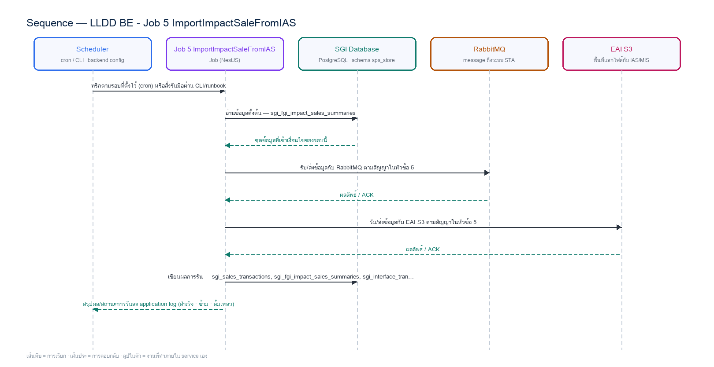

# LLDD BE - Job 5 ImportImpactSaleFromIAS

SBP Mall - ระบบประกันรายได้ | Low Level Design Document

## 1. Overview

| รายการ | รายละเอียด |
| --- | --- |
| Track | BE |
| Estimate | **17 ชั่วโมง** = implementation 13 + unit test 4 (30%) |
| Owner | Aphiwit &lt;Bank&gt; Khammoon |
| Target repository | **`SBP/srm-sps-spsap-sop-sgi-batch`** (NestJS 11 + TypeORM · schema `sps_store` · **มติ 2026-09-02 — ย้ายมาจาก store-backend**) — batch runner ของ SBP ที่รันอยู่แล้ว 42 job บน **AWS Batch** · ลงทะเบียน job ใน `src/main.ts` แล้วรับ argument ผ่าน `JOB_NAME`/`INPUT` (local) หรือ `argv[3]`/`argv[2]` (AWS Batch) · **ไม่ผ่าน BFF และไม่เปิด HTTP** · ตารางเวลาเป็น AWS Batch scheduled event ไม่ใช่ `@Cron` · ดู `SBP/srm-sps-spsap-sop-sgi-batch.md` |
| Objective | รับยอดขายจาก IAS + คำนวณ Growth: **consume คิวของ EAI เองใน `srm-sps-spsap-sop-sgi-batch`** (มติ 2026-09-12 — ตัด repo `store-consumer` ออกจากขอบเขต) — EAI ส่งข้อความเข้า RabbitMQ ว่าไฟล์ตอบกลับ AMS06001I พร้อมแล้ว · job อ่าน `dataType`/`urls` จาก envelope แล้ว **ดาวน์โหลดไฟล์จาก S3 URI เอง** · ⚠️ repo ปลายทางมีแต่ `publishMessage` **ยังไม่มี consumer** ต้องสร้างใหม่ · cron เป็น safety net · แทนการรับผ่าน SFTP ตามมติ 2026-08-24 บันทึกยอดขายรายวันลง sgi_sales_transactions คำนวณ sales_diff และ outlier ในหน้าต่าง 4 ช่วง × 15 วันรอบวันเปิดร้านใหม่ แล้วกำหนด sales_status = Y / N จาก growth_rate_diff |

Common contract reference: ทุกหัวข้อ API/FE ต้องยึด LLDD-BE-API-Common-Contracts และ LLDD-FE-Integration-Contracts สำหรับ error/auth/format/pagination/action/RBAC ก่อนลงรายละเอียดเฉพาะหน้าหรือเฉพาะ endpoint

### 1.1 เอกสาร LLDD ที่เกี่ยวข้อง

ตารางนี้สร้างจาก endpoint และตารางที่เอกสารฉบับนี้ประกาศไว้จริง — อ่านฉบับที่อยู่ในตารางก่อนลงมือ เพื่อไม่ให้สัญญา request/response หรือชื่อคอลัมน์หลุดจากกัน

| ความสัมพันธ์ | เอกสาร LLDD | เกี่ยวข้องตรงไหน |
| --- | --- | --- |
| สัญญากลาง | **LLDD-BE-API-Common-Contracts** | envelope `{success,data}` · error code · pagination · รูปแบบวันที่/เลขเอกสาร |
| โครงสร้างข้อมูล | **LLDD-BE-Database-Structure** | DDL ของตารางที่หัวข้อ Reference DB Mapping อ้างถึง |
| แพลตฟอร์มระบบเดิม | **LLDD-BE-Integration-SBP-Platform** | header จาก BFF (`x-api-key` / `x-user-*`) · การ reuse ตารางและ service ของระบบ SBP เดิม |
| ต้องจบก่อน (ลำดับงาน) | **LLDD-BE-API-Common-Contracts** | เป็นฉบับต้นทางของสัญญา/โครงที่ฉบับนี้อ้าง |
| ต้องจบก่อน (ลำดับงาน) | **LLDD-BE-Job-4-PrepareImpactStoreToIAS** | เป็นฉบับต้นทางของสัญญา/โครงที่ฉบับนี้อ้าง |

## 2. Screen / Functional Scope

- Main class/script: fgi.main.ImportImpactSaleFromIAS / FGI_ImportImpactStoreSale.sh
- Phase: B
- Output: AMS06001I (รับเข้า)
- Estimate: 13 ชั่วโมง
- Argument รับผ่าน `INPUT` (JSON) — local ใช้ env `JOB_NAME`/`INPUT` · AWS Batch ใช้ `argv[3]`/`argv[2]` · ดูหัวข้อ 5.95 · ไม่มีตาราง job_configs และไม่มีหน้าจอควบคุม (หน้า Flow Batch Job ในกลุ่มเมนู Flow เหลือแค่ Flowchart + Database ที่ใช้ · 2026-08-06)
- ตารางเวลาตั้งที่ **AWS Batch scheduled event** (repo ไม่มี `@Cron`) — **ยกเว้น job ที่เป็น event-driven (ดูหัวข้อ Config Schema ของ job นั้น) ซึ่งห้ามตั้ง schedule** · ทุก job ถูกบันทึกลง `integration_log` โดย `main.ts` อัตโนมัติ + structured log `BATCH_START`/`BATCH_END` พร้อม `runId`

## 3. Screenshot Reference

ไม่มีภาพหน้าจอสำหรับหัวข้อนี้ — เป็นเอกสารฝั่ง Backend/Batch ที่ไม่มี UI (ภาพหน้าจอทั้งหมดอยู่ในเอกสารชุด FE)

## 4. Implementation Flow & Sequence Diagram (Reference)

### 4.1 Implementation Flow (ลำดับขั้นการทำงาน)


_รูปที่ 1: Implementation flow reference: LLDD BE - Job 5 ImportImpactSaleFromIAS_

### 4.2 Sequence Diagram (ใครคุยกับใคร ลำดับไหน)

ผู้แสดงและลำดับข้อความในภาพนี้สร้างจาก endpoint ในหัวข้อ 7 และตารางในหัวข้อ Reference DB Mapping ของเอกสารฉบับนี้เอง จึงตรงกับสัญญาเสมอ



_รูปที่ 2: Sequence diagram: LLDD BE - Job 5 ImportImpactSaleFromIAS_

## 5. Field, Format, and Validation

| Field / UI | Format | Validation | Behavior |
| --- | --- | --- | --- |
| ตัวกระตุ้น (Trigger) | ข้อความจาก EAI ผ่าน RabbitMQ (job consume เอง) | แก้ไขได้ | มติ 2026-09-12 — job bind คิวเองใน sop-sgi-batch (ตัด repo store-consumer ออก) · cron เดิม 30 16 7-16 * * เก็บไว้เป็น **safety net** เผื่อข้อความหาย (รันแล้วไม่เจอไฟล์ใหม่ = จบทันที ไม่ error) |
| Input File | AMS06001I_yyyyMMddHHmm.txt (WINDOWS-874, 4 ฟิลด์) | ค่าคงที่/แก้ผ่านหน้าจอไม่ได้ | impacted_store_code \| วันเปิดร้านใหม่ \| วันที่ขาย \| ยอดขาย (4 ฟิลด์ตามสัญญาไฟล์ของ IAS) |
| หน้าต่างคำนวณ | 4 ช่วง × 15 วัน รอบวันเปิดร้านใหม่ (ไม่รวมวันเปิด) — วันเปิดร้านอ่านจาก master ของระบบ SBP เดิม | ค่าคงที่/แก้ผ่านหน้าจอไม่ได้ |  |
| เกณฑ์ Outlier | \|sales_diff\| ≥ 50 | ค่าคงที่/แก้ผ่านหน้าจอไม่ได้ | literal ในโค้ด — เปลี่ยนต้องอนุมัติธุรกิจ (8.2) |
| วันทำการคาดหวัง | 60 | ค่าคงที่/แก้ผ่านหน้าจอไม่ได้ | ถ้าไม่เท่า 60 → pre-accept เป็น Y ทันที |
| กฎ Pre-accept | อายุร้าน < 12 เดือน 15 วัน หรือวันทำการ < 60 → Y | ค่าคงที่/แก้ผ่านหน้าจอไม่ได้ |  |

### 5.9 Input / Progress / Output Contract

| Stage | Contract for implementation |
| --- | --- |
| Input | IAS sales response files from configured source path; file name pattern and pipe-delimited daily sales records. |
| Progress | scan files, validate pattern, parse daily sales windows, derive before/after impact metrics, write transaction rows, update working-day counts and growth status, backup processed files. |
| Output | FGI_IMPACT_STORE_SALES_TRN and FGI_IMPACT_STORE_SALES updated; confirm-receive rows written; source file moved to backup or error recorded. |

### 5.90 Job 5 Execution Stages

scan files, validate pattern, parse daily sales windows, derive before/after impact metrics, write transaction rows, update working-day counts and growth status, backup processed files.

| Order | Service step | Repository | Output / failure contract |
| --- | --- | --- | --- |
| 1 | downloadAndStageIasSales | iasSalesRepository | คืน metrics และ throw typed error; transaction/rerun ใช้ contract ด้านล่าง |
| 2 | validateSalesWindows | iasSalesRepository | คืน metrics และ throw typed error; transaction/rerun ใช้ contract ด้านล่าง |
| 3 | upsertDailySales | iasSalesRepository | คืน metrics และ throw typed error; transaction/rerun ใช้ contract ด้านล่าง |
| 4 | recalculateSalesSummaries | iasSalesRepository | คืน metrics และ throw typed error; transaction/rerun ใช้ contract ด้านล่าง |

### 5.91 Job 5 Run Evidence

| Evidence | Job-specific value | Acceptance |
| --- | --- | --- |
| Input identity | IAS sales response files from configured source path; file name pattern and pipe-delimited daily sales records. | snapshot input file/business key/period in run record |
| Output identity | FGI_IMPACT_STORE_SALES_TRN and FGI_IMPACT_STORE_SALES updated; confirm-receive rows written; source file moved to backup or error recorded. | reconcile input, success, reject and skipped counts |
| Dedup proof | checksum กันไฟล์ซ้ำ + UNIQUE(sales_summary_id,txn_date,window_no); คำนวณ summary ใหม่จาก transaction rows ทุก rerun | rerun fixture produces no duplicate target business key |
| Transaction proof | upsert รายวันและ update summary ของ sales_summary_id เดียวกันใน transaction; checksum/file tracking commit พร้อมกัน | injected failure leaves no partial committed state outside documented boundary |
| Security proof | สิทธิ์อ่าน EAI S3 ใช้ IAM role ของ pod หรือ secretRef=secret/sgi/interfaces/eai-s3 จำกัดเฉพาะ prefix ขาเข้า/backup ของ IAS (GetObject + PutObject เฉพาะ backup); quarantine อ็อบเจกต์ที่ checksum/รูปแบบไม่ผ่าน แทนการลบทิ้ง | config/log/error contains no plaintext secret |

### 5.92 Legacy Java Source Reference

| Legacy file | Line range | Responsibility to carry forward |
| --- | --- | --- |
| fcsJar/src/th/co/gosoft/fgi/main/ImportImpactSaleFromIAS.java | 9-19 | Legacy main entrypoint that delegates to import controller. |
| fcsJar/src/th/co/gosoft/fgi/controller/ImportController.java | 101-411 | Parse IAS file, compute sales windows, prepare inserts/updates, backup and notify. |
| fcsJar/src/th/co/gosoft/fgi/dao/jdbc/ImportJdbc.java | 136-182, 517-804 | Update verification flags, working days, growth-rate calculations, cleanup old files. |

Line ranges refer to the legacy Java implementation under `batchjob/fcsJar/` (path นับจากราก `sbp-prototype/`). Use these ranges to preserve business behavior while implementing the target Node job.

### 5.93 Target Repository and SQL Contract

| Contract | Target implementation |
| --- | --- |
| Repository | iasSalesRepository |
| Idempotency / dedup | checksum กันไฟล์ซ้ำ + UNIQUE(sales_summary_id,txn_date,window_no); คำนวณ summary ใหม่จาก transaction rows ทุก rerun |
| Transaction boundary | upsert รายวันและ update summary ของ sales_summary_id เดียวกันใน transaction; checksum/file tracking commit พร้อมกัน |
| Security | สิทธิ์อ่าน EAI S3 ใช้ IAM role ของ pod หรือ secretRef=secret/sgi/interfaces/eai-s3 จำกัดเฉพาะ prefix ขาเข้า/backup ของ IAS (GetObject + PutObject เฉพาะ backup); quarantine อ็อบเจกต์ที่ checksum/รูปแบบไม่ผ่าน แทนการลบทิ้ง |

#### Input / candidate query

```sql
-- bind ตามลำดับ: $1=impact_process_id
SELECT t.sales_summary_id, t.txn_date, t.sales_amount, t.window_no, t.source_checksum
FROM sgi_sales_transactions t
JOIN sgi_fgi_impact_sales_summaries s ON s.id = t.sales_summary_id
WHERE s.impact_process_id = $1 /* impact_process_id */
ORDER BY t.sales_summary_id, t.txn_date, t.window_no;
```

#### Write / upsert query

```sql
-- bind ตามลำดับ: $1=sales_summary_id · $2=txn_date · $3=window_no · $4=seq · $5=sales_amount · $6=sales_diff · $7=is_outlier · $8=source_checksum · $9=total_working_days · $10=growth_rate_before · $11=growth_rate_after · $12=growth_rate_diff · $13=sales_status
INSERT INTO sgi_sales_transactions
    (sales_summary_id, txn_date, window_no, seq, sales_amount, sales_diff, is_outlier, source_checksum)
VALUES ($1 /* sales_summary_id */, $2 /* txn_date */, $3 /* window_no */, $4 /* seq */, $5 /* sales_amount */, $6 /* sales_diff */, $7 /* is_outlier */, $8 /* source_checksum */)
ON CONFLICT (sales_summary_id, txn_date, window_no)
DO UPDATE SET sales_amount = EXCLUDED.sales_amount,
              sales_diff = EXCLUDED.sales_diff,
              is_outlier = EXCLUDED.is_outlier,
              source_checksum = EXCLUDED.source_checksum;

UPDATE sgi_fgi_impact_sales_summaries
SET total_working_days = $9 /* total_working_days */,
    growth_rate_before = $10 /* growth_rate_before */,
    growth_rate_after = $11 /* growth_rate_after */,
    growth_rate_diff = $12 /* growth_rate_diff */,
    sales_status = $13 /* sales_status */,
    updated_at = CURRENT_TIMESTAMP
WHERE id = $1 /* sales_summary_id */;
```

### 5.94 Target Node Implementation

โครงสร้างนี้ระบุ service/repository เฉพาะงานและต้อง implement ตาม SQL, transaction, idempotency และ security contract ด้านบน โดยทุกขั้นต้องคืน metrics สำหรับ reconcile และ run history

```js
export async function runLlddBeJob5Importimpactsalefromias(ctx, services) {
  const run = await services.jobRuns.acquire({
    jobNo: "5", period: ctx.period, triggeredBy: ctx.triggeredBy
  });

  try {
    ctx = { ...ctx, runId: run.id, repository: services.iasSalesRepository };
    const step1 = await services.downloadAndStageIasSales(ctx, undefined);
    const step2 = await services.validateSalesWindows(ctx, step1);
    const step3 = await services.upsertDailySales(ctx, step2);
    const step4 = await services.recalculateSalesSummaries(ctx, step3);
    const result = step4;
    await services.jobRuns.finish(run.id, "SUCCESS", result.metrics);
    return { runId: run.id, status: "SUCCESS", ...result };
  } catch (error) {
    await services.jobRuns.finish(run.id, "FAILED", {
      errorCode: error.code ?? "JOB_FAILED",
      errorMessage: error.message
    });
    throw error;
  }
}
```

### 5.95 การลงทะเบียน job และ Arguments (sop-sgi-batch)

งานนี้ลงทะเบียนเป็น job ชื่อ **`sgi-import-impact-sale-from-ias`** ใน `src/main.ts` ของ `SBP/srm-sps-spsap-sop-sgi-batch` โดยใช้ dispatcher เดิมของ repo (ไม่สร้าง runner ใหม่) — `main.ts` อ่านชื่อ job และ input มา 2 ทาง แล้วเลือกอัตโนมัติจากการมี `argv[3]` หรือไม่

| ช่องทางรัน | ชื่อ job มาจาก | input มาจาก | ตัวอย่าง |
| --- | --- | --- | --- |
| Local / CLI / runbook | env `JOB_NAME` | env `INPUT` (JSON string) | `JOB_NAME=sgi-import-impact-sale-from-ias INPUT='{"dataType":"S3","dataName":"ams_impact_sale_result","urls":"s3://eai-inbound/sgi/AMS06001I_202606161630.txt","sender":"eai","sentAt":"2026-06-16T09:30:00.000Z"}' npm run start` |
| AWS Batch (ตารางเวลาจริง) | `process.argv[3]` | `process.argv[2]` (JSON string) | `node dist/main.js '{"dataType":"S3","dataName":"ams_impact_sale_result","urls":"s3://eai-inbound/sgi/AMS06001I_202606161630.txt","sender":"eai","sentAt":"2026-06-16T09:30:00.000Z"}' sgi-import-impact-sale-from-ias` |

**ตารางเวลาไม่ได้อยู่ในโค้ด** — repo นี้ไม่มี `@Cron`/`@Interval` แม้แต่จุดเดียว (แม้ติดตั้ง `@nestjs/schedule` ไว้) cron ในหัวข้อ 5 เป็น **นิยามของ AWS Batch scheduled event** ที่ต้องตั้งตอน deploy ไม่ใช่ค่าที่อ่านจาก config file

#### Argument ที่รับได้ (`INPUT` เป็น JSON object · ไม่ส่ง = `{}`)

**ระบบเดิมรับ argument แบบนี้:** รับ `args` แต่ **ไม่ได้ใช้เลย** — สแกนทุกไฟล์ในโฟลเดอร์ต้นทางที่ตรง regex `AMS06001I_YYYYMMDDHHMM.txt` (case-insensitive)  
ของใหม่เปลี่ยนจาก positional string เป็น JSON เพื่อให้เพิ่มฟิลด์ได้โดยไม่พังของเดิม แต่ **ต้องรองรับทุกอย่างที่ระบบเดิมรับได้เป็นอย่างน้อย** — ห้ามลดความสามารถลง

| Field | ชนิด | ไม่ส่งแล้วได้อะไร (default) | Validation | ตรงกับ argument เดิม |
| --- | --- | --- | --- | --- |
| `dataType` | string | — | `S3` เมื่อมาจากข้อความในคิว (กรณีปกติ) · ไม่มีค่านี้ = โหมด safety-net สแกนเอง | **ของใหม่** |
| `urls` | string | — | S3 URI ของไฟล์ `AMS06001I` ที่ EAI วางไว้ — **job ดาวน์โหลดเอง** (consumer ส่งแค่ที่อยู่) | **ของใหม่** |
| `dataName` | string | — | ต้องเป็น `ams_impact_sale_result` · ไม่ตรง = จบแบบสำเร็จพร้อม log warn | **ของใหม่** |
| `fileName` | string | `null` = ประมวลผลทุกไฟล์ที่ตรง pattern | ใช้เฉพาะโหมด safety-net · ต้องตรง regex เดิม ไม่ตรง = `INVALID_JOB_INPUT` | **ของใหม่** — เจาะไฟล์เดียวเวลา rerun |
| `reprocess` | boolean | `false` | `true` = ยอมอ่านไฟล์ที่ย้ายไป prefix backup แล้ว | **ของใหม่** |
| `dryRun` | boolean | `false` | `true` = อ่าน/คำนวณครบแต่ไม่ commit และไม่ publish/ไม่ส่งไฟล์ | **ของกลาง** ทุก job |
| `limit` | number | `null` | จำกัดจำนวนรายการที่ประมวลผลรอบนี้ (ใช้ตอน smoke test) | **ของกลาง** ทุก job |

**กติกาการ validate ที่ทุก job ต้องทำเหมือนกัน** — parse `INPUT` ไม่สำเร็จ หรือฟิลด์ไม่ผ่าน validation ให้ log `BATCH_END` ด้วย `batchStatus: 'FAILED'` แล้ว `exit(1)` **ก่อนแตะฐานข้อมูล** (ห้าม fallback ไปค่า default เงียบ ๆ เมื่อผู้ใช้ตั้งใจส่งค่ามาแล้วผิด) · ฟิลด์ที่ไม่รู้จักให้ log warn แล้วข้าม ไม่ทำให้ job ล้ม

- 🔴 **มติ 2026-09-12 — job นี้ consume คิวของ EAI เอง** · EAI ส่งข้อความเข้า RabbitMQ ว่าไฟล์พร้อมแล้ว consumer อ่าน config จาก S3 แล้ว `SubmitJob` มาที่ job นี้พร้อม `INPUT` = envelope · **job ดาวน์โหลดไฟล์จาก `urls` เอง** เพราะข้อความบอกแค่ที่อยู่ไฟล์ ไม่ได้แนบไฟล์มาด้วย
- **cron เดิม `30 16 7-16 * *` ยังอยู่ในฐานะ safety net** — รันแล้วไม่เจอไฟล์ใหม่ให้จบแบบสำเร็จ ไม่ใช่ error · เผื่อกรณีข้อความหายจาก consumer ที่ยังไม่มี DLQ (ข้อ C1 ของเอกสาร consumer)
- `reprocess=true` ไม่ยกเว้นกฎกันซ้ำระดับข้อมูล — `checksum` + `UNIQUE(sales_summary_id, txn_date, window_no)` ยังทำงานตามเดิม

### 5.96 เงื่อนไขตัดสิน (Decision Rules) — ตัดสินจากอะไร

Job 5 ตัดสิน 3 เรื่อง: ไฟล์ไหนควรอ่าน · บรรทัดไหนจับคู่กับร้านได้ · และ **ยอดขายครบพอจะคำนวณ Growth หรือยัง**

| คำถามที่โค้ดต้องตอบ | ตัดสินจาก (ตาราง · คอลัมน์) | เงื่อนไขที่ต้องเป็นจริง | ไม่เข้าเงื่อนไขแล้วทำอะไร |
| --- | --- | --- | --- |
| ไฟล์นี้ควรอ่านหรือไม่ | ชื่ออ็อบเจกต์บน EAI S3 (prefix ขาเข้าของ IAS) | ต้องตรงรูปแบบ `AMS06001I_YYYYMMDDHHMM.txt` (ตรวจด้วย regex เดิม · case-insensitive) — ไม่ตรง = ข้ามไฟล์นั้น | ระบบเดิม **สแกนทุกไฟล์ในโฟลเดอร์** ไม่ได้ใช้ argument เลย · ของใหม่เพิ่ม `fileName` เพื่อเจาะไฟล์เดียวได้ (ดู 5.95) |
| ไฟล์นี้เคยประมวลผลไปแล้วหรือยัง | `sgi_interface_transactions` — `data_name = 'IMPACT_STORE_SALES'` · `direction = 'IN'` · `file_name` · `file_checksum` | มี transaction ของ `file_name` เดิมและ checksum ตรงกัน = เคยอ่านแล้ว → ข้าม | อ่านสำเร็จจึงย้ายอ็อบเจกต์ไป prefix backup — **ย้ายไฟล์ต้องเป็นขั้นสุดท้าย** ไม่ใช่ก่อน commit |
| บรรทัดนี้จับคู่กับร้านไหน | `sgi_fgi_impact_stores` (`impacted_store_code` + วันเปิดร้านใหม่) — ไฟล์มี 4 ฟิลด์: `impacted_store_code \| วันเปิดร้านใหม่ \| วันที่ขาย \| ยอดขาย` | จับคู่ด้วย `impacted_store_code` + วันเปิดร้านใหม่ (ตรงกับคีย์ที่ Job 4 ส่งออกไป) · จับคู่ไม่ได้ = reject รายแถวพร้อม reason | reject รายแถวต้องไม่ทำให้ทั้งไฟล์ fail — สรุปจำนวนใน metrics และแนบไปในอีเมลแจ้งผล |
| ยอดขายครบพอคำนวณ Growth หรือยัง | `sgi_sales_transactions` (ยอดรายวัน) → สรุปลง `sgi_fgi_impact_sales_summaries` (`total_working_days` · `growth_rate_before/after/diff` · `sales_status`) | 🔴 **แก้ 2026-09-13 — เดิมเอกสารเขียนกลับด้านกับโค้ดจริง** · ระบบเดิม **คำนวณ Growth ให้ทุกแถวเสมอ** ไม่ว่าวันจะครบ 60 หรือไม่ (`ImportJdbc.calculateGrowthRateAndTotalDiffRateImpactStoreSalesTrn` กรองด้วย `FLAG_VERIFY` อย่างเดียว ไม่มีเงื่อนไขจำนวนวัน) · และวันไม่ครบมักทำให้ `growth_rate_diff` เป็น **NULL** ซึ่ง `NVL(GROWTH_RATE_DIFF,-1) < 0` ตีเป็น **`'Y'`** — **ตรงข้ามกับที่เอกสารเดิมเขียนว่า "ไม่ครบ = ยังไม่เป็น Y"** | `pre-accept` **ไม่ใช่คอลัมน์ที่เก็บ** — ปลายทางคำนวณเองจาก `total_working_day != 60 OR growth_rate_diff IS NULL` (`ExportJdbc.java:968`) · Job 5 มีหน้าที่บันทึก `total_working_days` ให้ตรงความจริงเท่านั้น · ⚠️ ระบบเดิมใช้ `!=` ไม่ใช่ `<` — ข้อมูล**เกิน** 60 วันก็เข้า pre-accept ด้วย ขณะที่หน้าจอรายการใช้ `< 60` ตีแถวแดง (สองกติกานี้ไม่ตรงกันมาแต่เดิม) |

#### ค่าคงที่และโดเมนที่ใช้ในเงื่อนไขข้างบน

ทุกค่าในตารางนี้ต้องอ่านจาก config/env ไม่ hardcode ในคิวรี — แต่ **ค่าตั้งต้นต้องเท่าระบบเดิมทุกตัว** ไม่งั้นผลลัพธ์จะไม่ตรงกันตอนเทียบ UAT

| ค่า | โดเมน / ค่าที่ระบบเดิมใช้ | ที่มา |
| --- | --- | --- |
| รูปแบบชื่อไฟล์ | `AMS06001I_YYYYMMDDHHMM.txt` | regex ใน `ImportController.importImpactSaleFromIAS` |
| encoding ของไฟล์ | WINDOWS-874 (วันที่ในไฟล์เป็น **พ.ศ.**) | แปลงเป็น ค.ศ. ตอนอ่าน ห้ามให้ พ.ศ. หลุดเข้า DB/API |
| จำนวนวันทำการขั้นต่ำ | 60 วัน | `FgiConstant.TOTAL_INTERVAL_DAY = 60` |
| `sales_status` | `W` = รอ · `P` = ส่งคำขอแล้วรอผล (Job 4 ตั้ง) · `Y` = เข้าเกณฑ์ชดเชย · `N` = ไม่เข้าเกณฑ์ · `E` = ผิดพลาด | `CHECK` ใน DDL · Job 5 แตะเฉพาะแถวที่เป็น `'P'` เท่านั้น (กันทับผลที่คนแก้ไปแล้ว) |
| `sales_diff` ของแถวรายวัน | **เปอร์เซ็นต์** = `ROUND((ยอดวันนั้น − ค่าเฉลี่ยของหน้าต่าง) / **ยอดวันนั้น** × 100)` | `ImportJdbc.java:544` · ⚠️ หารด้วยยอดของวันนั้นเอง ไม่ใช่หารด้วยค่าเฉลี่ย — **หน่วยเป็น % ไม่ใช่บาท** |
| `is_outlier` | `\|sales_diff\| >= 50` (เปอร์เซ็นต์) | `ImportJdbc.java` — `CASE WHEN ABS(T.DIFF_*) >= 50 THEN 1 ELSE 0 END` |
| ตัวกรองจับคู่วันตอนเฉลี่ย | ถ้าหน้าต่างปีก่อนกับปีนี้ **มี outlier ไม่เหมือนกัน** วันที่ธง outlier ไม่ตรงกันจะถูกแทนด้วย **0** แต่ **ยังนับอยู่ในตัวหาร** (ตัวหารคงเป็น 15) | `ELSE 0` ในสูตร AVG ของเดิม — **ไม่ใช่การตัดวันนั้นทิ้ง** · เขียนเป็น `WHERE` แล้วผลจะต่างทันที · จับคู่ด้วย `seq` (ตารางเดิมเป็นตารางกว้างจึงจับคู่ได้ในแถวเดียว ตารางใหม่แคบจึงต้องมีคอลัมน์ `seq`) |

## 6. Button / User Action Mapping

| Action | Trigger | API / Service | Expected Result |
| --- | --- | --- | --- |
| รันตามตารางเวลา | CRON | scheduler → runner (job 5) | อ่าน cron/พารามิเตอร์จาก backend config |
| รันนอกรอบ (manual/rerun) | CLI | CLI/ops runbook → runner (job 5) | guard ไม่ให้รันซ้อนด้วย distributed lock |
| แก้พารามิเตอร์/เปิด-ปิด job | CONFIG | แก้ backend config แล้ว deploy | ไม่มี endpoint และไม่มีหน้าจอควบคุม — หน้า Flow Batch Job เป็น reference อย่างเดียว (2026-08-06) |
| ตรวจผลการรัน | LOG | application log (structured) | ไม่มีตาราง job_run_histories แล้ว · ผลการรับส่งไฟล์/ข้อความดูที่ sgi_interface_transactions |

## 7. API Contract

**เอกสารฉบับนี้ไม่มี endpoint ของตัวเอง** — เป็นสัญญา/งานภายในที่เอกสารอื่นเรียกใช้ (ดูขอบเขตใน 5.90 Endpoint Implementation Contract) · รายการ endpoint ทั้ง 28 เส้นของ SGI อยู่ที่ **LLDD-API** และ `api.md`

## 8. Reference DB Mapping (No Database Page Work)

ส่วนนี้เป็นข้อมูลอ้างอิงสำหรับการ implement API/Job เท่านั้น ไม่ใช่งานสร้างหน้า Database, ไม่ใช่งานออกแบบ DB page และไม่ถูกนับเป็น deliverable แยกของ FE/BE

| Table / Object | R/W | Usage |
| --- | --- | --- |
| sgi_sales_transactions | W | ยอดขายรายวันดิบจากไฟล์ (4 หน้าต่างเวลา) |
| sgi_fgi_impact_sales_summaries | R/W | อัปเดต total_working_days, growth_rate_diff, sales_status Y/N |
| sgi_interface_transactions | W | tracking: data_name=IMPACT_STORE_SALES · direction=IN · status=COMPLETED (ขารับกลับของรอบที่ Job 4 ส่งออก) · typed FK = sales_summary_id |

## 9. Skeleton Code (Batch Job 5)

### 9.1 ผังไฟล์ที่ต้องสร้าง (Job 5) — บน `srm-sps-spsap-sop-sgi-batch`

โครงไฟล์ของ Job 5 (fgi.main.ImportImpactSaleFromIAS เดิม) วางใต้ `src/modules/sgi/` ตาม convention ที่ repo นี้ใช้อยู่จริง (ดูตัวอย่างที่ `src/modules/performance/import-qssi.service.ts`): service ถือ logic ทั้งหมด, inject `DataSource`/repository ผ่าน TypeORM, ยิง raw SQL ได้ตรง, และ **ไม่มี controller** เพราะ repo นี้ไม่เปิด HTTP

**สิ่งที่ reuse ได้ทันที ไม่ต้องเขียนใหม่** — ต่างจากแผนเดิมที่ตั้งไว้บน store-backend ซึ่งต้องสร้าง runner ทั้งชุดเอง: `src/main.ts` (dispatcher + `BATCH_START`/`BATCH_END` + `runId` + log ลง `integration_log` อัตโนมัติ) · `src/modules/rabbitMQ/rabbitmq.service.ts` (`publishMessage`) · `src/shared/services/s3.service.ts` · `StatementService.decodeThaiFileContent()` (WINDOWS-874 auto-detect) · `@gosoft-sbp/email-lib` · `@srm/glb-log`

⚠️ **สิ่งที่ repo นี้ยังไม่มี และเป็นงานตั้งต้นจริง**: (1) ไม่มี `@Cron` เลย — ตารางเวลาต้องตั้งเป็น **AWS Batch scheduled event** (2) ไม่มี distributed lock (`pg_try_advisory_lock`) — การกันรันซ้อนพึ่ง AWS Batch queue ถ้างานไหนรับความเสี่ยงนี้ไม่ได้ต้องเพิ่มเอง (3) `publishMessage` เป็น fire-and-forget **ไม่มี publisher confirm และไม่มี outbox** — งานที่ต้องการ **transactional outbox + publisher confirm** (Job 6 · และ `sgi_reflow` ฝั่ง BE) ต้องสร้างกลไกเพิ่มเอง ไม่ใช่ reuse ได้เลย · ⚠️ ไม่มี ACK ระดับธุรกิจให้รอ (มติ 2026-09-08 ข้อ 2.13) (4) ยังไม่มี entity/ตาราง `sgi_*` แม้แต่ตัวเดียว

| Path | หน้าที่ |
| --- | --- |
| src/modules/sgi/job-5-import-impact-sale-from-ias.service.ts | คลาส `ImportImpactSaleFromIasService` — **`execute(input)` เป็น entry point เดียว** เรียงตาม flow ของ Job 5 ทีละขั้น ครอบ transaction เอง และจบด้วย structured log สรุป metrics (แบบเดียวกับ `ImportQssiService.execute(body)` ที่มีอยู่) |
| src/modules/sgi/job-5-import-impact-sale-from-ias.service.spec.ts | unit test ของ service — repo นี้วาง spec ไว้ข้างไฟล์จริงเสมอ (`jest` + `npm run test:ci` มี coverage/SonarQube) |
| src/modules/sgi/dto/job-5-import-impact-sale-from-ias-input.dto.ts | DTO ของ `INPUT` (JSON) พร้อม `class-validator` ตามตารางในหัวข้อ 9.2 — parse ไม่ผ่านต้อง fail ก่อนแตะ DB |
| src/modules/sgi/sgi.module.ts | NestJS module ของกลุ่มงานประกันรายได้ — ผูก service ทุกตัวของ SGI เข้ากับ `TypeOrmModule` (ไฟล์ร่วมของทุก job ให้ merge ไม่ใช่เขียนทับ) |
| src/main.ts | **เพิ่ม `case 'sgi-import-impact-sale-from-ias':`** ในสวิตช์เดิม → `await import('./modules/sgi/job-5-import-impact-sale-from-ias.service')` แล้ว `app.get(ImportImpactSaleFromIasService).execute(input)` (ไฟล์กลางของทุก job — เป็นจุด merge conflict ที่ต้องระวัง) |
| src/entities/sgi-*.entity.ts | entity ของตาราง `sgi_*` ที่หัวข้อ Reference DB Mapping อ้างถึง — **ยังไม่มีใน repo เลยสักตัว** ต้องสร้างใหม่ทั้งหมด |
| src/config/config.ts | เพิ่ม `export const sgiJob5Config` ตามแบบของไฟล์นี้ (โปรเจกต์ไม่ใช้ `registerAs`) — ค่าคงที่ทางธุรกิจของ Job 5 |

#### การลงทะเบียนใน `src/main.ts` (job `sgi-import-impact-sale-from-ias`)

```js
// src/main.ts — เพิ่มเคสนี้ในสวิตช์เดิม (เรียงต่อจาก job ของ SGI ตัวก่อนหน้า)
      case 'sgi-import-impact-sale-from-ias': {
        const { ImportImpactSaleFromIasService } = await import('./modules/sgi/job-5-import-impact-sale-from-ias.service');
        const job5importimpactsalefromiasService = app.get(ImportImpactSaleFromIasService);
        await job5importimpactsalefromiasService.execute(input);   // input = JSON ที่ parse จาก INPUT/argv[2] แล้ว
        break;
      }
```

`main.ts` เรียก `StatementService.logInterfest('sgi-import-impact-sale-from-ias', input)` ให้อยู่แล้วก่อนเข้าสวิตช์ → **ไม่ต้องเขียน log ลง `integration_log` เองซ้ำ** · และ `BATCH_END` ที่ท้ายไฟล์จะสรุป `batchStatus` + `durationMs` ให้อัตโนมัติ หน้าที่ของ service คือ throw เมื่อทำงานไม่สำเร็จเท่านั้น

### 9.2 Config Schema ของ Job 5 (backend config / env)

ตารางเวลาของ Job 5 คือ `30 16 7-16 * *` (วันที่ 7–16 เวลา 16:30 — **เป็นตารางของโหมด safety-net เท่านั้น** (ทางปกติคือ consumer SubmitJob เมื่อ EAI แจ้งว่าไฟล์พร้อม · มติ 2026-09-08)) — ⚠️ **ตัวจริงตั้งที่ AWS Batch scheduled event ไม่ใช่ในโค้ด** (repo นี้ไม่มี `@Cron` เลย) ค่า `SGI_JOB5_CRON` เก็บไว้เป็นเอกสารประกอบ/ตรวจสอบเท่านั้น · `SGI_JOB5_ENABLED=false` ให้ `execute()` จบทันทีแบบ SUCCESS พร้อม log เหตุผล (กันกรณี AWS Batch ยังยิงเข้ามา)

```ts
// src/config/config.ts — เพิ่มบล็อกนี้ต่อท้าย (repo ใช้ export const ไม่ใช้ registerAs)
// convention จริงของ sop-sgi-batch คือ `export const` ใน `src/config/config.ts` (ไม่ใช้ registerAs · ดูของเดิมที่
// `AppConfigModule` แบบ @Global แล้วอ่าน process.env ตรง ๆ) — โปรเจกต์นี้ **ไม่ได้ใช้ registerAs**
// แม้แต่จุดเดียว จึงประกาศเป็นคลาสให้รีวิว/ทดสอบเหมือน config ตัวอื่น
import { Injectable } from '@nestjs/common';

// TODO: Job 5 ไม่มีตาราง job_configs และไม่มี Job Admin API แล้ว (ตัดสินใจ 2026-08-06)
// TODO: ค่าทุกตัวอ่านจาก env/config file ของ backend เท่านั้น — เปลี่ยนค่า = แก้ config แล้ว deploy
export interface Job5Config {
  /** เปิด/ปิด job รอบถัดไปโดยไม่ต้อง deploy โค้ด */
  enabled: boolean;
  /** ตารางเวลาของ job นี้ — บันทึกไว้เพื่ออ้างอิงเท่านั้น ตัวจริงตั้งที่ AWS Batch scheduled event */
  cron: string;
  /** ตัวกระตุ้น (Trigger) — มติ 2026-09-12 — job bind คิวเองใน sop-sgi-batch (ตัด repo store-consumer ออก) · cron เดิม 30 16 7-16 * * เก็บไว้เป็น **safety net** เผื่อข้อความหาย (รันแล้วไม่เจอไฟล์ใหม่ = จบทันที ไม่ error) */
  trigger: string;
  /** Input File — impacted_store_code | วันเปิดร้านใหม่ | วันที่ขาย | ยอดขาย (4 ฟิลด์ตามสัญญาไฟล์ของ IAS) */
  inputFile: string;
  /** หน้าต่างคำนวณ */
  calcWindow: string;
  /** เกณฑ์ Outlier — literal ในโค้ด — เปลี่ยนต้องอนุมัติธุรกิจ (8.2) */
  outlier: string;
  /** วันทำการคาดหวัง — ถ้าไม่เท่า 60 → pre-accept เป็น Y ทันที */
  workingDays: number;
  /** กฎ Pre-accept */
  preAccept: string;
  /** ผู้รับอีเมลเมื่อ job ล้มเหลว — เก็บเป็น string คั่น comma ให้ตรง signature ของ
      `EmailLibService.sendMail({ mailTo })` ที่รับ string ไม่ใช่ string[] */
  mailTo: string;
}

@Injectable()
export class SgiJob5Config implements Job5Config {
  // TODO: ยืนยันค่า default ทุกตัวกับ Ops ก่อนขึ้น production (ไม่มีหน้าจอแก้ค่าแล้ว)
  enabled = (process.env.SGI_JOB5_ENABLED ?? 'true') === 'true';
  cron = process.env.SGI_JOB5_CRON ?? '30 16 7-16 * *';
  trigger = process.env.SGI_JOB5_TRIGGER ?? 'ข้อความจาก EAI ผ่าน RabbitMQ (job consume เอง)'; // TODO: แก้ผ่าน env/config file แล้ว deploy
  inputFile = process.env.SGI_JOB5_INPUT_FILE ?? 'AMS06001I_yyyyMMddHHmm.txt (WINDOWS-874, 4 ฟิลด์)'; // TODO: ค่าคงที่ทางธุรกิจ — เปลี่ยนต้องผ่านการอนุมัติ
  calcWindow = process.env.SGI_JOB5_CALC_WINDOW ?? '4 ช่วง × 15 วัน รอบวันเปิดร้านใหม่ (ไม่รวมวันเปิด) — วันเปิดร้านอ่านจาก master ของระบบ SBP เดิม'; // TODO: ค่าคงที่ทางธุรกิจ — เปลี่ยนต้องผ่านการอนุมัติ
  outlier = process.env.SGI_JOB5_OUTLIER ?? '|sales_diff| ≥ 50'; // TODO: ค่าคงที่ทางธุรกิจ — เปลี่ยนต้องผ่านการอนุมัติ
  workingDays = Number(process.env.SGI_JOB5_WORKING_DAYS ?? 60); // TODO: ค่าคงที่ทางธุรกิจ — เปลี่ยนต้องผ่านการอนุมัติ
  preAccept = process.env.SGI_JOB5_PRE_ACCEPT ?? 'อายุร้าน < 12 เดือน 15 วัน หรือวันทำการ < 60 → Y'; // TODO: ค่าคงที่ทางธุรกิจ — เปลี่ยนต้องผ่านการอนุมัติ
  mailTo = process.env.SGI_JOB5_MAIL_TO ?? ''; // TODO: ผู้รับอีเมลแจ้ง error คั่นด้วย comma (เดิม: go-sbp (ผ่าน shared helper))
}

// TODO: เพิ่ม SgiJob5Config ใน providers/exports ของ AppConfigModule (@Global) เหมือน AppConfig
```

### 9.3 Job Class — `run(ctx)` ของ Job 5 ทีละขั้นตามผัง

#### 9.3.1 สัญญาของชั้นกลาง (`runner.ts`) + โครง service ของ Job 5

service อ้าง `JobRunContext` / `JobRunResult` / `JobState` / `JobFailedError` — ทั้งหมดนิยาม ครั้งเดียวใน `src/modules/sgi/sgi-job.types.ts` (ไฟล์ร่วมของทุก job ให้ merge ไม่ใช่เขียนทับ) และ service ต้องมี method ครบตามตารางขั้นตอนด้านล่าง มิฉะนั้น `execute(input)` จะเรียก method ที่ไม่มีอยู่

```ts
// src/modules/sgi/sgi-job.types.ts — สัญญากลางของทุก job ของ SGI (ประกาศครั้งเดียว ใช้ร่วมทั้ง 10 ฉบับ)

export interface JobRunContext {
  jobNo: string;
  period: string;        // YYYYMM ของงวดที่รัน
  triggeredBy: string;   // 'CRON' | userId ที่สั่งรันนอกรอบ
  params?: Record<string, string>;
}

export interface JobRunResult {
  event: 'job.finish';
  jobNo: string;
  jobName: string;
  status: 'SUCCESS' | 'SKIPPED' | 'SKIPPED_LOCKED' | 'FAILED';
  period: string;
  output: string;
  read: number; written: number; skipped: number; rejected: number;
  durationMs: number;
}

/** counter + ค่าที่ทุกขั้นของ job ใช้ร่วมกัน (service เป็นผู้สร้างผ่าน createState) */
export interface JobState {
  period: string;
  read: number; written: number; skipped: number; rejected: number;
  // TODO: เพิ่ม field เฉพาะของ job นี้ (เช่น rows ที่อ่านมา, path ไฟล์ที่เขียน)
  [key: string]: unknown;
}

/** error ที่ทำให้ job จบเป็น FAILED และส่งอีเมลแจ้งผู้ดูแล */
export class JobFailedError extends Error {
  constructor(public readonly code: string, message: string) { super(message); }
}

/** ใช้ออกจาก transaction เมื่อสาขา NO บอกให้ข้ามงวด/เรคคอร์ด — runner สรุปเป็น SKIPPED ไม่ใช่ FAILED */
export class JobSkippedError extends Error {}
```

```ts
// ImportImpactSaleFromIasService — method ที่ job class เรียก (1 method ต่อ 1 ขั้นในตารางด้านบน)
import { Inject, Injectable } from '@nestjs/common';
import type { DataSource, EntityManager } from 'typeorm';
import type { JobRunContext, JobState } from '../../runner';
export type { JobState };

@Injectable()
export class ImportImpactSaleFromIasService {
  constructor(@Inject('DATA_SOURCE') private readonly dataSource: DataSource) {}

  createState(ctx: JobRunContext): JobState {
    return { period: ctx.period, read: 0, written: 0, skipped: 0, rejected: 0 };
  }

  // consume ข้อความจากคิว → ได้ S3 URI → ดาวน์โหลดไฟล์เอง แล้วอ่าน WINDOWS-874 จัดกลุ่มตามร้าน + วันเปิดร้านใหม่
  async step02Download(state: JobState, manager?: EntityManager): Promise<void> {
    throw new Error('step02Download: ยังไม่ได้ implement — ดู SQL ที่หัวข้อ Repository / SQL และกติกาที่หัวข้อเงื่อนไขตัดสิน');
  }

  // เป็นงวดที่ยังไม่นำเข้า?
  //   เงื่อนไขจริง: ดูตารางในหัวข้อ "เงื่อนไขตัดสิน (Decision Rules)" ของเอกสารฉบับนี้
  async check03ResolvePeriod(state: JobState): Promise<boolean> {
    throw new Error('check03ResolvePeriod: ยังไม่ได้ implement — ห้าม deploy ทั้งที่ยังไม่เขียนเงื่อนไขจริง');
  }

  // เปิด transaction ต่อไฟล์ แล้ว insert sgi_sales_transactions แถวดิบ
  async step04Insert(state: JobState, manager?: EntityManager): Promise<void> {
    throw new Error('step04Insert: ยังไม่ได้ implement — ดู SQL ที่หัวข้อ Repository / SQL และกติกาที่หัวข้อเงื่อนไขตัดสิน');
  }

  // insert sgi_interface_transactions: data_name = IMPACT_STORE_SALES · direction = IN · status = COMPLETED
  async step05ReadFile(state: JobState, manager?: EntityManager): Promise<void> {
    throw new Error('step05ReadFile: ยังไม่ได้ implement — ดู SQL ที่หัวข้อ Repository / SQL และกติกาที่หัวข้อเงื่อนไขตัดสิน');
  }

  // total_working_days = จำนวนแถวดิบทั้งหมด
  async step06Calculate(state: JobState, manager?: EntityManager): Promise<void> {
    throw new Error('step06Calculate: ยังไม่ได้ implement — ดู SQL ที่หัวข้อ Repository / SQL และกติกาที่หัวข้อเงื่อนไขตัดสิน');
  }

  // ต้องคำนวณ sales_diff? (ไม่เข้าเงื่อนไข pre-accept)
  //   เงื่อนไขจริง: ดูตารางในหัวข้อ "เงื่อนไขตัดสิน (Decision Rules)" ของเอกสารฉบับนี้
  async check07Calculate(state: JobState): Promise<boolean> {
    throw new Error('check07Calculate: ยังไม่ได้ implement — ห้าม deploy ทั้งที่ยังไม่เขียนเงื่อนไขจริง');
  }

  // คำนวณ sales_diff รายวัน + outlier แบบจับคู่ (|sales_diff| ≥ 50)
  async step08Calculate(state: JobState, manager?: EntityManager): Promise<void> {
    throw new Error('step08Calculate: ยังไม่ได้ implement — ดู SQL ที่หัวข้อ Repository / SQL และกติกาที่หัวข้อเงื่อนไขตัดสิน');
  }

  // COALESCE(growth_rate_diff, −1) < 0 ?
  //   เงื่อนไขจริง: ดูตารางในหัวข้อ "เงื่อนไขตัดสิน (Decision Rules)" ของเอกสารฉบับนี้
  async check09Condition(state: JobState): Promise<boolean> {
    throw new Error('check09Condition: ยังไม่ได้ implement — ห้าม deploy ทั้งที่ยังไม่เขียนเงื่อนไขจริง');
  }

  // sales_status = Y (เข้าเกณฑ์ชดเชย)
  async step10ReadFile(state: JobState, manager?: EntityManager): Promise<void> {
    throw new Error('step10ReadFile: ยังไม่ได้ implement — ดู SQL ที่หัวข้อ Repository / SQL และกติกาที่หัวข้อเงื่อนไขตัดสิน');
  }

  // ย้ายอ็อบเจกต์ไป prefix backup บน EAI S3
  async step11Archive(state: JobState, manager?: EntityManager): Promise<void> {
    throw new Error('step11Archive: ยังไม่ได้ implement — ดู SQL ที่หัวข้อ Repository / SQL และกติกาที่หัวข้อเงื่อนไขตัดสิน');
  }

}
```

#### 9.3.2 `run(ctx)` ของ Job 5

ทุกขั้นใน `run()` ตรงกับ flowchart ของ Job 5 หนึ่งต่อหนึ่ง (decision และ error path รวมอยู่ด้วย) — method ที่ต้อง implement ใน service ตามตารางนี้

| ลำดับ | ชนิด | ขั้นตอนจากผัง | Method ที่ต้อง implement | เส้นทาง NO / error |
| --- | --- | --- | --- | --- |
| 1 | start | เริ่ม | createState() | - |
| 2 | io | consume ข้อความจากคิว → ได้ S3 URI → ดาวน์โหลดไฟล์เอง แล้วอ่าน WINDOWS-874 จัดกลุ่มตามร้าน + วันเปิดร้านใหม่ | step02Download() | throw JobFailedError เมื่อทำไม่สำเร็จ |
| 3 | decision | เป็นงวดที่ยังไม่นำเข้า? | check03ResolvePeriod() | [end] จบ (idempotency guard กันนำเข้าซ้ำ) |
| 4 | process | เปิด transaction ต่อไฟล์ แล้ว insert sgi_sales_transactions แถวดิบ | step04Insert() | throw JobFailedError เมื่อทำไม่สำเร็จ |
| 5 | process | insert sgi_interface_transactions: data_name = IMPACT_STORE_SALES · direction = IN · status = COMPLETED | step05ReadFile() | throw JobFailedError เมื่อทำไม่สำเร็จ |
| 6 | process | total_working_days = จำนวนแถวดิบทั้งหมด | step06Calculate() | throw JobFailedError เมื่อทำไม่สำเร็จ |
| 7 | decision | ต้องคำนวณ sales_diff? (ไม่เข้าเงื่อนไข pre-accept) | check07Calculate() | [branch] Pre-accept: sales_status = Y ทันที |
| 8 | process | คำนวณ sales_diff รายวัน + outlier แบบจับคู่ (\|sales_diff\| ≥ 50) | step08Calculate() | throw JobFailedError เมื่อทำไม่สำเร็จ |
| 9 | decision | COALESCE(growth_rate_diff, −1) < 0 ? | check09Condition() | [branch] sales_status = N (ไม่เข้าเกณฑ์ชดเชย) |
| 10 | process | sales_status = Y (เข้าเกณฑ์ชดเชย) | step10ReadFile() | throw JobFailedError เมื่อทำไม่สำเร็จ |
| 11 | io | ย้ายอ็อบเจกต์ไป prefix backup บน EAI S3 | step11Archive() | throw JobFailedError เมื่อทำไม่สำเร็จ |
| 12 | end | จบ | summarize() | - |

```ts
// src/modules/sgi/job-5-import-impact-sale-from-ias.service.ts — execute(input) เป็น entry point เดียว
import { Inject, Injectable, Logger } from '@nestjs/common';
import type { DataSource, EntityManager } from 'typeorm';
import { ImportImpactSaleFromIasService, type JobState } from './job-5-import-impact-sale-from-ias.service';
// 4 symbol นี้นิยามใน src/modules/sgi/sgi-job.types.ts (ไฟล์ร่วมของทุก job — ดูหัวข้อก่อนหน้า)
import { JobFailedError, JobSkippedError, JobRunContext, JobRunResult } from '../../runner';

@Injectable()
export class ImportImpactSaleFromIasJob {
  static readonly jobNo = '5';
  private readonly logger = new Logger(ImportImpactSaleFromIasJob.name);

  constructor(
    // TODO: repo นี้ตั้ง replication ใน typeorm.config.ts อยู่แล้ว — SELECT ไป slave, write ไป master อัตโนมัติ
    @Inject('DATA_SOURCE') private readonly dataSource: DataSource,
    private readonly service: ImportImpactSaleFromIasService,
  ) {}

  async run(ctx: JobRunContext): Promise<JobRunResult> {
    const startedAt = Date.now();
    // TODO: state ถือ candidates ที่อ่านมา + counter (read/written/skipped/rejected/marked)
    //       และค่าจาก job5Config — ทุก counter ต้องถูกอัปเดตจาก record จริง ไม่ใช่ค่าคงที่
    const state = this.service.createState(ctx);
    try {
      // ขั้นที่ 2: consume ข้อความจากคิว → ได้ S3 URI → ดาวน์โหลดไฟล์เอง แล้วอ่าน WINDOWS-874 จัดกลุ่มตามร้าน + วันเปิดร้านใหม่ · TODO: job bind คิวเอง (มติ 2026-09-12) · ข้อความบอกแค่ที่อยู่ไฟล์
      await this.service.step02Download(state);
      // ขั้นที่ 3 (decision): เป็นงวดที่ยังไม่นำเข้า?
      const ok03 = await this.service.check03ResolvePeriod(state);
      if (!ok03) { // NO → จบ (idempotency guard กันนำเข้าซ้ำ)
        return this.summarize(state, 'SKIPPED', startedAt);
      }
      // === transaction boundary === TODO: ต่อไฟล์ + savepoint (ระวัง inner catch ทำให้ rollback ไม่ทำงาน)
      await this.dataSource.transaction(async (manager: EntityManager) => {
        // ขั้นที่ 4: เปิด transaction ต่อไฟล์ แล้ว insert sgi_sales_transactions แถวดิบ · TODO: ระวัง: catch ใน DAO บางจุดอาจทำให้ rollback ไม่ทำงาน
        await this.service.step04Insert(state, manager);
        // ขั้นที่ 5: insert sgi_interface_transactions: data_name = IMPACT_STORE_SALES · direction = IN · status = COMPLETED · TODO: บันทึก*การรับไฟล์* — ทำทันทีที่อ่านไฟล์สำเร็จ ไม่ผูกกับผล Y/N เพราะไฟล์มาถึงแล้วไม่ว่าผลจะเป็นอะไร (ถ้าผูกกับสาขา Y งวดที่ผลเป็น N จะไม่มีบันทึก แล้ว Job 10 จะเข้าใจว่า IAS ไม่ตอบกลับ) · เป็นขารับกลับของรอบที่ Job 4 ส่งออก จึงใช้ data_name เดิม — UNIQUE (data_name, direction, business_key, period_key) แยกขา OUT/IN ให้อยู่แล้ว · typed FK = sales_summary_id · acked_at = now
        await this.service.step05ReadFile(state, manager);
        // ขั้นที่ 6: total_working_days = จำนวนแถวดิบทั้งหมด · TODO: นับรวมแถวนอกหน้าต่างคำนวณด้วย (raw count)
        await this.service.step06Calculate(state, manager);
        // ขั้นที่ 7 (decision): ต้องคำนวณ sales_diff? (ไม่เข้าเงื่อนไข pre-accept) · TODO: pre-accept เมื่ออายุร้าน < 12ด.15ว. หรือวันทำการ < 60
        const ok07 = await this.service.check07Calculate(state);
        if (!ok07) { // NO → Pre-accept: sales_status = Y ทันที
          // TODO: เส้น NO ของขั้นนี้เป็น branch ระดับ record — ผังไม่ได้ระบุว่าหยุดหรือไปต่อ
          //   ถ้าเป็น 'ข้ามรายการ'      -> state.skipped += 1; แล้ว continue ในลูปของ record
          //   ถ้าเป็น 'ตั้งค่าแล้วไปต่อ' -> เรียก service ตั้งค่าสถานะ แล้วเดินขั้นถัดไป (ห้าม return)
          //   ถ้าเป็น 'คงสถานะเดิม/ไม่เปิดงาน' -> หยุดเฉพาะ record นี้ ห้ามไหลไปขั้นถัดไป
        }
        // ขั้นที่ 8: คำนวณ sales_diff รายวัน + outlier แบบจับคู่ (|sales_diff| ≥ 50) · TODO: 4 หน้าต่าง × 15 วัน ไม่รวมวันเปิดร้านใหม่ / ธงรวมอดีต-ปัจจุบันต้องตรงกัน
        await this.service.step08Calculate(state, manager);
        // ขั้นที่ 9 (decision): COALESCE(growth_rate_diff, −1) < 0 ? · TODO: NULL ถูกแทนด้วย −1 = accept อัตโนมัติ (ความเสี่ยง P1)
        const ok09 = await this.service.check09Condition(state);
        if (!ok09) { // NO → sales_status = N (ไม่เข้าเกณฑ์ชดเชย)
          // TODO: เส้น NO ของขั้นนี้เป็น branch ระดับ record — ผังไม่ได้ระบุว่าหยุดหรือไปต่อ
          //   ถ้าเป็น 'ข้ามรายการ'      -> state.skipped += 1; แล้ว continue ในลูปของ record
          //   ถ้าเป็น 'ตั้งค่าแล้วไปต่อ' -> เรียก service ตั้งค่าสถานะ แล้วเดินขั้นถัดไป (ห้าม return)
          //   ถ้าเป็น 'คงสถานะเดิม/ไม่เปิดงาน' -> หยุดเฉพาะ record นี้ ห้ามไหลไปขั้นถัดไป
        }
        // ขั้นที่ 10: sales_status = Y (เข้าเกณฑ์ชดเชย) · TODO: ผลทางธุรกิจอย่างเดียว — การรับไฟล์บันทึกไปแล้วตั้งแต่ต้น ไม่ขึ้นกับผล Y/N
        await this.service.step10ReadFile(state, manager);
      });
      // ขั้นที่ 11: ย้ายอ็อบเจกต์ไป prefix backup บน EAI S3
      await this.service.step11Archive(state);
      return this.summarize(state, 'SUCCESS', startedAt);
    } catch (error) {
      // TODO: error path ของ Job 5 — P1: growth_rate_diff = NULL ถูก accept อัตโนมัติ / ต้องทดสอบ ก.พ. ปีอธิกสุรทิน และร้านไม่มียอดขาย
      this.logger.error(JSON.stringify({ event: 'job.failed', jobNo: '5', period: ctx.period,
        triggeredBy: ctx.triggeredBy, durationMs: Date.now() - startedAt, error: (error as Error).message }));
      // TODO: แจ้งผู้ดูแลผ่าน JobFailureNotifier (หัวข้อ 9.6.1) — runner เป็นผู้เรียกให้
      throw error;
    }
  }

  private summarize(state: JobState, status: JobRunResult['status'], startedAt = Date.now()): JobRunResult {
    // TODO: structured log บรรทัดเดียวจบ — ไม่มีตาราง job_run_histories แล้ว (2026-08-06)
    const summary = {
      event: 'job.finish', jobNo: '5', jobName: 'ImportImpactSaleFromIAS', status,
      period: state.period, output: 'AMS06001I (รับเข้า)',
      read: state.read, written: state.written, skipped: state.skipped,
      rejected: state.rejected, durationMs: Date.now() - startedAt,
    };
    this.logger.log(JSON.stringify(summary));
    return summary as JobRunResult;
  }
}
```

### 9.4 การกันรันซ้อนของ Job 5 (PostgreSQL advisory lock — **ของใหม่**)

Job 5 มีข้อควรระวังจาก legacy: P1: growth_rate_diff = NULL ถูก accept อัตโนมัติ / ต้องทดสอบ ก.พ. ปีอธิกสุรทิน และร้านไม่มียอดขาย — runner ล็อกด้วย `pg_try_advisory_lock` ก่อนเริ่มขั้นแรกเสมอ และรอบที่ล็อกไม่ได้ให้จบด้วยสถานะ SKIPPED_LOCKED (ไม่ใช่ FAILED)

```ts
// src/modules/sgi/sgi-job.lock.ts (ของใหม่ — repo นี้ยังไม่มีกลไกกันรันซ้อนใด ๆ)
import { Inject, Injectable, Logger } from '@nestjs/common';
import type { DataSource } from 'typeorm';

// TODO: ห้ามใช้แถวสถานะ RUNNING ในตารางเป็นตัวกัน (ไม่มีตาราง job_run_histories แล้ว)
//       ใช้ PostgreSQL advisory lock ระดับ session แทน — ปลดอัตโนมัติเมื่อ connection หลุด
export const SGI_JOB_LOCK_CLASS_ID = 861000; // namespace ของระบบ SGI
export const JOB_LOCK_KEYS: Record<string, number> = { '5': 50 /* TODO: เพิ่มให้ครบทุก job */ };

@Injectable()
export class BatchRunner {
  private readonly logger = new Logger(BatchRunner.name);
  constructor(@Inject('DATA_SOURCE') private readonly dataSource: DataSource) {}

  // period = งวดที่รอบนี้ทำงาน ('YYYY-MM') — เป็นส่วนหนึ่งของคีย์ล็อก ไม่ใช่แค่หมายเลข job
  // (เจอจริง 2026-09-09: ล็อกด้วย jobNo อย่างเดียว = คนละงวดก็รันพร้อมกันไม่ได้
  //  ทั้งที่เอกสารระบุว่าคนละงวดต้องรันขนานกันได้ · ส่ง period = null ถ้าต้องการล็อกทั้ง job)
  async runExclusive<T>(jobNo: string, period: string | null, fn: () => Promise<T>): Promise<T | { status: 'SKIPPED_LOCKED' }> {
    // TODO: ต้องใช้ QueryRunner (connection เดียวบน master) — dataSource.query() ของโปรเจกต์นี้
    //       route SQL ที่ขึ้นต้นด้วย SELECT ไป slave pool ทำให้ lock ไปตกที่ replica คนละ connection
    const runner = this.dataSource.createQueryRunner('master');
    await runner.connect();
    // pg_try_advisory_lock(int4, int4) — objectId ต้องอยู่ในช่วง int4
    //   ล็อกทั้ง job : objectId = JOB_LOCK_KEYS[jobNo]
    //   ล็อกรายงวด  : ผสมงวดเข้าไปด้วย hashtext() แล้วบีบให้อยู่ในช่วงที่ปลอดภัย
    const baseId = JOB_LOCK_KEYS[jobNo];
    const objectId = period === null ? baseId
      : (await runner.query('SELECT (hashtext($1) & 2147483647) % 1000000 + $2 * 1000000 AS id',
                            [period, baseId]))[0].id;
    try {
      const [{ locked }] = await runner.query(
        'SELECT pg_try_advisory_lock($1, $2) AS locked',
        [SGI_JOB_LOCK_CLASS_ID, objectId],
      );
      if (!locked) {
        // TODO: รอบนี้ข้ามไปเฉย ๆ ไม่ถือเป็น error และไม่ต้องส่งอีเมล
        this.logger.warn(JSON.stringify({ event: 'job.skipped.locked', jobNo, period }));
        return { status: 'SKIPPED_LOCKED' };
      }
      return await fn();
    } finally {
      // TODO: ปลด lock ทุกกรณี แล้วคืน connection เข้า pool
      await runner.query('SELECT pg_advisory_unlock($1, $2)', [SGI_JOB_LOCK_CLASS_ID, objectId]);
      await runner.release();
    }
  }
}
```

### 9.5 Repository / SQL หลักของ Job 5

repository ของ Job 5 ประกาศเป็น factory provider (`{provide: 'IMPORT_IMPACT_SALE_FROM_IAS_REPOSITORY', useFactory: (ds) => ds.getRepository(Entity), inject: [DataSource]}`) แล้วยิง raw SQL ตามแบบ module ธุรกิจอื่นของ store-backend (schema `sps_store` มาจาก search_path)

| ตาราง | R/W | การใช้งานตามผัง | หมายเหตุ target design |
| --- | --- | --- | --- |
| sgi_sales_transactions | W | ยอดขายรายวันดิบจากไฟล์ (4 หน้าต่างเวลา) | เขียน SQL ตรงผ่าน DATA_SOURCE |
| sgi_fgi_impact_sales_summaries | R/W | อัปเดต total_working_days, growth_rate_diff, sales_status Y/N | เขียน SQL ตรงผ่าน DATA_SOURCE |
| sgi_interface_transactions | W | tracking: data_name=IMPACT_STORE_SALES · direction=IN · status=COMPLETED (ขารับกลับของรอบที่ Job 4 ส่งออก) · typed FK = sales_summary_id | เขียน SQL ตรงผ่าน DATA_SOURCE |

```sql
-- Job 5 ImportImpactSaleFromIAS — query หลักที่ต้อง implement
-- TODO: ทุก statement รันผ่าน DATA_SOURCE (SELECT ไป slave, write ไป master) และ
--       write ทั้งหมดต้องอยู่ใน transaction เดียวกับที่ระบุใน 9.3

-- [W] sgi_sales_transactions : ยอดขายรายวันดิบจากไฟล์ (4 หน้าต่างเวลา)
-- คอลัมน์มาจาก DDL จริง — ตัดคอลัมน์ที่ job นี้ไม่ได้เขียนออก แล้วเลื่อนเลข $n ให้ตรง
INSERT INTO sgi_sales_transactions
  (sales_summary_id, txn_date, window_no, seq, sales_amount, source_checksum, is_outlier, sales_diff)
VALUES ($1 /* sales_summary_id */, $2 /* txn_date */, $3 /* window_no */, $4 /* seq */, $5 /* sales_amount */, $6 /* source_checksum */, $7 /* is_outlier */, $8 /* sales_diff */)
ON CONFLICT (sales_summary_id, txn_date, window_no)   -- unique key จริงตาม DDL ของ sgi_sales_transactions (ห้ามเดา)
DO UPDATE SET seq = EXCLUDED.seq, sales_amount = EXCLUDED.sales_amount, source_checksum = EXCLUDED.source_checksum, is_outlier = EXCLUDED.is_outlier, sales_diff = EXCLUDED.sales_diff,
       updated_at = NOW();

-- [R/W] sgi_fgi_impact_sales_summaries : อัปเดต total_working_days, growth_rate_diff, sales_status Y/N
-- อ่าน candidate แบบล็อกแถว กันรอบอื่น/pod อื่นแย่งอัปเดตแถวเดียวกัน
SELECT id, growth_rate_after, growth_rate_before, growth_rate_diff, impact_process_id, sales_status, total_working_days, updated_at   -- ตัดคอลัมน์ที่ job นี้ไม่ได้ใช้ออก (ทั้งตารางมี 9 คอลัมน์)
  FROM sgi_fgi_impact_sales_summaries
 WHERE impact_process_id = $1   -- คีย์ที่ job นี้ใช้คัดแถว (ตารางนี้ไม่มีคอลัมน์งวดของตัวเอง)
   FOR UPDATE SKIP LOCKED;

UPDATE sgi_fgi_impact_sales_summaries
   SET /* TODO: คอลัมน์สถานะ/ผลคำนวณที่ job นี้เขียน */
       updated_at = NOW(), updated_by = 'JOB5'
 WHERE /* คีย์ที่ล็อกไว้จาก SELECT ... FOR UPDATE ข้างบน */ id = ANY($1);

-- [W] sgi_interface_transactions : tracking: data_name=IMPACT_STORE_SALES · direction=IN · status=COMPLETED (ขารับกลับของรอบที่ Job 4 ส่งออก) · typed FK = sales_summary_id
-- บันทึกผลการรับส่งระดับ record ของ interface (แทน job_run_histories ที่ยกเลิกไปแล้ว)
INSERT INTO sgi_interface_transactions
  (run_id, data_name, direction, status, business_key, period_key,
   file_name, file_checksum, created_at)
VALUES ($1 /* run_id = correlation id ของรอบรัน Job 5 จาก application log */,
        $2 /* TODO: data_name ของ Job 5 */, $3 /* IN|OUT|INTERNAL */, 'READY',
        $4 /* business key ของแถว */, $5 /* YYYYMM */, $6, $7, NOW())
ON CONFLICT (data_name, direction, business_key, period_key) DO NOTHING;
```

### 9.6 การแจ้งเตือนและการรันซ้ำของ Job 5

#### 9.6.1 อีเมลแจ้งผู้ดูแลเมื่อ job ล้มเหลว

ใช้ `EmailLibService` จาก `@gosoft-sbp/email-lib` ตัวเดียวกับที่ระบบเดิมใช้ (inform-evaluate / external-audit / statement PTT) — ไม่สร้างกลไกส่งเมลใหม่

```ts
// src/modules/sgi/sgi-job-failure.notifier.ts (ใช้ @gosoft-sbp/email-lib ที่ repo มีอยู่แล้ว)
import { Injectable, Logger } from '@nestjs/common';
// ชื่อ method ของ lib ที่ repo นี้เรียกจริงคือ `sendMail` (ไม่ใช่ sendEmail) และ
// `mailTo` / `mailCc` เป็น **string** คั่นด้วย comma — ดู evaluation-process.service.ts,
// external-audit.service.ts, statement.service.ts, inform-evaluate.service.ts, performance.service.ts
import { EmailLibService } from '@gosoft-sbp/email-lib';
import type { JobRunContext } from './runner';

@Injectable()
export class JobFailureNotifier {
  private readonly logger = new Logger(JobFailureNotifier.name);
  // TODO: ใช้ lib อีเมลของระบบเดิม — template อยู่ในตาราง email_template และ log ลง email_sent อัตโนมัติ
  //       (ตั้งชื่อ property ว่า mailService ตาม call site เดิมของ sop-sgi-batch)
  constructor(private readonly mailService: EmailLibService) {}

  async notifyFailure(jobNo: string, ctx: JobRunContext, error: Error): Promise<void> {
    // TODO: ผู้รับของ Job 5 เดิมคือ go-sbp (ผ่าน shared helper) — ย้ายมาเป็น env SGI_JOB5_MAIL_TO
    const recipients = (process.env.SGI_JOB5_MAIL_TO ?? '').split(',').map((s) => s.trim()).filter(Boolean);
    if (!recipients.length) {
      this.logger.warn(JSON.stringify({ event: 'job.mail.skipped', jobNo, reason: 'NO_RECIPIENT' }));
      return;
    }
    try {
      await this.mailService.sendMail({
        // TODO: emailId = id ของ template EM-07 (แจ้ง error batch) ในตาราง email_template
        emailId: Number(process.env.SGI_JOB_FAIL_EMAIL_TEMPLATE_ID),
        mailTo: recipients.join(','), // signature รับ string ไม่ใช่ string[]
        mailCc: '',
        param: {
          jobNo, jobName: 'ImportImpactSaleFromIAS',
          jobTitle: 'รับยอดขายจาก IAS + คำนวณ Growth',
          period: ctx.period, triggeredBy: ctx.triggeredBy,
          output: 'AMS06001I (รับเข้า)',
          errorMessage: error.message,
          rerunNote: 'มี period guard — ถ้าจะซ้ำต้องลบ/แก้ sgi_sales_transactions อย่างระวังและคำนวณหัวตารางใหม่',
        },
      });
    } catch (mailError) {
      // TODO: ส่งเมลไม่สำเร็จห้ามกลบ error เดิมของ job — log แล้วปล่อยผ่าน
      this.logger.error(JSON.stringify({ event: 'job.mail.failed', jobNo, error: (mailError as Error).message }));
    }
  }
}
```

#### 9.6.2 Checklist การ rerun

- กติกา rerun ของ Job 5: มี period guard — ถ้าจะซ้ำต้องลบ/แก้ sgi_sales_transactions อย่างระวังและคำนวณหัวตารางใหม่
- ขอบเขต transaction ที่ต้องรักษาเมื่อรันซ้ำ: ต่อไฟล์ + savepoint (ระวัง inner catch ทำให้ rollback ไม่ทำงาน)
- ความเสี่ยงที่ต้องตรวจก่อน/หลังรันซ้ำ: P1: growth_rate_diff = NULL ถูก accept อัตโนมัติ / ต้องทดสอบ ก.พ. ปีอธิกสุรทิน และร้านไม่มียอดขาย
- ตรวจว่ารอบก่อนหน้าไม่ได้ค้าง lock อยู่ (`SELECT * FROM pg_locks WHERE locktype = 'advisory'`) ก่อนสั่งรันนอกรอบ
- สั่งรันนอกรอบผ่าน CLI/runbook เท่านั้น (ไม่มีหน้าจอและไม่มี Job Admin API) — local: `JOB_NAME=sgi-import-impact-sale-from-ias INPUT='{"year":2026,"month":6}' npm run start` · AWS Batch: `node dist/main.js '{"year":2026,"month":6}' sgi-import-impact-sale-from-ias` (quote เดี่ยวครอบ JSON เสมอ) · ตรวจผลด้วย `echo $?` ต้องเป็น 0 เมื่อสำเร็จ
- หลังรันซ้ำ ตรวจ output `AMS06001I (รับเข้า)` และ log บรรทัด `job.finish` ว่า read/written/skipped/rejected ตรงกับที่คาด
- ถ้ารอบก่อนล้มเหลวกลางทาง ตรวจ `sgi_interface_transactions` ของงวดนั้นว่ามีแถวค้างสถานะ READY/PENDING หรือไม่ ก่อนสั่งรันใหม่

## 10. Processing Flow

| Step | Description |
| --- | --- |
| 1 | เริ่ม |
| 2 | consume ข้อความจากคิว → ได้ S3 URI → ดาวน์โหลดไฟล์เอง แล้วอ่าน WINDOWS-874 จัดกลุ่มตามร้าน + วันเปิดร้านใหม่ (job bind คิวเอง (มติ 2026-09-12) · ข้อความบอกแค่ที่อยู่ไฟล์) |
| 3 | เป็นงวดที่ยังไม่นำเข้า? \| No: จบ (idempotency guard กันนำเข้าซ้ำ) |
| 4 | เปิด transaction ต่อไฟล์ แล้ว insert sgi_sales_transactions แถวดิบ (ระวัง: catch ใน DAO บางจุดอาจทำให้ rollback ไม่ทำงาน) |
| 5 | insert sgi_interface_transactions: data_name = IMPACT_STORE_SALES · direction = IN · status = COMPLETED (บันทึก*การรับไฟล์* — ทำทันทีที่อ่านไฟล์สำเร็จ ไม่ผูกกับผล Y/N เพราะไฟล์มาถึงแล้วไม่ว่าผลจะเป็นอะไร (ถ้าผูกกับสาขา Y งวดที่ผลเป็น N จะไม่มีบันทึก แล้ว Job 10 จะเข้าใจว่า IAS ไม่ตอบกลับ) · เป็นขารับกลับของรอบที่ Job 4 ส่งออก จึงใช้ data_name เดิม — UNIQUE (data_name, direction, business_key, period_key) แยกขา OUT/IN ให้อยู่แล้ว · typed FK = sales_summary_id · acked_at = now) |
| 6 | total_working_days = จำนวนแถวดิบทั้งหมด (นับรวมแถวนอกหน้าต่างคำนวณด้วย (raw count)) |
| 7 | ต้องคำนวณ sales_diff? (ไม่เข้าเงื่อนไข pre-accept) \| No: Pre-accept: sales_status = Y ทันที (pre-accept เมื่ออายุร้าน < 12ด.15ว. หรือวันทำการ < 60) |
| 8 | คำนวณ sales_diff รายวัน + outlier แบบจับคู่ (\|sales_diff\| ≥ 50) (4 หน้าต่าง × 15 วัน ไม่รวมวันเปิดร้านใหม่ / ธงรวมอดีต-ปัจจุบันต้องตรงกัน) |
| 9 | COALESCE(growth_rate_diff, −1) < 0 ? \| No: sales_status = N (ไม่เข้าเกณฑ์ชดเชย) (NULL ถูกแทนด้วย −1 = accept อัตโนมัติ (ความเสี่ยง P1)) |
| 10 | sales_status = Y (เข้าเกณฑ์ชดเชย) (ผลทางธุรกิจอย่างเดียว — การรับไฟล์บันทึกไปแล้วตั้งแต่ต้น ไม่ขึ้นกับผล Y/N) |
| 11 | ย้ายอ็อบเจกต์ไป prefix backup บน EAI S3 |
| 12 | จบ |

## 11. Acceptance Criteria

- พารามิเตอร์รับผ่าน `INPUT` (JSON) และ config ของ repo — เปลี่ยนค่าโดย deploy ไม่ใช่ผ่าน API/หน้าจอ · **ตารางเวลาตั้งที่ AWS Batch scheduled event ไม่ใช่ `@Cron` ในโค้ด**
- การรันต้องตรวจ enabled flag ใน config · **การกันรันซ้อนพึ่ง AWS Batch queue เป็นหลัก** — advisory lock เป็นของใหม่ที่ต้องสร้างเองถ้างานนั้นรับความเสี่ยงรันซ้อนไม่ได้
- ทุกรอบต้องเขียน application log แบบ structured (`BATCH_START`/`BATCH_END` + `runId` — `src/main.ts` ทำให้แล้ว) และบันทึกลง `integration_log` อัตโนมัติ · error ต้องส่ง EM-07
- DB/table mapping ใช้เป็น reference สำหรับ implement Job เท่านั้น ไม่ใช่งานสร้างหน้า Database
- รองรับ rerun rule และ risk note ตาม runbook

## 12. Developer Test Checklist

| No | Test |
| --- | --- |
| 1 | รันตามตารางเวลาแล้วผลถูกต้องบน fixture |
| 2 | รันนอกรอบผ่าน CLI ได้ผลเดียวกับ cron |
| 3 | สั่งรันซ้อนขณะกำลังรัน → runner ปฏิเสธ (lock ทำงาน) |
| 4 | แก้ config แล้ว deploy → รอบถัดไปใช้ค่าใหม่ |
| 5 | job throw error → EM-07 ออก และ log มีบรรทัด error |
| 6 | ตรวจผลกระทบตารางตาม R/W mapping reference |

## 13. Unit Test Scope

**4 ชั่วโมง** (30% ของ implementation 13 ชั่วโมง) · เครื่องมือ: Jest + mock repository/DataSource (ไม่ต่อ DB จริง)

หัวข้อนี้คือ **unit test** ที่ต้องเขียนคู่กับโค้ด — ต่างจาก *Developer Test Checklist* ซึ่งเป็น scenario ระดับ end-to-end/manual ที่ใช้ตอนตรวจรับ · รายการด้านล่าง derive จาก field/validation, acceptance criteria, endpoint และตารางที่เอกสารนี้เขียน

| สิ่งที่ทดสอบ | ประเภท | เกณฑ์ผ่าน |
| --- | --- | --- |
| `เกณฑ์ Outlier` | rule | ใช้กฎกับข้อมูลตัวอย่างแล้วได้ผลตามที่ระบุ — \|sales_diff\| ≥ 50 |
| `กฎ Pre-accept` | rule | ใช้กฎกับข้อมูลตัวอย่างแล้วได้ผลตามที่ระบุ — อายุร้าน < 12 เดือน 15 วัน หรือวันทำการ < 60 → Y |
| business rule | logic | พารามิเตอร์รับผ่าน `INPUT` (JSON) และ config ของ repo — เปลี่ยนค่าโดย deploy ไม่ใช่ผ่าน API/หน้าจอ · **ตารางเวลาตั้งที่ AWS Batch scheduled event ไม่ใช่ `@Cron` ในโค้ด** |
| business rule | logic | การรันต้องตรวจ enabled flag ใน config · **การกันรันซ้อนพึ่ง AWS Batch queue เป็นหลัก** — advisory lock เป็นของใหม่ที่ต้องสร้างเองถ้างานนั้นรับความเสี่ยงรันซ้อนไม่ได้ |
| business rule | logic | ทุกรอบต้องเขียน application log แบบ structured (`BATCH_START`/`BATCH_END` + `runId` — `src/main.ts` ทำให้แล้ว) และบันทึกลง `integration_log` อัตโนมัติ · error ต้องส่ง EM-07 |
| business rule | logic | DB/table mapping ใช้เป็น reference สำหรับ implement Job เท่านั้น ไม่ใช่งานสร้างหน้า Database |
| business rule | logic | รองรับ rerun rule และ risk note ตาม runbook |
| `sgi_sales_transactions`, `sgi_fgi_impact_sales_summaries`, `sgi_interface_transactions` | transaction | จำลอง error กลางทาง แล้วยืนยันว่า rollback ครบ ไม่เหลือแถวค้าง (mock DataSource/QueryRunner) |
| runner | idempotency | รันซ้ำด้วย fixture เดิมต้องไม่เกิดแถวซ้ำ (ON CONFLICT / business unique key ทำงาน) |
| runner | lock | เรียกซ้อนขณะกำลังรัน ต้องถูกปฏิเสธด้วย advisory lock |

- ทุกเคสต้องรันได้โดยไม่ต่อ DB/บริการภายนอกจริง — mock ที่ขอบ repository/client เสมอ
- ข้อความไทยที่ยืนยันในเทสต้องเป็น verbatim ตาม SRS ห้ามพิมพ์ใหม่
- เกณฑ์ผ่านของ CI: ทุกเคสในตารางนี้มี test จริงและผ่านทั้งหมด
