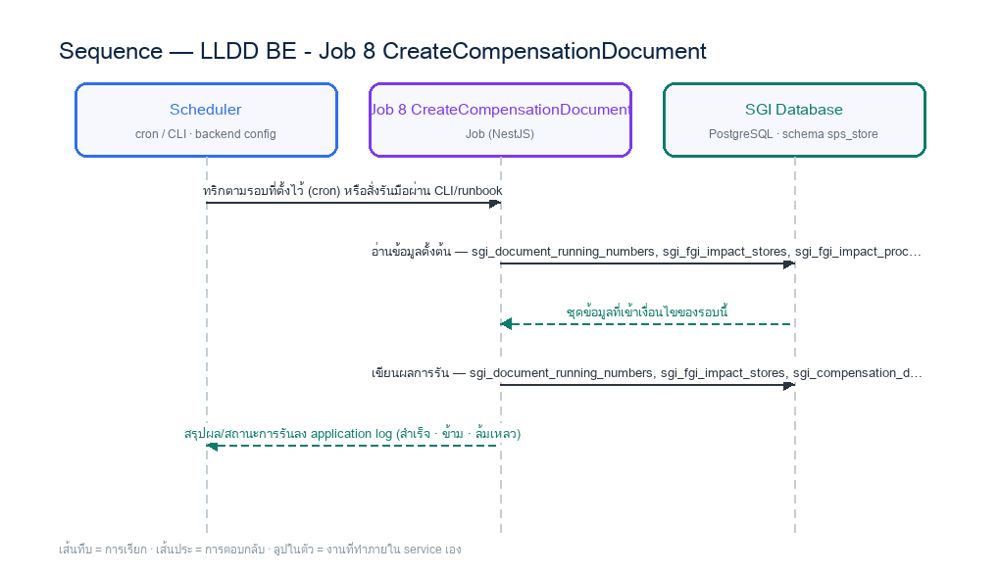

# LLDD BE - Job 8 CreateCompensationDocument

SBP Mall - ระบบประกันรายได้ | Low Level Design Document

## 1. Overview

| รายการ | รายละเอียด |
| --- | --- |
| Track | BE |
| Estimate | **23 ชั่วโมง** = implementation 17 + unit test 6 (30%) |
| Owner | Aphiwit &lt;Bank&gt; Khammoon |
| Target repository | **`SBP/srm-sps-spsap-sop-sgi-batch`** (NestJS 11 + TypeORM · schema `sps_store` · **มติ 2026-09-02 — ย้ายมาจาก store-backend**) — batch runner ของ SBP ที่รันอยู่แล้ว 42 job บน **AWS Batch** · ลงทะเบียน job ใน `src/main.ts` แล้วรับ argument ผ่าน `JOB_NAME`/`INPUT` (local) หรือ `argv[3]`/`argv[2]` (AWS Batch) · **ไม่ผ่าน BFF และไม่เปิด HTTP** · ตารางเวลาเป็น AWS Batch scheduled event ไม่ใช่ `@Cron` · ดู `SBP/srm-sps-spsap-sop-sgi-batch.md` |
| Objective | สร้างเอกสารประกันรายได้อัตโนมัติ: สร้าง sgi_compensation_documents จาก impact profile และข้อมูลชดเชยในฐานข้อมูลเดียวกัน แทนการเขียนไฟล์ BPM06001O และ SFTP ไป compensateflow; ไม่เรียก workflow โดยตรง |

Common contract reference: ทุกหัวข้อ API/FE ต้องยึด LLDD-BE-API-Common-Contracts และ LLDD-FE-Integration-Contracts สำหรับ error/auth/format/pagination/action/RBAC ก่อนลงรายละเอียดเฉพาะหน้าหรือเฉพาะ endpoint

### 1.1 เอกสาร LLDD ที่เกี่ยวข้อง

ตารางนี้สร้างจาก endpoint และตารางที่เอกสารฉบับนี้ประกาศไว้จริง — อ่านฉบับที่อยู่ในตารางก่อนลงมือ เพื่อไม่ให้สัญญา request/response หรือชื่อคอลัมน์หลุดจากกัน

| ความสัมพันธ์ | เอกสาร LLDD | เกี่ยวข้องตรงไหน |
| --- | --- | --- |
| สัญญากลาง | **LLDD-BE-API-Common-Contracts** | envelope `{success,data}` · error code · pagination · รูปแบบวันที่/เลขเอกสาร |
| โครงสร้างข้อมูล | **LLDD-BE-Database-Structure** | DDL ของตารางที่หัวข้อ Reference DB Mapping อ้างถึง |
| แพลตฟอร์มระบบเดิม | **LLDD-BE-Integration-SBP-Platform** | header จาก BFF (`x-api-key` / `x-user-*`) · การ reuse ตารางและ service ของระบบ SBP เดิม |
| ต้องจบก่อน (ลำดับงาน) | **LLDD-BE-API-Common-Contracts** | เป็นฉบับต้นทางของสัญญา/โครงที่ฉบับนี้อ้าง |
| ต้องจบก่อน (ลำดับงาน) | **LLDD-BE-Job-6-ExportImpactStoreToFS** | เป็นฉบับต้นทางของสัญญา/โครงที่ฉบับนี้อ้าง |

## 2. Screen / Functional Scope

- Main class/script: document.service.createFromImpact / (internal scheduler / service)
- Phase: C
- Output: sgi_compensation_documents (DB)
- Estimate: 17 ชั่วโมง
- Argument รับผ่าน `INPUT` (JSON) — local ใช้ env `JOB_NAME`/`INPUT` · AWS Batch ใช้ `argv[3]`/`argv[2]` · ดูหัวข้อ 5.95 · ไม่มีตาราง job_configs และไม่มีหน้าจอควบคุม (หน้า Flow Batch Job ในกลุ่มเมนู Flow เหลือแค่ Flowchart + Database ที่ใช้ · 2026-08-06)
- ตารางเวลาตั้งที่ **AWS Batch scheduled event** (repo ไม่มี `@Cron`) — **ยกเว้น job ที่เป็น event-driven (ดูหัวข้อ Config Schema ของ job นั้น) ซึ่งห้ามตั้ง schedule** · ทุก job ถูกบันทึกลง `integration_log` โดย `main.ts` อัตโนมัติ + structured log `BATCH_START`/`BATCH_END` พร้อม `runId`

## 3. Screenshot Reference

ไม่มีภาพหน้าจอสำหรับหัวข้อนี้ — เป็นเอกสารฝั่ง Backend/Batch ที่ไม่มี UI (ภาพหน้าจอทั้งหมดอยู่ในเอกสารชุด FE)

## 4. Implementation Flow & Sequence Diagram (Reference)

### 4.1 Implementation Flow (ลำดับขั้นการทำงาน)


_รูปที่ 1: Implementation flow reference: LLDD BE - Job 8 CreateCompensationDocument_

### 4.2 Sequence Diagram (ใครคุยกับใคร ลำดับไหน)

ผู้แสดงและลำดับข้อความในภาพนี้สร้างจาก endpoint ในหัวข้อ 7 และตารางในหัวข้อ Reference DB Mapping ของเอกสารฉบับนี้เอง จึงตรงกับสัญญาเสมอ



_รูปที่ 2: Sequence diagram: LLDD BE - Job 8 CreateCompensationDocument_

## 5. Field, Format, and Validation

| Field / UI | Format | Validation | Behavior |
| --- | --- | --- | --- |
| กำหนดการรัน (Cron) | 30 17 7-31 * * | แก้ไขได้ | ใช้รอบเดิม แต่ปลายทางเป็น DB ภายใน |
| Target table | sgi_compensation_documents | ค่าคงที่/แก้ผ่านหน้าจอไม่ได้ | สร้าง doc_no YYYY/xxxxx และผูก impact_process_id |
| เงื่อนไขเลือกข้อมูล | สถานะ I + forecast + ยังไม่สร้างเอกสาร | ค่าคงที่/แก้ผ่านหน้าจอไม่ได้ | Gen Flow Gate อยู่ที่ Job 8b / Workflow Engine |
| ข้อห้ามเชิงสถาปัตยกรรม | ห้ามสร้างไฟล์ BPM06001O, ห้าม SFTP, ห้ามเรียก K2 REST | ค่าคงที่/แก้ผ่านหน้าจอไม่ได้ | ใช้ Document Service + DB transaction เท่านั้น |

### 5.9 Input / Progress / Output Contract

| Stage | Contract for implementation |
| --- | --- |
| Input | Impact-store compensation rows in initial status with workflow sequence values and no prior confirm-receive output. |
| Progress | update BPM sequence, query eligible impact-store rows, refresh not-OPT data, generate workflow payload, insert confirm-receive rows, upload/export, notify. |
| Output | Impact-store workflow create payload/output with generated sequence numbers and duplicate guard. |

### 5.90 Job 8 Execution Stages

update BPM sequence, query eligible impact-store rows, refresh not-OPT data, generate workflow payload, insert confirm-receive rows, upload/export, notify.

| Order | Service step | Repository | Output / failure contract |
| --- | --- | --- | --- |
| 1 | loadDocumentCandidates | compensationDocumentRepository | คืน metrics และ throw typed error; transaction/rerun ใช้ contract ด้านล่าง |
| 2 | allocateDocumentNumbers | compensationDocumentRepository | คืน metrics และ throw typed error; transaction/rerun ใช้ contract ด้านล่าง |
| 3 | createCompensationDocuments | compensationDocumentRepository | คืน metrics และ throw typed error; transaction/rerun ใช้ contract ด้านล่าง |
| 4 | recordDocumentCreation | compensationDocumentRepository | คืน metrics และ throw typed error; transaction/rerun ใช้ contract ด้านล่าง |

### 5.91 Job 8 Run Evidence

| Evidence | Job-specific value | Acceptance |
| --- | --- | --- |
| Input identity | Impact-store compensation rows in initial status with workflow sequence values and no prior confirm-receive output. | snapshot input file/business key/period in run record |
| Output identity | Impact-store workflow create payload/output with generated sequence numbers and duplicate guard. | reconcile input, success, reject and skipped counts |
| Dedup proof | UNIQUE(impact_process_id) และ UNIQUE(year,running_no); lock running number ต่อปีใน transaction; conflict ต้องคืน/อ้าง doc_no เดิม และยอมให้เลขที่จองกระโดดโดยห้าม reuse | rerun fixture produces no duplicate target business key |
| Transaction proof | lock เลขรัน + insert document + update process + tracking (direction=INTERNAL) ใน transaction เดียว | injected failure leaves no partial committed state outside documented boundary |
| Security proof | internal service account เท่านั้น; ห้ามสร้างไฟล์ BPM06001O, ห้าม SFTP และห้ามเก็บ K2 credential | config/log/error contains no plaintext secret |

### 5.92 Legacy Java Source Reference

| Legacy file | Line range | Responsibility to carry forward |
| --- | --- | --- |
| fcsJar/src/th/co/gosoft/fgi/main/ExportImpactStoreFlowToBPM.java | 9-17 | Legacy main entrypoint for exporting impact-store flow data. |
| fcsJar/src/th/co/gosoft/fgi/controller/ExportController.java | 518-657 | Build impact-store BPM payload, write file, upload, backup, notification. |
| fcsJar/src/th/co/gosoft/fgi/dao/jdbc/ExportJdbc.java | 1654-1692 | Query impact-store rows eligible for workflow export. |

Line ranges refer to the legacy Java implementation under `batchjob/fcsJar/` (path นับจากราก `sbp-prototype/`). Use these ranges to preserve business behavior while implementing the target Node job.

### 5.93 Target Repository and SQL Contract

| Contract | Target implementation |
| --- | --- |
| Repository | compensationDocumentRepository |
| Idempotency / dedup | UNIQUE(impact_process_id) และ UNIQUE(year,running_no); lock running number ต่อปีใน transaction; conflict ต้องคืน/อ้าง doc_no เดิม และยอมให้เลขที่จองกระโดดโดยห้าม reuse |
| Transaction boundary | lock เลขรัน + insert document + update process + tracking (direction=INTERNAL) ใน transaction เดียว |
| Security | internal service account เท่านั้น; ห้ามสร้างไฟล์ BPM06001O, ห้าม SFTP และห้ามเก็บ K2 credential |

#### Input / candidate query

```sql
SELECT p.id AS impact_process_id, p.impacted_store_code, p.impact_month,
       SUM(COALESCE(s.adjust_compensation_amount, s.forecast_compensation_amount, 0)) AS total_compensation_amount
FROM sgi_fgi_impact_processes p
JOIN sgi_fgi_impact_stores s ON s.impact_process_id = p.id
WHERE p.process_status = 'READY_DOCUMENT'
GROUP BY p.id, p.impacted_store_code, p.impact_month;
```

#### Write / upsert query

```sql
-- bind ตามลำดับ: $1=doc_no · $2=year · $3=running_no · $4=impact_process_id · $5=impact_compensation_id · $6=impacted_store_code · $7=impact_month · $8=total_compensation_amount · $9=run_id
INSERT INTO sgi_compensation_documents
    (doc_no, year, running_no, impact_process_id, impact_compensation_id,
     impacted_store_code, impact_month,
     source, status_code, current_section_code, total_compensation_amount, created_by)
VALUES ($1 /* doc_no */, $2 /* year */, $3 /* running_no */, $4 /* impact_process_id */, $5 /* impact_compensation_id */,
        $6 /* impacted_store_code */, $7 /* impact_month */,
        'FS', '06', '06', $8 /* total_compensation_amount */, 'JOB-8')
-- ⚠️ กันซ้ำที่ **งวด** ไม่ใช่ที่รอบ — รอบหนึ่งมีเอกสารได้หลายใบ (งวดละใบ · มติ 2026-09-13)
ON CONFLICT (impact_compensation_id) DO NOTHING;

INSERT INTO sgi_interface_transactions
    (run_id, data_name, direction, status, impact_process_id, doc_no,
     business_key, period_key, outbox_status, purge_after, completed_at)
SELECT $9 /* run_id */, 'DOCUMENT_CREATE', 'INTERNAL', 'COMPLETED', d.impact_process_id, d.doc_no,
       CAST(d.impact_process_id AS VARCHAR), d.impact_month, 'COMPLETED',
       CURRENT_TIMESTAMP + INTERVAL '365 days', CURRENT_TIMESTAMP
FROM sgi_compensation_documents d
WHERE d.impact_process_id = $4 /* impact_process_id */
ON CONFLICT (data_name, direction, business_key, period_key) DO NOTHING;
```

### 5.94 Target Node Implementation

โครงสร้างนี้ระบุ service/repository เฉพาะงานและต้อง implement ตาม SQL, transaction, idempotency และ security contract ด้านบน โดยทุกขั้นต้องคืน metrics สำหรับ reconcile และ run history

```js
export async function runLlddBeJob8Createcompensationdocument(ctx, services) {
  const run = await services.jobRuns.acquire({
    jobNo: "8", period: ctx.period, triggeredBy: ctx.triggeredBy
  });

  try {
    ctx = { ...ctx, runId: run.id, repository: services.compensationDocumentRepository };
    const step1 = await services.loadDocumentCandidates(ctx, undefined);
    const step2 = await services.allocateDocumentNumbers(ctx, step1);
    const step3 = await services.createCompensationDocuments(ctx, step2);
    const step4 = await services.recordDocumentCreation(ctx, step3);
    const result = step4;
    await services.jobRuns.finish(run.id, "SUCCESS", result.metrics);
    return { runId: run.id, status: "SUCCESS", ...result };
  } catch (error) {
    await services.jobRuns.finish(run.id, "FAILED", {
      errorCode: error.code ?? "JOB_FAILED",
      errorMessage: error.message
    });
    throw error;
  }
}
```

### 5.95 การลงทะเบียน job และ Arguments (sop-sgi-batch)

งานนี้ลงทะเบียนเป็น job ชื่อ **`sgi-create-compensation-document`** ใน `src/main.ts` ของ `SBP/srm-sps-spsap-sop-sgi-batch` โดยใช้ dispatcher เดิมของ repo (ไม่สร้าง runner ใหม่) — `main.ts` อ่านชื่อ job และ input มา 2 ทาง แล้วเลือกอัตโนมัติจากการมี `argv[3]` หรือไม่

| ช่องทางรัน | ชื่อ job มาจาก | input มาจาก | ตัวอย่าง |
| --- | --- | --- | --- |
| Local / CLI / runbook | env `JOB_NAME` | env `INPUT` (JSON string) | `JOB_NAME=sgi-create-compensation-document INPUT='{"impactMonth":"2026-06"}' npm run start` |
| AWS Batch (ตารางเวลาจริง) | `process.argv[3]` | `process.argv[2]` (JSON string) | `node dist/main.js '{"impactMonth":"2026-06"}' sgi-create-compensation-document` |

**ตารางเวลาไม่ได้อยู่ในโค้ด** — repo นี้ไม่มี `@Cron`/`@Interval` แม้แต่จุดเดียว (แม้ติดตั้ง `@nestjs/schedule` ไว้) cron ในหัวข้อ 5 เป็น **นิยามของ AWS Batch scheduled event** ที่ต้องตั้งตอน deploy ไม่ใช่ค่าที่อ่านจาก config file

#### Argument ที่รับได้ (`INPUT` เป็น JSON object · ไม่ส่ง = `{}`)

**ระบบเดิมรับ argument แบบนี้:** **ไม่รับ args**  
ของใหม่เปลี่ยนจาก positional string เป็น JSON เพื่อให้เพิ่มฟิลด์ได้โดยไม่พังของเดิม แต่ **ต้องรองรับทุกอย่างที่ระบบเดิมรับได้เป็นอย่างน้อย** — ห้ามลดความสามารถลง

| Field | ชนิด | ไม่ส่งแล้วได้อะไร (default) | Validation | ตรงกับ argument เดิม |
| --- | --- | --- | --- | --- |
| `impactMonth` | string | งวดล่าสุดที่พร้อม | `YYYY-MM` | **ของใหม่** |
| `impactProcessIds` | number[] | `null` = ทุกรอบที่เข้าเงื่อนไข | ต้องมีอยู่จริงใน `sgi_fgi_impact_processes` | **ของใหม่** |
| `dryRun` | boolean | `false` | `true` = อ่าน/คำนวณครบแต่ไม่ commit และไม่ publish/ไม่ส่งไฟล์ | **ของกลาง** ทุก job |
| `limit` | number | `null` | จำกัดจำนวนรายการที่ประมวลผลรอบนี้ (ใช้ตอน smoke test) | **ของกลาง** ทุก job |

**กติกาการ validate ที่ทุก job ต้องทำเหมือนกัน** — parse `INPUT` ไม่สำเร็จ หรือฟิลด์ไม่ผ่าน validation ให้ log `BATCH_END` ด้วย `batchStatus: 'FAILED'` แล้ว `exit(1)` **ก่อนแตะฐานข้อมูล** (ห้าม fallback ไปค่า default เงียบ ๆ เมื่อผู้ใช้ตั้งใจส่งค่ามาแล้วผิด) · ฟิลด์ที่ไม่รู้จักให้ log warn แล้วข้าม ไม่ทำให้ job ล้ม

- ระบุ `impactProcessIds` ไม่ข้ามกฎ `UNIQUE(impact_process_id)` — รอบที่มีเอกสารแล้วต้อง skip พร้อมคืน `doc_no` เดิม

### 5.96 เงื่อนไขตัดสิน (Decision Rules) — ตัดสินจากอะไร

Job 8 สร้างเอกสารประกันรายได้ — 2 เรื่องที่ต้องชัดคือ **รอบไหนได้เอกสาร** และ **เลขเอกสารจองอย่างไรไม่ให้ชนกัน**

| คำถามที่โค้ดต้องตอบ | ตัดสินจาก (ตาราง · คอลัมน์) | เงื่อนไขที่ต้องเป็นจริง | ไม่เข้าเงื่อนไขแล้วทำอะไร |
| --- | --- | --- | --- |
| รอบชดเชยนี้ได้เอกสารหรือยัง | `sgi_fgi_impact_processes.id` เทียบกับ `sgi_compensation_documents.impact_process_id` (`UNIQUE`) | มีเอกสารของ `impact_process_id` นั้นอยู่แล้ว = **skip** และคืน `doc_no` เดิม | ห้ามสร้างเอกสารใบที่ 2 ให้รอบเดียวกัน — นี่คือกลไกกัน rerun ซ้ำหลักของ job นี้ |
| รอบนี้พร้อมสร้างเอกสารหรือยัง | `sgi_fgi_impact_processes.flag_action` · `sgi_fgi_impact_sales_summaries.sales_status` ของรอบเดียวกัน | รอบต้อง active (`flag_action IN ('Y','W')`) และมียอดขาย/Growth ที่คำนวณแล้ว (`sales_status = 'Y'`) | ยังไม่พร้อม = ข้ามรอบนี้ ให้รอบถัดไปหยิบ (ไม่ใช่ error) |
| เลขเอกสารเป็นอะไร | `sgi_document_running_numbers` (`year` · `running_no`) · `UNIQUE(year, running_no)` | รูปแบบ `YYYY/xxxxx` ด้วย **ปี ค.ศ.** · lock running number ต่อปีภายใน transaction เดียวกับการ insert เอกสาร | **ช่องว่างของเลขเป็นเรื่องปกติ** (rerun/conflict) — เลขรับประกันแค่ไม่ซ้ำ ไม่รับประกันความต่อเนื่อง และ **ห้าม reuse เลขที่จองไปแล้ว** |

#### ค่าคงที่และโดเมนที่ใช้ในเงื่อนไขข้างบน

ทุกค่าในตารางนี้ต้องอ่านจาก config/env ไม่ hardcode ในคิวรี — แต่ **ค่าตั้งต้นต้องเท่าระบบเดิมทุกตัว** ไม่งั้นผลลัพธ์จะไม่ตรงกันตอนเทียบ UAT

| ค่า | โดเมน / ค่าที่ระบบเดิมใช้ | ที่มา |
| --- | --- | --- |
| รูปแบบเลขเอกสาร | `YYYY/xxxxx` · ปี **ค.ศ.** | มติ 2026-08-06 (ทั้งระบบเป็น ค.ศ. ยกเว้นไฟล์ interface) |
| `flag_action` ที่ถือว่า active | `Y` · `W` | โดเมนเดิมของ `FGI_IMPACT_STORE_ON_PROCESS` |

### 5.97 Job 8 Document Number Gap and Rerun Policy

Job 8 ใช้ running number แบบ monotonic ต่อปี ค.ศ. ช่องว่างของเลขเอกสารจาก concurrent rerun หรือ ON CONFLICT เป็นพฤติกรรมที่ยอมรับได้ เพราะเลขที่มีหน้าที่รับประกัน uniqueness ไม่ได้รับประกันความต่อเนื่อง

| Case | Required behavior | Evidence / metric |
| --- | --- | --- |
| Rerun พบ impact_process_id เดิมก่อนจองเลข | คืน/ข้ามด้วย doc_no เดิมโดยไม่จอง running_no เพิ่มเมื่อ fast lookup พบข้อมูลแล้ว | duplicateExistingCount + existingDocNo |
| Concurrent worker ชน ON CONFLICT หลังจองเลข | ยอมให้ running_no ที่จองแล้วกลายเป็น gap; ห้ามลด sequence และห้ามนำเลขกลับมาใช้ | numberGapCount + conflictedImpactProcessId |
| Conflict path | อ่าน sgi_compensation_documents ด้วย impact_process_id แล้วใช้ d.doc_no เดิมสำหรับ tracking/reconcile | tracking.doc_no ตรงกับเอกสารที่ commit อยู่จริง |
| New document path | insert document และ tracking (direction=INTERNAL) ใน transaction เดียว | createdCount และ trackingCount เพิ่มเท่ากัน |
| Audit/runbook | อธิบายว่าเลขอาจไม่ต่อเนื่องแต่ต้องไม่ซ้ำและตรวจสอบย้อนกลับได้ | ไม่มีขั้นตอน manual reuse หรือ renumber |

## 6. Button / User Action Mapping

| Action | Trigger | API / Service | Expected Result |
| --- | --- | --- | --- |
| รันตามตารางเวลา | CRON | scheduler → runner (job 8) | อ่าน cron/พารามิเตอร์จาก backend config |
| รันนอกรอบ (manual/rerun) | CLI | CLI/ops runbook → runner (job 8) | guard ไม่ให้รันซ้อนด้วย distributed lock |
| แก้พารามิเตอร์/เปิด-ปิด job | CONFIG | แก้ backend config แล้ว deploy | ไม่มี endpoint และไม่มีหน้าจอควบคุม — หน้า Flow Batch Job เป็น reference อย่างเดียว (2026-08-06) |
| ตรวจผลการรัน | LOG | application log (structured) | ไม่มีตาราง job_run_histories แล้ว · ผลการรับส่งไฟล์/ข้อความดูที่ sgi_interface_transactions |

## 7. API Contract

**เอกสารฉบับนี้ไม่มี endpoint ของตัวเอง** — เป็นสัญญา/งานภายในที่เอกสารอื่นเรียกใช้ (ดูขอบเขตใน 5.90 Endpoint Implementation Contract) · รายการ endpoint ทั้ง 28 เส้นของ SGI อยู่ที่ **LLDD-API** และ `api.md`

## 8. Reference DB Mapping (No Database Page Work)

ส่วนนี้เป็นข้อมูลอ้างอิงสำหรับการ implement API/Job เท่านั้น ไม่ใช่งานสร้างหน้า Database, ไม่ใช่งานออกแบบ DB page และไม่ถูกนับเป็น deliverable แยกของ FE/BE

| Table / Object | R/W | Usage |
| --- | --- | --- |
| sgi_document_running_numbers | R/W | ตัวนับเลขเอกสารรายปี — ออก doc_no YYYY/xxxxx (ค.ศ.) |
| sgi_fgi_impact_stores | R/W | อ่าน candidate และอัปเดตสถานะสร้างเอกสาร |
| sgi_fgi_impact_processes | R | hub รอบชดเชย |
| sgi_compensation_documents | W | สร้างหัวเอกสารแทนไฟล์ BPM06001O |
| sgi_interface_transactions | W | tracking ภายใน: direction=INTERNAL · status=COMPLETED (ไม่มี ACK ให้รอเพราะเขียน DB ตรง) |

## 9. Skeleton Code (Batch Job 8)

### 9.1 ผังไฟล์ที่ต้องสร้าง (Job 8) — บน `srm-sps-spsap-sop-sgi-batch`

โครงไฟล์ของ Job 8 (document.service.createFromImpact เดิม) วางใต้ `src/modules/sgi/` ตาม convention ที่ repo นี้ใช้อยู่จริง (ดูตัวอย่างที่ `src/modules/performance/import-qssi.service.ts`): service ถือ logic ทั้งหมด, inject `DataSource`/repository ผ่าน TypeORM, ยิง raw SQL ได้ตรง, และ **ไม่มี controller** เพราะ repo นี้ไม่เปิด HTTP

**สิ่งที่ reuse ได้ทันที ไม่ต้องเขียนใหม่** — ต่างจากแผนเดิมที่ตั้งไว้บน store-backend ซึ่งต้องสร้าง runner ทั้งชุดเอง: `src/main.ts` (dispatcher + `BATCH_START`/`BATCH_END` + `runId` + log ลง `integration_log` อัตโนมัติ) · `src/modules/rabbitMQ/rabbitmq.service.ts` (`publishMessage`) · `src/shared/services/s3.service.ts` · `StatementService.decodeThaiFileContent()` (WINDOWS-874 auto-detect) · `@gosoft-sbp/email-lib` · `@srm/glb-log`

⚠️ **สิ่งที่ repo นี้ยังไม่มี และเป็นงานตั้งต้นจริง**: (1) ไม่มี `@Cron` เลย — ตารางเวลาต้องตั้งเป็น **AWS Batch scheduled event** (2) ไม่มี distributed lock (`pg_try_advisory_lock`) — การกันรันซ้อนพึ่ง AWS Batch queue ถ้างานไหนรับความเสี่ยงนี้ไม่ได้ต้องเพิ่มเอง (3) `publishMessage` เป็น fire-and-forget **ไม่มี publisher confirm และไม่มี outbox** — งานที่ต้องการ **transactional outbox + publisher confirm** (Job 6 · และ `sgi_reflow` ฝั่ง BE) ต้องสร้างกลไกเพิ่มเอง ไม่ใช่ reuse ได้เลย · ⚠️ ไม่มี ACK ระดับธุรกิจให้รอ (มติ 2026-09-08 ข้อ 2.13) (4) ยังไม่มี entity/ตาราง `sgi_*` แม้แต่ตัวเดียว

| Path | หน้าที่ |
| --- | --- |
| src/modules/sgi/job-8-create-compensation-document.service.ts | คลาส `CreateCompensationDocumentService` — **`execute(input)` เป็น entry point เดียว** เรียงตาม flow ของ Job 8 ทีละขั้น ครอบ transaction เอง และจบด้วย structured log สรุป metrics (แบบเดียวกับ `ImportQssiService.execute(body)` ที่มีอยู่) |
| src/modules/sgi/job-8-create-compensation-document.service.spec.ts | unit test ของ service — repo นี้วาง spec ไว้ข้างไฟล์จริงเสมอ (`jest` + `npm run test:ci` มี coverage/SonarQube) |
| src/modules/sgi/dto/job-8-create-compensation-document-input.dto.ts | DTO ของ `INPUT` (JSON) พร้อม `class-validator` ตามตารางในหัวข้อ 9.2 — parse ไม่ผ่านต้อง fail ก่อนแตะ DB |
| src/modules/sgi/sgi.module.ts | NestJS module ของกลุ่มงานประกันรายได้ — ผูก service ทุกตัวของ SGI เข้ากับ `TypeOrmModule` (ไฟล์ร่วมของทุก job ให้ merge ไม่ใช่เขียนทับ) |
| src/main.ts | **เพิ่ม `case 'sgi-create-compensation-document':`** ในสวิตช์เดิม → `await import('./modules/sgi/job-8-create-compensation-document.service')` แล้ว `app.get(CreateCompensationDocumentService).execute(input)` (ไฟล์กลางของทุก job — เป็นจุด merge conflict ที่ต้องระวัง) |
| src/entities/sgi-*.entity.ts | entity ของตาราง `sgi_*` ที่หัวข้อ Reference DB Mapping อ้างถึง — **ยังไม่มีใน repo เลยสักตัว** ต้องสร้างใหม่ทั้งหมด |
| src/config/config.ts | เพิ่ม `export const sgiJob8Config` ตามแบบของไฟล์นี้ (โปรเจกต์ไม่ใช้ `registerAs`) — ค่าคงที่ทางธุรกิจของ Job 8 |

#### การลงทะเบียนใน `src/main.ts` (job `sgi-create-compensation-document`)

```js
// src/main.ts — เพิ่มเคสนี้ในสวิตช์เดิม (เรียงต่อจาก job ของ SGI ตัวก่อนหน้า)
      case 'sgi-create-compensation-document': {
        const { CreateCompensationDocumentService } = await import('./modules/sgi/job-8-create-compensation-document.service');
        const job8createcompensationdocumentService = app.get(CreateCompensationDocumentService);
        await job8createcompensationdocumentService.execute(input);   // input = JSON ที่ parse จาก INPUT/argv[2] แล้ว
        break;
      }
```

`main.ts` เรียก `StatementService.logInterfest('sgi-create-compensation-document', input)` ให้อยู่แล้วก่อนเข้าสวิตช์ → **ไม่ต้องเขียน log ลง `integration_log` เองซ้ำ** · และ `BATCH_END` ที่ท้ายไฟล์จะสรุป `batchStatus` + `durationMs` ให้อัตโนมัติ หน้าที่ของ service คือ throw เมื่อทำงานไม่สำเร็จเท่านั้น

### 9.2 Config Schema ของ Job 8 (backend config / env)

ตารางเวลาของ Job 8 คือ `30 17 7-31 * *` (วันที่ 7–31 เวลา 17:30) — ⚠️ **ตัวจริงตั้งที่ AWS Batch scheduled event ไม่ใช่ในโค้ด** (repo นี้ไม่มี `@Cron` เลย) ค่า `SGI_JOB8_CRON` เก็บไว้เป็นเอกสารประกอบ/ตรวจสอบเท่านั้น · `SGI_JOB8_ENABLED=false` ให้ `execute()` จบทันทีแบบ SUCCESS พร้อม log เหตุผล (กันกรณี AWS Batch ยังยิงเข้ามา)

```ts
// src/config/config.ts — เพิ่มบล็อกนี้ต่อท้าย (repo ใช้ export const ไม่ใช้ registerAs)
// convention จริงของ sop-sgi-batch คือ `export const` ใน `src/config/config.ts` (ไม่ใช้ registerAs · ดูของเดิมที่
// `AppConfigModule` แบบ @Global แล้วอ่าน process.env ตรง ๆ) — โปรเจกต์นี้ **ไม่ได้ใช้ registerAs**
// แม้แต่จุดเดียว จึงประกาศเป็นคลาสให้รีวิว/ทดสอบเหมือน config ตัวอื่น
import { Injectable } from '@nestjs/common';

// TODO: Job 8 ไม่มีตาราง job_configs และไม่มี Job Admin API แล้ว (ตัดสินใจ 2026-08-06)
// TODO: ค่าทุกตัวอ่านจาก env/config file ของ backend เท่านั้น — เปลี่ยนค่า = แก้ config แล้ว deploy
export interface Job8Config {
  /** เปิด/ปิด job รอบถัดไปโดยไม่ต้อง deploy โค้ด */
  enabled: boolean;
  /** ตารางเวลาของ job นี้ — บันทึกไว้เพื่ออ้างอิงเท่านั้น ตัวจริงตั้งที่ AWS Batch scheduled event */
  cron: string;
  /** Target table — สร้าง doc_no YYYY/xxxxx และผูก impact_process_id */
  targetTable: string;
  /** เงื่อนไขเลือกข้อมูล — Gen Flow Gate อยู่ที่ Job 8b / Workflow Engine */
  condition: string;
  /** ข้อห้ามเชิงสถาปัตยกรรม — ใช้ Document Service + DB transaction เท่านั้น */
  param4: string;
  /** ผู้รับอีเมลเมื่อ job ล้มเหลว — เก็บเป็น string คั่น comma ให้ตรง signature ของ
      `EmailLibService.sendMail({ mailTo })` ที่รับ string ไม่ใช่ string[] */
  mailTo: string;
}

@Injectable()
export class SgiJob8Config implements Job8Config {
  // TODO: ยืนยันค่า default ทุกตัวกับ Ops ก่อนขึ้น production (ไม่มีหน้าจอแก้ค่าแล้ว)
  enabled = (process.env.SGI_JOB8_ENABLED ?? 'true') === 'true';
  cron = process.env.SGI_JOB8_CRON ?? '30 17 7-31 * *';
  targetTable = process.env.SGI_JOB8_TARGET_TABLE ?? 'sgi_compensation_documents'; // TODO: ค่าคงที่ทางธุรกิจ — เปลี่ยนต้องผ่านการอนุมัติ
  condition = process.env.SGI_JOB8_CONDITION ?? 'สถานะ I + forecast + ยังไม่สร้างเอกสาร'; // TODO: ค่าคงที่ทางธุรกิจ — เปลี่ยนต้องผ่านการอนุมัติ
  param4 = process.env.SGI_JOB8_PARAM4 ?? 'ห้ามสร้างไฟล์ BPM06001O, ห้าม SFTP, ห้ามเรียก K2 REST'; // TODO: ค่าคงที่ทางธุรกิจ — เปลี่ยนต้องผ่านการอนุมัติ
  mailTo = process.env.SGI_JOB8_MAIL_TO ?? ''; // TODO: ผู้รับอีเมลแจ้ง error คั่นด้วย comma (เดิม: email-lib กลาง (sendEmail) แจ้ง error/pending ตาม config)
}

// TODO: เพิ่ม SgiJob8Config ใน providers/exports ของ AppConfigModule (@Global) เหมือน AppConfig
```

### 9.3 Job Class — `run(ctx)` ของ Job 8 ทีละขั้นตามผัง

#### 9.3.1 สัญญาของชั้นกลาง (`runner.ts`) + โครง service ของ Job 8

service อ้าง `JobRunContext` / `JobRunResult` / `JobState` / `JobFailedError` — ทั้งหมดนิยาม ครั้งเดียวใน `src/modules/sgi/sgi-job.types.ts` (ไฟล์ร่วมของทุก job ให้ merge ไม่ใช่เขียนทับ) และ service ต้องมี method ครบตามตารางขั้นตอนด้านล่าง มิฉะนั้น `execute(input)` จะเรียก method ที่ไม่มีอยู่

```ts
// src/modules/sgi/sgi-job.types.ts — สัญญากลางของทุก job ของ SGI (ประกาศครั้งเดียว ใช้ร่วมทั้ง 10 ฉบับ)

export interface JobRunContext {
  jobNo: string;
  period: string;        // YYYYMM ของงวดที่รัน
  triggeredBy: string;   // 'CRON' | userId ที่สั่งรันนอกรอบ
  params?: Record<string, string>;
}

export interface JobRunResult {
  event: 'job.finish';
  jobNo: string;
  jobName: string;
  status: 'SUCCESS' | 'SKIPPED' | 'SKIPPED_LOCKED' | 'FAILED';
  period: string;
  output: string;
  read: number; written: number; skipped: number; rejected: number;
  durationMs: number;
}

/** counter + ค่าที่ทุกขั้นของ job ใช้ร่วมกัน (service เป็นผู้สร้างผ่าน createState) */
export interface JobState {
  period: string;
  read: number; written: number; skipped: number; rejected: number;
  // TODO: เพิ่ม field เฉพาะของ job นี้ (เช่น rows ที่อ่านมา, path ไฟล์ที่เขียน)
  [key: string]: unknown;
}

/** error ที่ทำให้ job จบเป็น FAILED และส่งอีเมลแจ้งผู้ดูแล */
export class JobFailedError extends Error {
  constructor(public readonly code: string, message: string) { super(message); }
}

/** ใช้ออกจาก transaction เมื่อสาขา NO บอกให้ข้ามงวด/เรคคอร์ด — runner สรุปเป็น SKIPPED ไม่ใช่ FAILED */
export class JobSkippedError extends Error {}
```

```ts
// CreateCompensationDocumentService — method ที่ job class เรียก (1 method ต่อ 1 ขั้นในตารางด้านบน)
import { Inject, Injectable } from '@nestjs/common';
import type { DataSource, EntityManager } from 'typeorm';
import type { JobRunContext, JobState } from '../../runner';
export type { JobState };

@Injectable()
export class CreateCompensationDocumentService {
  constructor(@Inject('DATA_SOURCE') private readonly dataSource: DataSource) {}

  createState(ctx: JobRunContext): JobState {
    return { period: ctx.period, read: 0, written: 0, skipped: 0, rejected: 0 };
  }

  // query impact profile สถานะ I + forecast + ยังไม่สร้างเอกสาร
  async step02Document(state: JobState, manager?: EntityManager): Promise<void> {
    throw new Error('step02Document: ยังไม่ได้ implement — ดู SQL ที่หัวข้อ Repository / SQL และกติกาที่หัวข้อเงื่อนไขตัดสิน');
  }

  // ข้อมูลผู้อนุมัติ/ร้าน/ยอดชดเชยครบ?
  //   เงื่อนไขจริง: ดูตารางในหัวข้อ "เงื่อนไขตัดสิน (Decision Rules)" ของเอกสารฉบับนี้
  async check03Condition(state: JobState): Promise<boolean> {
    throw new Error('check03Condition: ยังไม่ได้ implement — ห้าม deploy ทั้งที่ยังไม่เขียนเงื่อนไขจริง');
  }

  // generate doc_no YYYY/xxxxx
  async step04Document(state: JobState, manager?: EntityManager): Promise<void> {
    throw new Error('step04Document: ยังไม่ได้ implement — ดู SQL ที่หัวข้อ Repository / SQL และกติกาที่หัวข้อเงื่อนไขตัดสิน');
  }

  // insert sgi_compensation_documents
  async step05Insert(state: JobState, manager?: EntityManager): Promise<void> {
    throw new Error('step05Insert: ยังไม่ได้ implement — ดู SQL ที่หัวข้อ Repository / SQL และกติกาที่หัวข้อเงื่อนไขตัดสิน');
  }

  // insert sgi_interface_transactions: data_name = IMPACT_STORE · direction = INTERNAL · status = COMPLETED
  async step06WriteFile(state: JobState, manager?: EntityManager): Promise<void> {
    throw new Error('step06WriteFile: ยังไม่ได้ implement — ดู SQL ที่หัวข้อ Repository / SQL และกติกาที่หัวข้อเงื่อนไขตัดสิน');
  }

}
```

#### 9.3.2 `run(ctx)` ของ Job 8

ทุกขั้นใน `run()` ตรงกับ flowchart ของ Job 8 หนึ่งต่อหนึ่ง (decision และ error path รวมอยู่ด้วย) — method ที่ต้อง implement ใน service ตามตารางนี้

| ลำดับ | ชนิด | ขั้นตอนจากผัง | Method ที่ต้อง implement | เส้นทาง NO / error |
| --- | --- | --- | --- | --- |
| 1 | start | เริ่ม | createState() | - |
| 2 | process | query impact profile สถานะ I + forecast + ยังไม่สร้างเอกสาร | step02Document() | throw JobFailedError เมื่อทำไม่สำเร็จ |
| 3 | decision | ข้อมูลผู้อนุมัติ/ร้าน/ยอดชดเชยครบ? | check03Condition() | [บันทึกผลแล้วไป record ถัดไป] บันทึก reject reason / ไม่สร้างเอกสาร |
| 4 | process | generate doc_no YYYY/xxxxx | step04Document() | throw JobFailedError เมื่อทำไม่สำเร็จ |
| 5 | process | insert sgi_compensation_documents | step05Insert() | throw JobFailedError เมื่อทำไม่สำเร็จ |
| 6 | process | insert sgi_interface_transactions: data_name = IMPACT_STORE · direction = INTERNAL · status = COMPLETED | step06WriteFile() | throw JobFailedError เมื่อทำไม่สำเร็จ |
| 7 | end | จบ - workflow เปิดโดย Job 8b / POST /sgi/workflow/instances | summarize() | - |

```ts
// src/modules/sgi/job-8-create-compensation-document.service.ts — execute(input) เป็น entry point เดียว
import { Inject, Injectable, Logger } from '@nestjs/common';
import type { DataSource, EntityManager } from 'typeorm';
import { CreateCompensationDocumentService, type JobState } from './job-8-create-compensation-document.service';
// 4 symbol นี้นิยามใน src/modules/sgi/sgi-job.types.ts (ไฟล์ร่วมของทุก job — ดูหัวข้อก่อนหน้า)
import { JobFailedError, JobSkippedError, JobRunContext, JobRunResult } from '../../runner';

@Injectable()
export class CreateCompensationDocumentJob {
  static readonly jobNo = '8';
  private readonly logger = new Logger(CreateCompensationDocumentJob.name);

  constructor(
    // TODO: repo นี้ตั้ง replication ใน typeorm.config.ts อยู่แล้ว — SELECT ไป slave, write ไป master อัตโนมัติ
    @Inject('DATA_SOURCE') private readonly dataSource: DataSource,
    private readonly service: CreateCompensationDocumentService,
  ) {}

  async run(ctx: JobRunContext): Promise<JobRunResult> {
    const startedAt = Date.now();
    // TODO: state ถือ candidates ที่อ่านมา + counter (read/written/skipped/rejected/marked)
    //       และค่าจาก job8Config — ทุก counter ต้องถูกอัปเดตจาก record จริง ไม่ใช่ค่าคงที่
    const state = this.service.createState(ctx);
    try {
      // === transaction boundary === TODO: DB transaction เดียวครอบ generate doc_no + insert document + tracking
      await this.dataSource.transaction(async (manager: EntityManager) => {
        // ขั้นที่ 2: query impact profile สถานะ I + forecast + ยังไม่สร้างเอกสาร · TODO: ใช้ impact_process_id เป็น idempotency key
        await this.service.step02Document(state, manager);
      // TODO: candidate มาจากขั้นอ่านข้อมูลด้านบน — ลูปนี้จำเป็นเพราะมี branch ระดับ record
      //       (ขั้นที่ตัดสินรายแถวจะ `continue`/`return` ออกจากรอบของ record นั้น)
      //       เยื้องบรรทัดในลูปให้เรียบร้อยตอนคัดลอกเข้าโปรเจกต์จริง
      for (const record of state.candidates) {
        // ขั้นที่ 3 (decision): ข้อมูลผู้อนุมัติ/ร้าน/ยอดชดเชยครบ?
        const ok03 = await this.service.check03Condition(state);
        if (!ok03) { // NO → บันทึก reject reason / ไม่สร้างเอกสาร
          await this.service.mark03(state, manager);
          state.marked += 1;
          return; // ออกจาก transaction แบบ commit — ผล mark ต้องถูกบันทึก
        }
        // ขั้นที่ 4: generate doc_no YYYY/xxxxx · TODO: running ต่อปี ค.ศ. (มติ 2026-08-06)
        await this.service.step04Document(state, manager);
        // ขั้นที่ 5: insert sgi_compensation_documents · TODO: ผูก impact_process_id และสถานะเริ่มต้น
        await this.service.step05Insert(state, manager);
        // ขั้นที่ 6: insert sgi_interface_transactions: data_name = IMPACT_STORE · direction = INTERNAL · status = COMPLETED · TODO: ไม่สร้างไฟล์ BPM06001O แล้ว — เขียน DB ตรงจึงไม่มี ACK ให้รอ
        await this.service.step06WriteFile(state, manager);
      });
      }
      return this.summarize(state, 'SUCCESS', startedAt);
    } catch (error) {
      // TODO: error path ของ Job 8 — ห้ามนำ logic SFTP compensateflow หรือ K2 StartInstance กลับมาใช้ใน target design
      this.logger.error(JSON.stringify({ event: 'job.failed', jobNo: '8', period: ctx.period,
        triggeredBy: ctx.triggeredBy, durationMs: Date.now() - startedAt, error: (error as Error).message }));
      // TODO: แจ้งผู้ดูแลผ่าน JobFailureNotifier (หัวข้อ 9.6.1) — runner เป็นผู้เรียกให้
      throw error;
    }
  }

  private summarize(state: JobState, status: JobRunResult['status'], startedAt = Date.now()): JobRunResult {
    // TODO: structured log บรรทัดเดียวจบ — ไม่มีตาราง job_run_histories แล้ว (2026-08-06)
    const summary = {
      event: 'job.finish', jobNo: '8', jobName: 'CreateCompensationDocument', status,
      period: state.period, output: 'sgi_compensation_documents (DB)',
      read: state.read, written: state.written, skipped: state.skipped,
      rejected: state.rejected, durationMs: Date.now() - startedAt,
    };
    this.logger.log(JSON.stringify(summary));
    return summary as JobRunResult;
  }
}
```

### 9.4 การกันรันซ้อนของ Job 8 (PostgreSQL advisory lock — **ของใหม่**)

Job 8 มีข้อควรระวังจาก legacy: ห้ามนำ logic SFTP compensateflow หรือ K2 StartInstance กลับมาใช้ใน target design — runner ล็อกด้วย `pg_try_advisory_lock` ก่อนเริ่มขั้นแรกเสมอ และรอบที่ล็อกไม่ได้ให้จบด้วยสถานะ SKIPPED_LOCKED (ไม่ใช่ FAILED)

```ts
// src/modules/sgi/sgi-job.lock.ts (ของใหม่ — repo นี้ยังไม่มีกลไกกันรันซ้อนใด ๆ)
import { Inject, Injectable, Logger } from '@nestjs/common';
import type { DataSource } from 'typeorm';

// TODO: ห้ามใช้แถวสถานะ RUNNING ในตารางเป็นตัวกัน (ไม่มีตาราง job_run_histories แล้ว)
//       ใช้ PostgreSQL advisory lock ระดับ session แทน — ปลดอัตโนมัติเมื่อ connection หลุด
export const SGI_JOB_LOCK_CLASS_ID = 861000; // namespace ของระบบ SGI
export const JOB_LOCK_KEYS: Record<string, number> = { '8': 80 /* TODO: เพิ่มให้ครบทุก job */ };

@Injectable()
export class BatchRunner {
  private readonly logger = new Logger(BatchRunner.name);
  constructor(@Inject('DATA_SOURCE') private readonly dataSource: DataSource) {}

  // period = งวดที่รอบนี้ทำงาน ('YYYY-MM') — เป็นส่วนหนึ่งของคีย์ล็อก ไม่ใช่แค่หมายเลข job
  // (เจอจริง 2026-09-09: ล็อกด้วย jobNo อย่างเดียว = คนละงวดก็รันพร้อมกันไม่ได้
  //  ทั้งที่เอกสารระบุว่าคนละงวดต้องรันขนานกันได้ · ส่ง period = null ถ้าต้องการล็อกทั้ง job)
  async runExclusive<T>(jobNo: string, period: string | null, fn: () => Promise<T>): Promise<T | { status: 'SKIPPED_LOCKED' }> {
    // TODO: ต้องใช้ QueryRunner (connection เดียวบน master) — dataSource.query() ของโปรเจกต์นี้
    //       route SQL ที่ขึ้นต้นด้วย SELECT ไป slave pool ทำให้ lock ไปตกที่ replica คนละ connection
    const runner = this.dataSource.createQueryRunner('master');
    await runner.connect();
    // pg_try_advisory_lock(int4, int4) — objectId ต้องอยู่ในช่วง int4
    //   ล็อกทั้ง job : objectId = JOB_LOCK_KEYS[jobNo]
    //   ล็อกรายงวด  : ผสมงวดเข้าไปด้วย hashtext() แล้วบีบให้อยู่ในช่วงที่ปลอดภัย
    const baseId = JOB_LOCK_KEYS[jobNo];
    const objectId = period === null ? baseId
      : (await runner.query('SELECT (hashtext($1) & 2147483647) % 1000000 + $2 * 1000000 AS id',
                            [period, baseId]))[0].id;
    try {
      const [{ locked }] = await runner.query(
        'SELECT pg_try_advisory_lock($1, $2) AS locked',
        [SGI_JOB_LOCK_CLASS_ID, objectId],
      );
      if (!locked) {
        // TODO: รอบนี้ข้ามไปเฉย ๆ ไม่ถือเป็น error และไม่ต้องส่งอีเมล
        this.logger.warn(JSON.stringify({ event: 'job.skipped.locked', jobNo, period }));
        return { status: 'SKIPPED_LOCKED' };
      }
      return await fn();
    } finally {
      // TODO: ปลด lock ทุกกรณี แล้วคืน connection เข้า pool
      await runner.query('SELECT pg_advisory_unlock($1, $2)', [SGI_JOB_LOCK_CLASS_ID, objectId]);
      await runner.release();
    }
  }
}
```

### 9.5 Repository / SQL หลักของ Job 8

repository ของ Job 8 ประกาศเป็น factory provider (`{provide: 'CREATE_COMPENSATION_DOCUMENT_REPOSITORY', useFactory: (ds) => ds.getRepository(Entity), inject: [DataSource]}`) แล้วยิง raw SQL ตามแบบ module ธุรกิจอื่นของ store-backend (schema `sps_store` มาจาก search_path)

| ตาราง | R/W | การใช้งานตามผัง | หมายเหตุ target design |
| --- | --- | --- | --- |
| sgi_document_running_numbers | R/W | ตัวนับเลขเอกสารรายปี — ออก doc_no YYYY/xxxxx (ค.ศ.) | เขียน SQL ตรงผ่าน DATA_SOURCE |
| sgi_fgi_impact_stores | R/W | อ่าน candidate และอัปเดตสถานะสร้างเอกสาร | เขียน SQL ตรงผ่าน DATA_SOURCE |
| sgi_fgi_impact_processes | R | hub รอบชดเชย | เขียน SQL ตรงผ่าน DATA_SOURCE |
| sgi_compensation_documents | W | สร้างหัวเอกสารแทนไฟล์ BPM06001O | เขียน SQL ตรงผ่าน DATA_SOURCE |
| sgi_interface_transactions | W | tracking ภายใน: direction=INTERNAL · status=COMPLETED (ไม่มี ACK ให้รอเพราะเขียน DB ตรง) | เขียน SQL ตรงผ่าน DATA_SOURCE |

```sql
-- Job 8 CreateCompensationDocument — query หลักที่ต้อง implement
-- TODO: ทุก statement รันผ่าน DATA_SOURCE (SELECT ไป slave, write ไป master) และ
--       write ทั้งหมดต้องอยู่ใน transaction เดียวกับที่ระบุใน 9.3

-- [R/W] sgi_document_running_numbers : ตัวนับเลขเอกสารรายปี — ออก doc_no YYYY/xxxxx (ค.ศ.)
-- อ่าน candidate แบบล็อกแถว กันรอบอื่น/pod อื่นแย่งอัปเดตแถวเดียวกัน
SELECT year, last_running_no, updated_at, updated_by   -- ตัดคอลัมน์ที่ job นี้ไม่ได้ใช้ออก (ทั้งตารางมี 4 คอลัมน์)
  FROM sgi_document_running_numbers
 WHERE year = $1   -- คีย์ที่ job นี้ใช้คัดแถว (ตารางนี้ไม่มีคอลัมน์งวดของตัวเอง)
   FOR UPDATE SKIP LOCKED;

UPDATE sgi_document_running_numbers
   SET /* TODO: คอลัมน์สถานะ/ผลคำนวณที่ job นี้เขียน */
       updated_at = NOW(), updated_by = 'JOB8'
 WHERE /* คีย์ที่ล็อกไว้จาก SELECT ... FOR UPDATE ข้างบน */ year = ANY($1);

-- [R/W] sgi_fgi_impact_stores : อ่าน candidate และอัปเดตสถานะสร้างเอกสาร
-- อ่าน candidate แบบล็อกแถว กันรอบอื่น/pod อื่นแย่งอัปเดตแถวเดียวกัน
SELECT id, adjust_compensate_percent, adjust_compensation_amount, created_at, created_by, distance_km, forecast_compensate_percent, forecast_compensation_amount   -- ตัดคอลัมน์ที่ job นี้ไม่ได้ใช้ออก (ทั้งตารางมี 16 คอลัมน์)
  FROM sgi_fgi_impact_stores
 WHERE impact_month = $1  -- คอลัมน์งวดจริงของตารางนี้ตาม DDL
   FOR UPDATE SKIP LOCKED;

UPDATE sgi_fgi_impact_stores
   SET /* TODO: คอลัมน์สถานะ/ผลคำนวณที่ job นี้เขียน */
       updated_at = NOW(), updated_by = 'JOB8'
 WHERE /* คีย์ที่ล็อกไว้จาก SELECT ... FOR UPDATE ข้างบน */ id = ANY($1);

-- [R] sgi_fgi_impact_processes : hub รอบชดเชย
-- คอลัมน์มาจาก DDL จริงของตารางนี้ (ห้าม SELECT *) · ตรวจว่ามี index รองรับ WHERE ก่อนขึ้น prod
SELECT id, action_status, created_at, datasource, end_compensate_month, end_compensate_year, flag_action, impact_month, impact_year, impacted_store_code, last_compensate_seq, last_compensate_seq_no   -- ตัดคอลัมน์ที่ job นี้ไม่ได้ใช้ออก (ทั้งตารางมี 19 คอลัมน์)
  FROM sgi_fgi_impact_processes
 WHERE impact_year = $1 AND impact_month = $2  -- คอลัมน์งวดจริงของตารางนี้ตาม DDL
 ORDER BY id   -- PK ทำให้ลำดับคงที่ระหว่างแบ่งหน้า
 LIMIT $3 OFFSET $4;  -- อ่านเป็น chunk กัน memory บวม

-- [W] sgi_compensation_documents : สร้างหัวเอกสารแทนไฟล์ BPM06001O
-- คอลัมน์มาจาก DDL จริง — ตัดคอลัมน์ที่ job นี้ไม่ได้เขียนออก แล้วเลื่อนเลข $n ให้ตรง
INSERT INTO sgi_compensation_documents
  (impact_process_id, impact_compensation_id, impacted_store_code, created_by, account_month, account_year, allmap_url, approver_snapshot, current_section_code, doc_no, impact_month, loop_no, new_store_code, round_no)
VALUES ($1 /* impact_process_id */, $2 /* impact_compensation_id */, $3 /* impacted_store_code */, $4 /* created_by */, $5 /* account_month */, $6 /* account_year */, $7 /* allmap_url */, $8 /* approver_snapshot */, $9 /* current_section_code */, $10 /* doc_no */, $11 /* impact_month */, $12 /* loop_no */, $13 /* new_store_code */, $14 /* round_no */)
ON CONFLICT (source, impacted_store_code, impact_month, new_store_code, round_no)   -- unique key จริงตาม DDL ของ sgi_compensation_documents (ห้ามเดา)
DO UPDATE SET impact_process_id = EXCLUDED.impact_process_id, impact_compensation_id = EXCLUDED.impact_compensation_id, created_by = EXCLUDED.created_by, account_month = EXCLUDED.account_month, account_year = EXCLUDED.account_year, allmap_url = EXCLUDED.allmap_url, approver_snapshot = EXCLUDED.approver_snapshot, current_section_code = EXCLUDED.current_section_code, doc_no = EXCLUDED.doc_no, loop_no = EXCLUDED.loop_no, running_no = EXCLUDED.running_no, statement_date = EXCLUDED.statement_date, statement_id = EXCLUDED.statement_id, status_code = EXCLUDED.status_code, total_compensation_amount = EXCLUDED.total_compensation_amount,
       updated_at = NOW(), updated_by = 'JOB8';
```

### 9.6 การแจ้งเตือนและการรันซ้ำของ Job 8

#### 9.6.1 อีเมลแจ้งผู้ดูแลเมื่อ job ล้มเหลว

ใช้ `EmailLibService` จาก `@gosoft-sbp/email-lib` ตัวเดียวกับที่ระบบเดิมใช้ (inform-evaluate / external-audit / statement PTT) — ไม่สร้างกลไกส่งเมลใหม่

```ts
// src/modules/sgi/sgi-job-failure.notifier.ts (ใช้ @gosoft-sbp/email-lib ที่ repo มีอยู่แล้ว)
import { Injectable, Logger } from '@nestjs/common';
// ชื่อ method ของ lib ที่ repo นี้เรียกจริงคือ `sendMail` (ไม่ใช่ sendEmail) และ
// `mailTo` / `mailCc` เป็น **string** คั่นด้วย comma — ดู evaluation-process.service.ts,
// external-audit.service.ts, statement.service.ts, inform-evaluate.service.ts, performance.service.ts
import { EmailLibService } from '@gosoft-sbp/email-lib';
import type { JobRunContext } from './runner';

@Injectable()
export class JobFailureNotifier {
  private readonly logger = new Logger(JobFailureNotifier.name);
  // TODO: ใช้ lib อีเมลของระบบเดิม — template อยู่ในตาราง email_template และ log ลง email_sent อัตโนมัติ
  //       (ตั้งชื่อ property ว่า mailService ตาม call site เดิมของ sop-sgi-batch)
  constructor(private readonly mailService: EmailLibService) {}

  async notifyFailure(jobNo: string, ctx: JobRunContext, error: Error): Promise<void> {
    // TODO: ผู้รับของ Job 8 เดิมคือ email-lib กลาง (sendEmail) แจ้ง error/pending ตาม config — ย้ายมาเป็น env SGI_JOB8_MAIL_TO
    const recipients = (process.env.SGI_JOB8_MAIL_TO ?? '').split(',').map((s) => s.trim()).filter(Boolean);
    if (!recipients.length) {
      this.logger.warn(JSON.stringify({ event: 'job.mail.skipped', jobNo, reason: 'NO_RECIPIENT' }));
      return;
    }
    try {
      await this.mailService.sendMail({
        // TODO: emailId = id ของ template EM-07 (แจ้ง error batch) ในตาราง email_template
        emailId: Number(process.env.SGI_JOB_FAIL_EMAIL_TEMPLATE_ID),
        mailTo: recipients.join(','), // signature รับ string ไม่ใช่ string[]
        mailCc: '',
        param: {
          jobNo, jobName: 'CreateCompensationDocument',
          jobTitle: 'สร้างเอกสารประกันรายได้อัตโนมัติ',
          period: ctx.period, triggeredBy: ctx.triggeredBy,
          output: 'sgi_compensation_documents (DB)',
          errorMessage: error.message,
          rerunNote: 'idempotent ด้วย impact_process_id; เจอ doc เดิมให้ skip และคืนสถานะ already_created',
        },
      });
    } catch (mailError) {
      // TODO: ส่งเมลไม่สำเร็จห้ามกลบ error เดิมของ job — log แล้วปล่อยผ่าน
      this.logger.error(JSON.stringify({ event: 'job.mail.failed', jobNo, error: (mailError as Error).message }));
    }
  }
}
```

#### 9.6.2 Checklist การ rerun

- กติกา rerun ของ Job 8: idempotent ด้วย impact_process_id; เจอ doc เดิมให้ skip และคืนสถานะ already_created
- ขอบเขต transaction ที่ต้องรักษาเมื่อรันซ้ำ: DB transaction เดียวครอบ generate doc_no + insert document + tracking
- ความเสี่ยงที่ต้องตรวจก่อน/หลังรันซ้ำ: ห้ามนำ logic SFTP compensateflow หรือ K2 StartInstance กลับมาใช้ใน target design
- ตรวจว่ารอบก่อนหน้าไม่ได้ค้าง lock อยู่ (`SELECT * FROM pg_locks WHERE locktype = 'advisory'`) ก่อนสั่งรันนอกรอบ
- สั่งรันนอกรอบผ่าน CLI/runbook เท่านั้น (ไม่มีหน้าจอและไม่มี Job Admin API) — local: `JOB_NAME=sgi-create-compensation-document INPUT='{"year":2026,"month":6}' npm run start` · AWS Batch: `node dist/main.js '{"year":2026,"month":6}' sgi-create-compensation-document` (quote เดี่ยวครอบ JSON เสมอ) · ตรวจผลด้วย `echo $?` ต้องเป็น 0 เมื่อสำเร็จ
- หลังรันซ้ำ ตรวจ output `sgi_compensation_documents (DB)` และ log บรรทัด `job.finish` ว่า read/written/skipped/rejected ตรงกับที่คาด
- ถ้ารอบก่อนล้มเหลวกลางทาง ตรวจ `sgi_interface_transactions` ของงวดนั้นว่ามีแถวค้างสถานะ READY/PENDING หรือไม่ ก่อนสั่งรันใหม่

## 10. Processing Flow

| Step | Description |
| --- | --- |
| 1 | เริ่ม |
| 2 | query impact profile สถานะ I + forecast + ยังไม่สร้างเอกสาร (ใช้ impact_process_id เป็น idempotency key) |
| 3 | ข้อมูลผู้อนุมัติ/ร้าน/ยอดชดเชยครบ? \| No: บันทึก reject reason / ไม่สร้างเอกสาร |
| 4 | generate doc_no YYYY/xxxxx (running ต่อปี ค.ศ. (มติ 2026-08-06)) |
| 5 | insert sgi_compensation_documents (ผูก impact_process_id และสถานะเริ่มต้น) |
| 6 | insert sgi_interface_transactions: data_name = IMPACT_STORE · direction = INTERNAL · status = COMPLETED (ไม่สร้างไฟล์ BPM06001O แล้ว — เขียน DB ตรงจึงไม่มี ACK ให้รอ) |
| 7 | จบ - workflow เปิดโดย Job 8b / POST /sgi/workflow/instances |

## 11. Acceptance Criteria

- พารามิเตอร์รับผ่าน `INPUT` (JSON) และ config ของ repo — เปลี่ยนค่าโดย deploy ไม่ใช่ผ่าน API/หน้าจอ · **ตารางเวลาตั้งที่ AWS Batch scheduled event ไม่ใช่ `@Cron` ในโค้ด**
- การรันต้องตรวจ enabled flag ใน config · **การกันรันซ้อนพึ่ง AWS Batch queue เป็นหลัก** — advisory lock เป็นของใหม่ที่ต้องสร้างเองถ้างานนั้นรับความเสี่ยงรันซ้อนไม่ได้
- ทุกรอบต้องเขียน application log แบบ structured (`BATCH_START`/`BATCH_END` + `runId` — `src/main.ts` ทำให้แล้ว) และบันทึกลง `integration_log` อัตโนมัติ · error ต้องส่ง EM-07
- DB/table mapping ใช้เป็น reference สำหรับ implement Job เท่านั้น ไม่ใช่งานสร้างหน้า Database
- รองรับ rerun rule และ risk note ตาม runbook

## 12. Developer Test Checklist

| No | Test |
| --- | --- |
| 1 | รันตามตารางเวลาแล้วผลถูกต้องบน fixture |
| 2 | รันนอกรอบผ่าน CLI ได้ผลเดียวกับ cron |
| 3 | สั่งรันซ้อนขณะกำลังรัน → runner ปฏิเสธ (lock ทำงาน) |
| 4 | แก้ config แล้ว deploy → รอบถัดไปใช้ค่าใหม่ |
| 5 | job throw error → EM-07 ออก และ log มีบรรทัด error |
| 6 | ตรวจผลกระทบตารางตาม R/W mapping reference |

## 13. Unit Test Scope

**6 ชั่วโมง** (30% ของ implementation 17 ชั่วโมง) · เครื่องมือ: Jest + mock repository/DataSource (ไม่ต่อ DB จริง)

หัวข้อนี้คือ **unit test** ที่ต้องเขียนคู่กับโค้ด — ต่างจาก *Developer Test Checklist* ซึ่งเป็น scenario ระดับ end-to-end/manual ที่ใช้ตอนตรวจรับ · รายการด้านล่าง derive จาก field/validation, acceptance criteria, endpoint และตารางที่เอกสารนี้เขียน

| สิ่งที่ทดสอบ | ประเภท | เกณฑ์ผ่าน |
| --- | --- | --- |
| `เงื่อนไขเลือกข้อมูล` | rule | ใช้กฎกับข้อมูลตัวอย่างแล้วได้ผลตามที่ระบุ — สถานะ I + forecast + ยังไม่สร้างเอกสาร |
| business rule | logic | พารามิเตอร์รับผ่าน `INPUT` (JSON) และ config ของ repo — เปลี่ยนค่าโดย deploy ไม่ใช่ผ่าน API/หน้าจอ · **ตารางเวลาตั้งที่ AWS Batch scheduled event ไม่ใช่ `@Cron` ในโค้ด** |
| business rule | logic | การรันต้องตรวจ enabled flag ใน config · **การกันรันซ้อนพึ่ง AWS Batch queue เป็นหลัก** — advisory lock เป็นของใหม่ที่ต้องสร้างเองถ้างานนั้นรับความเสี่ยงรันซ้อนไม่ได้ |
| business rule | logic | ทุกรอบต้องเขียน application log แบบ structured (`BATCH_START`/`BATCH_END` + `runId` — `src/main.ts` ทำให้แล้ว) และบันทึกลง `integration_log` อัตโนมัติ · error ต้องส่ง EM-07 |
| business rule | logic | DB/table mapping ใช้เป็น reference สำหรับ implement Job เท่านั้น ไม่ใช่งานสร้างหน้า Database |
| business rule | logic | รองรับ rerun rule และ risk note ตาม runbook |
| `sgi_document_running_numbers`, `sgi_fgi_impact_stores`, `sgi_compensation_documents` | transaction | จำลอง error กลางทาง แล้วยืนยันว่า rollback ครบ ไม่เหลือแถวค้าง (mock DataSource/QueryRunner) |
| runner | idempotency | รันซ้ำด้วย fixture เดิมต้องไม่เกิดแถวซ้ำ (ON CONFLICT / business unique key ทำงาน) |
| runner | lock | เรียกซ้อนขณะกำลังรัน ต้องถูกปฏิเสธด้วย advisory lock |

- ทุกเคสต้องรันได้โดยไม่ต่อ DB/บริการภายนอกจริง — mock ที่ขอบ repository/client เสมอ
- ข้อความไทยที่ยืนยันในเทสต้องเป็น verbatim ตาม SRS ห้ามพิมพ์ใหม่
- เกณฑ์ผ่านของ CI: ทุกเคสในตารางนี้มี test จริงและผ่านทั้งหมด
