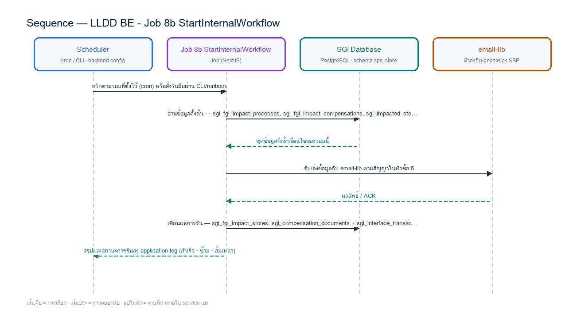

# LLDD BE - Job 8b StartInternalWorkflow

SBP Mall - ระบบประกันรายได้ | Low Level Design Document

## 1. Overview

| รายการ | รายละเอียด |
| --- | --- |
| Track | BE |
| Estimate | **28 ชั่วโมง** = implementation 21 + unit test 7 (30%) |
| Owner | Aphiwit &lt;Bank&gt; Khammoon |
| Target repository | **`SBP/srm-sps-spsap-sop-sgi-batch`** (NestJS 11 + TypeORM · schema `sps_store` · **มติ 2026-09-02 — ย้ายมาจาก store-backend**) — batch runner ของ SBP ที่รันอยู่แล้ว 42 job บน **AWS Batch** · ลงทะเบียน job ใน `src/main.ts` แล้วรับ argument ผ่าน `JOB_NAME`/`INPUT` (local) หรือ `argv[3]`/`argv[2]` (AWS Batch) · **ไม่ผ่าน BFF และไม่เปิด HTTP** · ตารางเวลาเป็น AWS Batch scheduled event ไม่ใช่ `@Cron` · ดู `SBP/srm-sps-spsap-sop-sgi-batch.md` |
| Objective | เปิด Workflow ภายใน: คัดรายการที่ผ่าน Gen Flow Gate แล้วเรียก Workflow Engine ภายในผ่าน POST /api/v1/sgi/workflow/instances แทน K2 REST StartInstance; เกณฑ์ W/Y/N เดิมยังคงใช้สำหรับ reconcile |

Common contract reference: ทุกหัวข้อ API/FE ต้องยึด LLDD-BE-API-Common-Contracts และ LLDD-FE-Integration-Contracts สำหรับ error/auth/format/pagination/action/RBAC ก่อนลงรายละเอียดเฉพาะหน้าหรือเฉพาะ endpoint

### 1.1 เอกสาร LLDD ที่เกี่ยวข้อง

ตารางนี้สร้างจาก endpoint และตารางที่เอกสารฉบับนี้ประกาศไว้จริง — อ่านฉบับที่อยู่ในตารางก่อนลงมือ เพื่อไม่ให้สัญญา request/response หรือชื่อคอลัมน์หลุดจากกัน

| ความสัมพันธ์ | เอกสาร LLDD | เกี่ยวข้องตรงไหน |
| --- | --- | --- |
| สัญญากลาง | **LLDD-BE-API-Common-Contracts** | envelope `{success,data}` · error code · pagination · รูปแบบวันที่/เลขเอกสาร |
| โครงสร้างข้อมูล | **LLDD-BE-Database-Structure** | DDL ของตารางที่หัวข้อ Reference DB Mapping อ้างถึง |
| แพลตฟอร์มระบบเดิม | **LLDD-BE-Integration-SBP-Platform** | header จาก BFF (`x-api-key` / `x-user-*`) · การ reuse ตารางและ service ของระบบ SBP เดิม |
| ต้องจบก่อน (ลำดับงาน) | **LLDD-BE-API-Common-Contracts** | เป็นฉบับต้นทางของสัญญา/โครงที่ฉบับนี้อ้าง |
| ต้องจบก่อน (ลำดับงาน) | **LLDD-BE-Job-5-ImportImpactSaleFromIAS** | เป็นฉบับต้นทางของสัญญา/โครงที่ฉบับนี้อ้าง |
| ต้องจบก่อน (ลำดับงาน) | **LLDD-BE-Job-8-CreateCompensationDocument** | เป็นฉบับต้นทางของสัญญา/โครงที่ฉบับนี้อ้าง |

## 2. Screen / Functional Scope

- Main class/script: workflow.service.startFromImpact / (internal scheduler / service token)
- Phase: D
- Output: sps_store.workflow_transaction / workflow_approver ของ @srm/glb-workflow (ไม่ใช่ตารางของ SGI)
- Estimate: 21 ชั่วโมง
- Argument รับผ่าน `INPUT` (JSON) — local ใช้ env `JOB_NAME`/`INPUT` · AWS Batch ใช้ `argv[3]`/`argv[2]` · ดูหัวข้อ 5.95 · ไม่มีตาราง job_configs และไม่มีหน้าจอควบคุม (หน้า Flow Batch Job ในกลุ่มเมนู Flow เหลือแค่ Flowchart + Database ที่ใช้ · 2026-08-06)
- ตารางเวลาตั้งที่ **AWS Batch scheduled event** (repo ไม่มี `@Cron`) — **ยกเว้น job ที่เป็น event-driven (ดูหัวข้อ Config Schema ของ job นั้น) ซึ่งห้ามตั้ง schedule** · ทุก job ถูกบันทึกลง `integration_log` โดย `main.ts` อัตโนมัติ + structured log `BATCH_START`/`BATCH_END` พร้อม `runId`
- Depends on LLDD-BE-API-Workflow-Instances; Job 8b เรียก Workflow Engine ภายในและไม่ duplicate Gen Flow Gate logic

## 3. Screenshot Reference

ไม่มีภาพหน้าจอสำหรับหัวข้อนี้ — เป็นเอกสารฝั่ง Backend/Batch ที่ไม่มี UI (ภาพหน้าจอทั้งหมดอยู่ในเอกสารชุด FE)

## 4. Implementation Flow & Sequence Diagram (Reference)

### 4.1 Implementation Flow (ลำดับขั้นการทำงาน)


_รูปที่ 1: Implementation flow reference: LLDD BE - Job 8b StartInternalWorkflow_

### 4.2 Sequence Diagram (ใครคุยกับใคร ลำดับไหน)

ผู้แสดงและลำดับข้อความในภาพนี้สร้างจาก endpoint ในหัวข้อ 7 และตารางในหัวข้อ Reference DB Mapping ของเอกสารฉบับนี้เอง จึงตรงกับสัญญาเสมอ



_รูปที่ 2: Sequence diagram: LLDD BE - Job 8b StartInternalWorkflow_

## 5. Field, Format, and Validation

| Field / UI | Format | Validation | Behavior |
| --- | --- | --- | --- |
| Scheduler | หลัง Job 8 สร้างเอกสารสำเร็จ; manual rerun ตาม period | แก้ไขได้ | แยกเพื่อ rerun ได้อิสระ; Operations ตรวจ deployment schedule/queue เท่านั้น |
| Workflow API | POST /api/v1/sgi/workflow/instances | ค่าคงที่/แก้ผ่านหน้าจอไม่ได้ | internal service token; ไม่ใช่ K2 REST |
| เกณฑ์ Growth Rate | growth_rate_diff <= -10 | ค่าคงที่/แก้ผ่านหน้าจอไม่ได้ | คง business rule เดิม |
| Branch Type ผ่าน Gate | FAM, FB1, FC1, FB2, FVB, FVC | ค่าคงที่/แก้ผ่านหน้าจอไม่ได้ | นอกเซ็ตหรือระยะทางเกินเกณฑ์ให้ตั้ง N |
| เงื่อนไข Gate อื่น | workflow_generation_status=W · DV ไม่ว่าง · juristic ต่างกัน · sales_status in {Y,N} | ค่าคงที่/แก้ผ่านหน้าจอไม่ได้ | DV หาย, นิติบุคคลเดียวกัน หรือ growth ไม่ถึงเกณฑ์เป็น N; distance/juristic/growth/sales status ที่ยังไม่มีค่าเท่านั้นจึงคง W |

## 4a. จุดเข้า flow ตามประเภทเคส — Job 8b เป็นคนตัดสินว่าเปิด workflow ที่ state ไหน

ผัง To-Be 12/02/2026 กำหนดว่า **เอกสารไม่ได้เริ่มที่ state 06 เสมอไป** · Job 8b ต้องอ่านข้อมูลรอบชดเชย (คอลัมน์ที่รับเข้าโครง 2026-08-21 · gap F8) แล้วเลือก state เริ่มต้นก่อนส่งให้ `POST /sgi/workflow/instances` (job ไม่เรียก lib เอง · มติ 2026-09-09)

**การตัดสินมี 2 ชั้น (มติ 2026-09-02)** — ชั้นที่ 1 คือ *ประเภทเคส* ซึ่งมีแค่ 2 ทาง (① เปิดเรื่องใหม่ / ② ต่อเนื่อง) · ชั้นที่ 2 ตัดสินเฉพาะเคส ② ด้วยเงื่อนไขเดียวคือ `ยอดชดเชย > 0 OR ยอด 0 ติดกัน <= 3 เดือน`

| ชั้นที่ 1 · ประเภทเคส | ชั้นที่ 2 · ยอดชดเชย | เงื่อนไขที่ Job 8b ต้องอ่าน | เปิด workflow ที่ state | ผู้รับผิดชอบขั้นแรก |
| --- | --- | --- | --- | --- |
| ① เปิดเรื่องใหม่ | - ไม่ต้องตัดสินต่อ | sgi_fgi_impact_processes.last_compensate_seq_no = 1 | **06** | group ฝ่าย SBP DSA (ปกติ) |
| ② ต่อเนื่อง (last_compensate_seq_no > 1 และ flag_action = 'Y') | **ใช่** — ยอด > 0 หรือ ยอด 0 ติดกัน <= 3 เดือน | COALESCE(adjust_amount, forecast_amount) > 0 หรือ = 0 ใน sgi_fgi_impact_compensations งวดที่ 1-3 | **08** (Auto Approve — ข้ามขั้น 06 · มติ 2026-09-01 เคสยอด 0 เดิม 01) | **เจ้าหน้าที่ SBP DSA คนเดิม** — job ส่งรหัสผู้รับผิดชอบไปกับ request แล้ว BE เป็นผู้ผูกให้ engine |
| ② ต่อเนื่อง (ต่อ) | **ไม่ใช่** — ยอด 0 ติดกัน > 3 เดือน (เดือนที่ 4) | COALESCE(adjust_amount, forecast_amount) = 0 งวดที่ 4 ขึ้นไป | **ไม่เปิด workflow** — ปิดเอกสารเป็นเสร็จสิ้น (หยุดชดเชยประกันรายได้) | - |

**ที่มาของค่าที่ใช้ตัดสิน** — ทุกค่าอยู่ในโซน A (FGI/FCS) ที่ batch เขียนไว้ก่อนเปิดเอกสาร ไม่ใช่ค่าที่ Job 8b คำนวณเอง

| ค่าที่ใช้ในเงื่อนไข | ระบบเดิม (Oracle FCS_FRN) | ตาราง SGI | คอลัมน์ · ชนิด | เขียนโดย |
| --- | --- | --- | --- | --- |
| `LAST_COMPENSATE_SEQ_NO` | `FGI_IMPACT_STORE_ON_PROCESS.LAST_COMPENSATE_SEQ_NO` | `sgi_fgi_impact_processes` | `last_compensate_seq_no` · INTEGER | Job 2 — `ImportJdbc` (`SEQ_NO + 1` เมื่อเป็นรอบต่อเนื่อง) |
| `FLAG_ACTION` | `FGI_IMPACT_STORE_ON_PROCESS.FLAG_ACTION` (โดเมน Y/W/N) | `sgi_fgi_impact_processes` | `flag_action` · CHAR(1) | Job 2 เขียน `'Y'` · Job 6 ปิดรอบ `Y->N` / พัก `Y->W` |
| `DATASOURCE` | `FGI_IMPACT_STORE_ON_PROCESS.DATASOURCE` (เดิมมี ALM/STA/HRS) | `sgi_fgi_impact_processes` | `datasource` · VARCHAR(5) | Job 2/3 = `ALM` · Job 5 = `STA` · **`PRO` เชิงรุก / `REA` เชิงรับ = คนคีย์** (รหัสใหม่ 2026-08-24) |
| `forecast` | `FGI_IMPACT_STORE_COMPENSATE.COMPENSATE_FORECAST` | `sgi_fgi_impact_compensations` | `forecast_amount` · NUMERIC(14,2) | Job 5 — นำเข้ายอดจาก IAS/MIS |
| `adjust` | `FGI_IMPACT_STORE_COMPENSATE.COMPENSATE_ADJUST` | `sgi_fgi_impact_compensations` | `adjust_amount` · NUMERIC(14,2) | เจ้าหน้าที่ SBP DSA ปรับยอดในเอกสาร |

> ยอดที่ใช้จริงทุกที่คือ `COALESCE(adjust_amount, forecast_amount)` — ค่าที่คนปรับชนะค่าที่ระบบคำนวณเสมอ  
> `datasource` ไม่ได้เปลี่ยน state เริ่มต้นของ workflow — มันบอกแค่ว่า **ใครคีย์ข้อมูล** (`ALM`/`STA` = ระบบส่งงานมาให้เลือก · `PRO`/`REA` = เจ้าของงานคีย์เอง · SDD GI สไลด์ 17 · 47 · 49)  
> ⚠️ ทั้งสองตารางเป็น gap **F8/F1** ที่เพิ่งรับเข้าโครงเมื่อ 2026-08-21 — ต้อง migrate ครบก่อน Job 8b จึงทำงานตามผัง To-Be ได้

```sql
-- bind ตามลำดับ: $1=impactProcessId
-- ตัดสินประเภทเคสก่อนเปิด workflow (Job 8b)
SELECT p.last_compensate_seq_no,
       p.flag_action,
       (SELECT COUNT(*) FROM sgi_fgi_impact_compensations c
         WHERE c.impact_process_id = p.id
           AND COALESCE(c.adjust_amount, c.forecast_amount) = 0
           AND c.compensate_seq = p.last_compensate_seq) AS zero_months
FROM sgi_fgi_impact_processes p
WHERE p.id = $1 /* impactProcessId */;
-- มติ 2026-09-01 — เคสต่อเนื่องเข้า state 08 ทั้งยอด > 0 และยอด 0 (<= 3 เดือน) · ไม่มีป้ายกำกับบนหน้าจอ
-- zero_months >= 4            -> ไม่เปิด workflow · ปิดเอกสารเป็น 99 พร้อม result = หยุดชดเชยประกันรายได้
-- zero_months BETWEEN 1 AND 3 -> state 08 + approver = เจ้าหน้าที่คนเดิม (เดิมเข้า state 01)
-- seq_no > 1 AND flag_action='Y' AND ยอด > 0 -> state 08 + approver = เจ้าหน้าที่คนเดิม
-- นอกนั้น                      -> state 06 ตามปกติ
```

**ทุกเส้นทางอัตโนมัติต้องบันทึกลง `sgi_consideration_logs` ด้วยผู้ดำเนินการ `SYSTEM`** เพื่อไม่ให้ timeline ของเอกสารขาดช่วง · รายละเอียดกติกาเต็มดู `workflow.md` หัวข้อจุดเข้า flow ตามประเภทเคส

## 4b. ข้อกำหนดการต่อกับ workflow ที่ Job 8b ต้องทำตาม

🔴 **มติ 2026-09-09 — job ไม่เรียก `@srm/glb-workflow` เอง** · workflow lib ใช้กับ **flow K2 (เอกสาร/การอนุมัติ) เท่านั้น** · Job 8b จึงเรียก REST ของ BE ด้วย service token:
`POST /api/v1/sgi/workflow/instances` body `{impactProcessId, sourceJobNo: '8b', requestId}` · ฝั่ง BE (`LLDD-BE-API-Workflow-Instances`) เป็น**ผู้เรียก engine ที่เดียวในระบบ** และเป็นผู้แปลง `impactProcessId` เป็น `referenceId = sgi_compensation_documents.id` ให้เอง

**สิ่งที่ job ยังต้องรู้:** เกณฑ์ Gen Flow Gate (W/Y/N) และ **state เริ่มต้นที่ต้องการ** (`06` เปิดเรื่องใหม่ / `08` ต่อเนื่อง) เพราะเป็นกติกาธุรกิจของ job — ส่งไปกับ request แล้วให้ BE เป็นผู้แปลงเป็นการเรียก engine · **สิ่งที่ job ไม่ต้องรู้แล้ว:** ชื่อ function ของ lib · `versionId` · `referenceId` · ลำดับการเรียก engine ทั้งหมด

| เรื่อง | ข้อเท็จจริงที่ตรวจจากฐานจริง | ผลต่อ Job 8b | ข้อกำหนดที่ต้องทำตาม |
| --- | --- | --- | --- |
| `referenceId` ที่ส่งเข้า workflow | ระบบเดิม (cooperation-request · inform-evaluate) ใช้ surrogate id ทุกจุด | ค่าที่ส่งเข้า initialize และคีย์ที่ใช้เช็คซ้ำเปลี่ยนตามข้อนี้ | ส่ง `sgi_compensation_documents.id` (surrogate) เป็น string ทุกครั้ง — ห้ามส่ง `doc_no` (ยืนยัน 2026-08-17) |
| `sps_store.workflow_transaction` ไม่มี PK/index | 19,283 แถว · ไม่มีทั้ง PK และ index (`SBP/db-schema-sps_store.md`) ต่างจาก `sps_auth` ที่มี PK ปกติ | กันซ้ำด้วย DB constraint ไม่ได้ ต้องกันที่ application · query ตาม reference_id เป็น seq-scan | **ห้ามแก้ schema ของ library** — กันซ้ำระดับ application ก่อนเรียก initialize และประเมินต้นทุน query ที่อ้างตารางนี้ทุกครั้ง |
| schema ของ engine | engine ตัวจริงมี **13 ตาราง** อยู่ใน schema **`sps_store`** — `sps_auth` มีชื่อตารางชุดเดียวกันแต่เป็นสำเนาของ auth-backend คนละเวอร์ชัน | ทุก SQL ในเอกสารนี้ต้อง prefix `sps_store.` | ทุก SQL ต้องเขียน `sps_store.` นำหน้าเสมอ ห้ามชี้ `sps_auth` |

### 5.9 Input / Progress / Output Contract

| Stage | Contract for implementation |
| --- | --- |
| Input | Impact-store rows waiting to start workflow plus generated workflow/document identifiers. |
| Progress | select waiting rows, start workflow instance, update generated-flow flag per transaction, log success/failure. |
| Output | Workflow instances started and source rows marked generated; failed rows remain rerunnable with error detail. |

### 5.90 Job 8b Execution Stages

select waiting rows, start workflow instance, update generated-flow flag per transaction, log success/failure.

| Order | Service step | Repository | Output / failure contract |
| --- | --- | --- | --- |
| 1 | lockWorkflowCandidates | workflowRepository | คืน metrics และ throw typed error; transaction/rerun ใช้ contract ด้านล่าง |
| 2 | evaluateGenerationGate | workflowRepository | คืน metrics และ throw typed error; transaction/rerun ใช้ contract ด้านล่าง |
| 3 | startInternalWorkflows | workflowRepository | คืน metrics และ throw typed error; transaction/rerun ใช้ contract ด้านล่าง |
| 4 | notifyWorkflowOwners | workflowRepository | คืน metrics และ throw typed error; transaction/rerun ใช้ contract ด้านล่าง |

### 5.91 Job 8b Run Evidence

| Evidence | Job-specific value | Acceptance |
| --- | --- | --- |
| Input identity | Impact-store rows waiting to start workflow plus generated workflow/document identifiers. | snapshot input file/business key/period in run record |
| Output identity | Workflow instances started and source rows marked generated; failed rows remain rerunnable with error detail. | reconcile input, success, reject and skipped counts |
| Dedup proof | กันซ้ำระดับ application — ตรวจว่ามี transaction เดิมของ reference นี้อยู่แล้วหรือไม่ ก่อนเรียก initialize แล้ว skip · ⚠️ **ไม่มี UNIQUE(version_id, reference_id) จริงใน `sps_store.workflow_transaction`** (ตารางนี้ไม่มีทั้ง PK และ index ทั้งที่มี 19,283 แถว — ตรวจแล้วที่ `SBP/db-schema-sps_store.md`) จึงพึ่ง constraint ฝั่ง DB ไม่ได้ และ query ตาม reference_id เป็น seq-scan · **ห้ามแก้ schema ของ library** — กันซ้ำที่ระดับ application และประเมินต้นทุน query ทุกครั้งที่อ้างตารางนี้ | rerun fixture produces no duplicate target business key |
| Transaction proof | lock process + evaluate gate + branch N/W/Y; เฉพาะ Y จึงเรียก `POST /sgi/workflow/instances` ของ BE (job ไม่เรียก lib เอง · มติ 2026-09-09) (ชื่อ function ตามชีต Detail ของ LLDD lib) และ W→Y ใน transaction เดียว, N ต้อง persist ถาวร, W คงเดิมเพื่อ rerun | injected failure leaves no partial committed state outside documented boundary |
| Security proof | internal service token จาก workload identity/secretRef; ห้าม Basic Auth หรือ K2 REST credential เดิม | config/log/error contains no plaintext secret |

### 5.92 Legacy Java Source Reference

| Legacy file | Line range | Responsibility to carry forward |
| --- | --- | --- |
| fcsJar/src/th/co/gosoft/fgi/main/StartK2WorkFlow.java | 16-51 | Legacy main entrypoint for starting K2 workflow. |
| fcsJar/src/th/co/gosoft/fgi/dao/jdbc/StartFlowJdbc.java | 17-173 | Select rows for workflow start and update generated-flow flags. |

Line ranges refer to the legacy Java implementation under /Users/bank_mac/gosoft/java/SBP/fcsJar. Use these ranges to preserve business behavior while implementing the target Node job.

### 5.93 Target Repository and SQL Contract

| Contract | Target implementation |
| --- | --- |
| Repository | workflowRepository |
| Idempotency / dedup | กันซ้ำระดับ application — ตรวจว่ามี transaction เดิมของ reference นี้อยู่แล้วหรือไม่ ก่อนเรียก initialize แล้ว skip · ⚠️ **ไม่มี UNIQUE(version_id, reference_id) จริงใน `sps_store.workflow_transaction`** (ตารางนี้ไม่มีทั้ง PK และ index ทั้งที่มี 19,283 แถว — ตรวจแล้วที่ `SBP/db-schema-sps_store.md`) จึงพึ่ง constraint ฝั่ง DB ไม่ได้ และ query ตาม reference_id เป็น seq-scan · **ห้ามแก้ schema ของ library** — กันซ้ำที่ระดับ application และประเมินต้นทุน query ทุกครั้งที่อ้างตารางนี้ |
| Transaction boundary | lock process + evaluate gate + branch N/W/Y; เฉพาะ Y จึงเรียก `POST /sgi/workflow/instances` ของ BE (job ไม่เรียก lib เอง · มติ 2026-09-09) (ชื่อ function ตามชีต Detail ของ LLDD lib) และ W→Y ใน transaction เดียว, N ต้อง persist ถาวร, W คงเดิมเพื่อ rerun |
| Security | internal service token จาก workload identity/secretRef; ห้าม Basic Auth หรือ K2 REST credential เดิม |

#### Input / candidate query

```sql
-- bind ตามลำดับ: $1=bangkok_metro_region_codes
WITH locked_process AS (
    SELECT p.id
    FROM sgi_fgi_impact_processes p
    JOIN sgi_compensation_documents d ON d.impact_process_id = p.id
    WHERE p.workflow_generation_status = 'W'
      -- ⚠️ sps_store.workflow_transaction ไม่มี PK/index (19,283 แถว) → เงื่อนไขนี้เป็น seq-scan · ประเมินต้นทุน query ก่อนใช้ และห้ามแก้ schema ของ library
      -- ✅ DP-1 ปิดแล้ว: reference_id = sgi_compensation_documents.id (surrogate) แปลงเป็น text
      AND NOT EXISTS (SELECT 1 FROM sps_store.workflow_transaction w WHERE w.reference_id = d.id::text   -- DP-1 = surrogate id (reference_id เป็น varchar(255)) AND w.version_id = :sgi_version_id)   -- @srm/glb-workflow
    ORDER BY p.id
    FOR UPDATE OF p SKIP LOCKED
), gate AS (
    SELECT p.id AS impact_process_id, d.doc_no, d.current_section_code,
           CASE
             WHEN BOOL_OR(ns.store_type IS NULL OR ns.store_type NOT IN ('FAM','FB1','FC1','FB2','FVB','FVC')) THEN 'N'
             WHEN BOOL_OR(pair.distance_km > CASE
                    WHEN impacted.zone_cd = ANY($1 /* bangkok_metro_region_codes */) THEN 1.000
                    ELSE 2.000
                  END) THEN 'N'
             WHEN BOOL_OR(pair.distance_km IS NULL) THEN 'W'
             WHEN ist.opt_dv_user_id IS NULL OR BTRIM(ist.opt_dv_user_id) = '' THEN 'N'
             WHEN ij.juristic_name IS NULL OR BOOL_OR(nj.juristic_name IS NULL) THEN 'W'
             WHEN BOOL_OR(ij.juristic_name = nj.juristic_name) THEN 'N'
             WHEN ss.growth_rate_diff IS NULL THEN 'W'
             WHEN ss.growth_rate_diff > -10 THEN 'N'
             WHEN ss.sales_status IS NULL OR ss.sales_status NOT IN ('Y','N') THEN 'W'
             ELSE 'Y'
           END AS gate_decision
    FROM locked_process lp
    JOIN sgi_fgi_impact_processes p ON p.id = lp.id
    JOIN sgi_compensation_documents d ON d.impact_process_id = p.id
    JOIN sgi_impacted_stores ist ON ist.store_code = p.impacted_store_code
    JOIN store impacted ON impacted.store_id = p.impacted_store_code
    JOIN sgi_fgi_impact_stores pair ON pair.impact_process_id = p.id
    JOIN store ns ON ns.store_id = pair.new_store_code
    -- นิติบุคคลไม่ได้อยู่บน store — ต้องผ่าน fr_store.juristic_id -> juristic.juristic_name
    LEFT JOIN fr_store ifs ON ifs.store_id = impacted.store_id
    LEFT JOIN juristic ij  ON ij.juristic_id = ifs.juristic_id
    LEFT JOIN fr_store nfs ON nfs.store_id = ns.store_id
    LEFT JOIN juristic nj  ON nj.juristic_id = nfs.juristic_id
    LEFT JOIN sgi_fgi_impact_sales_summaries ss ON ss.impact_process_id = p.id
    GROUP BY p.id, d.doc_no, d.current_section_code, ist.opt_dv_user_id,
             ij.juristic_name, ss.growth_rate_diff, ss.sales_status
)
SELECT * FROM gate;
```

#### Write / upsert query

```sql
-- bind ตามลำดับ: $1=impact_process_id · $2=gate_decision
UPDATE sgi_fgi_impact_processes
SET workflow_generation_status = 'N', updated_at = CURRENT_TIMESTAMP
WHERE id = $1 /* impact_process_id */
  AND workflow_generation_status = 'W'
  AND $2 /* gate_decision */ = 'N';

-- gate_decision='Y': เปิด workflow
-- 🔴 มติ 2026-09-09 — **job ไม่เรียก @srm/glb-workflow เอง**
--    workflow lib ใช้กับ flow K2 (เอกสาร/การอนุมัติ) เท่านั้น
--    Job 8b เรียก REST ของ BE ด้วย service token แทน:
--        POST /api/v1/sgi/workflow/instances
--        body: { impactProcessId, sourceJobNo: '8b', requestId: 'job8b-<id>-<YYYYMM>' }
--    ฝั่ง BE (LLDD-BE-API-Workflow-Instances) เป็นผู้เรียก engine ที่เดียวในระบบ
--    → job ไม่ต้องรู้จัก versionId / referenceId / stateId / ชื่อ function ของ lib เลย
--    → requestId เป็น idempotency key: ยิงซ้ำด้วยค่าเดิมต้องไม่เปิด workflow ที่สอง
-- ✅ DP-1 (2026-08-17): referenceId = sgi_compensation_documents.id — **BE เป็นผู้ส่งให้ engine**
UPDATE sgi_fgi_impact_processes
SET workflow_generation_status = 'Y', updated_at = CURRENT_TIMESTAMP
WHERE id = $1 /* impact_process_id */
  AND workflow_generation_status = 'W'
  AND $2 /* gate_decision */ = 'Y';

-- gate_decision='W' ไม่เปลี่ยนสถานะ; บันทึก reason ลง application log (structured) เพื่อ rerun — ไม่มีตาราง job_run_histories แล้ว (2026-08-06).
```

### 5.94 Target Node Implementation

โครงสร้างนี้ระบุ service/repository เฉพาะงานและต้อง implement ตาม SQL, transaction, idempotency และ security contract ด้านบน โดยทุกขั้นต้องคืน metrics สำหรับ reconcile และ run history

```js
export async function runLlddBeJob8BStartinternalworkflow(ctx, services) {
  const run = await services.jobRuns.acquire({
    jobNo: "8b", period: ctx.period, triggeredBy: ctx.triggeredBy
  });

  try {
    ctx = { ...ctx, runId: run.id, repository: services.workflowRepository };
    const step1 = await services.lockWorkflowCandidates(ctx, undefined);
    const step2 = await services.evaluateGenerationGate(ctx, step1);
    const step3 = await services.startInternalWorkflows(ctx, step2);
    const step4 = await services.notifyWorkflowOwners(ctx, step3);
    const result = step4;
    await services.jobRuns.finish(run.id, "SUCCESS", result.metrics);
    return { runId: run.id, status: "SUCCESS", ...result };
  } catch (error) {
    await services.jobRuns.finish(run.id, "FAILED", {
      errorCode: error.code ?? "JOB_FAILED",
      errorMessage: error.message
    });
    throw error;
  }
}
```

### 5.95 การลงทะเบียน job และ Arguments (sop-sgi-batch)

งานนี้ลงทะเบียนเป็น job ชื่อ **`sgi-start-internal-workflow`** ใน `src/main.ts` ของ `SBP/srm-sps-spsap-sop-sgi-batch` โดยใช้ dispatcher เดิมของ repo (ไม่สร้าง runner ใหม่) — `main.ts` อ่านชื่อ job และ input มา 2 ทาง แล้วเลือกอัตโนมัติจากการมี `argv[3]` หรือไม่

| ช่องทางรัน | ชื่อ job มาจาก | input มาจาก | ตัวอย่าง |
| --- | --- | --- | --- |
| Local / CLI / runbook | env `JOB_NAME` | env `INPUT` (JSON string) | `JOB_NAME=sgi-start-internal-workflow INPUT='{"docNos":["2026/00123"]}' npm run start` |
| AWS Batch (ตารางเวลาจริง) | `process.argv[3]` | `process.argv[2]` (JSON string) | `node dist/main.js '{"docNos":["2026/00123"]}' sgi-start-internal-workflow` |

**ตารางเวลาไม่ได้อยู่ในโค้ด** — repo นี้ไม่มี `@Cron`/`@Interval` แม้แต่จุดเดียว (แม้ติดตั้ง `@nestjs/schedule` ไว้) cron ในหัวข้อ 5 เป็น **นิยามของ AWS Batch scheduled event** ที่ต้องตั้งตอน deploy ไม่ใช่ค่าที่อ่านจาก config file

#### Argument ที่รับได้ (`INPUT` เป็น JSON object · ไม่ส่ง = `{}`)

**ระบบเดิมรับ argument แบบนี้:** **ไม่รับ args** (`StartK2WorkFlow.main`)  
ของใหม่เปลี่ยนจาก positional string เป็น JSON เพื่อให้เพิ่มฟิลด์ได้โดยไม่พังของเดิม แต่ **ต้องรองรับทุกอย่างที่ระบบเดิมรับได้เป็นอย่างน้อย** — ห้ามลดความสามารถลง

| Field | ชนิด | ไม่ส่งแล้วได้อะไร (default) | Validation | ตรงกับ argument เดิม |
| --- | --- | --- | --- | --- |
| `docNos` | string[] | `null` = ทุกเอกสารที่ยังไม่มี workflow | `YYYY/xxxxx` | **ของใหม่** |
| `impactMonth` | string | `null` | `YYYY-MM` | **ของใหม่** |
| `dryRun` | boolean | `false` | `true` = อ่าน/คำนวณครบแต่ไม่ commit และไม่ publish/ไม่ส่งไฟล์ | **ของกลาง** ทุก job |
| `limit` | number | `null` | จำกัดจำนวนรายการที่ประมวลผลรอบนี้ (ใช้ตอน smoke test) | **ของกลาง** ทุก job |

**กติกาการ validate ที่ทุก job ต้องทำเหมือนกัน** — parse `INPUT` ไม่สำเร็จ หรือฟิลด์ไม่ผ่าน validation ให้ log `BATCH_END` ด้วย `batchStatus: 'FAILED'` แล้ว `exit(1)` **ก่อนแตะฐานข้อมูล** (ห้าม fallback ไปค่า default เงียบ ๆ เมื่อผู้ใช้ตั้งใจส่งค่ามาแล้วผิด) · ฟิลด์ที่ไม่รู้จักให้ log warn แล้วข้าม ไม่ทำให้ job ล้ม

- รันซ้ำบนเอกสารเดิมต้องไม่เปิด workflow ซ้ำ — ตรวจ `sps_store.workflow_transaction` ด้วย `reference_id` + `version_id` ก่อนเสมอ

### 5.96 เงื่อนไขตัดสิน (Decision Rules) — ตัดสินจากอะไร

เงื่อนไขตัดสินของ Job 8b คือ **จุดเข้า flow 2 ชั้น** ในหัวข้อ 4a ของเอกสารฉบับนี้ — ตารางนี้สรุปเฉพาะ "ตัดสินจากคอลัมน์ไหน" เพื่อให้เขียนโค้ดได้โดยไม่ต้องเลื่อนกลับไปอ่าน

| คำถามที่โค้ดต้องตอบ | ตัดสินจาก (ตาราง · คอลัมน์) | เงื่อนไขที่ต้องเป็นจริง | ไม่เข้าเงื่อนไขแล้วทำอะไร |
| --- | --- | --- | --- |
| ชั้นที่ 1 — เปิดเรื่องใหม่ หรือ ต่อเนื่อง | `sgi_fgi_impact_processes.last_compensate_seq_no` · `.flag_action` | `last_compensate_seq_no = 1` → **① เปิดเรื่องใหม่** · `> 1` **และ** `flag_action = 'Y'` → **② ต่อเนื่อง** | ① เปิด workflow ที่ state `06` · ② ไปตัดสินชั้นที่ 2 ต่อ |
| ชั้นที่ 2 — (เฉพาะเคส ②) ยอดชดเชยผ่านเกณฑ์หรือไม่ | `sgi_fgi_impact_compensations.adjust_amount` · `.forecast_amount` · `.compensate_seq` · `.compensate_seq_no` | ยอดที่ใช้ = `COALESCE(adjust_amount, forecast_amount)` · **ผ่าน** เมื่อ ยอด > 0 **หรือ** ยอด = 0 ติดกันงวดที่ 1-3 · **ไม่ผ่าน** เมื่อ ยอด = 0 ติดกันงวดที่ 4 ขึ้นไป | ผ่าน → Auto Approve เปิด workflow ที่ state `08` (ข้ามขั้น 06) · ไม่ผ่าน → **ไม่เปิด workflow** ปิดเอกสารเป็น `99` ผลการพิจารณา "หยุดชดเชยประกันรายได้" |
| เอกสารนี้เปิด workflow ไปแล้วหรือยัง | `sps_store.workflow_transaction.reference_id` · `.version_id` | มีแถวที่ `reference_id = sgi_compensation_documents.id::text` **และ** `version_id = :sgi_version_id` = เปิดไปแล้ว | เปิดแล้ว = **skip** ไม่เรียก `initializeWorkflow` ซ้ำ (นับเป็น `skipped`) — กลไกกัน rerun ซ้ำหลักของ job นี้ |
| ใครเป็นผู้รับผิดชอบขั้นแรกของเคสต่อเนื่อง | `sgi_consideration_logs.consider_by` ของเอกสารรอบก่อนหน้าของร้านเดียวกัน | หาแถวล่าสุดที่ `section_code` = ขั้นที่จะมอบหมาย ของเอกสารรอบก่อน → `consider_by` | หาไม่เจอ → ปล่อยให้ engine ใช้ group ปกติ (**ห้ามล้ม job**) · เจอ → ผูกด้วย `addPreApprover(...)` |
| ทุกเส้นทางอัตโนมัติต้องทิ้งร่องรอย | `sgi_consideration_logs` | ทั้งเส้นทาง ① ② และเส้นทางหยุดชดเชย ต้อง insert แถวด้วยผู้ดำเนินการ `SYSTEM` | ไม่บันทึก = timeline ของเอกสารขาดช่วง และ resolve เจ้าของงานรอบถัดไปไม่ได้ |

#### ค่าคงที่และโดเมนที่ใช้ในเงื่อนไขข้างบน

ทุกค่าในตารางนี้ต้องอ่านจาก config/env ไม่ hardcode ในคิวรี — แต่ **ค่าตั้งต้นต้องเท่าระบบเดิมทุกตัว** ไม่งั้นผลลัพธ์จะไม่ตรงกันตอนเทียบ UAT

| ค่า | โดเมน / ค่าที่ระบบเดิมใช้ | ที่มา |
| --- | --- | --- |
| `flag_action` | `Y` = รอบเปิดอยู่ · `W` = พักรอตรวจ · `N` = ปิดรอบแล้ว | `CHECK` ใน DDL (`IN ('Y','W','N')`) |
| `requestId` ที่ job ส่งให้ BE | `job8b-{impactProcessId}-{YYYYMM}` (ค.ศ.) | 🔴 มติ 2026-09-09 — job **ไม่รู้จัก `referenceId`** แล้ว เพราะไม่ได้คุยกับ engine เอง · สิ่งที่ job ส่งคือ `impactProcessId` + `requestId` ให้ `POST /sgi/workflow/instances` · การแปลงเป็น `referenceId = sgi_compensation_documents.id` เป็นหน้าที่ของฝั่ง BE |
| state เริ่มต้นที่เป็นไปได้ | `06` หรือ `08` เท่านั้น — **ไม่มี `01`** อีกแล้ว | มติ 2026-09-01 |

## 6. Button / User Action Mapping

| Action | Trigger | API / Service | Expected Result |
| --- | --- | --- | --- |
| รันตามตารางเวลา | CRON | scheduler → runner (job 8b) | อ่าน cron/พารามิเตอร์จาก backend config |
| รันนอกรอบ (manual/rerun) | CLI | CLI/ops runbook → runner (job 8b) | guard ไม่ให้รันซ้อนด้วย distributed lock |
| แก้พารามิเตอร์/เปิด-ปิด job | CONFIG | แก้ backend config แล้ว deploy | ไม่มี endpoint และไม่มีหน้าจอควบคุม — หน้า Flow Batch Job เป็น reference อย่างเดียว (2026-08-06) |
| ตรวจผลการรัน | LOG | application log (structured) | ไม่มีตาราง job_run_histories แล้ว · ผลการรับส่งไฟล์/ข้อความดูที่ sgi_interface_transactions |

## 7. API Contract

**เอกสารฉบับนี้ไม่มี endpoint ของตัวเอง** — เป็นสัญญา/งานภายในที่เอกสารอื่นเรียกใช้ (ดูขอบเขตใน 5.90 Endpoint Implementation Contract) · รายการ endpoint ทั้ง 28 เส้นของ SGI อยู่ที่ **LLDD-API** และ `api.md`

## 8. Reference DB Mapping (No Database Page Work)

ส่วนนี้เป็นข้อมูลอ้างอิงสำหรับการ implement API/Job เท่านั้น ไม่ใช่งานสร้างหน้า Database, ไม่ใช่งานออกแบบ DB page และไม่ถูกนับเป็น deliverable แยกของ FE/BE

| Table / Object | R/W | Usage |
| --- | --- | --- |
| sgi_fgi_impact_processes | R | last_compensate_seq_no + flag_action — ใช้ตัดสินจุดเข้า flow (คอลัมน์กลุ่ม F8) |
| sgi_fgi_impact_compensations | R | COALESCE(adjust_amount, forecast_amount) = 0 กี่งวดติดกัน — เกณฑ์ยอด 0 (ตาราง F1) |
| sgi_impacted_stores | R | opt_dv_user_id สำหรับ group อีเมลราย DV และเงื่อนไข Gate (ต้องไม่ว่าง) |
| sgi_fgi_impact_sales_summaries | R | growth_rate_diff <= -10 และ sales_status ที่ Gen Flow Gate ใช้ตัดสิน (เพิ่ม 2026-09-02 — SQL แตะอยู่แล้วแต่ไม่ได้ประกาศไว้) |
| sgi_fgi_impact_stores | R/W | อ่าน candidate + เขียน W/Y/N |
| sgi_compensation_documents | R/W | ยืนยันเอกสารจาก Job 8 หรือสร้างถ้ายังไม่มีตาม idempotency |
| workflow_transaction (@srm/glb-workflow · sps_store) | W (ผ่าน BE API) | **job ไม่แตะตารางนี้และไม่เรียก lib เอง** (มติ 2026-09-09) — เรียก POST /sgi/workflow/instances แล้ว BE เป็นผู้เรียก initializeWorkflow() |
| workflow_approver (@srm/glb-workflow · sps_store) | W (ผ่าน BE API) | **job ไม่แตะตารางนี้** — BE เป็นผู้เรียก addPreApprover() ให้ · ห้าม insert ตรง |
| (backend config) | R | ผู้รับอีเมลของ batch job — ไม่ใช่ workflow event · เลข template ของ workflow มาจาก workflow_route.email_id |

## 9. Skeleton Code (Batch Job 8b)

### 9.1 ผังไฟล์ที่ต้องสร้าง (Job 8b) — บน `srm-sps-spsap-sop-sgi-batch`

โครงไฟล์ของ Job 8b (workflow.service.startFromImpact เดิม) วางใต้ `src/modules/sgi/` ตาม convention ที่ repo นี้ใช้อยู่จริง (ดูตัวอย่างที่ `src/modules/performance/import-qssi.service.ts`): service ถือ logic ทั้งหมด, inject `DataSource`/repository ผ่าน TypeORM, ยิง raw SQL ได้ตรง, และ **ไม่มี controller** เพราะ repo นี้ไม่เปิด HTTP

**สิ่งที่ reuse ได้ทันที ไม่ต้องเขียนใหม่** — ต่างจากแผนเดิมที่ตั้งไว้บน store-backend ซึ่งต้องสร้าง runner ทั้งชุดเอง: `src/main.ts` (dispatcher + `BATCH_START`/`BATCH_END` + `runId` + log ลง `integration_log` อัตโนมัติ) · `src/modules/rabbitMQ/rabbitmq.service.ts` (`publishMessage`) · `src/shared/services/s3.service.ts` · `StatementService.decodeThaiFileContent()` (WINDOWS-874 auto-detect) · `@gosoft-sbp/email-lib` · `@srm/glb-log`

⚠️ **สิ่งที่ repo นี้ยังไม่มี และเป็นงานตั้งต้นจริง**: (1) ไม่มี `@Cron` เลย — ตารางเวลาต้องตั้งเป็น **AWS Batch scheduled event** (2) ไม่มี distributed lock (`pg_try_advisory_lock`) — การกันรันซ้อนพึ่ง AWS Batch queue ถ้างานไหนรับความเสี่ยงนี้ไม่ได้ต้องเพิ่มเอง (3) `publishMessage` เป็น fire-and-forget **ไม่มี publisher confirm และไม่มี outbox** — งานที่ต้องการ **transactional outbox + publisher confirm** (Job 6 · และ `sgi_reflow` ฝั่ง BE) ต้องสร้างกลไกเพิ่มเอง ไม่ใช่ reuse ได้เลย · ⚠️ ไม่มี ACK ระดับธุรกิจให้รอ (มติ 2026-09-08 ข้อ 2.13) (4) ยังไม่มี entity/ตาราง `sgi_*` แม้แต่ตัวเดียว

| Path | หน้าที่ |
| --- | --- |
| src/modules/sgi/job-8b-start-internal-workflow.service.ts | คลาส `StartInternalWorkflowService` — **`execute(input)` เป็น entry point เดียว** เรียงตาม flow ของ Job 8b ทีละขั้น ครอบ transaction เอง และจบด้วย structured log สรุป metrics (แบบเดียวกับ `ImportQssiService.execute(body)` ที่มีอยู่) |
| src/modules/sgi/job-8b-start-internal-workflow.service.spec.ts | unit test ของ service — repo นี้วาง spec ไว้ข้างไฟล์จริงเสมอ (`jest` + `npm run test:ci` มี coverage/SonarQube) |
| src/modules/sgi/dto/job-8b-start-internal-workflow-input.dto.ts | DTO ของ `INPUT` (JSON) พร้อม `class-validator` ตามตารางในหัวข้อ 9.2 — parse ไม่ผ่านต้อง fail ก่อนแตะ DB |
| src/modules/sgi/sgi.module.ts | NestJS module ของกลุ่มงานประกันรายได้ — ผูก service ทุกตัวของ SGI เข้ากับ `TypeOrmModule` (ไฟล์ร่วมของทุก job ให้ merge ไม่ใช่เขียนทับ) |
| src/main.ts | **เพิ่ม `case 'sgi-job-8b-start-internal-workflow':`** ในสวิตช์เดิม → `await import('./modules/sgi/job-8b-start-internal-workflow.service')` แล้ว `app.get(StartInternalWorkflowService).execute(input)` (ไฟล์กลางของทุก job — เป็นจุด merge conflict ที่ต้องระวัง) |
| src/entities/sgi-*.entity.ts | entity ของตาราง `sgi_*` ที่หัวข้อ Reference DB Mapping อ้างถึง — **ยังไม่มีใน repo เลยสักตัว** ต้องสร้างใหม่ทั้งหมด |
| src/config/config.ts | เพิ่ม `export const sgiJob8BConfig` ตามแบบของไฟล์นี้ (โปรเจกต์ไม่ใช้ `registerAs`) — ค่าคงที่ทางธุรกิจของ Job 8b |

#### การลงทะเบียนใน `src/main.ts` (job `sgi-job-8b-start-internal-workflow`)

```js
// src/main.ts — เพิ่มเคสนี้ในสวิตช์เดิม (เรียงต่อจาก job ของ SGI ตัวก่อนหน้า)
      case 'sgi-job-8b-start-internal-workflow': {
        const { StartInternalWorkflowService } = await import('./modules/sgi/job-8b-start-internal-workflow.service');
        const job8bstartinternalworkflowService = app.get(StartInternalWorkflowService);
        await job8bstartinternalworkflowService.execute(input);   // input = JSON ที่ parse จาก INPUT/argv[2] แล้ว
        break;
      }
```

`main.ts` เรียก `StatementService.logInterfest('sgi-job-8b-start-internal-workflow', input)` ให้อยู่แล้วก่อนเข้าสวิตช์ → **ไม่ต้องเขียน log ลง `integration_log` เองซ้ำ** · และ `BATCH_END` ที่ท้ายไฟล์จะสรุป `batchStatus` + `durationMs` ให้อัตโนมัติ หน้าที่ของ service คือ throw เมื่อทำงานไม่สำเร็จเท่านั้น

### 9.2 Config Schema ของ Job 8b (backend config / env)

ตารางเวลาของ Job 8b คือ `after-job-8` (trigger หลัง Job 8 สร้างเอกสารสำเร็จ; manual rerun ได้ตาม period) — ⚠️ **ตัวจริงตั้งที่ AWS Batch scheduled event ไม่ใช่ในโค้ด** (repo นี้ไม่มี `@Cron` เลย) ค่า `SGI_JOB8B_CRON` เก็บไว้เป็นเอกสารประกอบ/ตรวจสอบเท่านั้น · `SGI_JOB8B_ENABLED=false` ให้ `execute()` จบทันทีแบบ SUCCESS พร้อม log เหตุผล (กันกรณี AWS Batch ยังยิงเข้ามา)

```ts
// src/config/config.ts — เพิ่มบล็อกนี้ต่อท้าย (repo ใช้ export const ไม่ใช้ registerAs)
// convention จริงของ sop-sgi-batch คือ `export const` ใน `src/config/config.ts` (ไม่ใช้ registerAs · ดูของเดิมที่
// `AppConfigModule` แบบ @Global แล้วอ่าน process.env ตรง ๆ) — โปรเจกต์นี้ **ไม่ได้ใช้ registerAs**
// แม้แต่จุดเดียว จึงประกาศเป็นคลาสให้รีวิว/ทดสอบเหมือน config ตัวอื่น
import { Injectable } from '@nestjs/common';

// TODO: Job 8b ไม่มีตาราง job_configs และไม่มี Job Admin API แล้ว (ตัดสินใจ 2026-08-06)
// TODO: ค่าทุกตัวอ่านจาก env/config file ของ backend เท่านั้น — เปลี่ยนค่า = แก้ config แล้ว deploy
export interface Job8BConfig {
  /** เปิด/ปิด job รอบถัดไปโดยไม่ต้อง deploy โค้ด */
  enabled: boolean;
  /** ตารางเวลาของ job นี้ — บันทึกไว้เพื่ออ้างอิงเท่านั้น ตัวจริงตั้งที่ AWS Batch scheduled event */
  cron: string;
  /** Scheduler — แยกเพื่อ rerun ได้อิสระ; Operations ตรวจ deployment schedule/queue เท่านั้น */
  scheduler: string;
  /** Workflow API — internal service token; ไม่ใช่ K2 REST */
  workflowApi: string;
  /** เกณฑ์ Growth Rate — คง business rule เดิม */
  growthRate: string;
  /** Branch Type ผ่าน Gate — นอกเซ็ตหรือระยะทางเกินเกณฑ์ให้ตั้ง N */
  branchTypeGate: string;
  /** เงื่อนไข Gate อื่น — DV หาย, นิติบุคคลเดียวกัน หรือ growth ไม่ถึงเกณฑ์เป็น N; distance/juristic/growth/sales status ที่ยังไม่มีค่าเท่านั้นจึงคง W */
  gate: string;
  /** ผู้รับอีเมลเมื่อ job ล้มเหลว — เก็บเป็น string คั่น comma ให้ตรง signature ของ
      `EmailLibService.sendMail({ mailTo })` ที่รับ string ไม่ใช่ string[] */
  mailTo: string;
}

@Injectable()
export class SgiJob8BConfig implements Job8BConfig {
  // TODO: ยืนยันค่า default ทุกตัวกับ Ops ก่อนขึ้น production (ไม่มีหน้าจอแก้ค่าแล้ว)
  enabled = (process.env.SGI_JOB8B_ENABLED ?? 'true') === 'true';
  cron = process.env.SGI_JOB8B_CRON ?? 'after-job-8';
  scheduler = process.env.SGI_JOB8B_SCHEDULER ?? 'หลัง Job 8 สร้างเอกสารสำเร็จ; manual rerun ตาม period'; // TODO: แก้ผ่าน env/config file แล้ว deploy
  workflowApi = process.env.SGI_JOB8B_WORKFLOW_API ?? 'POST /api/v1/sgi/workflow/instances'; // TODO: ค่าคงที่ทางธุรกิจ — เปลี่ยนต้องผ่านการอนุมัติ
  growthRate = process.env.SGI_JOB8B_GROWTH_RATE ?? 'growth_rate_diff <= -10'; // TODO: ค่าคงที่ทางธุรกิจ — เปลี่ยนต้องผ่านการอนุมัติ
  branchTypeGate = process.env.SGI_JOB8B_BRANCH_TYPE_GATE ?? 'FAM, FB1, FC1, FB2, FVB, FVC'; // TODO: ค่าคงที่ทางธุรกิจ — เปลี่ยนต้องผ่านการอนุมัติ
  gate = process.env.SGI_JOB8B_GATE ?? 'workflow_generation_status=W · DV ไม่ว่าง · juristic ต่างกัน · sales_status in {Y,N}'; // TODO: ค่าคงที่ทางธุรกิจ — เปลี่ยนต้องผ่านการอนุมัติ
  mailTo = process.env.SGI_JOB8B_MAIL_TO ?? ''; // TODO: ผู้รับอีเมลแจ้ง error คั่นด้วย comma (เดิม: อีเมลราย DV ผ่าน email-lib กลาง (sendEmail))
}

// TODO: เพิ่ม SgiJob8BConfig ใน providers/exports ของ AppConfigModule (@Global) เหมือน AppConfig
```

### 9.3 Job Class — `run(ctx)` ของ Job 8b ทีละขั้นตามผัง

#### 9.3.1 สัญญาของชั้นกลาง (`runner.ts`) + โครง service ของ Job 8b

service อ้าง `JobRunContext` / `JobRunResult` / `JobState` / `JobFailedError` — ทั้งหมดนิยาม ครั้งเดียวใน `src/modules/sgi/sgi-job.types.ts` (ไฟล์ร่วมของทุก job ให้ merge ไม่ใช่เขียนทับ) และ service ต้องมี method ครบตามตารางขั้นตอนด้านล่าง มิฉะนั้น `execute(input)` จะเรียก method ที่ไม่มีอยู่

```ts
// src/modules/sgi/sgi-job.types.ts — สัญญากลางของทุก job ของ SGI (ประกาศครั้งเดียว ใช้ร่วมทั้ง 10 ฉบับ)

export interface JobRunContext {
  jobNo: string;
  period: string;        // YYYYMM ของงวดที่รัน
  triggeredBy: string;   // 'CRON' | userId ที่สั่งรันนอกรอบ
  params?: Record<string, string>;
}

export interface JobRunResult {
  event: 'job.finish';
  jobNo: string;
  jobName: string;
  status: 'SUCCESS' | 'SKIPPED' | 'SKIPPED_LOCKED' | 'FAILED';
  period: string;
  output: string;
  read: number; written: number; skipped: number; rejected: number;
  durationMs: number;
}

/** counter + ค่าที่ทุกขั้นของ job ใช้ร่วมกัน (service เป็นผู้สร้างผ่าน createState) */
export interface JobState {
  period: string;
  read: number; written: number; skipped: number; rejected: number;
  // TODO: เพิ่ม field เฉพาะของ job นี้ (เช่น rows ที่อ่านมา, path ไฟล์ที่เขียน)
  [key: string]: unknown;
}

/** error ที่ทำให้ job จบเป็น FAILED และส่งอีเมลแจ้งผู้ดูแล */
export class JobFailedError extends Error {
  constructor(public readonly code: string, message: string) { super(message); }
}

/** ใช้ออกจาก transaction เมื่อสาขา NO บอกให้ข้ามงวด/เรคคอร์ด — runner สรุปเป็น SKIPPED ไม่ใช่ FAILED */
export class JobSkippedError extends Error {}
```

```ts
// StartInternalWorkflowService — method ที่ job class เรียก (1 method ต่อ 1 ขั้นในตารางด้านบน)
import { Inject, Injectable } from '@nestjs/common';
import type { DataSource, EntityManager } from 'typeorm';
import type { JobRunContext, JobState } from '../../runner';
export type { JobState };

@Injectable()
export class StartInternalWorkflowService {
  constructor(@Inject('DATA_SOURCE') private readonly dataSource: DataSource) {}

  createState(ctx: JobRunContext): JobState {
    return { period: ctx.period, read: 0, written: 0, skipped: 0, rejected: 0 };
  }

  // อ่าน candidate ที่มี sgi_compensation_documents แล้วและ workflow_generation_status=W
  async step02Read(state: JobState, manager?: EntityManager): Promise<void> {
    throw new Error('step02Read: ยังไม่ได้ implement — ดู SQL ที่หัวข้อ Repository / SQL และกติกาที่หัวข้อเงื่อนไขตัดสิน');
  }

  // พบเงื่อนไขไม่ผ่านถาวร?
  //   เงื่อนไขจริง (จากหัวข้อเงื่อนไขตัดสิน): ชั้นที่ 1 — เปิดเรื่องใหม่ หรือ ต่อเนื่อง
  //     ตัดสินจาก: sgi_fgi_impact_processes.last_compensate_seq_no · .flag_action
  //     ผ่านเมื่อ: last_compensate_seq_no = 1 → ① เปิดเรื่องใหม่ · > 1 และ flag_action = 'Y' → ② ต่อเนื่อง
  //     ไม่ผ่านแล้วทำอะไร: ① เปิด workflow ที่ state 06 · ② ไปตัดสินชั้นที่ 2 ต่อ
  async check03Condition(state: JobState): Promise<boolean> {
    throw new Error('check03Condition: ยังไม่ได้ implement — ห้าม deploy ทั้งที่ยังไม่เขียนเงื่อนไขจริง');
  }

  // ข้อมูล Gate พร้อมครบ?
  //   เงื่อนไขจริง: ดูตารางในหัวข้อ "เงื่อนไขตัดสิน (Decision Rules)" ของเอกสารฉบับนี้
  async check04Condition(state: JobState): Promise<boolean> {
    throw new Error('check04Condition: ยังไม่ได้ implement — ห้าม deploy ทั้งที่ยังไม่เขียนเงื่อนไขจริง');
  }

  // ตัดสินจุดเข้า flow จากประเภทเคส
  async step05Read(state: JobState, manager?: EntityManager): Promise<void> {
    throw new Error('step05Read: ยังไม่ได้ implement — ดู SQL ที่หัวข้อ Repository / SQL และกติกาที่หัวข้อเงื่อนไขตัดสิน');
  }

  // POST /api/v1/sgi/workflow/instances
  async step06Workflow(state: JobState, manager?: EntityManager): Promise<void> {
    throw new Error('step06Workflow: ยังไม่ได้ implement — ดู SQL ที่หัวข้อ Repository / SQL และกติกาที่หัวข้อเงื่อนไขตัดสิน');
  }

  // เรียก POST /api/v1/sgi/workflow/instances ด้วย service token (job ไม่เรียก lib เอง · มติ 2026-09-09)
  async step07Insert(state: JobState, manager?: EntityManager): Promise<void> {
    throw new Error('step07Insert: ยังไม่ได้ implement — ดู SQL ที่หัวข้อ Repository / SQL และกติกาที่หัวข้อเงื่อนไขตัดสิน');
  }

  // workflow_generation_status = Y
  async step08Workflow(state: JobState, manager?: EntityManager): Promise<void> {
    throw new Error('step08Workflow: ยังไม่ได้ implement — ดู SQL ที่หัวข้อ Repository / SQL และกติกาที่หัวข้อเงื่อนไขตัดสิน');
  }

  // ส่งอีเมลสรุปราย DV ผ่าน email-lib กลาง (sendEmail)
  async step09Notify(state: JobState, manager?: EntityManager): Promise<void> {
    throw new Error('step09Notify: ยังไม่ได้ implement — ดู SQL ที่หัวข้อ Repository / SQL และกติกาที่หัวข้อเงื่อนไขตัดสิน');
  }

}
```

#### 9.3.2 `run(ctx)` ของ Job 8b

ทุกขั้นใน `run()` ตรงกับ flowchart ของ Job 8b หนึ่งต่อหนึ่ง (decision และ error path รวมอยู่ด้วย) — method ที่ต้อง implement ใน service ตามตารางนี้

| ลำดับ | ชนิด | ขั้นตอนจากผัง | Method ที่ต้อง implement | เส้นทาง NO / error |
| --- | --- | --- | --- | --- |
| 1 | start | เริ่ม | createState() | - |
| 2 | process | อ่าน candidate ที่มี sgi_compensation_documents แล้วและ workflow_generation_status=W | step02Read() | throw JobFailedError เมื่อทำไม่สำเร็จ |
| 3 | decision | พบเงื่อนไขไม่ผ่านถาวร? | check03Condition() | [branch] ไม่พบ - ตรวจความพร้อมของข้อมูลต่อ |
| 4 | decision | ข้อมูล Gate พร้อมครบ? | check04Condition() | [branch] distance/juristic/growth เป็น NULL หรือ sales status ยังไม่พร้อม -> คง W |
| 5 | process | ตัดสินจุดเข้า flow จากประเภทเคส | step05Read() | throw JobFailedError เมื่อทำไม่สำเร็จ |
| 6 | io | POST /api/v1/sgi/workflow/instances | step06Workflow() | throw JobFailedError เมื่อทำไม่สำเร็จ |
| 7 | process | เรียก POST /api/v1/sgi/workflow/instances ด้วย service token (job ไม่เรียก lib เอง · มติ 2026-09-09) | step07Insert() | throw JobFailedError เมื่อทำไม่สำเร็จ |
| 8 | process | workflow_generation_status = Y | step08Workflow() | throw JobFailedError เมื่อทำไม่สำเร็จ |
| 9 | io | ส่งอีเมลสรุปราย DV ผ่าน email-lib กลาง (sendEmail) | step09Notify() | throw JobFailedError เมื่อทำไม่สำเร็จ |
| 10 | end | จบ | summarize() | - |

```ts
// src/modules/sgi/job-8b-start-internal-workflow.service.ts — execute(input) เป็น entry point เดียว
import { Inject, Injectable, Logger } from '@nestjs/common';
import type { DataSource, EntityManager } from 'typeorm';
import { StartInternalWorkflowService, type JobState } from './job-8b-start-internal-workflow.service';
// 4 symbol นี้นิยามใน src/modules/sgi/sgi-job.types.ts (ไฟล์ร่วมของทุก job — ดูหัวข้อก่อนหน้า)
import { JobFailedError, JobSkippedError, JobRunContext, JobRunResult } from '../../runner';

@Injectable()
export class StartInternalWorkflowJob {
  static readonly jobNo = '8b';
  private readonly logger = new Logger(StartInternalWorkflowJob.name);

  constructor(
    // TODO: repo นี้ตั้ง replication ใน typeorm.config.ts อยู่แล้ว — SELECT ไป slave, write ไป master อัตโนมัติ
    @Inject('DATA_SOURCE') private readonly dataSource: DataSource,
    private readonly service: StartInternalWorkflowService,
  ) {}

  async run(ctx: JobRunContext): Promise<JobRunResult> {
    const startedAt = Date.now();
    // TODO: state ถือ counter (read/written/skipped/rejected) และค่าจาก job8BConfig
    const state = this.service.createState(ctx);
    try {
      // ขั้นที่ 2: อ่าน candidate ที่มี sgi_compensation_documents แล้วและ workflow_generation_status=W
      await this.service.step02Read(state);
      // ขั้นที่ 3 (decision): พบเงื่อนไขไม่ผ่านถาวร? · TODO: branch type, distance, missing DV, same juristic หรือ growth > -10 -> N
      const ok03 = await this.service.check03Condition(state);
      if (!ok03) { // NO → ไม่พบ - ตรวจความพร้อมของข้อมูลต่อ
        // TODO: เส้น NO ของขั้นนี้เป็น branch ระดับ record — ผังไม่ได้ระบุว่าหยุดหรือไปต่อ
        //   ถ้าเป็น 'ข้ามรายการ'      -> state.skipped += 1; แล้ว continue ในลูปของ record
        //   ถ้าเป็น 'ตั้งค่าแล้วไปต่อ' -> เรียก service ตั้งค่าสถานะ แล้วเดินขั้นถัดไป (ห้าม return)
        //   ถ้าเป็น 'คงสถานะเดิม/ไม่เปิดงาน' -> หยุดเฉพาะ record นี้ ห้ามไหลไปขั้นถัดไป
      }
      // ขั้นที่ 4 (decision): ข้อมูล Gate พร้อมครบ? · TODO: คง W เฉพาะข้อมูลต้นทางที่ยังรอเติมเพื่อให้ rerun ได้
      const ok04 = await this.service.check04Condition(state);
      if (!ok04) { // NO → distance/juristic/growth เป็น NULL หรือ sales status ยังไม่พร้อม -> คง W
        // TODO: เส้น NO ของขั้นนี้เป็น branch ระดับ record — ผังไม่ได้ระบุว่าหยุดหรือไปต่อ
        //   ถ้าเป็น 'ข้ามรายการ'      -> state.skipped += 1; แล้ว continue ในลูปของ record
        //   ถ้าเป็น 'ตั้งค่าแล้วไปต่อ' -> เรียก service ตั้งค่าสถานะ แล้วเดินขั้นถัดไป (ห้าม return)
        //   ถ้าเป็น 'คงสถานะเดิม/ไม่เปิดงาน' -> หยุดเฉพาะ record นี้ ห้ามไหลไปขั้นถัดไป
      }
      // ขั้นที่ 5: ตัดสินจุดเข้า flow จากประเภทเคส · TODO: อ่าน sgi_fgi_impact_processes.last_compensate_seq_no + flag_action และจำนวนงวดที่ COALESCE(adjust_amount, forecast_amount) = 0 จาก sgi_fgi_impact_compensations → เปิดที่ state 06 (เปิดเรื่องใหม่) · 08 (ชดเชยต่อเนื่อง — ทั้งยอด > 0 และยอด 0 ไม่เกิน 3 เดือน · มติ 2026-09-01 เดิมยอด 0 เข้า 01) หรือปิดเอกสารเป็นหยุดชดเชย (ยอด 0 เดือนที่ 4) — ดู LLDD Job 8b ข้อ 4a
      await this.service.step05Read(state);
      // === transaction boundary === TODO: DB transaction ครอบ create instance/task + update W/Y/N
      await this.dataSource.transaction(async (manager: EntityManager) => {
        // ขั้นที่ 6: POST /api/v1/sgi/workflow/instances · TODO: service token ภายใน ไม่ใช้ HTTP Basic Auth/K2 REST
        await this.service.step06Workflow(state, manager);
        // ขั้นที่ 7: เรียก POST /api/v1/sgi/workflow/instances ด้วย service token (job ไม่เรียก lib เอง · มติ 2026-09-09) · TODO: BE เป็นผู้เรียก engine แล้วเขียน workflow_transaction/workflow_approver เอง — SGI ไม่ insert ตรง · API 8 ตัวตามชีต Detail ของ LLDD lib — ดู LLDD-BE-Workflow-Engine-Definition 5.3
        await this.service.step07Insert(state, manager);
      });
      // ขั้นที่ 8: workflow_generation_status = Y · TODO: เปิด workflow สำเร็จ
      await this.service.step08Workflow(state);
      // ขั้นที่ 9: ส่งอีเมลสรุปราย DV ผ่าน email-lib กลาง (sendEmail)
      await this.service.step09Notify(state);
      return this.summarize(state, 'SUCCESS', startedAt);
    } catch (error) {
      // TODO: error path ของ Job 8b — ห้ามเรียก K2 REST endpoint legacy; เก็บไว้เป็น reference migration เท่านั้น
      this.logger.error(JSON.stringify({ event: 'job.failed', jobNo: '8b', period: ctx.period,
        triggeredBy: ctx.triggeredBy, durationMs: Date.now() - startedAt, error: (error as Error).message }));
      // TODO: แจ้งผู้ดูแลผ่าน JobFailureNotifier (หัวข้อ 9.6.1) — runner เป็นผู้เรียกให้
      throw error;
    }
  }

  private summarize(state: JobState, status: JobRunResult['status'], startedAt = Date.now()): JobRunResult {
    // TODO: structured log บรรทัดเดียวจบ — ไม่มีตาราง job_run_histories แล้ว (2026-08-06)
    const summary = {
      event: 'job.finish', jobNo: '8b', jobName: 'StartInternalWorkflow', status,
      period: state.period, output: 'sps_store.workflow_transaction / workflow_approver ของ @srm/glb-workflow (ไม่ใช่ตารางของ SGI)',
      read: state.read, written: state.written, skipped: state.skipped,
      rejected: state.rejected, durationMs: Date.now() - startedAt,
    };
    this.logger.log(JSON.stringify(summary));
    return summary as JobRunResult;
  }
}
```

### 9.4 การกันรันซ้อนของ Job 8b (PostgreSQL advisory lock — **ของใหม่**)

Job 8b มีข้อควรระวังจาก legacy: ห้ามเรียก K2 REST endpoint legacy; เก็บไว้เป็น reference migration เท่านั้น — runner ล็อกด้วย `pg_try_advisory_lock` ก่อนเริ่มขั้นแรกเสมอ และรอบที่ล็อกไม่ได้ให้จบด้วยสถานะ SKIPPED_LOCKED (ไม่ใช่ FAILED)

```ts
// src/modules/sgi/sgi-job.lock.ts (ของใหม่ — repo นี้ยังไม่มีกลไกกันรันซ้อนใด ๆ)
import { Inject, Injectable, Logger } from '@nestjs/common';
import type { DataSource } from 'typeorm';

// TODO: ห้ามใช้แถวสถานะ RUNNING ในตารางเป็นตัวกัน (ไม่มีตาราง job_run_histories แล้ว)
//       ใช้ PostgreSQL advisory lock ระดับ session แทน — ปลดอัตโนมัติเมื่อ connection หลุด
export const SGI_JOB_LOCK_CLASS_ID = 861000; // namespace ของระบบ SGI
export const JOB_LOCK_KEYS: Record<string, number> = { '8b': 81 /* TODO: เพิ่มให้ครบทุก job */ };

@Injectable()
export class BatchRunner {
  private readonly logger = new Logger(BatchRunner.name);
  constructor(@Inject('DATA_SOURCE') private readonly dataSource: DataSource) {}

  async runExclusive<T>(jobNo: string, fn: () => Promise<T>): Promise<T | { status: 'SKIPPED_LOCKED' }> {
    // TODO: ต้องใช้ QueryRunner (connection เดียวบน master) — dataSource.query() ของโปรเจกต์นี้
    //       route SQL ที่ขึ้นต้นด้วย SELECT ไป slave pool ทำให้ lock ไปตกที่ replica คนละ connection
    const runner = this.dataSource.createQueryRunner('master');
    await runner.connect();
    const objectId = JOB_LOCK_KEYS[jobNo];
    try {
      const [{ locked }] = await runner.query(
        'SELECT pg_try_advisory_lock($1, $2) AS locked',
        [SGI_JOB_LOCK_CLASS_ID, objectId],
      );
      if (!locked) {
        // TODO: รอบนี้ข้ามไปเฉย ๆ ไม่ถือเป็น error และไม่ต้องส่งอีเมล
        this.logger.warn(JSON.stringify({ event: 'job.skipped.locked', jobNo }));
        return { status: 'SKIPPED_LOCKED' };
      }
      return await fn();
    } finally {
      // TODO: ปลด lock ทุกกรณี แล้วคืน connection เข้า pool
      await runner.query('SELECT pg_advisory_unlock($1, $2)', [SGI_JOB_LOCK_CLASS_ID, objectId]);
      await runner.release();
    }
  }
}
```

### 9.5 Repository / SQL หลักของ Job 8b

repository ของ Job 8b ประกาศเป็น factory provider (`{provide: 'START_INTERNAL_WORKFLOW_REPOSITORY', useFactory: (ds) => ds.getRepository(Entity), inject: [DataSource]}`) แล้วยิง raw SQL ตามแบบ module ธุรกิจอื่นของ store-backend (schema `sps_store` มาจาก search_path)

| ตาราง | R/W | การใช้งานตามผัง | หมายเหตุ target design |
| --- | --- | --- | --- |
| sgi_fgi_impact_processes | R | last_compensate_seq_no + flag_action — ใช้ตัดสินจุดเข้า flow (คอลัมน์กลุ่ม F8) | เขียน SQL ตรงผ่าน DATA_SOURCE |
| sgi_fgi_impact_compensations | R | COALESCE(adjust_amount, forecast_amount) = 0 กี่งวดติดกัน — เกณฑ์ยอด 0 (ตาราง F1) | เขียน SQL ตรงผ่าน DATA_SOURCE |
| sgi_impacted_stores | R | opt_dv_user_id สำหรับ group อีเมลราย DV และเงื่อนไข Gate (ต้องไม่ว่าง) | เขียน SQL ตรงผ่าน DATA_SOURCE |
| sgi_fgi_impact_sales_summaries | R | growth_rate_diff <= -10 และ sales_status ที่ Gen Flow Gate ใช้ตัดสิน (เพิ่ม 2026-09-02 — SQL แตะอยู่แล้วแต่ไม่ได้ประกาศไว้) | เขียน SQL ตรงผ่าน DATA_SOURCE |
| sgi_fgi_impact_stores | R/W | อ่าน candidate + เขียน W/Y/N | เขียน SQL ตรงผ่าน DATA_SOURCE |
| sgi_compensation_documents | R/W | ยืนยันเอกสารจาก Job 8 หรือสร้างถ้ายังไม่มีตาม idempotency | เขียน SQL ตรงผ่าน DATA_SOURCE |
| workflow_transaction (@srm/glb-workflow · sps_store) | W (ผ่าน BE API) | **job ไม่แตะตารางนี้และไม่เรียก lib เอง** (มติ 2026-09-09) — เรียก POST /sgi/workflow/instances แล้ว BE เป็นผู้เรียก initializeWorkflow() | เขียน SQL ตรงผ่าน DATA_SOURCE |
| workflow_approver (@srm/glb-workflow · sps_store) | W (ผ่าน BE API) | **job ไม่แตะตารางนี้** — BE เป็นผู้เรียก addPreApprover() ให้ · ห้าม insert ตรง | เขียน SQL ตรงผ่าน DATA_SOURCE |
| (backend config) | R | ผู้รับอีเมลของ batch job — ไม่ใช่ workflow event · เลข template ของ workflow มาจาก workflow_route.email_id | เขียน SQL ตรงผ่าน DATA_SOURCE |

```sql
-- Job 8b StartInternalWorkflow — query หลักที่ต้อง implement
-- TODO: ทุก statement รันผ่าน DATA_SOURCE (SELECT ไป slave, write ไป master) และ
--       write ทั้งหมดต้องอยู่ใน transaction เดียวกับที่ระบุใน 9.3

-- [R] sgi_fgi_impact_processes : last_compensate_seq_no + flag_action — ใช้ตัดสินจุดเข้า flow (คอลัมน์กลุ่ม F8)
-- คอลัมน์มาจาก DDL จริงของตารางนี้ (ห้าม SELECT *) · ตรวจว่ามี index รองรับ WHERE ก่อนขึ้น prod
SELECT id, action_status, created_at, datasource, end_compensate_month, end_compensate_year, flag_action, impact_month, impact_year, impacted_store_code, last_compensate_seq, last_compensate_seq_no   -- ตัดคอลัมน์ที่ job นี้ไม่ได้ใช้ออก (ทั้งตารางมี 19 คอลัมน์)
  FROM sgi_fgi_impact_processes
 WHERE impact_year = $1 AND impact_month = $2  -- คอลัมน์งวดจริงของตารางนี้ตาม DDL
 ORDER BY id   -- PK ทำให้ลำดับคงที่ระหว่างแบ่งหน้า
 LIMIT $3 OFFSET $4;  -- อ่านเป็น chunk กัน memory บวม

-- [R] sgi_fgi_impact_compensations : COALESCE(adjust_amount, forecast_amount) = 0 กี่งวดติดกัน — เกณฑ์ยอด 0 (ตาราง F1)
-- คอลัมน์มาจาก DDL จริงของตารางนี้ (ห้าม SELECT *) · ตรวจว่ามี index รองรับ WHERE ก่อนขึ้น prod
SELECT id, adjust_amount, approve_date, compensate_comment, compensate_month, compensate_seq, compensate_seq_no, compensate_status, compensate_year, created_at, created_by, forecast_amount   -- ตัดคอลัมน์ที่ job นี้ไม่ได้ใช้ออก (ทั้งตารางมี 18 คอลัมน์)
  FROM sgi_fgi_impact_compensations
 WHERE impact_process_id = $1   -- คีย์ที่ job นี้ใช้คัดแถว (ตารางนี้ไม่มีคอลัมน์งวดของตัวเอง)
 ORDER BY id   -- PK ทำให้ลำดับคงที่ระหว่างแบ่งหน้า
 LIMIT $2 OFFSET $3;  -- อ่านเป็น chunk กัน memory บวม

-- [R] sgi_impacted_stores : opt_dv_user_id สำหรับ group อีเมลราย DV และเงื่อนไข Gate (ต้องไม่ว่าง)
-- คอลัมน์มาจาก DDL จริงของตารางนี้ (ห้าม SELECT *) · ตรวจว่ามี index รองรับ WHERE ก่อนขึ้น prod
SELECT store_code, dv_code, is_active, latitude, longitude, opt_dv_user_id, transfer_sbp_date, updated_at   -- ตัดคอลัมน์ที่ job นี้ไม่ได้ใช้ออก (ทั้งตารางมี 8 คอลัมน์)
  FROM sgi_impacted_stores
 WHERE store_code = $1   -- คีย์ที่ job นี้ใช้คัดแถว (ตารางนี้ไม่มีคอลัมน์งวดของตัวเอง)
 ORDER BY store_code   -- PK ทำให้ลำดับคงที่ระหว่างแบ่งหน้า
 LIMIT $2 OFFSET $3;  -- อ่านเป็น chunk กัน memory บวม

-- [R] sgi_fgi_impact_sales_summaries : growth_rate_diff <= -10 และ sales_status ที่ Gen Flow Gate ใช้ตัดสิน (เพิ่ม 2026-09-02 — SQL แตะอยู่แล้วแต่ไม่ได้ประกาศไว้)
-- คอลัมน์มาจาก DDL จริงของตารางนี้ (ห้าม SELECT *) · ตรวจว่ามี index รองรับ WHERE ก่อนขึ้น prod
SELECT id, growth_rate_after, growth_rate_before, growth_rate_diff, impact_process_id, sales_status, total_working_days, updated_at, updated_by   -- ตัดคอลัมน์ที่ job นี้ไม่ได้ใช้ออก (ทั้งตารางมี 9 คอลัมน์)
  FROM sgi_fgi_impact_sales_summaries
 WHERE impact_process_id = $1   -- คีย์ที่ job นี้ใช้คัดแถว (ตารางนี้ไม่มีคอลัมน์งวดของตัวเอง)
 ORDER BY id   -- PK ทำให้ลำดับคงที่ระหว่างแบ่งหน้า
 LIMIT $2 OFFSET $3;  -- อ่านเป็น chunk กัน memory บวม
```

### 9.6 การแจ้งเตือนและการรันซ้ำของ Job 8b

#### 9.6.1 อีเมลแจ้งผู้ดูแลเมื่อ job ล้มเหลว

ใช้ `EmailLibService` จาก `@gosoft-sbp/email-lib` ตัวเดียวกับที่ระบบเดิมใช้ (inform-evaluate / external-audit / statement PTT) — ไม่สร้างกลไกส่งเมลใหม่

```ts
// src/modules/sgi/sgi-job-failure.notifier.ts (ใช้ @gosoft-sbp/email-lib ที่ repo มีอยู่แล้ว)
import { Injectable, Logger } from '@nestjs/common';
// ชื่อ method ของ lib ที่ repo นี้เรียกจริงคือ `sendMail` (ไม่ใช่ sendEmail) และ
// `mailTo` / `mailCc` เป็น **string** คั่นด้วย comma — ดู evaluation-process.service.ts,
// external-audit.service.ts, statement.service.ts, inform-evaluate.service.ts, performance.service.ts
import { EmailLibService } from '@gosoft-sbp/email-lib';
import type { JobRunContext } from './runner';

@Injectable()
export class JobFailureNotifier {
  private readonly logger = new Logger(JobFailureNotifier.name);
  // TODO: ใช้ lib อีเมลของระบบเดิม — template อยู่ในตาราง email_template และ log ลง email_sent อัตโนมัติ
  //       (ตั้งชื่อ property ว่า mailService ตาม call site เดิมของ sop-sgi-batch)
  constructor(private readonly mailService: EmailLibService) {}

  async notifyFailure(jobNo: string, ctx: JobRunContext, error: Error): Promise<void> {
    // TODO: ผู้รับของ Job 8b เดิมคือ อีเมลราย DV ผ่าน email-lib กลาง (sendEmail) — ย้ายมาเป็น env SGI_JOB8B_MAIL_TO
    const recipients = (process.env.SGI_JOB8B_MAIL_TO ?? '').split(',').map((s) => s.trim()).filter(Boolean);
    if (!recipients.length) {
      this.logger.warn(JSON.stringify({ event: 'job.mail.skipped', jobNo, reason: 'NO_RECIPIENT' }));
      return;
    }
    try {
      await this.mailService.sendMail({
        // TODO: emailId = id ของ template EM-07 (แจ้ง error batch) ในตาราง email_template
        emailId: Number(process.env.SGI_JOB_FAIL_EMAIL_TEMPLATE_ID),
        mailTo: recipients.join(','), // signature รับ string ไม่ใช่ string[]
        mailCc: '',
        param: {
          jobNo, jobName: 'StartInternalWorkflow',
          jobTitle: 'เปิด Workflow ภายใน',
          period: ctx.period, triggeredBy: ctx.triggeredBy,
          output: 'sps_store.workflow_transaction / workflow_approver ของ @srm/glb-workflow (ไม่ใช่ตารางของ SGI)',
          errorMessage: error.message,
          rerunNote: 'idempotent ด้วย doc_no/impact_process_id; ตรวจ workflow_transaction เดิมของ engine ก่อนสร้างใหม่',
        },
      });
    } catch (mailError) {
      // TODO: ส่งเมลไม่สำเร็จห้ามกลบ error เดิมของ job — log แล้วปล่อยผ่าน
      this.logger.error(JSON.stringify({ event: 'job.mail.failed', jobNo, error: (mailError as Error).message }));
    }
  }
}
```

#### 9.6.2 Checklist การ rerun

- กติกา rerun ของ Job 8b: idempotent ด้วย doc_no/impact_process_id; ตรวจ workflow_transaction เดิมของ engine ก่อนสร้างใหม่
- ขอบเขต transaction ที่ต้องรักษาเมื่อรันซ้ำ: DB transaction ครอบ create instance/task + update W/Y/N
- ความเสี่ยงที่ต้องตรวจก่อน/หลังรันซ้ำ: ห้ามเรียก K2 REST endpoint legacy; เก็บไว้เป็น reference migration เท่านั้น
- ตรวจว่ารอบก่อนหน้าไม่ได้ค้าง lock อยู่ (`SELECT * FROM pg_locks WHERE locktype = 'advisory'`) ก่อนสั่งรันนอกรอบ
- สั่งรันนอกรอบผ่าน CLI/runbook เท่านั้น (ไม่มีหน้าจอและไม่มี Job Admin API): `node dist/batch/cli.js --job=8b --period=&lt;YYYYMM&gt;`
- หลังรันซ้ำ ตรวจ output `sps_store.workflow_transaction / workflow_approver ของ @srm/glb-workflow (ไม่ใช่ตารางของ SGI)` และ log บรรทัด `job.finish` ว่า read/written/skipped/rejected ตรงกับที่คาด
- ถ้ารอบก่อนล้มเหลวกลางทาง ตรวจ `sgi_interface_transactions` ของงวดนั้นว่ามีแถวค้างสถานะ READY/PENDING หรือไม่ ก่อนสั่งรันใหม่

## 10. Processing Flow

| Step | Description |
| --- | --- |
| 1 | เริ่ม |
| 2 | อ่าน candidate ที่มี sgi_compensation_documents แล้วและ workflow_generation_status=W |
| 3 | พบเงื่อนไขไม่ผ่านถาวร? \| No: ไม่พบ - ตรวจความพร้อมของข้อมูลต่อ (branch type, distance, missing DV, same juristic หรือ growth > -10 -> N) |
| 4 | ข้อมูล Gate พร้อมครบ? \| No: distance/juristic/growth เป็น NULL หรือ sales status ยังไม่พร้อม -> คง W (คง W เฉพาะข้อมูลต้นทางที่ยังรอเติมเพื่อให้ rerun ได้) |
| 5 | ตัดสินจุดเข้า flow จากประเภทเคส (อ่าน sgi_fgi_impact_processes.last_compensate_seq_no + flag_action และจำนวนงวดที่ COALESCE(adjust_amount, forecast_amount) = 0 จาก sgi_fgi_impact_compensations → เปิดที่ state 06 (เปิดเรื่องใหม่) · 08 (ชดเชยต่อเนื่อง — ทั้งยอด > 0 และยอด 0 ไม่เกิน 3 เดือน · มติ 2026-09-01 เดิมยอด 0 เข้า 01) หรือปิดเอกสารเป็นหยุดชดเชย (ยอด 0 เดือนที่ 4) — ดู LLDD Job 8b ข้อ 4a) |
| 6 | POST /api/v1/sgi/workflow/instances (service token ภายใน ไม่ใช้ HTTP Basic Auth/K2 REST) |
| 7 | เรียก POST /api/v1/sgi/workflow/instances ด้วย service token (job ไม่เรียก lib เอง · มติ 2026-09-09) (BE เป็นผู้เรียก engine แล้วเขียน workflow_transaction/workflow_approver เอง — SGI ไม่ insert ตรง · API 8 ตัวตามชีต Detail ของ LLDD lib — ดู LLDD-BE-Workflow-Engine-Definition 5.3) |
| 8 | workflow_generation_status = Y (เปิด workflow สำเร็จ) |
| 9 | ส่งอีเมลสรุปราย DV ผ่าน email-lib กลาง (sendEmail) |
| 10 | จบ |

## 11. Acceptance Criteria

- พารามิเตอร์รับผ่าน `INPUT` (JSON) และ config ของ repo — เปลี่ยนค่าโดย deploy ไม่ใช่ผ่าน API/หน้าจอ · **ตารางเวลาตั้งที่ AWS Batch scheduled event ไม่ใช่ `@Cron` ในโค้ด**
- การรันต้องตรวจ enabled flag ใน config · **การกันรันซ้อนพึ่ง AWS Batch queue เป็นหลัก** — advisory lock เป็นของใหม่ที่ต้องสร้างเองถ้างานนั้นรับความเสี่ยงรันซ้อนไม่ได้
- ทุกรอบต้องเขียน application log แบบ structured (`BATCH_START`/`BATCH_END` + `runId` — `src/main.ts` ทำให้แล้ว) และบันทึกลง `integration_log` อัตโนมัติ · error ต้องส่ง EM-07
- DB/table mapping ใช้เป็น reference สำหรับ implement Job เท่านั้น ไม่ใช่งานสร้างหน้า Database
- รองรับ rerun rule และ risk note ตาม runbook

## 12. Developer Test Checklist

| No | Test |
| --- | --- |
| 1 | รันตามตารางเวลาแล้วผลถูกต้องบน fixture |
| 2 | รันนอกรอบผ่าน CLI ได้ผลเดียวกับ cron |
| 3 | สั่งรันซ้อนขณะกำลังรัน → runner ปฏิเสธ (lock ทำงาน) |
| 4 | แก้ config แล้ว deploy → รอบถัดไปใช้ค่าใหม่ |
| 5 | job throw error → EM-07 ออก และ log มีบรรทัด error |
| 6 | ตรวจผลกระทบตารางตาม R/W mapping reference |

## 13. Unit Test Scope

**7 ชั่วโมง** (30% ของ implementation 21 ชั่วโมง) · เครื่องมือ: Jest + mock repository/DataSource (ไม่ต่อ DB จริง)

หัวข้อนี้คือ **unit test** ที่ต้องเขียนคู่กับโค้ด — ต่างจาก *Developer Test Checklist* ซึ่งเป็น scenario ระดับ end-to-end/manual ที่ใช้ตอนตรวจรับ · รายการด้านล่าง derive จาก field/validation, acceptance criteria, endpoint และตารางที่เอกสารนี้เขียน

| สิ่งที่ทดสอบ | ประเภท | เกณฑ์ผ่าน |
| --- | --- | --- |
| `เกณฑ์ Growth Rate` | rule | ใช้กฎกับข้อมูลตัวอย่างแล้วได้ผลตามที่ระบุ — growth_rate_diff <= -10 |
| `เงื่อนไข Gate อื่น` | rule | ใช้กฎกับข้อมูลตัวอย่างแล้วได้ผลตามที่ระบุ — workflow_generation_status=W · DV ไม่ว่าง · juristic ต่างกัน · sales_status in {Y,N} |
| business rule | logic | พารามิเตอร์รับผ่าน `INPUT` (JSON) และ config ของ repo — เปลี่ยนค่าโดย deploy ไม่ใช่ผ่าน API/หน้าจอ · **ตารางเวลาตั้งที่ AWS Batch scheduled event ไม่ใช่ `@Cron` ในโค้ด** |
| business rule | logic | การรันต้องตรวจ enabled flag ใน config · **การกันรันซ้อนพึ่ง AWS Batch queue เป็นหลัก** — advisory lock เป็นของใหม่ที่ต้องสร้างเองถ้างานนั้นรับความเสี่ยงรันซ้อนไม่ได้ |
| business rule | logic | ทุกรอบต้องเขียน application log แบบ structured (`BATCH_START`/`BATCH_END` + `runId` — `src/main.ts` ทำให้แล้ว) และบันทึกลง `integration_log` อัตโนมัติ · error ต้องส่ง EM-07 |
| business rule | logic | DB/table mapping ใช้เป็น reference สำหรับ implement Job เท่านั้น ไม่ใช่งานสร้างหน้า Database |
| business rule | logic | รองรับ rerun rule และ risk note ตาม runbook |
| `sgi_fgi_impact_stores`, `sgi_compensation_documents`, `workflow_transaction (@srm/glb-workflow · sps_store)` | transaction | จำลอง error กลางทาง แล้วยืนยันว่า rollback ครบ ไม่เหลือแถวค้าง (mock DataSource/QueryRunner) |
| runner | idempotency | รันซ้ำด้วย fixture เดิมต้องไม่เกิดแถวซ้ำ (ON CONFLICT / business unique key ทำงาน) |
| runner | lock | เรียกซ้อนขณะกำลังรัน ต้องถูกปฏิเสธด้วย advisory lock |

- ทุกเคสต้องรันได้โดยไม่ต่อ DB/บริการภายนอกจริง — mock ที่ขอบ repository/client เสมอ
- ข้อความไทยที่ยืนยันในเทสต้องเป็น verbatim ตาม SRS ห้ามพิมพ์ใหม่
- เกณฑ์ผ่านของ CI: ทุกเคสในตารางนี้มี test จริงและผ่านทั้งหมด
