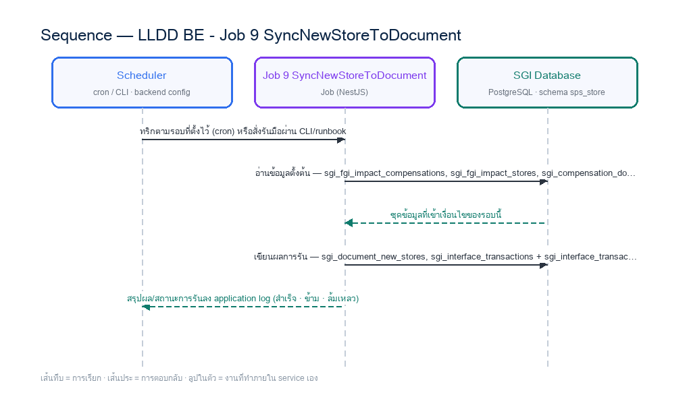

# LLDD BE - Job 9 SyncNewStoreToDocument

SBP Mall - ระบบประกันรายได้ | Low Level Design Document

## 1. Overview

| รายการ | รายละเอียด |
| --- | --- |
| Track | BE |
| Estimate | **13 ชั่วโมง** = implementation 10 + unit test 3 (30%) |
| Owner | Aphiwit &lt;Bank&gt; Khammoon |
| Target repository | **`SBP/srm-sps-spsap-sop-sgi-batch`** (NestJS 11 + TypeORM · schema `sps_store` · **มติ 2026-09-02 — ย้ายมาจาก store-backend**) — batch runner ของ SBP ที่รันอยู่แล้ว 42 job บน **AWS Batch** · ลงทะเบียน job ใน `src/main.ts` แล้วรับ argument ผ่าน `JOB_NAME`/`INPUT` (local) หรือ `argv[3]`/`argv[2]` (AWS Batch) · **ไม่ผ่าน BFF และไม่เปิด HTTP** · ตารางเวลาเป็น AWS Batch scheduled event ไม่ใช่ `@Cron` · ดู `SBP/srm-sps-spsap-sop-sgi-batch.md` |
| Objective | บันทึกร้านเปิดใหม่เข้าเอกสาร: อ่านโปรไฟล์ร้านเปิดใหม่และค่า forecast/adjust แล้วบันทึกเข้า sgi_document_new_stores ผ่าน Document Service โดยตรง แทนการเขียนไฟล์ BPM06002O และ SFTP ไป impactprofile |

Common contract reference: ทุกหัวข้อ API/FE ต้องยึด LLDD-BE-API-Common-Contracts และ LLDD-FE-Integration-Contracts สำหรับ error/auth/format/pagination/action/RBAC ก่อนลงรายละเอียดเฉพาะหน้าหรือเฉพาะ endpoint

### 1.1 เอกสาร LLDD ที่เกี่ยวข้อง

ตารางนี้สร้างจาก endpoint และตารางที่เอกสารฉบับนี้ประกาศไว้จริง — อ่านฉบับที่อยู่ในตารางก่อนลงมือ เพื่อไม่ให้สัญญา request/response หรือชื่อคอลัมน์หลุดจากกัน

| ความสัมพันธ์ | เอกสาร LLDD | เกี่ยวข้องตรงไหน |
| --- | --- | --- |
| สัญญากลาง | **LLDD-BE-API-Common-Contracts** | envelope `{success,data}` · error code · pagination · รูปแบบวันที่/เลขเอกสาร |
| โครงสร้างข้อมูล | **LLDD-BE-Database-Structure** | DDL ของตารางที่หัวข้อ Reference DB Mapping อ้างถึง |
| แพลตฟอร์มระบบเดิม | **LLDD-BE-Integration-SBP-Platform** | header จาก BFF (`x-api-key` / `x-user-*`) · การ reuse ตารางและ service ของระบบ SBP เดิม |
| ต้องจบก่อน (ลำดับงาน) | **LLDD-BE-API-Common-Contracts** | เป็นฉบับต้นทางของสัญญา/โครงที่ฉบับนี้อ้าง |
| ต้องจบก่อน (ลำดับงาน) | **LLDD-BE-Job-8-CreateCompensationDocument** | เป็นฉบับต้นทางของสัญญา/โครงที่ฉบับนี้อ้าง |

## 2. Screen / Functional Scope

- Main class/script: document.service.syncNewStores / (internal scheduler / service)
- Phase: C
- Output: sgi_document_new_stores (DB)
- Estimate: 10 ชั่วโมง
- Argument รับผ่าน `INPUT` (JSON) — local ใช้ env `JOB_NAME`/`INPUT` · AWS Batch ใช้ `argv[3]`/`argv[2]` · ดูหัวข้อ 5.95 · ไม่มีตาราง job_configs และไม่มีหน้าจอควบคุม (หน้า Flow Batch Job ในกลุ่มเมนู Flow เหลือแค่ Flowchart + Database ที่ใช้ · 2026-08-06)
- ตารางเวลาตั้งที่ **AWS Batch scheduled event** (repo ไม่มี `@Cron`) — **ยกเว้น job ที่เป็น event-driven (ดูหัวข้อ Config Schema ของ job นั้น) ซึ่งห้ามตั้ง schedule** · ทุก job ถูกบันทึกลง `integration_log` โดย `main.ts` อัตโนมัติ + structured log `BATCH_START`/`BATCH_END` พร้อม `runId`

## 3. Screenshot Reference

ไม่มีภาพหน้าจอสำหรับหัวข้อนี้ — เป็นเอกสารฝั่ง Backend/Batch ที่ไม่มี UI (ภาพหน้าจอทั้งหมดอยู่ในเอกสารชุด FE)

## 4. Implementation Flow & Sequence Diagram (Reference)

### 4.1 Implementation Flow (ลำดับขั้นการทำงาน)


_รูปที่ 1: Implementation flow reference: LLDD BE - Job 9 SyncNewStoreToDocument_

### 4.2 Sequence Diagram (ใครคุยกับใคร ลำดับไหน)

ผู้แสดงและลำดับข้อความในภาพนี้สร้างจาก endpoint ในหัวข้อ 7 และตารางในหัวข้อ Reference DB Mapping ของเอกสารฉบับนี้เอง จึงตรงกับสัญญาเสมอ



_รูปที่ 2: Sequence diagram: LLDD BE - Job 9 SyncNewStoreToDocument_

## 5. Field, Format, and Validation

| Field / UI | Format | Validation | Behavior |
| --- | --- | --- | --- |
| กำหนดการรัน (Cron) | 0 18 7-31 * * | แก้ไขได้ | เหลื่อมหลัง Job 8 (17:30) เพราะต้องรอ doc_no · **เวลาเหลื่อมไม่ใช่การรับประกัน — ต้องตั้ง dependency ที่ AWS Batch** |
| Target table | sgi_document_new_stores | ค่าคงที่/แก้ผ่านหน้าจอไม่ได้ | upsert ด้วย doc_no / new_store_code |
| กฎ Forecast / Percent | COALESCE(adjust_amount, forecast_amount) จาก sgi_fgi_impact_compensations | ค่าคงที่/แก้ผ่านหน้าจอไม่ได้ | ค่า adjust มาก่อน forecast เสมอ; NULL หรือค่านอกช่วง 0..100 ต้อง reject ก่อน upsert |
| เงื่อนไขเลือกข้อมูล | ร้านเปิดใหม่ สถานะ I + forecast + ยังไม่ sync | ค่าคงที่/แก้ผ่านหน้าจอไม่ได้ |  |

### 5.9 Input / Progress / Output Contract

| Stage | Contract for implementation |
| --- | --- |
| Input | New-store compensation rows linked to active impact-process records (writes to sgi_document_new_stores directly; no export file). |
| Progress | query eligible new-store rows, filter process errors, write outbound new-store payload, insert confirm-receive rows, upload/export, backup, notify. |
| Output | New-store sync payload/output and confirm-receive rows keyed by NEW_STORE_INFO_ID/month/year. |

### 5.90 Job 9 Execution Stages

query eligible new-store rows, filter process errors, write outbound new-store payload, insert confirm-receive rows, upload/export, backup, notify.

| Order | Service step | Repository | Output / failure contract |
| --- | --- | --- | --- |
| 1 | loadNewStoreAllocations | documentNewStoreRepository | คืน metrics และ throw typed error; transaction/rerun ใช้ contract ด้านล่าง |
| 2 | validateAllocationValues | documentNewStoreRepository | คืน metrics และ throw typed error; transaction/rerun ใช้ contract ด้านล่าง |
| 3 | upsertDocumentNewStores | documentNewStoreRepository | คืน metrics และ throw typed error; transaction/rerun ใช้ contract ด้านล่าง |
| 4 | reconcileAllocationTotals | documentNewStoreRepository | คืน metrics และ throw typed error; transaction/rerun ใช้ contract ด้านล่าง |

### 5.91 Job 9 Run Evidence

| Evidence | Job-specific value | Acceptance |
| --- | --- | --- |
| Input identity | New-store compensation rows linked to active impact-process records (writes to sgi_document_new_stores directly; no export file). | snapshot input file/business key/period in run record |
| Output identity | New-store sync payload/output and confirm-receive rows keyed by NEW_STORE_INFO_ID/month/year. | reconcile input, success, reject and skipped counts |
| Dedup proof | UNIQUE(doc_no,new_store_code); upsert + prune เฉพาะ source_system=FGI ให้ target ตรง impact set ปัจจุบัน โดยไม่ลบแถว USER | rerun fixture produces no duplicate target business key |
| Transaction proof | validate source percent ต้องไม่เป็น NULL และอยู่ 0..100 ก่อน upsert; จากนั้น upsert + prune ร้านของ doc_no, validate ผลรวม 100% และ tracking (direction=INTERNAL) ใน transaction เดียว; invalid/ไม่ครบให้ rollback ก่อน prune | injected failure leaves no partial committed state outside documented boundary |
| Security proof | internal service account least privilege; ไม่มี SFTP/BPM credential หรือ editable external endpoint | config/log/error contains no plaintext secret |

### 5.92 Legacy Java Source Reference

| Legacy file | Line range | Responsibility to carry forward |
| --- | --- | --- |
| fcsJar/src/th/co/gosoft/fgi/main/ExportOpenStore.java | 1-22 | Legacy main entrypoint; constant job name is ExportNewStoreToBPM. |
| fcsJar/src/th/co/gosoft/fgi/controller/ExportController.java | 404-516, 893-961 | Query new stores, create payload content, upload, backup, notification. |
| fcsJar/src/th/co/gosoft/fgi/dao/jdbc/ExportJdbc.java | 1558-1594 | Query new-store rows eligible for export. |

Line ranges refer to the legacy Java implementation under `batchjob/fcsJar/` (path นับจากราก `sbp-prototype/`). Use these ranges to preserve business behavior while implementing the target Node job.

### 5.93 Target Repository and SQL Contract

| Contract | Target implementation |
| --- | --- |
| Repository | documentNewStoreRepository |
| Idempotency / dedup | UNIQUE(doc_no,new_store_code); upsert + prune เฉพาะ source_system=FGI ให้ target ตรง impact set ปัจจุบัน โดยไม่ลบแถว USER |
| Transaction boundary | validate source percent ต้องไม่เป็น NULL และอยู่ 0..100 ก่อน upsert; จากนั้น upsert + prune ร้านของ doc_no, validate ผลรวม 100% และ tracking (direction=INTERNAL) ใน transaction เดียว; invalid/ไม่ครบให้ rollback ก่อน prune |
| Security | internal service account least privilege; ไม่มี SFTP/BPM credential หรือ editable external endpoint |

#### Input / candidate query

```sql
-- bind ตามลำดับ: $1=impact_month
SELECT d.doc_no, s.new_store_code,
       COALESCE(s.adjust_compensate_percent, s.forecast_compensate_percent) AS compensate_percent,
       COALESCE(s.adjust_compensation_amount, s.forecast_compensation_amount) AS compensation_amount
FROM sgi_fgi_impact_stores s
JOIN sgi_compensation_documents d ON d.impact_process_id = s.impact_process_id
WHERE s.impact_month = $1 /* impact_month */
  AND COALESCE(s.adjust_compensate_percent, s.forecast_compensate_percent) IS NOT NULL
  AND COALESCE(s.adjust_compensate_percent, s.forecast_compensate_percent) BETWEEN 0 AND 100;
```

#### Write / upsert query

```sql
-- bind ตามลำดับ: $1=doc_no · $2=new_store_code · $3=compensate_percent · $4=compensation_amount · $5=impact_month
-- validateAllocationValues ต้องยืนยัน source_row_count = valid_row_count ก่อนคำสั่งนี้;
-- ถ้าค่า percent เป็น NULL/นอกช่วง ให้ throw COMPENSATE_PERCENT_INVALID และ rollback ก่อน upsert/prune.
INSERT INTO sgi_document_new_stores
    (doc_no, new_store_code, compensate_percent, compensation_amount, source_system, updated_at)
SELECT $1 /* doc_no */, $2 /* new_store_code */, $3 /* compensate_percent */, $4 /* compensation_amount */, 'FGI', CURRENT_TIMESTAMP
WHERE $3 /* compensate_percent */ IS NOT NULL
  AND $3 /* compensate_percent */ BETWEEN 0 AND 100
ON CONFLICT (doc_no, new_store_code)
DO UPDATE SET compensate_percent = EXCLUDED.compensate_percent,
              compensation_amount = EXCLUDED.compensation_amount,
              updated_at = CURRENT_TIMESTAMP
RETURNING doc_no, new_store_code;

-- Service ต้องได้ RETURNING 1 แถวต่อ source row; ไม่ครบให้ rollback และห้าม prune.

DELETE FROM sgi_document_new_stores dns
WHERE dns.doc_no = $1 /* doc_no */
  AND dns.source_system = 'FGI'
  AND NOT EXISTS (
      SELECT 1
      FROM sgi_fgi_impact_stores src
      JOIN sgi_compensation_documents d ON d.impact_process_id = src.impact_process_id
      WHERE d.doc_no = dns.doc_no
        AND src.impact_month = $5 /* impact_month */
        AND src.new_store_code = dns.new_store_code
  );

SELECT CASE WHEN ABS(SUM(compensate_percent) - 100) <= 0.0001 THEN TRUE ELSE FALSE END AS allocation_valid
FROM sgi_document_new_stores
WHERE doc_no = $1 /* doc_no */;
```

### 5.94 Target Node Implementation

โครงสร้างนี้ระบุ service/repository เฉพาะงานและต้อง implement ตาม SQL, transaction, idempotency และ security contract ด้านบน โดยทุกขั้นต้องคืน metrics สำหรับ reconcile และ run history

```js
export async function runLlddBeJob9Syncnewstoretodocument(ctx, services) {
  const run = await services.jobRuns.acquire({
    jobNo: "9", period: ctx.period, triggeredBy: ctx.triggeredBy
  });

  try {
    ctx = { ...ctx, runId: run.id, repository: services.documentNewStoreRepository };
    const step1 = await services.loadNewStoreAllocations(ctx, undefined);
    const step2 = await services.validateAllocationValues(ctx, step1);
    const step3 = await services.upsertDocumentNewStores(ctx, step2);
    const step4 = await services.reconcileAllocationTotals(ctx, step3);
    const result = step4;
    await services.jobRuns.finish(run.id, "SUCCESS", result.metrics);
    return { runId: run.id, status: "SUCCESS", ...result };
  } catch (error) {
    await services.jobRuns.finish(run.id, "FAILED", {
      errorCode: error.code ?? "JOB_FAILED",
      errorMessage: error.message
    });
    throw error;
  }
}
```

### 5.95 การลงทะเบียน job และ Arguments (sop-sgi-batch)

งานนี้ลงทะเบียนเป็น job ชื่อ **`sgi-sync-new-store-to-document`** ใน `src/main.ts` ของ `SBP/srm-sps-spsap-sop-sgi-batch` โดยใช้ dispatcher เดิมของ repo (ไม่สร้าง runner ใหม่) — `main.ts` อ่านชื่อ job และ input มา 2 ทาง แล้วเลือกอัตโนมัติจากการมี `argv[3]` หรือไม่

| ช่องทางรัน | ชื่อ job มาจาก | input มาจาก | ตัวอย่าง |
| --- | --- | --- | --- |
| Local / CLI / runbook | env `JOB_NAME` | env `INPUT` (JSON string) | `JOB_NAME=sgi-sync-new-store-to-document INPUT='{"docNo":"2026/00123"}' npm run start` |
| AWS Batch (ตารางเวลาจริง) | `process.argv[3]` | `process.argv[2]` (JSON string) | `node dist/main.js '{"docNo":"2026/00123"}' sgi-sync-new-store-to-document` |

**ตารางเวลาไม่ได้อยู่ในโค้ด** — repo นี้ไม่มี `@Cron`/`@Interval` แม้แต่จุดเดียว (แม้ติดตั้ง `@nestjs/schedule` ไว้) cron ในหัวข้อ 5 เป็น **นิยามของ AWS Batch scheduled event** ที่ต้องตั้งตอน deploy ไม่ใช่ค่าที่อ่านจาก config file

#### Argument ที่รับได้ (`INPUT` เป็น JSON object · ไม่ส่ง = `{}`)

**ระบบเดิมรับ argument แบบนี้:** **ไม่รับ args**  
ของใหม่เปลี่ยนจาก positional string เป็น JSON เพื่อให้เพิ่มฟิลด์ได้โดยไม่พังของเดิม แต่ **ต้องรองรับทุกอย่างที่ระบบเดิมรับได้เป็นอย่างน้อย** — ห้ามลดความสามารถลง

| Field | ชนิด | ไม่ส่งแล้วได้อะไร (default) | Validation | ตรงกับ argument เดิม |
| --- | --- | --- | --- | --- |
| `docNo` | string | `null` = ทุกเอกสารที่เข้าเงื่อนไข | `YYYY/xxxxx` | **ของใหม่** |
| `impactMonth` | string | `null` | `YYYY-MM` | **ของใหม่** |
| `dryRun` | boolean | `false` | `true` = อ่าน/คำนวณครบแต่ไม่ commit และไม่ publish/ไม่ส่งไฟล์ | **ของกลาง** ทุก job |
| `limit` | number | `null` | จำกัดจำนวนรายการที่ประมวลผลรอบนี้ (ใช้ตอน smoke test) | **ของกลาง** ทุก job |

**กติกาการ validate ที่ทุก job ต้องทำเหมือนกัน** — parse `INPUT` ไม่สำเร็จ หรือฟิลด์ไม่ผ่าน validation ให้ log `BATCH_END` ด้วย `batchStatus: 'FAILED'` แล้ว `exit(1)` **ก่อนแตะฐานข้อมูล** (ห้าม fallback ไปค่า default เงียบ ๆ เมื่อผู้ใช้ตั้งใจส่งค่ามาแล้วผิด) · ฟิลด์ที่ไม่รู้จักให้ log warn แล้วข้าม ไม่ทำให้ job ล้ม

- prune เฉพาะแถว `source_system = 'FGI'` — แถวที่คนเพิ่มเอง (`USER`) ห้ามลบไม่ว่าจะส่ง arg แบบไหน

### 5.96 เงื่อนไขตัดสิน (Decision Rules) — ตัดสินจากอะไร

Job 9 คัดลอกร้านเปิดใหม่เข้าเอกสาร — กติกาเดียวกับ Job 7 เรื่องแถวที่คนคีย์เอง บวกกฎ **%ชดเชยรวมต้องเท่ากับ 100%**

| คำถามที่โค้ดต้องตอบ | ตัดสินจาก (ตาราง · คอลัมน์) | เงื่อนไขที่ต้องเป็นจริง | ไม่เข้าเงื่อนไขแล้วทำอะไร |
| --- | --- | --- | --- |
| แถวนี้ลบได้หรือไม่ (prune) | `sgi_document_new_stores.source_system` | ลบได้เฉพาะ `source_system = 'FGI'` ที่ไม่มีอยู่ในชุด impact ปัจจุบันแล้ว | ⛔ **แถว `source_system = 'USER'` ห้ามลบทุกกรณี** ไม่ว่าจะส่ง argument แบบไหน |
| %ชดเชยของเอกสารถูกต้องหรือไม่ | `sgi_document_new_stores.compensate_percent` (`CHECK BETWEEN 0 AND 100`) | ผลรวมของทุกร้านเปิดใหม่ในเอกสารเดียวกันต้อง **= 100%** พอดี | ไม่เท่า 100% = **ยกเลิกทั้งเอกสารนั้น** พร้อม reason ห้าม commit ครึ่งทาง (เอกสารจะคำนวณยอดผิด) |
| ยอดชดเชยต่อร้านมาจากไหน | `sgi_document_new_stores.compensation_amount` ← `sgi_fgi_impact_stores.forecast_compensation_amount` / `.adjust_compensation_amount` | ใช้ `COALESCE(adjust_compensation_amount, forecast_compensation_amount)` — ค่าที่คนปรับชนะค่าที่ระบบคำนวณเสมอ | ไม่มีทั้งคู่ = 0 (คอลัมน์ `NOT NULL DEFAULT 0`) ไม่ใช่ error |

#### ค่าคงที่และโดเมนที่ใช้ในเงื่อนไขข้างบน

ทุกค่าในตารางนี้ต้องอ่านจาก config/env ไม่ hardcode ในคิวรี — แต่ **ค่าตั้งต้นต้องเท่าระบบเดิมทุกตัว** ไม่งั้นผลลัพธ์จะไม่ตรงกันตอนเทียบ UAT

| ค่า | โดเมน / ค่าที่ระบบเดิมใช้ | ที่มา |
| --- | --- | --- |
| `source_system` | `FGI` = ระบบนำเข้าให้ (ลบ/อัปเดตได้) · `USER` = คนคีย์เอง (**ห้ามแตะ**) | คอลัมน์ `source_system` |
| ผลรวม %ชดเชย | ต้อง = 100% พอดีต่อ 1 เอกสาร | กติกาธุรกิจ (SDD GI) |

## 6. Button / User Action Mapping

| Action | Trigger | API / Service | Expected Result |
| --- | --- | --- | --- |
| รันตามตารางเวลา | CRON | scheduler → runner (job 9) | อ่าน cron/พารามิเตอร์จาก backend config |
| รันนอกรอบ (manual/rerun) | CLI | CLI/ops runbook → runner (job 9) | guard ไม่ให้รันซ้อนด้วย distributed lock |
| แก้พารามิเตอร์/เปิด-ปิด job | CONFIG | แก้ backend config แล้ว deploy | ไม่มี endpoint และไม่มีหน้าจอควบคุม — หน้า Flow Batch Job เป็น reference อย่างเดียว (2026-08-06) |
| ตรวจผลการรัน | LOG | application log (structured) | ไม่มีตาราง job_run_histories แล้ว · ผลการรับส่งไฟล์/ข้อความดูที่ sgi_interface_transactions |

## 7. API Contract

**เอกสารฉบับนี้ไม่มี endpoint ของตัวเอง** — เป็นสัญญา/งานภายในที่เอกสารอื่นเรียกใช้ (ดูขอบเขตใน 5.90 Endpoint Implementation Contract) · รายการ endpoint ทั้ง 28 เส้นของ SGI อยู่ที่ **LLDD-API** และ `api.md`

## 8. Reference DB Mapping (No Database Page Work)

ส่วนนี้เป็นข้อมูลอ้างอิงสำหรับการ implement API/Job เท่านั้น ไม่ใช่งานสร้างหน้า Database, ไม่ใช่งานออกแบบ DB page และไม่ถูกนับเป็น deliverable แยกของ FE/BE

| Table / Object | R/W | Usage |
| --- | --- | --- |
| sgi_fgi_impact_compensations | R | ยอด forecast_amount / adjust_amount รายงวด — ที่มาของ %ชดเชย (ตาราง F1) |
| sgi_fgi_impact_stores | R | โปรไฟล์ร้านเปิดใหม่และค่า forecast/adjust รายงวด |
| sgi_compensation_documents | R | หา doc_no จาก impact_process_id |
| sgi_document_new_stores | W | บันทึกร้านเปิดใหม่เข้าเอกสารโดยตรง |
| sgi_interface_transactions | W | tracking ภายใน: direction=INTERNAL · status=COMPLETED (ไม่มี ACK ให้รอเพราะเขียน DB ตรง) |

## 9. Skeleton Code (Batch Job 9)

### 9.1 ผังไฟล์ที่ต้องสร้าง (Job 9) — บน `srm-sps-spsap-sop-sgi-batch`

โครงไฟล์ของ Job 9 (document.service.syncNewStores เดิม) วางใต้ `src/modules/sgi/` ตาม convention ที่ repo นี้ใช้อยู่จริง (ดูตัวอย่างที่ `src/modules/performance/import-qssi.service.ts`): service ถือ logic ทั้งหมด, inject `DataSource`/repository ผ่าน TypeORM, ยิง raw SQL ได้ตรง, และ **ไม่มี controller** เพราะ repo นี้ไม่เปิด HTTP

**สิ่งที่ reuse ได้ทันที ไม่ต้องเขียนใหม่** — ต่างจากแผนเดิมที่ตั้งไว้บน store-backend ซึ่งต้องสร้าง runner ทั้งชุดเอง: `src/main.ts` (dispatcher + `BATCH_START`/`BATCH_END` + `runId` + log ลง `integration_log` อัตโนมัติ) · `src/modules/rabbitMQ/rabbitmq.service.ts` (`publishMessage`) · `src/shared/services/s3.service.ts` · `StatementService.decodeThaiFileContent()` (WINDOWS-874 auto-detect) · `@gosoft-sbp/email-lib` · `@srm/glb-log`

⚠️ **สิ่งที่ repo นี้ยังไม่มี และเป็นงานตั้งต้นจริง**: (1) ไม่มี `@Cron` เลย — ตารางเวลาต้องตั้งเป็น **AWS Batch scheduled event** (2) ไม่มี distributed lock (`pg_try_advisory_lock`) — การกันรันซ้อนพึ่ง AWS Batch queue ถ้างานไหนรับความเสี่ยงนี้ไม่ได้ต้องเพิ่มเอง (3) `publishMessage` เป็น fire-and-forget **ไม่มี publisher confirm และไม่มี outbox** — งานที่ต้องการ **transactional outbox + publisher confirm** (Job 6 · และ `sgi_reflow` ฝั่ง BE) ต้องสร้างกลไกเพิ่มเอง ไม่ใช่ reuse ได้เลย · ⚠️ ไม่มี ACK ระดับธุรกิจให้รอ (มติ 2026-09-08 ข้อ 2.13) (4) ยังไม่มี entity/ตาราง `sgi_*` แม้แต่ตัวเดียว

| Path | หน้าที่ |
| --- | --- |
| src/modules/sgi/job-9-sync-new-store-to-document.service.ts | คลาส `SyncNewStoreToDocumentService` — **`execute(input)` เป็น entry point เดียว** เรียงตาม flow ของ Job 9 ทีละขั้น ครอบ transaction เอง และจบด้วย structured log สรุป metrics (แบบเดียวกับ `ImportQssiService.execute(body)` ที่มีอยู่) |
| src/modules/sgi/job-9-sync-new-store-to-document.service.spec.ts | unit test ของ service — repo นี้วาง spec ไว้ข้างไฟล์จริงเสมอ (`jest` + `npm run test:ci` มี coverage/SonarQube) |
| src/modules/sgi/dto/job-9-sync-new-store-to-document-input.dto.ts | DTO ของ `INPUT` (JSON) พร้อม `class-validator` ตามตารางในหัวข้อ 9.2 — parse ไม่ผ่านต้อง fail ก่อนแตะ DB |
| src/modules/sgi/sgi.module.ts | NestJS module ของกลุ่มงานประกันรายได้ — ผูก service ทุกตัวของ SGI เข้ากับ `TypeOrmModule` (ไฟล์ร่วมของทุก job ให้ merge ไม่ใช่เขียนทับ) |
| src/main.ts | **เพิ่ม `case 'sgi-sync-new-store-to-document':`** ในสวิตช์เดิม → `await import('./modules/sgi/job-9-sync-new-store-to-document.service')` แล้ว `app.get(SyncNewStoreToDocumentService).execute(input)` (ไฟล์กลางของทุก job — เป็นจุด merge conflict ที่ต้องระวัง) |
| src/entities/sgi-*.entity.ts | entity ของตาราง `sgi_*` ที่หัวข้อ Reference DB Mapping อ้างถึง — **ยังไม่มีใน repo เลยสักตัว** ต้องสร้างใหม่ทั้งหมด |
| src/config/config.ts | เพิ่ม `export const sgiJob9Config` ตามแบบของไฟล์นี้ (โปรเจกต์ไม่ใช้ `registerAs`) — ค่าคงที่ทางธุรกิจของ Job 9 |

#### การลงทะเบียนใน `src/main.ts` (job `sgi-sync-new-store-to-document`)

```js
// src/main.ts — เพิ่มเคสนี้ในสวิตช์เดิม (เรียงต่อจาก job ของ SGI ตัวก่อนหน้า)
      case 'sgi-sync-new-store-to-document': {
        const { SyncNewStoreToDocumentService } = await import('./modules/sgi/job-9-sync-new-store-to-document.service');
        const job9syncnewstoretodocumentService = app.get(SyncNewStoreToDocumentService);
        await job9syncnewstoretodocumentService.execute(input);   // input = JSON ที่ parse จาก INPUT/argv[2] แล้ว
        break;
      }
```

`main.ts` เรียก `StatementService.logInterfest('sgi-sync-new-store-to-document', input)` ให้อยู่แล้วก่อนเข้าสวิตช์ → **ไม่ต้องเขียน log ลง `integration_log` เองซ้ำ** · และ `BATCH_END` ที่ท้ายไฟล์จะสรุป `batchStatus` + `durationMs` ให้อัตโนมัติ หน้าที่ของ service คือ throw เมื่อทำงานไม่สำเร็จเท่านั้น

### 9.2 Config Schema ของ Job 9 (backend config / env)

ตารางเวลาของ Job 9 คือ `0 18 7-31 * *` (วันที่ 7–31 เวลา 18:00 — **เหลื่อมหลัง Job 8 (17:30) เพราะต้องรอ doc_no** · ⚠️ ต้องตั้ง dependency ที่ AWS Batch) — ⚠️ **ตัวจริงตั้งที่ AWS Batch scheduled event ไม่ใช่ในโค้ด** (repo นี้ไม่มี `@Cron` เลย) ค่า `SGI_JOB9_CRON` เก็บไว้เป็นเอกสารประกอบ/ตรวจสอบเท่านั้น · `SGI_JOB9_ENABLED=false` ให้ `execute()` จบทันทีแบบ SUCCESS พร้อม log เหตุผล (กันกรณี AWS Batch ยังยิงเข้ามา)

```ts
// src/config/config.ts — เพิ่มบล็อกนี้ต่อท้าย (repo ใช้ export const ไม่ใช้ registerAs)
// convention จริงของ sop-sgi-batch คือ `export const` ใน `src/config/config.ts` (ไม่ใช้ registerAs · ดูของเดิมที่
// `AppConfigModule` แบบ @Global แล้วอ่าน process.env ตรง ๆ) — โปรเจกต์นี้ **ไม่ได้ใช้ registerAs**
// แม้แต่จุดเดียว จึงประกาศเป็นคลาสให้รีวิว/ทดสอบเหมือน config ตัวอื่น
import { Injectable } from '@nestjs/common';

// TODO: Job 9 ไม่มีตาราง job_configs และไม่มี Job Admin API แล้ว (ตัดสินใจ 2026-08-06)
// TODO: ค่าทุกตัวอ่านจาก env/config file ของ backend เท่านั้น — เปลี่ยนค่า = แก้ config แล้ว deploy
export interface Job9Config {
  /** เปิด/ปิด job รอบถัดไปโดยไม่ต้อง deploy โค้ด */
  enabled: boolean;
  /** ตารางเวลาของ job นี้ — บันทึกไว้เพื่ออ้างอิงเท่านั้น ตัวจริงตั้งที่ AWS Batch scheduled event */
  cron: string;
  /** Target table — upsert ด้วย doc_no / new_store_code */
  targetTable: string;
  /** กฎ Forecast / Percent — ค่า adjust มาก่อน forecast เสมอ; NULL หรือค่านอกช่วง 0..100 ต้อง reject ก่อน upsert */
  forecastPercent: string;
  /** เงื่อนไขเลือกข้อมูล */
  condition: string;
  /** ผู้รับอีเมลเมื่อ job ล้มเหลว — เก็บเป็น string คั่น comma ให้ตรง signature ของ
      `EmailLibService.sendMail({ mailTo })` ที่รับ string ไม่ใช่ string[] */
  mailTo: string;
}

@Injectable()
export class SgiJob9Config implements Job9Config {
  // TODO: ยืนยันค่า default ทุกตัวกับ Ops ก่อนขึ้น production (ไม่มีหน้าจอแก้ค่าแล้ว)
  enabled = (process.env.SGI_JOB9_ENABLED ?? 'true') === 'true';
  cron = process.env.SGI_JOB9_CRON ?? '0 18 7-31 * *';
  targetTable = process.env.SGI_JOB9_TARGET_TABLE ?? 'sgi_document_new_stores'; // TODO: ค่าคงที่ทางธุรกิจ — เปลี่ยนต้องผ่านการอนุมัติ
  forecastPercent = process.env.SGI_JOB9_FORECAST_PERCENT ?? 'COALESCE(adjust_amount, forecast_amount) จาก sgi_fgi_impact_compensations'; // TODO: ค่าคงที่ทางธุรกิจ — เปลี่ยนต้องผ่านการอนุมัติ
  condition = process.env.SGI_JOB9_CONDITION ?? 'ร้านเปิดใหม่ สถานะ I + forecast + ยังไม่ sync'; // TODO: ค่าคงที่ทางธุรกิจ — เปลี่ยนต้องผ่านการอนุมัติ
  mailTo = process.env.SGI_JOB9_MAIL_TO ?? ''; // TODO: ผู้รับอีเมลแจ้ง error คั่นด้วย comma (เดิม: ส่ง error ผ่าน email-lib กลาง (sendEmail) เมื่อ sync ล้มเหลว)
}

// TODO: เพิ่ม SgiJob9Config ใน providers/exports ของ AppConfigModule (@Global) เหมือน AppConfig
```

### 9.3 Job Class — `run(ctx)` ของ Job 9 ทีละขั้นตามผัง

#### 9.3.1 สัญญาของชั้นกลาง (`runner.ts`) + โครง service ของ Job 9

service อ้าง `JobRunContext` / `JobRunResult` / `JobState` / `JobFailedError` — ทั้งหมดนิยาม ครั้งเดียวใน `src/modules/sgi/sgi-job.types.ts` (ไฟล์ร่วมของทุก job ให้ merge ไม่ใช่เขียนทับ) และ service ต้องมี method ครบตามตารางขั้นตอนด้านล่าง มิฉะนั้น `execute(input)` จะเรียก method ที่ไม่มีอยู่

```ts
// src/modules/sgi/sgi-job.types.ts — สัญญากลางของทุก job ของ SGI (ประกาศครั้งเดียว ใช้ร่วมทั้ง 10 ฉบับ)

export interface JobRunContext {
  jobNo: string;
  period: string;        // YYYYMM ของงวดที่รัน
  triggeredBy: string;   // 'CRON' | userId ที่สั่งรันนอกรอบ
  params?: Record<string, string>;
}

export interface JobRunResult {
  event: 'job.finish';
  jobNo: string;
  jobName: string;
  status: 'SUCCESS' | 'SKIPPED' | 'SKIPPED_LOCKED' | 'FAILED';
  period: string;
  output: string;
  read: number; written: number; skipped: number; rejected: number;
  durationMs: number;
}

/** counter + ค่าที่ทุกขั้นของ job ใช้ร่วมกัน (service เป็นผู้สร้างผ่าน createState) */
export interface JobState {
  period: string;
  read: number; written: number; skipped: number; rejected: number;
  // TODO: เพิ่ม field เฉพาะของ job นี้ (เช่น rows ที่อ่านมา, path ไฟล์ที่เขียน)
  [key: string]: unknown;
}

/** error ที่ทำให้ job จบเป็น FAILED และส่งอีเมลแจ้งผู้ดูแล */
export class JobFailedError extends Error {
  constructor(public readonly code: string, message: string) { super(message); }
}

/** ใช้ออกจาก transaction เมื่อสาขา NO บอกให้ข้ามงวด/เรคคอร์ด — runner สรุปเป็น SKIPPED ไม่ใช่ FAILED */
export class JobSkippedError extends Error {}
```

```ts
// SyncNewStoreToDocumentService — method ที่ job class เรียก (1 method ต่อ 1 ขั้นในตารางด้านบน)
import { Inject, Injectable } from '@nestjs/common';
import type { DataSource, EntityManager } from 'typeorm';
import type { JobRunContext, JobState } from '../../runner';
export type { JobState };

@Injectable()
export class SyncNewStoreToDocumentService {
  constructor(@Inject('DATA_SOURCE') private readonly dataSource: DataSource) {}

  createState(ctx: JobRunContext): JobState {
    return { period: ctx.period, read: 0, written: 0, skipped: 0, rejected: 0 };
  }

  // query ร้านเปิดใหม่ สถานะ I + forecast + ยังไม่ sync
  async step02Query(state: JobState, manager?: EntityManager): Promise<void> {
    throw new Error('step02Query: ยังไม่ได้ implement — ดู SQL ที่หัวข้อ Repository / SQL และกติกาที่หัวข้อเงื่อนไขตัดสิน');
  }

  // มี sgi_compensation_documents ของ impact_process_id แล้ว?
  //   เงื่อนไขจริง: ดูตารางในหัวข้อ "เงื่อนไขตัดสิน (Decision Rules)" ของเอกสารฉบับนี้
  async check03Document(state: JobState): Promise<boolean> {
    throw new Error('check03Document: ยังไม่ได้ implement — ห้าม deploy ทั้งที่ยังไม่เขียนเงื่อนไขจริง');
  }

  // compensate_percent ครบและอยู่ในช่วง 0..100 ทุกแถว?
  //   เงื่อนไขจริง: ดูตารางในหัวข้อ "เงื่อนไขตัดสิน (Decision Rules)" ของเอกสารฉบับนี้
  async check04Condition(state: JobState): Promise<boolean> {
    throw new Error('check04Condition: ยังไม่ได้ implement — ห้าม deploy ทั้งที่ยังไม่เขียนเงื่อนไขจริง');
  }

  // upsert sgi_document_new_stores
  async step05Upsert(state: JobState, manager?: EntityManager): Promise<void> {
    throw new Error('step05Upsert: ยังไม่ได้ implement — ดู SQL ที่หัวข้อ Repository / SQL และกติกาที่หัวข้อเงื่อนไขตัดสิน');
  }

  // validate allocation percent รวมต่อ doc_no
  async step06Workflow(state: JobState, manager?: EntityManager): Promise<void> {
    throw new Error('step06Workflow: ยังไม่ได้ implement — ดู SQL ที่หัวข้อ Repository / SQL และกติกาที่หัวข้อเงื่อนไขตัดสิน');
  }

  // insert sgi_interface_transactions: data_name = NEW_STORE · direction = INTERNAL · status = COMPLETED
  async step07WriteFile(state: JobState, manager?: EntityManager): Promise<void> {
    throw new Error('step07WriteFile: ยังไม่ได้ implement — ดู SQL ที่หัวข้อ Repository / SQL และกติกาที่หัวข้อเงื่อนไขตัดสิน');
  }

}
```

#### 9.3.2 `run(ctx)` ของ Job 9

ทุกขั้นใน `run()` ตรงกับ flowchart ของ Job 9 หนึ่งต่อหนึ่ง (decision และ error path รวมอยู่ด้วย) — method ที่ต้อง implement ใน service ตามตารางนี้

| ลำดับ | ชนิด | ขั้นตอนจากผัง | Method ที่ต้อง implement | เส้นทาง NO / error |
| --- | --- | --- | --- | --- |
| 1 | start | เริ่ม | createState() | - |
| 2 | process | query ร้านเปิดใหม่ สถานะ I + forecast + ยังไม่ sync | step02Query() | throw JobFailedError เมื่อทำไม่สำเร็จ |
| 3 | decision | มี sgi_compensation_documents ของ impact_process_id แล้ว? | check03Document() | [บันทึกผลแล้วไป record ถัดไป] คงสถานะรอ sync / log pending |
| 4 | decision | compensate_percent ครบและอยู่ในช่วง 0..100 ทุกแถว? | check04Condition() | [err] COMPENSATE_PERCENT_INVALID + rollback ก่อน upsert/prune |
| 5 | process | upsert sgi_document_new_stores | step05Upsert() | throw JobFailedError เมื่อทำไม่สำเร็จ |
| 6 | process | validate allocation percent รวมต่อ doc_no | step06Workflow() | throw JobFailedError เมื่อทำไม่สำเร็จ |
| 7 | process | insert sgi_interface_transactions: data_name = NEW_STORE · direction = INTERNAL · status = COMPLETED | step07WriteFile() | throw JobFailedError เมื่อทำไม่สำเร็จ |
| 8 | end | จบ | summarize() | - |

```ts
// src/modules/sgi/job-9-sync-new-store-to-document.service.ts — execute(input) เป็น entry point เดียว
import { Inject, Injectable, Logger } from '@nestjs/common';
import type { DataSource, EntityManager } from 'typeorm';
import { SyncNewStoreToDocumentService, type JobState } from './job-9-sync-new-store-to-document.service';
// 4 symbol นี้นิยามใน src/modules/sgi/sgi-job.types.ts (ไฟล์ร่วมของทุก job — ดูหัวข้อก่อนหน้า)
import { JobFailedError, JobSkippedError, JobRunContext, JobRunResult } from '../../runner';

@Injectable()
export class SyncNewStoreToDocumentJob {
  static readonly jobNo = '9';
  private readonly logger = new Logger(SyncNewStoreToDocumentJob.name);

  constructor(
    // TODO: repo นี้ตั้ง replication ใน typeorm.config.ts อยู่แล้ว — SELECT ไป slave, write ไป master อัตโนมัติ
    @Inject('DATA_SOURCE') private readonly dataSource: DataSource,
    private readonly service: SyncNewStoreToDocumentService,
  ) {}

  async run(ctx: JobRunContext): Promise<JobRunResult> {
    const startedAt = Date.now();
    // TODO: state ถือ candidates ที่อ่านมา + counter (read/written/skipped/rejected/marked)
    //       และค่าจาก job9Config — ทุก counter ต้องถูกอัปเดตจาก record จริง ไม่ใช่ค่าคงที่
    const state = this.service.createState(ctx);
    try {
      // ขั้นที่ 2: query ร้านเปิดใหม่ สถานะ I + forecast + ยังไม่ sync
      await this.service.step02Query(state);
      // TODO: candidate มาจากขั้นอ่านข้อมูลด้านบน — ลูปนี้จำเป็นเพราะมี branch ระดับ record
      //       (ขั้นที่ตัดสินรายแถวจะ `continue`/`return` ออกจากรอบของ record นั้น)
      //       เยื้องบรรทัดในลูปให้เรียบร้อยตอนคัดลอกเข้าโปรเจกต์จริง
      for (const record of state.candidates) {
      // ขั้นที่ 3 (decision): มี sgi_compensation_documents ของ impact_process_id แล้ว?
      const ok03 = await this.service.check03Document(state);
      if (!ok03) { // NO → คงสถานะรอ sync / log pending
        await this.service.mark03(state);
        state.marked += 1;
        continue; // ไป record ถัดไป — ไม่ใช่ error ของทั้ง job
      }
      // ขั้นที่ 4 (decision): compensate_percent ครบและอยู่ในช่วง 0..100 ทุกแถว? · TODO: COALESCE(adjust_compensate_percent, forecast_compensate_percent) ต้องไม่เป็น NULL
      const ok04 = await this.service.check04Condition(state);
      if (!ok04) throw new JobFailedError('JOB9_STEP04', 'COMPENSATE_PERCENT_INVALID + rollback ก่อน upsert/prune');
      // === transaction boundary === TODO: validate percent ไม่เป็น NULL และอยู่ 0..100 ก่อน; DB transaction ครอบ upsert sgi_document_new_stores + tracking; พบค่าผิดให้ rollback ก่อน prune
      await this.dataSource.transaction(async (manager: EntityManager) => {
        // ขั้นที่ 5: upsert sgi_document_new_stores · TODO: compensate_percent = COALESCE(adjust_compensate_percent, forecast_compensate_percent) · compensation_amount = COALESCE(adjust_amount, forecast_amount)
        await this.service.step05Upsert(state, manager);
        // ขั้นที่ 6: validate allocation percent รวมต่อ doc_no · TODO: ต้องรวมได้ 100 ก่อน submit workflow
        await this.service.step06Workflow(state, manager);
        // ขั้นที่ 7: insert sgi_interface_transactions: data_name = NEW_STORE · direction = INTERNAL · status = COMPLETED · TODO: ไม่สร้างไฟล์ BPM06002O แล้ว — เขียน DB ตรงจึงไม่มี ACK ให้รอ
        await this.service.step07WriteFile(state, manager);
      });
      }
      return this.summarize(state, 'SUCCESS', startedAt);
    } catch (error) {
      // TODO: error path ของ Job 9 — ห้าม re-implement การเขียนไฟล์ BPM06002O หรือ SFTP ไป BPM; legacy file เป็น reference เท่านั้น
      this.logger.error(JSON.stringify({ event: 'job.failed', jobNo: '9', period: ctx.period,
        triggeredBy: ctx.triggeredBy, durationMs: Date.now() - startedAt, error: (error as Error).message }));
      // TODO: แจ้งผู้ดูแลผ่าน JobFailureNotifier (หัวข้อ 9.6.1) — runner เป็นผู้เรียกให้
      throw error;
    }
  }

  private summarize(state: JobState, status: JobRunResult['status'], startedAt = Date.now()): JobRunResult {
    // TODO: structured log บรรทัดเดียวจบ — ไม่มีตาราง job_run_histories แล้ว (2026-08-06)
    const summary = {
      event: 'job.finish', jobNo: '9', jobName: 'SyncNewStoreToDocument', status,
      period: state.period, output: 'sgi_document_new_stores (DB)',
      read: state.read, written: state.written, skipped: state.skipped,
      rejected: state.rejected, durationMs: Date.now() - startedAt,
    };
    this.logger.log(JSON.stringify(summary));
    return summary as JobRunResult;
  }
}
```

### 9.4 การกันรันซ้อนของ Job 9 (PostgreSQL advisory lock — **ของใหม่**)

Job 9 มีข้อควรระวังจาก legacy: ห้าม re-implement การเขียนไฟล์ BPM06002O หรือ SFTP ไป BPM; legacy file เป็น reference เท่านั้น — runner ล็อกด้วย `pg_try_advisory_lock` ก่อนเริ่มขั้นแรกเสมอ และรอบที่ล็อกไม่ได้ให้จบด้วยสถานะ SKIPPED_LOCKED (ไม่ใช่ FAILED)

```ts
// src/modules/sgi/sgi-job.lock.ts (ของใหม่ — repo นี้ยังไม่มีกลไกกันรันซ้อนใด ๆ)
import { Inject, Injectable, Logger } from '@nestjs/common';
import type { DataSource } from 'typeorm';

// TODO: ห้ามใช้แถวสถานะ RUNNING ในตารางเป็นตัวกัน (ไม่มีตาราง job_run_histories แล้ว)
//       ใช้ PostgreSQL advisory lock ระดับ session แทน — ปลดอัตโนมัติเมื่อ connection หลุด
export const SGI_JOB_LOCK_CLASS_ID = 861000; // namespace ของระบบ SGI
export const JOB_LOCK_KEYS: Record<string, number> = { '9': 90 /* TODO: เพิ่มให้ครบทุก job */ };

@Injectable()
export class BatchRunner {
  private readonly logger = new Logger(BatchRunner.name);
  constructor(@Inject('DATA_SOURCE') private readonly dataSource: DataSource) {}

  // period = งวดที่รอบนี้ทำงาน ('YYYY-MM') — เป็นส่วนหนึ่งของคีย์ล็อก ไม่ใช่แค่หมายเลข job
  // (เจอจริง 2026-09-09: ล็อกด้วย jobNo อย่างเดียว = คนละงวดก็รันพร้อมกันไม่ได้
  //  ทั้งที่เอกสารระบุว่าคนละงวดต้องรันขนานกันได้ · ส่ง period = null ถ้าต้องการล็อกทั้ง job)
  async runExclusive<T>(jobNo: string, period: string | null, fn: () => Promise<T>): Promise<T | { status: 'SKIPPED_LOCKED' }> {
    // TODO: ต้องใช้ QueryRunner (connection เดียวบน master) — dataSource.query() ของโปรเจกต์นี้
    //       route SQL ที่ขึ้นต้นด้วย SELECT ไป slave pool ทำให้ lock ไปตกที่ replica คนละ connection
    const runner = this.dataSource.createQueryRunner('master');
    await runner.connect();
    // pg_try_advisory_lock(int4, int4) — objectId ต้องอยู่ในช่วง int4
    //   ล็อกทั้ง job : objectId = JOB_LOCK_KEYS[jobNo]
    //   ล็อกรายงวด  : ผสมงวดเข้าไปด้วย hashtext() แล้วบีบให้อยู่ในช่วงที่ปลอดภัย
    const baseId = JOB_LOCK_KEYS[jobNo];
    const objectId = period === null ? baseId
      : (await runner.query('SELECT (hashtext($1) & 2147483647) % 1000000 + $2 * 1000000 AS id',
                            [period, baseId]))[0].id;
    try {
      const [{ locked }] = await runner.query(
        'SELECT pg_try_advisory_lock($1, $2) AS locked',
        [SGI_JOB_LOCK_CLASS_ID, objectId],
      );
      if (!locked) {
        // TODO: รอบนี้ข้ามไปเฉย ๆ ไม่ถือเป็น error และไม่ต้องส่งอีเมล
        this.logger.warn(JSON.stringify({ event: 'job.skipped.locked', jobNo, period }));
        return { status: 'SKIPPED_LOCKED' };
      }
      return await fn();
    } finally {
      // TODO: ปลด lock ทุกกรณี แล้วคืน connection เข้า pool
      await runner.query('SELECT pg_advisory_unlock($1, $2)', [SGI_JOB_LOCK_CLASS_ID, objectId]);
      await runner.release();
    }
  }
}
```

### 9.5 Repository / SQL หลักของ Job 9

repository ของ Job 9 ประกาศเป็น factory provider (`{provide: 'SYNC_NEW_STORE_TO_DOCUMENT_REPOSITORY', useFactory: (ds) => ds.getRepository(Entity), inject: [DataSource]}`) แล้วยิง raw SQL ตามแบบ module ธุรกิจอื่นของ store-backend (schema `sps_store` มาจาก search_path)

| ตาราง | R/W | การใช้งานตามผัง | หมายเหตุ target design |
| --- | --- | --- | --- |
| sgi_fgi_impact_compensations | R | ยอด forecast_amount / adjust_amount รายงวด — ที่มาของ %ชดเชย (ตาราง F1) | เขียน SQL ตรงผ่าน DATA_SOURCE |
| sgi_fgi_impact_stores | R | โปรไฟล์ร้านเปิดใหม่และค่า forecast/adjust รายงวด | เขียน SQL ตรงผ่าน DATA_SOURCE |
| sgi_compensation_documents | R | หา doc_no จาก impact_process_id | เขียน SQL ตรงผ่าน DATA_SOURCE |
| sgi_document_new_stores | W | บันทึกร้านเปิดใหม่เข้าเอกสารโดยตรง | เขียน SQL ตรงผ่าน DATA_SOURCE |
| sgi_interface_transactions | W | tracking ภายใน: direction=INTERNAL · status=COMPLETED (ไม่มี ACK ให้รอเพราะเขียน DB ตรง) | เขียน SQL ตรงผ่าน DATA_SOURCE |

```sql
-- Job 9 SyncNewStoreToDocument — query หลักที่ต้อง implement
-- TODO: ทุก statement รันผ่าน DATA_SOURCE (SELECT ไป slave, write ไป master) และ
--       write ทั้งหมดต้องอยู่ใน transaction เดียวกับที่ระบุใน 9.3

-- [R] sgi_fgi_impact_compensations : ยอด forecast_amount / adjust_amount รายงวด — ที่มาของ %ชดเชย (ตาราง F1)
-- คอลัมน์มาจาก DDL จริงของตารางนี้ (ห้าม SELECT *) · ตรวจว่ามี index รองรับ WHERE ก่อนขึ้น prod
SELECT id, adjust_amount, approve_date, compensate_comment, compensate_month, compensate_seq, compensate_seq_no, compensate_status, compensate_year, created_at, created_by, forecast_amount   -- ตัดคอลัมน์ที่ job นี้ไม่ได้ใช้ออก (ทั้งตารางมี 18 คอลัมน์)
  FROM sgi_fgi_impact_compensations
 WHERE impact_process_id = $1   -- คีย์ที่ job นี้ใช้คัดแถว (ตารางนี้ไม่มีคอลัมน์งวดของตัวเอง)
 ORDER BY id   -- PK ทำให้ลำดับคงที่ระหว่างแบ่งหน้า
 LIMIT $2 OFFSET $3;  -- อ่านเป็น chunk กัน memory บวม

-- [R] sgi_fgi_impact_stores : โปรไฟล์ร้านเปิดใหม่และค่า forecast/adjust รายงวด
-- คอลัมน์มาจาก DDL จริงของตารางนี้ (ห้าม SELECT *) · ตรวจว่ามี index รองรับ WHERE ก่อนขึ้น prod
SELECT id, adjust_compensate_percent, adjust_compensation_amount, created_at, created_by, distance_km, forecast_compensate_percent, forecast_compensation_amount, impact_month, impact_process_id, impacted_store_code, new_store_code   -- ตัดคอลัมน์ที่ job นี้ไม่ได้ใช้ออก (ทั้งตารางมี 16 คอลัมน์)
  FROM sgi_fgi_impact_stores
 WHERE impact_month = $1  -- คอลัมน์งวดจริงของตารางนี้ตาม DDL
 ORDER BY id   -- PK ทำให้ลำดับคงที่ระหว่างแบ่งหน้า
 LIMIT $2 OFFSET $3;  -- อ่านเป็น chunk กัน memory บวม

-- [R] sgi_compensation_documents : หา doc_no จาก impact_process_id
-- คอลัมน์มาจาก DDL จริงของตารางนี้ (ห้าม SELECT *) · ตรวจว่ามี index รองรับ WHERE ก่อนขึ้น prod
SELECT id, account_month, account_year, allmap_url, approver_snapshot, created_at, created_by, current_section_code, doc_no, impact_compensation_id, impact_month, impact_process_id   -- ตัดคอลัมน์ที่ job นี้ไม่ได้ใช้ออก (ทั้งตารางมี 26 คอลัมน์)
  FROM sgi_compensation_documents
 WHERE impact_month = $1  -- คอลัมน์งวดจริงของตารางนี้ตาม DDL
 ORDER BY id   -- PK ทำให้ลำดับคงที่ระหว่างแบ่งหน้า
 LIMIT $2 OFFSET $3;  -- อ่านเป็น chunk กัน memory บวม

-- [W] sgi_document_new_stores : บันทึกร้านเปิดใหม่เข้าเอกสารโดยตรง
-- คอลัมน์มาจาก DDL จริง — ตัดคอลัมน์ที่ job นี้ไม่ได้เขียนออก แล้วเลื่อนเลข $n ให้ตรง
INSERT INTO sgi_document_new_stores
  (doc_no, new_store_code, compensate_percent, source_system, compensation_amount, distance_km, source_row_id)
VALUES ($1 /* doc_no */, $2 /* new_store_code */, $3 /* compensate_percent */, $4 /* source_system */, $5 /* compensation_amount */, $6 /* distance_km */, $7 /* source_row_id */)
ON CONFLICT (doc_no, new_store_code)   -- unique key จริงตาม DDL ของ sgi_document_new_stores (ห้ามเดา)
DO UPDATE SET compensate_percent = EXCLUDED.compensate_percent, source_system = EXCLUDED.source_system, compensation_amount = EXCLUDED.compensation_amount, distance_km = EXCLUDED.distance_km, source_row_id = EXCLUDED.source_row_id,
       updated_at = NOW();
```

### 9.6 การแจ้งเตือนและการรันซ้ำของ Job 9

#### 9.6.1 อีเมลแจ้งผู้ดูแลเมื่อ job ล้มเหลว

ใช้ `EmailLibService` จาก `@gosoft-sbp/email-lib` ตัวเดียวกับที่ระบบเดิมใช้ (inform-evaluate / external-audit / statement PTT) — ไม่สร้างกลไกส่งเมลใหม่

```ts
// src/modules/sgi/sgi-job-failure.notifier.ts (ใช้ @gosoft-sbp/email-lib ที่ repo มีอยู่แล้ว)
import { Injectable, Logger } from '@nestjs/common';
// ชื่อ method ของ lib ที่ repo นี้เรียกจริงคือ `sendMail` (ไม่ใช่ sendEmail) และ
// `mailTo` / `mailCc` เป็น **string** คั่นด้วย comma — ดู evaluation-process.service.ts,
// external-audit.service.ts, statement.service.ts, inform-evaluate.service.ts, performance.service.ts
import { EmailLibService } from '@gosoft-sbp/email-lib';
import type { JobRunContext } from './runner';

@Injectable()
export class JobFailureNotifier {
  private readonly logger = new Logger(JobFailureNotifier.name);
  // TODO: ใช้ lib อีเมลของระบบเดิม — template อยู่ในตาราง email_template และ log ลง email_sent อัตโนมัติ
  //       (ตั้งชื่อ property ว่า mailService ตาม call site เดิมของ sop-sgi-batch)
  constructor(private readonly mailService: EmailLibService) {}

  async notifyFailure(jobNo: string, ctx: JobRunContext, error: Error): Promise<void> {
    // TODO: ผู้รับของ Job 9 เดิมคือ ส่ง error ผ่าน email-lib กลาง (sendEmail) เมื่อ sync ล้มเหลว — ย้ายมาเป็น env SGI_JOB9_MAIL_TO
    const recipients = (process.env.SGI_JOB9_MAIL_TO ?? '').split(',').map((s) => s.trim()).filter(Boolean);
    if (!recipients.length) {
      this.logger.warn(JSON.stringify({ event: 'job.mail.skipped', jobNo, reason: 'NO_RECIPIENT' }));
      return;
    }
    try {
      await this.mailService.sendMail({
        // TODO: emailId = id ของ template EM-07 (แจ้ง error batch) ในตาราง email_template
        emailId: Number(process.env.SGI_JOB_FAIL_EMAIL_TEMPLATE_ID),
        mailTo: recipients.join(','), // signature รับ string ไม่ใช่ string[]
        mailCc: '',
        param: {
          jobNo, jobName: 'SyncNewStoreToDocument',
          jobTitle: 'บันทึกร้านเปิดใหม่เข้าเอกสาร',
          period: ctx.period, triggeredBy: ctx.triggeredBy,
          output: 'sgi_document_new_stores (DB)',
          errorMessage: error.message,
          rerunNote: 'idempotent ด้วย doc_no + new_store_code',
        },
      });
    } catch (mailError) {
      // TODO: ส่งเมลไม่สำเร็จห้ามกลบ error เดิมของ job — log แล้วปล่อยผ่าน
      this.logger.error(JSON.stringify({ event: 'job.mail.failed', jobNo, error: (mailError as Error).message }));
    }
  }
}
```

#### 9.6.2 Checklist การ rerun

- กติกา rerun ของ Job 9: idempotent ด้วย doc_no + new_store_code
- ขอบเขต transaction ที่ต้องรักษาเมื่อรันซ้ำ: validate percent ไม่เป็น NULL และอยู่ 0..100 ก่อน; DB transaction ครอบ upsert sgi_document_new_stores + tracking; พบค่าผิดให้ rollback ก่อน prune
- ความเสี่ยงที่ต้องตรวจก่อน/หลังรันซ้ำ: ห้าม re-implement การเขียนไฟล์ BPM06002O หรือ SFTP ไป BPM; legacy file เป็น reference เท่านั้น
- ตรวจว่ารอบก่อนหน้าไม่ได้ค้าง lock อยู่ (`SELECT * FROM pg_locks WHERE locktype = 'advisory'`) ก่อนสั่งรันนอกรอบ
- สั่งรันนอกรอบผ่าน CLI/runbook เท่านั้น (ไม่มีหน้าจอและไม่มี Job Admin API) — local: `JOB_NAME=sgi-sync-new-store-to-document INPUT='{"year":2026,"month":6}' npm run start` · AWS Batch: `node dist/main.js '{"year":2026,"month":6}' sgi-sync-new-store-to-document` (quote เดี่ยวครอบ JSON เสมอ) · ตรวจผลด้วย `echo $?` ต้องเป็น 0 เมื่อสำเร็จ
- หลังรันซ้ำ ตรวจ output `sgi_document_new_stores (DB)` และ log บรรทัด `job.finish` ว่า read/written/skipped/rejected ตรงกับที่คาด
- ถ้ารอบก่อนล้มเหลวกลางทาง ตรวจ `sgi_interface_transactions` ของงวดนั้นว่ามีแถวค้างสถานะ READY/PENDING หรือไม่ ก่อนสั่งรันใหม่

## 10. Processing Flow

| Step | Description |
| --- | --- |
| 1 | เริ่ม |
| 2 | query ร้านเปิดใหม่ สถานะ I + forecast + ยังไม่ sync |
| 3 | มี sgi_compensation_documents ของ impact_process_id แล้ว? \| No: คงสถานะรอ sync / log pending |
| 4 | compensate_percent ครบและอยู่ในช่วง 0..100 ทุกแถว? \| No: COMPENSATE_PERCENT_INVALID + rollback ก่อน upsert/prune (COALESCE(adjust_compensate_percent, forecast_compensate_percent) ต้องไม่เป็น NULL) |
| 5 | upsert sgi_document_new_stores (compensate_percent = COALESCE(adjust_compensate_percent, forecast_compensate_percent) · compensation_amount = COALESCE(adjust_amount, forecast_amount)) |
| 6 | validate allocation percent รวมต่อ doc_no (ต้องรวมได้ 100 ก่อน submit workflow) |
| 7 | insert sgi_interface_transactions: data_name = NEW_STORE · direction = INTERNAL · status = COMPLETED (ไม่สร้างไฟล์ BPM06002O แล้ว — เขียน DB ตรงจึงไม่มี ACK ให้รอ) |
| 8 | จบ |

## 11. Acceptance Criteria

- พารามิเตอร์รับผ่าน `INPUT` (JSON) และ config ของ repo — เปลี่ยนค่าโดย deploy ไม่ใช่ผ่าน API/หน้าจอ · **ตารางเวลาตั้งที่ AWS Batch scheduled event ไม่ใช่ `@Cron` ในโค้ด**
- การรันต้องตรวจ enabled flag ใน config · **การกันรันซ้อนพึ่ง AWS Batch queue เป็นหลัก** — advisory lock เป็นของใหม่ที่ต้องสร้างเองถ้างานนั้นรับความเสี่ยงรันซ้อนไม่ได้
- ทุกรอบต้องเขียน application log แบบ structured (`BATCH_START`/`BATCH_END` + `runId` — `src/main.ts` ทำให้แล้ว) และบันทึกลง `integration_log` อัตโนมัติ · error ต้องส่ง EM-07
- DB/table mapping ใช้เป็น reference สำหรับ implement Job เท่านั้น ไม่ใช่งานสร้างหน้า Database
- รองรับ rerun rule และ risk note ตาม runbook

## 12. Developer Test Checklist

| No | Test |
| --- | --- |
| 1 | รันตามตารางเวลาแล้วผลถูกต้องบน fixture |
| 2 | รันนอกรอบผ่าน CLI ได้ผลเดียวกับ cron |
| 3 | สั่งรันซ้อนขณะกำลังรัน → runner ปฏิเสธ (lock ทำงาน) |
| 4 | แก้ config แล้ว deploy → รอบถัดไปใช้ค่าใหม่ |
| 5 | job throw error → EM-07 ออก และ log มีบรรทัด error |
| 6 | ตรวจผลกระทบตารางตาม R/W mapping reference |

## 13. Unit Test Scope

**3 ชั่วโมง** (30% ของ implementation 10 ชั่วโมง) · เครื่องมือ: Jest + mock repository/DataSource (ไม่ต่อ DB จริง)

หัวข้อนี้คือ **unit test** ที่ต้องเขียนคู่กับโค้ด — ต่างจาก *Developer Test Checklist* ซึ่งเป็น scenario ระดับ end-to-end/manual ที่ใช้ตอนตรวจรับ · รายการด้านล่าง derive จาก field/validation, acceptance criteria, endpoint และตารางที่เอกสารนี้เขียน

| สิ่งที่ทดสอบ | ประเภท | เกณฑ์ผ่าน |
| --- | --- | --- |
| `กฎ Forecast / Percent` | rule | ใช้กฎกับข้อมูลตัวอย่างแล้วได้ผลตามที่ระบุ — COALESCE(adjust_amount, forecast_amount) จาก sgi_fgi_impact_compensations |
| `เงื่อนไขเลือกข้อมูล` | rule | ใช้กฎกับข้อมูลตัวอย่างแล้วได้ผลตามที่ระบุ — ร้านเปิดใหม่ สถานะ I + forecast + ยังไม่ sync |
| business rule | logic | พารามิเตอร์รับผ่าน `INPUT` (JSON) และ config ของ repo — เปลี่ยนค่าโดย deploy ไม่ใช่ผ่าน API/หน้าจอ · **ตารางเวลาตั้งที่ AWS Batch scheduled event ไม่ใช่ `@Cron` ในโค้ด** |
| business rule | logic | การรันต้องตรวจ enabled flag ใน config · **การกันรันซ้อนพึ่ง AWS Batch queue เป็นหลัก** — advisory lock เป็นของใหม่ที่ต้องสร้างเองถ้างานนั้นรับความเสี่ยงรันซ้อนไม่ได้ |
| business rule | logic | ทุกรอบต้องเขียน application log แบบ structured (`BATCH_START`/`BATCH_END` + `runId` — `src/main.ts` ทำให้แล้ว) และบันทึกลง `integration_log` อัตโนมัติ · error ต้องส่ง EM-07 |
| business rule | logic | DB/table mapping ใช้เป็น reference สำหรับ implement Job เท่านั้น ไม่ใช่งานสร้างหน้า Database |
| business rule | logic | รองรับ rerun rule และ risk note ตาม runbook |
| `sgi_document_new_stores`, `sgi_interface_transactions` | transaction | จำลอง error กลางทาง แล้วยืนยันว่า rollback ครบ ไม่เหลือแถวค้าง (mock DataSource/QueryRunner) |
| runner | idempotency | รันซ้ำด้วย fixture เดิมต้องไม่เกิดแถวซ้ำ (ON CONFLICT / business unique key ทำงาน) |
| runner | lock | เรียกซ้อนขณะกำลังรัน ต้องถูกปฏิเสธด้วย advisory lock |

- ทุกเคสต้องรันได้โดยไม่ต่อ DB/บริการภายนอกจริง — mock ที่ขอบ repository/client เสมอ
- ข้อความไทยที่ยืนยันในเทสต้องเป็น verbatim ตาม SRS ห้ามพิมพ์ใหม่
- เกณฑ์ผ่านของ CI: ทุกเคสในตารางนี้มี test จริงและผ่านทั้งหมด
