# SDD ปรับปรุงการชดเชยรายได้ในระบบ SBP GI (2402026)

> เอกสารนี้แปลงจากไฟล์ต้นฉบับ `SDD ปรับปรุงการชดเชยรายได้ในระบบ SBP GI(2402026).pptx` (จำนวน 82 สไลด์) เป็น Markdown แบบละเอียดเพื่อใช้งานต่อ
>
> - ข้อความในแต่ละสไลด์จัดเรียงตามตำแหน่ง (บนลงล่าง ซ้ายไปขวา)
> - ตารางถูกแปลงเป็น Markdown table, รูปภาพ/ไดอะแกรมถูกดึงออกไปที่โฟลเดอร์ `assets/`
> - Speaker Notes (โน้ตผู้บรรยาย) ถูกรวมไว้ในหัวข้อ **Notes** ของแต่ละสไลด์

---

## สารบัญ (Slide Index)

1. [Slide 1: ISS: Kanyarat Si.](#slide-1)
2. [Slide 2: Activity Log](#slide-2)
3. [Slide 3: 1. Business Requirement](#slide-3)
4. [Slide 4: ที่มา](#slide-4)
5. [Slide 5: วัตถุประสงค์ (บอกวัตถุประสงค์ โดยนำหลัก SMART มาใช้, ทำไปเพื่ออะไร)](#slide-5)
6. [Slide 6: การประกันรายได้กรณีปกติ](#slide-6)
7. [Slide 7: เอกสารแจ้งมีร้านอื่นที่เปิดกระทบเพิ่มจากร้านเดิม : ส่งเสริมมีการกรอกข้อมูลร้านที่กระทบให้กับ SBP](#slide-7)
8. [Slide 8: ผลประโยชน์ทางธุรกิจ (บอกตัวชี้วัด, ประโยชน์, เป้าหมาย โดยนำ SMART มาใช้ )](#slide-8)
9. [Slide 9: 1.6 Stakeholder](#slide-9)
10. [Slide 10: Timing Constraint (เช่น จำเป็นต้องเสร็จภายในเมื่อไหร่เพื่ออะไร)](#slide-10)
11. [Slide 11: 1.7 Business Process List](#slide-11)
12. [Slide 12: 1.7 Business Process List](#slide-12)
13. [Slide 13: วงเงินการ Approve ค่าใช้จ่ายระบบชดเชยประกันรายได้](#slide-13)
14. [Slide 14: 1.8 As-Is Business Process](#slide-14)
15. [Slide 15: กระบวนการชดเชยรายได้-กระบวนการชดเชยรายได้ 27112025 AS-Is.svg](#slide-15)
16. [Slide 16: 1.8 As-Is Business Process](#slide-16)
17. [Slide 17: 1.8 As-Is Business Process](#slide-17)
18. [Slide 18: 1.8 As-Is Business Process](#slide-18)
19. [Slide 19: 1.8 As-Is Business Process](#slide-19)
20. [Slide 20: 1.8 As-Is Business Process](#slide-20)
21. [Slide 21: 1.8 As-Is Business Process](#slide-21)
22. [Slide 22: 1.8 As-Is Business Process](#slide-22)
23. [Slide 23: 1.8 As-Is Business Process](#slide-23)
24. [Slide 24: 1.8 As-Is Business Process](#slide-24)
25. [Slide 25: 1.8 As-Is Business Process](#slide-25)
26. [Slide 26: 1.8 As-Is Business Process](#slide-26)
27. [Slide 27: 1.8 As-Is Business Process](#slide-27)
28. [Slide 28: 1.8 As-Is Business Process](#slide-28)
29. [Slide 29: 1.8 As-Is Business Process](#slide-29)
30. [Slide 30: 1.8 As-Is Business Process](#slide-30)
31. [Slide 31: 1.8 As-Is Business Process](#slide-31)
32. [Slide 32: ตัวอย่างหน้าจอในระบบ](#slide-32)
33. [Slide 33: ตัวอย่างหน้าจอ "หน้าคำนวณชดเชย Type A, C"](#slide-33)
34. [Slide 34: ตัวอย่างเอกสารแนบ Type A, C](#slide-34)
35. [Slide 35: ตัวอย่างเอกสารแนบ Type A, C](#slide-35)
36. [Slide 36: ตัวอย่างหน้าจอ "หน้าคำนวณชดเชย Type B, E, V(B)"](#slide-36)
37. [Slide 37: ตัวอย่างเอกสารแนบ Type B, E, V(B)](#slide-37)
38. [Slide 38: 1.8 As-Is Business Process](#slide-38)
39. [Slide 39: 1.8 As-Is Business Process](#slide-39)
40. [Slide 40: 1.8 As-Is Business Process](#slide-40)
41. [Slide 41: 1.8 As-Is Business Process](#slide-41)
42. [Slide 42: 1.8 As-Is Business Process](#slide-42)
43. [Slide 43: 1.9 To-Be Business Process](#slide-43)
44. [Slide 44: 1.9 To-Be Business Process](#slide-44)
45. [Slide 45: 1.9 To-Be Business Process](#slide-45)
46. [Slide 46: 1.9 To-Be Business Process](#slide-46)
47. [Slide 47: 1.9 To-Be Business Process](#slide-47)
48. [Slide 48: 1.9 To-Be Business Process](#slide-48)
49. [Slide 49: 1.9 To-Be Business Process](#slide-49)
50. [Slide 50: 1.9 To-Be Business Process](#slide-50)
51. [Slide 51: 1.9 To-Be Business Process](#slide-51)
52. [Slide 52: 1.9 To-Be Business Process](#slide-52)
53. [Slide 53: 1.9 To-Be Business Process](#slide-53)
54. [Slide 54: 1.9 To-Be Business Process](#slide-54)
55. [Slide 55: 1.9 To-Be Business Process](#slide-55)
56. [Slide 56: 1.9 To-Be Business Process](#slide-56)
57. [Slide 57: 1.9 To-Be Business Process](#slide-57)
58. [Slide 58: 1.9 To-Be Business Process](#slide-58)
59. [Slide 59: 1.9 To-Be Business Process](#slide-59)
60. [Slide 60: 1.9 To-Be Business Process](#slide-60)
61. [Slide 61: 1.9 To-Be Business Process](#slide-61)
62. [Slide 62: 1.9 To-Be Business Process](#slide-62)
63. [Slide 63: กรุณาระบุว่า งานนี้มี Personal Data หรือไม่ โดยแบ่งกลุ่มเป็น Normal personal data และ Sensitive Data](#slide-63)
64. [Slide 64: 1.11 Business Requirement Summary](#slide-64)
65. [Slide 65: 1.11 Business Requirement Summary](#slide-65)
66. [Slide 66: 1.11 Business Requirement Summary](#slide-66)
67. [Slide 67: Daily Operation Report](#slide-67)
68. [Slide 68: Critical Scenario (Assumption)](#slide-68)
69. [Slide 69: Authentication](#slide-69)
70. [Slide 70: Response Time (วัดเวลา End to end ในแต่ละ Stage)](#slide-70)
71. [Slide 71: 2. HIGH LEVEL SOLUTION DESIGN](#slide-71)
72. [Slide 72: 2.1 Requirement Summary](#slide-72)
73. [Slide 73: 2.2 Design Condition](#slide-73)
74. [Slide 74: 2.3 Solution Proposed](#slide-74)
75. [Slide 75: 2.4 System Impact](#slide-75)
76. [Slide 76: 2.5 Related Systems](#slide-76)
77. [Slide 77: 2.6 System Interface – Integration](#slide-77)
78. [Slide 78: 2.7 Non function Testing](#slide-78)
79. [Slide 79: 2.8 Monitoring Forecast](#slide-79)
80. [Slide 80: 2.9 Cloud Service Forecast](#slide-80)
81. [Slide 81: 2.10 Hardware Forecast](#slide-81)
82. [Slide 82: 2.11 Remark from Solution Team](#slide-82)

---

## Slide 1 — ISS: Kanyarat Si.

- Solution Document
- ปรับปรุงการชดเชยรายได้ในระบบ SBP GI

- ISS: Kanyarat Si.
- Update: 24/2/2026

- Document Version 7.5

---

## Slide 2 — Activity Log

- Activity Log

| Activity | Date | By | Remark |
| --- | --- | --- | --- |
| Initial | 18/12/2023 | Kanyarat Si. |  |
| Update | 6/2/2026 3/2/2026 28/1/2026 6/1/2026 2/1/2026 | Kanyarat Si. |  |
| Review |  |  |  |
| Submit to Solution Team |  |  |  |

---

## Slide 3 — 1. Business Requirement

- 1. Business Requirement

**Notes (คำอธิบาย/แนวทาง):**

> จัดทำโดย ISS

---

## Slide 4 — ที่มา

- 1.1 Current Situation Analysis / Problem Statement

- ที่มา
- ปัจจุบันระบบ SBP GI พบปัญหาภายในระบบต่างๆ ทำให้ไม่สามารถสร้างการชดเชยรายได้ในระบบ SBP GI ได้ ดังนี้
- กรณีมีการไม่อนุมัติประกันรายได้ ทำให้ไม่สามารถดำเนินการสร้างชดเชยรายได้ได้ใหม่
- ปัญหาดังกล่าว ไม่สามารถสร้างชดเชยรายได้ ได้เอง  จึงต้องเปิด SR ให้กับ Gosoft ดำเนินการ ซึ่งจะมีค่าใช้จ่ายในการเปิด  SR ประมาณ 20,000 บาท/เดือน จึงต้องการลดค่าใช้จ่ายดังกล่าว โดยขอให้แก้ไขหรือเพิ่มเงื่อนไขของระบบ เพื่อให้สามารถดำเนินการสร้างชดเชยรายได้ได้เองภายในระบบ รวมถึงกระบวนการต่างๆของระบบชดเชยรายได้ ภายใต้โครงการ SBP Replacement

**Notes (คำอธิบาย/แนวทาง):**

> จัดทำโดย: ISS  โดยใช้ข้อมูลจาก UR และเพิ่มเติมรายละเอียดให้ชัดเจน มากขึ้น
> กระบวนการเดิมทำงานกันอย่างไร ถ้าทำแล้วจะมีผลอย่างไร หรือถ้าไม่ทำจะมีผลอย่างไร

---

## Slide 5 — วัตถุประสงค์ (บอกวัตถุประสงค์ โดยนำหลัก SMART มาใช้, ทำไปเพื่ออะไร)

- 1.2. Objective

  - วัตถุประสงค์ (บอกวัตถุประสงค์ โดยนำหลัก SMART มาใช้, ทำไปเพื่ออะไร)

- 1. เพื่อให้ระบบดำเนินต่อไปได้อย่างต่อเนื่อง
- 2. เพื่อลดค่าใช้จ่ายในการเปิด SR แต่ละครั้ง
- 3. เพื่อให้ลูกค้าได้รับเงินชดเชยทันรอบ Statement บัญชี
- 4. เพื่อลดข้อร้องเรียนจากลูกค้า

**Notes (คำอธิบาย/แนวทาง):**

> จัดทำโดย: ISS  โดยใช้ข้อมูลจาก UR และเพิ่มเติมรายละเอียดให้ชัดเจน มากขึ้น วัดผลอย่างไร

---

## Slide 6 — การประกันรายได้กรณีปกติ

- การประกันรายได้กรณีปกติ

- 1. ร้าน SBP ได้รับผลกระทบจากการเปิดร้าน 7-11 ใหม่ และ ไม่มีข้อมูลสาขาเดิมค้างในระบบ

**Notes (คำอธิบาย/แนวทาง):**

> จัดทำโดย: ISS  โดยใช้ข้อมูลจาก UR และเพิ่มเติมรายละเอียดให้ชัดเจน มากขึ้น วัดผลอย่างไร

---

## Slide 7 — เอกสารแจ้งมีร้านอื่นที่เปิดกระทบเพิ่มจากร้านเดิม : ส่งเสริมมีการกรอกข้อมูลร้านที่กระทบให้กับ SBP

- เอกสารแจ้งมีร้านอื่นที่เปิดกระทบเพิ่มจากร้านเดิม : ส่งเสริมมีการกรอกข้อมูลร้านที่กระทบให้กับ SBP
- Link เอกสาร :

- ตัวอย่างแบบฟอร์ม แจ้งมีร้านเปิดกระทบ

- ตัวอย่างข้อมูลเอกสารแจ้งมีร้านเปิดกระทบเพิ่มจากร้านเดิม

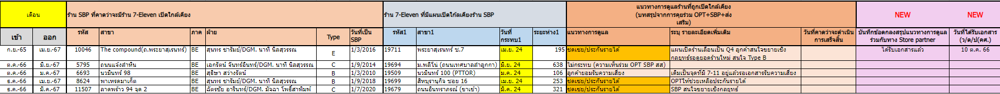

**Notes (คำอธิบาย/แนวทาง):**

> จัดทำโดย: ISS  โดยใช้ข้อมูลจาก UR และเพิ่มเติมรายละเอียดให้ชัดเจน มากขึ้น วัดผลอย่างไร

---

## Slide 8 — ผลประโยชน์ทางธุรกิจ (บอกตัวชี้วัด, ประโยชน์, เป้าหมาย โดยนำ SMART มาใช้ )

- 1.3 Business Benefit & Goal

  - ผลประโยชน์ทางธุรกิจ (บอกตัวชี้วัด, ประโยชน์, เป้าหมาย โดยนำ SMART มาใช้ )

| ตัวชี้วัด | ประโยชน์ (เพิ่ม/ลด) | ปัจจุบัน | เป้าหมาย |
| --- | --- | --- | --- |
| ระเบียบ/กฏหมาย  (มีข้อบังคับหรือไม่) | - | - | - |
| ยอดขาย  (เพิ่มขึ้นหรือไม่) | - | - | - |
| ต้นทุนในการทำธุรกิจ (ลดลงหรือไม่) | ลดค่าใช้จ่ายในการเปิด SR | ประมาณ 20,000 บาท/เดือน | ลดลง 100% |
| อื่นๆ |  |  |  |

**Notes (คำอธิบาย/แนวทาง):**

> จัดทำโดย: ISS  โดยใช้ข้อมูลจาก UR และเพิ่มเติมรายละเอียดให้ชัดเจน มากขึ้น วัดผลอย่างไร

---

## Slide 9 — 1.6 Stakeholder

- 1.6 Stakeholder

| Roles | Name | Department |
| --- | --- | --- |
| Project Sponsor | วรเดช  เลิศโรจน์ปัญญา | สำนักบริหาร Store Business Partner |
| Project Owner | ชาญชัย  วัชระรัตนาวลี | สำนักบริหาร Store Business Partner |
| Business Project Manager | ศิริพร  เหล่าวิวัฒน์เกษม เจษฎา  สินธวิชัย | สำนักบัญชี Business Partner ธุรกิจค้าปลีก สำนักบริหาร Store Business Partner |
| Business User | วารุณี แย้มสุข หน่วยงานส่งเสริมธุรกิจ SBP(ตำแหน่งฝ่าย และ GM) พาสน์ณรงค์  นิธิคุณิตานันท์ เสาวคนธ์  ป้านสะอาด ศิริเกศ  กิจบุรี ญานิศา  กามุณี | สำนักบัญชี Business Partner ธุรกิจค้าปลีก สำนักบริหาร Store Business Partner สำนักบริหาร Store Business Partner สำนักบริหาร Store Business Partner สำนักบริหาร Store Business Partner สำนักบริหาร Store Business Partner |
| Business Analyst | กัญญารัตน์ สิรธนานันท์ อาทิตย์ สุวรรณชัย | Digital Solution |
| Solution Architect |  |  |

**Notes (คำอธิบาย/แนวทาง):**

> จัดทำโดย: ISS

---

## Slide 10 — Timing Constraint (เช่น จำเป็นต้องเสร็จภายในเมื่อไหร่เพื่ออะไร)

- 1.5 Business Constraint

- Timing Constraint (เช่น จำเป็นต้องเสร็จภายในเมื่อไหร่เพื่ออะไร)
- Resource: (เช่น มีข้อจำกัดเรื่องคนที่เข้ามาทำงานในกระบวนการ)
- ในตำแหน่ง (รักษาการ) ผู้จัดการฝ่าย ระบบไม่สามารถ set ให้เป็นผู้อนุมัติได้ เพราะระบบยึดตำแหน่งจากระบบ HR Connect
- Budget: (ข้อจำกัดเรื่องงบประมาณ)

**Notes (คำอธิบาย/แนวทาง):**

> จัดทำโดย: ISS

---

## Slide 11 — 1.7 Business Process List

- 1.7 Business Process List

- ระบบ AllMap ดึงข้อมูลตามรัศมี 1-2 กม (กทม 1 กม) (มณฑล 2 กม) ----> ระบบทำแบบ Auto
- SBP เปิดเรื่องเพื่อทำการชดเชยประกันรายได้
- ผู้บริหาร ทำการอนุมัติ เพื่อทำการชดเชยประกันรายได้
- หน่วยงาน Store Retention คำนวณผลกระทบ (คำนวณยอดขาย 15 วันหลังร้านเปิด)
- หน่วยงาน Finance & Account คำนวณยอดเงินประกัน
- สำนัก SBPM ตรวจสอบข้อมูลภายใน AllMap (หน่วยงานวิเคราะห์ข้อมูล)
- หน่วยงานบัญชีชดเชยผลกระทบให้ร้าน SBP
- หน่วยงานที่ทำ
- หน่วยงานวิเคราะห์ข้อมูล และ ระบบ SBP
- หน่วยงานส่งเสริม
- หน่วยงานบัญชี

---

## Slide 12 — 1.7 Business Process List

- 1.7 Business Process List

- สร้างเอกสารเรื่องชดเชยรายได้
- สร้างเรื่องชดเชยรายได้ --> ผู้บริหาร SBP Approve ---> เปิดเรื่องได้
- สร้างเรื่องชดเชยรายได้ --> ผู้บริหาร SBP หยุดชดเชย --> เปิดเรื่องไม่ได้
- กรณีต้องการเปิดเรื่องซ้ำอีก --> ไม่สามารถเปิดซ้ำในร้านเดิมได้--> เปิด BSR ??/Incident??
- ตรวจสอบยอดเงินประกันรายได้ หลัง Approve เปิดเรื่องชดเชยรายได้
- ผู้บริหาร SBP ส่งต่อมอบหมายงาน
- ทีมวิเคราะห์ SBP ตรวจสอบและคำนวณยอดเงินชดเชยรายได้
  - แก้ไขยอดเงินชดเชยประกันรายได้
- ผู้บริหาร SBP ได้รับยอดเงิน และส่งต่อยอดเงิน
- ฝ่ายส่งเสริม ตรวจสอบ
  - Approve --> ส่งต่อ GM ส่งเสริม
  - Reject --> ตีกลับ ผู้บริหาร SBP --> จบ Flow
- GM ส่งเสริม
  - Approve --> ส่งต่อบัญชี
  - Reject --> ตีกลับให้ ่ฝ่ายส่งเสริม
- บัญชี ตรวจสอบ
- Approve --> จบ Flow
- Reject --> ตีกลับให้ ทีมทีมวิเคราะห์ ?? (น่าจะตีกลับไปยังส่งเสริม รบกวนตรวจสอบพี่ปูเป้อีกครั้ง)

**Notes (คำอธิบาย/แนวทาง):**

> Critical Level Definition :
> - Critical: Function ที่มีกระทบกับการขาย สั่ง, ส่ง และกระทบโดยตรงรายได้ของบริษัทฯ
>  Major: Function ที่สนับสนุนการขาย สั่ง, ส่ง และกระทบทางอ้อมรายได้ของบริษัทฯ
>  Minor: Function ที่ไม่กระทบกับการขาย สั่ง, ส่ง และรายได้ของบริษัทฯ
>  General : Function ที่กระทบกับการทำงานเพียงเล็กน้อย และสามารถใช้ Function อื่นทดแทนได้

---

## Slide 13 — วงเงินการ Approve ค่าใช้จ่ายระบบชดเชยประกันรายได้

- วงเงินการ Approve ค่าใช้จ่ายระบบชดเชยประกันรายได้

| ตำแหน่งย่อ | ระดับของผู้ได้รับมอบอำนาจ | วงเงินอนุมัติ/รายการ |
| --- | --- | --- |
| GM | ผู้จัดการทั่วไป รองผู้จัดการทั่วไป ผู้ช่วยผู้จัดการทั่วไป หรือเทียบเท่า | 50,000 |
| AVP | ผู้ช่วยกรรมการผู้จัดการ หรือเทียบเท่า | 300,000 |

**Notes (คำอธิบาย/แนวทาง):**

> Critical Level Definition :
> - Critical: Function ที่มีกระทบกับการขาย สั่ง, ส่ง และกระทบโดยตรงรายได้ของบริษัทฯ
>  Major: Function ที่สนับสนุนการขาย สั่ง, ส่ง และกระทบทางอ้อมรายได้ของบริษัทฯ
>  Minor: Function ที่ไม่กระทบกับการขาย สั่ง, ส่ง และรายได้ของบริษัทฯ
>  General : Function ที่กระทบกับการทำงานเพียงเล็กน้อย และสามารถใช้ Function อื่นทดแทนได้

---

## Slide 14 — 1.8 As-Is Business Process

- 1.8 As-Is Business Process

- แก้ไขระบบการสร้างเอกสารชดเชยรายได้

---

## Slide 15 — กระบวนการชดเชยรายได้-กระบวนการชดเชยรายได้ 27112025 AS-Is.svg

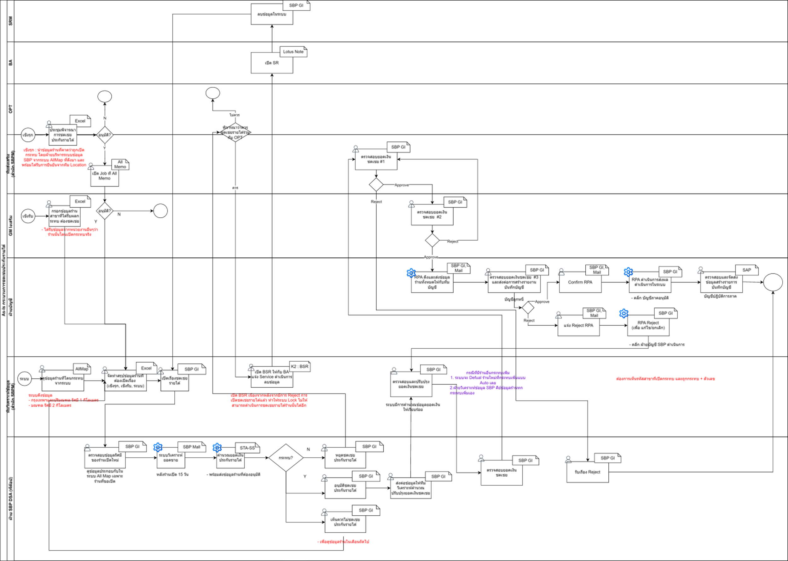

- กระบวนการชดเชยรายได้-กระบวนการชดเชยรายได้ 27112025 AS-Is.svg

- 1.8 As-Is Business Process

- Step 0

- Step 2.0

- Step 2.1

- Step 3

- Step 1.0

- Step 1.2

- เปลี่ยนยอดเงิน โดยพิจารณาจาก??

- Step 1.3

- Step 1.1

---

## Slide 16 — 1.8 As-Is Business Process

- กระบวนการชดเชยรายได้ 09012026.svg

- 1.8 As-Is Business Process

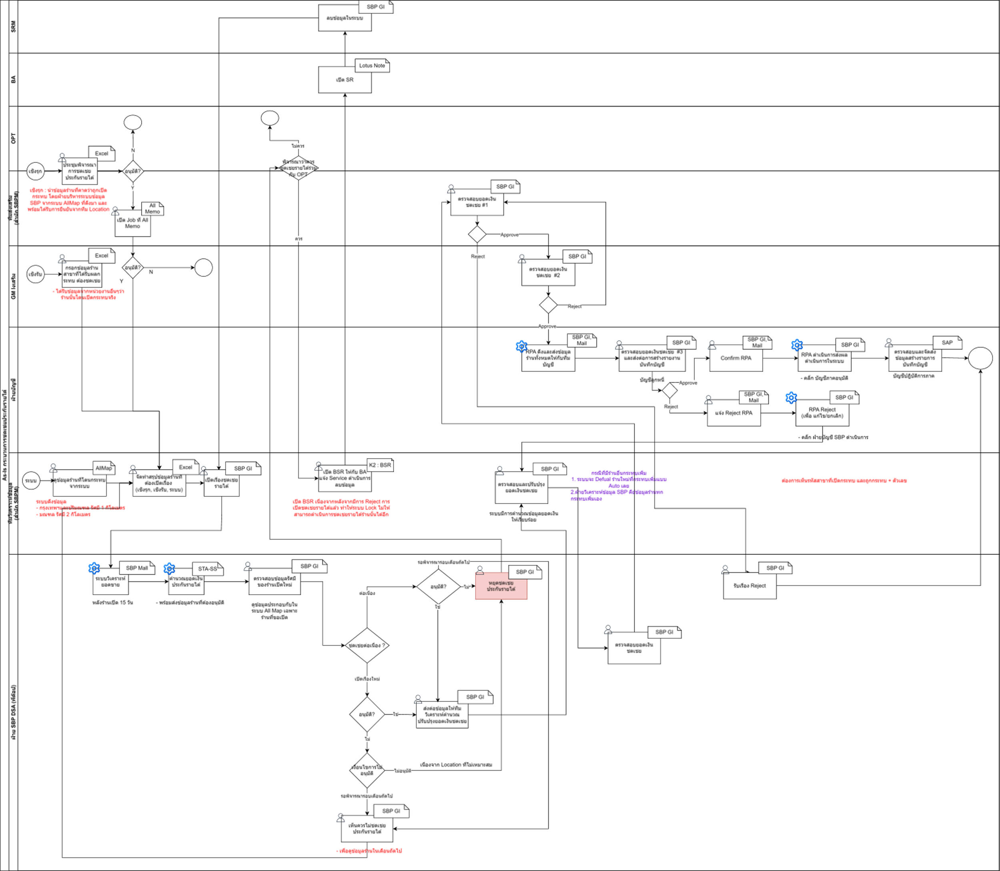

- Step 0

- Step 2.1

- Step 2.0

- Step 3

- Step 1.0

- Step 1.2

- Step 1.3

- Step 1.1

---

## Slide 17 — 1.8 As-Is Business Process

- 1.8 As-Is Business Process

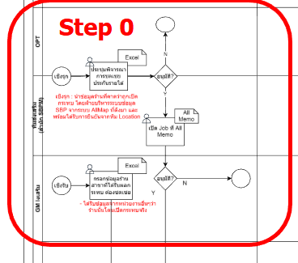

- Step 0 ทีมวิเคราะห์ข้อมูล (SBP) : รวบรวมข้อมูลร้านที่ต้องชดเชยประกันรายได้

- ข้อมูลร้านจาก 3 แหล่ง ดังนี้
- จากระบบ : ระบบดึงข้อมูลจาก AllMap
- เชิงรุก : ประชุมพิจารณาการชดเชยประกันรายได้
- เชิงรับ : รับแจ้งข้อมูลจากหน่วยงานอื่นๆ

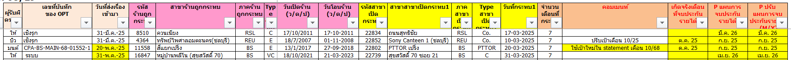

---

## Slide 18 — 1.8 As-Is Business Process

- เอกสาร : หน้าจอการใช้งาน

- 1.8 As-Is Business Process

- Step 1 ทีมวิเคราะห์ข้อมูล (SBP) : สร้างเอกสารชดเชยประกันรายได้

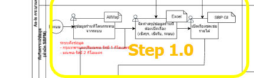

- สร้างเอกสารกรอกข้อมูลร้านที่ต้องชดเชยรายได้่ จากข้อมูลเชิงรุกและเชิงรับ

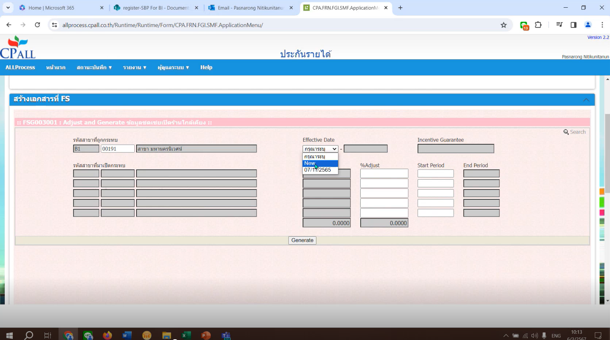

- ดูหน้าจอตอนที่สร้างเอกสาร + ออกแบบหน้าจอ To-Be เพิ่มด้วย

---

## Slide 19 — 1.8 As-Is Business Process

- เอกสาร : หน้าจอการใช้งาน

- 1.8 As-Is Business Process

- Step 1.1 ฝ่าย SBP DSA : หน้าจอการ Approve เปิดชดเชยรายได้ + Approve ค่าใช้จ่าย

- พิจารณาการเปิดเรื่องชดเชยรายได้ เพื่อส่งกลับให้เจ้าหน้าที่ SBP DSA ตรวจสอบแก้ไขยอดค่าใช้จ่าย
- เจ้าหน้าที่ SBP DSA ส่งกลับให้ฝ่าย SBP DSA พิจารณาเพื่อส่งต่อให้ทีมส่งเสริม

---

## Slide 20 — 1.8 As-Is Business Process

- เอกสาร : หน้าจอการใช้งาน

- Step 1.1 ฝ่าย SBP DSA : หน้าจอการ Approve เปิดชดเชยรายได้ + Approve ค่าใช้จ่าย

- 1.8 As-Is Business Process

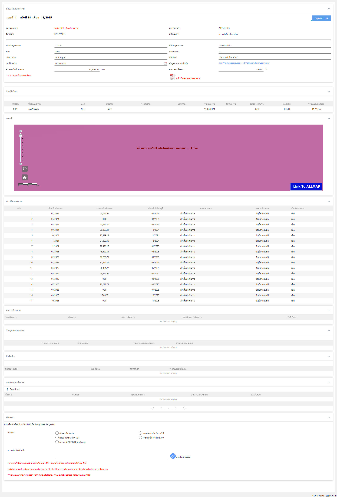

---

## Slide 21 — 1.8 As-Is Business Process

- เอกสาร : หน้าจอการใช้งาน

- 1.8 As-Is Business Process

- Step 1.1 ฝ่ายSBP DSA : หน้าจอการ Approve เปิดชดเชยรายได้ + Approve ค่าใช้จ่าย

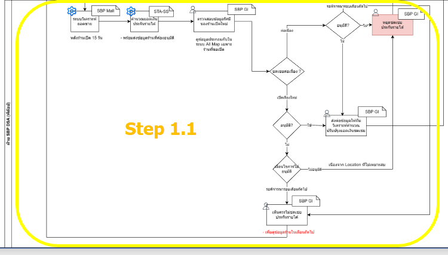

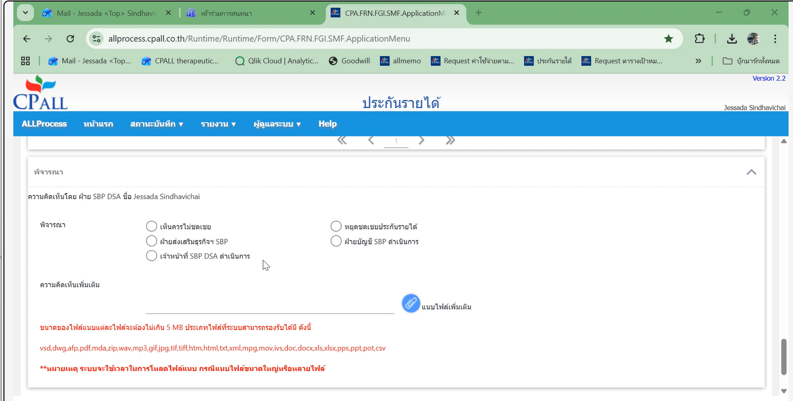

- สรุปปุ่มการใช้งานในปัจจุบัน ดังนี้
- ปุ่ม เห็นควรไม่ชดเชย : ไม่ชดเชยในรอบนี้ ระบบยังคงสามารถส่ง Flow ขอเปิดเรื่องในรอบถัดไปได้
- ปุ่ม หยุดชดเชยรายได้ : Reject (จบ Flow)
- ปุ่ม ฝ่ายส่งเสริมธุรกิจ SBP : ส่งต่อ Flow หลังทราบยอดเงินชดเชยรายได้จากเจ้าหน้าที่ SBP DSA ดำเนินการ
- ปุ่ม เจ้าหน้าที่ SBP DSA ดำเนินการ : Approve เพื่อเปิดเรื่อง + มอบหมายงานให้ เจ้าหน้าที่ SBP DSA ดำเนินการ
- หมายเหตุ : ปัจจุบันไม่มีการใช้ ปุ่ม ฝ่ายบัญชี SBP ดำเนินการ

---

## Slide 22 — 1.8 As-Is Business Process

- เอกสาร : หน้าจอการใช้งาน

- 1.8 As-Is Business Process

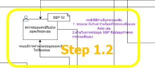

- Step 1.2 เจ้าหน้าที่ SBP DSA :ตรวจสอบและแก้ไขยอดเงินชดเชย

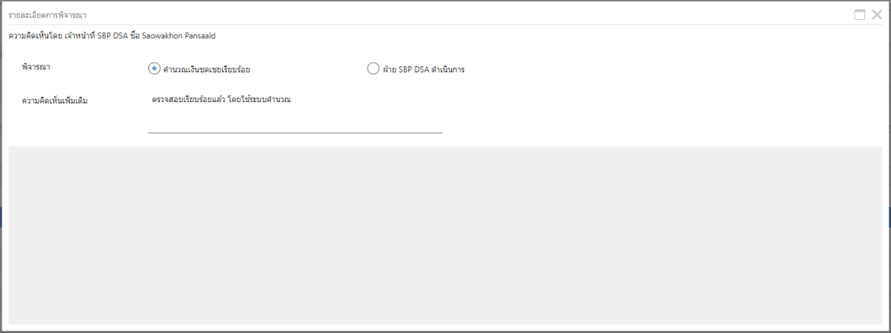

---

## Slide 23 — 1.8 As-Is Business Process

- เอกสาร : หน้าจอการใช้งาน

- 1.8 As-Is Business Process

- Step 1.3 ผู้บริหาร SBP DSA : หน้าจอการ Approve เปิดชดเชยรายได้ + Approve ค่าใช้จ่าย

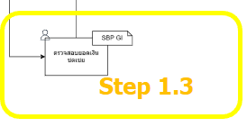

---

## Slide 24 — 1.8 As-Is Business Process

- เอกสาร : หน้าจอการใช้งาน

- 1.8 As-Is Business Process

- Step 2.0 ฝ่ายส่งเสริม : Approve ค่าใช้จ่าย

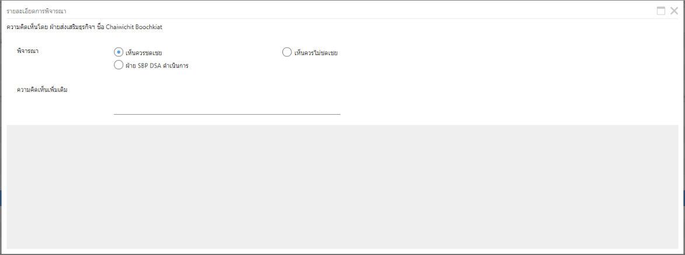

---

## Slide 25 — 1.8 As-Is Business Process

- เอกสาร : หน้าจอการใช้งาน

- 1.8 As-Is Business Process

- Step 2.1 GMส่งเสริม : Approve ค่าใช้จ่าย

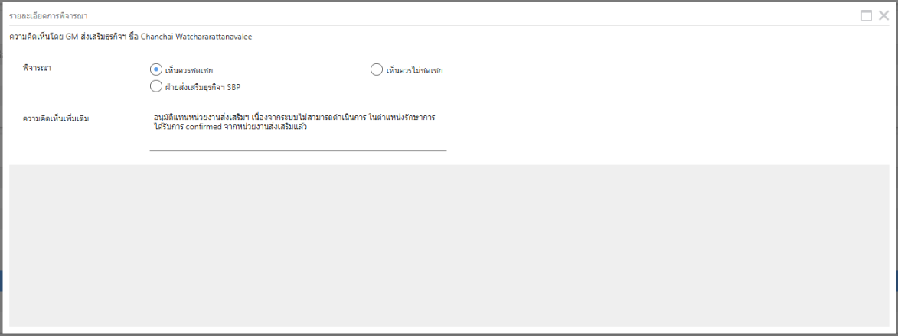

---

## Slide 26 — 1.8 As-Is Business Process

- เอกสาร : หน้าจอการใช้งาน

- 1.8 As-Is Business Process

- บัญชี : Approve ค่าใช้จ่าย

- RPAดำเนินการีดึงข้อมูลร้านจาก SBP Mall ให้กับทีมบัญชีตรวจสอบ

- บัญชีดำเนินการตรวจสอบ

- 1

- 2

- 3

- 1. ตรวจสอบยอดเงินคำนวณ 3 จุดตรงคำนวณตรงกัน
- 2. ตรวจสอบPerformance Index ข้อมูลคะแนนมาตรฐาน มาจาก QSSI

- 3. ตรวจสอบสาขาที่ถูกกระทบ และ สาขาที่เปิดใกล้เคียง
- 4. ตรวจสอบเพิ่มกรณีที่เป็นร้าน Take “สาขาที่ถูกกระทบ “
- 5. Center ตรวจสอบจากรายงานประกันรายได้จากระบบ K2
- กระทบยอดกับ SAP และ Post คู่ Acc ถูกต้อง

- 2

- กรณีที่ยอดไม่ตรง
- 1. เนื่องจากระบบ K2 คำนวณจำนวนที่ชดเชย ไม่ตรงตาม File PDF
- 2. เนื่องจากต้นทางแจ้งข้อมูลไม่ถูกต้องและครบถ้วน

---

## Slide 27 — 1.8 As-Is Business Process

- เอกสาร : หน้าจอการใช้งาน

- 1.8 As-Is Business Process

- บัญชี : Approve ค่าใช้จ่าย

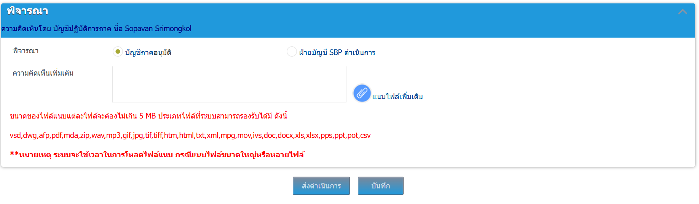

- RPAดำเนินการดึงข้อมูลร้านจาก SBP  Mall ให้กับทีมบัญชีตรวจสอบ

- การอนุมัติบันทึกจำนวน 150-170 ต่อเดือน
- ระยะเวลาทำการอนุมัติ ประมาณ 4 นาที /ฉบับ
- คำนวณตามเวลา 4 นาที *150 ฉบับ/เดือน= 600 นาที / 10 ชม.
- ผจก.แผนกตรวจสอบข้อมูลใน Flow K2 ตรวจสอบพร้อมอนุมัติ
- ประมาณ 5 นาทีต่อฉบับ

- Form/CPA.FRN.FGI.SMF.ApplicationMenu

---

## Slide 28 — 1.8 As-Is Business Process

- เอกสาร : หน้าจอการใช้งาน

- 1.8 As-Is Business Process

- แก้ไขระบบการสร้างเอกสารชดเชยรายได้
- ปัญหา : กรณีมีการคลิ๊กไม่อนุมัติประกันรายได้จากผู้บริหาร (วิเคราะห์ข้อมูลและระบบ SBP) ทำให้ไม่สามารถดำเนินการสร้างชดเชยรายได้ได้ใหม่
- ตัวอย่างปัญหาที่พบ
- การแก้ปัญหาเบื้องต้น : เปิด SR ให้ทางGosolf เพื่อให้สามารถสร้างเอกสารการชดเชยใหม่ได้

- พบปัญหาเดือนละประมาณ 5 สาขา

- ร้านสาขา A ถูกกระทบจากการเปิด ร้านสาขา B ----> ทีม SBP ส่งเรื่องชดเชยรายได้ในระบบ ---> ผู้บริหารมองว่าไม่กระทบ ---> คลิ๊กไม่อนุมัติ  ----> ไม่ชดเชยรายได้

- ยอดขายร้าน A ถูกกระทบโดยร้าน B ----> ทีม SBP เปิดชดเชยรายได้ในระบบ ----> ไม่สามารถเปิดเอกสารชดเชยรายได้ได้ (เนื่องจากระบบมีบันทึกเคยมีการไม่อนุมัติการชดเชยรายได้ไปแล้ว ทำให้ไม่สามารถสร้างเอกสารชดเชยสาขาเดิมได้)

---

## Slide 29 — 1.8 As-Is Business Process

- เอกสาร : หน้าจอการใช้งาน

- 1.8 As-Is Business Process

- แก้ไขระบบการสร้างเอกสารชดเชยรายได้
- ไม่สามารถเปิดเอกสารชดเชยรายได้ได้ เนื่องจากมีการไม่อนุมัติการชดเชยประกันรายได้ไปแล้ว ระบบจึงล็อคไม่ให้สามารถ เพิ่มวันที่สำหรับร้านที่เปิดกระทบและไม่สามารถสร้างเอกสารชดเชยรายได้ได้ จึงเปิด SR ให้ทางGosolf เพื่อให้สามารถสร้างเอกสารการชดเชยใหม่ได้

- หน้าจออนุมัติของผู้บริหาร

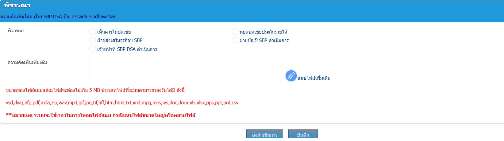

---

## Slide 30 — 1.8 As-Is Business Process

- Note : แก้ไขในส่วนของเอกสารทุกไทป์

- 1.8 As-Is Business Process

- เอกสาร : หน้าจอการใช้งาน

- แก้ไขระบบการสร้างเอกสารชดเชยรายได้
- ไม่สามารถเปิดเอกสารชดเชยรายได้ได้ เนื่องจากมีการไม่อนุมัติการชดเชยประกันรายได้ไปแล้ว ระบบจึงล็อคไม่ให้สามารถ เพิ่มวันที่สำหรับร้านที่เปิดกระทบและไม่สามารถสร้างเอกสารชดเชยรายได้ได้ จึงเปิด SR ให้ทางGosolf เพื่อให้สามารถสร้างเอกสารการชดเชยใหม่ได้

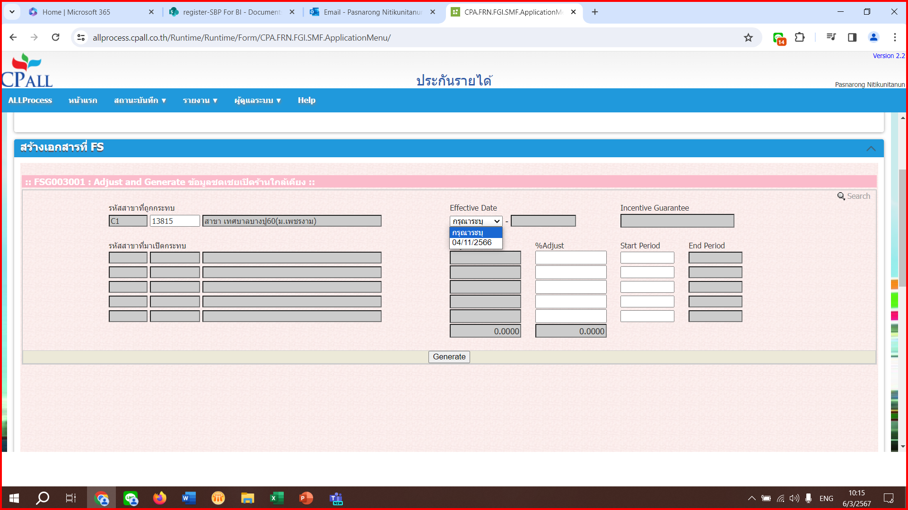

- หน้าจอการสร้างเอกสารของทีม SBP หลังจากที่ผู้บริหารไม่อนุมัติไปแล้ว และต้องการเปิดเอกสารอีกครั้ง

- ไม่แสดงตัวเลือก "New" เพื่อเพิ่มร้านสาขา B ที่เปิดกระทบร้านสาขา A ได้

- ร้านสาขา A

---

## Slide 31 — 1.8 As-Is Business Process

- 1.8 As-Is Business Process

- แก้ไขระบบการสร้างเอกสารชดเชยรายได้
- เปิด SR ให้ทางGosolf เพื่อให้แก้ไขและสามารถสร้างเอกสารการชดเชยใหม่ได้

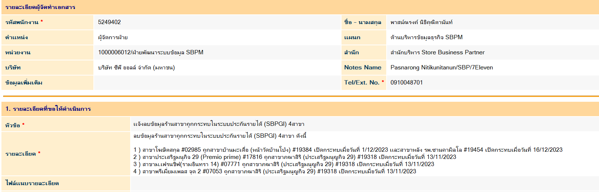

---

## Slide 32 — ตัวอย่างหน้าจอในระบบ

- ตัวอย่างหน้าจอในระบบ

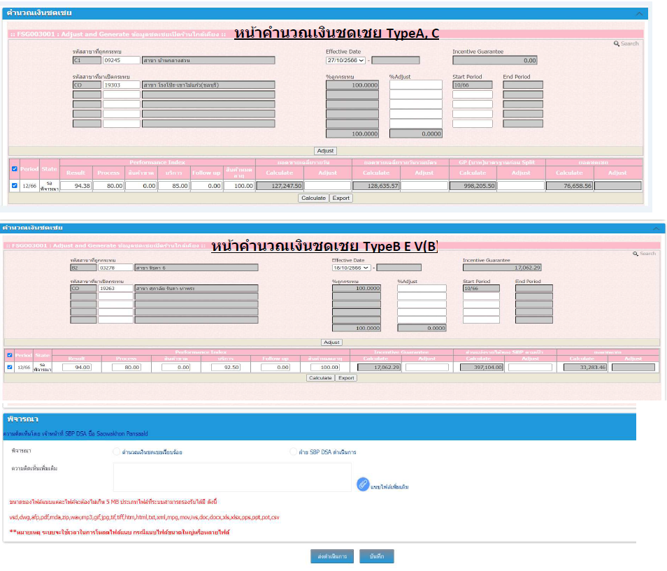

- เอกสาร : หน้าจอการใช้งาน

- หากผู้บริหารไม่ทำการอนุมัติและหยุดประกันรายได้แล้ว จะไม่สามารถสร้างเอกสารสาขาเดิมและคู่ชนเดิมมาชดเชยรายได้ได้เลย จึงต้องทำการเปิด SR

---

## Slide 33 — ตัวอย่างหน้าจอ "หน้าคำนวณชดเชย Type A, C"

- เอกสาร : หน้าจอการใช้งาน

- ตัวอย่างหน้าจอ "หน้าคำนวณชดเชย Type A, C"

- หน้าคำนวณชดเชย Type A, C ภายในตารางชดเชยรายได้ ประกอบด้วย Perfoemance Index, ยอดขายเฉลี่ยรายวัน, ยอดขายเฉลี่ยรายวันรวมบัตร, GP(บาท)มาตรฐานก่อน Split และยอดชดเชย

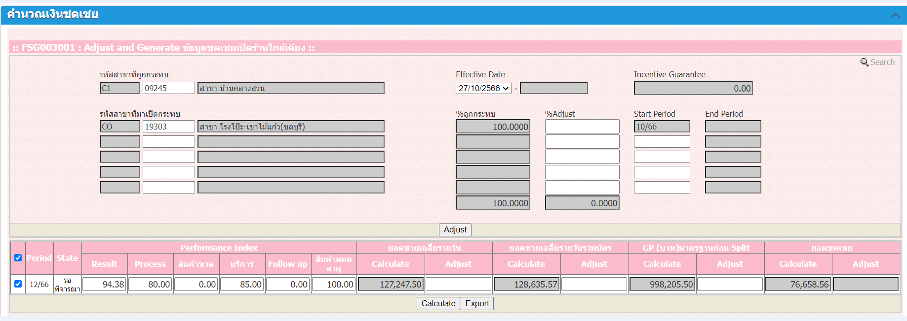

---

## Slide 34 — ตัวอย่างเอกสารแนบ Type A, C

- ตัวอย่างเอกสารแนบ Type A, C

- เอกสาร : หน้าจอการใช้งาน

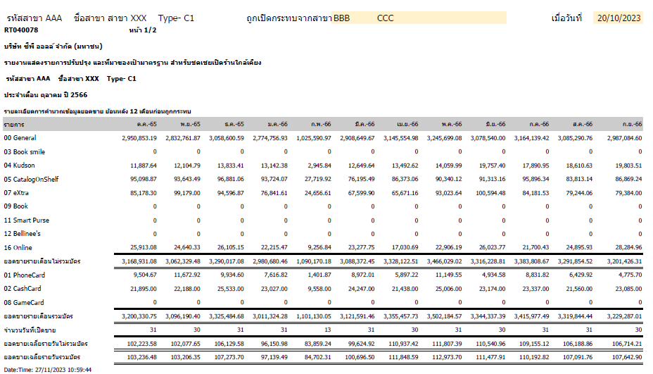

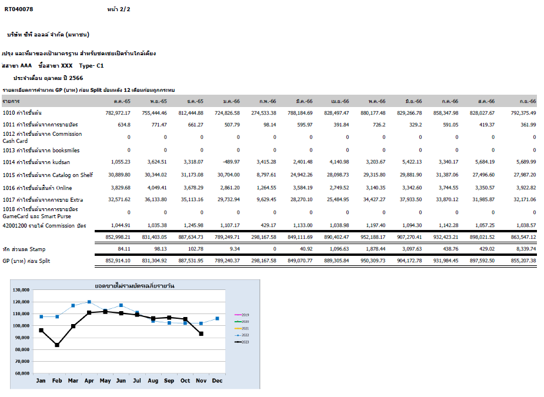

---

## Slide 35 — ตัวอย่างเอกสารแนบ Type A, C

- ตัวอย่างเอกสารแนบ Type A, C

- เอกสาร : หน้าจอการใช้งาน

---

## Slide 36 — ตัวอย่างหน้าจอ "หน้าคำนวณชดเชย Type B, E, V(B)"

- เอกสาร : หน้าจอการใช้งาน

- ตัวอย่างหน้าจอ "หน้าคำนวณชดเชย Type B, E, V(B)"

- หน้าคำนวณชดเชย Type B, E, V(B) ภายในตารางชดเชยรายได้ ประกอบด้วย Performance Index, Incentive Guarantee, ส่วนแบ่งรายได้ของ SBP ตามเป้า และยอดชดเชย

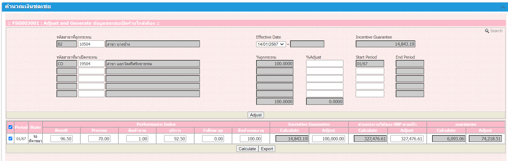

---

## Slide 37 — ตัวอย่างเอกสารแนบ Type B, E, V(B)

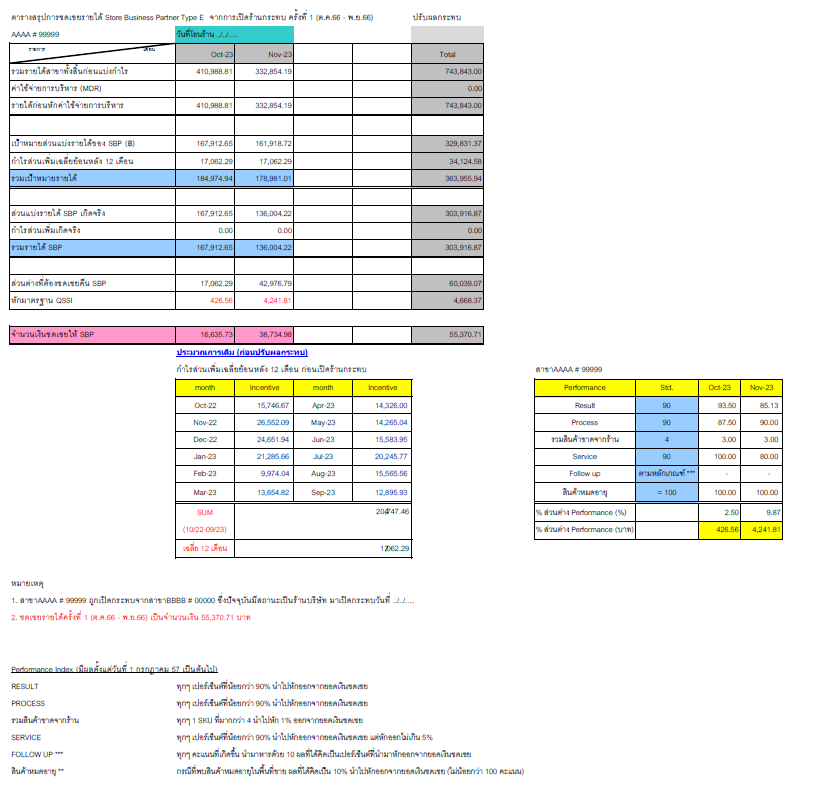

- เอกสาร : หน้าจอการใช้งาน

- ตัวอย่างเอกสารแนบ Type B, E, V(B)

---

## Slide 38 — 1.8 As-Is Business Process

- เอกสาร : หน้าจอการใช้งาน

- 1.8 As-Is Business Process

- 2.  ปรับสิทธิ์การตรวจสอบยอดชดเชยรายได้และกระบวนการทำงาน ของทีมส่งเสริม

- ปรับสิทธิ์การตรวจสอบยอดชดเชยรายได้

| ตำแหน่งย่อ | ระดับของผู้ได้รับมอบอำนาจ | วงเงินอนุมัติ/รายการ |
| --- | --- | --- |
| GM | ผู้จัดการทั่วไป รองผู้จัดการทั่วไป ผู้ช่วยผู้จัดการทั่วไป หรือเทียบเท่า | 50,000 |
| AVP | ผู้ช่วยกรรมการผู้จัดการ หรือเทียบเท่า | 300,000 |

- ลำดับการ Approve ยอดค่าใช้จ่ายไม่เกิน 50,000
- กลั่นกรอง : ฝ่ายส่งเสริม
- Approve : GM ส่งเสริม

- ลำดับการ Approve ยอดค่าใช้จ่าย 50,001 - 300,000
- กลั่นกรอง1 : ฝ่ายส่งเสริม
- กลั่นกรอง2 : GM ส่งเสริม
- Approve : AVP สำนัก SBPM

---

## Slide 39 — 1.8 As-Is Business Process

- เอกสาร : หน้าจอการใช้งาน

- 1.8 As-Is Business Process

- 2.  ปรับสิทธิ์การตรวจสอบยอดชดเชยรายได้และกระบวนการทำงาน ของทีมส่งเสริม

- ปรับกระบวนการทำงานส่งเสริม กรณีเห็นควรไม่ชดเชย

- ระดับ หน่วยงานส่งเสริม​
  - กรณีเห็นควรไม่ชดเชย
    - As-Is : เห็นควรไม่ชดเชย > ตีกลับ "ฝ่าย SBP DSA" รับทราบ คลิ๊ก เห็นควรไม่ชดเชย >  "ไม่อนุัมติในเดือนนั้นๆ"จบกระบวนการ
- ระดับ GM ส่งเสริม
  - กรณีเห็นควรไม่ชดเชย
    - As-Is : เห็นควรไม่ชดเชย > ตีกลับ "ฝ่ายส่งเสริม SBP " รับทราบ คลิ๊ก เห็นควรไม่ชดเชย >  ตีกลับ "ฝ่าย SBP DSA" รับทราบ คลิ๊ก เห็นควรไม่ชดเชย "ไม่อนุมัติในเดือนนั้นๆ"จบกระบวนการ

---

## Slide 40 — 1.8 As-Is Business Process

- เอกสาร : หน้าจอการใช้งาน

- 1.8 As-Is Business Process

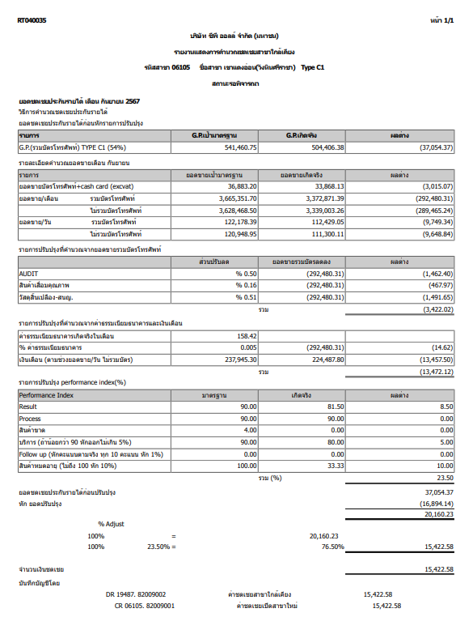

- 3.   ปรับระบบยกเลิก Process บัญชี SBP ในการ Approve ค่าใช้จ่าย ในการชดเชยรายได้

- RPAดำเนินการีดึงข้อมูลร้านจาก SBP Mall ให้กับทีมบัญชีตรวจสอบ

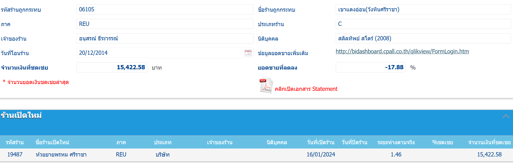

- บัญชีดำเนินการตรวจสอบ

- 1

- 2

- 3

- 1. ตรวจสอบยอดเงินคำนวณ 3 จุดตรงคำนวณตรงกัน
- 2. ตรวจสอบPerformance Index ข้อมูลคะแนนมาตรฐาน มาจาก QSSI

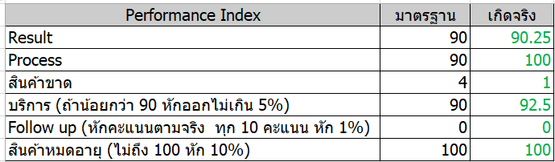

- 3. ตรวจสอบสาขาที่ถูกกระทบ และ สาขาที่เปิดใกล้เคียง
- 4. ตรวจสอบเพิ่มกรณีที่เป็นร้าน Take “สาขาที่ถูกกระทบ “
- 5. Center ตรวจสอบจากรายงานประกันรายได้จากระบบ K2
- กระทบยอดกับ SAP และ Post คู่ Acc ถูกต้อง

- 2

- กรณีที่ยอดไม่ตรง
- 1. เนื่องจากระบบ K2 คำนวณจำนวนที่ชดเชย ไม่ตรงตาม File PDF
- 2. เนื่องจากต้นทางแจ้งข้อมูลไม่ถูกต้องและครบถ้วน

---

## Slide 41 — 1.8 As-Is Business Process

- เอกสาร : หน้าจอการใช้งาน

- 1.8 As-Is Business Process

- 3.   ปรับระบบยกเลิก Process บัญชี SBP ในการ Approve ค่าใช้จ่าย ในการชดเชยรายได้

- RPAดำเนินการดึงข้อมูลร้านจาก SBP  Mall ให้กับทีมบัญชีตรวจสอบ และ ส่งดำเนินการ

- การอนุมัติบันทึกจำนวน 150-170 ต่อเดือน
- ระยะเวลาทำการอนุมัติ ประมาณ 4 นาที /ฉบับ
- คำนวณตามเวลา 4 นาที *150 ฉบับ/เดือน= 600 นาที / 10 ชม.
- ผจก.แผนกตรวจสอบข้อมูลใน Flow K2 ตรวจสอบพร้อมอนุมัติ
- ประมาณ 5 นาทีต่อฉบับ

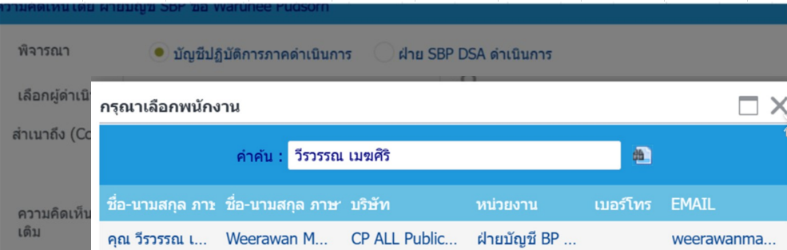

- Form/CPA.FRN.FGI.SMF.ApplicationMenu

---

## Slide 42 — 1.8 As-Is Business Process

- เอกสาร : หน้าจอการใช้งาน

- 1.8 As-Is Business Process

- 3.   ปรับระบบยกเลิก Process บัญชี SBP ในการ Approve ค่าใช้จ่าย ในการชดเชยรายได้

- RPAดำเนินการีดึงข้อมูลร้านจาก SBP Mall ให้กับทีมบัญชีตรวจสอบ

- กรณีเรียกดูข้อมูลสถานะการดำเนินการ
- สถานะคงค้าง : บังคับ Required Field สถานะ
- สถานะเสร็จสิ้นดำเนินการ : บังคับ Required Field สถานะ , Period Statement

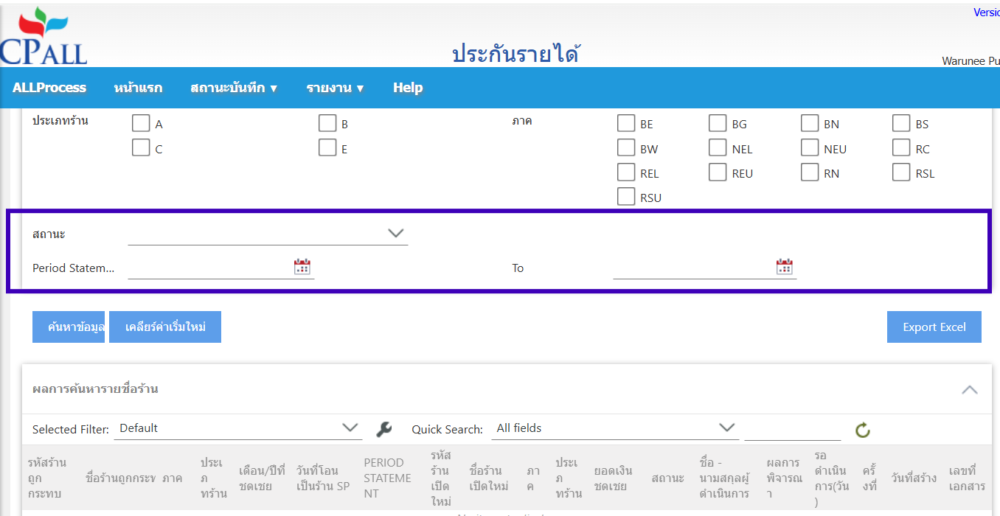

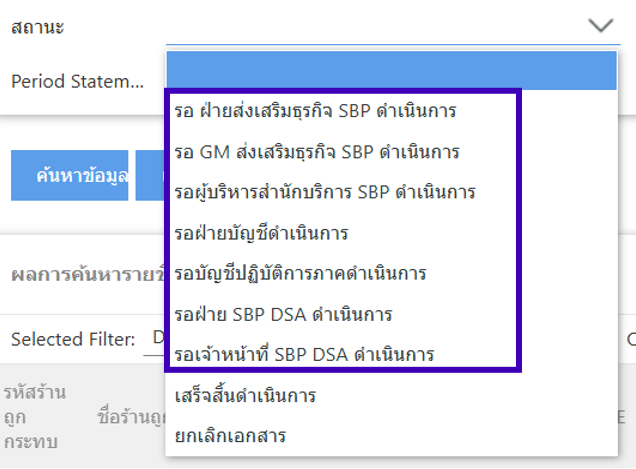

---

## Slide 43 — 1.9 To-Be Business Process

- 1.9 To-Be Business Process

- แก้ไขระบบการสร้างเอกสารชดเชยรายได้
- ปรับระบบยกเลิก Process บัญชี SBP ในการ Approve ค่าใช้จ่าย ในการชดเชยรายได้

---

## Slide 44 — 1.9 To-Be Business Process

- กระบวนการชดเชยรายได้-To-Be 02012026.svg

- 1.9 To-Be Business Process

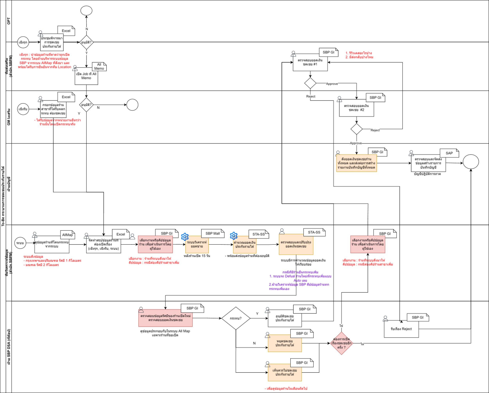

- Step2

- Step3

- Step1

- Step1.2

- Step1.1

---

## Slide 45 — 1.9 To-Be Business Process

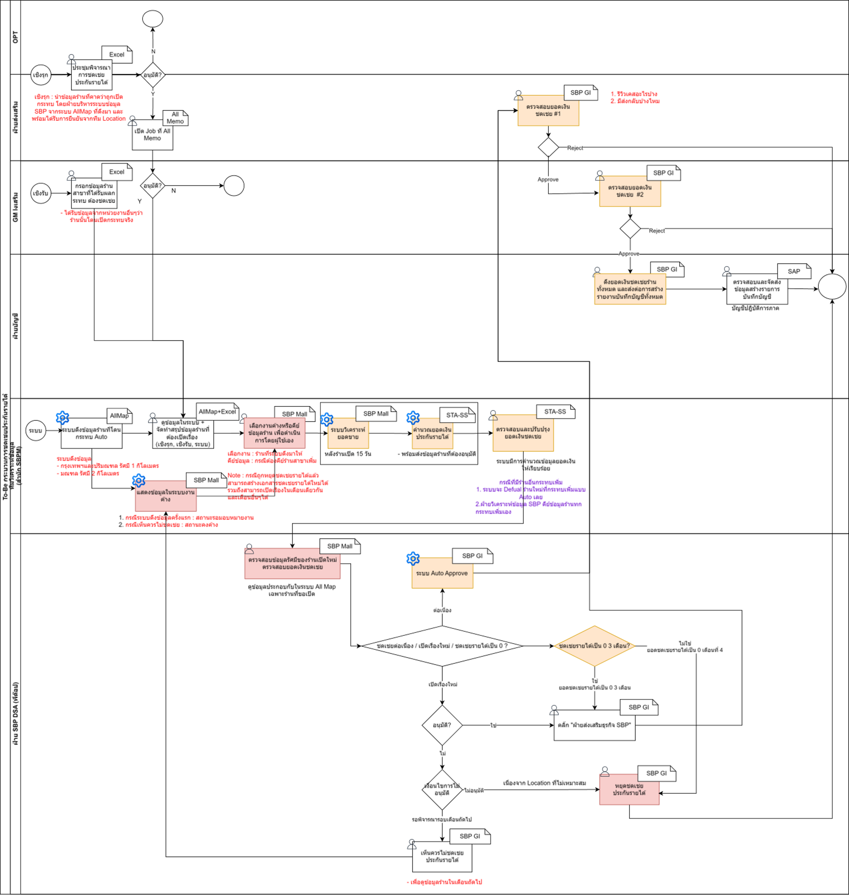

- 1.9 To-Be Business Process

- กระบวนการชดเชยรายได้-To-Be 120226.svg

---

## Slide 46 — 1.9 To-Be Business Process

- Note : แก้ไขในส่วนของเอกสารทุกType
- หลังพัฒนา ไม่มีการเปิด SR เพื่อลบข้อมูล

- 1.9 To-Be Business Process

- แก้ไขระบบการสร้างเอกสารชดเชยรายได้
  - เจ้าหน้าที่ SBP DSA สามารถ กรอกข้อมูลร้านเปิดกระทบ เพื่อคำนวณยอดชดเชยรายได้
  - กรณีไม่เห็นควรชดเชยรายได้ :
    - ระบบดำเนินการแสดงข้อมูลในเดือนถัดไป พร้อมผู้ดำเนินการคนเดิม
  - กรณีหยุดชดเชยรายได้ :
    - แก้ไขฝ่าย SBP DSA สามารถพิจารณาคำขอชดเชยรายได้อีกครั้งได้ โดยเจ้าหน้าที่ SBP DSA ต้องเป็นผู้ดำเนินการเลือกงานจากระบบหรือคีย์ข้อมูล

- ร้านสาขา A ถูกกระทบจากการเปิด ร้านสาขา B ----> เจ้าหน้าที่ SBP DSA เลือกงานจากระบบหรือคีย์ข้อมูลร้าน พร้อมปรับปรุงยอดชดเชย เพื่อดำเนินการโดยผู้ใช้เอง  ---> ฝ่าย SBP DSA พิจารณา ---> หยุดชดเชยรายได้ หรือ ไม่เห็นควรชดเชยรายได้

- กรณียืนยันต้องการชดเชยรายได้

- ฝ่าย SBP DSA พิจารณาเห็นควรชดเชย ----> ทีม SBP สามารถเลือกงานหรือคีย์ข้อมูลร้าน เพื่อดำเนินการโดยผู้ใช้เอง ----> สามารถเปิดเรื่องชดเชยในรอบเดือนเดียวกันหรือในเดือนถัดไป

---

## Slide 47 — 1.9 To-Be Business Process

- Note :
- กรณีระบบดึงข้อมูลชดเชยรายได้
- เจ้าหน้าที่ SBP DSA เข้ามาเลือกงานของตนเอง
- กรณีได้รับแจ้ง เชิงรุก เชิงรับ เพื่อเปิดชดเชยรายได้
- เจ้าของงานต้องดำเนินการคีย์ข้อมูลเอง

- เอกสาร : หน้าจอการใช้งาน

- 1.9 To-Be Business Process

- แก้ไขระบบการสร้างเอกสารชดเชยรายได้
- >>>แก้ไขให้สามารถสร้างรายการคำขอชดเชยรายได้ ของสาขาที่เคยถูกปฏิเสธการอนุมัติได้

- Step 1.0 To-Be : เพิ่มหน้าจองานค้าง สำหรับระบบแสดงข้อมูลร้านที่เข้าเงื่อนไข การเปิดกระทบ

- หน้าจอเจ้าหน้าที่ DSA : หน้าจองานค้าง

- การทำงานของหน้าจอคงค้าง
- แสดงรายชื่อร้านที่ควรชดเชยรายได้ โดยระบบแสดงข้อมูลร้านที่เข้าเงื่อนไข ที่หน้าจองานคงค้าง
- สามารถเข้ามาเลือกงาน และปรับแก้ไขยอดชดเชยรายได้ ของตนเอง
- สามารถคลิ๊กเพื่อดูรายละเอียดข้อมูลได้

---

## Slide 48 — 1.9 To-Be Business Process

- เอกสาร : หน้าจอการใช้งาน

- Note :
- กรณีระบบดึงข้อมูลชดเชยรายได้
- เจ้าหน้าที่ SBP DSA เข้ามาเลือกงานของตนเอง
- กรณีได้รับแจ้ง เชิงรุก เชิงรับ เพื่อเปิดชดเชยรายได้
- เจ้าของงานต้องดำเนินการคีย์ข้อมูลเอง

- 1.9 To-Be Business Process

- แก้ไขระบบการสร้างเอกสารชดเชยรายได้
- >>>แก้ไขให้สามารถสร้างรายการคำขอชดเชยรายได้ ของสาขาที่เคยถูกปฏิเสธการอนุมัติได้

- Step 1.0 To-Be : เพิ่มหน้าจองานค้าง สำหรับระบบแสดงข้อมูลร้านที่เข้าเงื่อนไข การเปิดกระทบ

- หน้าจอเจ้าหน้าที่ DSA : หน้าจองานค้าง

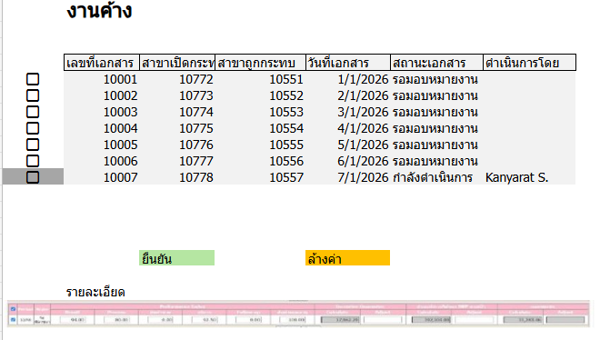

- เงื่อนไขการแสดงข้อมูลงาน
- กรณีเป็นเคสต่อเนื่อง ระบบส่งงานให้(เจ้าหน้าที่ SBP DSA) คนเดิมอัตโนมัติ
- กรณีฝ่าย SBP DSA คลิ๊ก "เห็นควรไม่ชดเชยรายได้" จะแสดงเจ้าของงานเป็นคนเดิมอัตโนมัติ
- สามารถ Filter เอกสารได้
- แสดง Chk list สำหรับเลือกดำเนินการหลายเอกสาร
- หน้าจอ popup เมื่อยืนยัน

- #กรณีพนักงานลาออก ต้องเปิด SR เพื่อแก้ไขชื่อผู้ดำเนินการ

---

## Slide 49 — 1.9 To-Be Business Process

- Note :
- กรณีระบบดึงข้อมูลชดเชยรายได้
- เจ้าหน้าที่ SBP DSA เข้ามาเลือกงานของตนเอง
- กรณีได้รับแจ้ง เชิงรุก เชิงรับ เพื่อเปิดชดเชยรายได้
- เจ้าของงานต้องดำเนินการคีย์ข้อมูลเอง

- เอกสาร : หน้าจอการใช้งาน

- 1.9 To-Be Business Process

- แก้ไขระบบการสร้างเอกสารชดเชยรายได้
- >>>แก้ไขให้สามารถสร้างรายการคำขอชดเชยรายได้ ของสาขาที่เคยถูกปฏิเสธการอนุมัติได้

- Step 1.0 To-Be : กรอกข้อมูลร้านเปิดกระทบ เพื่อคำนวณยอดชดเชยรายได้

- หน้าจอจนท SBP DSA : คีย์หรือเลือกงาน

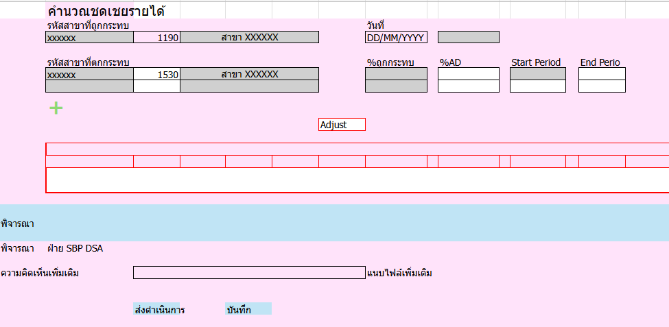

- คีย์ข้อมูลร้าน
  - เพื่อให้ระบบคำนวณและแสดงตัวเลขยอดชดเชย เพื่อ Adjust
- ส่งเรื่องให้ฝ่าย SBP DSA
- กรณีฝ่าย SBP DSA หยุดชดเชยรายได้ สามารถสร้างเอกสารเปิดงานใหม่ได้ ในเดือนเดียวกัน หรือเดือนอื่นๆได้

- ฝ่าย SBP DSA

---

## Slide 50 — 1.9 To-Be Business Process

- เอกสาร : หน้าจอการใช้งาน

- 1.9 To-Be Business Process

- แก้ไขระบบการสร้างเอกสารชดเชยรายได้
- >>>แก้ไขให้สามารถสร้างรายการคำขอชดเชยรายได้ ของสาขาที่เคยถูกปฏิเสธการอนุมัติได้

- Step 1.1To-Be : ตรวจสอบตัวเลข และ Approve ชดเชยรายได้

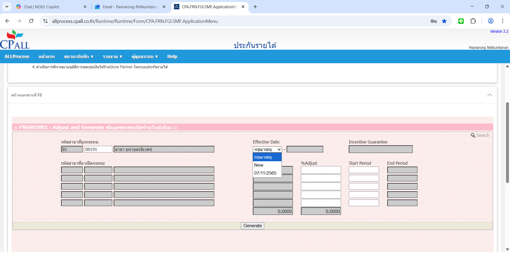

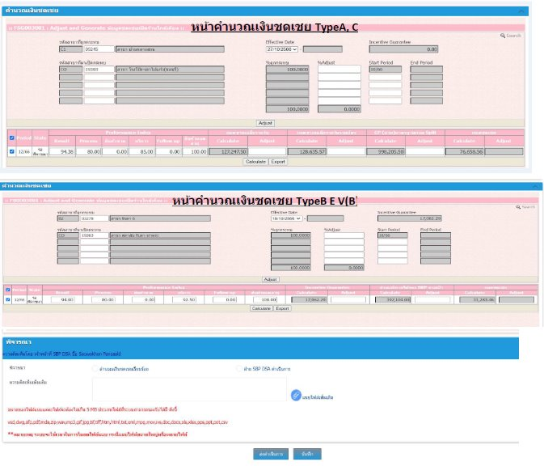

- ฝ่าย SBP DSA

- ตรวจสอบตัวเลข และนำส่งข้อมูลให้ฝ่ายส่งเสริม
- แสดงปุ่มพิจารณาตามการใช้งาน ได้แก่
  - เห็นควรไม่ชดเชยรายได้
  - หยุดชดเชยรายได้
  - หน่วยงานส่งเสริมฯ SBP
  - เจ้าหน้าที่ SBP DSA

- หน่วยงานส่งเสริมฯ SBP

- ส่งดำเนินการ

- บันทึก

---

## Slide 51 — 1.9 To-Be Business Process

- เอกสาร : หน้าจอการใช้งาน

- 1.9 To-Be Business Process

- แก้ไขระบบการสร้างเอกสารชดเชยรายได้
- >>>แก้ไขให้สามารถสร้างรายการคำขอชดเชยรายได้ ของสาขาที่เคยถูกปฏิเสธการอนุมัติได้

- Step 1.1To-Be : ตรวจสอบตัวเลข และ Approve ชดเชยรายได้

- หมายเหตุ 1 :
- ฝ่าย SBP DSA ดำเนินการ
  - กรณีเปิดเรื่องชดเชยรายได้ครั้งแรก
  - กรณีชดเชยต่อเนื่อง และมียอดชดเชยรายได้
  - กรณียอดชดเชยรายได้เป็น 0
    - ยอดชดเชยรายได้เป็น 0 เดือนที่ 1-3 คลิ๊ก "หน่วยงานส่งเสริมธุรกิจ SBP"
    - ยอดชดเชยรายได้เป็น 0 เดือนที่ 4 คลิ๊ก "หยุดชดเชยรายได้"

- ฝ่าย SBP DSA

- ตรวจสอบตัวเลข และนำส่งข้อมูลให้ฝ่ายส่งเสริม
- แสดงปุ่มพิจารณาตามการใช้งาน ได้แก่
  - เห็นควรไม่ชดเชยรายได้
  - หยุดชดเชยรายได้
  - หน่วยงานส่งเสริมฯ SBP
  - เจ้าหน้าที่ SBP DSA

- สิทธิ์การมองเห็นเอกสาร
- เจ้าหน้าที่ SBP DSA และฝ่าย SBP DSA สามารถเข้าดูรายละเอียดของร้านสาขาได้ทุกสาขา โดยไม่จำกัดเฉพาะงานที่รับผิดชอบ
- ทีมส่งเสริม และทีมบัญชี สามารถเข้าดูรายละเอียดเอกสารได้ตามสิทธิ์การเข้าถึงเดิมของแต่ละทีม

- หมายเหตุ 2 :
- กรณีหยุดเรื่องชดเชยแล้ว ต้องการเปิดเรื่องใหม่ ต้องสามารถเปิดเรื่องใหม่ได้ในเดือนเดียวกัน หรือเดือนถัดๆไปได้

---

## Slide 52 — 1.9 To-Be Business Process

- เอกสาร : หน้าจอการใช้งาน

- 1.9 To-Be Business Process

- 2.  ปรับสิทธิ์การตรวจสอบยอดชดเชยรายได้และกระบวนการทำงาน ของทีมส่งเสริม

- Step 2.1 หน่วยงานส่งเสริมและGMส่งเสริม : Approve ค่าใช้จ่าย

- หน่วยงานส่งเสริมฯ SBP

- ลำดับการตรวจสอบยอดชดเชยรายได้(To-Be)
- 1.หน่วยงานส่งเสริม (ผู้จัดการฝ่าย/ผู้เชี่ยวชาญ, เจ้าหน้าที่อาวุโส)
- 2. GM ส่งเสริม

---

## Slide 53 — 1.9 To-Be Business Process

- เอกสาร : หน้าจอการใช้งาน

- 1.9 To-Be Business Process

- 2.  ปรับสิทธิ์การตรวจสอบยอดชดเชยรายได้และกระบวนการทำงาน ของทีมส่งเสริม

- ปรับสิทธิ์การตรวจสอบยอดชดเชยรายได้
- เปลี่ยนชื่อปุ่มของ "ฝ่ายส่งเสริมธุรกิจฯ SBP"เดิม : ฝ่ายส่งเสริมธุรกิจ SBPใหม่ : หน่วยงานส่งเสริมธุรกิจ SBP (ระดับตำแหน่ง :เจ้าหน้าที่อาวุโสขึ้นไป ยกเว้น GM ส่งเสริม)รวมถึงเพิ่มสิทธิ์การเข้าใช้งานของหน่วยงานส่งเสริม(ระดับตำแหน่ง ตามข้อมูล HR :เจ้าหน้าที่อาวุโส - ฝ่ายส่งเสริม) สามารถเข้ามาดำเนินการส่งต่อ Flow ให้ GM ส่งเสริมได้

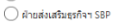

- หน่วยงานส่งเสริมธุรกิจฯ SBP

- พนักงานภายใต้ฝ่ายส่งเสริม SBP (ระดับพนักงาน :เจ้าหน้าที่อาวุโส - ฝ่ายส่งเสริม - GM ส่งเสริม)

---

## Slide 54 — 1.9 To-Be Business Process

- เอกสาร : หน้าจอการใช้งาน

- 1.9 To-Be Business Process

- 2.  ปรับสิทธิ์การตรวจสอบยอดชดเชยรายได้และกระบวนการทำงาน ของทีมส่งเสริม

- ปรับสิทธิ์การตรวจสอบยอดชดเชยรายได้
- เปลี่ยนชื่อปุ่มของ "ฝ่ายส่งเสริมธุรกิจฯ SBP"เดิม : ฝ่ายส่งเสริมธุรกิจ SBPใหม่ : หน่วยงานส่งเสริมธุรกิจ SBP (ระดับตำแหน่ง :เจ้าหน้าที่อาวุโสขึ้นไป ยกเว้น GM ส่งเสริม)รวมถึงเพิ่มสิทธิ์การเข้าใช้งานของหน่วยงานส่งเสริม(ระดับตำแหน่ง ตามข้อมูล HR :เจ้าหน้าที่อาวุโส - ฝ่ายส่งเสริม) สามารถเข้ามาดำเนินการส่งต่อ Flow ให้ GM ส่งเสริมได้

|  |  | ตำแหน่ง |
| --- | --- | --- |
| กล่อง AVP ส่งเสริม | AVP อนุมัติเงิน | ผู้ช่วยกรรมการผู้จัดการ หรือเทียบเท่า |
| กล่อง GM ส่งเสริม | GM อนุมัติเงิน | ผู้จัดการทั่วไป |
|  |  | รองผู้จัดการทั่วไป |
|  |  | ผู้ช่วยผู้จัดการทั่วไป |
| กล่อง หน่วยงานส่งเสริม | ฝ่าย กลั่นกรอง | ผู้จัดการฝ่าย/ผู้เชี่ยวชาญ |
|  |  | เจ้าหน้าที่อาวุโส |
| - | - | เจ้าหน้าที่ |

---

## Slide 55 — 1.9 To-Be Business Process

- เอกสาร : หน้าจอการใช้งาน

- 1.9 To-Be Business Process

- 2.  ปรับสิทธิ์การตรวจสอบยอดชดเชยรายได้และกระบวนการทำงาน ของทีมส่งเสริม

- Step 2.1 เจ้าหน้าที่ส่งเสริมอาวุโสและGMส่งเสริม : Approve ค่าใช้จ่าย

- ปรับสิทธิ์การตรวจสอบยอดชดเชยรายได้

| ตำแหน่งย่อ | ระดับของผู้ได้รับมอบอำนาจ | วงเงินอนุมัติ/รายการ |
| --- | --- | --- |
| GM | ผู้จัดการทั่วไป รองผู้จัดการทั่วไป ผู้ช่วยผู้จัดการทั่วไป หรือเทียบเท่า | 50,000 |
| AVP | ผู้ช่วยกรรมการผู้จัดการ หรือเทียบเท่า | 300,000 |

- ลำดับการ Approve ยอดค่าใช้จ่ายไม่เกิน 50,000
- กลั่นกรอง : หน่วยงานส่งเสริมธุรกิจฯ SBP
- Approve : GM ส่งเสริม

- ลำดับการ Approve ยอดค่าใช้จ่าย 50,001 - 300,000
- กลั่นกรอง1 : หน่วยงานส่งเสริมธุรกิจฯ SBP
- กลั่นกรอง2 GM ส่งเสริม
- Approve : AVP สำนัก SBPM

---

## Slide 56 — 1.9 To-Be Business Process

- เอกสาร : หน้าจอการใช้งาน

- 1.9 To-Be Business Process

- 2.  ปรับสิทธิ์การตรวจสอบยอดชดเชยรายได้ จากฝ่าย ส่งเสริม เป็น เจ้าหน้าที่ส่งเสริม

- Step 2.1 เจ้าหน้าที่และGMส่งเสริม : Approve ค่าใช้จ่าย

- เลขเอกสารบันทึก : CPA-SBPM-IDSM-69-00020
- BSR #2026-00136

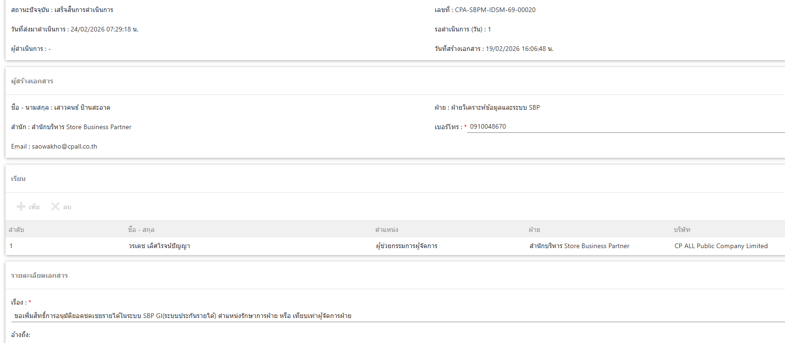

---

## Slide 57 — 1.9 To-Be Business Process

- เอกสาร : หน้าจอการใช้งาน

- 1.9 To-Be Business Process

- 2.  ปรับสิทธิ์การตรวจสอบยอดชดเชยรายได้ จากฝ่าย ส่งเสริม เป็น เจ้าหน้าที่ส่งเสริม

- Step 2.1 เจ้าหน้าที่และGMส่งเสริม : Approve ค่าใช้จ่าย

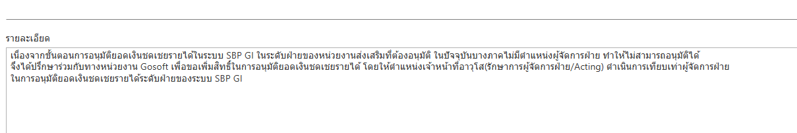

---

## Slide 58 — 1.9 To-Be Business Process

- เอกสาร : หน้าจอการใช้งาน

- 1.9 To-Be Business Process

- 2.  ปรับสิทธิ์การตรวจสอบยอดชดเชยรายได้ จากฝ่าย ส่งเสริม เป็น เจ้าหน้าที่ส่งเสริม

- ปรับกระบวนการทำงานส่งเสริม กรณีเห็นควรไม่ชดเชย

- ระดับ หน่วยงานส่งเสริม​
  - กรณีเห็นควรไม่ชดเชย
    - As-Is : เห็นควรไม่ชดเชย > ตีกลับ "ฝ่าย SBP DSA" รับทราบ คลิ๊ก เห็นควรไม่ชดเชย >  "ไม่อนุมัติในเดือนนั้นๆ"จบกระบวนการ
    - To-Be : เห็นควรไม่ชดเชย > "ไม่อนุมัติในเดือนนั้นๆ"จบกระบวนการ
- ระดับ GM ส่งเสริม
  - กรณีเห็นควรไม่ชดเชย
    - As-Is : เห็นควรไม่ชดเชย > ตีกลับ "ฝ่ายส่งเสริม SBP " รับทราบ คลิ๊ก เห็นควรไม่ชดเชย >  ตีกลับ "ฝ่าย SBP DSA" รับทราบ คลิ๊ก เห็นควรไม่ชดเชย "ไม่อนุมัติในเดือนนั้นๆ"จบกระบวนการ
    - To-Be : เห็นควรไม่ชดเชย > "ไม่อนุมัติในเดือนนั้นๆ"จบกระบวนการ

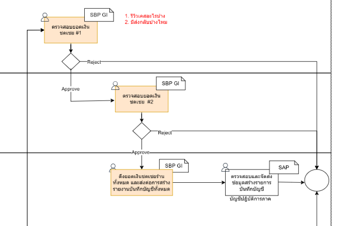

---

## Slide 59 — 1.9 To-Be Business Process

- 1.9 To-Be Business Process

- 3. ปรับระบบยกเลิก Process บัญชี SBP ในการ Approve ค่าใช้จ่าย ในการชดเชยรายได้
- ยกเลิก Precess บัญชี Approve ยอดชดเชยรายได้
- สร้างหน้าจอ หรือตารางข้อมูลในระบบ SBP Mall เพื่อให้ทีมบัญชี สามารถดึงข้อมูลเพื่อไปใช้ต่อได้

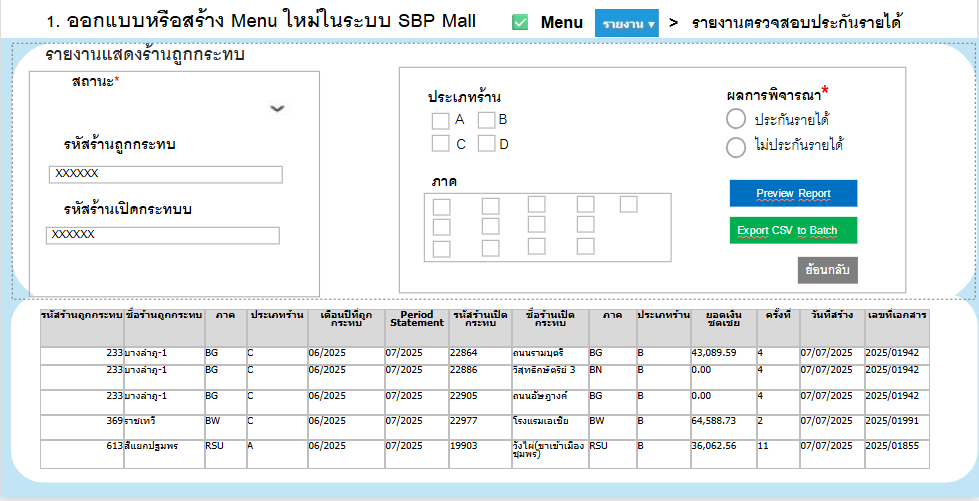

- Choose an option

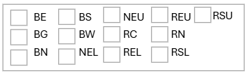

---

## Slide 60 — 1.9 To-Be Business Process

- 1.9 To-Be Business Process

- 3. ปรับระบบยกเลิก Process บัญชี SBP ในการ Approve ค่าใช้จ่าย ในการชดเชยรายได้้

- ภาคตาม Area และตารางข้อมูล

- Step 3 ทีมบัญชี : สามารถเข้ามาดูข้อมูลยอดชดเชยรายได้ในระบบ

- ประเภทร้าน

- 1. ออกแบบหรือสร้าง Menu ใหม่ในระบบ SBP Mall

- A         B
- C         D

- ✅  Menu                   >   รายงานตรวจสอบประกันรายได้

- รายงานแสดงร้านถูกกระทบ

- Period Statement
- To

- สถานะ*

- ผลการพิจารณา
- ประกันรายได้
- ไม่ประกันรายได้

- Choose an option

- รหัสร้านถูกกระทบ

- XXXXXX

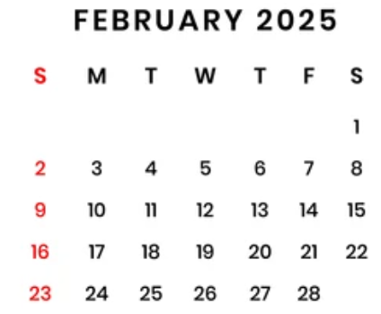

- ภาค

- ค้นหาข้อมูล

- รหัสร้านเปิดกระทบบ

- XXXXXX

- Export Excel

- เคลียร์ค่าเริ่มใหม่

- หมายเหตุ:
- [ สถานะ: Drop-down ] บังคับ Required Field
- [ รหัสร้านถูกกระทบ: Text Box(Numeric input) ] กรณี ระบุสาขาถูกกระทบ ต้องระบุรหัสที่ถูกเปิดกระทบ
- [ รหัสร้านเปิดกระทบ: Text Box(Numeric input) ] กรณี ระบุสาขาถูกกระทบ ต้องระบุรหัสที่ถูกเปิดกระทบ
- [ Period Statement : Text Box(Numeric input) ] แสดง Calendar เพื่อเลือก วัน/เดือน/ปี(ค.ศ.) หรือกรอกเองได้
- [ ประเภทร้าน: Checkbox(เลือกได้หลายปุ่ม) ]
- [ ภาค: Checkbox(เลือกได้หลายปุ่ม) ] หมายเหตุ กรณีมีการเพิ่มภาคในระบบ ให้แสดง Checkbox เพิ่มแบบ Auto โดยไม่ต้องแก้หน้าจอ
- [ ผลการพิจารณา: Radio (เลือกอย่างใดอย่างหนึ่ง) ]
- [ค้นหาข้อมูล] กรณีที่เลือกข้อมูลและประมวลผล เพื่ออัปเดตข้อมูลในตาราง
- [Export Excel] Export Excel
- [เคลียร์ค่าเริ่มต้น] สำหรับล้างข้อมูลเพื่อเริ่มกรอกใหม่

---

## Slide 61 — 1.9 To-Be Business Process

- 1.9 To-Be Business Process

- 3. ปรับระบบยกเลิก Process บัญชี SBP ในการ Approve ค่าใช้จ่าย ในการชดเชยรายได้้

- ภาคตาม Area และตารางข้อมูล

- Step 3 ทีมบัญชี : สามารถเข้ามาดูข้อมูลยอดชดเชยรายได้ในระบบ

- 1. ออกแบบหรือสร้าง Menu ใหม่ในระบบ SBP Mall

- ✅  Menu                   >   รายงานตรวจสอบประกันรายได้

- หมายเหตุ:
- [ สถานะ: Drop-down ] บังคับ Required Field
- [ รหัสร้านถูกกระทบ: Text Box(Numeric input) ] กรณี ระบุสาขาถูกกระทบ ต้องระบุรหัสที่ถูกเปิดกระทบ
- [ รหัสร้านเปิดกระทบ: Text Box(Numeric input) ] กรณี ระบุสาขาถูกกระทบ ต้องระบุรหัสที่ถูกเปิดกระทบ
- [ Period Statement : Text Box(Numeric input) ] แสดง Calendar เพื่อเลือก วัน/เดือน/ปี(ค.ศ.) หรือกรอกเองได้ ไม่อิงสถานะ
- [ ประเภทร้าน: Checkbox(เลือกได้หลายปุ่ม) ]
- [ ภาค: Checkbox(เลือกได้หลายปุ่ม) ] หมายเหตุ กรณีมีการเพิ่มภาคในระบบ ให้แสดง Checkbox เพิ่มแบบ Auto โดยไม่ต้องแก้หน้าจอ
- [ ผลการพิจารณา: Radio (เลือกอย่างใดอย่างหนึ่ง) ]
- [ค้นหาข้อมูล] กรณีที่เลือกข้อมูลและประมวลผล เพื่ออัปเดตข้อมูลในตาราง
- [Export Excel] Export Excel
- [เคลียร์ค่าเริ่มต้น] สำหรับล้างข้อมูลเพื่อเริ่มกรอกใหม่

---

## Slide 62 — 1.9 To-Be Business Process

- 1.9 To-Be Business Process

- 3. ปรับระบบยกเลิก Process บัญชี SBP ในการ Approve ค่าใช้จ่าย ในการชดเชยรายได้้

- ภาคตาม Area และตารางข้อมูล

- Step 3 ทีมบัญชี : สามารถเข้ามาดูข้อมูลยอดชดเชยรายได้ในระบบ

- ประเภทร้าน

- 1. ออกแบบหรือสร้าง Menu ใหม่ในระบบ SBP Mall

- A         B
- C         D

- ✅  Menu                   >   รายงานตรวจสอบประกันรายได้

- รายงานแสดงร้านถูกกระทบ

- สถานะ*

- ผลการพิจารณา
- ประกันรายได้
- ไม่ประกันรายได้

| รอ ฝ่ายส่งเสริมธุรกิจ SBP ดำเนินการ |
| --- |
| รอ GM ส่งเสริมธุรกิจ SBP ดำเนินการ |
| รอผู้บริหารสำนักงานบริการ SBP ดำเนินการ |
| รอฝ่าย SBP DSA ดำเนินการ |
| รอเจ้าหน้าที่ SBP DSA ดำเนินการ |
| เสร็จสิ้นดำเนินการ |

- Choose an option

- รหัสร้านถูกกระทบ

- XXXXXX

- ภาค

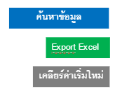

- Preview Report

- รหัสร้านเปิดกระทบบ

- Export CSV to Batch

- XXXXXX

- ย้อนกลับ

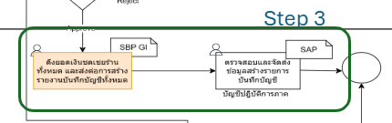

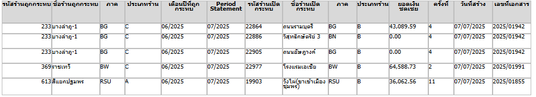

---

## Slide 63 — กรุณาระบุว่า งานนี้มี Personal Data หรือไม่ โดยแบ่งกลุ่มเป็น Normal personal data และ Sensitive Data

- 1.10 Personal Data (PDPA) Check List

- กรุณาระบุว่า งานนี้มี Personal Data หรือไม่ โดยแบ่งกลุ่มเป็น Normal personal data และ Sensitive Data

| # | Normal Personal data (พิจารณาทำ Consent เฉพาะเรื่อง จากการนำข้อมูลไปใช้) | Yes / No​ |
| --- | --- | --- |
| 1 | ชื่อ-นามสกุล​, ชื่อเล่น | Yes |
| 2 | เลขบัตรประชาชน, เลขหนังสือเดินทาง, เลขบัตรประกันสังคม, เลขใบอนุญาตขับขี่,  เลขประจำตัวผู้เสียภาษี, เลขบัญชีธนาคาร, เลขบัตรเครดิต​​ | no |
| 3 | ที่อยู่, อีเมล์, เลขโทรศัพท์​​ | Yes |
| 4 | ข้อมูลอุปกรณ์หรือเครื่องมือ เช่น IP Address, MAC Address, Cookie ID​​ | no |
| 5 | ข้อมูลที่สามารถเชื่อมโยงไปข้อมูลส่วนบุคคลได้ เช่น วันเกิด สถานที่เกิด น้ำหนัก ส่วนสูง ข้อมูลตำแหน่งที่อยู่ ข้อมูลการแพทย์ ข้อมูลการศึกษา ข้อมูลการเงิน ข้อมูลการจ้างาน​​ | no |
| 6 | ข้อมูลหมายเลขอ้างอิงที่เก็บไว้ในไมโครฟิล์ม​​ | no |
| 7 | ข้อมูลประเมินการทำงานหรือความเห็นของนายจ้างต่อการทำงานของลูกจ้าง​​ | no |
| 8 | ข้อมูลบันทึกต่าง ๆ ที่ใช้ติดตามตรวจสอบกิจกรรมต่าง ๆ ของบุคคล เช่น Log file​​ | no |
| 9 | ข้อมูลที่สามารถใช้ในการค้นหาข้อมูลส่วนบุคคลอื่นในอินเตอร์เน็ต ​ | no |

| # | Sensitive Data​​ (หากมี Sensitive Data จะ Review ความจำเป็นในการเก็บ  หากจำเป็น จะมีการทำ Consent) | Yes / No​ |
| --- | --- | --- |
| 1 | เชื้อชาติ เผ่าพันธุ์​​ | ​no |
| 2 | ความเชื่อในลัทธิ ศาสนา หรือปรัชญา​​ | ​no |
| 3 | ประวัติอาชญากรรม​​ | ​no |
| 4 | พฤติกรรมทางเพศ​ ​ | ​no |
| 5 | ข้อมูลสหภาพแรงงาน​ เช่น ข้อมูลการเป็นสมาชิกสหภาพ​ | ​no |
| 6 | ข้อมูลสุขภาพ ความพิการ​​ | ​no |
| 7 | ความคิดเห็นทางการเมือง​​ | ​no |
| 8 | ข้อมูลพันธุกรรม​ เช่น ข้อมูล DNA, ยีนส์ ​ | ​no |
| 9 | ข้อมูลชีวภาพ เช่น ลายนิ้วมือ, รูปใบหน้า, ข้อมูลscan ม่านตา​ | ​no |

- หมายเหตุ:

- กรณีมี Personal Data จะต้องเพิ่มเติมรายละเอียดตาม Template ของ PDPA Requirement ตาม เอกสารแนบ

**Notes (คำอธิบาย/แนวทาง):**

> Critical Level Definition :
> - Critical: Function ที่มีกระทบกับการขาย สั่ง, ส่ง และกระทบโดยตรงรายได้ของบริษัทฯ
>  Major: Function ที่สนับสนุนการขาย สั่ง, ส่ง และกระทบทางอ้อมรายได้ของบริษัทฯ
>  Minor: Function ที่ไม่กระทบกับการขาย สั่ง, ส่ง และรายได้ของบริษัทฯ
>  General : Function ที่กระทบกับการทำงานเพียงเล็กน้อย และสามารถใช้ Function อื่นทดแทนได้

---

## Slide 64 — 1.11 Business Requirement Summary

- 1.11 Business Requirement Summary

- 1.กรณีมีการไม่อนุมัติประกันรายได้ ทำให้ไม่สามารถดำเนินการสร้างชดเชยรายได้ได้ใหม่​ (Pg. 46 - 51)
- เจ้าหน้าที่ SBP DSA สามารถ กรอกข้อมูลร้านเปิดกระทบ เพื่อคำนวณยอดชดเชยรายได้ สำหรับข้อมูลเชิงรุกและเชิงรับ
- เจ้าหน้าที่ SBP DSA สามารถเข้าเลือกงานของตนเองได้ เพื่อคำนวณยอดชดเชยรายได้ สำหรับข้อมูลจากระบบส่ง Auto
- กรณีฝ่าย SBP DSA หยุดชดเชยรายได้ เจ้าหน้าที่ SBP DSA สามารถสร้างเอกสารเปิดงานได้ในรอบเดือนเดียวกันหรือถัดไปได้
- กรณีฝ่าย SBP DSA เห็นควรไม่ชดเชยรายได้ ในรอบเดือนถัดไประบบดึงข้อมูลไปที่หน้าจอคงค้าง พร้อมเจ้าของงานคนเดิม(เจ้าหน้าที่ SBP DSA)
- กรณียอดชดเชยรายได้เป็น 0
  - ยอดชดเชยรายได้เป็น 0 เดือนที่ 1-3 คลิ๊ก "ฝ่ายส่งเสริมธุรกิจ SBP"
  - ยอดชดเชยรายได้เป็น 0 เดือนที่ 4 คลิ๊ก "หยุดชดเชยรายได้"
- สิทธิ์การมองเห็นเอกสาร
  - เจ้าหน้าที่ SBP DSA และฝ่าย SBP DSA สามารถเข้าดูรายละเอียดของร้านสาขาได้ทุกสาขา โดยไม่จำกัดเฉพาะงานที่รับผิดชอบ
  - ทีมส่งเสริม และทีมบัญชี สามารถเข้าดูรายละเอียดเอกสารได้ตามสิทธิ์การเข้าถึงเดิมของแต่ละทีม

---

## Slide 65 — 1.11 Business Requirement Summary

- 1.11 Business Requirement Summary

- 2. ปรับสิทธิ์การตรวจสอบยอดชดเชยรายได้และกระบวนการทำงาน ของทีมส่งเสริม (Pg. 52 - 57)
- ปรับสิทธิ์การตรวจสอบยอดชดเชยรายได้
- ปรับสิทธิ์การตรวจสอบยอดชดเชยรายได้ จากฝ่าย ส่งเสริม เป็น หน่วยงานส่งเสริม (ระดับพนักงาน ตามข้อมูล HR :เจ้าหน้าที่อาวุโส - ฝ่ายส่งเสริม ยกเว้น GM) สามารถเข้ามาดำเนินการส่งต่อ Flow ให้ GM ส่งเสริมได้
- ปรับชื่อปุ่ม ฝ่ายส่งเสริม เป็น หน่วยงานส่งเสริม
- ปรับกระบวนการทำงานส่งเสริม กรณีเห็นควรไม่ชดเชย
- ทั้งหน่วยงานส่งเสริม และ GM ส่งเสริม

|  |  | ตำแหน่ง |
| --- | --- | --- |
| กล่อง AVP ส่งเสริม | AVP อนุมัติเงิน | ผู้ช่วยกรรมการผู้จัดการ หรือเทียบเท่า |
| กล่อง GM ส่งเสริม | GM อนุมัติเงิน | ผู้จัดการทั่วไป |
|  |  | รองผู้จัดการทั่วไป |
|  |  | ผู้ช่วยผู้จัดการทั่วไป |
| กล่อง หน่วยงานส่งเสริม | ฝ่าย กลั่นกรอง | ผู้จัดการฝ่าย/ผู้เชี่ยวชาญ |
|  |  | เจ้าหน้าที่อาวุโส |
|  |  | เจ้าหน้าที่ |

---

## Slide 66 — 1.11 Business Requirement Summary

- 1.11 Business Requirement Summary

- 3. ปรับระบบยกเลิก Process บัญชี SBP ในการ Approve ค่าใช้จ่าย ในการชดเชยรายได้ (Pg. 58 – 61)
- ยกเลิก Precess บัญชี Approve ยอดชดเชยรายได้
- สร้างหน้าจอ หรือตารางข้อมูลในระบบ SBP Mall เพื่อให้ทีมบัญชี สามารถดึงข้อมูลเพื่อไปใช้ต่อได้
- ​

---

## Slide 67 — Daily Operation Report

- 1.12 ข้อมูลและรายงาน

- Daily Operation Report
- Reconcile Report
- Analytic Report
- Archiving Data
- Any Data for Monitor & Tracking

**Notes (คำอธิบาย/แนวทาง):**

> จัดทำโดย ISS โดยระบุ Business Scenario สำคัญๆ ที่ต้องการให้ Focus เรื่อง Performance

---

## Slide 68 — Critical Scenario (Assumption)

- 1.13 Performance Requirement

- Critical Scenario (Assumption)

| No. | Scenario |
| --- | --- |
|  |  |
|  |  |

**Notes (คำอธิบาย/แนวทาง):**

> จัดทำโดย ISS โดยระบุ Business Scenario สำคัญๆ ที่ต้องการให้ Focus เรื่อง Performance
> Acceptance Criteria เพื่อเตรียมทดสอบ Performance (Non-Functional) เช่น

---

## Slide 69 — Authentication

- 1.14 Non Functional Requirement

- Authentication
- Authorization
- Backup
- Service Level
- Security
  - Penetration testing Required
- Logging (Audit Trail)
- Any data for Monitor & Tracking

**Notes (คำอธิบาย/แนวทาง):**

> จัดทำโดย ISS โดยระบุ Business Scenario สำคัญๆ ที่ต้องการให้ Focus เรื่อง Performance
> Authen – เข้าระบบได้
> Authorize – ได้รับ role อะไรบ้าง
> Backup – เปลี่ยนแปลงระบบแล้ว จะbackupข้อมูลเก่าไว้ และเก็บไว้นานแค่ไหน
> Service Level  - impact level ถ้าทำไม่ได้เกิดอะไรขึ้น
> Penetration - ทดสอบช่องโหว่ของระหว่าง

---

## Slide 70 — Response Time (วัดเวลา End to end ในแต่ละ Stage)

- 1.15 Performance Requirement

- Response Time (วัดเวลา End to end ในแต่ละ Stage)

| Stage | Average Respond Time | Maximum Respond Time |
| --- | --- | --- |
|  |  |  |
|  |  |  |
|  |  |  |
|  |  |  |
|  |  |  |

---

## Slide 71 — 2. HIGH LEVEL SOLUTION DESIGN

- 2. HIGH LEVEL SOLUTION DESIGN

**Notes (คำอธิบาย/แนวทาง):**

> จัดทำโดย Gosoft

---

## Slide 72 — 2.1 Requirement Summary

- 2.1 Requirement Summary

---

## Slide 73 — 2.2 Design Condition

- 2.2 Design Condition

---

## Slide 74 — 2.3 Solution Proposed

- 2.3 Solution Proposed

**Notes (คำอธิบาย/แนวทาง):**

> จัดทำโดย: Gosoft: Service
> List Solution ทางเลือกที่คิดได้มาทั้งหมด โดยกำหนดชื่อให้ครอบคลุมถึงภาพรวมของ แต่ละ Solution และ ข้อแตกต่างของแต่ละ Solution

---

## Slide 75 — 2.4 System Impact

- 2.4 System Impact

**Notes (คำอธิบาย/แนวทาง):**

> ในกรณีที่ ต้องไปเกี่ยวข้องกับระบบเดิม
> ซึ่งจะแบ่งไว้คือ
>
> 1 New คือการแก้ใหม่ทั้งหมด หรือ เขียนใหม่เลย
> 2 Change  คือแก้ไขบางส่วน
> 3 Config คือแค่ config ก็สามารถทำงานได้ (case นี้ถือว่าง่าย)

---

## Slide 76 — 2.5 Related Systems

- 2.5 Related Systems

**Notes (คำอธิบาย/แนวทาง):**

> ในกรณีที่ ต้องไปเกี่ยวข้องกับระบบเดิม
> ซึ่งจะแบ่งไว้คือ
>
> 1 New คือการแก้ใหม่ทั้งหมด หรือ เขียนใหม่เลย
> 2 Change  คือแก้ไขบางส่วน
> 3 Config คือแค่ config ก็สามารถทำงานได้ (case นี้ถือว่าง่าย)

---

## Slide 77 — 2.6 System Interface – Integration

- 2.6 System Interface – Integration

**Notes (คำอธิบาย/แนวทาง):**

> ในกรณีที่ ต้องไปเกี่ยวข้องกับระบบเดิม
> ซึ่งจะแบ่งไว้คือ
>
> 1 New คือการแก้ใหม่ทั้งหมด หรือ เขียนใหม่เลย
> 2 Change  คือแก้ไขบางส่วน
> 3 Config คือแค่ config ก็สามารถทำงานได้ (case นี้ถือว่าง่าย)

---

## Slide 78 — 2.7 Non function Testing

- 2.7 Non function Testing

**Notes (คำอธิบาย/แนวทาง):**

> ในกรณีที่ ต้องไปเกี่ยวข้องกับระบบเดิม
> ซึ่งจะแบ่งไว้คือ
>
> 1 New คือการแก้ใหม่ทั้งหมด หรือ เขียนใหม่เลย
> 2 Change  คือแก้ไขบางส่วน
> 3 Config คือแค่ config ก็สามารถทำงานได้ (case นี้ถือว่าง่าย)

---

## Slide 79 — 2.8 Monitoring Forecast

- 2.8 Monitoring Forecast

**Notes (คำอธิบาย/แนวทาง):**

> ในกรณีที่ ต้องไปเกี่ยวข้องกับระบบเดิม
> ซึ่งจะแบ่งไว้คือ
>
> 1 New คือการแก้ใหม่ทั้งหมด หรือ เขียนใหม่เลย
> 2 Change  คือแก้ไขบางส่วน
> 3 Config คือแค่ config ก็สามารถทำงานได้ (case นี้ถือว่าง่าย)

---

## Slide 80 — 2.9 Cloud Service Forecast

- 2.9 Cloud Service Forecast

**Notes (คำอธิบาย/แนวทาง):**

> ในกรณีที่ ต้องไปเกี่ยวข้องกับระบบเดิม
> ซึ่งจะแบ่งไว้คือ
>
> 1 New คือการแก้ใหม่ทั้งหมด หรือ เขียนใหม่เลย
> 2 Change  คือแก้ไขบางส่วน
> 3 Config คือแค่ config ก็สามารถทำงานได้ (case นี้ถือว่าง่าย)

---

## Slide 81 — 2.10 Hardware Forecast

- 2.10 Hardware Forecast

**Notes (คำอธิบาย/แนวทาง):**

> ในกรณีที่ ต้องไปเกี่ยวข้องกับระบบเดิม
> ซึ่งจะแบ่งไว้คือ
>
> 1 New คือการแก้ใหม่ทั้งหมด หรือ เขียนใหม่เลย
> 2 Change  คือแก้ไขบางส่วน
> 3 Config คือแค่ config ก็สามารถทำงานได้ (case นี้ถือว่าง่าย)

---

## Slide 82 — 2.11 Remark from Solution Team

- 2.11 Remark from Solution Team

**Notes (คำอธิบาย/แนวทาง):**

> ในกรณีที่ ต้องไปเกี่ยวข้องกับระบบเดิม
> ซึ่งจะแบ่งไว้คือ
>
> 1 New คือการแก้ใหม่ทั้งหมด หรือ เขียนใหม่เลย
> 2 Change  คือแก้ไขบางส่วน
> 3 Config คือแค่ config ก็สามารถทำงานได้ (case นี้ถือว่าง่าย)

---
