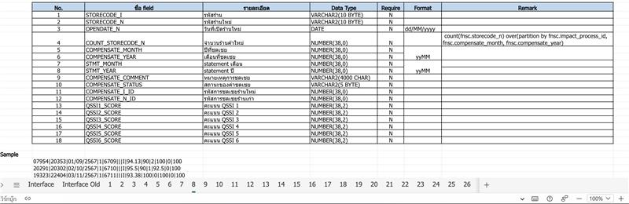
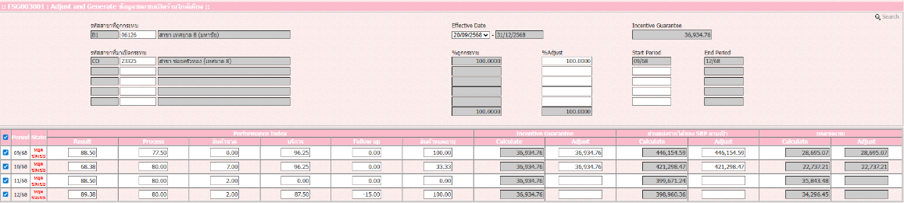
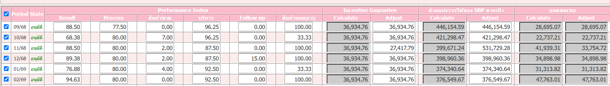

# ประกันรายได้ — ตัวอย่าง Message RabbitMQ (SGI ↔ STA)

> **แปลงจาก** `STA/ประกันรายได ตัวอย่าง Message Rabbit MQ .xlsx` (3 ชีต: `sgi_impact_store` · `sta_update_compensate` · `sgi_reflow`)
> เอกสารนี้เป็น **สัญญาข้อความ (message contract)** ระหว่างระบบประกันรายได้ **SGI** กับระบบ **STA** — ใช้แทนไฟล์ `FRBC0001_` + SFTP ของระบบเดิม (มติ 2026-08-24)
> ตัวอย่าง JSON ทุกก้อนคัดลอกมา **verbatim** จากไฟล์ต้นฉบับ · ข้อสังเกตจากการแปลงอยู่ท้ายเอกสาร

---

## 1. ภาพรวม

| ข้อความ (`dataName`) | ทิศทาง | จังหวะการส่ง | ใช้ทำอะไร |
|---|---|---|---|
| `sgi_impact_store` | **SGI → STA** | **Daily 17:00** (Job 6 · transactional outbox) | แจ้งร้านที่ได้รับผลกระทบและผลการพิจารณาของแต่ละงวด |
| `sta_update_compensate` | **STA → SGI** | **Real Time** | ส่งยอดเงินประกันรายได้ (forecast / adjust) กลับเข้าเอกสารของ SGI |
| `sgi_reflow` | **SGI → STA** | **เมื่อผู้ใช้กดเปิดพิจารณาใหม่** | แจ้งว่าเอกสารที่จบไปแล้วถูก **reflow** ให้ STA ตั้ง flow ของงวดที่เกี่ยวข้องใหม่ |

**ช่องทาง:** RabbitMQ exchange `sgi.interface` (topic · durable) · payload เป็น **JSON UTF-8**
**ซองข้อความ (envelope) เหมือนกันทุกชนิด:**

```json
{
  "dataType": "message",
  "dataName": "<ชื่อชุดข้อมูล>",
  "dataMessage": [ /* อาร์เรย์ของรายการ */ ],
  "sender": "<ระบบต้นทาง>",
  "sentAt": "2025-07-11T15:00:00Z"
}
```

---

## 2. `sgi_impact_store` — SGI → STA (Daily 17:00)

### 2.1 โครงสร้างฟิลด์ (ตามสเปกในไฟล์ต้นฉบับ)



| No. | ชื่อ field | รายละเอียด | Data Type | Require | Format | Remark |
|---|---|---|---|---|---|---|
| 1 | `STORECODE_I` | รหัสร้าน | VARCHAR2(10 BYTE) | N | | |
| 2 | `STORECODE_N` | รหัสร้านใหม่ | VARCHAR2(10 BYTE) | N | | |
| 3 | `OPENDATE_N` | วันที่เปิดร้านใหม่ | DATE | N | `dd/MM/yyyy` | |
| 4 | `COUNT_STORECODE_N` | จำนวนร้านค้าใหม่ | NUMBER(38,0) | N | | `count(fnsc.storecode_n) over(partition by fnsc.impact_process_id, fnsc.compensate_month, fnsc.compensate_year)` |
| 5 | `COMPENSATE_MONTH` | ปีที่ชดเชย | NUMBER(38,0) | N | | |
| 6 | `COMPENSATE_YEAR` | เดือนที่ชดเชย | NUMBER(38,0) | N | `yyMM` | |
| 7 | `STMT_MONTH` | statement เดือน | NUMBER(38,0) | N | | |
| 8 | `STMT_YEAR` | statement ปี | NUMBER(38,0) | N | `yyMM` | |
| 9 | `COMPENSATE_COMMENT` | หมายเหตุการชดเชย | VARCHAR2(4000 CHAR) | N | | |
| 10 | `COMPENSATE_STATUS` | สถานะของค่าชดเชย | VARCHAR2(5 BYTE) | N | | ดูตารางค่าใน 2.2 |
| 11 | `COMPENSATE_I_ID` | รหัสการชดเชยร้านใหม่ | NUMBER(38,0) | N | | |
| 12 | `COMPENSATE_N_ID` | รหัสการชดเชยร้านเก่า | NUMBER(38,0) | N | | |
| 13 | `QSSI1_SCORE` | คะแนน QSSI 1 | NUMBER(38,2) | N | | |
| 14 | `QSSI2_SCORE` | คะแนน QSSI 2 | NUMBER(38,2) | N | | |
| 15 | `QSSI3_SCORE` | คะแนน QSSI 3 | NUMBER(38,2) | N | | |
| 16 | `QSSI4_SCORE` | คะแนน QSSI 4 | NUMBER(38,2) | N | | |
| 17 | `QSSI5_SCORE` | คะแนน QSSI 5 | NUMBER(38,2) | N | | |
| 18 | `QSSI6_SCORE` | คะแนน QSSI 6 | NUMBER(38,2) | N | | |

**Sample รูปแบบเดิม (คั่นด้วย `|` — ของ interface รุ่นก่อน เก็บไว้เทียบเท่านั้น):**

```text
07954|20353|01/09/2567|1|6709|||94.13|90|2|100|0|100
20291|20302|02/10/2567|1|6710|||95.5|90|1|92.5|0|100
19323|22404|03/11/2567|1|6711|||93.38|100|0|100|0|100
```

### 2.2 ค่า `compensate_status`

| ค่า | ความหมาย | STA ทำอะไรต่อ |
|---|---|---|
| `I` | **Initial** — ข้อมูลตั้งต้นของงวด | ตั้ง Flow ร้านค้าที่ได้รับผลกระทบ |
| `A` | **Approve** — อนุมัติชดเชย | ตรวจสอบยอดการอนุมัติ แล้วบันทึกบัญชีที่ SAP |
| `N` | **Not Approve** — เห็นควรไม่ชดเชย | ไม่บันทึกบัญชีของงวดนั้น |
| `S` | **Stop** — หยุดชดเชยประกันรายได้ | Stop Flow |
| `R` | **Reflow** — เปิดพิจารณาใหม่ | ตั้ง flow ของงวดที่ระบุใหม่ (ส่งด้วยข้อความ `sgi_reflow` · ดูข้อ 4) |

### 2.3 ตัวอย่าง — Initial (`I`)

```json
{
  "dataType": "message",
  "dataName": "sgi_impact_store",
  "dataMessage": [
    {
      "storecode_i": "07954",
      "storecode_n": "20353",
      "opendate_n": "01/09/2567",
      "count_storecode_n": "1",
      "compensate_year_month": "6709",
      "stmt_year_month": "",
      "compensate_comment": "",
      "compensate_status": "I",
      "qssi1_score": "94.13",
      "qssi2_score": "90",
      "qssi3_score": "2",
      "qssi4_score": "100",
      "qssi5_score": "0",
      "qssi6_score": "100"
    }
  ],
  "sender": "SGI",
  "sentAt": "2025-07-11T15:00:00Z"
}
```

### 2.4 ตัวอย่าง — Approve (`A`)

> ต่างจาก Initial ที่ `compensate_status = "A"` และ **มี `stmt_year_month`** (งวด statement ที่จะไปกระทบบัญชี)

```json
{
  "dataType": "message",
  "dataName": "sgi_impact_store",
  "dataMessage": [
    {
      "storecode_i": "07954",
      "storecode_n": "20353",
      "opendate_n": "01/09/2567",
      "count_storecode_n": "1",
      "compensate_year_month": "6709",
      "stmt_year_month": "6710",
      "compensate_comment": "",
      "compensate_status": "A",
      "qssi1_score": "94.13",
      "qssi2_score": "90",
      "qssi3_score": "2",
      "qssi4_score": "100",
      "qssi5_score": "0",
      "qssi6_score": "100"
    }
  ],
  "sender": "SGI",
  "sentAt": "2025-07-11T15:00:00Z"
}
```

### 2.5 ตัวอย่าง — Not Approve (`N`)

> ร้านถูกกระทบจากร้านเปิดใหม่ 2 สาขา จึงมี 2 รายการใน `dataMessage` และ `count_storecode_n = "2"` ทั้งคู่ · `stmt_year_month` ว่าง เพราะไม่เข้าบัญชี

```json
{
  "dataType": "message",
  "dataName": "sgi_impact_store",
  "dataMessage": [
    {
      "storecode_i": "07954",
      "storecode_n": "20353",
      "opendate_n": "01/09/2567",
      "count_storecode_n": "2",
      "compensate_year_month": "6710",
      "stmt_year_month": "",
      "compensate_comment": "",
      "compensate_status": "N",
      "qssi1_score": "94.13",
      "qssi2_score": "90",
      "qssi3_score": "2",
      "qssi4_score": "100",
      "qssi5_score": "0",
      "qssi6_score": "100"
    },
    {
      "storecode_i": "07954",
      "storecode_n": "20354",
      "opendate_n": "01/09/2567",
      "count_storecode_n": "2",
      "compensate_year_month": "6710",
      "stmt_year_month": "",
      "compensate_comment": "",
      "compensate_status": "N",
      "qssi1_score": "94.13",
      "qssi2_score": "90",
      "qssi3_score": "2",
      "qssi4_score": "100",
      "qssi5_score": "0",
      "qssi6_score": "100"
    }
  ],
  "sender": "SGI",
  "sentAt": "2025-07-11T15:00:00Z"
}
```

### 2.6 ตัวอย่าง — Stop (`S`)

```json
{
  "dataType": "message",
  "dataName": "sgi_impact_store",
  "dataMessage": [
    {
      "storecode_i": "07954",
      "storecode_n": "20353",
      "opendate_n": "01/09/2567",
      "count_storecode_n": "2",
      "compensate_year_month": "6711",
      "stmt_year_month": "6712",
      "compensate_comment": "",
      "compensate_status": "S",
      "qssi1_score": "94.13",
      "qssi2_score": "90",
      "qssi3_score": "2",
      "qssi4_score": "100",
      "qssi5_score": "0",
      "qssi6_score": "100"
    },
    {
      "storecode_i": "07954",
      "storecode_n": "20354",
      "opendate_n": "01/09/2567",
      "count_storecode_n": "2",
      "compensate_year_month": "6711",
      "stmt_year_month": "6712",
      "compensate_comment": "",
      "compensate_status": "S",
      "qssi1_score": "94.13",
      "qssi2_score": "90",
      "qssi3_score": "2",
      "qssi4_score": "100",
      "qssi5_score": "0",
      "qssi6_score": "100"
    }
  ],
  "sender": "SGI",
  "sentAt": "2025-07-11T15:00:00Z"
}
```

---

## 3. `sta_update_compensate` — STA → SGI (Real Time)

ส่งยอดเงินประกันรายได้กลับให้ SGI อัปเดตลงเอกสาร — แทน API `/fgiService/updateCompensateFromFS` ของระบบเดิม

```json
{
  "dataType": "message",
  "dataName": "sta_update_compensate",
  "dataMessage": [
    {
      "storeCodeI": "01213",
      "totalStoreCodeN": "1",
      "periodImpact": "6906",
      "impactStatus": "W",
      "forecast": "0.00",
      "adjust": "0.00",
      "compensate": [
        {
          "storeCodeN": "23760",
          "openDateN": "30/03/2026",
          "forecastN": "0.00",
          "forecastPercentN": "100.00",
          "adjustN": "0.00",
          "adjustPercentN": "",
          "createBy": "GBCE000",
          "createDate": "10/08/2026 17:15:09",
          "updateBy": "GBCE000",
          "updateDate": "10/08/2026 17:15:09"
        }
      ]
    }
  ],
  "sender": "SGI",
  "sentAt": "2025-07-11T15:00:00Z"
}
```

| ฟิลด์ | ความหมาย |
|---|---|
| `storeCodeI` | รหัสร้านที่ถูกกระทบ |
| `totalStoreCodeN` | จำนวนร้านเปิดใหม่ที่กระทบร้านนี้ |
| `periodImpact` | งวดที่กระทบ (`yyMM` · พ.ศ.) |
| `impactStatus` | สถานะยอด — `W` = ยอดไม่เท่ากับศูนย์ · `Z` = ยอดเท่ากับศูนย์ (ตามกติกาเดิมของ `/fgiService/updateCompensateFromFS`) |
| `forecast` / `adjust` | ยอดรวมของร้านที่ถูกกระทบ (ระบบคำนวณ / ที่คนปรับ) |
| `compensate[]` | ยอดแยกรายร้านเปิดใหม่ — `forecastN` · `forecastPercentN` · `adjustN` · `adjustPercentN` พร้อม audit `createBy/createDate/updateBy/updateDate` |

> **ยอดที่ใช้จริงคือ `adjust` เมื่อมีค่า มิฉะนั้นใช้ `forecast`** (`COALESCE(adjust, forecast)`) — ตรงกับกติกาที่ `workflow.md` ใช้ตัดสินจุดเข้า flow

---

## 4. `sgi_reflow` — SGI → STA (เปิดพิจารณาใหม่)

**ใช้เมื่อไร:** ฝ่าย SBP DSA (section 06) เปิดเอกสารที่ **จบไปแล้ว** ด้วยผล **"เห็นควรไม่ชดเชย"** หรือ **"หยุดชดเชยประกันรายได้"** แล้วกด**พิจารณาใหม่**
SGI ต้อง publish ข้อความนี้ให้ STA ทราบว่าเอกสารถูก **reflow** เพื่อให้ STA ตั้ง flow ของงวดที่เกี่ยวข้องใหม่ทั้งหมด

**กติกา:**

- `compensate_status = "R"` ทุกรายการ
- ส่ง **หนึ่งรายการต่อหนึ่งงวด** (`compensate_year_month`) ที่ต้อง reflow — ตัวอย่างด้านล่างคือร้านเดียว 6 งวดติดกัน (`6809` → `6902`)
- `stmt_year_month` ว่างเสมอ เพราะยังไม่ทราบงวด statement ใหม่จนกว่าจะพิจารณาจบอีกครั้ง
- โครงสร้างฟิลด์ **ชุดเดียวกับ `sgi_impact_store`** ทุกฟิลด์ ต่างที่ `dataName` และค่า `compensate_status`

```json
{
  "dataType": "message",
  "dataName": "sgi_reflow",
  "dataMessage": [
    {
      "storecode_i": "06126",
      "storecode_n": "23325",
      "opendate_n": "20/09/2568",
      "count_storecode_n": "1",
      "compensate_year_month": "6809",
      "stmt_year_month": "",
      "compensate_comment": "",
      "compensate_status": "R",
      "qssi1_score": "94.13",
      "qssi2_score": "90",
      "qssi3_score": "2",
      "qssi4_score": "100",
      "qssi5_score": "0",
      "qssi6_score": "100"
    },
    {
      "storecode_i": "06126",
      "storecode_n": "23325",
      "opendate_n": "20/09/2568",
      "count_storecode_n": "1",
      "compensate_year_month": "6810",
      "stmt_year_month": "",
      "compensate_comment": "",
      "compensate_status": "R",
      "qssi1_score": "94.13",
      "qssi2_score": "90",
      "qssi3_score": "2",
      "qssi4_score": "100",
      "qssi5_score": "0",
      "qssi6_score": "100"
    },
    {
      "storecode_i": "06126",
      "storecode_n": "23325",
      "opendate_n": "20/09/2568",
      "count_storecode_n": "1",
      "compensate_year_month": "6811",
      "stmt_year_month": "",
      "compensate_comment": "",
      "compensate_status": "R",
      "qssi1_score": "94.13",
      "qssi2_score": "90",
      "qssi3_score": "2",
      "qssi4_score": "100",
      "qssi5_score": "0",
      "qssi6_score": "100"
    },
    {
      "storecode_i": "06126",
      "storecode_n": "23325",
      "opendate_n": "20/09/2568",
      "count_storecode_n": "1",
      "compensate_year_month": "6812",
      "stmt_year_month": "",
      "compensate_comment": "",
      "compensate_status": "R",
      "qssi1_score": "94.13",
      "qssi2_score": "90",
      "qssi3_score": "2",
      "qssi4_score": "100",
      "qssi5_score": "0",
      "qssi6_score": "100"
    },
    {
      "storecode_i": "06126",
      "storecode_n": "23325",
      "opendate_n": "20/09/2568",
      "count_storecode_n": "1",
      "compensate_year_month": "6901",
      "stmt_year_month": "",
      "compensate_comment": "",
      "compensate_status": "R",
      "qssi1_score": "94.13",
      "qssi2_score": "90",
      "qssi3_score": "2",
      "qssi4_score": "100",
      "qssi5_score": "0",
      "qssi6_score": "100"
    },
    {
      "storecode_i": "06126",
      "storecode_n": "23325",
      "opendate_n": "20/09/2568",
      "count_storecode_n": "1",
      "compensate_year_month": "6902",
      "stmt_year_month": "",
      "compensate_comment": "",
      "compensate_status": "R",
      "qssi1_score": "94.13",
      "qssi2_score": "90",
      "qssi3_score": "2",
      "qssi4_score": "100",
      "qssi5_score": "0",
      "qssi6_score": "100"
    }
  ],
  "sender": "STA",
  "sentAt": "2025-07-11T15:00:00Z"
}
```

### 4.1 หน้าจอฝั่ง STA ที่รับ reflow

หน้าจอ `FSG003001 : Adjust and Generate ข้อมูลการชดเชยร้านใกล้เคียง` ของ STA — งวดที่ถูก reflow จะกลับมาแสดงให้ปรับยอดและ generate ใหม่ได้



ตารางงวดในหน้าจอเดียวกัน — คอลัมน์ `Calculate` คือยอดที่ระบบคำนวณ · `Adjust` คือยอดที่คนปรับ (ค่าที่ต่างกันในงวด 11/68 คือตัวอย่างการปรับยอด)



---

## 5. ข้อสังเกตจากการแปลง (ต้องอ่านก่อนใช้ทำสัญญาจริง)

รายการต่อไปนี้เป็นจุดที่ **ไฟล์ต้นฉบับไม่สอดคล้องกันเอง** — บันทึกไว้ตามที่เห็นจริง ไม่ได้แก้ให้:

| จุด | สิ่งที่พบในไฟล์ต้นฉบับ | ผลต่อการ implement |
|---|---|---|
| `sender` ของ `sgi_reflow` | เขียนว่า `"STA"` ทั้งที่ชื่อชุดข้อมูลขึ้นต้นด้วย `sgi_` และทิศทางคือ SGI แจ้ง STA | ยึด **ทิศทาง SGI → STA** ตามชื่อชุดข้อมูลและกติกาธุรกิจ · ค่า `sender` ที่จะส่งจริงคือ `"SGI"` |
| `sender` ของ `sta_update_compensate` | เขียนว่า `"SGI"` ทั้งที่เป็นข้อความที่ STA ส่งเข้ามา | ยึด **ทิศทาง STA → SGI** · ค่า `sender` ที่จะได้รับจริงคือ `"STA"` |
| ฟิลด์งวดชดเชย | สเปกตาราง (ข้อ 2.1) แยกเป็น `COMPENSATE_MONTH` + `COMPENSATE_YEAR` และ `STMT_MONTH` + `STMT_YEAR` แต่ **JSON จริงรวมเป็น** `compensate_year_month` + `stmt_year_month` (`yyMM`) | ใช้ตาม **JSON** เพราะเป็นรูปแบบที่ส่งจริง — สเปกตารางเป็นโครงของ interface รุ่นไฟล์ |
| ป้ายชื่อฟิลด์ 5/6 | `COMPENSATE_MONTH` ระบุว่า "ปีที่ชดเชย" และ `COMPENSATE_YEAR` ระบุว่า "เดือนที่ชดเชย" (สลับกัน) | ไม่กระทบ JSON เพราะรวมเป็นฟิลด์เดียวแล้ว |
| `COMPENSATE_I_ID` / `COMPENSATE_N_ID` | อยู่ในสเปกตาราง แต่**ไม่มีใน JSON** ทุกตัวอย่าง | ไม่ส่งใน message · SGI ใช้คีย์ `storecode_i` + `storecode_n` + `compensate_year_month` แทน |
| Sample แบบคั่น `|` | มี 13 ค่า ขณะที่ JSON มี 14 คีย์ (ขาด `compensate_status`) | เป็นตัวอย่างของ interface รุ่นก่อน เก็บไว้เทียบเท่านั้น ไม่ใช่รูปแบบที่ใช้ |
| ปีในตัวอย่าง | `opendate_n` เป็น **พ.ศ.** (`01/09/2567`) และงวดเป็น `yyMM` **พ.ศ.** (`6709`) | ตรงกับข้อยกเว้นที่ `api.md` ระบุไว้ — ฟิลด์วันที่ของ message ที่ส่ง STA ยังเป็น พ.ศ. ตามสัญญาเดิม **แปลงเฉพาะตอนประกอบ/อ่าน payload ห้ามให้ปนเข้า DB/API ของ SGI** |

---

## 6. เอกสารที่เกี่ยวข้อง

- `workflow.md` — flow ต้นทางถึงปลายทาง (จุดที่ publish/consume แต่ละข้อความ)
- `new-flow-improved.mmd` / `new-flow.png` — sequence diagram ของระบบใหม่ที่แสดง EAI S3 และ RabbitMQ
- `LLDD/md/Jobs/LLDD-BE-Job-6-ExportImpactStoreToFS.md` — Job ที่ publish `sgi_impact_store` (transactional outbox)
- `LLDD/md/BE/LLDD-BE-API-Document-Workflow-Actions.md` — จุดที่กดพิจารณาใหม่แล้ว publish `sgi_reflow`
- `docs/K2-interface-files.md` — สัญญาไฟล์ของ interface รุ่นก่อน (`FRBC0001_` · `AMS06001*`)
