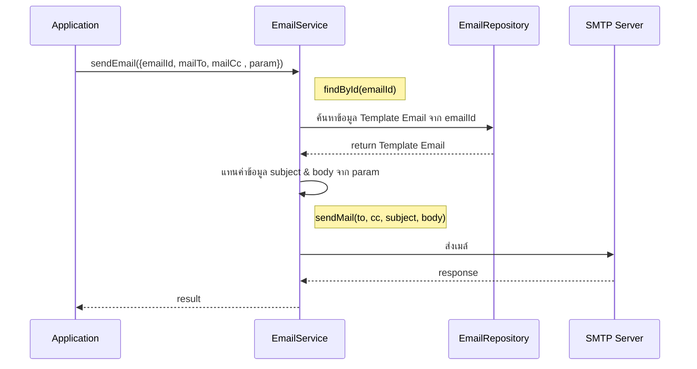

# `@gosoft-sbp/email-lib` — lib ส่งอีเมลกลางของระบบ SBP

> ถอดจาก `SBP/TSM-SRM-LLDD SBP EMAIL1.0.xlsx` — LLDD ของ lib เอง · **v1.0 · 15/09/2025**
> (Created by Sukol K. · Reviewed by Sudtida J.) · 5 ชีต: Version History · Introduction · Detail · Database · MermaidSeq
>
> SGI ใช้ lib นี้ส่งอีเมลทุกฉบับ (EM-01…EM-08) — **ไม่ต่อ SMTP เอง** ตามมติ 2026-08-06
> คู่กับ `SBP/TSM-SRM-LLDD-SBP-workflow-1.2.md` ที่เป็น LLDD ของ workflow lib

## วัตถุประสงค์ตามเอกสาร

> *"สำหรับใช้เป็น lib กลางให้ module อื่น ๆ import เพื่อใช้งาน เกี่ยวกับการส่ง email"*

## โครงไฟล์ของ lib

```
email/
├── src/
│   ├── email.module.ts
│   ├── email.service.ts
│   ├── email-template.repository.ts        ← หมายเหตุในชีต: "ส่งเมล์ผ่าน AWS SES"
│   ├── interfaces/
│   │   ├── email-request.interface.ts
│   │   └── email-template.interface.ts
└── package.json
```

---

## สัญญาการเรียกใช้

### รับเข้า

| พารามิเตอร์ | ความหมาย |
|---|---|
| `emailId` | id ของ template ที่ตั้งไว้ในฐาน (`email_template`) |
| `mailTo` | อีเมลผู้รับ · **หลายคนคั่นด้วย `,`** (เป็น string ไม่ใช่ array) |
| `mailCc` | อีเมลที่ cc · หลายคนคั่นด้วย `,` |
| `param` | ข้อมูลที่จะแทนค่าใน subject/body — **เป็น object** |
| `fileAttach` | ไฟล์แนบ |
| `userId` | ผู้ดำเนินการ → ลง `email_sent.send_by` |

### ขั้นตอนภายใน

1. ดึง template จาก `emailId` → ได้ `emailId` · `emailName` · `subjectMail` · `bodyMail` · `mailFrom` · `mailFromName`
2. **แทนค่าใน subject และ body ด้วยค่าจาก `param`**
3. ส่งเมล์ออกพร้อม `fileAttach`
4. บันทึกผลลง `email_sent` — **เขียนทั้งกรณีสำเร็จและล้มเหลว**
5. คืน `Success` / `Fail`

### สิ่งที่ lib เขียนลง `email_sent` ให้เอง

| คอลัมน์ | ค่าที่ lib ใส่ |
|---|---|
| `email_sent_id` | running |
| `email_id` | `emailId` ที่ส่งเข้ามา |
| `subject` | subject **ที่แทนค่าจาก `param` แล้ว** |
| `content` | body **ที่แทนค่าจาก `param` แล้ว** |
| `mail_from` · `mail_from_name` | จาก template |
| `mail_to` · `mail_cc` | ลิสต์ทั้งหมดที่ส่งไป คั่นด้วย `,` |
| `sent_date` | `CURRENT_TIMESTAMP` |
| `send_by` | `userId` |
| `is_sent` | `'Y'` เมื่อสำเร็จ · **`'N'` เมื่อล้มเหลว** |
| `error` | ว่างเมื่อสำเร็จ · **ข้อความ error เมื่อล้มเหลว** |

🔴 **SGI ห้าม INSERT `email_sent` เอง** — lib เขียนให้แล้วทั้งสองกรณี
รายงานตามเก็บอีเมลที่ส่งไม่สำเร็จจึงใช้ `SELECT … WHERE is_sent = 'N'` ได้ตรง ๆ

### ลำดับการทำงาน (จากชีต MermaidSeq)



---

## 🔴 จุดที่เอกสารกับของจริงไม่ตรงกัน — ตรวจกับฐาน dev แล้ว

### 1. 🔴 **รูปแบบตัวแปรในข้อความ — ยังไม่ยืนยัน และกระทบ SGI โดยตรง**

เอกสารยกตัวอย่างชัดเจนว่าใช้ **`{{ชื่อ}}`**:

> ใน subject ระบุใน db เป็น `[AD] ExportUserToAD ({{status}})`
> `param` จะต้องส่งมาเป็น `{"status":"Success"}`
> email service จะแทนค่าเป็น `[AD] ExportUserToAD (Success)`

**แต่ข้อมูลจริงในฐาน dev ใช้ `${ชื่อ}` แทบทั้งหมด:**

| รูปแบบ | จำนวน template | ส่งไปแล้วจริง |
|---|---:|---|
| `${ชื่อ}` | **126 จาก 134 แถว** | ใช้จริงทุก template ใน 12 อันดับแรก (รวม 4,800+ ฉบับ) |
| `{{ชื่อ}}` | **2 แถว** (id 72 · 153) | **0 ฉบับ — ไม่เคยถูกส่งเลย** |
| ไม่มีตัวแปร | 6 แถว | — |

และอีเมลที่ส่งไปแล้ว **5,381 จาก 5,392 ฉบับไม่มีตัวแปรค้างอยู่เลย** = การแทนค่าทำงานได้จริงกับ `${}`

⚠️ **แต่ยังสรุปไม่ได้ว่า `{{}}` ใช้ไม่ได้** เพราะ template ทั้ง 2 แถวนั้น**ไม่เคยถูกส่ง**
จึงไม่มีหลักฐานทั้งฝั่งบวกและฝั่งลบ · เป็นไปได้ว่า
- lib รองรับทั้งสองแบบ · หรือ
- `${}` เป็นของ **ตัวส่งเมลรุ่นก่อน** (K2 / ระบบอื่น) ส่วน `{{}}` เป็นของ lib ตัวนี้ · หรือ
- เอกสารเขียนตัวอย่างผิด

🔴 **ผลต่อ SGI:** template `EM-01…EM-08` ที่ seed ลงฐาน dev แล้วใช้ **`${}`**
(ตั้งใจให้ตรงกับ 126 แถวที่มีอยู่) — **ถ้า lib แทนค่าเฉพาะ `{{}}` อีเมลของ SGI จะออกไปพร้อมตัวแปรดิบ**
เช่น `เอกสาร ${docNo} รอท่านดำเนินการ` · ชื่อ key ใน `param` ที่โค้ดส่ง (`jobName` · `errorMessage` ·
`runId`) ตรงกับชื่อตัวแปรใน template อยู่แล้ว **ต่างแค่ตัวคั่น**

→ **ต้องถามทีมเจ้าของ lib ก่อนส่งอีเมลฉบับแรกของ SGI** ว่ารองรับตัวคั่นแบบไหน
ถ้าตอบว่า `{{}}` อย่างเดียว ให้แก้ที่ `EMAIL_TEMPLATES` ใน `tools/build_sgi_schema_sql.py`
แล้ว reseed ด้วย `tools/reseed_sgi_seed_rows.py email_template --confirm` (แก้ที่เดียวจบ)

### 2. ชื่อคอลัมน์ของ `email_template` ในชีต Database **ไม่ใช่ชื่อจริง**

| ชีต Database | production (`sps_store.email_template`) |
|---|---|
| `email_id` | `email_template_id` |
| `email_name` | `email_template_name` |
| `subject_mail` | `subject_format` |
| `body_mail` | `body_format` |
| `mail_from` | **`sender`** |
| `mail_from_name` | **`email_from`** |
| `create_date` · `create_by` | `create_date` · `create_by` ✅ |

⚠️ สองแถวสุดท้ายสำคัญ: **`sender` เก็บอีเมล · `email_from` เก็บชื่อที่แสดง** — ตรงกับที่ชีตนี้เรียก
`mail_from` / `mail_from_name` พอดี **ยืนยันการตีความที่เราสรุปไว้จากข้อมูลจริง**
(ดู `docs/IAS-STA-interface-files.md` §4 และ `database.md`)

> เรื่องนี้ `database.md` และ `api.md` บันทึกไว้แล้วว่าชื่อในชีตเป็น "ชื่อที่เสนอไว้ ไม่ตรง production"

### 3. `email_sent` — ตรงเกือบหมด ยกเว้นชื่อคอลัมน์ผู้ส่ง

| ชีต Detail/Database | production |
|---|---|
| `sent_by` | 🔴 **`send_by`** |
| `sent_date` `timestamptz` | `sent_date` `timestamp without time zone` |
| ที่เหลือ 10 คอลัมน์ | ✅ ตรงทุกตัว |

> `send_by` บันทึกไว้แล้วใน `database.md` · `api.md` · และ `check_docs.py` มีกฎดักการเขียน `sent_by`

### 4. ชื่อ method — เอกสารเขียน `sendEmail` · โค้ดจริงเรียก `sendMail`

ทั้งชีต Detail และ MermaidSeq เขียน `sendEmail(...)`
แต่ repo `srm-sps-spsap-sop-sgi-batch` เรียก **`mailService.sendMail({...})`**
(ดู `statement.service.ts` · `performance.service.ts` และ `src/modules/sgi/sgi-job-failure.notifier.ts`
ที่คอมเมนต์ไว้ตรง ๆ ว่า *"ชื่อ method ของ lib ที่ repo นี้เรียกจริงคือ `sendMail` ไม่ใช่ `sendEmail`"*)

### 5. ช่องทางส่ง — เอกสารขัดกันเอง

- ชีต Detail หมายเหตุที่ `email-template.repository.ts` ว่า **"ส่งเมล์ผ่าน AWS SES"**
- ชีต Detail ขั้นที่ 3 และ MermaidSeq เขียนว่า **"ส่งเมล์ไปที่ server mail SMTP"**

→ ต้องยืนยันว่าปลายทางจริงคือ SES หรือ SMTP relay เพราะกระทบ **การตั้ง IAM / VPC endpoint /
sending quota** ของ AWS Batch ที่รัน job ของ SGI

---

## สิ่งที่ SGI ต้องทำ / ห้ามทำ

| | |
|---|---|
| ✅ | เรียก `sendMail({ emailId, mailTo, mailCc, param, fileAttach, userId })` — `mailTo`/`mailCc` เป็น **string คั่น `,`** |
| ✅ | ใส่ `userId` ทุกครั้ง (ลง `send_by`) — ไม่ใส่แล้วตามรอยผู้ส่งไม่ได้ |
| 🔴 | **ห้าม INSERT `email_sent` เอง** — lib เขียนให้ทั้งกรณีสำเร็จและล้มเหลว |
| 🔴 | **ห้ามต่อ SMTP เอง** (มติ 2026-08-06 · ของเดิมแต่ละ job ต่อเองและใช้ TIS-620) |
| ⚠️ | lib **ไม่ retry ให้** และ **ไม่คืน `email_sent_id`** — ต้องตามเก็บด้วยรายงาน `is_sent = 'N'` |
| ⚠️ | `fileAttach` เป็น input แต่ **`email_sent` ไม่มีคอลัมน์เก็บไฟล์แนบ** — ห้ามใช้ `email_sent` เป็นหลักฐานว่าแนบไฟล์แล้ว |
| 🔴 | **ยังไม่ยืนยันตัวคั่นตัวแปร** — ดูข้อ 1 · ต้องถามก่อนส่งอีเมลฉบับแรก |

## ไฟล์ต้นทาง

```
SBP/TSM-SRM-LLDD SBP EMAIL1.0.xlsx   5 ชีต · v1.0 · 15/09/2025
```

`SBP/` เป็นไดเรกทอรี**อ่านอย่างเดียว** — เอกสารฉบับนี้จึงเป็นที่บันทึกข้อสังเกตแทนการแก้ไฟล์ต้นทาง
