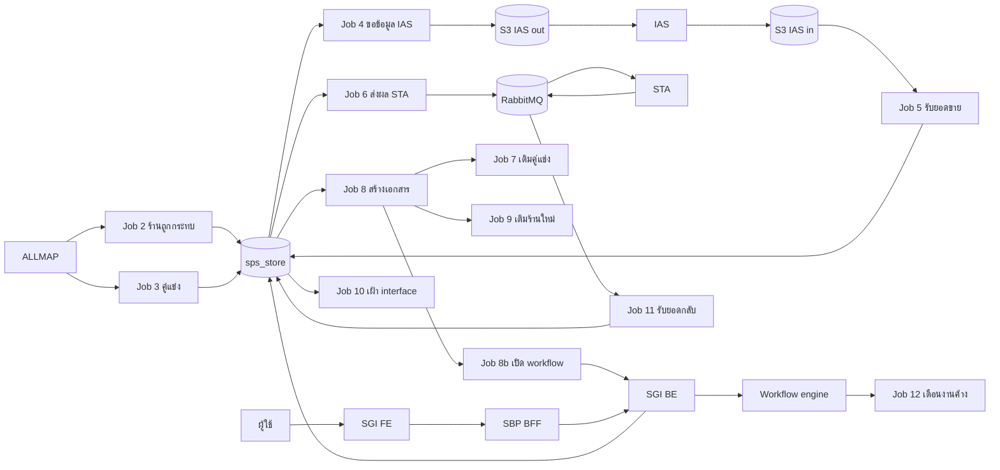
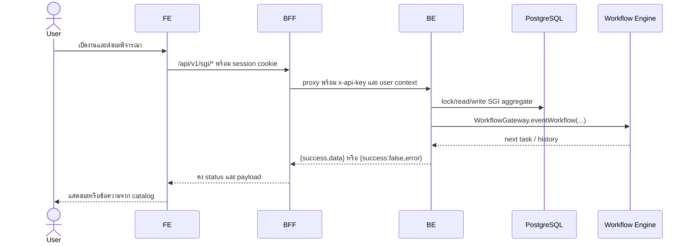

# Foundation 01 — ภาพรวมระบบ SGI

> Contract status: `CONFIRMED` · Document status: `Verified`

## ต้องทำอะไร และเสร็จแล้วได้อะไร

ระบบรับข้อมูลร้านถูกกระทบจาก ALLMAP ขอและรับยอดขายผ่าน IAS คำนวณ/ส่งสถานะกับ STA สร้างเอกสารประกันรายได้ แล้วให้ผู้ใช้ 5 section พิจารณาผ่าน workflow กลางของ SBP เอกสารนี้กำหนดขอบเขตและ data spine เพื่อให้ทุกทีมพูดถึงระบบเดียวกัน

## ขอบเขต component

| Component | หน้าที่ | สถานะ |
|---|---|---|
| Web FE `srm-sps-spsap-web-frontend` | worklist, detail, master, report, tracking | `TO-BE` ไม่มี SGI module |
| SBP BFF `srm-sps-spsap-sbp-bff` | session/Cognito, proxy, user context | `TO-BE` ไม่มี SGI module |
| Store BE `srm-sps-spsap-store-backend` | REST 28 เส้น, transaction, workflow adapter | `TO-BE` ไม่มี SGI module |
| SGI Batch `srm-sps-spsap-sop-sgi-batch` | Jobs 2–12 + 8b | `AS-BUILT` |
| PostgreSQL schema `sps_store` | 20 ตารางใหม่, 1 ตาราง reuse, workflow เดิม | target DDL ยืนยัน; dev migration ยังไม่รัน |
| ALLMAP / IAS / STA / S3 / RabbitMQ / Email | ระบบภายนอกและ transport | contract บางส่วน `BLOCKED` |

## End-to-end flow

## Request sequence

## Data ownership

- SGI เป็นเจ้าของตาราง `sgi_*` 20 ตารางตาม [Database Dictionary](../references/DATABASE-DICTIONARY.md)
- `fcs_qssi_score`, store/master, auth/menu, email template และ workflow 13 ตารางเป็นของระบบ SBP เดิม; SGI อ่านหรือเรียกผ่าน owner contract
- ห้าม Batch หรือ SGI service เขียน `workflow_*` ตรง ต้องผ่าน `@srm/glb-workflow` โดย `WorkflowGateway`
- `doc_no` ใช้แสดง/อ้าง API; `sgi_compensation_documents.id` ใช้เป็น workflow `referenceId` แบบ string

## ขอบเขตที่ไม่ทำ

- ไม่สร้าง login/RBAC/menu engine ใหม่
- ไม่สร้าง store/zone/branch type master ซ้ำ
- ไม่ทำหน้า FE สร้างเอกสารโดยผู้ใช้; `POST /sgi/document` เป็น service/pipeline only
- ไม่เปลี่ยน Jobs เดิม 42 ตัวของ batch repo
- ไม่ถือ HTML prototype เป็น production implementation

## Definition of done ระดับระบบ

API 28 เส้นและ DB 20+1 ต้อง trace ถึง owner/test ครบ, workflow state ห้ามมีเส้นทางไร้เจ้าของ, external message/file ต้อง replay ได้, ทุก mutation มี audit และ optimistic/concurrency guard, และไม่มี Decision `BLOCKED` ที่กระทบ release

อ่านต่อ: [Job pipeline](../jobs/00-job-pipeline-overview.md) · [API Catalog](../references/API-CATALOG.md) · [Decision Register](07-decision-register.md)

