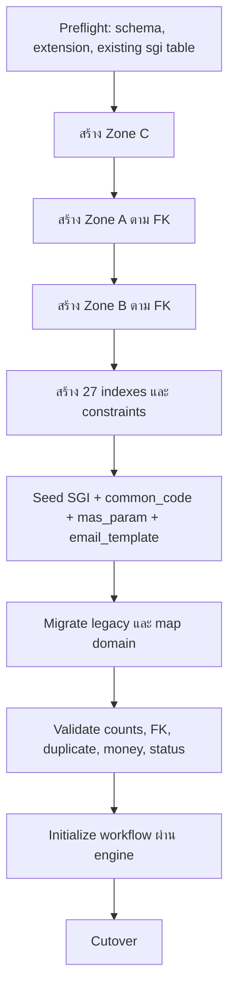

# Foundation 04 — Database และ Migration

> Contract status: `CONFIRMED` target schema · Document status: `Blocked`

## ต้องทำอะไร และเสร็จแล้วได้อะไร

ติดตั้งตาราง SGI ใหม่ 20 ตารางใน schema `sps_store`, reuse `fcs_qssi_score`, seed master/config ที่อนุมัติ และ migrate ข้อมูล legacy โดยตรวจ row count/domain/business key ก่อน cutover DDL canonical มาจาก generator `tools/build_sgi_schema_sql.py`; ห้ามแก้ generated SQL ด้วยมือ

## Data zones

| Zone | ตาราง | Owner/หน้าที่ |
|---|---|---|
| A — impact pipeline | `sgi_fgi_*`, `sgi_sales_transactions`, `sgi_interface_transactions` | Batch และ external interfaces |
| B — document | `sgi_compensation_documents`, `sgi_document_*`, `sgi_consideration_logs`, histories/cost/running | SGI BE + Batch 7/8/9/11 |
| C — master | `sgi_impacted_stores`, `sgi_external_factors`, `sgi_competitors` | SGI master/pipeline |
| Reuse | `fcs_qssi_score`, store/auth/email/workflow tables | owner เดิม; SGI จำกัด R/contract |

รายชื่อ/owner/reader/writer ครบอยู่ใน [Database Dictionary](../references/DATABASE-DICTIONARY.md)

## Migration order

## Canonical constraints

- `doc_no` unique; รูปแบบ `YYYY/xxxxx`; running number lock ต่อปี
- active document unique เชิงธุรกิจตามร้าน+งวดด้วย partial uniqueness ตาม DDL
- store code เป็น `VARCHAR(5)`; ห้าม numeric coercion
- document child FK ไป `doc_no`; impact child FK ไป `impact_process_id`
- `sgi_document_new_stores` unique `(doc_no,new_store_code)`
- sales transaction unique ต่อ summary/window/seq/date ตาม DDL
- interface business key/message id ต้อง dedup และ outbox state อยู่ใน enum
- FK/index/column ให้ยึด generated DDL และ [dictionary](../references/DATABASE-DICTIONARY.md), ไม่ยก SQL จาก prose ไปใช้โดยไม่เทียบ

## Transaction, lock และ concurrency

| Use case | Boundary |
|---|---|
| Job import chunk | transaction ต่อ bounded chunk; rollback เฉพาะ chunk และ fail job ตาม policy |
| Document create | running number + header + initial children + internal transaction row ใน transaction เดียว |
| Document edit/action | row/optimistic lock + children/log/outbox ใน transaction เดียว |
| Outbox publish | claim ด้วย lock/skip-locked, publish, update confirm; replay จาก READY/FAILED ตาม retry policy |
| Batch singleton | session advisory lock `(861000, jobNo)` |

## Migration/rollback

1. สำรองและ introspect Oracle/MSSQL จริงแบบ read-only
2. ตรวจ domain ที่อยู่นอก CHECK, duplicate business key, store code >5, orphan FK และ nullable mismatch
3. dry-run mapping พร้อม reconciliation report; record ที่ตัดต้องมี reason/owner
4. run DDL+seed ใน transaction; migrate ตาม dependency; ห้ามเขียน workflow table ตรง
5. smoke query/API/Jobs บนข้อมูลสำเนา; เทียบยอดเงินและ count
6. rollback schema ใช้เฉพาะ dev/UAT ที่ยืนยันไม่มี business transaction; production ใช้ forward fix/restore ตาม runbook

## BLOCKED ก่อน Ready

- ✅ **ติดตั้ง schema + seed ลงฐาน dev จริงแล้ว 2026-09-16** (PostgreSQL 17.7 · schema `sps_store`)
  และ **migration ข้อมูลรอบแรกลงแล้ว 2026-09-17** — 12 ตาราง · 186,635 แถว
- 🔴 **แต่ยังไม่ครบ และยังใช้ทำ cutover ไม่ได้** — แยกสองเรื่องนี้ออกจากกันให้ชัด:
  - เอกสาร **7,441 จาก 18,004 ฉบับยังย้ายไม่ได้** — Oracle ที่เข้าถึงได้เป็นฐาน **QA** (`sescsdbqa14`)
    ไม่มีข้อมูลปี 2024–2026 (2019–2023 ครบ 100% · 2025 ขาด 92% · 2026 ขาด 100%)
  - ไฟล์แนบ **7,766 รายการยังไม่มีไฟล์จริง** — เนื้อไฟล์ฝัง base64 ในฐาน K2 แต่ dump ถูกตัดที่ 65,535 ตัวอักษร
  - ตารางลูก 3 ตัวยังไม่ย้าย (`sales_summaries` · `sales_transactions` · `fgi_impact_competitors`)
  - ยังไม่รับรอง domain/duplicate cleanup ทั้งหมด · workflow definition ยังติดตั้งไม่ได้ (`GROUP_MAP` ว่าง)
- รายละเอียดผลรันจริงทุกรอบ: `docs/K2-migration-ผลโหลดข้อมูลจริง.md`
- D-002 parameter key/seed ownership, D-007 process status และ decision migration ที่เปิดอยู่
- ต้องได้ DBA sign-off เรื่อง extension/advisory lock, privilege, index/lock impact, backup/restore และ retention

หลักฐาน: `database.md`, `LLDD/md/LLDD-Database.md`, `output/sql/sgi_schema.sql`, `tools/check_sgi_sql_columns.py`

