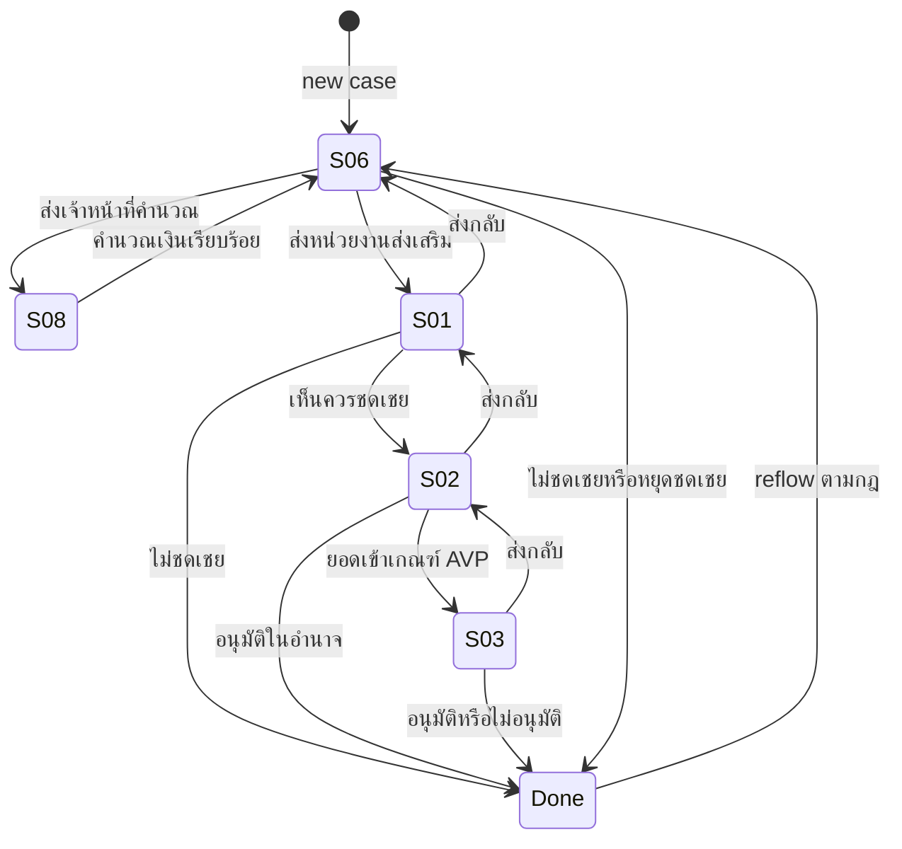
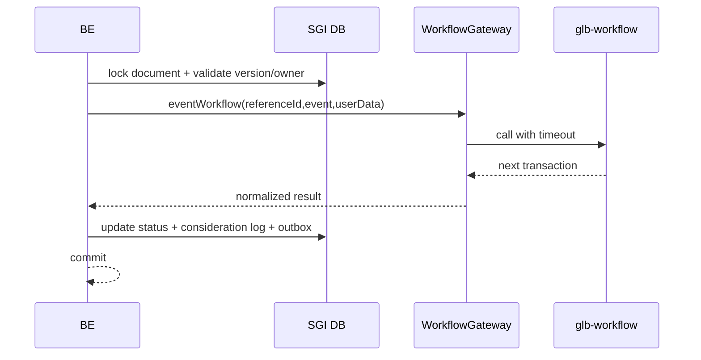

# Foundation 05 — Workflow Engine

> Contract status: `TO-BE` SGI adapter · Document status: `Blocked` · Decision: D-001, D-004

## ต้องทำอะไร และเสร็จแล้วได้อะไร

Store BE ต้องห่อ `@srm/glb-workflow` ด้วย `WorkflowGateway` เพื่อเปิด instance, ส่ง event, ตรวจ permission และอ่าน history โดย SGI ไม่เขียน 13 ตาราง `workflow_*` ตรง ผลคือ route/action มี owner, audit และ error mapping เดียวกัน

## Engine API ที่ยืนยันชื่อแล้ว

`initializeWorkflow`, `eventWorkflow`, `getPermissionEvents`, `getHistory`, `getTransaction`, `getPendingFlowByUser`, `getWorkflowsByUser`, `addPreApprover`

`referenceId` = `sgi_compensation_documents.id` แปลงเป็น string; `doc_no` เป็น business/display id เท่านั้น

## State transition

## Sequence และ transaction rule

ถ้า engine และ SGI DB ไม่รองรับ distributed transaction ต้องใช้ explicit failure state/compensation: ห้ามอ้างว่า atomic ข้ามระบบโดยไม่มีหลักฐาน ทดสอบ engine fail ก่อน/หลัง SGI write และ replay ด้วย idempotency key

## Routing rules

- Section 08 มี action เดียว “คำนวณเงินชดเชยเรียบร้อย” → 06
- 06 ส่งไป 08 เพื่อคำนวณ หรือ 01 เพื่อพิจารณา; ไม่ชดเชย/หยุด → 99 พร้อมกฎ next-period/reflow
- 01 เห็นควรชดเชย → 02; ไม่ชดเชย → 99; ส่งกลับ → 06
- 02 ใช้วงเงินอนุมัติ route ไป 03 หรือ 99; ส่งกลับ → 01
- 03 อนุมัติ/ไม่อนุมัติ → 99; ส่งกลับ → 02
- owner ต้องมาจาก engine task/current section ไม่ใช่ role name จาก UI

## Permission และ history

detail response ต้องคืน `permissions.canEditSections`, `permissions.canAction`, `actionOptions`, `currentSection`, `versionNo`; BE คำนวณจาก engine + menu permission Timeline รวม `sgi_consideration_logs` กับ engine history โดย sort deterministic และห้ามทำข้อมูล actor/comment หาย

## BLOCKED

- D-004: workflow definition/version IDs และ mapping status/event จริงต่อ environment
- D-001: แหล่ง canonical ของ approve limit 100,000 และ precedence ระหว่าง workflow config/`mas_param`
- ต้องยืนยัน behavior/idempotency ของ engine เมื่อ `initializeWorkflow` ด้วย reference เดิม และ transaction compensation design

อ่านต่อ: [Feature action](../features/04-workflow-actions-and-timeline.md) · [Job 8b](../jobs/JOB-08b-StartInternalWorkflow.md)

