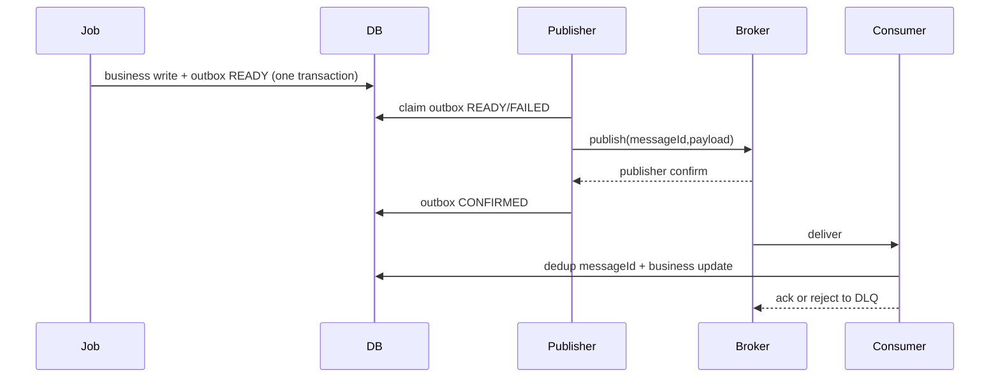

# Foundation 06 — Integrations และ Operations

> Contract status: `AS-BUILT` Batch + `TO-BE` platform · Document status: `Blocked`

## ต้องทำอะไร และเสร็จแล้วได้อะไร

กำหนด transport, ownership, retry และ observability ของ ALLMAP, IAS/S3, STA/RabbitMQ, Workflow API และ Email ให้ทีมพัฒนา/ปฏิบัติการรู้ว่า commit จุดไหน ใคร retry และต้องแจ้งใครเมื่อเสีย

## Integration matrix

| ระบบ | ทิศทาง/transport | Producer → Consumer | Durability |
|---|---|---|---|
| ALLMAP | SQL Server read-only | Jobs 2/3 ← views | retry query; no source write |
| IAS | text file via S3 | Job 4 → IAS; IAS → Job 5 | outbox/hash, backup prefix, idempotent file import |
| STA | RabbitMQ topic | Job 6/BE reflow → STA; STA → Job 11 | publisher confirm, message id dedup, retry/DLQ |
| Workflow | internal HTTP + library | Job 8b → BE → engine | timeout/retry + reference idempotency |
| S3 attachment | object store | BE upload/download | metadata in DB, AV scan policy, presigned/stream auth |
| Email | shared email library | Jobs/BE → recipients | business transactionไม่ rollback เพราะ email; log/send result |

## Outbox flow

`CONFIRMED` คือ broker confirm ไม่ใช่ STA business ACK; ไม่มี `POST /sgi/interface/sta/ack`

## Operational contract

- AWS Batch/EventBridge เป็นเจ้าของ schedule; source repo ไม่มี `@Cron`; cron ใน env เป็น reference
- dependency ต้องเป็น scheduler/step dependency ไม่ใช่แค่ตั้งเวลาให้ห่างกัน
- health/metric ขั้นต่ำ: `job_started_total`, `job_finished_total{status}`, candidate/processed/skipped/failed, retry, lock skipped, outbox backlog age, DLQ depth, email failure, external latency
- structured log ต้องมี `jobNo`, `jobName`, `runId`, business period/key, stage, counts, duration, errorCode; ห้าม log secret/raw personal data
- alarm: job failed/non-run, backlog oldest age, DLQ >0, repeated no-data, workflow waiting, S3/MQ/API credential expiry

## Security

ALLMAP password, RabbitMQ URL credential, service token, API key และ cloud credential ต้องมาจาก secret store; ห้ามอยู่ใน `INPUT`, source, log หรือ Markdown Legacy `fcsJar` มี credential ต้อง rotate และ scan ด้วย `tools/scan_secrets.py`

## BLOCKED

- D-005 Job 11 runtime consumer ownership/deployment model
- D-006 sender/template/recipient ownership
- D-008 IAS exact filename/encoding/newline acceptance
- D-012 AWS dependency/schedule/timeout/resource/retry definition
- เจ้าของ STA ต้องรับรอง routing keys, message schema, DLQ/replay และไม่มี business ACK

อ่านต่อ: [Config Catalog](../references/CONFIG-AND-ENV-CATALOG.md) · [Job pipeline](../jobs/00-job-pipeline-overview.md)
