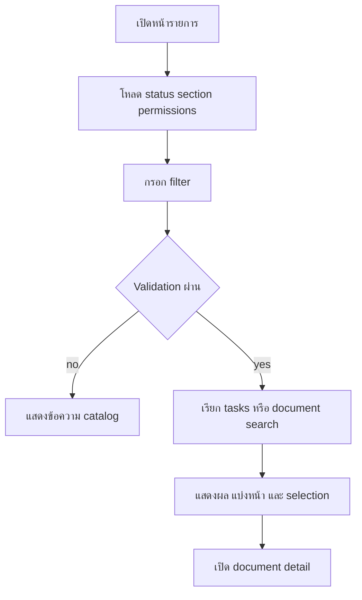
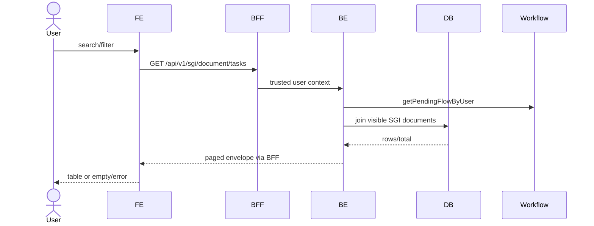

# Feature 01 — Worklist และค้นหาเอกสาร

> Contract status: `TO-BE` · Document status: `Draft`

## 1. งานนี้คืออะไร

สร้างหน้ารายการ “งานรอท่านดำเนินการ” และ “เอกสารที่เกี่ยวข้อง” ให้ผู้ใช้ค้นหา เปิด detail และทำ bulk action ที่อนุญาต โดยรายการงานยึด current task owner จาก workflow ไม่ใช่ filter role ฝั่ง FE

## 2. ผู้ใช้และผลลัพธ์ที่ต้องการ

ผู้ปฏิบัติงาน Section 06/08/01/02/03 เห็นงานที่ตนทำได้; HQ/report role ค้นเอกสารตามสิทธิ์; ผลต้อง paginate/sort deterministic และรักษา store code leading zero

## 3. ขอบเขตที่ทำและไม่ทำ

ทำ list/filter/pagination/selection/navigation/empty/error; ไม่ทำ dashboard summary, RBAC/menu ใหม่ หรือ search store/zone master ใหม่

## 4. สถานะปัจจุบัน

`TO-BE`: production FE/BFF/BE ไม่มี `/sgi`; prototype `k2-list-waiting.html`, `k2-list-related.html` เป็น screen evidence เท่านั้น

## 5. สิ่งที่ dev ต้องสร้างหรือแก้

สร้าง two routes + shared filter/table hook, BFF proxy module, BE query DTO/controller/service/repository, indexes/query plan และ API-01/02/12/13 tests

## 6. Flowchart



## 7. Sequence Diagram



## 8. FE contract

Routes proposed `/sgi/tasks`, `/sgi/documents`; components `SgiSearchFilters`, `SgiDocumentTable`, `Pagination`, bulk action bar State: lookup/loading/filter/page/sort/selected/error Buttons: ค้นหา, ล้างค่า, เปิดเอกสาร, selected action Validation: document search requires `year`; report-specific rulesไม่ใช้ที่นี่; FE ไม่รวมสิทธิ์เอง API: 01,02,12,13 + existing store/common lookups

## 9. BFF contract

Proxy exact method/path/query; forward session-derived user/group/permission/request ID only; whitelist query arrays; timeout/cancel; propagate 4xx/5xx envelope without translating Thai messages

## 10. BE contract

Controllers `SgiDocumentController`; DTO `ListTasksQueryDto`, `SearchDocumentsQueryDto`; services query workflow/tasks then repository with visibility guard Authentication user; transaction read-only; stable sort tie-break `doc_no`

## 11. API contract

`GET /api/v1/sgi/document/tasks`, `/document`, `/lookup/document-statuses`, `/lookup/workflow-sections`

```json
{"success":true,"data":{"items":[{"docNo":"2026/00001","impactedStoreCode":"01234","statusCode":"06","currentSection":"06","versionNo":3}],"page":1,"pageSize":20,"total":1}}
```

400 invalid/missing year, 401/403, 422 invalid range; full trace [API Catalog](../references/API-CATALOG.md)

## 12. Database mapping

R: documents, consideration logs latest result, document new stores, store/zone/branch master, workflow transactions/tasks; indexes by active/status/period/store/created/wait; no writes การเลือกหลายรายการใช้ docNo+versionNo

## 13. Workflow/Integration

Task list uses `getPendingFlowByUser`; Section 06 union stopped-reopenable closed documentsตาม business rule; other sections must not see this union

## 14. Failure, retry, idempotency และ security

GET retry once only on safe network failure; abort previous search; visibility enforced BE; no PII in URL beyond approved filters; page drift acceptable only with deterministic sort

## 15. Test cases และ acceptance criteria

API-01/02/12/13; each section visibility, stopped/rejected distinction, required year, arrays/date/money bounds, empty/loading/error, pagination/sort, leading zeros, bulk stale version, query plan under target data volume

## 16. Code path ที่ต้องสร้าง

FE `src/app/(main)/sgi/{tasks,documents}` + shared services/types; BFF `src/modules/sgi/document`; BE `src/modules/sgi/document` + DTO/repository/tests

## 17. เอกสารและ Decision ID ที่เกี่ยวข้อง

[API/security](../00-foundation/03-api-security-and-error-contract.md), [Workflow](../00-foundation/05-workflow-engine.md), [API Catalog](../references/API-CATALOG.md); D-001, D-004, D-011

