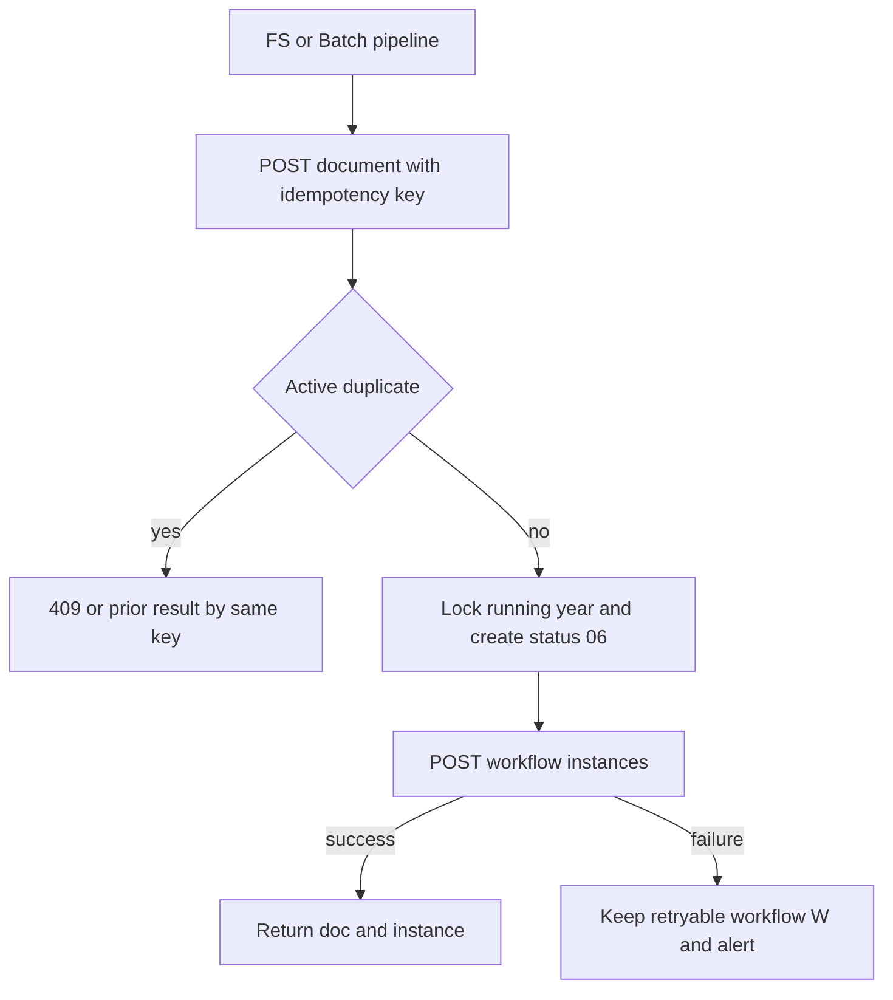
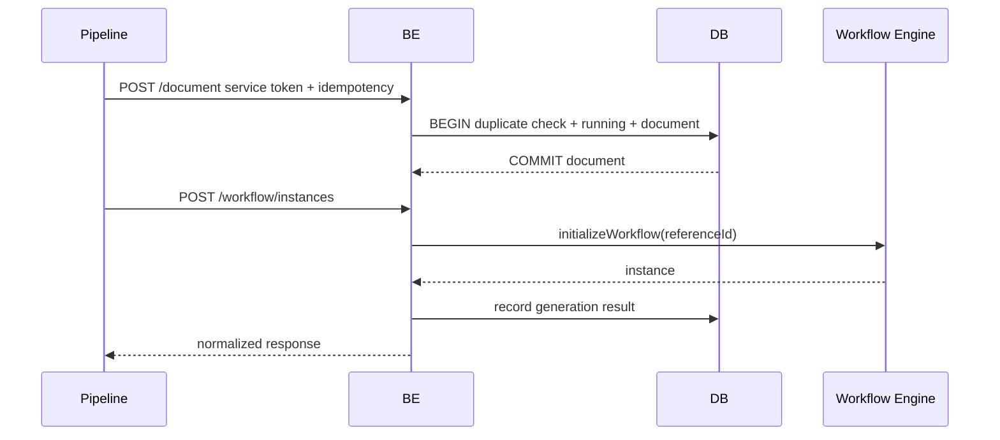

# Feature 02 — Document Creation Pipeline

> Contract status: `TO-BE` FE/BFF/BE + `AS-BUILT` Batch · Document status: `Blocked`

## 1. งานนี้คืออะไร

สร้างเอกสารจาก FS/SBP Statement หรือ Batch pipeline ด้วย service identity ออกเลขเอกสาร กัน active duplicate และเปิด workflow ผ่าน endpoint internal ไม่มีฟอร์ม FE ให้ผู้ใช้สร้างเอง

## 2. ผู้ใช้และผลลัพธ์ที่ต้องการ

Pipeline ได้ `docNo`, document id/status และ workflow start result ที่ replay ได้; ผู้ใช้เห็นหน้าอธิบายกระบวนการและเอกสารเมื่อพร้อม

## 3. ขอบเขตที่ทำและไม่ทำ

ทำ API create/workflow/summary/status, idempotency/running number/trace; ไม่ให้ browser เรียก POST create, ไม่ embed FS form เป็นแหล่งสร้างใน release นี้

## 4. สถานะปัจจุบัน

Job 8/8b `AS-BUILT`; Store BE endpoints 04/24–26 และ BFF/FE status `TO-BE`; D-004 blocks end-to-end

## 5. สิ่งที่ dev ต้องสร้างหรือแก้

BE create use case + service-token guard + running repository + WorkflowGateway; BFF route only if internal network design requires, otherwise deny user route; FE process/status page

## 6. Flowchart

## 7. Sequence Diagram

## 8. FE contract

Route `/sgi/create` — **main card เป็น iframe ของหน้าสร้างเอกสารระบบ FS** (มติ 2026-08-06) ไม่ใช่หน้าอ่านอย่างเดียว: SBP **ไม่มีฟอร์มของตัวเอง** แต่ **ต้องคงกรอบ iframe ไว้** เพราะเป็นช่องทางเดียวที่ผู้ใช้สร้างเอกสารได้ · ใต้ iframe เป็นหมายเหตุ 4 ขั้นตอน (ลอกจากหน้าจอ K2 เดิม) · ไม่มีปุ่มสร้างฝั่ง SBP · `POST /sgi/document` เรียกโดย pipeline/service token เท่านั้น State optional tracking reference; link to documents; API only GET workflow summary/status if permission · ⚠️ **ห้ามตัด iframe ทิ้ง** — ตัดแล้วจะไม่เหลือทางสร้างเอกสารเลย (ยึดตาม `LLDD/md/FE/LLDD-FE-Create-Document.md` และ `k2-create.html`)

## 9. BFF contract

User BFF must not expose service-token create; internal proxy must keep idempotency/request IDs and use separate credential; never forward browser-provided identity as service identity

## 10. BE contract

Controllers `SgiDocumentController.create`, `SgiWorkflowController`; DTO strict create/initialize; services `CreateSgiDocumentService`, `WorkflowGateway`; repository transaction for number/header/trace Authentication service token; workflow external boundary after document commit with retry state

## 11. API contract

POST 04 body representative in API Catalog; POST 24 uses `{referenceId,docNo,entryState,idempotencyKey}`; GET 25/26 read state Success create 201, workflow 201/200; 401/403, 409 duplicate, 422 invalid, 503 engine

## 12. Database mapping

W: running numbers, documents, internal interface transaction, process generation status; R: impacted store/process/compensation/store/approver sources; workflow tables only via engine Locks: running year + active business key

## 13. Workflow/Integration

Job 8 creates, Job 8b calls BE; `referenceId=document.id` string; Gen Flow determines 06/08/N; workflow failure must not delete valid document

## 14. Failure, retry, idempotency และ security

Idempotency key unique to source event; same key returns same result; different key same active business yields 409; service token rotated; bounded workflow retry; audit source and payload hash not secret

## 15. Test cases และ acceptance criteria

API-04/24/25/26, concurrent number, active vs closed duplicate, same/different idempotency, transaction rollback, workflow timeout/replay, unauthorized browser, state summary counts, Job 8→8b E2E

## 16. Code path ที่ต้องสร้าง

FE `src/app/(main)/sgi/create`; BFF internal `src/modules/sgi/workflow` if required; BE `src/modules/sgi/document` and `workflow`; Batch paths already in Jobs 8/8b docs

## 17. เอกสารและ Decision ID ที่เกี่ยวข้อง

[Job 8](../jobs/JOB-08-CreateCompensationDocument.md), [Job 8b](../jobs/JOB-08b-StartInternalWorkflow.md), [Workflow](../00-foundation/05-workflow-engine.md); D-002, D-004, D-011, D-012

