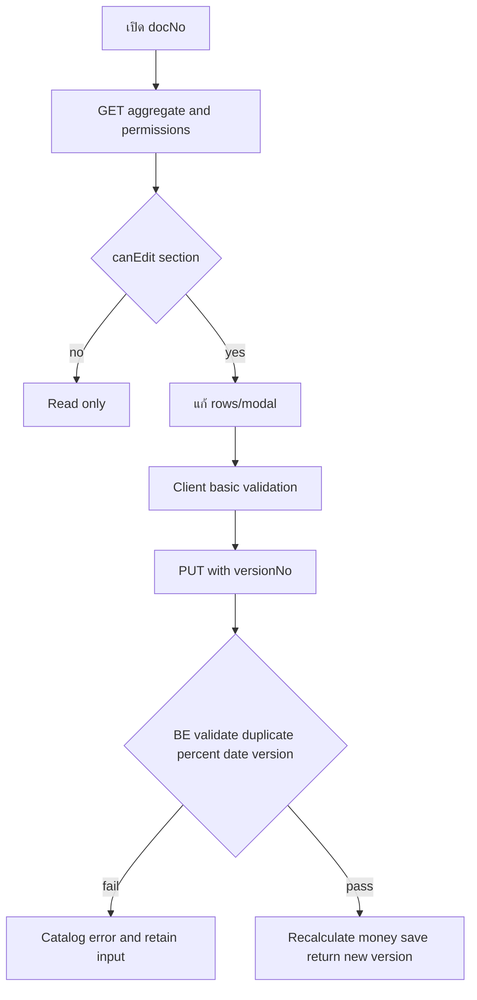
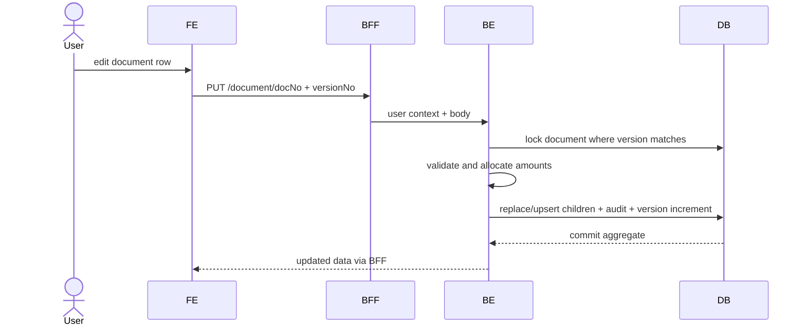

# Feature 03 — Document Detail และ Editing

> Contract status: `TO-BE` · Document status: `Draft`

## 1. งานนี้คืออะไร

แสดง aggregate เอกสาร 12 ส่วนและให้ผู้มี current task แก้เฉพาะ section ที่อนุญาต: ร้านใหม่ คู่แข่ง ปัจจัย และข้อมูลประกอบ โดย BE ตรวจ percent/duplicate/version และคำนวณเงิน

## 2. ผู้ใช้และผลลัพธ์ที่ต้องการ

Section 06/08/01/02/03 เห็นข้อมูลเดียวกันแต่ปุ่ม/ช่องแก้ตาม permission; save แล้วได้ aggregate/version ใหม่ที่ยอด percent=100 และ money reconcile

## 3. ขอบเขตที่ทำและไม่ทำ

ทำ detail/edit modal/validation/calculation; attachment/sales/timeline/action แยก F04/F05; ไม่สร้าง master inline

## 4. สถานะปัจจุบัน

`TO-BE`; prototype `k2-document.html` และ role viewsเป็น UX evidence; Jobs 7/9 เขียน child data `AS-BUILT`

## 5. สิ่งที่ dev ต้องสร้างหรือแก้

FE route dynamic + section cards/forms; BFF proxy; BE aggregate query, update command, calculators, validators, optimistic lock and audit

## 6. Flowchart



## 7. Sequence Diagram



## 8. FE contract

Route `/sgi/documents/[docNo]`; state aggregate/draft/modal/dirty/submitting/error Components 12 section cards, new-store allocation table, competitor/factor modals Buttons save/add/edit/deleteตาม permission Validation required master code/date, dateTo≥dateFrom, percent total 100 before submitแต่ BE authoritative Messagesจาก Error Catalog API 03/05 plus master lookups

## 9. BFF contract

Encode docNo safely; body size/whitelist; forward version/user/request id; preserve 409 draft state; no amount calculation/mutation mapping in BFF

## 10. BE contract

`SgiDocumentController.detail/update`; DTO discriminated section update or canonical aggregate contract; service locks header, checks task owner/section/version, validates master codes/unique store, deterministic money allocation; transaction children+audit+version

## 11. API contract

GET 03 returns header, stores/competitors/factors/cost/compensation, permissions/actionOptions/version PUT 05 example:

```json
{"versionNo":3,"newStores":[{"newStoreCode":"00990","compensatePercent":60,"sourceSystem":"ALLMAP"},{"newStoreCode":"01001","compensatePercent":40,"sourceSystem":"USER"}]}
```

200 new version; 403/404/409 `STALE_VERSION`/`CONFLICT`, 422 percent/master/date

## 12. Database mapping

R header + all document children + master/store/process; W new stores/competitors/external factors/cost/history as owned, header version/update actor Audit consideration log reserved for workflow actions; DB unique/FK reinforce service checks

## 13. Workflow/Integration

canEdit from current task section and menu; Batch 7/9 source rows can sync concurrently—USER rows preserved and optimistic conflict forces reload

## 14. Failure, retry, idempotency และ security

PUT not blindly auto-retried; version prevents lost update; repeated same version fails after first; sanitize text/CSV later, no hidden field overposting; BE returns computed amounts only

## 15. Test cases และ acceptance criteria

API-03/05; each role read/edit matrix, 0/99.99/100 totals, rounding residual, duplicate leading-zero store, competitor/factor required/date, batch-vs-user concurrency, stale version, rollback/audit, responsive/keyboard modal

## 16. Code path ที่ต้องสร้าง

FE `src/app/(main)/sgi/documents/[docNo]`; BFF `src/modules/sgi/document`; BE `src/modules/sgi/document/{dto,services,repositories,entities}`

## 17. เอกสารและ Decision ID ที่เกี่ยวข้อง

[Glossary/rules](../00-foundation/02-glossary-and-business-rules.md), [DB](../references/DATABASE-DICTIONARY.md), [Job 7](../jobs/JOB-07-SyncCompetitorToDocument.md), [Job 9](../jobs/JOB-09-SyncNewStoreToDocument.md); D-003, D-011

