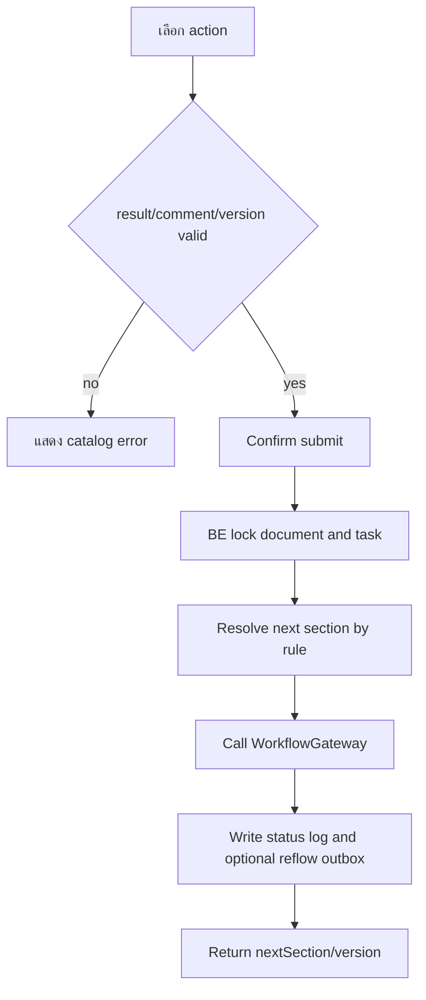
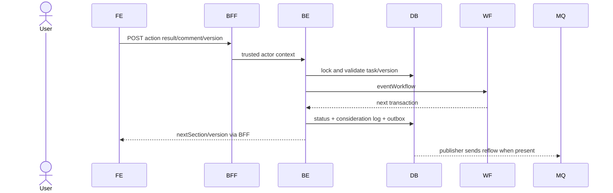

# Feature 04 — Workflow Actions และ Timeline

> Contract status: `TO-BE` · Document status: `Blocked` · Decision: D-001, D-004, D-011

## 1. งานนี้คืออะไร

ให้ current task owner เลือกผล/ใส่ comment ส่ง workflow และดู timeline รวมของ SGI+engine โดย route ตาม section/result/amount และสร้าง STA reflow outbox เมื่อเปิดเรื่องที่จบแล้ว

## 2. ผู้ใช้และผลลัพธ์ที่ต้องการ

ผู้ปฏิบัติงานรู้ action ที่ทำได้และ next section; ผู้ตรวจย้อนหลังเห็นใครทำอะไรเมื่อใด/comment/result ครบ

## 3. ขอบเขตที่ทำและไม่ทำ

ทำ single/bulk-compatible action contract, confirmation, timeline; ไม่ให้ FE คำนวณ route/permission และไม่เขียน engine tableตรง

## 4. สถานะปัจจุบัน

`TO-BE` BE/FE/BFF; engine libraryมีอยู่; contract definition/version/header trustยัง Blocked

## 5. สิ่งที่ dev ต้องสร้างหรือแก้

FE action panel/timeline; BFF proxy; BE workflow controller/service/gateway, route table, locks, consideration log/outbox, timeline merger

## 6. Flowchart



## 7. Sequence Diagram



## 8. FE contract

Within detail route; action options only from GET detail; state selected/comment/confirmation/submitting Error exact: action result/comment/stale Buttons disabled once submit; reload after success; timeline lazy/load more API 06/07/13

## 9. BFF contract

No route logic; forward actor context and idempotency/request id; preserve conflict/validation; bulk orchestration if added must return per-document result not partial hidden success

## 10. BE contract

`SgiDocumentWorkflowController`; DTO action enum/comment/version/idempotency; service validates menu+current owner+allowed event, route amount, WorkflowGateway, logs/outbox Authentication user; concurrency lock Transaction limitation跨 engine documented/compensated

## 11. API contract

POST 06 request shown F02/F03; response:

```json
{"success":true,"data":{"docNo":"2026/00001","statusCode":"01","nextSection":"01","versionNo":4,"transactionId":"9812"}}
```

GET 07 returns ordered `{occurredAt,sectionCode,actor,result,resultCategory,comment,transactionId}` 401/403/404/409/422/503

## 12. Database mapping

R/W document header/version/status, consideration logs; W interface outbox `SGI_REFLOW` when closed no-compensation/stop reopened; R engine history via gateway; indexes doc/time/transaction

## 13. Workflow/Integration

Transitions per Foundation 05; Section 08→06; approve limit route D-001; reflow publish `compensate_status=R` message only ไม่ลง DB compensation enum

## 14. Failure, retry, idempotency และ security

double click/idempotency + version; engine timeout must not fabricate next state; outbox after SGI commit; actor/comment audit immutable; escape display; task owner enforced BE

## 15. Test cases และ acceptance criteria

API-06/07/13; full section×action matrix, 99,999.99/100,000/100,000.01, comments required, double submit, wrong owner, backflow, closed reflow/outbox, engine failure compensation, timeline merge/order/pagination

## 16. Code path ที่ต้องสร้าง

FE detail `_components/workflow`; BFF `src/modules/sgi/workflow`; BE `src/modules/sgi/workflow` + document action service/gateway/tests

## 17. เอกสารและ Decision ID ที่เกี่ยวข้อง

[Workflow engine](../00-foundation/05-workflow-engine.md), [Error Catalog](../references/ERROR-CATALOG.md), [Job 8b](../jobs/JOB-08b-StartInternalWorkflow.md); D-001, D-004, D-011

