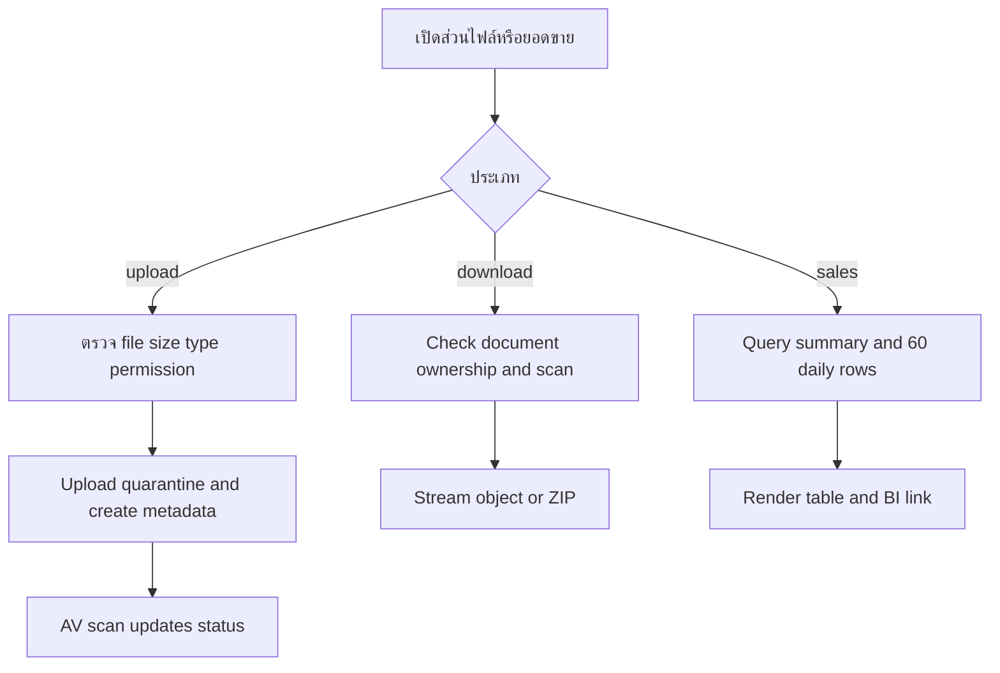
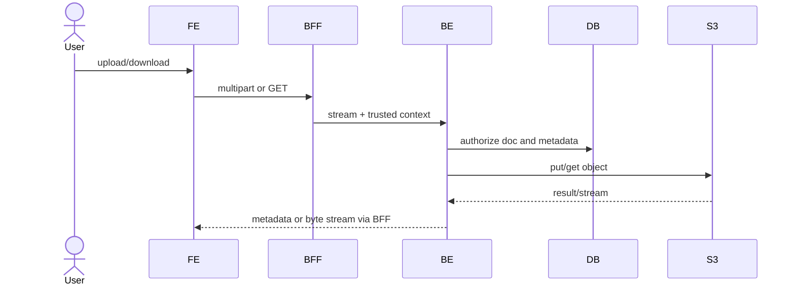

# Feature 05 — Attachments และ Sales Data

> Contract status: `TO-BE` · Document status: `Draft` · Decision: D-013

## 1. งานนี้คืออะไร

ให้ผู้มีสิทธิ์แนบ/ดาวน์โหลดไฟล์เอกสารอย่างปลอดภัย และดูยอดขายย้อนหลัง 4 หน้าต่าง × 15 วันเพื่อประกอบการพิจารณา

## 2. ผู้ใช้และผลลัพธ์ที่ต้องการ

current task owner upload ได้; participant download เฉพาะไฟล์ของเอกสารที่เห็น; ผู้พิจารณาดู sales summary/detail โดย store/date/seq ไม่เพี้ยน

## 3. ขอบเขตที่ทำและไม่ทำ

ทำ upload, AV state, one/all download, sales table/link BI; ไม่แสดงกราฟ trend ที่ถูกตัดและไม่เก็บ binary ใน DB

## 4. สถานะปัจจุบัน

`TO-BE`; prototype เป็น UX evidence; S3 shared service pattern และ Job 5 sales data มี `AS-BUILT`

## 5. สิ่งที่ dev ต้องสร้างหรือแก้

FE cards/uploader/download/sales modal; BFF streaming/multipart proxy; BE attachment/sales controllers, S3/AV adapter, ZIP stream, metadata transaction, authorization

## 6. Flowchart

## 7. Sequence Diagram

## 8. FE contract

Detail cards; state files/uploadProgress/scanStatus/sales/loading/errors Buttons เลือกไฟล์, แนบเอกสาร, ดาวน์โหลด, ดาวน์โหลดทั้งหมด, ข้อมูลยอดขายเพิ่มเติม Validate selected, ≤5 MiB, extension hint; BE authoritative; disable blocked/pending per policy API 08–11

## 9. BFF contract

Stream multipart/download without buffering full large ZIP; preserve filename/content-type/content-disposition/status; enforce time/body limit; never log body; abort upstream on client disconnect

## 10. BE contract

Controllers `SgiAttachmentController`, `SgiSalesController`; DTO/path validation; service checks doc visibility/current owner; object key generated server-side; metadata points to immutable key/hash; AV callback/job owner; ZIP bounded/streamed; sales read-only

## 11. API contract

POST multipart field `file`; 201 metadata `{attachId,fileName,fileSize,scanStatus}` GET one/all returns stream; all with none 404 Sales response groups windows/rows/summary 400/403/404, 413, 415, 422 scan

## 12. Database mapping

W/R `sgi_document_attachments`; R documents for auth; R sales summaries/transactions; indexes doc/upload time and sales summary/window/seq Object key unique; DB transaction cannot include S3—use compensating delete/orphan cleanup

## 13. Workflow/Integration

upload only editable task; download participant/report policy; S3 encryption/AV/retention; BI link from approved config and no token in URL

## 14. Failure, retry, idempotency และ security

upload idempotency via request/hash optional; S3 success+DB fail cleanup; DB success+scan fail status FAILED; path traversal/content sniff/formula irrelevant; filename sanitize; D-013 pending download

## 15. Test cases และ acceptance criteria

API-08–11, no file/exact 5MiB/over/type spoof, quarantine/clean/blocked/failed/pending, cross-doc attachId, no attachments ZIP, large stream/disconnect, sales 4×15/leap/missing/order/permission

## 16. Code path ที่ต้องสร้าง

FE document attachment/sales components; BFF `src/modules/sgi/attachment` streaming; BE `src/modules/sgi/{attachment,sales,integration}`

## 17. เอกสารและ Decision ID ที่เกี่ยวข้อง

[Integration](../00-foundation/06-integrations-and-operations.md), [Job 5](../jobs/JOB-05-ImportImpactSaleFromIAS.md), [Error Catalog](../references/ERROR-CATALOG.md); D-011, D-013

