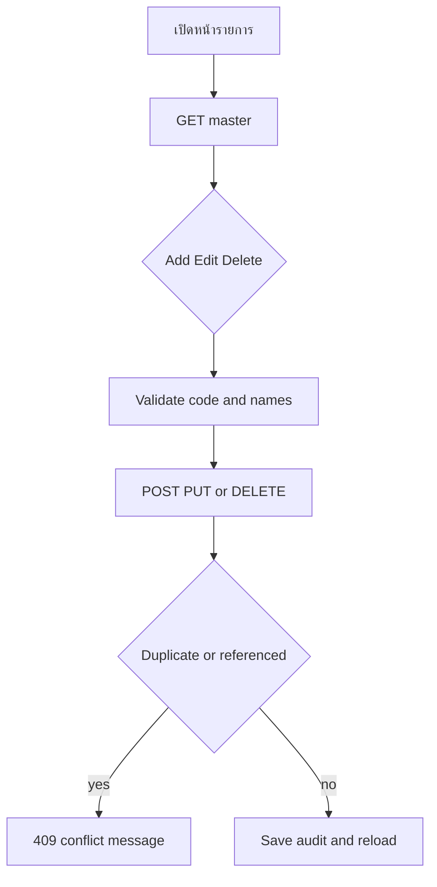
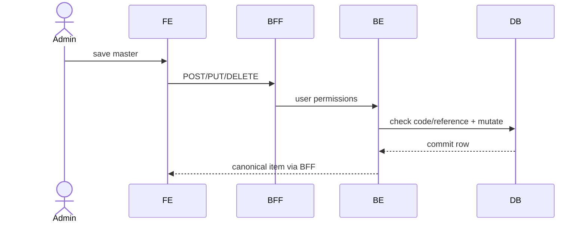

# Feature 06 — Master Data

> Contract status: `TO-BE` · Document status: `Draft`

## 1. งานนี้คืออะไร

ดูแลปัจจัยภายนอกและ master แบรนด์คู่แข่งของ SGI ด้วย CRUD แยกกัน เพื่อใช้ dropdown ในหน้าเอกสาร โดยไม่สร้าง master store/zone/branch/RBAC ซ้ำ

## 2. ผู้ใช้และผลลัพธ์ที่ต้องการ

HQ/admin ที่มี `canManage` เพิ่ม/แก้/ลบ code/name ได้; ผู้ใช้เอกสารอ่านรายการ active; code ซ้ำหรือถูกใช้งานแล้วได้ผลชัดเจน

## 3. ขอบเขตที่ทำและไม่ทำ

ทำ 8 endpoints/two screens/audit fields; ไม่ทำ GET by code, bulk import, generic master engine หรือ hard-delete ที่ทำลาย historical referenceโดยไม่ policy

## 4. สถานะปัจจุบัน

`TO-BE`; prototype `k2-factors.html`, `k2-competitors.html`; tables/seed target มีแล้วแต่ controllersไม่มี

## 5. สิ่งที่ dev ต้องสร้างหรือแก้

FE reusable master table/modal; BFF proxy; BE controllers/services/repositories DTO unique/reference guard and audit

## 6. Flowchart

## 7. Sequence Diagram

## 8. FE contract

Routes `/sgi/master/factors`, `/sgi/master/competitors`; list/search/modal state Buttons add/edit/deleteตาม canManage Required code/nameTh/nameEnตาม competitor; factor fieldsตาม schema Confirm delete; show `CODE_DUPLICATE` verbatim API 14–21

## 9. BFF contract

Exact proxy; whitelist path code/body; forward permission/request ID; encode code; no client-side role override/caching stale mutation

## 10. BE contract

Controllers `SgiCompetitorController`, `SgiFactorController`; DTO create/update; service normalizes whitespace/caseตาม canonical rule, enforces unique and reference delete policy Authentication menu permission; mutation transaction + audit actor

## 11. API contract

GET list; POST collection; PUT/DELETE `/{code}` no GET item Example `{ "code":"12", "nameTh":"...", "nameEn":"..." }` 200/201/204; 403/404/409/422

## 12. Database mapping

R/W `sgi_competitors`, `sgi_external_factors`; reference checks document competitor/factor and impact competitor brand code; UK code/index active/name; prefer soft inactive if history references

## 13. Workflow/Integration

Document edit reads these dropdowns; ALLMAP branch competitor canมี `brand_code=NULL`; master edit must not rewrite historical branch names automatically

## 14. Failure, retry, idempotency และ security

GET retry safe; mutation no auto retry without idempotency; duplicate via DB constraint; escape names; permission server-side; deletion race caught FK/conflict

## 15. Test cases และ acceptance criteria

API-14–21, list/order/active, required/length/Unicode/trim, duplicate concurrent, update nonexistent, delete referenced/unreferenced, role matrix, document dropdown integration

## 16. Code path ที่ต้องสร้าง

FE `src/app/(main)/sgi/master/{factors,competitors}`; BFF/BE `src/modules/sgi/master`; entities/migration generated separately

## 17. เอกสารและ Decision ID ที่เกี่ยวข้อง

[DB Dictionary](../references/DATABASE-DICTIONARY.md), [API security](../00-foundation/03-api-security-and-error-contract.md); D-011, D-014 if migrating legacy master

