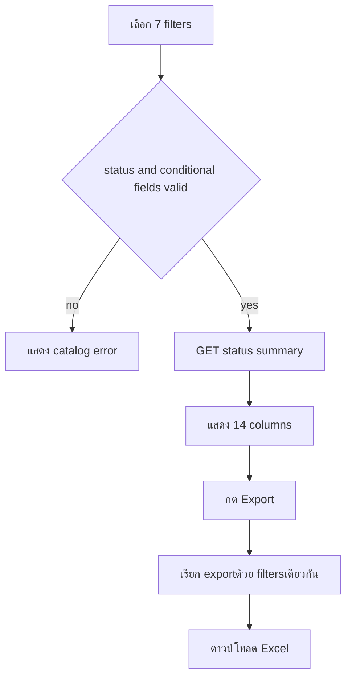
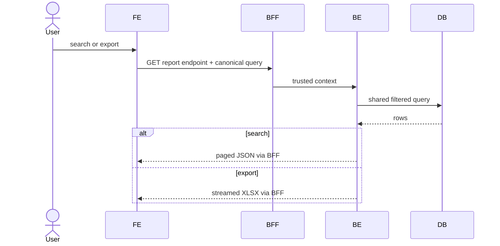

# Feature 07 — Status Report และ Export

> Contract status: `TO-BE` · Document status: `Draft`

## 1. งานนี้คืออะไร

ค้นหารายงานตรวจสอบประกันรายได้ 14 คอลัมน์ด้วย filter ตาม SDD และ export Excel จาก query/authorization ชุดเดียวกันให้บัญชีใช้งาน

## 2. ผู้ใช้และผลลัพธ์ที่ต้องการ

HQ/report/accounting เห็นผลตามสิทธิ์และ export เท่ากับผลค้นหาทุก filter/column/order โดยข้อมูลรหัส/วันที่/เงินไม่เสียรูป

## 3. ขอบเขตที่ทำและไม่ทำ

ทำ filter/status result/page/export; ไม่ทำ dashboard, chart หรือ SAP posting

## 4. สถานะปัจจุบัน

`TO-BE`; prototype `k2-report.html`; endpoint/BE query/exportไม่มี production code

## 5. สิ่งที่ dev ต้องสร้างหรือแก้

FE filter/report table/download; BFF stream; BE shared report query specification + Excel writer/formula defense + authorization/query plan

## 6. Flowchart

## 7. Sequence Diagram

## 8. FE contract

Route `/sgi/reports/status-summary`; filters status required, impacted/new store pair, statement from/to required when status 99, storeType[] from existing master 7 values, region[] dynamic, result radio State filter/result/page/export Buttons search/clear/export Validation exact message API 22/23 + lookup

## 9. BFF contract

Preserve repeated array query, no row reformat, stream XLSX/content-disposition, longer bounded export timeout, cancel disconnect; permission canExport separate from canView

## 10. BE contract

`SgiReportController`; one `StatusSummaryQueryDto`; shared `StatusSummaryQueryService` used by JSON/export; repository parameterized query/latest result; export writer text-types store/doc codes, dates AD, money numeric; read-only transaction/snapshot

## 11. API contract

GET 22 paged JSON, GET 23 same filters without page or ignores page by explicit contract Excel 14 columns 200 stream; 400 `REPORT_STATUS_REQUIRED`, 422 range/pair, 403; no rows returns empty list/export with headerตาม decision

## 12. Database mapping

R documents, new stores, latest consideration result, compensation/history/cost, impacted/store/region/branch master; no writes Index year/status/period/store/result and query plan required

## 13. Workflow/Integration

status/result derived from canonical document+latest consideration log, not UI labels; export downstream to accounting but no direct SAP interface

## 14. Failure, retry, idempotency และ security

GET safe retry; export generation bounded memory/row limit/timeout; spreadsheet formula injection prefix/escape cells beginning `=+-@`; visibility and audit export eventตาม policy

## 15. Test cases และ acceptance criteria

API-22/23, each conditional/array filter, result latest, status 99 date, pair rule, date AD, 14 columns exact/order/types, JSON/export parity, zero/large rows, formula injection, permissions/stream abort/query plan

## 16. Code path ที่ต้องสร้าง

FE `src/app/(main)/sgi/reports/status-summary`; BFF/BE `src/modules/sgi/report`; export helper/tests

## 17. เอกสารและ Decision ID ที่เกี่ยวข้อง

[API Catalog](../references/API-CATALOG.md), [Glossary](../00-foundation/02-glossary-and-business-rules.md), [Test Delivery](../references/TEST-AND-DELIVERY.md); D-001 for displayed limit, D-011

