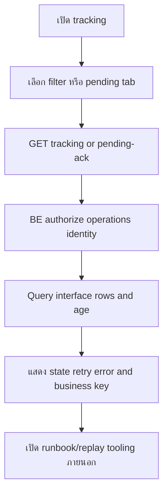
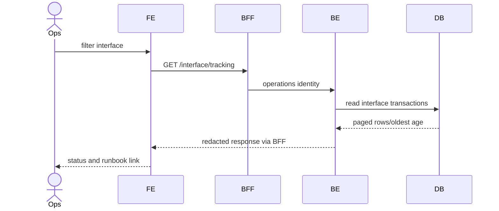

# Feature 08 — Interface Tracking

> Contract status: `TO-BE` · Document status: `Draft`

## 1. งานนี้คืออะไร

ให้ Operations ดูประวัติ/สถานะ interface และรายการ outbox ขาออกที่ยังไม่ publisher-confirmed เกินเกณฑ์ โดย path `pending-ack` คงไว้เพื่อ compatibility ไม่ได้หมายถึง STA business ACK

## 2. ผู้ใช้และผลลัพธ์ที่ต้องการ

ผู้ปฏิบัติการที่ได้รับสิทธิ์ค้นตาม dataName/direction/status/date/business key เห็น retry/error/age และไปใช้ runbook replay ได้โดยไม่แก้ฐานมือ

## 3. ขอบเขตที่ทำและไม่ทำ

ทำ read-only tracking/pending list; ไม่ทำ HTTP ACK, dashboard summary, payload secret viewer หรือปุ่มแก้ statusตรง

## 4. สถานะปัจจุบัน

`TO-BE` API/UI; Batch เขียน/อ่าน interface rows `AS-BUILT`; Job 10 watchdogมีจริง

## 5. สิ่งที่ dev ต้องสร้างหรือแก้

FE tracking screen/tabs; BFF proxy; BE internal controller/query DTO/repository/API-key guard; operations link/runbook—not mutation endpoint

## 6. Flowchart

## 7. Sequence Diagram

## 8. FE contract

Route `/sgi/interface`; tabs all/pending confirm; state filters/page/sort/error; columns id/dataName/direction/businessKey/status/outboxStatus/retry/created/confirmed/error summary Buttons search/clear/view redacted metadata; no raw payload/no direct retry API API 27/28

## 9. BFF contract

Internal/operations permission, exact query/status; strip no security fields because BE response already redacted; request ID/timeout; no cache sensitive results

## 10. BE contract

`SgiInterfaceController.tracking/pendingConfirm`; strict query DTO; service-tokenหรือ operations role per D-011; read repository computes age using DB/current time consistent timezone; never expose credential/full payload/stack

## 11. API contract

GET 27 filters `dataName,direction,status,outboxStatus,from,to,businessKey,page,size`; GET 28 forces `direction=OUT` and `outbox_status IS DISTINCT FROM 'CONFIRMED'` (**NULL-safe — `!=` จะตกแถวที่ยังเป็น NULL**) older threshold Response paged rows; 401/403/422

## 12. Database mapping

R `sgi_interface_transactions`; indexes direction/outbox status/created, dataName/status, business key/message id; no writes

## 13. Workflow/Integration

Rows originate Jobs 4–11 and BE reflow; Job 10 alert counts should reconcile with endpoint 28 at same as-of/filters; publisher confirm—not consumer ACK

## 14. Failure, retry, idempotency และ security

GET safe retry; deterministic sort; payload redaction/least privilege; replay occurs via approved producer/consumer runbook preserving idempotency key; no manual status update

## 15. Test cases และ acceptance criteria

API-27/28, each direction/status/filter/date/page, OUT pending threshold boundary, CONFIRMED excluded, INTERNAL excluded pending tab, Job 10 reconciliation, redact payload/error, permission/query plan

## 16. Code path ที่ต้องสร้าง

FE `src/app/(main)/sgi/interface`; BFF/BE `src/modules/sgi/interface`; reuse entity/schema mapping only after comparing generated DDL

## 17. เอกสารและ Decision ID ที่เกี่ยวข้อง

[Integration](../00-foundation/06-integrations-and-operations.md), [Job 10](../jobs/JOB-10-NotifyNoReceiveData.md), [API Catalog](../references/API-CATALOG.md); D-011, D-012

