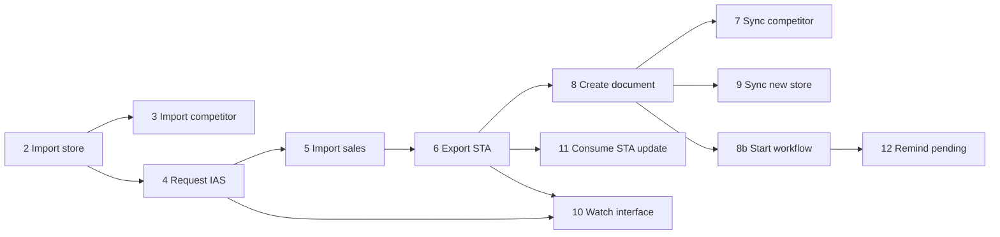

# Job Pipeline Overview — Jobs 2–12 + 8b

> Contract status: `AS-BUILT` · Document status: `Blocked`

## ต้องทำอะไร และเสร็จแล้วได้อะไร

ใช้ตารางนี้จัด dependency และ ownership ของ Batch SGI ทั้ง 12 ตัว TypeScript อยู่ใน `src/modules/sgi/`; schedule ใน code เป็น reference เท่านั้น งาน Infra ต้องทำ dependency จริงใน AWS ตาม D-012

| Job | `JOB_NAME` | Reference schedule | Trigger/dependency | ผลหลัก |
|---|---|---|---|---|
| 2 | `sgi-import-impact-store` | `0 07 7 * *` | monthly | impact process/store |
| 3 | `sgi-import-impact-competitor` | `30 07 7 * *` | after 2 same period | competitor staging |
| 4 | `sgi-prepare-impact-store-to-ias` | `0 16 7-16 * *` | after eligible store | IAS request file/outbox |
| 5 | `sgi-import-impact-sale-from-ias` | `30 16 7-16 * *` | IAS file available | sales/detail/outcome |
| 6 | `sgi-export-impact-store-to-sta` | `0 17 * * *` | daily; QSSI gate for init | STA messages/compensation |
| 8 | `sgi-create-compensation-document` | `0 17 7-31 * *` | eligible compensation | document header |
| 7 | `sgi-sync-competitor-to-document` | `30 17 7-31 * *` | after 8 | document competitors |
| 9 | `sgi-sync-new-store-to-document` | `45 17 7-31 * *` | after 8/6 | document new stores |
| 8b | `sgi-start-internal-workflow` | `30 18 7-31 * *` | after 8, data gates | workflow instance |
| 11 | `sgi-consume-sta-compensate` | queue/idle runner | Rabbit delivery | compensation update |
| 10 | `sgi-notify-no-receive-data` | `0 8 * * *` | daily watchdog | interface alert |
| 12 | `sgi-notify-pending-work` | `0 10 * * 1` | weekly | pending/escalation mail |

ทุก Job: validate ก่อน DB, unknown input field ต้อง reject, รองรับ `dryRun` ตาม DTO, ใช้ advisory lock, structured result/exit, secret จาก environment, และ failure email ไม่เปลี่ยนผลธุรกิจของ transaction

หลักฐาน test ล่าสุดใน `SBP/srm-sps-spsap-sop-sgi-batch/src/modules/sgi/README.md`; ต้องรันซ้ำใน environment ที่ dependency registry ใช้ได้ก่อน release

