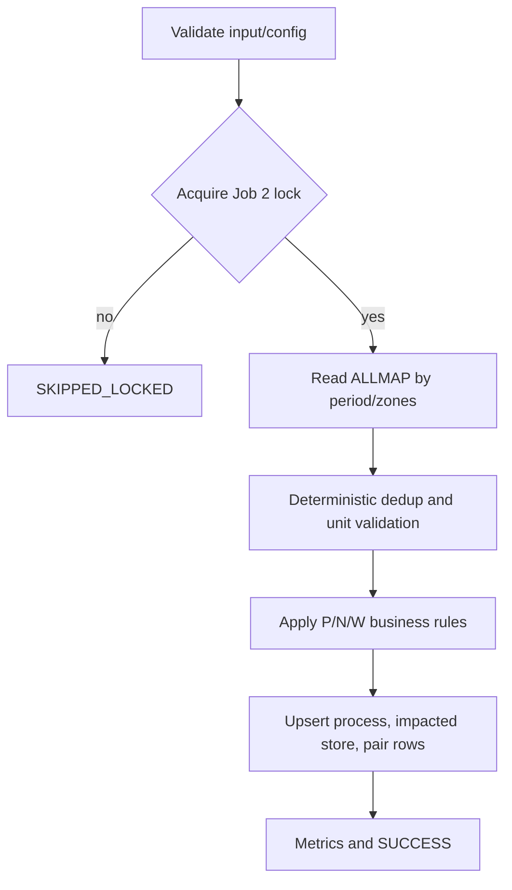
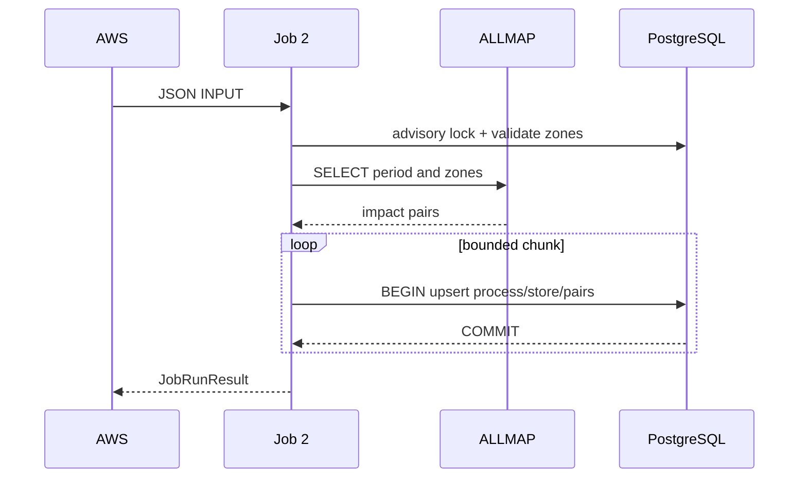

# JOB-02 — ImportImpactStore

> Contract status: `AS-BUILT` · Document status: `Blocked` · Decision: D-003, D-007, D-012

## 1. รับอะไร ทำอะไร ส่งผลไปไหน

อ่านคู่ร้านถูกกระทบ/ร้านเปิดใหม่จาก ALLMAP `allmapssa.SEVEN_IMPACT_VIEW` ของงวด แล้ว dedup, validate หน่วย/ร้าน/โซน, ตัดสิน `verify_status` และ upsert รอบลง PostgreSQL เพื่อให้ Jobs 3/4 เดินต่อ

## 2. AS-BUILT เทียบ requirement

TypeScript ทำงานจริงและมี unit/service DB tests; คงกฎ legacy แต่เพิ่ม strict JSON, deterministic handling, chunk transaction, advisory lock และ fail-closed Legacy Java ใช้ตรวจพฤติกรรม ไม่ใช้ credential/config เดิม

## 3. Schedule, trigger และ dependency

`SGI_JOB2_CRON=0 07 7 * *` เวลา Asia/Bangkok เป็น reference; AWS เป็น trigger จริง ไม่มี predecessor; Job 3 ต้องรอ Job 2 งวดเดียวกันสำเร็จ

## 4. INPUT และ environment variables

`{"year":2026,"month":8,"zones":["BN"],"dryRun":false,"limit":100}`; year/month ต้องมาคู่, ปี ค.ศ. 2000–2999, month 1–12, unknown key reject; ไม่ส่งงวด = เดือนก่อนหน้า Keys: `SGI_ALLMAP_*`, `SGI_JOB2_SOURCE_VIEW`, `*_ALLMAP_YEAR_ERA`, branch rules, `*_STALE_MONTHS`, `*_PROCESS_STATUS`, `*_DATASOURCE`, chunk/distance/mail

## 5. Flowchart

## 6. Sequence Diagram

## 7. Decision Rules

| Rule | ผล |
|---|---|
| source pair ซ้ำ store I+N+period | เลือก deterministic; นับ conflict |
| unit กม./KM/กม. | เก็บ `distance_km` ตรง; เมตรหาร 1,000 |
| unit ว่าง/ไม่รู้จัก หรือ distance นอก `(0,50]` | quarantine/skip + metric; ห้ามเดา |
| มีคู่เดิมงวดเดียวกัน/active overlapping round | ไม่สร้างรอบซ้ำ |
| source `STA` | legacy path P2; เก็บ source แยก |
| eligible franchise/cancel/contract | set P/N/W ตาม tested matrix |
| ALLMAP ต่อได้แต่ 0 rows | SUCCESS + no-data metric |
| ต่อ ALLMAP ไม่ได้ | FAILED non-zero |

## 8. Source-to-target field mapping

| ALLMAP | Target |
|---|---|
| `STORECODE_I` | `sgi_impacted_stores.store_code`, process/store `impacted_store_code` |
| `STORECODE_N` | `sgi_fgi_impact_stores.new_store_code` |
| `PERIOD_YEAR/MONTH` | `period_year/period_month` |
| `DISTANCE`, `DISTANCE_UNIT` | normalized `distance_km` |
| `BRANCHTYPE_*`, zone/radius/url | snapshot fields ตาม DDL/JSON |
| source/create by | `data_source`/`created_by` canonical mapping D-003 |

## 9. SQL และตารางที่อ่าน/เขียน

R: `mas_zone`, `mas_store`, `fr_store`, `juristic`; W: `sgi_impacted_stores`, `sgi_fgi_impact_processes`, `sgi_fgi_impact_stores` SQL ใช้ parameter binding; source view name ผ่าน identifier allowlist

## 10. Transaction boundary

หนึ่ง bounded chunk ต่อ transaction; process parent ต้องสำเร็จก่อน child; chunk fail rollback และ job fail พร้อม count ห้าม commit partial ด้วย `limit` production เว้น `SGI_ALLOW_PARTIAL_IMPORT=true`

## 11. Idempotency, lock, rerun และ concurrent execution

business key = impacted/new store+period; rerun ไม่ reset active round; singleton advisory lock class 861000/object Job 2

## 12. File/message/API contract

ไม่มี file/message output; ALLMAP เป็น read-only SQL contract; INPUT เป็น strict JSON

## 13. Retry, rollback, DLQ/outbox และ error notification

DB/source failure rollback/fail; scheduler bounded retry; invalid row เป็น counted reject ตาม rule; failure notifier ส่งหลังผลล้มและห้ามกลบ original error

## 14. Metrics และ log

sourceRows, duplicateGroups, inserted/updated/skippedActive/rejectedUnit/ruleP/ruleN/ruleW/chunks/duration; log period/zones/runId ไม่ log credential

## 15. Code path จริง

ตรวจสามชั้น: [คำอธิบายกฎ](../../batchjob/JOB-02-ImportImpactStore-อธิบายละเอียด.md) · Java `main/ImportImpactStore.java`, `ImportStoreJdbc.java`, `ImportImpactStoreBatch.java` · TypeScript `src/modules/sgi/job-2-import-impact-store.service.ts`, DTO, `allmap.datasource.ts`, `sgi-job.lock.ts`

## 16. Test

unit service/rule/input/lock/schema/SQL-param specs + `__svc__/job2*.svc.spec.ts`; เพิ่ม ALLMAP contract/no-data/network and AWS definition test before release

## 17. Runbook local/AWS Batch

Local: `JOB_NAME=sgi-import-impact-store INPUT='{"year":2026,"month":8}' npm run start` หรือ script เต็ม AWS: JSON argv + job name; ตรวจ lock/no-data/counts แล้วค่อยเปิด Job 3

## 18. BLOCKED

D-007 initial/domain `process_status`; D-003 vocabulary source; D-012 schedule/dependency; ยืนยัน source view schema/privilege และ business policy แถว W ก่อน production
