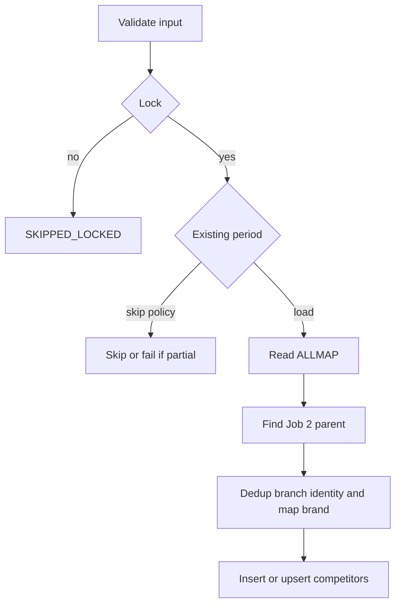
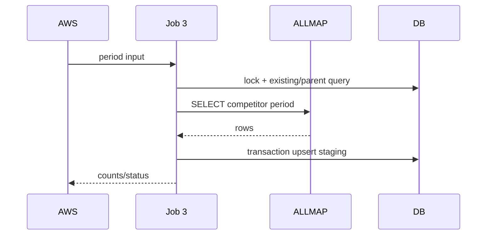

# JOB-03 — ImportImpactCompetitor

> Contract status: `AS-BUILT` · Document status: `Blocked` · Decision: D-003, D-012

## 1. รับอะไร ทำอะไร ส่งผลไปไหน

อ่านคู่แข่งจาก ALLMAP `COMPETITOR_IMPACT_VIEW` ของงวด จับ parent ที่ Job 2 สร้าง map brand เท่าที่ทำได้ และเก็บ branch competitor เพื่อ Job 7 ยกเข้าเอกสาร

## 2. AS-BUILT เทียบ requirement

TypeScript มี strict input, dedup key สำหรับ code ว่าง, missing-parent policy, existing-period policy และ test จริง ต่างจาก Java ที่ dedup/skip ทั้งงวดและไม่มี unique constraint ที่รับรอง

## 3. Schedule, trigger และ dependency

reference `30 07 7 * *`; ต้องเป็น explicit dependency หลัง Job 2 same period; ไม่มี zone filter ตาม legacy behavior

## 4. INPUT และ environment variables

`{"year":2026,"month":8,"dryRun":false,"limit":100}`; year/month pair, no zones Keys: `SGI_ALLMAP_*`, `SGI_JOB3_SOURCE_VIEW`, `*_ALLMAP_YEAR_ERA`, `*_MISSING_PARENT=skip`, `*_ON_EXISTING=skip`, chunk/mail

## 5. Flowchart

## 6. Sequence Diagram

## 7. Decision Rules

| Rule | ผล |
|---|---|
| period มีข้อมูลครบและ policy skip | no-op success |
| existing partial | fail closed; ใช้ `upsert` เฉพาะ rerun ที่ตั้งใจ |
| parent process ไม่พบ | default skip+count; `fail` ทำให้ทั้ง job fail |
| competitor branch code มี | dedup ต่อ process+code |
| code ว่าง | normalized NULL; dedup ด้วยชื่อสาขา canonical |
| brand map ไม่พบ | เก็บ branch โดย `brand_code=NULL`; metric |
| source 0 row | SUCCESS; connection error = FAILED |

## 8. Source-to-target field mapping

`STORECODE_I`+period → parent `impact_process_id`; competitor id/code → `competitor_store_code`; `NAME_TH/NAME/BRANCH_TH`, zone/subzone/open/close → staging columns; brand mapping → `brand_code`; `DATASOURCE` → `data_source`

## 9. SQL และตารางที่อ่าน/เขียน

R: `sgi_fgi_impact_processes`, `sgi_competitors`, `mas_store`; W: `sgi_fgi_impact_competitors`; source ALLMAP read-only

## 10. Transaction boundary

bounded upsert chunks; parent FK mandatory; failure rollback current chunk and fail job with processed counts

## 11. Idempotency, lock, rerun และ concurrent execution

unique identity follows DDL competitor key; `onExisting` controls period rerun; advisory Job 3 lock; never run same period before Job 2 completion

## 12. File/message/API contract

ไม่มี output transport; input/view schema เป็น contract; no zones field intentionally

## 13. Retry, rollback, DLQ/outbox และ error notification

source/DB transient retry by scheduler; missing parent is policy not silent loss—metric and sample keys; no DLQ/outbox

## 14. Metrics และ log

source, mapped, unmappedBrand, missingParent, duplicate, inserted/updated, partialExisting, chunks/duration

## 15. Code path จริง

ตรวจสามชั้น: [คำอธิบายกฎ](../../batchjob/JOB-03-ImportImpactCompetitor-อธิบายละเอียด.md) · Java `main/ImportImpactCompetitor.java`, `ImportJdbc.java`, `ImpactCompetitorBatch.java` · TypeScript `job-3-import-impact-competitor.service.ts`, DTO, `competitor-key.ts`, unit/`__svc__` specs

## 16. Test

11-rule matrix, identity/code-null, missing parent skip/fail, existing skip/upsert/partial, constraint/service PostgreSQL, connection/no-data

## 17. Runbook local/AWS Batch

`JOB_NAME=sgi-import-impact-competitor INPUT='{"year":2026,"month":8}' npm run start`; เทียบ Job 2 parent count ก่อน; upsert rerun ต้องบันทึกเหตุผล

## 18. BLOCKED

D-003 source vocabulary, D-012 explicit dependency; owner ALLMAP ต้องรับรอง view/brand semantics
