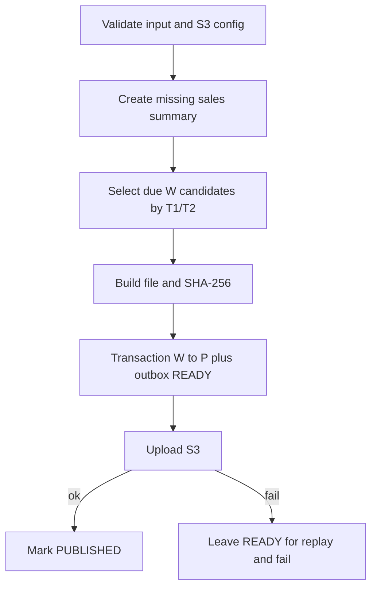

# JOB-04 — PrepareImpactStoreToIAS

> Contract status: `AS-BUILT` · Document status: `Blocked` · Decision: D-008, D-012

## 1. รับอะไร ทำอะไร ส่งผลไปไหน

สร้างหัว sales summary สำหรับคู่ที่ผ่านเกณฑ์ คัดร้านถึงวันขอยอด สร้างไฟล์ 2 field และ outbox แล้วอัปโหลด S3 ให้ IAS

## 2. AS-BUILT เทียบ requirement

TypeScript แก้จุด legacy ที่เปลี่ยน DB เป็น P ก่อนเขียนไฟล์ โดย commit `W→P` กับ outbox READY แล้ว upload; upload fail ยัง replay ได้ มี hash/tangle guard แต่ exact file contract ยังรอ IAS

## 3. Schedule, trigger และ dependency

reference ทุกวัน 7–16 เวลา 16:00; หลัง Job 2; Job 5 เริ่มเมื่อ IAS วาง response

## 4. INPUT และ environment variables

`{"dryRun":false,"limit":100,"asOfDate":"2026-09-15"}`; ไม่รับ year/month Keys: `SGI_JOB4_S3_BUCKET/KEY/BACKUP_KEY`, file prefix/ext/seconds/encoding/line separator/trailing newline, interval 12 months/15 days, source ALM, allow-tangle, chunk/mail

## 5. Flowchart



## 6. Sequence Diagram

```mermaid
sequenceDiagram
  participant AWS
  participant J4 as Job 4
  participant DB
  participant S3
  AWS->>J4: dryRun/limit/asOfDate
  J4->>DB: select eligible + create summary
  J4->>DB: BEGIN status P + outbox READY
  DB-->>J4: COMMIT
  J4->>S3: putObject(file, hash)
  alt upload success
    J4->>DB: outbox PUBLISHED
  else failure
    J4-->>AWS: FAILED; READY retained
  end
```

## 7. Decision Rules

| Rule | ผล |
|---|---|
| eligible pair `verify_status=P` และ source policy | สร้าง summary ครั้งเดียว |
| T1/T2 due จาก open date + interval | ขอข้อมูล |
| หลาย new stores | เลือก opening date เร็วสุดตาม tested rule |
| ไม่มี candidate | SUCCESS no file |
| unresolved READY/PUBLISHED same business key | tangle guard ห้ามสร้างซ้อน default |

## 8. Source-to-target field mapping

`impacted_store_code` + selected new-store open date → line `storeCode|YYYYMMDD`; process/pair → sales summary; filename/hash/key/count → `sgi_interface_transactions`

## 9. SQL และตารางที่อ่าน/เขียน

R: `sgi_fgi_impact_processes`, `sgi_fgi_impact_stores`, `mas_store`; W: `sgi_fgi_impact_sales_summaries`, pair request status, `sgi_interface_transactions`

## 10. Transaction boundary

summary creation transaction; claim status+outbox atomic; S3 outside DB transaction; state transition after upload

## 11. Idempotency, lock, rerun และ concurrent execution

business key/hash prevent duplicate file; advisory lock; replay existing READY rather than create new unless explicitly approved config

## 12. File/message/API contract

default `AMS06001O_...txt`, UTF-8, LF, no trailing newline; each line `storeCode|openDate`; S3 outgoing/backup prefixes—`BLOCKED D-008`

## 13. Retry, rollback, DLQ/outbox และ error notification

S3 failure leaves READY; retry publishes same content/key/hash; DB failure rollback; no DLQ; failure email secondary

## 14. Metrics และ log

summaryCreated, candidates, lines, fileKey/hash, READY/PUBLISHED/failed, tangled, oldestReadyAge, duration

## 15. Code path จริง

ตรวจสามชั้น: [คำอธิบายกฎ](../../batchjob/JOB-04-PrepareImpactStoreToIAS-อธิบายละเอียด.md) · Java `main/PrepareImpactStoreToIAS.java`, `ExportJdbc.java`, `UpdateImpactSaleFromIASBatch.java` · TypeScript `job-4-prepare-impact-store-to-ias.service.ts`, DTO, S3/outbox/lock specs

## 16. Test

T1/T2 boundaries, earliest opening, status/outbox atomicity, S3 fail replay, filename/newline/hash, tangle, dryRun/concurrency/PostgreSQL

## 17. Runbook local/AWS Batch

ตั้ง bucket/credential; `JOB_NAME=sgi-prepare-impact-store-to-ias INPUT='{}' npm run start`; ตรวจ READY เก่าและ S3 object/hash ก่อนให้ IAS รับ

## 18. BLOCKED

D-008 IAS ยืนยัน filename seconds/encoding/LF/trailing newline; D-012 dependency; source `ALM` inclusion และ tangle override ต้อง business sign-off
