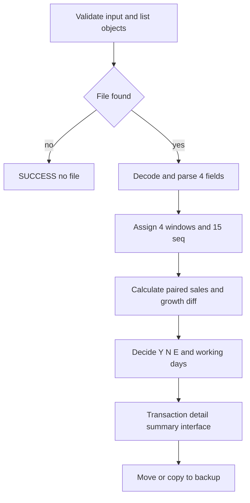
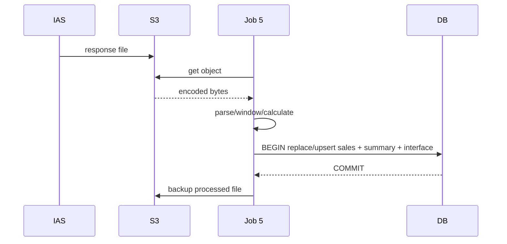

# JOB-05 — ImportImpactSaleFromIAS

> Contract status: `AS-BUILT` · Document status: `Blocked` · Decision: D-008, D-012

## 1. รับอะไร ทำอะไร ส่งผลไปไหน

ค้น/รับไฟล์ยอดขาย IAS จาก S3 ตรวจ schema จัดยอด 4 หน้าต่าง × 15 วัน คำนวณ growth difference และสถานะ แล้วเก็บ detail/summary เพื่อ Jobs 6/8b และหน้าข้อมูลยอดขาย

## 2. AS-BUILT เทียบ requirement

TypeScript แยก unmatched/out-of-window/invalid, strict input, atomic DB write, backup และ outcome tests; รักษากฎ leap day/divide-by-zero/60 working days จาก legacy

## 3. Schedule, trigger และ dependency

reference 7–16 เวลา 16:30; ต้องมี request จาก Job 4 และ IAS response object; downstream 6/8/8b หลัง commit

## 4. INPUT และ environment variables

รับ `bucket`, `fileKey`, `url` หรือ `urls`, `dryRun`; unknown reject Keys: S3 in/backup, `ENCODING=win874`, regex filename, data name, 60 days, outlier 50%, null diff status, invalid line policy, max out-of-window ratio, chunk/mail

## 5. Flowchart

## 6. Sequence Diagram

## 7. Decision Rules

| Rule | ผล |
|---|---|
| filename/schema invalid | reject or fail by config; count samples |
| date outside 4 windows | reject; fail if ratio over configured ceiling |
| paired denominator zero | `growth_rate_diff=NULL` |
| working days <60 | status pending/error ตาม outcome helper |
| diff/outlier threshold ≥50 | exclude/match per tested legacy rule |
| no file | SUCCESS; unreadable file = FAILED |
| `sales_status=Y` | มีข้อมูลผ่าน; ไม่ได้แปลว่าเปิด workflow |

## 8. Source-to-target field mapping

file fields store/date/sales/type → `sgi_sales_transactions` (`txn_date`, `window_no`, `seq`, values); grouped counts/averages/diff/status → `sgi_fgi_impact_sales_summaries`; file metadata/result → interface transaction

## 9. SQL และตารางที่อ่าน/เขียน

R: process, impact stores, summary, `mas_store`; W: `sgi_sales_transactions`, summary/status, pair request status, `sgi_interface_transactions`

## 10. Transaction boundary

file business write atomic; invalid consistency aborts before commit; S3 backup after DB commit with recoverable marker/retry

## 11. Idempotency, lock, rerun และ concurrent execution

file hash/key/message metadata dedup; sales unique key; rerun yields same summary and does not duplicate detail; Job 5 advisory lock

## 12. File/message/API contract

default input pattern `ams06001i_\d{12}.txt`, Windows-874, 4 pipe fieldsตาม IAS; exact acceptance D-008

## 13. Retry, rollback, DLQ/outbox และ error notification

parse/business rejects quarantined/count; DB rollback entire file; S3/network scheduler retry; backup failure alert without reapplying duplicate business rows

## 14. Metrics และ log

files/lines/valid/invalid/unmatched/outOfWindow/workingDays/statusY/N/E/nullDiff/backedUp/duration; no raw sales/person data dump

## 15. Code path จริง

ตรวจสามชั้น: [คำอธิบายกฎ](../../batchjob/JOB-05-ImportImpactSaleFromIAS-อธิบายละเอียด.md) · Java `main/ImportImpactSaleFromIAS.java`, `ImportService.manageImpactSale`, `InsertImpactSaleTrnFromIASBatch.java` · TypeScript `job-5-import-impact-sale-from-ias.service.ts`, DTO, window/growth/outcome helpers

## 16. Test

window/leap day/60-day/outlier/divide-zero/null outcome, invalid ratio, file replay, DB rollback, backup failure, svc lifecycle

## 17. Runbook local/AWS Batch

ตั้ง S3; `JOB_NAME=sgi-import-impact-sale-from-ias INPUT='{"fileKey":"interface/in/IAS/...txt"}' npm run start`; reconcile line/summary counts ก่อนเปิด downstream

## 18. BLOCKED

D-008 encoding/schema/name/backup handshake; D-012 event/dependency; owner Business ยืนยัน null-diff status และ invalid-line policy production
