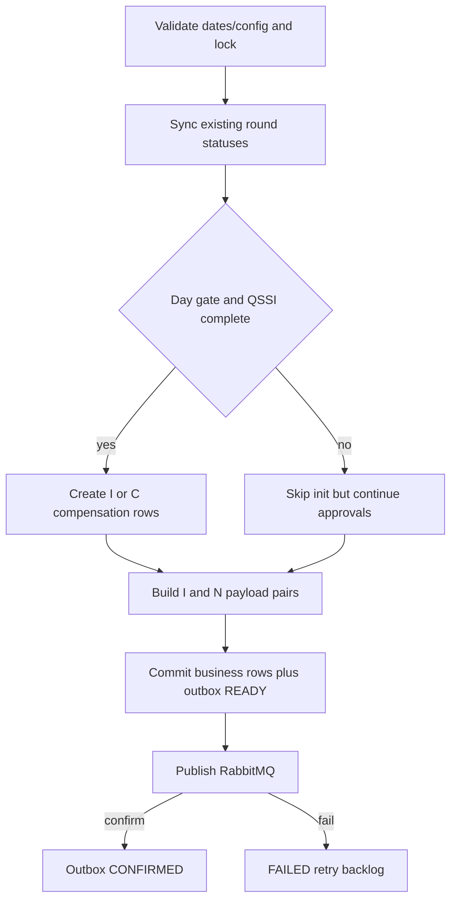
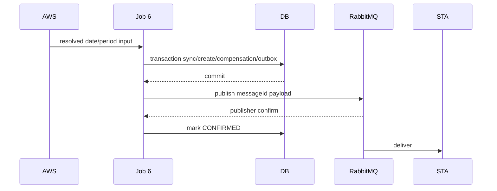

# JOB-06 — ExportImpactStoreToSTA

> Contract status: `AS-BUILT` · Document status: `Blocked` · Decision: D-001, D-009, D-012

## 1. รับอะไร ทำอะไร ส่งผลไปไหน

ซิงก์สถานะรอบชดเชย เปิดงวดใหม่เมื่อถึงวันและ QSSI ครบ คำนวณ/จัดคู่ยอดร้านถูกกระทบกับร้านใหม่ สร้าง outbox แล้ว publish ข้อความ init/approve ไป STA

## 2. AS-BUILT เทียบ requirement

TypeScript แยก `runDate`, `syncPeriod`, `qssiPeriod`, `forceCreateData` จาก argument legacy ที่ค่าเดียวคุมสามเรื่อง เพิ่ม outbox/publisher confirm, backlog retry และ mutation tests; DB state `Z` map เป็น `S` เฉพาะ payload

## 3. Schedule, trigger และ dependency

reference daily 17:00; downstream จาก Job 5/QSSI owner; Job 8/9 ใช้ compensation rows และ Job 10 เฝ้า outbox

## 4. INPUT และ environment variables

`{"runDate":"2026-09-15","syncPeriod":"2026-09","qssiPeriod":"2026-08","forceCreateData":true,"dryRun":false}`; unknown reject Keys: start day 7, wait pay 3, QSSI categories `8,9,12,1,10,16`, backlog/retry/chunk, MQ exchange/routing/dataName/sender/mail

## 5. Flowchart

## 6. Sequence Diagram

## 7. Decision Rules

| Rule | ผล |
|---|---|
| day < init start day | sync existing only; no new INIT |
| QSSI 6 categories incomplete | skip new INIT but send existing A/N/S/Z |
| store closed/cancel type 01/02/03/04/08 | initial status `C`; otherwise `I` |
| status I/C | message pair `COMPENSATE_INIT_I/N` |
| status A/N/S/Z | message pair `COMPENSATE_APPROVE_I/N` |
| DB status Z | payload status S only; DB remains Z |
| pending backlog below retry ceiling | resend same message/business key |

## 8. Source-to-target field mapping

process/period/store/sales/QSSI → impact compensation; new-store percent/amount → `sgi_fgi_new_store_compensations`; envelope/payload/hash/messageId → `sgi_interface_transactions`; status mapping → STA `sgi_impact_store` message

## 9. SQL และตารางที่อ่าน/เขียน

R: `fcs_qssi_score`, `mas_store`, `fr_store`, `mas_param`, process/store/sales/compensation; W: process/status, `sgi_fgi_impact_compensations`, `sgi_fgi_new_store_compensations`, impact-store flags, interface outbox

## 10. Transaction boundary

9 logical sync/create mutations และ outbox ของแต่ละ business group commit atomically; MQ publish หลัง commit; confirm update แยก transaction

## 11. Idempotency, lock, rerun และ concurrent execution

business/message key unique; claim backlog ด้วย lock; advisory Job 6; rerunไม่สร้าง compensation ซ้ำและ publish same logical event once/effectively-once

## 12. File/message/API contract

Rabbit exchange `sgi.interface`, routing `sta.compensation.result`, data name `sgi_impact_store`; payload I/N เป็นคู่และมี message id/version; schema ต้องตรง STA source spec

## 13. Retry, rollback, DLQ/outbox และ error notification

publish fail → outbox `FAILED` และ bounded resend max 10 โดย loader claim ทั้ง `READY`/`FAILED`; confirm timeoutไม่ถือว่า business ACK; poison/config/db fail non-zero + mail; DLQ ownershipร่วม STA/Infra

## 14. Metrics และ log

sync updates, init candidates/created/skippedQssi, status counts, pair messages, published/confirmed/retryExhausted, backlog oldest age, QSSI missing consecutive runs

## 15. Code path จริง

ตรวจสามชั้น: [คำอธิบายกฎ legacy ชื่อ FS](../../batchjob/JOB-06-ExportImpactStoreToFS-อธิบายละเอียด.md) · Java `main/ExportImpactStoreToFS.java`, `ExportController.java`, `ExportJdbc.java` · TypeScript `job-6-export-impact-store-to-sta.service.ts`, DTO, `job-6-sta-payload.ts`, `sgi-sta.publisher.ts`

## 16. Test

date/QSSI/status gates, 9 mutations, payload mapping Z→S, pair/count/money, outbox atomicity, publisher confirm/retry ceiling, DB svc/lifecycle

## 17. Runbook local/AWS Batch

ตั้ง MQ/DB; `JOB_NAME=sgi-export-impact-store-to-sta INPUT='{"runDate":"2026-09-15"}' npm run start`; ตรวจ QSSI/gate/backlog/DLQ ก่อน rerun; ห้ามใช้ force โดยไม่มี ticket

## 18. BLOCKED

STA รับรอง schema/routing/DLQ/replay, D-009 consistency/unknown policyร่วม Job 11, D-012 schedule/resources; D-001 ถ้า amount routing ถูกใช้ downstream
