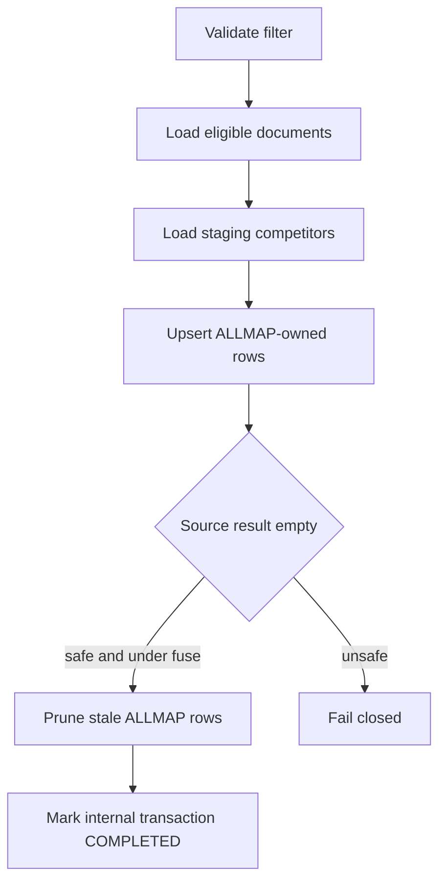
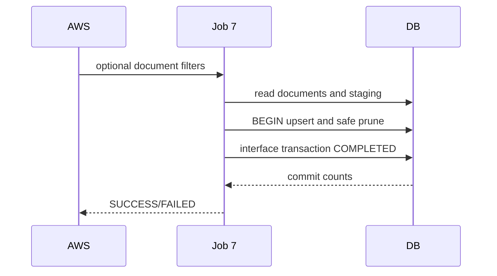

# JOB-07 — SyncCompetitorToDocument

> Contract status: `AS-BUILT` · Document status: `Blocked` · Decision: D-003, D-012

## 1. รับอะไร ทำอะไร ส่งผลไปไหน

อ่าน competitor staging ล่าสุดของ impact process แล้ว upsert ลง `sgi_document_competitors` ของเอกสารที่ Job 8 สร้าง โดยแตะเฉพาะแถว source ของ ALLMAP และบันทึก internal interface transaction

## 2. AS-BUILT เทียบ requirement

TypeScript เปลี่ยนการส่งไฟล์ K2 legacy เป็น DB sync, มี empty-prune fuse, deterministic identity, timeout, idempotent upsert และ test matrix

## 3. Schedule, trigger และ dependency

reference 17:30 วันที่ 7–31; ต้องรันหลัง Job 8 และ Job 3; Job 8b อาจต้องรอข้อมูลนี้ตาม gate

## 4. INPUT และ environment variables

`{"docNo":"2026/00001","impactedStoreCode":"01234","periodKey":"2026-08","datasource":"ALM","dryRun":false}` optional filters Keys: `SGI_JOB7_DATASOURCE=ALM`, `SOURCE_SYSTEM=ALLMAP`, empty prune max 50, chunk/mail

## 5. Flowchart

## 6. Sequence Diagram

## 7. Decision Rules

| Rule | ผล |
|---|---|
| no document | SUCCESS no-op |
| staging row brand map unknown | preserve branch identity/null brandตาม source |
| user-created document competitor | never update/delete |
| staging empty for many documents | fuse fail; no mass prune |
| source `ALM` staging | target `source_system=ALLMAP` per D-003 |

## 8. Source-to-target field mapping

staging branch code/name/brand/open/close/zone → document competitor fields; target `doc_no`; source identity retained; interface reference uses doc/process business key

## 9. SQL และตารางที่อ่าน/เขียน

R: `sgi_compensation_documents`, process/compensation, `sgi_fgi_impact_competitors`; W: `sgi_document_competitors`, `sgi_interface_transactions`

## 10. Transaction boundary

หนึ่ง bounded document chunk: upsert + prune + internal completion atomic; failure rollback current chunk and fail job

## 11. Idempotency, lock, rerun และ concurrent execution

unique document/source competitor identity; advisory Job 7; rerun converges to staging state; prune scoped by `source_system`

## 12. File/message/API contract

ไม่มีไฟล์ใหม่; แทน legacy BPM file ด้วย internal DB contract; Job result strict

## 13. Retry, rollback, DLQ/outbox และ error notification

DB transient scheduler retry; fuse/config/data error fail without delete; internal transaction FAILED/COMPLETED + notifier

## 14. Metrics และ log

documents, sourceRows, inserted/updated/pruned, userRowsPreserved, emptyDocs, fuseTriggered, duration/sample keys

## 15. Code path จริง

ตรวจสามชั้น: [คำอธิบายกฎ](../../batchjob/JOB-07-SyncCompetitorToDocument-อธิบายละเอียด.md) · Java `main/ExportCompetitor.java`, `ExportController.exportCompetitorToBPM`, `ExportJdbc.queryCompetitorToBPM` · TypeScript `job-7-sync-competitor-to-document.service.ts`, input DTO, matrix/prune/timeout specs

## 16. Test

eligibility, mapping/null brand, user row preservation, upsert/prune/rerun, empty fuse, datasource, transaction rollback/PostgreSQL

## 17. Runbook local/AWS Batch

dry-run filtered doc ก่อนทั้งงวด; `JOB_NAME=sgi-sync-competitor-to-document INPUT='{"docNo":"2026/00001","dryRun":true}' npm run start`; ตรวจ counts/fuse

## 18. BLOCKED

D-003 ALM/ALLMAP semantics และ D-012 dependency; Business รับรอง empty-source prune และ Job 8b gating
