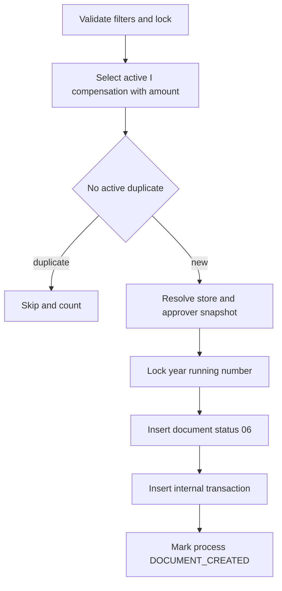
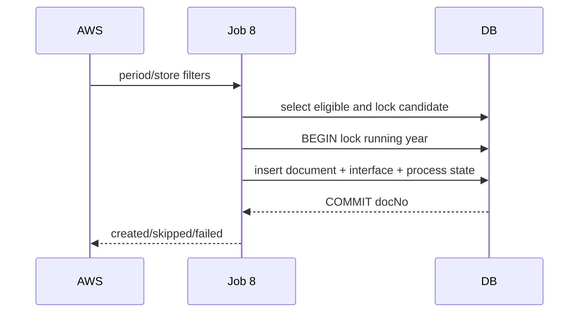

# JOB-08 — CreateCompensationDocument

> Contract status: `AS-BUILT` · Document status: `Blocked` · Decision: D-002, D-006, D-012

## 1. รับอะไร ทำอะไร ส่งผลไปไหน

คัด compensation status `I` ที่มี forecast/adjust แล้ว สร้าง document header/snapshot เลข `YYYY/xxxxx` และ internal transaction เพื่อให้ Jobs 7/9 เติมลูกและ Job 8b เปิด workflow

## 2. AS-BUILT เทียบ requirement

TypeScript แทนไฟล์ BPM06001O ของ K2 เดิมด้วย DB document, ใช้ atomic running number, active-document guard, approver snapshot และ concurrency tests; ไม่เปิด workflow ใน Job นี้

## 3. Schedule, trigger และ dependency

reference 17:00 วันที่ 7–31; หลัง Job 6 สร้าง compensation; Jobs 7/9/8b ต้อง depend หลัง commit

## 4. INPUT และ environment variables

`{"compensateMonth":"2026-08","period":"2026-08","impactedStoreCode":"01234","dryRun":false}` optional filters Keys: dataName `DOCUMENT_CREATE`, initial status/section 06, DV group 15, max running 99999, chunk/mail

## 5. Flowchart

## 6. Sequence Diagram

## 7. Decision Rules

| Rule | ผล |
|---|---|
| process inactive หรือ compensationไม่ใช่ I/amount null | ไม่สร้าง |
| active document same store+period | skip duplicate |
| closed document same key | สร้าง round ใหม่ได้ตาม business contract |
| adjust amount มีค่า | effective amount ใช้ adjust ก่อน forecast แต่เก็บ provenance |
| store/approver required data ขาด | fail candidate + observable; ห้ามเอกสารครึ่งใบ |
| running >99999 | fail year exhaustion |

## 8. Source-to-target field mapping

process id/store/period/source → document business fields; compensation forecast/adjust → amount fields; master/business user → store/approver snapshot; running year → `doc_no`; source ids → trace fields

## 9. SQL และตารางที่อ่าน/เขียน

R: process/compensation/new compensation, `sgi_impacted_stores`, `mas_store`, `business_user`; W: `sgi_document_running_numbers`, `sgi_compensation_documents`, `sgi_interface_transactions`, process status

## 10. Transaction boundary

ต่อเอกสาร: lock candidate + running number + insert header/internal transaction + source state commit เดียว

## 11. Idempotency, lock, rerun และ concurrent execution

partial unique active business key; row lock running/year; advisory Job 8; concurrent runners yield one document/unique numbers without gaps guarantee only as transaction permits

## 12. File/message/API contract

ไม่มี legacy file; internal DB transaction dataName `DOCUMENT_CREATE`; document number external display contract

## 13. Retry, rollback, DLQ/outbox และ error notification

constraint conflict re-read/classify duplicate; DB failure rollback whole doc; missing master fail/count/mail; no external publish

## 14. Metrics และ log

candidates, created, duplicateActive, missingStore/Approver, runningAllocated, failed, docNo samples, duration

## 15. Code path จริง

ตรวจสามชั้น: [คำอธิบายกฎ](../../batchjob/JOB-08-CreateCompensationDocument-อธิบายละเอียด.md) · Java `main/ExportImpactStoreFlowToBPM.java`, `ExportController.manageImpactStoreToBPM`, `ExportJdbc.queryImpactStoreToBPM` · TypeScript `job-8-create-compensation-document.service.ts`, input DTO, document-number/concurrency/matrix/svc specs

## 16. Test

eligibility/status/amount, active vs closed duplicate, adjust precedence, running concurrency/exhaustion/rollback, missing data, lifecycle chain

## 17. Runbook local/AWS Batch

dry-run filter period; `JOB_NAME=sgi-create-compensation-document INPUT='{"compensateMonth":"2026-08"}' npm run start`; reconcile source compensationกับ created docs ก่อนปล่อย child jobs

## 18. BLOCKED

D-002 snapshot/config source, D-006 approver/email ownership, D-012 dependency; Business/DBA รับรอง active uniqueness/round behavior/migration running seed
