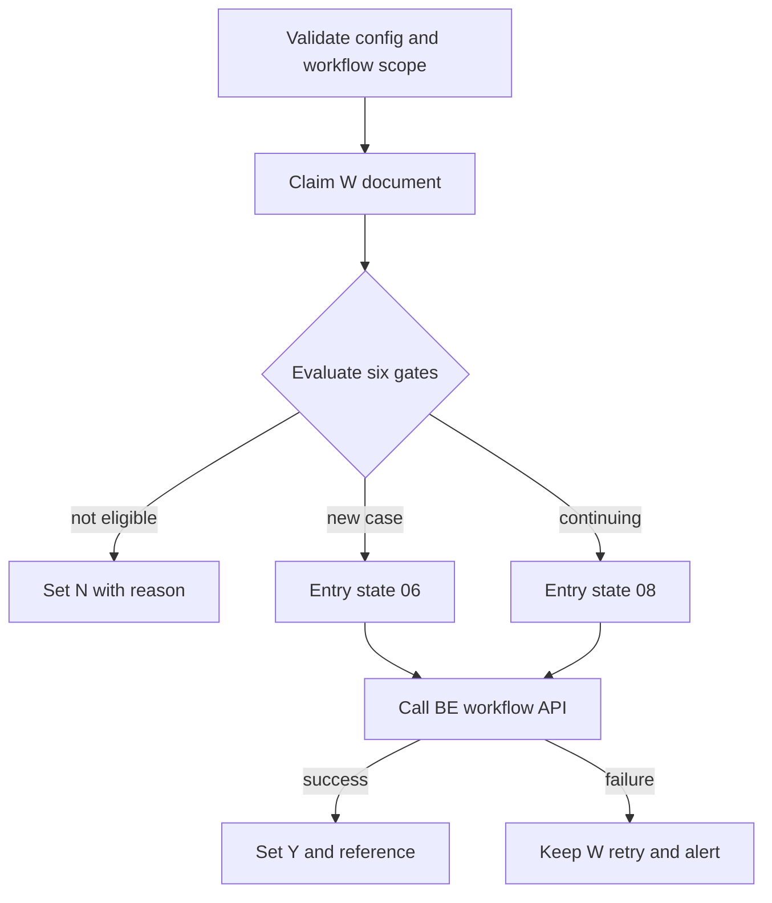
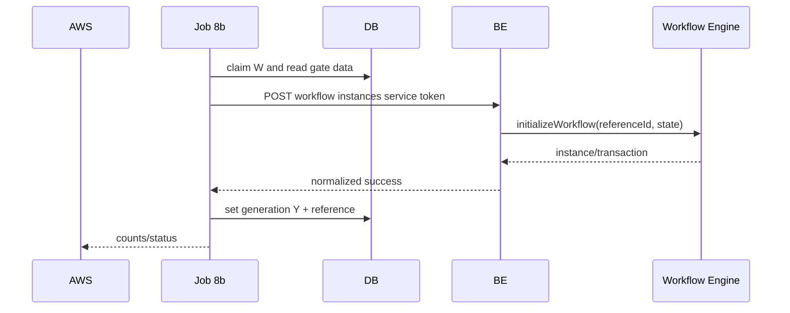

# JOB-08b — StartInternalWorkflow

> Contract status: `AS-BUILT` Batch client + `TO-BE` BE endpoint · Document status: `Blocked` · Decision: D-004, D-006, D-012

## 1. รับอะไร ทำอะไร ส่งผลไปไหน

คัดเอกสารที่ยัง `workflow_generation_status=W`, ใช้ Gen Flow Gate เลือกจุดเข้า 06/08/ไม่เปิด แล้วเรียก `POST /api/v1/sgi/workflow/instances` เพื่อให้ Store BE เปิด engine และอัปเดต Y/N

## 2. AS-BUILT เทียบ requirement

Batch service/client/retry/gate tests มีจริง แต่ endpoint/WorkflowGateway ฝั่ง BE ยัง `TO-BE`; Java เดิมเรียก K2 REST โดย Basic Auth และตรวจคำใน response ซึ่งห้ามลอก

## 3. Schedule, trigger และ dependency

reference 18:30 วันที่ 7–31; หลัง Job 8 และข้อมูล Job 5/7/9 ที่ gate ต้องใช้; Job 12 เฝ้า instance ที่เปิดแล้ว

## 4. INPUT และ environment variables

simple `{"dryRun":false}` Keys: `SGI_BE_BASE_URL`, secret `SGI_SERVICE_TOKEN`, path, timeout 15s/retries 2/delay, wait alert 14 days, branch types, growth threshold -10, zero max 3, state new 06/continuing 08, workflow version IDs, mail

## 5. Flowchart

## 6. Sequence Diagram

## 7. Decision Rules

| Gate | ผล |
|---|---|
| required document/process/approver data missing | N หรือ W ตาม documented gate reason; observable |
| new case eligible | entry 06 |
| continuing compensation eligible | entry 08 |
| branch type not in configured set | no workflow |
| growth/zero-month rules | routeตาม gate helper; zero 1–3 ไม่หยุด, month 4 stop |
| API timeout/5xx | bounded retry, keep W; ห้าม mark Y |

## 8. Source-to-target field mapping

document `id` → engine `referenceId` string; doc/store/period/snapshot → initialize metadata; selected entry → state code; engine instance/transaction → document workflow reference/status

## 9. SQL และตารางที่อ่าน/เขียน

R: document, process, sales summary, compensation, impacted store, store/fr/juristic/business user/`mas_param`; W: workflow generation fields on process/document only; workflow tablesผ่าน BE/engine

## 10. Transaction boundary

claim/gate read and state transitions explicit; HTTP outside long DB transaction; update Y only after confirmed API success; replay by same reference id

## 11. Idempotency, lock, rerun และ concurrent execution

advisory Job 8b + claim; engine idempotency on referenceId required D-004; W rerun safe, Y/N not reopened without controlled command

## 12. File/message/API contract

POST body contains referenceId/document/entry/business idempotency key; service token only; response returns instance/transaction/status; details F02/API-24

## 13. Retry, rollback, DLQ/outbox และ error notification

HTTP 2 retries bounded; 4xx configuration/business fail no blind retry; waiting W ≥14 days alert; no direct DLQ; notifier must not mark success

## 14. Metrics และ log

candidates, gateRejected by reason, entry06/08, API attempts/success/failure, W age, Y/N, latency; no token/PII

## 15. Code path จริง

ตรวจสามชั้น: [คำอธิบายกฎ](../../batchjob/JOB-08b-StartInternalWorkflow-อธิบายละเอียด.md) · Java `main/StartK2WorkFlow.java`, `StartFlowProcessService.java`, `StartFlowJdbc.java` · TypeScript `job-8b-start-internal-workflow.service.ts`, gate/API client/scope specs; BE path `TO-BE`

## 16. Test

six gates, thresholds/zero periods, entry mapping, missing approver, API timeout/retry/4xx, duplicate reference, W/Y/N and svc chain

## 17. Runbook local/AWS Batch

ตั้ง BE URL/token/version IDs; smoke `dryRun`; จากนั้น `JOB_NAME=sgi-start-internal-workflow INPUT='{}' npm run start`; ตรวจ W backlog/BE logs/engine reference

## 18. BLOCKED

D-004 definition/version/idempotency, D-006 approver/alert recipient, D-012 dependency; BE API ยังไม่มี implementation จึงห้าม production
